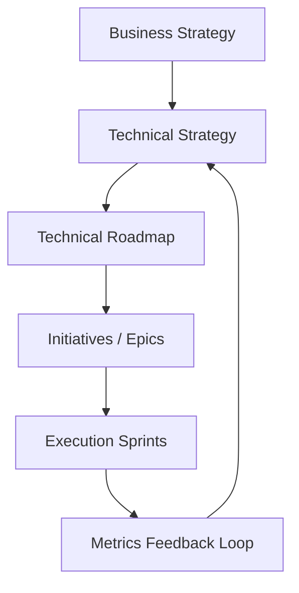
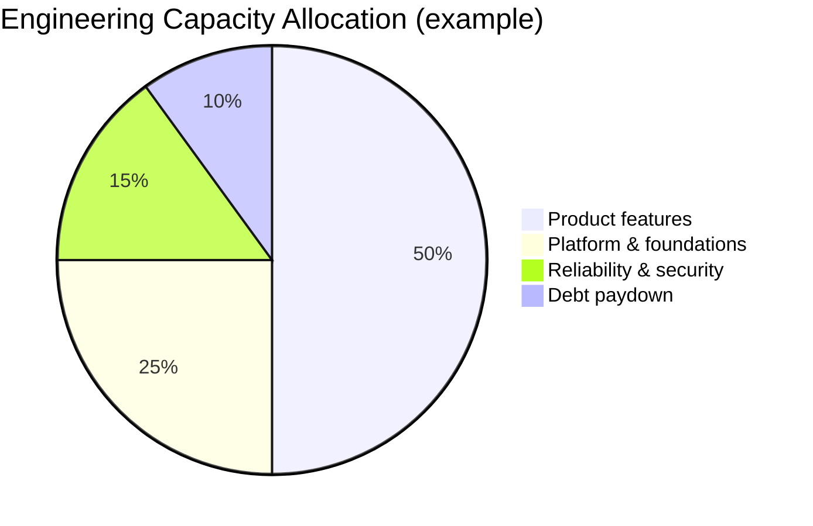
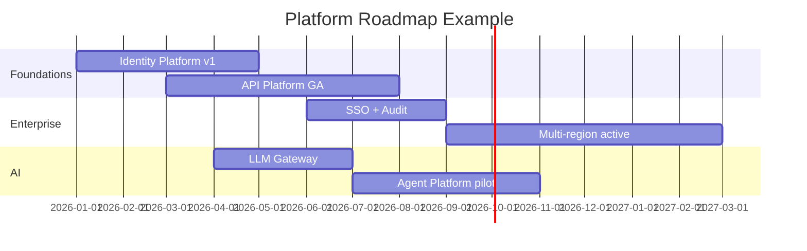

# Technical Strategy and Roadmaps

## 1. Executive Summary

**Technical strategy** defines how an organization will evolve its systems, platforms, and engineering capabilities over 12–36 months to achieve business outcomes—revenue growth, cost efficiency, risk reduction, and speed of delivery. A **technical roadmap** translates strategy into sequenced initiatives with dependencies, investment levels, measurable outcomes, and explicit **tradeoffs deferred or accepted**.

Principal architects own the connective tissue between **executive intent** ("enter enterprise market") and **engineering work** ("build SSO, audit logs, multi-tenant isolation"). This is not a Gantt chart of features—it is an **investment portfolio** balancing product bets, platform foundations, reliability, security, and technical debt retirement, aligned to OKRs and capacity reality.

Effective strategy answers: *Where are we going? Why now? What will we not do? How will we know we arrived?* Roadmaps without strategy are wish lists; strategy without roadmaps is slideware.

## 2. Why This Topic Matters

Distinguished engineer and principal interviews increasingly evaluate **organizational impact**:

- Can you prioritize across 50 competing requests?
- Do you articulate **opportunity cost** of platform work?
- Can you present a 3-year vision without boiling the ocean?
- How do you sequence dependencies (identity before API platform)?

Leaders who only design systems but cannot **allocate finite engineering time** fail at principal bar. Roadmap failures—big-bang rewrites, perpetual "20% time" debt sprints with no metrics—destroy trust with executives and teams alike.

## 3. Problems Being Solved

| Problem | Strategy/roadmap response |
|---------|---------------------------|
| **Reactive firefighting** | Planned capacity for foundations |
| **Unclear priorities** | Ranked themes tied to business OKRs |
| **Platform neglect** | Explicit platform investment % |
| **Invisible debt** | Debt register with ROI of paydown |
| **Misaligned teams** | Shared north-star metrics |
| **Executive distrust** | Outcome-based milestones not output |
| **Dependency surprises** | Critical path mapping |
| **Scope creep** | "Not on roadmap" decision framework |

## 4. Assumptions and System Model

| Assumption | Implication |
|------------|-------------|
| **Engineering capacity is fixed** | Tradeoffs are mandatory |
| **Business strategy exists** | Tech strategy derives from it |
| **Outcomes measurable** | Define leading/lagging indicators |
| **Roadmap is living document** | Quarterly refresh; not frozen |
| **Stakeholders disagree** | Decision framework documented |
| **Not all debt is bad** | Intentional debt with payoff plan |

**Governance model:** Principal architects **propose** strategy; engineering VP/CPTO **approve**; product partners **co-own** customer-facing sequencing.

## 5. Essential Terminology

| Term | Definition |
|------|------------|
| **Technical strategy** | Long-horizon direction for systems and capabilities |
| **Roadmap** | Time-phased initiative plan with dependencies |
| **Theme** | Grouping of related investments (e.g., "Enterprise Ready") |
| **Horizon** | H1 (0–6mo), H2 (6–18mo), H3 (18mo+) |
| **OKR** | Objectives and Key Results |
| **North-star metric** | Primary outcome indicator |
| **Platform investment** | Shared capability benefiting multiple products |
| **Tech debt register** | Catalogued debt with impact and cost |
| **Critical path** | Longest dependency chain determining delivery |
| **Kill criteria** | Conditions to stop or pivot initiative |
| **Fitness function** | Automated guardrail for architectural goal |
| **Opportunity cost** | Foregone benefit of next-best alternative |

## 6. Core Mechanism

### 6.1 Strategy stack



*Figure 1: Strategy cascade—business intent flows down; metrics flow up for adjustment.*

### 6.2 Portfolio allocation model



*Figure 2: Explicit portfolio split prevents platform starvation—percentages vary by company stage.*

### 6.3 Roadmap horizon view



*Figure 3: Gantt illustrates dependencies—identity precedes enterprise SSO integrations.*

### 6.4 Deep dives

**Strategy document structure:**

1. **Context:** market, constraints, current state assessment.
2. **Vision (3 sentences):** target architecture posture.
3. **Strategic pillars:** 3–5 themes max.
4. **Non-goals:** explicit deprioritization.
5. **Metrics:** north-star + pillar KPIs.
6. **Risks:** top 5 with mitigations.

**Roadmap initiative card:**

| Field | Example |
|-------|---------|
| Name | API Platform GA |
| Theme | Developer velocity |
| Outcome | Partner onboarding &lt; 2 weeks |
| Dependencies | Identity, rate limiter |
| Investment | 8 engineers × 5 months |
| Kill criteria | &lt;3 partner signups in 6mo post-GA |

**Debt prioritization matrix:**

| Impact | Effort low | Effort high |
|--------|------------|-------------|
| High | Do now | Plan quarter |
| Low | Opportunistic | Avoid |

## 7. Step-by-Step Walkthrough

### 7.1 Annual planning cycle

1. Q4: Review business OKRs for next year.
2. Principal architects draft technical strategy pillars.
3. Bottom-up team input: debt register, dependency needs.
4. Portfolio negotiation with product—allocate % per theme.
5. Publish H1 roadmap with quarterly milestones; H2 directional.
6. Monthly metrics review; quarterly roadmap refresh.

### 7.2 Saying no to executive feature

1. CEO requests custom integration for one whale customer.
2. Strategy pillar: "platform over one-offs."
3. Counter-proposal: configurable webhook platform in roadmap Q3 serves whale + others.
4. Document decision in [Architecture Decision Records](/docs/architecture-leadership/architecture-decision-records).

### 7.3 Platform sequencing

1. Roadmap places [Identity Platform](/docs/system-design/identity-platform) before [API Platform](/docs/system-design/api-platform)—OAuth dependency.
2. [Secrets Management Platform](/docs/system-design/secrets-management-platform) parallel track for compliance deadline.
3. Critical path analysis shows identity slip delays enterprise revenue 2 quarters.

### 7.4 Mid-year pivot

1. LLM spend exceeds forecast; new pillar "AI cost efficiency."
2. Reprioritize: [LLM Gateway](/docs/system-design/llm-gateway) moved from H2 to H1.
3. Defer non-critical UI rewrite—communicate tradeoff transparently.

### 7.5 Board-level strategy readout

1. Compile one-page: vision, three pillars, metrics, top 5 initiatives, top 3 deferrals.
2. Present 15 minutes to board risk committee—focus revenue and risk not microservices.
3. Board asks about AI spend—show gateway budget controls and eval gates from [LLM Gateway](/docs/system-design/llm-gateway) roadmap.
4. Document questions as strategy assumptions to validate next quarter.
5. **Principal skill:** translate engineering roadmap to fiduciary language without dumbing down tradeoffs.

## 7A. Roadmap Anti-Pattern Catalog

| Anti-pattern | Remedy |
|--------------|--------|
| Initiative without owner | Block roadmap publish until named DRI |
| Dependency hidden | Critical path workshop mandatory |
| "Platform 20% time" | Fixed portfolio % in capacity model |
| Zombie project 18+ months | Kill criteria review or exec kill |
| Output milestones only | Rewrite as measurable outcomes |

## 8. Invariants and Guarantees

| Property | Mechanism |
|----------|-----------|
| **Strategy-business alignment** | Annual OKR mapping workshop |
| **Capacity realism** | Sum initiatives ≤ available FTE |
| **Dependency visibility** | Critical path in roadmap tool |
| **Outcome accountability** | Initiative owners named |
| **Living document** | Quarterly review cadence |

## 9. Failure Scenarios

| Scenario | Mitigation |
|----------|------------|
| Roadmap as commitment contract | Label confidence levels; rolling forecast |
| Perpetual 100% feature allocation | Mandate platform % in portfolio |
| Big-bang rewrite | Strangler fig milestones; kill criteria |
| Metrics gaming | Balance leading/lagging indicators |
| Silent reprioritization | Change log communicated to org |
| No debt visibility | Debt register in planning input |
| Hero dependency | Bus factor in initiative staffing |
| Strategy by acquisition only | Integration theme in roadmap |

## 10. Performance Characteristics

Strategy effectiveness measured qualitatively and quantitatively:

- **Delivery predictability:** % milestones hit ±1 quarter.
- **Platform adoption:** internal teams on shared platform vs bespoke.
- **Incident trend:** SEV1 count vs reliability investment.
- **Developer velocity:** DORA metrics trajectory.
- **Cost per transaction:** FinOps alignment.

Not latency—but **organizational throughput** and **predictability**.

## 11. Scalability Limits

| Limit | Mitigation |
|-------|------------|
| Roadmap tool complexity | Theme-level for executives; detail for teams |
| Too many initiatives | WIP limit per pillar |
| Cross-BU conflict | Federation model; escalation path |
| Global timezone planning | Regional roadmap slices |
| Strategy doc unread | TL;DR + all-hands narrative |

## 12. Operational Considerations

- Quarterly roadmap review with product + engineering leadership.
- Monthly initiative health: green/yellow/red with blockers.
- Public internal changelog when priorities shift.
- Roadmap tied to headcount planning—not fantasy staffing.
- Post-initiative retrospectives feed next strategy cycle.

## 13. Security Considerations

- Security and compliance initiatives need **non-negotiable** roadmap slots—PCI deadline, SOC2 audit.
- Zero-trust and identity investments sequenced before exposure expansion.
- Threat model updates when strategy adds new surfaces (e.g., agent platform).

## 14. Cost Considerations

Roadmaps must include **run cost** projections—not just build cost. Multi-region active-active doubles infra; LLM features need inference budget line. FinOps partnership for unit economics per initiative. Build vs buy decisions documented with 3-year TCO.

## 15. Production Implementations

| Organization pattern | Approach |
|---------------------|----------|
| **Amazon** | Working backwards PR/FAQ |
| **Spotify** | Tribe/squad aligned bets |
| **ThoughtWorks** | Technical radar for adopt/hold |
| **Platform cos** | Platform as product roadmap |
| **Enterprises** | Architecture board gated milestones |

## 16. Alternatives and Tradeoffs

| Decision | Tradeoff |
|----------|----------|
| Theme vs team roadmaps | Alignment vs autonomy |
| Annual vs rolling | Stability vs agility |
| Output vs outcome milestones | Measurability vs gaming |
| Central vs federated planning | Consistency vs speed |
| Public vs confidential roadmap | Transparency vs competitor risk |
| Big pillar vs many small | Focus vs flexibility |

## 17. Common Misconceptions

| Misconception | Reality |
|---------------|---------|
| "Roadmap = dates for every feature" | Themes + outcomes; dates for near horizon only |
| "Strategy is architect-only" | Co-created with product and executives |
| "Platform is overhead" | Multiplier on product velocity |
| "Debt sprint fixes all" | Need register and ROI prioritization |
| "More priorities = faster" | WIP limits apply to strategic work |
| "3-year detailed plan" | Detail decays; vision + near execution |

## 18. Principal Architect Perspective

- **Strategy is choosing what not to build.**
- **Roadmaps sell outcomes**, not microservices diagrams.
- **Make opportunity cost explicit** in every major decision.
- **Platform investments need adoption metrics**, not launch dates alone.
- **Refresh quarterly**—markets and AI landscape shift fast.
- Tie initiatives to [Architecture Governance](/docs/architecture-leadership/architecture-governance) standards compliance.

Principal architects who own strategy without capacity modeling set organizations up for chronic slip. The credibility of the next roadmap depends on honest accounting of the last one—publish retrospective on milestone hit rate and adjust estimation assumptions rather than inflating future promises.

## 19. Architecture Review Exercise

**Scenario:** Roadmap has 40 H1 initiatives for 100 engineers with no dependency graph.

**Review:** Guaranteed slip; no critical path. Consolidate to 8–12 outcome initiatives; map dependencies; cut or defer 60%.

## 20. Whiteboard Explanation

"Business goal: enterprise revenue 40% of ARR in 18 months. Technical strategy pillar one: enterprise readiness—identity, SSO, audit. Pillar two: developer platform—API and secrets. Pillar three: reliability—multi-region. We allocate fifty percent capacity to product features, twenty-five to platform, fifteen to reliability, ten to debt. H1 delivers identity and API platform GA—that unblocks SSO integrations H2. We explicitly defer mobile rewrite. Success metric: partner onboarding under two weeks and zero SEV1 identity outages."

## 21. Interview Questions

1. **Create 18-month technical strategy for scale-up.** — *Signals:* pillars, metrics, non-goals. *Red flags:* feature laundry list.
2. **Balance platform vs features?** — *Signals:* portfolio %, adoption metrics.
3. **Prioritize tech debt?** — *Signals:* impact matrix, register. *Red flags:* random sprint.
4. **Roadmap when CEO changes priority?** — *Signals:* transparent re-baseline, tradeoffs.
5. **Sequence identity vs API platform?** — *Signals:* dependency critical path.
6. **Kill criteria example?** — *Signals:* measurable pivot triggers.
7. **OKR vs roadmap relationship?** — *Signals:* outcomes drive themes.
8. **Communicate delay to executives?** — *Signals:* impact, options, new dates.
9. **Horizon planning H1/H2/H3?** — *Signals:* confidence decay with time.
10. **Measure platform success?** — *Signals:* adoption, toil reduction, TTFHW.
11. **AI initiative prioritization?** — *Signals:* cost, risk, eval gates.
12. **Say no to powerful stakeholder?** — *Signals:* strategy alignment, alternatives.

## 22. Interview Follow-Ups

1. **Two pillars conflict for same team.** — Escalate; split ownership or sequence.
2. **Acquisition integration on roadmap.** — Dedicated integration theme; don't hide in feature work.
3. **Metrics show platform unused.** — Discovery problem or wrong abstraction—pivot or sunset.

## 23. Strong Answer Example

**Q:** How allocate 100 engineers next year?

**Outline:** Start from business OKRs—enterprise ARR, cost per txn, release frequency. Propose 3 pillars mapped to OKRs. Capacity model: 50/25/15/10 split with explicit FTE per initiative. Identity platform on critical path for enterprise—staff first. Debt: top 5 from register by incident correlation. Non-goals: mobile rewrite, second data center custom build. Review quarterly with kill criteria on agent pilot if eval &lt;85%.

## 24. Weak Answer Example

**Weak:** "We'll do what product asks and fit platform work when we can."

**Red flags:** No strategy, no tradeoffs, no metrics, reactive posture.

## 25. Hands-On Exercise

1. Draft 1-page technical strategy for fictional B2B SaaS scaling to enterprise.
2. Build initiative cards for 5 roadmap items with dependencies.
3. Create portfolio pie chart with justified percentages.
4. Write non-goals section with 3 explicit deferrals.
5. **Extension:** Map initiatives to OKRs with leading indicators.
6. **Extension:** Present 5-minute executive narrative script.

## 26. Knowledge Check

1. Difference between strategy and roadmap?
2. Purpose of non-goals section?
3. What is critical path?
4. Horizon H1 vs H3 confidence?
5. Platform adoption metric example?
6. Kill criteria vs milestone?
7. Opportunity cost in prioritization?
8. Debt register fields?
9. Why co-create with product?
10. Rolling vs annual roadmap?
11. North-star metric properties?
12. Fitness function in strategy context?

## 26A. Extended Knowledge Check

13. How do kill criteria differ from milestones?
14. What makes a north-star metric actionable vs vanity?
15. When should technical strategy explicitly defer AI investment?
16. How link roadmap initiative to error budget policy?
17. Portfolio % negotiation—who owns final allocation?
18. How communicate roadmap slip without losing executive trust?

Publish revised dates within 48 hours of discovery, explain dependency or capacity root cause with data, present two options (cut scope vs extend timeline), and never hide slip until quarterly review—early bad news preserves credibility for the next strategy cycle.

## 27. Flashcards

| Front | Back |
|-------|------|
| Technical strategy | Long-horizon systems direction |
| Roadmap | Sequenced initiatives with deps |
| Theme | Grouped investment area |
| OKR | Objectives and key results |
| Non-goals | Explicit deprioritization |
| Critical path | Longest dependency chain |
| Kill criteria | Pivot/stop conditions |
| Platform investment | Shared multi-product capability |
| Horizon H1 | Near-term 0-6 months |
| Debt register | Catalogued technical debt |
| Opportunity cost | Value of foregone alternative |
| North-star metric | Primary outcome measure |

## 28. Cheat Sheet

```
STRATEGY: context → vision → pillars → non-goals → metrics → risks
ROADMAP: themes → initiatives → dependencies → horizons
ALLOCATION: product | platform | reliability | debt (% explicit)
INITIATIVE CARD: outcome, deps, investment, owner, kill criteria
CADENCE: annual strategy, quarterly roadmap refresh, monthly health
METRICS: business OKRs + DORA + platform adoption + incidents
SEQUENCING: critical path first (identity before SSO partners)
COMMUNICATION: outcomes not outputs; document tradeoffs
ANTI-PATTERNS: 40 parallel initiatives, perpetual debt sprint
```

## 28A. Principal Interview Deep Dive

### Strategy-to-execution alignment workshop

Quarterly half-day with product VP, engineering VP, principal architects:

1. Review business OKRs—what changed?
2. Map each OKR to technical pillar—gaps visible on wall.
3. Reprioritize roadmap initiatives—explicit deferrals written.
4. Assign executive sponsor per pillar.
5. Publish 1-page strategy update within 48 hours.

Output is not more slides—it is **reprioritized capacity model** with named tradeoffs.

### Platform adoption metrics that matter

| Metric | Anti-pattern metric |
|--------|---------------------|
| Time to first successful API call (TTFHW) | "Platform launched" |
| % new services on golden path | Lines of platform code |
| Internal NPS of platform teams | Number of standards docs |
| Incident rate on platform vs bespoke | Total microservice count |

Principal architects defend platform roadmap with adoption curves—not architecture elegance alone.

### Technical debt ROI calculation

```
Debt item: missing circuit breakers on catalog service
Incident cost: 2 SEV2 × 4 eng-days × $800/day = $6,400 direct
Customer impact: estimated $50K pipeline delay (finance input)
Paydown effort: 3 eng-days = $2,400
ROI: paydown if probability × impact > effort within 12 months
```

Document assumptions—finance may dispute impact numbers; directionally correct prioritization beats alphabetical debt lists.

### AI strategy pillar example (2026)

| Initiative | Outcome metric | Dependency |
|------------|----------------|------------|
| LLM Gateway GA | 100% prod LLM traffic routed | Identity, FinOps metering |
| Agent platform pilot | 3 workflows in prod with HITL | Gateway, eval harness |
| RAG on internal docs | Support ticket deflection +10% | Data governance |

Explicit **non-goal:** fine-tune foundation models in H1—defer to H2 research spike.

### Roadmap communication anti-patterns

- **Date fantasy:** every initiative has Q1 date with 3× overloaded teams.
- **Stealth reprioritization:** engineers discover via rumor.
- **Zombie initiatives:** on roadmap 18 months, never staffed.
- **Output milestones:** "deploy Kafka" vs "reduce pipeline latency 40%."

## 29. Related Concepts

- [Architecture Decision Records](/docs/architecture-leadership/architecture-decision-records)
- [Executive Communication](/docs/architecture-leadership/executive-communication)
- [Architecture Governance](/docs/architecture-leadership/architecture-governance)
- [Influencing Without Authority](/docs/architecture-leadership/influencing-without-authority)
- [System Design Methodology](/docs/system-design/system-design-methodology)
- [Cloud Cost Optimization](/docs/cost-and-finops/cloud-cost-optimization)
- [SLO, SLI, and Error Budgets](/docs/reliability-and-resilience/slo-sli-error-budgets)

## 19A. Extended Review Scenario

**Scenario B:** Roadmap shows 25 H1 initiatives for 40 engineers with no dependency lines.

**Review:** Mathematical impossibility—initiatives will slip unpredictably. Facilitate consolidation workshop: merge related items into outcome themes; identify critical path (identity → SSO → enterprise deals); defer bottom quartile by explicit executive choice. Publish capacity model: 40 engineers × 6 months × 0.7 effective = 168 engineer-months available vs sum of estimates. Transparency rebuilds executive trust more than optimistic dates.

## 23A. Additional Strong Answer

**Q:** How prioritize between reliability and feature OKR when both miss?

**Outline:** Use error budget policy agreed in advance—if budget exhausted, reliability wins until restored. If budget healthy, feature velocity proceeds. Present joint review with product: quantify incident cost vs delayed revenue. Propose phased feature (MVP scope) freeing capacity for reliability work. Document in ADR and roadmap changelog—no silent scope cuts. Principal architects facilitate tradeoff; CPTO decides if deadlock.

## 28B. Extended BOE Walkthrough (Interview Script)

**Interviewer:** "You have 80 engineers and CEO wants enterprise, AI, and mobile rewrite."

**Strong candidate:**

"Capacity is finite—80 engineers × 0.7 effective ≈ 56 engineer-months per quarter. Can't do three bets fully.

Clarify CEO priority: enterprise ARR usually wins. Propose pillars: (1) enterprise readiness—[Identity Platform](/docs/system-design/identity-platform), SSO, audit; (2) AI control plane—[LLM Gateway](/docs/system-design/llm-gateway) not every team with keys; (3) mobile rewrite **deferred** explicit non-goal H1.

Allocation: 50% enterprise features, 25% platform, 15% reliability, 10% debt.

Roadmap: identity Q1 critical path → API platform Q2 → enterprise SSO wave Q3.

AI: gateway + one agent pilot with eval gate—not org-wide agents H1.

Kill criteria on agent pilot if eval &lt;85%.

Communicate tradeoff memo to CEO within 48 hours—opportunity cost of mobile delay quantified if data available.

Quarterly refresh—strategy is living document tied to OKRs not vanity roadmap."

## 30. References

- Wardley Mapping — situational strategy visualization (method).
- "Good Strategy Bad Strategy" — Rumelt — kernel of strategy (book).
- Accelerate (Forsgren et al.) — DORA metrics (research).
- Team Topologies — platform team interaction modes (book).
- ThoughtWorks Technology Radar — adopt/trial/assess/hold framing.

**Distinction:** OKR frameworks are organizational choices; DORA benchmarks vary by industry—use as trend not absolute targets.

### 30A. Further reading paths

Connect strategy to [Architecture Decision Records](/docs/architecture-leadership/architecture-decision-records) for decision audit trail, [SLO, SLI, and Error Budgets](/docs/reliability-and-resilience/slo-sli-error-budgets) for reliability pillar metrics, and [Influencing Without Authority](/docs/architecture-leadership/influencing-without-authority) for roadmap adoption. Practice writing a one-page strategy with three pillars and explicit non-goals in under 30 minutes—executive interview format.

**Exercise:** Given flat engineering capacity, cut 30% of initiatives from a sample roadmap and write the executive email explaining tradeoffs with opportunity cost framing. **Interview drill:** defend platform 25% allocation to a CEO who wants 100% features—use adoption metrics and incident cost data, not architecture aesthetics.

**Capstone:** Present a three-year technical vision in six slides maximum—one slide per pillar, one for non-goals, one for metrics—matching how CPTO staff briefings run in production enterprises. Include explicit capacity assumptions and name the initiatives you would not fund if forced to cut thirty percent tomorrow.

Review [Architecture Decision Records](/docs/architecture-leadership/architecture-decision-records) quarterly for superseded decisions that still drive roadmap items—stale ADRs create zombie initiatives that consume capacity without current strategic justification.
