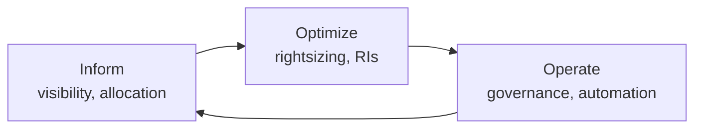
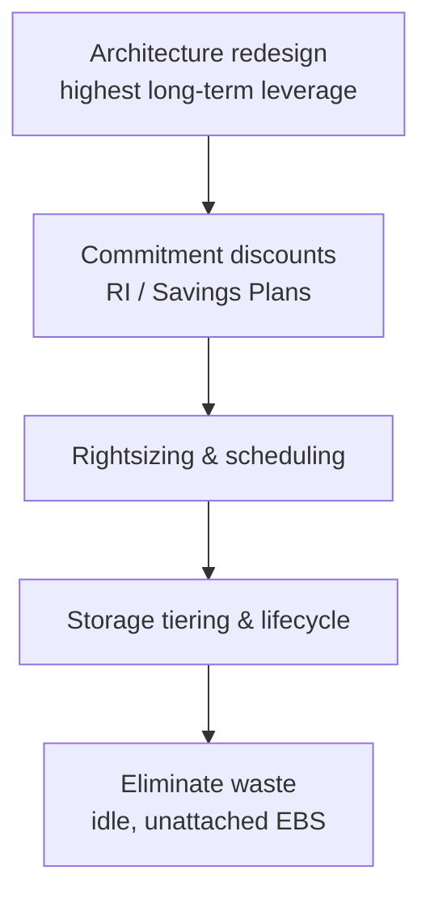
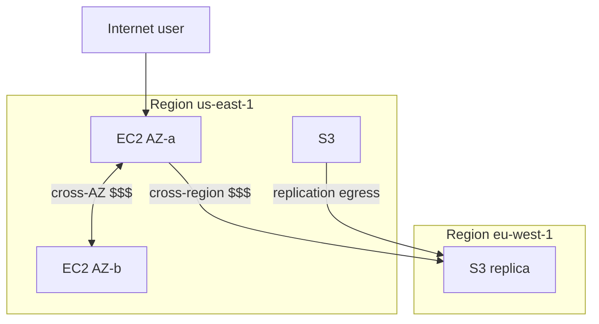

# Cloud Cost Optimization

## 1. Executive Summary

**Cloud cost optimization** is the practice of delivering required **performance, reliability, and security** at the **lowest effective spend**—not simply cutting bills. **FinOps** (Financial Operations) is the organizational model joining engineering, finance, and product to manage cloud as a **variable COGS** with **accountability**, **visibility**, and **forecasting**.

Principal architects influence cost at design time: **region selection**, **data transfer topology**, **storage tiering**, **compute rightsizing**, **reserved capacity**, **autoscaling bounds**, and **architectural patterns** (serverless vs always-on). Cost is a **non-functional requirement** traded against latency, availability, and velocity—like any other architecture constraint.

This chapter covers FinOps principles, cost allocation, optimization levers, unit economics, common waste patterns, and interview-level tradeoff reasoning—without inventing benchmark savings percentages.

## 2. Why This Topic Matters

Principal and distinguished engineer interviews increasingly include:

- "Your AWS bill doubled—how do you investigate?"
- **Reserved Instances** vs **Savings Plans** vs **Spot**.
- Cost of **cross-AZ** and **cross-region** traffic.
- **FinOps culture** vs one-time optimization project.
- Designing for cost without sacrificing **tier-1 SLOs**.

Architects who ignore cost lose credibility with CFO and with hyperscaler customers running at scale.

## 3. Problems Being Solved

| Problem | FinOps / optimization response |
|---------|-------------------------------|
| Unallocated spend | Tagging, cost centers, showback/chargeback |
| Over-provisioned resources | Rightsizing recommendations |
| Idle resources | Scheduled shutdown, autoscale to zero |
| Data egress surprises | Architecture minimizing cross-cloud transfer |
| Unpredictable bills | Forecasting, budgets, anomaly detection |
| No engineering accountability | Cost as team metric alongside reliability |

Optimization does **not** mean: compromising security, skipping DR for tier-1, or violating compliance to save money.

## 4. Assumptions and System Model

| Assumption | Implication |
|------------|-------------|
| **Cloud pricing is complex** | Need expertise or tooling (Cost Explorer, Kubecost) |
| **Usage grows by default** | Without governance, cost outpaces revenue |
| **Engineers respond to visibility** | Showback drives behavior |
| **Commitments reduce unit cost** | RIs/SP require forecast accuracy |
| **Architecture dominates long-term cost** | Rightsizing alone is insufficient |

**Cost model:** Total cost = compute + storage + network egress + managed services + support + engineer time (often omitted but real).

## 5. Essential Terminology

| Term | Definition |
|------|------------|
| **FinOps** | Cloud financial management practice and culture |
| **Showback** | Display costs to teams without charging |
| **Chargeback** | Internal billing to cost centers |
| **Unit economics** | Cost per business unit (per order, per user) |
| **Rightsizing** | Match instance type/size to actual utilization |
| **Reserved Instance (RI)** | Capacity commitment discount |
| **Savings Plan (SP)** | Flexible compute commitment (AWS) |
| **Spot / Preemptible** | Discounted interruptible capacity |
| **TCO** | Total Cost of Ownership including ops labor |
| **Cost allocation tag** | Metadata for attributing spend to team/product |

## 6. Core Mechanism

### FinOps lifecycle



*Figure 1: FinOps Foundation framework—continuous cycle, not one-time audit.*

### Cost optimization lever hierarchy



*Figure 2: Architectural changes beat incremental tuning—但 incremental still matters at scale.*

### Data transfer cost topology



*Figure 3: Cross-AZ and cross-region traffic often overlooked in architecture—design data locality consciously.*

## 7. Step-by-Step Walkthrough

**Scenario:** Monthly AWS bill increased 40% quarter-over-quarter.

| Step | Investigation | Common finding |
|------|---------------|----------------|
| 1 | Cost Explorer by service | NAT Gateway, S3 egress, RDS spike |
| 2 | By tag / team | Untagged 30% spend |
| 3 | Usage type drill-down | Cross-AZ data transfer doubled |
| 4 | Resource level | Idle m5.4xlarge from old test |
| 5 | Architecture review | New microservice chatty cross-AZ |
| 6 | Remediation | VPC endpoints; locality; rightsizing |
| 7 | Governance | Tag policy; budget alerts; FinOps review in design |

**Rightsizing example:**

| Metric | Observation | Action |
|--------|---------------|--------|
| CPU avg 8%, mem 20% | Over-provisioned m5.2xlarge | Move to m5.large |
| Night traffic near zero | Batch workload | Scheduled scale-down |
| Steady baseline 80% CPU | Predictable | 1-year Compute SP |

**AWS cost investigation drill-down order:**

1. **Cost Explorer → Group by Service** — identify top 3 services (often EC2, RDS, S3, NAT Gateway)
2. **Group by Linked Account** — find rogue sandbox accounts
3. **Group by Tag (team, environment)** — allocate to owners
4. **Usage Type** — distinguish compute hours vs data transfer vs requests
5. **Resource-level** — Cost Explorer resource drill or CUR for scale

**Common hidden cost drivers:**

| Driver | Symptom | Fix |
|--------|---------|-----|
| NAT Gateway | High DataTransfer-Regional-Bytes | VPC endpoints for S3/DynamoDB |
| Cross-AZ traffic | InterZone-In/Out charges | Pod topology affinity |
| Idle RDS | 0 connections, running 24/7 | Stop dev instances; Aurora Serverless |
| Old snapshots | Growing EBS snapshot line item | Lifecycle policy |
| Over-provisioned K8s nodes | Low cluster utilization | Cluster autoscaler, rightsizing |
| S3 Standard for archives | High storage, rare access | Glacier / Intelligent-Tiering |

## 8. Invariants and Guarantees

| Property | Type | Statement |
|----------|------|-----------|
| **Tag coverage** | Governance | Untagged spend cannot be allocated |
| **Budget alerts** | Safety | Anomaly detection before invoice surprise |
| **SLO preservation** | Constraint | Cost cuts must not breach tier-1 SLO without ADR |
| **Spot for stateful primary DB** | **Unsafe default** | Interruption requires careful design |
| **Exact savings %** | **Vendor/workload specific** | Do not claim universal 40% savings |

## 9. Failure Scenarios

### Scenario 1: RI over-commitment

**Setup:** Buy 3-year RI for workload migrated to serverless.

**Effect:** Paying for unused commitment.

**Mitigation:** Start with 1-year SP; analyze utilization before long commit.

### Scenario 2: NAT Gateway data processing charge

**Setup:** All S3 access via NAT instead of VPC endpoint.

**Effect:** Large unexpected NAT GB charges.

**Mitigation:** Gateway endpoints for S3/DynamoDB; architecture review checklist.

### Scenario 3: Unattached EBS volumes

**Setup:** Pods deleted; PVCs retained; volumes accumulate.

**Effect:** Silent storage cost creep.

**Mitigation:** Automated cleanup policies; monthly audit Lambda.

### Scenario 4: Cross-region chatty microservices

**Setup:** Synchronous mesh across regions for every request.

**Effect:** Egress dominates bill.

**Mitigation:** Data locality; regional stacks; async events.

### Scenario 5: FinOps without engineering buy-in

**Setup:** Finance mandates cuts; teams bypass with shadow accounts.

**Effect:** Culture war; incomplete optimization.

**Mitigation:** Showback dashboards; engineering FinOps champions; cost in design reviews.

### Scenario 6: Rightsizing production during traffic spike

**Setup:** Finance approves aggressive downsizing before marketing campaign; CPU pegs at 100%.

**Effect:** SLO breach; emergency scale-up at on-demand rates—more expensive than original size.

**Mitigation:** Rightsize against **peak** load test data; campaign calendar coordination; temporary scale-up approval workflow.

## 10. Performance Characteristics

| Lever | Cost impact | Performance risk |
|-------|-------------|------------------|
| Rightsizing down | High savings | CPU throttling if too aggressive |
| Spot instances | Up to ~70% discount—**verify current pricing** | Interruption; need graceful handling |
| Graviton/ARM | Lower $/perf for compatible workloads | Recompile/test required |
| S3 Intelligent-Tiering | Storage savings | Retrieval latency for cold |
| Provisioned IOPS reduction | RDS savings | DB latency increase |

Always validate **latency SLO** after rightsizing—cost saved may not justify revenue risk.

## 11. Scalability Limits

- Cost Explorer API rate limits for large orgs—need CUR (Cost and Usage Report) at scale.
- Tag cardinality limits per resource.
- FinOps team capacity vs cloud spend growth.
- Multi-cloud allocation complexity.

Organizations spending above roughly **$500k monthly cloud** (threshold varies—use as planning trigger, not rule) typically justify dedicated FinOps tooling and at least one full-time FinOps practitioner partnering with platform engineering.

**Tagging coverage target:** Aim for **95%+ allocated spend** before aggressive optimization—optimizing untagged 30% waste while tagged resources remain unrightsized is a common anti-pattern.

FinOps maturity correlates with **engineering ownership** of spend—not finance mandates alone.

Include **cost estimate** section in architecture review templates—forces explicit tradeoff discussion before build versus after invoice surprise.

AWS Well-Architected Cost Optimization Pillar provides a structured review lens—use it in quarterly architecture audits alongside reliability and security pillars.

Right-sizing without load testing at **peak plus headroom** creates false savings that evaporate during the next traffic spike or marketing campaign.

## 12. Operational Considerations

- **Mandatory tags** enforced via SCP/policy: `team`, `environment`, `cost-center`, `service`.
- Monthly **FinOps review** with engineering directors.
- **Anomaly detection** alerts (AWS Cost Anomaly Detection, etc.).
- **Kubecost / CloudHealth** for K8s allocation.
- Include cost section in **ADRs** for major architecture choices.
- **Forecast** quarterly for commitment purchases.

**Monthly FinOps meeting agenda (60 minutes):**

1. **Spend vs budget** by team (10 min)
2. **Top 5 anomalies** since last meeting (10 min)
3. **Unit economics trend**—cost per order/user (10 min)
4. **Commitment utilization** review (10 min)
5. **Two architecture cost deep-dives** from engineering (15 min)
6. **Action items** assignment with owners (5 min)

Without recurring cadence, cost optimization decays into annual panic.

## 13. Security Considerations

- Cost optimization must not disable **encryption**, **logging**, or **backup** without risk acceptance.
- Spot for sensitive workloads needs compliance review.
- Shared credentials across envs to "save" secrets cost—**anti-pattern**.
- Cost dashboards expose resource topology—RBAC on billing data.

## 14. Cost Considerations

This section is meta—the **framework itself**:

| Activity | Cost |
|----------|------|
| FinOps tooling | % of cloud spend or SaaS fee |
| Engineer time for optimization | OpEx—model against savings |
| Under-investing in observability | Incidents cost more than metrics spend |
| Over-investing in RI | Stranded capacity |

**Unit economics example (illustrative structure only—numbers require your data):**

`\text{cost per order} = \frac{\text{allocated monthly cloud spend}}{\text{monthly orders}}`

Track trend; alert if cost per order rises while infra flat—efficiency regression.

## 15. Production Implementations

### AWS

Cost Explorer, Compute Optimizer, Savings Plans, S3 lifecycle, Graviton.

### FinOps Foundation

Industry framework and certification—[finops.org](https://www.finops.org/).

### Spotify / Dropbox engineering blogs

Large-scale cloud cost programs—**case studies, not universal guarantees**.

### Kubecost

Open-core K8s cost visibility by namespace/label.

**FinOps tooling landscape:**

| Tool category | Examples | Purpose |
|---------------|----------|---------|
| Native cloud | Cost Explorer, GCP Billing, Azure Cost Mgmt | Source of truth |
| Third-party | CloudHealth, Apptio, Vantage | Multi-cloud aggregation |
| K8s-specific | Kubecost, OpenCost | Pod/namespace allocation |
| Optimization | AWS Compute Optimizer, Spot by NetApp | Rightsizing recommendations |

**Reserved capacity strategy:** Start with **Compute Savings Plans** covering 60–70% of steady baseline after 3 months of usage data; avoid 3-year commitments until workload stability proven. Review utilization quarterly—**stranded commitment** is silent budget leak.

**Engineering culture shift:** When teams see their showback dashboard weekly, behavior changes faster than annual finance mandates—visibility precedes optimization.

## 16. Alternatives and Tradeoffs

| Choice | Cost | Tradeoff |
|--------|------|----------|
| On-demand only | Highest unit $ | Maximum flexibility |
| 1-year SP | Moderate discount | Forecast risk |
| 3-year RI | Highest discount | Lock-in, migration risk |
| Spot for workers | Lowest compute $ | Interruption handling |
| Serverless | Pay per use | Cold start, vendor pricing model |
| Self-managed K8s | Lower cloud markup | Higher engineer OpEx |

Architects document **decision criteria** not universal "Spot is always best."

## 17. Common Misconceptions

| Misconception | Reality |
|---------------|---------|
| "FinOps = finance only" | Engineering ownership essential |
| "Cheapest region always" | Latency, compliance, egress to users matter |
| "Turn off monitoring to save"" | Outages cost more |
| "RI always saves money" | Unused commitment wastes |
| "Cloud bill is finance problem" | Architecture drives 80%+ of structural cost—**qualitative**, verify org |

## 18. Principal Architect Perspective

1. **Cost is NFR** in every ADR—explicit tradeoff vs reliability.
2. **Design for data locality** early—egress is architectural debt.
3. **Unit economics** align tech and business conversations.
4. **Platform enforces tagging** in golden paths—not optional labels.
5. **Partner with FinOps**—don't hero-optimize without allocation data.

**Architecture cost review checklist (include in design reviews):**

- [ ] Data transfer paths mapped (especially cross-AZ/region)
- [ ] Compute sizing justified by load test (not default instance type)
- [ ] Storage lifecycle policy defined
- [ ] Commitment strategy aligned to 6-month forecast
- [ ] Tagging plan complete before launch
- [ ] Unit economics baseline established
- [ ] DR tier cost documented (warm standby vs backup)
- [ ] Observability cost budgeted (logs, metrics cardinality)

Skipping this checklist at design time creates **structural cost debt** expensive to fix later.

**Executive communication:** Frame FinOps as **efficiency per dollar of revenue**, not arbitrary cuts—CFOs respond to unit economics trends more than absolute spend reduction requests.

Architectural decisions made at design time—multi-region topology, sync call graphs, retention policies—account for the majority of structural cloud cost; rightsizing alone cannot fix a chatty cross-region mesh.

## 19. Architecture Review Exercise

**Scenario:** Global active-active; all reads cross-region; untagged resources; m5.24xlarge default; no autoscaling; NAT-only S3 access.

**Review prompts:**

1. Top 3 cost drivers likely?
2. Quick wins vs structural fixes?
3. Governance additions?

**Expected findings:** VPC endpoints; regional read locality; rightsizing; tagging policy; SP analysis; architecture ADR for active-active justification.

## 20. Whiteboard Explanation

**90-second version:**

> "FinOps makes cloud spend visible and accountable to engineering through tagging and showback. Optimization starts with architecture—data transfer topology, regional design, serverless vs always-on—not just smaller instances. Quick wins: rightsizing, delete idle, S3 lifecycle, VPC endpoints to cut NAT. Commitments—Savings Plans—when baseline stable. Spot for fault-tolerant batch, not primary databases without design. Track unit economics like cost per transaction. Cost is traded against SLOs—we don't skip backups to save money. Monthly FinOps review with engineering; cost section in architecture reviews."

**Extended principal addendum:** Avoid inventing savings percentages in interviews—instead describe **investigation process** and **tradeoff framework**. Credibility matters more than claiming "40% savings guaranteed."

## 21. Interview Questions

1. **FinOps definition?**
   - *Signals:* Engineering + finance collaboration; cloud cost management.

2. **Showback vs chargeback?**
   - *Signals:* Visibility vs internal billing.

3. **RI vs Savings Plan?**
   - *Signals:* Instance-specific vs flexible compute commitment.

4. **When use Spot?**
   - *Signals:* Fault-tolerant, stateless, interruptible workloads.

5. **NAT Gateway cost driver?**
   - *Signals:* Data processing per GB; VPC endpoints alternative.

6. **Rightsizing risk?**
   - *Signals:* SLO violation if too aggressive.

7. **Unit economics example?**
   - *Signals:* Cost per user/order/API call.

8. **Cross-AZ traffic cost?**
   - *Signals:* Design pod locality; mesh/chatty calls.

9. **Bill spike investigation steps?**
   - *Signals:* Cost Explorer by service, tag, usage type.

10. **Cost vs reliability tradeoff?**
    - *Signals:* Tiered DR; don't cut tier-1 observability.

11. **Graviton consideration?**
    - *Signals:* ARM compatibility testing; lower $/perf.

12. **Tagging strategy?**
    - *Signals:* Mandatory keys; allocation coverage target.

13. **Savings Plan vs Reserved Instance?**
    - *Signals:* Flexible compute vs instance-specific commitment.

14. **K8s cost allocation challenge?**
    - *Signals:* Shared nodes; namespace labels; Kubecost.

15. **Cost vs reliability explicit tradeoff?**
    - *Signals:* Tier-1 keeps observability; tier-3 accepts backup-only DR.

**Scoring rubric:**

| Dimension | Strong | Weak |
|-----------|--------|------|
| Levers | Architecture + RI + rightsizing | "Use smaller instances" only |
| Process | FinOps cycle, showback | One-time audit |
| Tradeoffs | SLO, spot limits | "Minimize cost always" |
| Investigation | Structured drill-down | Random guessing |

## 22. Interview Follow-Ups

1. **K8s cost allocation?**
   - *Signals:* Kubecost; labels; idle node rightsizing.

2. **Multi-cloud FinOps?**
   - *Signals:* CloudHealth; normalized tagging; different discount models.

3. **Sell optimization to product?**
   - *Signals:* Unit economics; velocity vs cost framing.

4. **Spot for Kubernetes node groups?**
   - *Signals:* Mixed on-demand + spot; interruption handling; not for all workloads.

5. **Carbon cost in FinOps?**
   - *Signals:* Sustainability metrics emerging; region PUE differences—**verify** current cloud provider tooling.

## 23. Strong Answer Example

**Question:** "AWS spend doubled after microservices migration—what do you do?"

> "First Cost Explorer: breakdown by service, linked account, tag. I expect NAT, cross-AZ, and new RDS instances as common culprits. Check untagged percentage—allocate before optimizing. Drill usage types for DataTransfer-Regional-Bytes. Review architecture: synchronous cross-AZ mesh is expensive—move to locality-aware routing or async events. VPC endpoints for S3. Rightsize with Compute Optimizer recommendations validated against p99 CPU during peak—not average alone. Kubecost for K8s namespace allocation. Quick wins: delete unattached EBS, idle ELBs, old snapshots. Structural: ADR on regional data placement. Governance: mandatory tags via SCP, budget alerts, monthly FinOps review. If baseline stable 6 months, 1-year Compute SP. Track cost per order weekly."

## 24. Weak Answer Example

**Question:** "AWS spend doubled."

> "Tell teams to use smaller instances and turn off dev servers."

**Why weak:** No investigation, architecture, allocation, or tradeoff analysis.

### Additional strong answer

**Question:** "Engineering wants Graviton migration to save cost—architectural considerations?"

> "Benchmark representative workloads on ARM—some dependencies lack native libs. Plan CI matrix for amd64 and arm64 builds. Mixed instance types in ASG complicate capacity planning slightly but savings can be significant for compatible stateless APIs—**verify** current AWS Graviton pricing for your instance families. Roll out per service tier: stateless APIs first, databases last after vendor ARM support confirmed. Monitor p99 latency parity for 2 weeks canary. FinOps tracks savings via tag `instance_arch=arm64`. Rollback path: keep amd64 node group until ARM proven. Document in ADR with rejected 'big bang' migration."

## 25. Hands-On Exercise

1. Enable cost allocation tags in AWS; audit coverage %.
2. Run Compute Optimizer (or equivalent); document top 5 rightsizing candidates.
3. Calculate unit economics for a fictional SaaS metric.
4. Draw data flow diagram; highlight paid egress paths.
5. Configure budget alert at 110% forecast.
6. Write ADR section comparing on-demand vs 1-year SP for steady workload.
7. Identify 3 VPC endpoint candidates for NAT reduction.
8. Build monthly FinOps dashboard mock: spend by team, unit economics, top anomalies.
9. Calculate break-even for 1-year Savings Plan given 6-month usage forecast (illustrative spreadsheet).
10. Present cost vs reliability tradeoff for tier-1 DR warm standby to mock executive panel.

## 26. Knowledge Check

1. FinOps Inform phase? *(Visibility and allocation.)*
2. Spot instance risk? *(Interruption.)*
3. VPC endpoint benefit? *(Reduce NAT data processing charges.)*
4. Unit economics? *(Cost per business metric.)*
5. Rightsizing based on? *(Utilization vs SLO headroom.)*
6. NAT Gateway cost driver? *(Per-GB data processing.)*
7. Showback purpose? *(Visibility without internal billing.)*
8. Unit economics tracks? *(Cost per business metric over time.)*
9. Savings Plan vs RI? *(Flexible compute vs instance-specific.)*
10. FinOps Operate phase? *(Governance and automation.)*

## 27. Flashcards

| # | Front | Back |
|---|-------|------|
| 1 | FinOps | Cloud financial management culture and practice. |
| 2 | Showback | Display costs to teams without charging. |
| 3 | Rightsizing | Match resource size to utilization. |
| 4 | Savings Plan | Flexible AWS compute commitment discount. |
| 5 | Reserved Instance | Capacity-specific commitment discount. |
| 6 | Spot instance | Discounted interruptible compute. |
| 7 | Unit economics | Cost per business unit (order, user). |
| 8 | Cost allocation tag | Metadata attributing spend to owner. |
| 9 | NAT Gateway | Paid per-GB data processing egress point. |
| 10 | TCO | Total Cost of Ownership including labor. |

## 28. Cheat Sheet

```
FINOPS CYCLE
  Inform → Optimize → Operate (repeat)

INVESTIGATION
  Cost Explorer: service → tag → usage type → resource

LEVERS (high → low leverage)
  Architecture / data locality
  Commitments (SP, RI)
  Rightsizing, autoscale bounds
  Storage tiering, lifecycle
  Eliminate idle waste

GOVERNANCE
  Mandatory tags
  Budget + anomaly alerts
  Cost in ADRs

DON'T
  Cut tier-1 observability/DR for savings
  Over-commit RI without forecast
  Ignore cross-AZ/region egress
```

## 29. Related Concepts

- [AWS Fundamentals](/docs/cloud-architecture/aws-fundamentals) — billing building blocks
- [Multi-Region Architecture](/docs/cloud-architecture/multi-region-architecture) — regional cost tradeoffs
- [Kubernetes Architecture](/docs/kubernetes-and-platform-engineering/kubernetes-architecture) — cluster resource model
- [Platform Engineering and GitOps](/docs/kubernetes-and-platform-engineering/platform-engineering-and-gitops) — tagging in golden paths
- [Disaster Recovery and Multi-Region](/docs/reliability-and-resilience/disaster-recovery-and-multi-region) — DR cost tiers
- [SLOs, SLIs, and Error Budgets](/docs/reliability-and-resilience/slo-sli-error-budgets) — cost vs reliability tradeoffs

FinOps connects architecture decisions—multi-region design, Kubernetes sizing, API egress patterns—to business unit economics; cost optimization without reliability context creates false savings that surface during the next outage.

## 30. References

### Primary sources

- FinOps Foundation — [What is FinOps](https://www.finops.org/introduction/what-is-finops/).
- AWS Cost Optimization — [Well-Architected Cost Optimization Pillar](https://docs.aws.amazon.com/wellarchitected/latest/cost-optimization-pillar/welcome.html).

### Engineering blogs

- AWS Pricing Blog and Cost Management documentation.
- Google Cloud Cost Management best practices.

### Distinction

| Claim type | Source |
|------------|--------|
| FinOps framework | FinOps Foundation |
| AWS pricing mechanics | Official AWS documentation—prices change |
| Savings percentages | Workload-specific—do not invent benchmarks |
