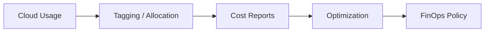

# Cost and FinOps

Cloud cost optimization, FinOps practices, and architecture cost modeling.

*Figure: FinOps feedback loop — measure, allocate, optimize.*

## Chapters

| Chapter | Focus |
|---------|-------|
| Cloud Cost Optimization | [Cloud Cost Optimization](/docs/cost-and-finops/cloud-cost-optimization) |

## Learning Path

1. Study **Cloud Cost Optimization** for unit economics, rightsizing, reserved capacity, and FinOps practices.

## Related Domains

- [Cloud Architecture](/docs/cloud-architecture/overview)
- [Data Platforms](/docs/data-platforms/overview)

Return to the [Curriculum Overview](/docs/start-here/curriculum-overview) to see how this domain fits the learning path.
