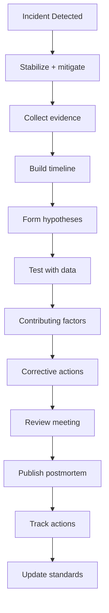
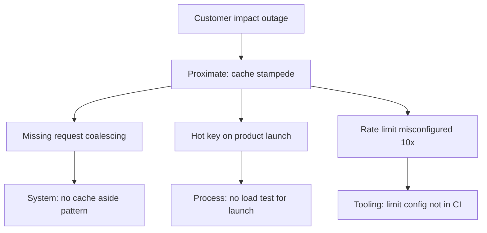
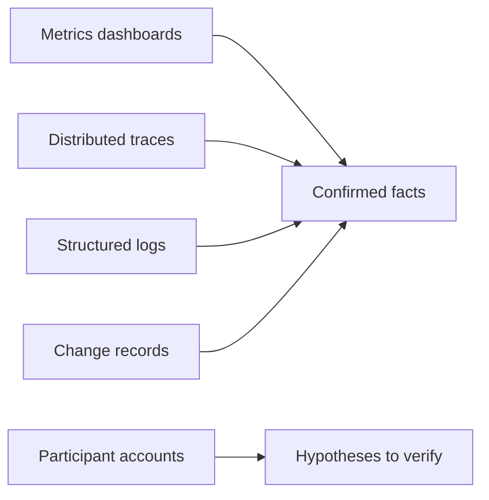

# Failure Analysis Methodology

## 1. Executive Summary

**Failure analysis methodology** is the disciplined process of investigating production incidents to determine **what happened**, **why it was possible**, and **what will change**—without collapsing into single-root-cause mythology or blame assignment. Principal architects lead analyses that treat systems as **socio-technical**: code, configuration, process, incentives, and organizational constraints all contribute.

Effective analysis produces a **verified timeline**, **contributing factors** (not one "root"), **corrective actions** with owners and dates, and **learning** that updates architecture standards and runbooks. Methods include **timeline reconstruction**, **five whys** (used cautiously), **fault tree analysis**, **change correlation**, and **distributed trace** evidence from [Distributed Tracing](/docs/observability/distributed-tracing).

This chapter provides a principal-level framework applicable from SEV3 degradations to SEV1 outages—distinguishing **safety** (data loss, security) from **liveness** (availability) failures and separating formal guarantees from operational gaps.

## 2. Why This Topic Matters

Shallow postmortems repeat incidents:

- **"Human error"** without fixing automation gaps recurs.
- **Single root cause** hides systemic contributors.
- **Missing timeline** prevents verifying hypotheses.
- **Action items without owners** never ship.

Principal interviews ask candidates to analyze hypothetical or real outages: AWS S3 regional degradation, cache stampede, consensus split-brain. Strong candidates build timelines, identify contributing factors, propose layered mitigations, and connect to [Safety and Liveness](/docs/distributed-systems-foundations/safety-and-liveness) properties.

## 3. Problems Being Solved

| Problem | Methodology response |
|---------|---------------------|
| **Unknown blast radius** | Structured timeline + dependency map |
| **Competing theories** | Evidence hierarchy; reproduce |
| **Blame culture** | Blameless focus on system gaps |
| **Shallow fixes** | Contributing factor model |
| **Repeat incidents** | Action item tracking + fitness functions |
| **Alert noise** | Distinguish symptom vs cause |
| **Incomplete observability** | Gap analysis as output |
| **Regulatory inquiry** | Audit-grade timeline and decisions |

## 4. Assumptions and System Model

| Assumption | Implication |
|------------|-------------|
| **Incidents are multi-causal** | Multiple contributing factors |
| **People acted rationally given info** | Improve signals and guardrails |
| **Logs/traces may be incomplete** | Note uncertainty explicitly |
| **Changes correlate with incidents** | Deploy/config audit first |
| **Analysis has time box** | Depth scales with severity |
| **Learning requires follow-through** | Track actions to completion |

**Severity-driven depth:**

| SEV | Analysis depth | Timeline target |
|-----|----------------|-----------------|
| 1 | Full postmortem + exec review | 48h draft |
| 2 | Standard postmortem | 5 business days |
| 3 | Lightweight review | Optional doc |
| 4 | Ticket + trend tracking | No full PM |

## 5. Essential Terminology

| Term | Definition |
|------|------------|
| **Incident** | Unplanned disruption or degradation |
| **SEV** | Severity classification |
| **MTTD** | Mean time to detect |
| **MTTR** | Mean time to recover |
| **Timeline** | Ordered events with timestamps (UTC) |
| **Contributing factor** | Condition that enabled or amplified failure |
| **Root cause** | Deepest actionable systemic gap (use plural mindset) |
| **Proximate cause** | Immediate trigger |
| **Blast radius** | Scope of impact |
| **Five whys** | Iterative why questioning |
| **Fault tree** | Logical diagram of failure paths |
| **Change event** | Deploy, flag, config, capacity change |
| **Corrective action** | Fix preventing recurrence class |

## 6. Core Mechanism

### 6.1 Analysis workflow



*Figure 1: Failure analysis workflow—stabilize before deep dive; evidence before conclusions.*

### 6.2 Contributing factors model



*Figure 2: Multiple contributing factors—avoid stopping at proximate trigger.*

### 6.3 Evidence hierarchy



*Figure 3: Prefer artifacts over memory—interviews supplement, not replace, data.*

### 6.4 Deep dives

**Timeline construction rules:**

- UTC timestamps with timezone noted once.
- Distinguish **detection**, **escalation**, **mitigation**, **recovery** milestones.
- Mark **uncertainty** with `~` or confidence level.
- Include external dependency events (cloud provider, PSP).

**Five whys (caution):**

- Stop at **actionable systemic layer**—not "human tired."
- Multiple branches—not single chain.
- Example: Why cache miss storm? → Why hot key? → Why no coalescing? → Why not in standards? → Why no CI check?

**Hypothesis testing:**

1. State hypothesis explicitly.
2. Predict observable in logs/metrics.
3. Confirm or refute with data.
4. If inconclusive, document gap for observability action.

## 7. Step-by-Step Walkthrough

### 7.1 SEV1 database failover gone wrong

1. **00:12 UTC** — Automated failover promotes replica.
2. **00:14** — Apps connect to stale replica; writes appear succeed (split brain).
3. **00:18** — Support tickets spike; error rate 40%.
4. **00:25** — On-call triggers manual intervention; old primary isolated.
5. **00:45** — Recovery complete; data reconciliation begins.

**Contributing factors:** lack of fencing token; app connection pool held stale connections; failover drill never tested with write load; monitoring detected lag but no page.

**Actions:** implement fencing tokens ([Fencing Tokens](/docs/consensus/fencing-tokens)); connection pool validation; quarterly failover game day; alert on replication lag &gt; 5s page.

### 7.2 Partial failure misclassified

1. Checkout succeeds; email notification fails silently.
2. Analysis reveals async worker OOM—not "email provider down."
3. Trace shows retry exhausted without DLQ alert.
4. **Principal:** partial failure is default in distributed systems—see [Partial Failure](/docs/distributed-systems-foundations/partial-failure).

### 7.3 Change-correlated regression

1. Deploy at 14:00; latency SLO breach 14:08.
2. Rollback 14:20; recovery confirmed.
3. Diff implicates new connection timeout—too aggressive for cross-region DB.
4. Action: canary deploy + automatic rollback on SLO burn.

### 7.4 Security incident analysis variant

1. Exposed API key in public repo.
2. Timeline includes git push, scanner miss, external usage first seen.
3. Factors: no secret scanning in CI; key not in vault; no key rotation.
4. Cross-link [Secrets Management Platform](/docs/system-design/secrets-management-platform).

### 7.5 Chaos experiment validates analysis

1. Hypothesis from prior PM: failover causes split-brain without fencing.
2. Chaos game day injects primary isolation during write load.
3. Observe metrics and traces in real time—confirm hypothesis before production repeat.
4. Corrective action prioritized based on validated failure mode.
5. **Principal:** analysis methodology pairs with [Chaos Engineering](/docs/reliability-and-resilience/chaos-engineering)—theory tested under controlled blast radius.

## 7A. Evidence Source Priority

| Priority | Source | Reliability |
|----------|--------|-------------|
| 1 | Metrics with raw query link | High |
| 2 | Distributed trace span | High |
| 3 | Structured log line | Medium-high |
| 4 | Deploy/change record | Medium |
| 5 | Participant memory | Low—verify |

## 8. Invariants and Guarantees

| Property | Mechanism |
|----------|-----------|
| **Blameless tone** | Facilitator trained; focus on systems |
| **Evidence-backed claims** | Citations to logs/traces |
| **Action ownership** | Named owner + date per item |
| **Publication for SEV1/2** | Internal transparency default |
| **Follow-up tracking** | Ticket until closed |

## 9. Failure Scenarios

| Scenario | Mitigation |
|----------|------------|
| Analysis during active incident | Separate commander vs scribe roles |
| Missing logs | Note gap; observability action item |
| Executive wants single villain | Educate on contributing factors |
| Action items too vague | SMART format required |
| Repeat incident same class | Escalate to architecture governance |
| Analysis paralysis | Time-box; publish with open questions |
| Postmortem not read | Executive summary + eng review ritual |
| Legal holds on data | Coordinate with counsel early |

## 10. Performance Characteristics

Analysis process metrics:

- **MTTD / MTTR** trend by service.
- **Repeat incident rate** same contributing factor tag.
- **Action item closure** within 30/60/90 days.
- **Postmortem time-to-publish** vs SLA.
- **Participation diversity** (not only on-call team).

## 11. Scalability Limits

| Limit | Mitigation |
|-------|------------|
| Principal time on every SEV3 | Tiered depth by severity |
| Large incident participant list | Roles: facilitator, scribe, domain experts |
| Cross-timezone incidents | Follow-the-sun scribe handoff |
| Multi-team blame dynamics | Blameless charter read at start |
| Data volume for timeline | Automated trace/log aggregation tools |

## 12. Operational Considerations

- Incident commander training separate from postmortem facilitation.
- Templates in `templates/failure-analysis-template.md`.
- Tag contributing factors taxonomy for trend analysis.
- Monthly SEV review with leadership—patterns not individuals.
- Link closed actions to [Architecture Governance](/docs/architecture-leadership/architecture-governance) standard updates.

## 13. Security Considerations

- Security incidents need coordinated disclosure timeline.
- Redact customer PII in published postmortems.
- Root cause may include attacker TTP—share with security team.
- Secrets in logs discovered during analysis—rotate immediately.

## 14. Cost Considerations

Incidents have direct revenue and engineering cost—quantify where possible for prioritization. Investment in tracing and logging ROI proven by faster MTTR. Game days have scheduling cost but reduce SEV1 frequency.

## 15. Production Implementations

| Organization | Pattern |
|--------------|---------|
| **Google SRE** | Blameless postmortems |
| **Etsy** | Early blameless culture advocate |
| **AWS** | Public service event summaries |
| **Netflix** | Chaos validates analysis hypotheses |
| **Financial services** | Regulatory RCA format |

## 16. Alternatives and Tradeoffs

| Decision | Tradeoff |
|----------|----------|
| Five whys vs fault tree | Speed vs completeness |
| Public vs internal PM | Transparency vs security |
| Deep vs fast publish | Accuracy vs organizational learning speed |
| Facilitator internal vs external | Neutrality vs domain knowledge |
| Video vs written PM | Engagement vs searchability |
| Automated timeline tools | Speed vs context nuance |

## 17. Common Misconceptions

| Misconception | Reality |
|---------------|---------|
| "One root cause" | Systems have contributing factor sets |
| "Operator mistake" | Design should make safe action default |
| "Rollback always fixes" | Data state may need repair |
| "Postmortem = punishment" | Learning document |
| "Logs tell full story" | Gaps drive observability work |
| "External vendor = not our problem" | Dependency failure mode is your design |

## 18. Principal Architect Perspective

- **Lead with timeline**, not conclusions.
- **Separate proximate from systemic** contributors.
- **Every action item ties to factor**, not symptom patch only.
- **Update architecture standards** when patterns repeat.
- **Quantify blast radius** for prioritization credibility.
- Teach teams [Postmortem Culture](/docs/production-failures/postmortem-culture) rituals.

The highest-value analysis work often happens in the first 72 hours after stabilization when evidence is fresh. Principal architects ensure scribe rotation so on-call engineers are not sole historians—cognitive bias peaks when you fought the incident yourself.

## 19. Architecture Review Exercise

**Scenario:** Postmortem concludes "on-call missed alert" with action "train on-call better."

**Review:** Superficial. Ask: why alert not actionable? Why no SLO burn auto-mitigation? Why missing runbook? Expand contributing factors and systemic actions.

## 20. Whiteboard Explanation

"When SEV1 hits, incident commander stabilizes first. I assign a scribe building UTC timeline from metrics, traces, and deploy records—not meeting memory. We list hypotheses and kill them with data. Contributing factors include technical design, tooling gaps, and process—never stop at 'human error.' Corrective actions are owned with dates: fencing tokens, CI policy, game day. Postmortem published in five days, reviewed in monthly SEV meeting. Repeat factor tags feed architecture governance updates."

## 21. Interview Questions

1. **Analyze cache stampede outage.** — *Signals:* timeline, coalescing, hot key. *Red flags:* "restart cache."
2. **Five whys criticism?** — *Signals:* multi-branch, stops at system. *Follow-up:* example.
3. **Distinguish detection vs root cause?** — *Signals:* MTTD vs contributing factors.
4. **Partial failure checkout scenario.** — *Signals:* async path, sagas. *Red flags:* monolith assumption.
5. **Split-brain failover analysis?** — *Signals:* fencing, quorum. *Follow-up:* [Fencing Tokens](/docs/consensus/fencing-tokens).
6. **Blameless still accountable?** — *Signals:* system accountability. *Red flags:* no consequences ever.
7. **Observability gap found in PM?** — *Signals:* action to tracing/logging.
8. **Change correlation process?** — *Signals:* deploy audit, feature flags.
9. **SEV1 vs SEV3 analysis depth?** — *Signals:* tiered process.
10. **Security incident PM differences?** — *Signals:* disclosure, redaction.
11. **Prove hypothesis with traces?** — *Signals:* span evidence. *Red flags:* guess only.
12. **Prevent repeat incident class?** — *Signals:* fitness function, standard update.

## 22. Interview Follow-Ups

1. **Conflicting participant memories.** — Trust artifacts; note disagreement.
2. **Customer data loss uncertain extent.** — Conservative comms; reconciliation job.
3. **Vendor refuses root cause detail.** — Document uncertainty; design around ambiguity.

## 23. Strong Answer Example

**Q:** Walk through analyzing 40% error rate spike after deploy.

**Outline:** Confirm rollback recovers—establishes change correlation. Build timeline: deploy T0, canary OK, full promote T+5, spike T+8. Compare golden signals canary vs full—maybe canary too small. Trace sample errors—new timeout to dependency X. Hypothesis: timeout too low for cross-region under load. Verify latency metrics on X. Contributing factors: no SLO-based canary gate; timeout not derived from measured p99; missing integration test at scale. Actions: auto rollback on burn; timeout from SLO doc; load test in CI. Not "bad deploy."

## 24. Weak Answer Example

**Weak:** "On-call deployed bad code. We fired the junior engineer and added more QA."

**Red flags:** Blame, single cause, no systemic actions, no timeline, no observability improvements.

## 25. Hands-On Exercise

1. Given fictional incident logs, build 20-event UTC timeline.
2. Draw contributing factor diagram with 3+ branches.
3. Write 5 SMART corrective actions mapped to factors.
4. Identify 2 observability gaps and proposed instrumentation.
5. **Extension:** Facilitate mock blameless review with peer.
6. **Extension:** Map one action to architecture fitness function.

## 26. Knowledge Check

1. MTTD vs MTTR?
2. Proximate vs contributing factor?
3. Why blameless?
4. Evidence hierarchy order?
5. When stop five whys?
6. Timeline required elements?
7. SEV1 publish SLA example?
8. Change correlation first step?
9. Partial failure relevance?
10. Trace role in analysis?
11. SMART action format?
12. Link PM to governance how?

## 26A. Extended Knowledge Check

13. What is the difference between safety and liveness incident?
14. How do span links differ from parent-child in async traces?
15. When is participant memory acceptable in timeline?
16. What SMART field is most often missing in weak PMs?
17. How does chaos engineering validate PM hypotheses?
18. Contributing factor tag taxonomy—who maintains it?

The SRE or reliability engineering lead owns the taxonomy with input from principal architects after each monthly SEV review—tags that never get assigned are removed to prevent classification fatigue.

## 27. Flashcards

| Front | Back |
|-------|------|
| MTTD | Mean time to detect |
| MTTR | Mean time to recover |
| Contributing factor | Enabling condition |
| Proximate cause | Immediate trigger |
| Blameless | Focus on systems not people |
| Timeline | UTC ordered events |
| Blast radius | Impact scope |
| Five whys | Iterative why—use carefully |
| Fault tree | Logical failure diagram |
| Hypothesis | Testable explanation |
| SEV | Incident severity level |
| Corrective action | Owned fix with date |

## 28. Cheat Sheet

```
FLOW: stabilize → evidence → timeline → hypotheses → factors → actions → publish → track
TIMELINE: UTC, detection/escalation/mitigation/recovery milestones
FACTORS: multiple branches—not single root
EVIDENCE: metrics > traces > logs > changes > memory
AVOID: blame, vague actions, symptom-only fixes
DEPTH: scales with SEV level
OUTPUT: postmortem + owned actions + governance updates
TOOLS: distributed tracing, deploy audit, dashboards
PARTIAL FAILURE: default model in distributed systems
```

## 28A. Principal Interview Deep Dive

### Timeline quality checklist

Before publishing any postmortem, principal reviewers verify:

- [ ] All timestamps UTC with source cited (dashboard, log line, trace span ID).
- [ ] Detection time separate from customer report time if different.
- [ ] Deploy and feature flag changes in ±2 hour window listed.
- [ ] External dependency status page events included.
- [ ] Uncertainty explicitly marked (`~14:32` if approximate).
- [ ] No conclusions in timeline section—facts only.

### Contributing factor taxonomy (example tags)

| Tag | Example |
|-----|---------|
| `design-gap` | Missing fencing token |
| `process-gap` | No game day for failover |
| `tooling-gap` | Alert threshold too high |
| `capacity-gap` | Traffic 3× forecast |
| `change-correlated` | Deploy at T-0 |
| `dependency` | Cloud provider regional issue |
| `observability-gap` | No trace across async boundary |

Trend tags quarterly in SEV review—feeds [Architecture Governance](/docs/architecture-leadership/architecture-governance).

### Hypothesis log template

| ID | Hypothesis | Prediction | Result | Evidence |
|----|------------|------------|--------|----------|
| H1 | DB connection pool exhausted | DB wait metric spike | Confirmed | Grafana panel X |
| H2 | Bad deploy binary | Rollback fixes | Refuted | Rollback no effect |

Forces disciplined analysis vs jumping to first theory.

### Distributed trace as primary evidence

Walk interviewers through: filter traces `duration > 2s AND service=checkout` → identify fraud service serial call added in release `v2.3.1` → correlate with deploy record → contributing factor `change-correlated` + `design-gap` (no latency budget for new dependency).

Link [Distributed Tracing](/docs/observability/distributed-tracing) instrumentation gap if trace breaks at monolith boundary.

### Safety vs liveness in incident classification

| Failure type | Example | Priority |
|--------------|---------|----------|
| Safety | Double charge, data loss | P0 halt traffic |
| Liveness | Slow checkout, elevated errors | P1/P2 restore service |
| Security safety | Credential leak | P0 rotate + contain |

Analysis must classify correctly—treating safety incident as liveness-only prolongs exposure.

## 29. Related Concepts

- [Partial Failure](/docs/distributed-systems-foundations/partial-failure)
- [Safety and Liveness](/docs/distributed-systems-foundations/safety-and-liveness)
- [SLO, SLI, and Error Budgets](/docs/reliability-and-resilience/slo-sli-error-budgets)
- [Distributed Tracing](/docs/observability/distributed-tracing)
- [Observability Fundamentals](/docs/observability/observability-fundamentals)
- [Postmortem Culture](/docs/production-failures/postmortem-culture)
- [Chaos Engineering](/docs/reliability-and-resilience/chaos-engineering)
- [Fencing Tokens](/docs/consensus/fencing-tokens)

## 19A. Extended Review Scenario

**Scenario B:** Postmortem blames "on-call fatigue" without systemic actions.

**Review:** Fatigue is contributing factor, not root. Ask: alert thresholds? Runbook quality? Toil automation backlog? Staffing model? Action items must address paging volume, alert tuning, and sustainable rotation—not "get more sleep." Link to error budget and SLO review.

## 23A. Additional Strong Answer

**Q:** How analyze partial failure where payment succeeds but notification fails?

**Outline:** Timeline: payment commit T0, outbox publish T+50ms, worker crash T+100ms, no notification. Customer charged, no email—support load increases. Contributing factors: missing outbox relay monitoring; no idempotent notification retry; user not shown in-app confirmation as primary channel. Traces show break at async boundary—span link gap. Actions: transactional outbox with relay lag alert; notification DLQ dashboard; UX show payment receipt even if email delayed. Classify as partial failure design per [Partial Failure](/docs/distributed-systems-foundations/partial-failure)—not "notification team bug" alone.

## 28B. Extended BOE Walkthrough (Interview Script)

**Interviewer:** "Walk through analyzing database failover incident."

**Strong candidate:**

"Stabilize first—isolate old primary, confirm writes to single target.

Timeline UTC from metrics: failover trigger T0, error spike T+2min, manual intervention T+8min, recovery T+35min.

Evidence: replication lag graph showed 30s before failover; traces show apps writing to both primaries T+2 to T+8—split brain.

Hypothesis log: H1 split brain confirmed; H2 network partition refuted by provider status.

Contributing factors: no fencing token; connection pools held stale primary; failover drill never tested under write load; lag alert not paging.

Not 'DBA mistake'—system gaps.

Actions: fencing tokens [Fencing Tokens](/docs/consensus/fencing-tokens); pool validation on topology change; game day quarterly; page on lag &gt;5s.

Safety incident—data reconciliation job; communicate customer impact conservatively.

Publish PM 5 days; tag factors for governance trend review."

## 30. References

- Google SRE Book — postmortem culture chapter (operational practice).
- Sidney Dekker, *The Field Guide to Understanding Human Error* — systems thinking.
- IEEE 1012 — verification and validation (formal standard context).
- Etsy blameless postmortem engineering blog (industry practice).
- NTSB accident investigation methodology — timeline discipline analogy.

**Distinction:** Investigation rigor standards vary by industry regulation; contributing-factor model is widely accepted in SRE practice but not a formal proof method.

### 30A. Further reading paths

Practice with [Chaos Engineering](/docs/reliability-and-resilience/chaos-engineering) experiments that validate analysis hypotheses before production incidents. Study one public cloud provider post-incident summary and reconstruct timeline from published facts—compare to your template. Cross-train with [Distributed Tracing](/docs/observability/distributed-tracing) for evidence collection skills.

**Exercise:** Given a fictional deploy + latency spike scenario, write contributing factor diagram with at least four branches and map each to a SMART action. **Interview drill:** 15-minute whiteboard timeline for split-brain failover—include detection, mitigation, recovery, and data reconciliation phases with safety vs liveness classification.

**Capstone:** Facilitate a mock SEV2 review from a provided trace export and deploy log—produce draft timeline in 30 minutes without interviewing participants. Peer review for evidence citations versus unsupported claims.

When analysis concludes "human error," ask **five more whys** until you reach a controllable system change—training alone is rarely a sufficient corrective action for principal-level incident reviews.
