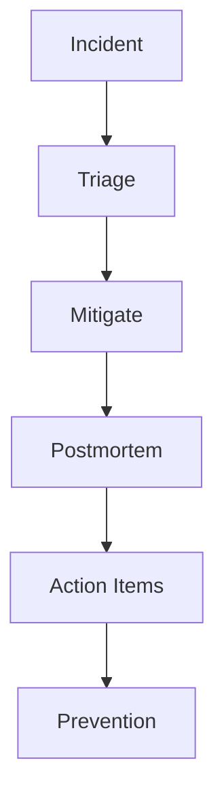

# Production Failures

Postmortems, failure analysis, and lessons from production incidents.

*Figure: Incident lifecycle — from detection to systemic improvement.*

## Chapters

| Chapter | Focus |
|---------|-------|
| Failure Analysis Methodology | [Failure Analysis Methodology](/docs/production-failures/failure-analysis-methodology) |
| Postmortem Culture | [Postmortem Culture](/docs/production-failures/postmortem-culture) |

## Learning Path

1. Start with **Failure Analysis Methodology** for root cause analysis and timeline reconstruction.
2. Finish with **Postmortem Culture** for blameless reviews, action items, and organizational learning.

## Related Domains

- [Reliability and Resilience](/docs/reliability-and-resilience/overview)
- [Architecture Leadership](/docs/architecture-leadership/overview)

Return to the [Curriculum Overview](/docs/start-here/curriculum-overview) to see how this domain fits the learning path.
