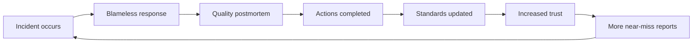
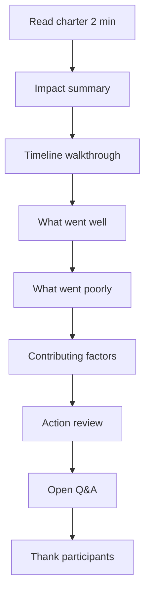
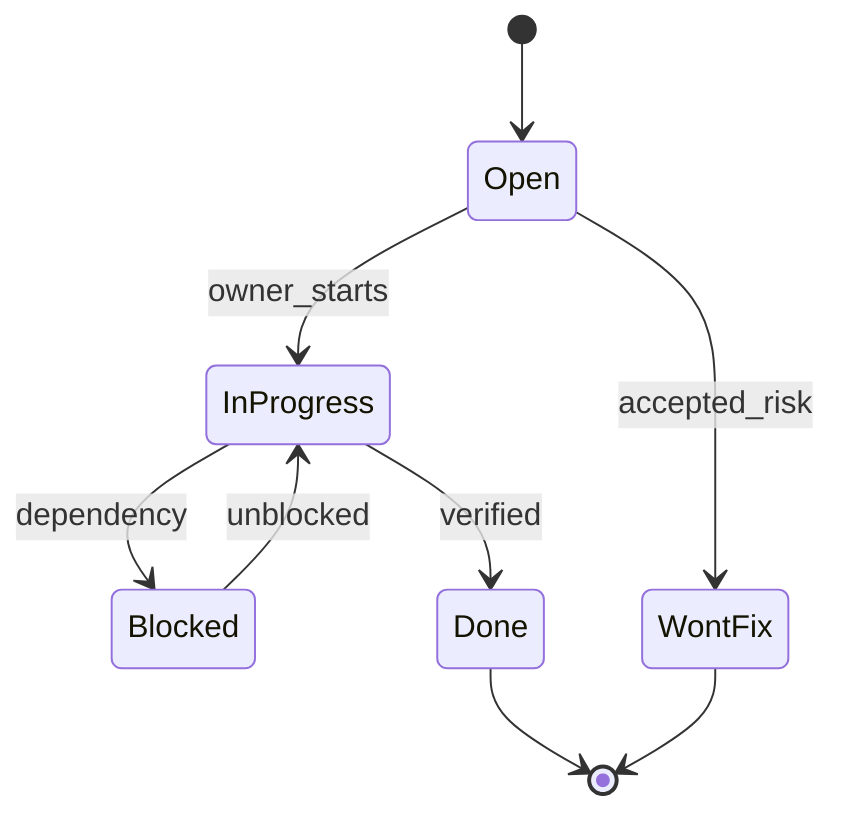

# Postmortem Culture

## 1. Executive Summary

**Postmortem culture** is the organizational practice of learning from production failures through **blameless**, **transparent**, and **action-oriented** reviews. A postmortem document captures incident impact, timeline, contributing factors, what went well, what went poorly, and corrective actions—but culture is the **shared belief** that revealing mistakes improves the system faster than hiding them.

Principal architects cultivate postmortem culture by **modeling vulnerability**, **facilitating reviews**, **closing the loop** on action items, and connecting learnings to [Architecture Governance](/docs/architecture-leadership/architecture-governance) and [Technical Strategy and Roadmaps](/docs/architecture-leadership/technical-strategy-and-roadmaps). Culture fails when postmortems become **checkbox compliance**, **blame theater** ("blameless" label but career consequences), or **write-only documents** nobody reads.

Sustainable culture requires executive sponsorship, psychological safety, ritual (monthly SEV reviews), and metrics: repeat incident rate, action item closure, time-to-publish.

## 2. Why This Topic Matters

Organizations without learning culture repeat expensive failures:

- **Hidden near-misses** become tomorrow's SEV1.
- **Talent leaves** when blamed for systemic gaps.
- **Regulators and customers** demand demonstrated learning.
- **Principal architects** are culture carriers across teams.

Interviews ask: "Describe a postmortem you led" and "How handle incident where your design contributed?" Strong answers show humility, systemic fixes, and follow-through; weak answers blame individuals or deny architectural responsibility.

## 3. Problems Being Solved

| Problem | Cultural response |
|---------|-------------------|
| **Fear of reporting** | Blameless charter; reward transparency |
| **Repeat incidents** | Track factor tags; governance updates |
| **Stale action items** | Executive review of open items |
| **Siloed learning** | Publish internally; cross-team attendance |
| **Near-miss ignored** | Just culture for voluntary reports |
| **Hero culture** | Credit systems and runbooks over individuals |
| **Postmortem fatigue** | Tier depth by severity |
| **Legal fear** | Counsel-approved templates |

## 4. Assumptions and System Model

| Assumption | Implication |
|------------|-------------|
| **Incidents are inevitable at scale** | Invest in learning not prevention-only narrative |
| **People respond to incentives** | Align performance review with systemic fixes |
| **Leaders set tone** | Executives attend SEV reviews without blame |
| **Transparency has bounds** | Redact customer data; legal review for external |
| **Culture takes years** | Persistent rituals over one-off training |
| **Remote teams need inclusion** | Async comments; recorded reviews |

**Blameless vs no accountability:**

- **Blameless:** No punishment for honest mistakes; focus on system improvement.
- **Accountable:** Actions have owners; negligence patterns addressed via management, not public shaming.

## 5. Essential Terminology

| Term | Definition |
|------|------------|
| **Postmortem (PM)** | Written incident learning document |
| **Blameless** | Focus on systems not individual fault |
| **Just culture** | Proportionate response to behavior vs error |
| **SEV review** | Regular meeting reviewing incidents |
| **Near-miss** | Incident potential without customer impact |
| **Action item** | Owned corrective task from PM |
| **Learning review** | Alternative term avoiding "postmortem" morbidity |
| **Facilitator** | Neutral meeting leader |
| **Psychological safety** | Ability to speak up without fear |
| **Hero culture** | Reliance on individual heroics vs systems |
| **Write-only PM** | Document filed but not acted upon |
| **Premortem** | Pre-mortem risk exercise before launch |

## 6. Core Mechanism

### 6.1 Cultural flywheel



*Figure 1: Learning flywheel—trust increases signal into future prevention.*

### 6.2 Postmortem meeting structure



*Figure 2: 60-minute SEV2 review agenda—facilitator keeps scope.*

### 6.3 Action item lifecycle



*Figure 3: Action items tracked to completion—not postmortem graveyard.*

### 6.4 Deep dives

**Postmortem document template (sections):**

1. **Summary** — one paragraph for executives.
2. **Impact** — duration, users, revenue, data.
3. **Timeline** — UTC events (see [Failure Analysis Methodology](/docs/production-failures/failure-analysis-methodology)).
4. **Contributing factors** — multi-factor.
5. **What went well / poorly**
6. **Action items** — owner, priority, due date.
7. **Appendix** — graphs, traces (redacted).

**Facilitator techniques:**

- Ask "what made that the reasonable action at the time?"
- Redirect blame language to system language.
- Park detailed technical debates for follow-up tickets.
- Ensure quiet voices heard—round-robin input.

**Executive role:**

- Attend SEV1 reviews; thank teams for transparency.
- Never punish messenger in public forum.
- Escalate stuck action items across teams.

## 7. Step-by-Step Walkthrough

### 7.1 Establishing culture at growing startup

1. First SEV2: CEO joins; states blameless intent explicitly.
2. Principal facilitates; publishes PM within 5 days.
3. Actions tracked in shared dashboard visible to company.
4. Repeat incident factor tagged; third occurrence triggers governance review.
5. Six months later: engineers voluntarily report near-misses in #incidents channel.

### 7.2 Recovering from blame theater

1. Team stops writing detailed PMs after manager criticized individual in review.
2. New VP investigates; reaffirms blameless policy with HR.
3. Facilitator training for all engineering managers.
4. Anonymous retro on incident process; actions to rebuild trust.

### 7.3 Near-miss program

1. Engineer reports config almost pushed to prod without approval.
2. Lightweight learning note—not full SEV3 PM.
3. Action: pre-push hook in CI; thanked publicly in all-hands.
4. Increases reporting without full PM overhead.

### 7.4 Connecting PM to roadmap

1. SEV1 from missing multi-region failover.
2. PM action: DR initiative on [Technical Strategy](/docs/architecture-leadership/technical-strategy-and-roadmaps) H1.
3. Quarterly exec review shows PM-driven investments—closes loop.

### 7.5 New hire onboarding ritual

1. Week one: new engineers read two recent SEV2 postmortems—not to scare, but to show transparency.
2. Facilitator explains blameless charter and how to report near-misses.
3. Assign buddy for first incident observer role in review meeting.
4. Survey at 30 days: "Do you feel safe reporting mistakes?"—trend with tenure cohorts.
5. **Principal:** culture transmitted through rituals in onboarding, not only all-hands slogans.

## 7A. Postmortem Publication Tiers

| Tier | Audience | Content |
|------|----------|---------|
| Executive summary | Leadership | Impact, actions, timeline TL;DR |
| Engineering full | All engineering | Technical depth, traces redacted |
| Restricted | Legal/security | Exploit details, customer identifiers |
| Public | Customers | Status page language only—separate process |

## 8. Invariants and Guarantees

| Property | Mechanism |
|----------|-----------|
| **Psychological safety baseline** | Charter read each review |
| **Action accountability** | Named owners publicly |
| **Transparency default** | Internal publish SEV1/2 |
| **No retroactive blame** | Policy endorsed by leadership |
| **Learning integrated** | Governance standard updates |

## 9. Failure Scenarios

| Scenario | Mitigation |
|----------|------------|
| PM never published | SLA with escalation to VP Eng |
| Same action item recurring | Escalate priority; exec sponsor |
| Legal blocks publication | Pre-approved redaction template |
| Facilitator dominates | Train neutral facilitation |
| Remote team excluded | Async doc comments; recording |
| "Blameless" sarcasm | Leadership intervention |
| PM too long unread | Executive summary + TL;DR |
| Customer-facing PM leaks | Separate external comms process |

## 10. Performance Characteristics

Culture health metrics:

- **PM publish rate** % of SEV1/2 within SLA.
- **Action closure rate** 30/60/90 day.
- **Repeat factor rate** trending down.
- **Near-miss reports** trending up (healthy signal).
- **Employee survey** psychological safety scores.
- **MTTR improvement** over time per service.

## 11. Scalability Limits

| Limit | Mitigation |
|-------|------------|
| PM fatigue at high incident rate | Tiered docs; focus on patterns |
| Facilitator bottleneck | Train pool of facilitators |
| Large org silos | Central SEV review + domain reviews |
| Global language/culture | Local facilitators; translation |
| Acquisition culture clash | Integration playbook for PM norms |

## 12. Operational Considerations

- Monthly company-wide SEV review (30 min, top 2 incidents).
- Dashboard: open PM actions by team.
- New hire onboarding includes PM culture doc.
- Annual blameless culture survey.
- Celebrate systemic fixes—not heroic overnight saves.

## 13. Security Considerations

- Security PMs may have restricted distribution initially.
- Redact credentials, customer data, exploit details in wide publish.
- Coordinate with legal on regulatory notification vs internal PM timing.
- Learnings still feed [Security Architecture Fundamentals](/docs/security/security-architecture-fundamentals).

## 14. Cost Considerations

Incident cost justifies PM investment—one prevented SEV1 pays for facilitator program. Engineer time in reviews: cap duration; async pre-reads. Cheap compared to repeat outage revenue loss.

## 15. Production Implementations

| Organization | Cultural hallmark |
|--------------|-------------------|
| **Google** | Blameless postmortem origin popularization |
| **Etsy** | Early public writing on blameless |
| **PagerDuty** | Transparent incident response culture |
| **GitLab** | Public handbook incident values |
| **Healthcare/finance** | Regulated RCA with similar principles |

## 16. Alternatives and Tradeoffs

| Decision | Tradeoff |
|----------|----------|
| Blameless vs just culture | Safety vs accountability balance |
| Public all-hands PM vs team-only | Learning vs morale risk |
| Mandatory vs voluntary near-miss | Signal volume vs noise |
| Facilitator vs incident commander leads PM | Neutrality vs context |
| Long vs short PM template | Depth vs readability |
| "Learning review" rename | Inclusivity vs familiar term |

## 17. Common Misconceptions

| Misconception | Reality |
|---------------|---------|
| "Blameless = no consequences" | Negligence still managed privately |
| "Culture is HR problem" | Engineering leadership owns it |
| "Postmortem optional for SEV3" | Patterns emerge from small incidents |
| "One good PM fixes culture" | Rituals and follow-through required |
| "Executives don't need to attend" | Tone from top matters |
| "Writing PM is enough" | Actions and governance close loop |

## 18. Principal Architect Perspective

- **You will be in PMs where your design failed**—model accountability without defensiveness.
- **Facilitate across teams**—neutral credibility builder.
- **Translate PM actions to standards**—your governance leverage.
- **Premortems before big launches**—cheaper than postmortems.
- **Measure culture**—don't assume blameless because poster says so.
- Use [Influencing Without Authority](/docs/architecture-leadership/influencing-without-authority) to drive action completion.

Culture decays silently when action items live in a separate Jira project nobody's manager tracks. Principal architects advocate for PM actions in the same sprint planning as product work—or explicitly fund reliability capacity for incident-driven engineering each quarter.

## 19. Architecture Review Exercise

**Scenario:** Open PM actions average 180 days overdue; repeat cache incidents monthly.

**Review:** Culture theater. Propose exec monthly action review, factor tagging, fitness function for cache patterns, facilitator training.

## 20. Whiteboard Explanation

"After we stabilize, we write a blameless postmortem within five days—timeline from data, contributing factors not a single villain. We meet for an hour: what went well, poorly, actions with owners. Executives attend SEV1 reviews to thank transparency. Actions tracked publicly until done. Repeat factors update our architecture standards. Near-misses get lightweight notes—we reward reporting. Culture means learning faster than we break things."

## 21. Interview Questions

1. **Define blameless postmortem.** — *Signals:* systems focus, accountability distinction. *Red flags:* no consequences ever.
2. **PM you contributed to failure?** — *Signals:* humility, systemic fix. *Red flags:* blame others.
3. **Drive action item completion?** — *Signals:* tracking, exec review. *Follow-up:* stuck items.
4. **Near-miss program design?** — *Signals:* lightweight, rewarded reporting.
5. **Blameless vs just culture?** — *Signals:* proportional response.
6. **Facilitator role?** — *Signals:* neutral, redirect blame.
7. **Executive involvement?** — *Signals:* tone setting, not scapegoating.
8. **PM fatigue at scale?** — *Signals:* tiering, pattern focus.
9. **Connect PM to governance?** — *Signals:* standard updates, fitness functions.
10. **Failed culture turnaround?** — *Signals:* honesty, concrete steps.
11. **Security PM restrictions?** — *Signals:* redaction, timed publish.
12. **Measure culture health?** — *Signals:* repeat rate, surveys, near-miss trend.

## 22. Interview Follow-Ups

1. **Manager punished someone after blameless PM.** — Trust destroyed; leadership repair plan.
2. **Legal blocks PM indefinitely.** — Internal learning doc minimum; counsel process.
3. **Same team repeat incidents.** — Coaching vs staffing; systemic investment.

## 23. Strong Answer Example

**Q:** How build postmortem culture in fast-moving startup?

**Outline:** Start with CEO-visible blameless charter at first SEV2. I facilitate neutral reviews; publish within 5 days; track actions on public dashboard. Thank reporters of near-misses in all-hands. Tie repeat factors to roadmap investments in monthly exec review. Train managers as facilitators by month 6. Measure: action closure rate and repeat tags. Accept incidents will happen—optimize learning velocity.

## 24. Weak Answer Example

**Weak:** "We don't do postmortems because we're too busy shipping."

**Red flags:** No learning, hero culture, repeat incidents inevitable, principal bar fail.

## 25. Hands-On Exercise

1. Draft blameless charter for fictional company (1 page).
2. Facilitate 30-minute mock PM from sample timeline.
3. Create PM template with executive summary section.
4. Design near-miss reporting workflow (lightweight).
5. **Extension:** Dashboard mock for open action items by team.
6. **Extension:** Map 3 PM actions to architecture standard updates.

## 26. Knowledge Check

1. Blameless definition?
2. Facilitator vs incident commander?
3. PM publish SLA typical SEV1?
4. Near-miss value?
5. Action item SMART attributes?
6. Just culture distinction?
7. Executive summary purpose?
8. Hero culture risk?
9. Premortem vs postmortem?
10. Repeat factor tagging why?
11. Psychological safety measure?
12. Connect PM to roadmap how?

## 26A. Extended Knowledge Check

13. What is a learning review vs postmortem naming?
14. How long should SEV1 postmortem publish SLA be?
15. What near-miss signal indicates healthy culture?
16. When is executive attendance mandatory vs optional?
17. How handle PM action items that miss due date twice?
18. Premortem participant list—who must attend?

Include service owner, on-call lead, SRE representative, and product manager for customer-facing launches—principal architect facilitates but does not own the service outcome alone.

## 27. Flashcards

| Front | Back |
|-------|------|
| Blameless PM | Systems focus not individual fault |
| Just culture | Proportionate accountability |
| Facilitator | Neutral review leader |
| Near-miss | Potential incident without impact |
| SEV review | Regular incident learning meeting |
| Action item | Owned corrective task |
| Psychological safety | Speak up without fear |
| Learning flywheel | Trust → report → improve loop |
| Hero culture | Individual heroics over systems |
| Premortem | Pre-launch risk exercise |
| Write-only PM | No action follow-through |
| Factor tagging | Trend repeat causes |

## 28. Cheat Sheet

```
CULTURE: blameless + accountable + transparent + action-oriented
RITUAL: charter → review meeting → publish → track → govern
ROLES: incident commander ≠ facilitator; exec sets tone
METRICS: publish SLA, action closure, repeat factors, near-miss reports
AVOID: blame theater, write-only PMs, hero worship, fatigue without tiering
NEAR-MISS: lightweight + rewarded
CLOSE LOOP: standards + roadmap + fitness functions
TOOLS: template, dashboard, monthly SEV review
```

## 28A. Principal Interview Deep Dive

### Blameless charter (example language)

> We assume everyone involved in an incident acted with the information and tools available at the time. Our goal is to improve systems and processes—not to assign blame. Individuals are not punished for mistakes; we address patterns of negligence through management channels separately from this forum.

Read aloud at start of every SEV1/2 review—ritual matters more than poster on wall.

### Action item quality rubric

| Weak | Strong |
|------|--------|
| "Improve monitoring" | "Add alert on replication lag &gt;5s paging on-call; owner @jane; due 2026-08-15" |
| "Train team" | "Run failover game day; document in runbook; owner @bob; due 2026-09-01" |
| "Fix bug" | "Implement fencing token in payment writer; ADR-1234; owner @team-payments" |

Track in same system as product work—if actions don't compete for sprint capacity, they won't ship.

### SEV review meeting agenda (60 min)

| Time | Topic |
|------|-------|
| 0–5 | Charter + impact summary |
| 5–25 | Timeline walk (facilitator) |
| 25–35 | What went well / poorly (round robin) |
| 35–45 | Contributing factors discussion |
| 45–55 | Action items confirmation |
| 55–60 | Thanks + publish date |

No live debugging in review—separate war room from learning room.

### Culture metrics dashboard

- Open PM actions by age bucket (0–30, 31–60, 61–90, 90+ days).
- Repeat contributing factor tag rate MoM.
- Near-miss reports per 100 engineers per quarter.
- % SEV1 with published PM within SLA.
- Psychological safety survey item trend.

Present to engineering leadership monthly—culture without measurement drifts.

### Premortem before launch template

Before major launches (multi-region, new payment rail, agent platform prod):

1. "Imagine launch failed catastrophically—why?"
2. Brainstorm failure modes 15 minutes silent write.
3. Mitigate top 5 before launch; accept risk on remainder with ADR.
4. Cheaper than postmortem after customer impact.

## 29. Related Concepts

- [Failure Analysis Methodology](/docs/production-failures/failure-analysis-methodology)
- [SLO, SLI, and Error Budgets](/docs/reliability-and-resilience/slo-sli-error-budgets)
- [Architecture Governance](/docs/architecture-leadership/architecture-governance)
- [Executive Communication](/docs/architecture-leadership/executive-communication)
- [Influencing Without Authority](/docs/architecture-leadership/influencing-without-authority)
- [Chaos Engineering](/docs/reliability-and-resilience/chaos-engineering)
- [Partial Failure](/docs/distributed-systems-foundations/partial-failure)

## 19A. Extended Review Scenario

**Scenario B:** Legal insists all PMs are attorney-client privileged and never shared engineering-wide.

**Review:** Learning dies—negotiate tiered publication: redacted customer-wide version for engineering; full version restricted. Minimum: contributing factors and technical actions shared internally. Culture cannot thrive in total secrecy. Principal escalates with CPTO and general counsel for workable policy—cite repeat incident cost.

## 23A. Additional Strong Answer

**Q:** How measure if blameless culture is real vs poster?

**Outline:** Triangulate signals: (1) near-miss report rate increasing year one then plateau—healthy. (2) Repeat contributing factor tags decreasing. (3) Anonymous survey psychological safety items trending up. (4) Qualitative: do engineers admit mistakes in PMs with detail? (5) Negative signal: same individuals scapegoated in hallway talk despite blameless charter. Present dashboard to leadership quarterly—culture without measurement drifts to blame theater within 18 months.

## 28B. Extended BOE Walkthrough (Interview Script)

**Interviewer:** "How build blameless postmortem culture?"

**Strong candidate:**

"Culture starts with leadership behavior—CEO or VP states blameless intent at first SEV2 publicly.

Rituals: read charter each review; facilitator neutral; scribe builds timeline from data not memory.

Publish internal PM within 5 days SEV1; action items in same tracker as product work with owners and dates.

Thank near-miss reporters in all-hands—small visible reward.

Metrics dashboard: action closure rate, repeat factor tags, near-miss trend.

When manager punishes messenger after blameless PM—trust dies; leadership repair required.

Connect actions to [Architecture Governance](/docs/architecture-leadership/architecture-governance) standards—learning becomes structural.

Premortems before big launches cheaper than postmortems after customers hurt.

Measure psychological safety survey annually—don't assume poster equals culture."

## 30. References

- Google SRE Book — Chapter on postmortem culture (foundational practice).
- Sidney Dekker — human error and systems thinking.
- Etsy blameless postmortems blog (industry narrative).
- PagerDuty incident response documentation — review rituals.
- IEEE 1044 — anomaly classification (formal context for severity).

**Distinction:** "Blameless" terminology and practices vary by organization; legal and regulatory environments may require formal RCA with different disclosure rules.

### 30A. Further reading paths

Read Google SRE postmortem chapter and one Etsy blameless engineering post; compare facilitation techniques. Integrate PM outputs with [Architecture Governance](/docs/architecture-leadership/architecture-governance) standards updates—culture without structural change decays. Shadow an experienced facilitator on next SEV2 review if possible.

**Exercise:** Write blameless charter tailored to your org's size and regulatory context (1 page). **Interview drill:** describe transforming a team that feared postmortems—specific rituals, executive behaviors, metrics tracked, and one mistake you personally made while building culture (authenticity matters at principal level).

**Capstone:** Design a 90-day culture bootstrapping plan for a 200-engineer org with no prior blameless practice—week-by-week rituals, metrics, executive asks, and explicit signals that would tell you the initiative failed by day 60.

Celebrate **boring reliability wins**—a quarter with zero SEV1 and rising near-miss reports is healthier than hero worship of a dramatic 3 AM save that should never have been necessary with proper guardrails.

Publish a **quarterly learning digest** summarizing top three incident lessons and which standards changed—engineers who never attend live reviews still absorb culture when insights meet them where they already read internal comms.

Invite **new executives** to one SEV review in their first 90 days—watching blameless facilitation firsthand sets tone faster than reading policy decks and prevents the "find someone to blame" reflex before it takes root.

**Principal bar:** you can facilitate a postmortem where your own design decision appears as a contributing factor, acknowledge it without defensiveness, and still leave the room with the team's trust intact—that single skill signals leadership more than any architecture diagram.

Close every SEV review by asking **"What surprised us?"**—surprises reveal gaps in mental models and monitoring; if nothing surprised anyone, the review probably stayed too shallow.

Record that question's answers in the postmortem document—they become the highest-signal inputs for the next quarter's reliability investments and architecture standard updates.
