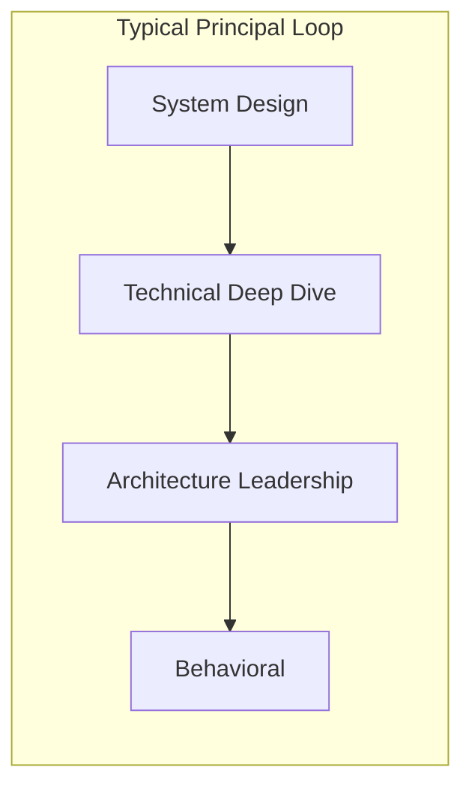
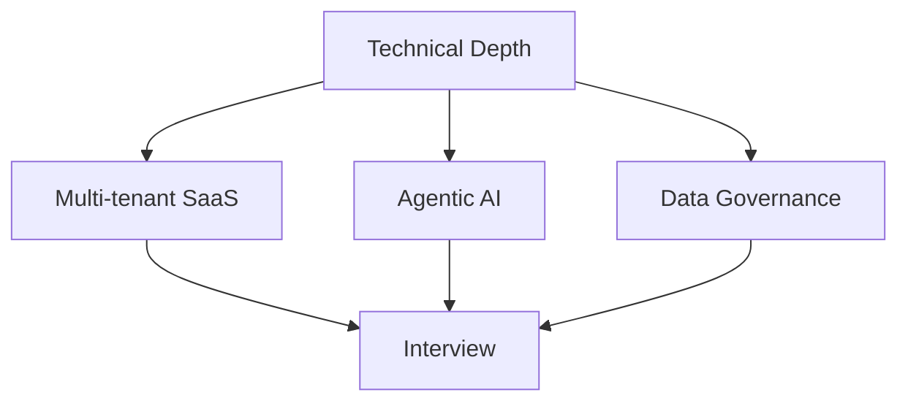

# Adobe Interview Preparation

## Interview Culture

Adobe's principal and distinguished engineer loops evaluate whether you can **own multi-year platform bets** across Creative Cloud, Document Cloud, and Experience Cloud while operating in a **subscription-first, globally distributed SaaS** environment. Panels blend deep technical design with **cross-functional influence**—product, design, security, and compliance are first-class stakeholders, not afterthoughts.

Culture signals that matter at principal level:

- **Customer-centric iteration**: Adobe ships frequently to millions of creative professionals; architects must balance velocity with reliability for revenue-critical workflows (asset sync, licensing, rendering pipelines).
- **Platform thinking**: Individual product teams share identity, storage, notification, and ML inference substrates. Principal candidates are expected to identify **shared primitives** versus **product-specific divergence**.
- **Inclusive leadership**: Behavioral loops probe how you build consensus across geographies (San Jose, Seattle, Noida, Bucharest are common engineering hubs).
- **Craft and quality**: Creative users have low tolerance for data loss (projects, fonts, libraries) and subtle latency in real-time collaboration features.

Interview format (varies by org and level; verify with recruiter):

| Round type | Duration | Principal signal |
|------------|----------|------------------|
| System design | 45–60 min | End-to-end SaaS architecture with multi-tenant isolation |
| Technical deep dive | 45 min | Past project ownership, tradeoffs, incident learnings |
| Architecture leadership | 45 min | Roadmaps, stakeholder alignment, build-vs-buy |
| Behavioral | 30–45 min | Influence, conflict, mentoring, diversity of thought |

**Bar calibration:** Principal (roughly IC5–IC6 equivalent) means you have **repeatedly** led designs that span multiple teams, survived production at scale, and can **teach** senior engineers—not merely participate in reviews.

## Technical Focus Areas

Adobe's architecture surface area is broad. Prioritize depth in areas aligned to the role posting; the list below reflects commonly recurring themes from public engineering content and enterprise SaaS patterns (not internal confidential details).

| Domain | Why it matters at Adobe |
|--------|-------------------------|
| **Multi-tenant SaaS** | Shared services across Creative Cloud and Experience Cloud tenants |
| **Object and asset storage** | Large binary assets, versioning, CDN delivery, sync |
| **Real-time collaboration** | CRDT/OT-adjacent problems for co-editing (conceptual familiarity) |
| **Identity and licensing** | Subscription entitlements, device limits, fraud prevention |
| **Media and rendering pipelines** | Async job queues, GPU farms, preview generation |
| **Search and metadata** | Asset discovery across libraries and enterprise DAM |
| **API platforms** | Extensibility for partners and enterprise integrations |
| **Observability at scale** | SLOs for sync latency, render job completion, API availability |
| **Security and compliance** | SOC2, GDPR, enterprise SSO, content isolation |
| **Cost efficiency** | Egress, storage tiering, GPU utilization for batch render |

Cross-link study: [Multi-Region Architecture](/docs/cloud-architecture/multi-region-architecture), [API Versioning and Evolution](/docs/api-and-integration-architecture/api-versioning-and-evolution), [SLO, SLI, and Error Budgets](/docs/reliability-and-resilience/slo-sli-error-budgets), [Security Architecture Fundamentals](/docs/security/security-architecture-fundamentals).

## System Design Expectations

Principal system design at Adobe-class companies expects **requirements clarification** before boxes-and-arrows. Interviewers reward candidates who surface:

1. **Tenant model**: B2C creatives vs. enterprise seats vs. agency multi-org hierarchies.
2. **Consistency needs**: Metadata vs. binary blob; what can be eventually consistent?
3. **Durability**: RPO for a user's project file vs. analytics event.
4. **Scale dimensions**: DAU, peak upload bandwidth, library size distribution.
5. **Failure modes**: Partial upload, conflict on concurrent edit, region outage.

### Representative design prompts

| Prompt | Core mechanisms to discuss |
|--------|---------------------------|
| Design Creative Cloud asset sync | Chunked upload, content-addressed storage, delta sync, conflict policy |
| Design enterprise font delivery | CDN, license enforcement, tamper resistance, offline cache |
| Design async PDF rendering farm | Queue, priority tiers, idempotent jobs, GPU pool autoscaling |
| Design cross-product notification hub | Fan-out, preference center, deliverability, rate limits |
| Design multi-tenant analytics ingestion | Tenant isolation, schema evolution, cost attribution |

### Strong answer structure

Use the methodology from [System Design Methodology](/docs/system-design/system-design-methodology):

1. Clarify users, scale, and SLAs (5–8 min).
2. High-level components with data flow (10 min).
3. Deep dive on hardest subsystem—usually consistency, scale, or security (15 min).
4. Failure scenarios and observability (5 min).
5. Evolution roadmap and organizational tradeoffs (5 min).

## Leadership and Behavioral Focus

Adobe principal loops test **architecture leadership**, not only diagrams:

- **Influence without authority** across product lines with different P&L owners.
- **Technical debt negotiation**: when to refactor shared platform vs. ship product deadline.
- **Incident command**: calm communication during customer-visible outages.
- **Mentorship**: growing staff engineers into architects.
- **Inclusive decision-making**: soliciting dissent before locking ADRs.

Prepare 6–8 STAR stories mapped to [STAR Story Framework](/docs/behavioral-and-leadership/star-story-framework). At least two should demonstrate **multi-team platform** work; two should show **production incident** or **near-miss** learning; two should show **executive communication**—see [Executive Communication](/docs/architecture-leadership/executive-communication).

## Preparation Strategy

### 8-week plan (adjust to your timeline)

| Week | Focus | Deliverable |
|------|-------|-------------|
| 1–2 | SaaS fundamentals + multi-tenant patterns | One-page tenancy model for a fictional creative product |
| 3 | Asset sync and CDN design | Whiteboard resumable upload with integrity checks |
| 4 | Job orchestration and GPU pools | Design async render queue with priorities |
| 5 | Security, identity, compliance | Threat model for shared library feature |
| 6 | Behavioral stories + Adobe values alignment | 8 polished STAR stories |
| 7 | Full mocks | 2 system design + 1 leadership mock |
| 8 | Light review + recruiter questions | Company-specific org map from posting |

### Daily routine (90 min)

- 30 min: read one Adobe engineering blog post or public conference talk (verify claims; do not treat marketing as architecture truth).
- 30 min: one system design prompt timed.
- 30 min: refine one behavioral story with metrics.

### Recruiter questions to ask

- Which cloud(s) and primary data stores for the team?
- On-call expectations and incident culture?
- Ratio of greenfield vs. legacy migration work?
- How principal promotion is evaluated (committee, portfolio)?

## Common Question Patterns

### Q1: Design a global asset library with sync across devices

**Expected answer signals:**

- Chunked, resumable upload to object storage with client-side hashing.
- Metadata service separate from blob storage; version vectors or logical clocks for conflict detection.
- CDN for read path; origin shield; cache invalidation on publish.
- Per-tenant encryption keys or envelope encryption for enterprise tier.
- Explicit conflict resolution policy (last-write-wins vs. branch vs. user merge).
- Observability: sync latency SLI, upload success rate, stale read detection.

**Follow-ups:**

- How do you handle a 50 GB video project on a laptop with intermittent connectivity?
- What happens when two users rename the same asset offline?

**Red flags:**

- Single monolithic database for blobs and metadata.
- Ignoring entitlement checks on download.
- No idempotency on upload completion callbacks.

**Scoring rubric:**

| Level | Criteria |
|-------|----------|
| Excellent | Full data model, failure modes, multi-region, cost, security, phased rollout |
| Good | Solid components, some depth on sync/conflict, basic HA |
| Adequate | Generic CRUD API without scale or failure analysis |
| Weak | "Use S3 and a database" without mechanism |

**Strong answer outline:** Separate metadata plane (strongly consistent per user namespace) from blob plane (content-addressed, immutable versions). Client uploads parts in parallel with checkpoint tokens. On complete, orchestrator commits version pointer atomically. Sync uses delta manifest comparison. Conflicts surfaced in UI with policy per asset type.

---

### Q2: How would you migrate a monolithic licensing service to microservices without downtime?

**Expected signals:**

- Strangler fig pattern; dual-write or event-sourced migration with reconciliation.
- Idempotent APIs and correlation IDs.
- Feature flags for traffic cutover by tenant cohort.
- Rollback plan and data parity checks.
- Organizational: team ownership boundaries.

**Follow-ups:**

- How long do you run dual-write? What proves cutover safety?

**Red flags:**

- Big-bang cutover without reconciliation.
- Ignoring ordering of entitlement updates.

---

### Q3: Behavioral — Tell me about a time you disagreed with a product leader on architecture.

**Expected signals:**

- Respectful dissent with data (cost, risk, time-to-market).
- Options presented, not ultimatums.
- Outcome and retrospective—even if original position lost.

Use [Leadership Principles](/docs/behavioral-and-leadership/leadership-principles) framing: separate people from positions, document ADR.

---

### Q4: How do you set SLOs for a creative sync service?

**Expected signals:**

- User-journey SLIs (time-to-sync-after-save, upload success).
- Error budgets tied to release policy.
- Tail latency matters for interactive feel.

Link: [SLO, SLI, and Error Budgets](/docs/reliability-and-resilience/slo-sli-error-budgets).

---

### Q5: Design rate limiting for public APIs used by third-party plugins

**Expected signals:**

- Token bucket or leaky bucket per API key and per tenant.
- Distributed counter (Redis/similar) with local burst allowance.
- 429 semantics, Retry-After headers, idempotency keys.
- Abuse detection separate from fair-use throttling.

Link: [Distributed Rate Limiter](/docs/system-design/distributed-rate-limiter).

## Red Flags to Avoid

| Red flag | Why it fails |
|----------|--------------|
| Treating Adobe as "just a CRUD app" | Misses asset scale, media pipelines, compliance |
| No multi-tenant isolation story | Enterprise customers are a major revenue segment |
| Hand-waving creative-specific UX latency | Sync and render latency directly affect NPS |
| Over-indexing on buzzwords (microservices, Kafka) without problem fit | Principal bar requires tradeoff reasoning |
| Ignoring cost of egress and GPU | FinOps matters at scale — see [Cloud Cost Optimization](/docs/cost-and-finops/cloud-cost-optimization) |
| Weak behavioral specifics | "We collaborated well" without metrics and conflict |

## Recommended Study Topics

**Must review:**

1. [System Design Methodology](/docs/system-design/system-design-methodology)
2. [Multi-Region Architecture](/docs/cloud-architecture/multi-region-architecture)
3. [API Versioning and Evolution](/docs/api-and-integration-architecture/api-versioning-and-evolution)
4. [Disaster Recovery and Multi-Region](/docs/reliability-and-resilience/disaster-recovery-and-multi-region)
5. [Executive Communication](/docs/architecture-leadership/executive-communication)
6. [STAR Story Framework](/docs/behavioral-and-leadership/star-story-framework)
7. [Mock Interview Rubric](/docs/mock-interviews/mock-interview-rubric)

**High-value optional:**

- [Video Streaming Platform](/docs/system-design/video-streaming-platform) — parallels media delivery
- [Distributed Cache Design](/docs/system-design/distributed-cache-design) — metadata and session caching
- [Data Governance and Lineage](/docs/data-platforms/data-governance-and-lineage) — Experience Cloud analytics

## Architecture Review Exercise

Review a fictional "Shared Font Service" that serves enterprise customers:

- Single regional PostgreSQL stores all font metadata and binary blobs inline.
- No CDN; clients pull fonts on every document open.
- License check cached forever client-side.

Identify **five principal-level defects** and propose remediations with tradeoffs. Timebox: 45 minutes. Self-score with [Mock Interview Rubric](/docs/mock-interviews/mock-interview-rubric).

## Knowledge Check

1. Why separate metadata and blob storage for creative assets?
2. What consistency model is acceptable for "asset appeared in library" vs. "thumbnail generated"?
3. How do you prove idempotent upload completion under at-least-once delivery?
4. Name three SLIs for a sync product and one anti-pattern SLI.
5. How would you phase a monolith strangler migration for licensing?

## Related Concepts

- [Global File Transfer Platform](/docs/system-design/global-file-transfer-platform) — large file reliability patterns
- [Service Decomposition and DDD](/docs/microservices/service-decomposition-and-ddd) — platform boundaries
- [Architecture Decision Records](/docs/architecture-leadership/architecture-decision-records)

## Additional Interview Questions

### Q6: Design real-time co-editing for Creative Cloud documents

**Expected signals:** Operational transformation or CRDT at conceptual level; presence service; periodic snapshot + operation log; conflict policy per asset type; WebSocket fan-out through regional gateways.

**Follow-ups:** How reduce bandwidth for large canvases? What consistency does cursor position need?

**Scoring rubric:**

| Level | Criteria |
|-------|----------|
| Excellent | OT/CRDT tradeoff, scale, offline edit, security |
| Good | WebSocket + log without formal merge theory |
| Adequate | Lock-based editing only |
| Weak | Last-write-wins for all fields |

---

### Q7: How would you architect subscription entitlement checks at API edge?

**Expected signals:** JWT with short TTL; central entitlement service; cache with invalidation on billing events; graceful degradation read-only mode; audit trail for license violations.

Link: [Security Architecture Fundamentals](/docs/security/security-architecture-fundamentals).

---

### Q8: Behavioral — Drove platform standard adoption across reluctant teams

**Expected signals:** Pilot success metrics; executive sponsor; self-service tooling; sunset date with exceptions process.

---

### Q9: Design analytics pipeline for product usage without PII leakage

**Expected signals:** Event schema registry; aggregation before warehouse; differential privacy or k-anonymity at high level; data minimization; retention policies.

Link: [Data Governance and Lineage](/docs/data-platforms/data-governance-and-lineage).

---

### Q10: Multi-region failover for asset metadata service

**Expected signals:** Active-passive or Cockroach/Spanner-class if strong consistency required; RPO/RTO; DNS/anycast; conflict rules for concurrent edits during partition.

Link: [Disaster Recovery and Multi-Region](/docs/reliability-and-resilience/disaster-recovery-and-multi-region).

## Extended Preparation Strategy

### Day-by-day final two weeks

| Day | Morning (45 min) | Evening (60 min) |
|-----|------------------|------------------|
| Mon | Read Adobe public engineering post | Whiteboard asset sync |
| Tue | STAR story polish (Customer Obsession) | Mock system design Q1 |
| Wed | Review [Distributed Cache Design](/docs/system-design/distributed-cache-design) | Mock system design Q5 |
| Thu | Behavioral mock with peer | Debrief with rubric |
| Fri | Light review flashcards | Rest |
| Sat | Full 3-hour loop simulation | Score and homework |
| Sun | Executive communication drill | Rest |

### Panel-specific calibration

- **Creative Cloud teams:** Emphasize media pipelines, sync, large binaries.
- **Experience Cloud teams:** Emphasize multi-tenant analytics, identity, integrations.
- **Platform teams:** Emphasize shared services, API governance, SLOs.

Ask recruiter which pillar your loop targets and overweight corresponding stories.

### Weak-area remediation map

| If mock score low on… | Study chapter |
|-----------------------|---------------|
| Failure modes | [Chaos Engineering](/docs/reliability-and-resilience/chaos-engineering) |
| API design | [REST, gRPC, and GraphQL](/docs/api-and-integration-architecture/rest-grpc-and-graphql) |
| Cost | [Cloud Cost Optimization](/docs/cost-and-finops/cloud-cost-optimization) |
| Behavioral scope | [STAR Story Framework](/docs/behavioral-and-leadership/star-story-framework) |

## Principal Loop Integration Map

| Loop round | Adobe guide section | Curriculum chapter |
|------------|--------------------|--------------------|
| System design | Common Question Patterns Q1–Q5 | [System Design Mock](/docs/mock-interviews/system-design-mock) |
| Technical deep dive | Architecture Review Exercise | Capstone ADR |
| Leadership | Behavioral Q8 | [Executive Communication](/docs/architecture-leadership/executive-communication) |
| Behavioral | Extended Preparation | [STAR Story Framework](/docs/behavioral-and-leadership/star-story-framework) |

## Final Week Daily Plan

| Day | Focus |
|-----|-------|
| Mon | Review all 10 question patterns aloud |
| Tue | 2× system design mocks |
| Wed | 2× behavioral mocks |
| Thu | Company research + recruiter questions |
| Fri | Light flashcard review only |
| Weekend | Rest |

## Appendix: Deep-Dive Study Modules

### Module A — Creative asset integrity

Study how content-addressed storage interacts with deduplication across tenants. In interviews, explain why two users uploading identical stock assets might share blobs while metadata remains isolated. Discuss legal/licensing implications for enterprise font and stock asset libraries—entitlement must gate download even if blob hash matches.

Practice question: "A user reports a corrupted PSD after sync." Walk through investigation: client log, chunk manifest verification, server-side composite hash, partial upload resume state, CDN cache poisoning (unlikely but mention exclusion). Expected duration: 8-minute verbal postmortem.

### Module B — Subscription and identity coupling

Adobe-class products bind creative entitlements to identity. Design verbal answer for token refresh at API edge, offline grace period for airplane mode, fraud detection on concurrent sessions. Link [Security Architecture Fundamentals](/docs/security/security-architecture-fundamentals).

### Module C — Render farm job prioritization

Async jobs compete: free-tier preview vs paid export vs enterprise batch. Describe priority queue with starvation prevention (aging), preemption policy for GPU jobs, and fairness across tenants. Metrics: job wait time p99 by tier, GPU utilization, cost per render minute.

## References

- Adobe Engineering Blog (public posts on cloud migration, ML, and platform topics) — verify per article.
- Kleppmann, M. *Designing Data-Intensive Applications* — replication, partitioning, stream processing.
- Newman, S. *Building Microservices*, 2nd ed. — decomposition and API evolution.
- Beyer, B. et al. *Site Reliability Engineering* — SLOs and error budgets.
- NIST SP 800-53 (control families) — baseline for enterprise security discussions (implementation-specific).

## Diagram

*Figure: Adobe interview focus areas — SaaS, AI, and governance.*
