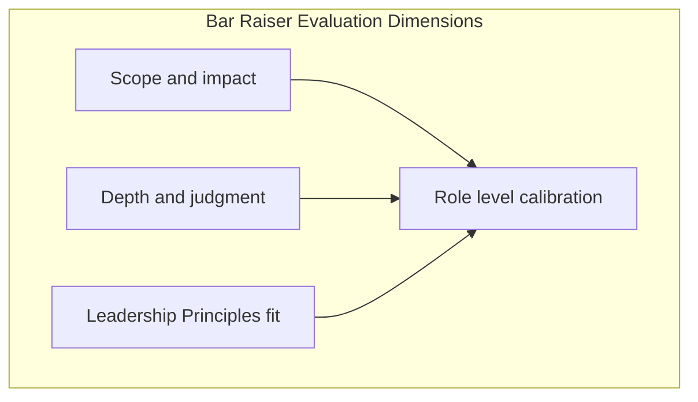
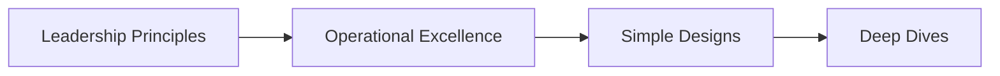

# Amazon and AWS Interview Preparation

## Interview Culture

Amazon's interview process is among the most **structured** in the industry. Every loop includes a **Bar Raiser**—a trained interviewer calibrated across organizations whose primary job is to prevent **single-team bias** and maintain a consistent hiring bar. For Principal Engineer (L7) and Senior Principal (L8) roles, expect **higher ambiguity**, **organizational scope**, and explicit evaluation against the **Leadership Principles (LPs)**.

Key cultural mechanics:

| Mechanism | Principal-level implication |
|-----------|----------------------------|
| **Leadership Principles** | Every answer should map to 1–2 LPs with specific evidence |
| **Bar Raiser** | Expect deep probing on scope, judgment, and durability of impact |
| **Working backwards** | Start from customer problem and press release, not technology |
| **Ownership** | End-to-end accountability including operations and cost |
| **Dive deep** | Interviewers will drill into metrics, logs, and root cause |
| **Disagree and commit** | Show principled dissent then alignment |

Amazon distinguishes **Amazon retail/marketplace** engineering from **AWS** service teams. AWS loops emphasize **service ownership at global scale**, **API backward compatibility**, **multi-tenant isolation**, and **operational excellence** (pager load, COE culture). Retail loops may emphasize **supply chain**, **personalization**, or **fulfillment** domains—tailor preparation to the job description.

**Loop composition (typical, not guaranteed):**

- 1–2 system design / architecture interviews (60 min)
- 1 technical deep dive on your largest project (60 min)
- 2–3 behavioral LP interviews (45–60 min each)
- Bar Raiser round (behavioral + scope calibration)
- Optional: manager round, executive summary for L8+

**Coding:** Classic algorithms rounds are **uncommon** at principal level — loops emphasize system design and project deep dive. See [Coding Preparation](/docs/coding-preparation/overview) if any round is confirmed.

## Technical Focus Areas

### AWS service architect patterns

| Area | Interview relevance |
|------|---------------------|
| **Regional isolation + global control plane** | Blast radius, cell-based architecture |
| **API evolution** | Versioning without breaking millions of customers |
| **Multi-tenancy and noisy neighbor** | Fair queuing, quotas, rate limits |
| **Durability and availability** | SLO tiers, multi-AZ, cross-region replication |
| **Distributed systems primitives** | Dynamo-style partitioning, SQS semantics, S3 durability model (conceptual) |
| **Cost as architecture attribute** | Per-request economics, Graviton, storage tiering |
| **Security model** | IAM, SCPs, encryption, audit |

Study anchors in this curriculum: [Amazon Dynamo](/docs/distributed-databases/amazon-dynamo), [DynamoDB](/docs/distributed-databases/dynamodb), [AWS Fundamentals](/docs/cloud-architecture/aws-fundamentals), [API Versioning and Evolution](/docs/api-and-integration-architecture/api-versioning-and-evolution).

### Amazon-wide systems thinking

- **High availability** during peak events (Prime Day class—discuss patterns, not confidential capacity numbers).
- **Event-driven architecture** at warehouse scale.
- **Machine learning in production** for recommendations and fraud (conceptual pipeline design).

## System Design Expectations

Amazon system design interviews reward **customer obsession translated into mechanisms**. Weak candidates jump to services; strong candidates:

1. Define the **customer** and **pain** (internal or external).
2. State **SLAs/SLOs** and **scale** with orders of magnitude.
3. Identify **tenancy**, **consistency**, and **durability** requirements.
4. Design for **failure** as the common case.
5. Discuss **rollout**, **monitoring**, and **rollback**.
6. Close with **cost** and **operational load**.

### High-frequency prompts

| Prompt | Principal depth |
|--------|-----------------|
| Design S3-like object storage | Durability math, metadata partitioning, eventual consistency listing |
| Design SQS-like queue | Visibility timeout, at-least-once, DLQ, backpressure |
| Design regional API gateway | AuthN/Z, throttling, routing, cell isolation |
| Design metrics aggregation for AWS service | Cardinality control, rollup, hot shards |
| Design multi-tenant workflow engine | Isolation, quotas, poison pill handling |

### Working backwards exercise

For any design prompt, spend 2 minutes on a **fake press release headline** and **FAQ** ("What if a region fails?"). This mirrors Amazon's PR/FAQ process and signals seniority.

## Leadership and Behavioral Focus

Prepare **20+ STAR stories** indexed by Leadership Principle. At principal level, stories must show:

- **Years-long impact**, not one-quarter wins.
- **Org-wide influence** (multiple teams, sometimes multiple VP chains).
- **Corrective action** after failure—Amazon values learning from COEs (Correction of Error).

See [Leadership Principles](/docs/behavioral-and-leadership/leadership-principles) for LP-to-story mapping and [STAR Story Framework](/docs/behavioral-and-leadership/star-story-framework) for structure.

### LPs most probed for principals

| LP | Story archetype |
|----|-----------------|
| **Ownership** | You owned a problem no one else's job description covered |
| **Dive Deep** | You found root cause executives missed |
| **Invent and Simplify** | You removed complexity while improving reliability |
| **Are Right, A Lot** | Good judgment with incomplete data |
| **Deliver Results** | Shipped despite obstacles—with metrics |
| **Hire and Develop the Best** | Built bench strength; improved bar |
| **Think Big** | Multi-year technical vision executed in phases |
| **Frugality** | Major cost win without reliability regression |
| **Bias for Action** | Calculated risk with reversible decision |
| **Earn Trust** | Recovered from credibility hit |

**Bar Raiser calibration questions:**

- "What would you do differently?"
- "How did you know it worked?"
- "Who disagreed and what happened?"

## Preparation Strategy

### 10-week AWS-focused plan

| Weeks | Activity |
|-------|----------|
| 1–2 | LPs: write 20 story bullets; refine top 12 to full STAR |
| 3–4 | AWS Well-Architected pillars applied to 4 designs |
| 5 | Dynamo, S3, SQS deep reads + whiteboard from memory |
| 6 | Failure mode drills: region loss, AZ loss, dependency brownout |
| 7 | Cost modeling on two designs (unit economics) |
| 8 | Two full-loop mocks with LP + system design |
| 9 | Bar Raiser-style behavioral mock (skeptical interviewer) |
| 10 | Rest, light review, logistics |

### LP interview mechanics

- Use **STAR** but front-load **result and scale**.
- Include **"I"** not only **"we"** for your specific decisions.
- Quantify: latency, cost, availability, developer velocity, incidents avoided.
- Keep stories **under 3 minutes** initial; leave hooks for follow-ups.

### System design mechanics

- Write requirements on virtual whiteboard; get interviewer buy-in.
- State **non-goals** explicitly.
- Draw **data flow** before component list.
- Reserve 10 min for **deep dive** interviewer chooses.

## Common Question Patterns

### Q1: Design a durable, highly available key-value store (Dynamo-flavored)

**Expected signals:**

- Partitioning by key hash; consistent hashing or virtual nodes.
- Quorum reads/writes (R + W > N) or leader-based alternative with tradeoffs.
- Hinted handoff, anti-entropy, read repair for repair paths.
- Sloppy quorum and merkle trees as optional advanced topics.
- Failure: node crash mid-write, network partition behavior.

**Follow-ups:**

- How do you add a node without full reshuffle?
- What consistency does the client observe?

**Scoring rubric:**

| Level | Description |
|-------|-------------|
| Excellent | Explicit CAP/PACELC tradeoff, failure scenarios, operational tooling |
| Good | Partitioning + replication + basic quorum |
| Adequate | "Master-replica MySQL" without partition tolerance |
| Weak | No failure analysis |

Link: [Amazon Dynamo](/docs/distributed-databases/amazon-dynamo), [Leaderless Replication](/docs/replication/leaderless-replication).

---

### Q2: How do you roll out a breaking API change to millions of customers?

**Expected signals:**

- Versioned endpoints; deprecation timeline; telemetry on old version usage.
- Dual-stack period; client SDK coordination.
- Communication and opt-in beta.

Link: [API Versioning and Evolution](/docs/api-and-integration-architecture/api-versioning-and-evolution).

---

### Q3: LP — Tell me about a time you took a calculated risk

**Structure:**

- Situation: ambiguous market or technical bet.
- Risk: what could fail; how you bounded blast radius.
- Action: reversible steps, metrics, fallback.
- Result: outcome; what you learned.

**Red flags:** Reckless heroics; no metrics; blame external teams.

---

### Q4: Design regional failover for a control plane API

**Expected signals:**

- Active-passive or active-active; DNS/anycast health checks.
- Split-brain prevention; fencing tokens for writers.
- RPO/RTO stated; data replication lag budget.
- Runbook and game days.

Link: [Disaster Recovery and Multi-Region](/docs/reliability-and-resilience/disaster-recovery-and-multi-region).

---

### Q5: How would you reduce AWS bill for a data pipeline by 30% without SLA regression?

**Expected signals:**

- Measure first; unit cost per workload.
- Right-sizing, Graviton, spot for fault-tolerant batch.
- Storage lifecycle, compression, deduplication.
- Architecture change (push vs pull, caching).

Link: [Cloud Cost Optimization](/docs/cost-and-finops/cloud-cost-optimization).

**Note:** Do not invent guaranteed savings percentages for specific customers; discuss **levers** and **measurement**.

## Red Flags to Avoid

| Red flag | Bar Raiser reaction |
|----------|---------------------|
| Cannot name your metrics | "Dive Deep" fail |
| Hero narrative without team development | "Hire and Develop" gap |
| Technology-first answers | Missing Customer Obsession |
| Blaming other teams | Earn Trust concern |
| No scope beyond single team | Level too low |
| Hand-waving operations | "Ownership" incomplete |
| Unfamiliar with LP names | Culture unpreparedness |

## Recommended Study Topics

**Core curriculum:**

1. [Leadership Principles](/docs/behavioral-and-leadership/leadership-principles)
2. [Amazon Dynamo](/docs/distributed-databases/amazon-dynamo)
3. [AWS Fundamentals](/docs/cloud-architecture/aws-fundamentals)
4. [System Design Methodology](/docs/system-design/system-design-methodology)
5. [Idempotency](/docs/distributed-systems-foundations/idempotency)
6. [SLO, SLI, and Error Budgets](/docs/reliability-and-resilience/slo-sli-error-budgets)
7. [Mock Interview Rubric](/docs/mock-interviews/mock-interview-rubric)

**AWS public references (primary sources):**

- AWS Well-Architected Framework (official documentation)
- Amazon Builder Library (selected articles on scaling and operations)
- Werner Vogels' All Things Distributed blog (archival posts on eventual consistency)

## Whiteboard Explanation

Practice explaining **SQS visibility timeout** in 5 minutes: draw producer, queue, consumer, delete on success, timeout redelivery, DLQ after N attempts. State **at-least-once** guarantee and idempotent consumer requirement.

## Interview Follow-Ups

Prepare for "What if?" chains:

- Dependency on DynamoDB throttles — backpressure design?
- Customer reports data loss — your investigation steps?
- Two VP stakeholders want incompatible architectures — your process?

## Related Concepts

- [Transactional Outbox](/docs/transactions/transactional-outbox) — reliable event publishing
- [Chaos Engineering](/docs/reliability-and-resilience/chaos-engineering) — validation culture
- [Distributed Rate Limiter](/docs/system-design/distributed-rate-limiter)

## Additional Interview Questions

### Q6: Design S3 cross-region replication with compliance constraints

**Expected signals:** Replication configuration per bucket; KMS keys per region; fail-over read path; list consistency caveats; cost of replication bandwidth.

**Follow-ups:** Customer requires EU-only data — architecture?

---

### Q7: LP — Insist on the Highest Standards during crunch

**Expected signals:** Refused to ship without load test; negotiated timeline with data; outcome metrics.

---

### Q8: Design internal service discovery at 10k services

**Expected signals:** Sidecar vs central registry; health checks; stale cache problem; mesh optional.

Link: [Service Mesh and Sidecars](/docs/microservices/service-mesh-and-sidecars).

---

### Q9: How handle cascading failure in microservice graph?

**Expected signals:** Timeouts, bulkheads, circuit breakers, retry budgets, graceful degradation.

Link: [Resilience Patterns](/docs/microservices/resilience-patterns).

---

### Q10: Write COE summary for regional outage (verbal exercise)

**Expected signals:** Timeline, root cause, corrective actions, preventive mechanisms, no blame.

## Extended Bar Raiser Preparation

### COE-style narrative structure

1. **Impact:** Customer minutes unavailable, revenue at risk (ranges, not invented precision).
2. **Timeline:** Detection, escalation, mitigation, recovery.
3. **Root cause:** Technical mechanism, not person.
4. **Actions:** Short-term fix vs long-term mechanism.
5. **Lessons:** What changed in architecture or process.

Practice converting a real incident into 5-minute COE verbal summary.

### System design deep-dive menu

Rotate weekly deep dives:

| Week | Topic | Curriculum |
|------|-------|------------|
| 1 | Quorum KV | [Amazon Dynamo](/docs/distributed-databases/amazon-dynamo) |
| 2 | Queue semantics | [Message Delivery Semantics](/docs/messaging-and-streaming/message-delivery-semantics) |
| 3 | Idempotent APIs | [Idempotency](/docs/distributed-systems-foundations/idempotency) |
| 4 | Multi-region | [Multi-Region Architecture](/docs/cloud-architecture/multi-region-architecture) |

### Mock loop schedule (Amazon-specific)

| Session | Type | Duration |
|---------|------|----------|
| 1 | LP Ownership + Dive Deep | 2× 60 min |
| 2 | System design Dynamo-flavored | 60 min |
| 3 | LP Think Big + Frugality | 2× 60 min |
| 4 | Bar Raiser simulation | 60 min |
| 5 | System design + LP combo | 90 min |

Score all with [Mock Interview Rubric](/docs/mock-interviews/mock-interview-rubric).

## Comprehensive Question Bank (Principal Bar)

### Technical strategy

**Q:** How would you define a three-year technical vision for an AWS service with 50 teams consuming your API?

**Expected signals:** Vision anchored in customer outcomes; phased milestones; measurable adoption metrics; deprecation policy for legacy endpoints; investment in observability and developer experience as first-class product features.

**Follow-ups:** How do you kill a popular but costly feature? How do you measure developer productivity without vanity metrics?

**Scoring rubric:** Excellent answers include explicit tradeoffs between backward compatibility and innovation velocity, plus a governance model (architecture review, API standards council).

---

### Operational excellence

**Q:** Your service missed SLO three months in a row. What do you do as principal owner?

**Expected signals:** Error budget policy enforcement (slow launches, freeze risky changes); blameless postmortem; SLI refinement if measuring wrong thing; capacity plan; executive communication with dates and confidence levels.

Link: [SLO, SLI, and Error Budgets](/docs/reliability-and-resilience/slo-sli-error-budgets).

---

### Organizational design

**Q:** Conway's Law is hurting your platform—teams ship incompatible event schemas. Your approach?

**Expected signals:** Schema registry with CI gates; paved road tooling; optional standards becoming mandatory with sunset; team topology change only if other levers exhausted.

Link: [Service Decomposition and DDD](/docs/microservices/service-decomposition-and-ddd).

## Day-of-Interview Checklist

- [ ] 12 STAR stories indexed by LP (printed or offline notes allowed only if recruiter confirms)
- [ ] Whiteboard legend: solid lines sync, dashed async, red failure boundaries
- [ ] Clarifying question list memorized (users, scale, SLAs, non-goals)
- [ ] Two questions for each interviewer about team topology and on-call
- [ ] Sleep 7+ hours; avoid cramming morning of loop

## Appendix: AWS Service Design Patterns (Verbal Drills)

### Pattern 1 — Cell-based architecture

Explain how to partition customers into **cells** (isolated stacks) to limit blast radius. Each cell has own databases and queues; global control plane routes new tenants. Tradeoff: operational overhead vs failure isolation. When interviewer asks "region down," answer at cell and region two levels.

### Pattern 2 — Throttling as fairness primitive

APIs without fairness degrade under noisy neighbor. Describe token bucket per account, burst credits, exponential backoff guidance in SDK, and 429 response contract. Link [Distributed Rate Limiter](/docs/system-design/distributed-rate-limiter).

### Pattern 3 — Multi-tenant data plane isolation

Options: silo (database per tenant), pool (shared schema with tenant_id), bridge (hybrid). Principal answer picks based on regulatory tier, not ideology. Discuss connection pool exhaustion in pool model and migration cost in silo model.

### Pattern 4 — Deployment safety

Canary → linear → full with automatic rollback on error rate SLO burn. Feature flags decouple deploy from release. COE if canary skipped under pressure—behavioral story opportunity.

### Pattern 5 — DynamoDB access pattern design

Single-table design vs multi-table; GSI cost and eventual consistency on index; hot partition detection via CloudWatch (conceptual). Interview: "Design ticket booking" with avoid hot concert ID partition—scatter key suffix strategy.

### Pattern 6 — S3 consistency model verbal

Strong read-after-write for new objects; list eventual consistency (historical nuance—verify current AWS docs). Design listing pipeline aware of stale list results.

### Pattern 7 — Principal loop integration

Map each AWS Well-Architected pillar to one STAR story and one system design component you can draw in under 60 seconds. Rehearse transitions between LP behavioral and technical depth rounds without losing energy.

## References

- Amazon Jobs — Leadership Principles (official page).
- AWS Well-Architected Framework.
- DeCandia, G. et al. "Dynamo: Amazon's Highly Available Key-value Store" (SOSP 2007).
- Kleppmann, *DDIA* — Chapters on replication and partitioning.
- Beyer et al., *Site Reliability Engineering* — SLO chapters.

## Diagram

*Figure: Amazon interview loop — LPs, operations, and first-principles design.*
