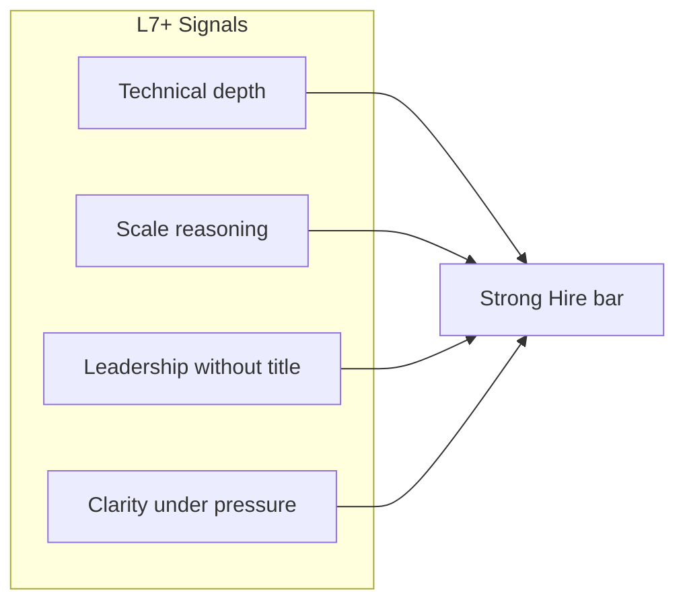
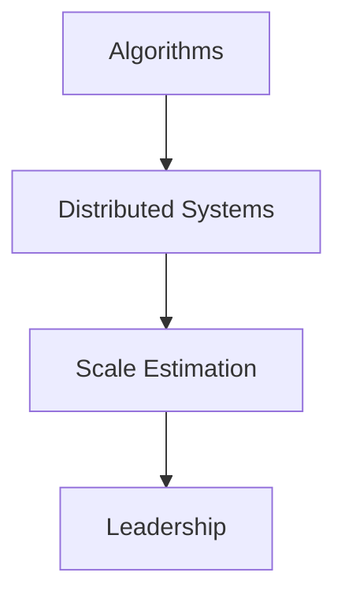

# Google Interview Preparation

## Interview Culture

Google's senior staff, principal (L7), and distinguished (L8+) loops emphasize **first-principles reasoning**, **scale**, and **technical leadership** across org boundaries. The culture blends **research-grade rigor** with **production SRE discipline**—candidates are expected to move fluidly between asymptotic complexity and **error budget** policy.

Distinctive cultural elements:

| Element | Principal interview signal |
|---------|---------------------------|
| **Googleyness** | Collaboration, ambiguity tolerance, intellectual humility |
| **Scope at scale** | Designs affecting billions of users or exabytes |
| **SRE partnership** | Reliability is designed in, not bolted on |
| **Code/readability** | Some loops include coding; principals may face design + code hybrid |
| **Cross-org impact** | L7+ requires influence beyond immediate team |
| **Data-driven decisions** | Experiments, metrics, causal caution |

Level calibration (publicly discussed ranges; verify with recruiter):

- **Senior (L5)**: Owns features end-to-end.
- **Staff (L6)**: Owns systems; sets direction for team.
- **Senior Staff / Principal (L7)**: Multi-team architecture; org-wide standards.
- **Distinguished (L8)**: Company-wide bets; industry-level impact.

Principal candidates should demonstrate **L7 scope minimum**: you have been the **go-to architect** for a critical system, mentored staff engineers, and influenced roadmaps you do not own.

**Typical loop (varies by org):**

- 2–3 system design / architecture rounds
- 1–2 coding rounds (may be omitted or replaced for very senior IC track—confirm)
- 1 "Googleyness / leadership" round
- Hiring committee packet review after interviews

## Technical Focus Areas

Google's internal stack (Borg, Colossus, Spanner, etc.) informs **interview patterns** even when candidates design on whiteboard without naming Google tech.

| Domain | Why panels probe it |
|--------|---------------------|
| **Distributed storage** | GFS/Colossus lineage; replication and checksums |
| **Global databases** | TrueTime, external consistency (Spanner concepts) |
| **Batch + stream** | MapReduce, Flume, Dataflow mental models |
| **RPC and service mesh** | Stubby/gRPC, load balancing, deadlines |
| **Search and indexing** | Inverted indexes, sharding, freshness |
| **Ads and auction systems** | Low-latency, correctness, fraud (role-dependent) |
| **ML infrastructure** | Training/serving separation (role-dependent) |
| **Privacy and safety** | Data minimization, access controls |

Curriculum links: [Google Spanner](/docs/distributed-databases/google-spanner), [Physical and Logical Time](/docs/time-ordering-and-coordination/physical-and-logical-time), [Observability Fundamentals](/docs/observability/observability-fundamentals).

## System Design Expectations

Google system design interviews often start **ambiguous** ("Design Google Drive") and reward:

1. **Capacity estimation** (back-of-envelope QPS, storage, bandwidth).
2. **API design** with clear consistency semantics.
3. **Deep dive** on one bottleneck (index, hot shard, metadata).
4. **Tradeoff articulation** with alternatives rejected.
5. **Evolution** from MVP to global scale.

### Estimation discipline

Show work explicitly:

- DAU → QPS (peak factor 2–3×).
- Average object size × objects per user → storage.
- Read/write ratio drives caching strategy.

Panels notice candidates who **skip math** or use implausible constants without labeling assumptions.

### Representative prompts

| Prompt | Depth topics |
|--------|--------------|
| Design web search crawler + index | Politeness, frontier queue, duplicate detection, incremental index |
| Design YouTube video upload and playback | Chunked upload, transcoding pipeline, CDN, adaptive bitrate |
| Design Google Docs collaboration | OT/CRDT concepts, presence, snapshot + operation log |
| Design distributed tracing at Google scale | Sampling, tail-based sampling, cardinality |
| Design global ID generator | Snowflake, UUID, TrueTime-ordered IDs tradeoffs |

## Leadership and Behavioral Focus

Google leadership rounds assess **influence**, **conflict resolution**, and **ethical judgment**. Prepare stories showing:

- **Technical standards** you drove across teams (linting, SLO policy, API guidelines).
- **Disagreement with senior leadership** resolved with data.
- **Developing others** — promotion packets you sponsored.
- **Failure** — postmortem culture; blameless learning.

Use [STAR Story Framework](/docs/behavioral-and-leadership/star-story-framework) and [Executive Communication](/docs/architecture-leadership/executive-communication).

**Googleyness behaviors:**

- Credit teammates; avoid ego battles.
- Admit unknowns; propose how to learn.
- Show curiosity in follow-ups.

## Preparation Strategy

### 12-week Google-focused plan

| Phase | Weeks | Focus |
|-------|-------|-------|
| Foundations | 1–3 | DDIA-aligned reads; Spanner paper; SRE book SLO chapters |
| Design drills | 4–7 | 2 timed designs/week; peer review with rubric |
| Coding maintenance | 8–9 | [Practice Routine](/docs/coding-preparation/practice-routine) — 3 design-adjacent problems/week if coding expected |
| Leadership | 10 | 10 STAR stories; Googleyness mock |
| Integration | 11 | Full-day mock loop |
| Taper | 12 | Cheat sheets; rest |

### SRE crossover preparation

Even for pure architecture roles, understand:

- **SLI/SLO/error budget** policy linkage to launch decisions.
- **Toil** reduction via automation.
- **Blameless postmortems** structure.

Link: [SLO, SLI, and Error Budgets](/docs/reliability-and-resilience/slo-sli-error-budgets).

Link: [Coding Preparation](/docs/coding-preparation/overview) for problem bank and mocks.

### Reading list (primary sources)

- Corbett et al., "Spanner: Google's Globally-Distributed Database" (OSDI 2012).
- Dean & Ghemawat, MapReduce paper (OSDI 2004).
- Beyer et al., *Site Reliability Engineering*.

## Common Question Patterns

### Q1: Design a globally consistent ad counter with strict correctness

**Expected signals:**

- Clarify: per-campaign? per-user impression cap? fraud constraints?
- Strong consistency vs. approximate counts with reconciliation.
- Idempotent impression logging; dedup keys.
- Sharding by campaign ID; hot campaign mitigation.
- Audit trail for billing disputes.

**Follow-ups:**

- How do you handle cross-region clock skew without TrueTime?
- What if duplicate events arrive?

**Scoring rubric:**

| Level | Criteria |
|-------|----------|
| Excellent | Consistency model explicit; fraud; sharding; reconciliation job |
| Good | Solid logging pipeline + aggregate store |
| Adequate | Single Redis counter globally |
| Weak | Lost updates under concurrency |

---

### Q2: Explain external consistency vs. linearizability

**Expected signals:**

- Linearizability: real-time ordering of ops.
- Spanner external consistency: transaction order respects wall-clock uncertainty bounds (TrueTime)—cite paper, don't overclaim other DBs.

Link: [Linearizability](/docs/consistency/linearizability), [Google Spanner](/docs/distributed-databases/google-spanner).

---

### Q3: Design shard management for a 10 PB database

**Expected signals:**

- Range vs. hash partitioning; rebalancing with minimal movement.
- Consistent hashing or directory-based sharding.
- Hot spot detection and split.
- Control plane vs. data plane separation.

---

### Q4: Behavioral — Tell me about a technical decision you reversed

**Expected signals:**

- Early hypothesis; metric that proved wrong.
- How you communicated reversal without losing trust.
- New architecture and outcome.

---

### Q5: How do you prevent cascading failure in a microservice graph?

**Expected signals:**

- Timeouts, deadlines, bulkheads, circuit breakers.
- Load shedding; retry budgets; jitter.
- Critical path identification.

Link: [Resilience Patterns](/docs/microservices/resilience-patterns).

## Red Flags to Avoid

| Red flag | Panel concern |
|----------|---------------|
| Buzzword architecture without numbers | Insufficient depth |
| Cannot discuss failure modes | Not production-minded |
| Dismisses SRE concerns | Poor partnership |
| Overclaims Spanner/TrueTime for every problem | Weak judgment |
| Solo hero stories | Googleyness concern |
| Perfect answers without tradeoffs | Lack of intellectual honesty |

## Recommended Study Topics

1. [Google Spanner](/docs/distributed-databases/google-spanner)
2. [Consensus Problem](/docs/consensus/consensus-problem) and [Raft](/docs/consensus/raft)
3. [System Design Methodology](/docs/system-design/system-design-methodology)
4. [News Feed](/docs/system-design/news-feed) — fan-out at scale
5. [Chat Platform](/docs/system-design/chat-platform) — real-time patterns
6. [Distributed Systems Mock](/docs/mock-interviews/distributed-systems-mock)
7. [Mock Interview Rubric](/docs/mock-interviews/mock-interview-rubric)

## Architecture Review Exercise

Given: global metadata service using last-write-wins across regions with 200 ms replication lag. Clients read local replica. **List safety violations** for a financial reporting use case vs. a social "like count" use case. Propose architecture per use case.

## Knowledge Check

1. When is eventual consistency unacceptable for a Google-scale product?
2. Sketch Spanner's role of TrueTime in commit wait.
3. How does tail latency amplification occur in RPC chains?
4. What is a error budget policy for a 99.9% SLO?
5. Name three ways to handle a hot shard.

## Related Concepts

- [PACELC](/docs/consistency/pacelc)
- [Kafka Architecture](/docs/messaging-and-streaming/kafka-architecture)
- [Chaos Engineering](/docs/reliability-and-resilience/chaos-engineering)

## Additional Interview Questions

### Q6: Design Google Maps tile serving

**Expected signals:** Tile pyramid; CDN; precomputed vs dynamic; cache keys by zoom/x/y; invalidation on map data update.

**Follow-ups:** Traffic spike during disaster event?

---

### Q7: Design distributed cron at scale

**Expected signals:** Leader election for scheduler; idempotent job execution; clock skew; missed fire handling.

Link: [Distributed Leases](/docs/consensus/distributed-leases).

---

### Q8: Coding-adjacent — design autocomplete for search box

**Expected signals:** Trie or finite state transducer (conceptual); prefix index; personalization optional; latency budget breakdown.

---

### Q9: Behavioral — Googleyness under ambiguous mandate

**Expected signals:** Structured ambiguity reduction; stakeholder alignment; measurable milestone.

---

### Q10: Compare Bigtable vs Spanner for time-series metrics

**Expected signals:** Wide-column vs globally consistent SQL; write pattern; query pattern; cost model qualitative.

## Extended Preparation Strategy

### Estimation drills (daily, 10 min)

| Prompt | Target output |
|--------|---------------|
| 1B searches/day | QPS order of magnitude |
| 500M photos/day avg 2MB | Storage per year |
| 50ms p99 RPC chain 5 hops | Tail latency risk |

Document assumptions on whiteboard before calculating.

### Google-specific reading path

1. Spanner paper — commit wait section only, first pass.
2. MapReduce paper — fault tolerance via re-execution.
3. Borg paper summary (public versions) — cluster scheduling concepts.
4. Google SRE book — SLO chapter + postmortem chapter.

### Full-loop simulation agenda (1 day)

| Time | Session |
|------|---------|
| 9:00 | System design (search/index prompt) |
| 10:30 | Coding or algorithms (if applicable) |
| 12:00 | Lunch |
| 1:00 | System design (storage prompt) |
| 2:30 | Googleyness / leadership |
| 4:00 | Hiring committee debrief self-review |

Use [Distributed Systems Mock](/docs/mock-interviews/distributed-systems-mock) Session F for afternoon warmup.

### Level defense script

When asked "Why principal?": cite **multi-team**, **multi-year**, **mechanism** (standards, platforms), and **metric**—prepare 60-second script.

Prepare 60-second script.

## Comprehensive Question Bank

### Q11: Design Google Drive file sync (subset)

**Expected signals:** Metadata/blob split; chunk-level sync; conflict detection; bandwidth optimization; security per file ACL.

**Rubric:** Depth on conflict policy separates staff from principal.

---

### Q12: How would you debug 2× latency regression across all services?

**Expected signals:** Golden signals dashboard; trace sampling; deploy correlation; dependency matrix; bisect binary search on releases.

Link: [Observability Fundamentals](/docs/observability/observability-fundamentals).

---

### Q13: Design ad click aggregation with fraud detection

**Expected signals:** Idempotent click ingestion; bot scoring pipeline; separate real-time approximate vs offline exact billing reconciliation.

---

### Q14: Principal scope defense — verbal exercise

Practice answering in 60 seconds: "What is the largest technical scope you have owned?" Include people influenced, duration, metrics, and mechanism left behind.

## Mental Model Cheat Sheet

| Concept | One-line interview use |
|---------|------------------------|
| Gossip protocol | Scalable cluster membership awareness |
| Bloom filter | Reduce unnecessary disk reads |
| Consistent hashing | Minimal key movement on scale |
| Vector clock | Detect concurrent updates |
| Backpressure | Protect upstream from overload |

## Appendix: Google-Scale Design Drills

### Drill 1 — Search index freshness vs crawl politeness

Crawlers respect robots.txt and rate limits per domain. Index pipeline prioritizes high PageRank or high change frequency—state both dimensions. Discuss spam and cloaking detection at high level. Failure: crawler storm takes down small publisher—mitigate with per-domain budget.

### Drill 2 — Spanner transaction example (verbal)

Two bank accounts in different rows—transfer requires transactional invariant. Explain two-phase commit at Spanner layer with commit wait until TrueTime uncertainty bound passes. Contrast with per-row eventual consistency insufficient for debit/credit.

### Drill 3 — Tail latency at Google scale

If each hop adds independent latency, p99 explodes. Mitigations: deadline propagation, backup requests (caution: load), hedging only on idempotent reads, load shedding. Cite "The Tail at Scale" (Dean & Barroso) as conceptual reference.

### Drill 4 — Borg scheduling (conceptual)

Cluster scheduler assigns jobs to machines with constraints (GPU, locality). Preemption for higher priority batch jobs. Architect analogy: Kubernetes descends from Borg ideas—use for Microsoft/Google crossover prep.

### Drill 5 — SRE error budget policy role-play

Interviewer plays product manager pushing risky launch. You explain error budget exhausted—options: delay, canary to 1%, reduce scope. Practice calm executive tone from [Executive Communication](/docs/architecture-leadership/executive-communication).

### Drill 6 — Bigtable row key design

Avoid hot row by salting or reversing timestamp in key. Interview: "Design sensor metrics storage" with high write rate per device—row key spreads writes.

### Drill 7 — MapReduce straggler mitigation

Speculative execution of slow tasks; determinism requirement. Connect to batch pipeline reliability.

### Drill 8 — Colossus/GFS chunk size tradeoff

Large chunks reduce metadata; small files wasteful. Tail latency for small file reads—mitigate with bundling.

### Drill 9 — Full mock: Design Google Photos thumbnail pipeline

Upload → object store → pub/sub → thumbnail workers (multiple sizes) → metadata DB update → CDN cache. Deep dive: deduplication by perceptual hash; cost of storage tiers; deletion propagation. Time 45 minutes; score with [System Design Mock](/docs/mock-interviews/system-design-mock) rubric.

### Drill 10 — Coding/system hybrid: Design rate limiter for internal RPC

Token bucket per caller service; distributed store; local burst cache; sync interval tradeoff. Link [Distributed Rate Limiter](/docs/system-design/distributed-rate-limiter).

## Preparation Workbook: 14-Day Google Intensive

**Days 1–3 — Foundations:** Read Spanner paper abstract and commit wait section. Complete [PACELC](/docs/consistency/pacelc) knowledge check. Whiteboard Lamport clock example with three events.

**Days 4–6 — Estimation:** Daily 10-minute drill: pick random product (Gmail, Maps, Photos), estimate QPS and storage. Compare with partner; discuss assumptions not accuracy.

**Days 7–9 — System design mocks:** Run Drill 9 (Photos pipeline) and Mock 2 from [System Design Mock](/docs/mock-interviews/system-design-mock). Score ≥3 on depth and failure dimensions.

**Days 10–12 — Distributed mocks:** Sessions C (Raft) and F (Spanner) from [Distributed Systems Mock](/docs/mock-interviews/distributed-systems-mock). Verbalize safety/liveness for each.

**Days 13–14 — Integration:** One behavioral Googleyness story polished; one 60-second "why Google" answer without clichés. Review [Google Interview Preparation](/docs/company-specific-preparation/google) question bank Q1–Q14.

**Success criteria:** Can draw search index pipeline in 5 minutes; explain external consistency in 2 minutes; deliver three STAR stories with scale metrics.

## Final Interview Readiness Checklist

Before your onsite or virtual loop, confirm each item:

- [ ] Completed at least two timed mocks scored with [Mock Interview Rubric](/docs/mock-interviews/mock-interview-rubric)
- [ ] Can articulate three architecture decisions from your resume with tradeoffs in under 3 minutes each
- [ ] Prepared five clarifying questions for system design (users, scale, SLAs, consistency, non-goals)
- [ ] Behavioral story bank indexed to company values or Leadership Principles
- [ ] Reviewed company-specific guide question bank for your target employer
- [ ] Linked technical answers to curriculum chapters studied (demonstrates depth if asked what you read)
- [ ] Practiced drawing one architecture diagram from memory in under 4 minutes
- [ ] Identified weakest rubric dimension and studied linked chapter in final 72 hours
- [ ] Prepared two thoughtful questions per interviewer about team scope and success metrics
- [ ] Logistics confirmed: whiteboard tool, time zones, loop schedule, rest breaks planned

Principal loops reward **consistent depth across rounds**, not one brilliant performance. Sleep and pacing matter as much as cramming additional facts.

## References

- Google Research publications (Spanner, MapReduce, Bigtable papers).
- Kleppmann, *Designing Data-Intensive Applications*.
- Beyer et al., *Site Reliability Engineering*.
- Shute et al., "F1: A Distributed SQL Database" (VLDB 2013) — for SQL at scale discussions.

## Diagram

*Figure: Google interview emphasis — algorithms, distributed systems, scale.*
