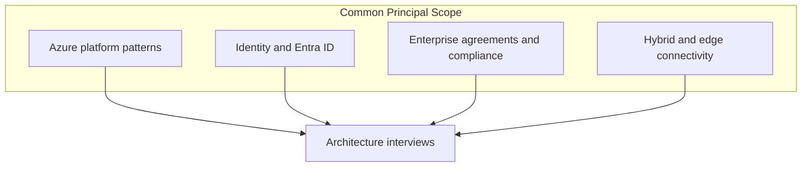
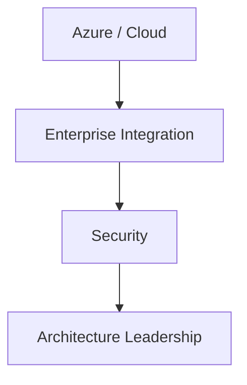

# Microsoft Interview Preparation

## Interview Culture

Microsoft's principal architect and distinguished engineer loops reflect a **mature enterprise software culture** reshaped by cloud-first transformation under Satya Nadella. Expect emphasis on **growth mindset**, **customer empathy** (especially enterprise buyers), **inclusive collaboration**, and **technical breadth** across Azure, Microsoft 365, GitHub, LinkedIn, and gaming (role-dependent).

Interview characteristics:

| Trait | Principal-level expectation |
|-------|----------------------------|
| **Enterprise readiness** | Security, compliance, hybrid cloud, identity-first design |
| **Partner ecosystem** | ISV integrations, multi-tenant B2B patterns |
| **Operational maturity** | Live site culture, incident management, SLOs |
| **Inclusive leadership** | Diverse teams, psychological safety signals |
| **AI platform integration** | Copilot-era architecture conversations (role-dependent) |

Microsoft uses **levels** (63–65 senior, 66–67 principal band—verify with recruiter; numbering evolves). Principal candidates demonstrate **org-spanning technical strategy**, not only team-level execution.

**Typical loop components:**

- System design / architecture (1–2 sessions)
- Technical deep dive on career capstone project
- Behavioral / leadership ("As appropriate" rounds)
- Optional: presentation of past architecture (some orgs)

## Technical Focus Areas

| Area | Relevance |
|------|-----------|
| **Azure regional pairs + sovereignty** | Residency, EU Data Boundary, government clouds |
| **Entra ID (Azure AD)** | SSO, B2B guest, conditional access, token flows |
| **Hybrid connectivity** | ExpressRoute, VPN, Arc-enabled resources |
| **Multi-tenant SaaS on Azure** | Noisy neighbor, per-tenant encryption, shard models |
| **Global distribution** | Front Door, Traffic Manager, CDN |
| **Data platforms** | Cosmos DB consistency levels, Synapse, Event Hubs |
| **GitHub scale** | Git storage, Actions runners, API rate limits (if GitHub org) |
| **Observability** | Azure Monitor, distributed tracing, SLO dashboards |

Study: [Multi-Region Architecture](/docs/cloud-architecture/multi-region-architecture), [Security Architecture Fundamentals](/docs/security/security-architecture-fundamentals), [API Versioning and Evolution](/docs/api-and-integration-architecture/api-versioning-and-evolution).

## System Design Expectations

Microsoft designs often include **enterprise constraints** absent from consumer-only prompts:

- **Active Directory integration** and tenant isolation.
- **Data residency** and **sovereign cloud** variants.
- **Audit logs** for compliance (SOX, HIPAA context—state assumptions).
- **Private Link** and **VNet injection** for regulated customers.
- **Backward compatibility** for long enterprise deployment cycles.

### High-value prompts

| Prompt | Principal mechanisms |
|--------|---------------------|
| Design Microsoft Teams message storage | Partitioning, eDiscovery, retention, multi-geo |
| Design Azure region pair failover | Paired region strategy, RPO/RTO, control plane |
| Design B2B SaaS with customer-managed keys | BYOK, HSM, key rotation, blast radius |
| Design GitHub Actions runner pool | Isolation, autoscaling, supply chain security |
| Design Copilot feature with RAG | Retrieval boundaries, tenant data isolation |

Link: [RAG Architecture](/docs/ai-distributed-systems/rag-architecture) for AI-adjacent roles.

## Leadership and Behavioral Focus

Microsoft behavioral interviews use **STAR** with emphasis on:

- **Growth mindset**: learning from failure, coaching others.
- **Customer obsession**: internal and external customers.
- **Accountability**: DRI (Directly Responsible Individual) culture.
- **Inclusion**: how you amplify underrepresented voices in design reviews.

Prepare stories aligned to [Leadership Principles](/docs/behavioral-and-leadership/leadership-principles) (adapt Amazon LPs as superset—many overlap).

### Principal storytelling themes

1. **Platform standard** you established across business units.
2. **Security or compliance** architecture under deadline.
3. **Migration** from on-prem to cloud without customer disruption.
4. **Executive briefing** that changed funding decision.

## Preparation Strategy

### 8-week Microsoft/Azure plan

| Week | Focus |
|------|-------|
| 1 | Azure Well-Architected Framework pillars (official docs) |
| 2 | Identity flows: OAuth2, OIDC, SAML — whiteboard each |
| 3 | Multi-tenant SaaS design + isolation models |
| 4 | DR and paired regions — game day scenario |
| 5 | Enterprise compliance framing (assume generic controls) |
| 6 | 4 full system designs timed |
| 7 | Behavioral + presentation of capstone |
| 8 | Mock loop + rest |

### Azure-specific drill

For each design, explicitly answer:

- Which **Azure service category** fits (compute, data, messaging)—without being a sales pitch; justify tradeoffs.
- How **Entra ID** gates access.
- What **monitoring** proves SLO adherence.

**Caution:** Do not claim specific Azure internal architectures not in public documentation; frame as **implementation choices** aligned to public patterns.

## Common Question Patterns

### Q1: Design multi-tenant document collaboration for enterprise

**Expected signals:**

- Tenant ID in every request; defense in depth (app + storage policy).
- Encryption at rest with per-tenant keys for premium tier.
- Region pinning for data residency.
- Real-time sync vs. operational transform (high-level).
- eDiscovery export pipeline.

**Follow-ups:**

- Guest user from another tenant accesses shared doc — authZ model?
- Subpoena for one tenant without exposing neighbors?

**Scoring rubric:**

| Level | Description |
|-------|-------------|
| Excellent | Identity, storage, compliance, scale, failure modes |
| Good | Solid multi-tenant API + DB partitioning |
| Adequate | Single schema with tenant column only |
| Weak | No authZ depth |

---

### Q2: How do you design zero-downtime migration from on-prem SQL to Azure?

**Expected signals:**

- CDC/replication lag monitoring; cutover checklist.
- Dual-write or read-replica promotion strategies.
- Rollback criteria; application connection string management.
- Validation: row counts, checksum samples.

Link: [Primary-Secondary Replication](/docs/replication/primary-secondary-replication).

---

### Q3: Explain Cosmos DB consistency levels in a customer scenario

**Expected signals:**

- Strong, bounded staleness, session, consistent prefix, eventual.
- Match level to business invariant (inventory vs. social feed).

**Note:** Refer to official Azure Cosmos DB documentation for precise definitions; do not invent SLA numbers.

---

### Q4: Behavioral — Influence without authority across orgs

**Expected signals:**

- Stakeholder map; pilot proof; executive sponsor.
- Metrics demonstrating win-win.

---

### Q5: Design secure CI/CD for open-source project (GitHub-scale thinking)

**Expected signals:**

- Signed commits, protected branches, OIDC to cloud.
- Ephemeral runners; artifact attestation (conceptual SLSA alignment).
- Secret scanning; dependency review.

## Red Flags to Avoid

| Red flag | Why |
|----------|-----|
| Ignoring identity as first-class | Enterprise Microsoft roles center Entra |
| No hybrid story when prompt says regulated bank | Unrealistic cloud-only |
| Treating GitHub as generic git hosting | Misses Actions and scale nuances |
| Cannot discuss compliance tradeoffs | Principal enterprise bar |
| Product fanboyism without tradeoffs | Weak architectural judgment |

## Recommended Study Topics

1. [Multi-Region Architecture](/docs/cloud-architecture/multi-region-architecture)
2. [Disaster Recovery and Multi-Region](/docs/reliability-and-resilience/disaster-recovery-and-multi-region)
3. [Security Architecture Fundamentals](/docs/security/security-architecture-fundamentals)
4. [Service Mesh and Sidecars](/docs/microservices/service-mesh-and-sidecars)
5. [Executive Communication](/docs/architecture-leadership/executive-communication)
6. [System Design Mock](/docs/mock-interviews/system-design-mock)
7. [STAR Story Framework](/docs/behavioral-and-leadership/star-story-framework)

## Architecture Review Exercise

Review a fictional "Azure multi-tenant backup SaaS" that stores all customer backup keys in a shared Key Vault with one application identity. Identify security defects and redesign for **customer-managed keys** and **blast radius isolation**. Time: 40 minutes.

## Knowledge Check

1. What problems do Azure region pairs solve vs. arbitrary multi-region?
2. When is session consistency insufficient?
3. How does conditional access change your API threat model?
4. Name three hybrid connectivity options and one tradeoff each.
5. How do you validate a zero-downtime database migration?

## Related Concepts

- [Architecture Decision Records](/docs/architecture-leadership/architecture-decision-records)
- [Data Governance and Lineage](/docs/data-platforms/data-governance-and-lineage)
- [LLM Serving and Model Gateways](/docs/ai-distributed-systems/llm-serving-and-model-gateways)

## Additional Interview Questions

### Q6: Design Microsoft Teams presence service

**Expected signals:** Heartbeat aggregation; fan-out on status change; eventual consistency acceptable; privacy settings per user.

**Follow-ups:** Celebrity user with 100K watchers?

---

### Q7: Design Azure Functions cold start mitigation

**Expected signals:** Pre-warmed instances; pool per SKU; package size reduction; regional placement.

---

### Q8: Behavioral — Growth mindset after failed launch

**Expected signals:** Learning actions; team psychological safety; metric-driven retry.

---

### Q9: Hybrid cloud data pipeline for regulated bank

**Expected signals:** ExpressRoute; data classification; on-prem orchestration triggering cloud compute; audit on both sides.

---

### Q10: Threat model for B2B SaaS admin portal

**Expected signals:** MFA, conditional access, privilege escalation paths, session fixation, supply chain for admin plugins.

Link: [Security Architecture Fundamentals](/docs/security/security-architecture-fundamentals).

## Extended Preparation Strategy

### Identity whiteboard drills

Practice drawing these flows in under 5 minutes each:

1. Authorization code flow with PKCE (SPA).
2. SAML federation enterprise SSO.
3. B2B guest user cross-tenant access.
4. Managed identity accessing Key Vault.

### Azure Well-Architected pillar mapping

For any system design answer, tag which pillar each decision supports:

| Pillar | Example decision |
|--------|------------------|
| Reliability | Multi-AZ deployment |
| Security | Private Link to data plane |
| Cost | Reserved capacity vs pay-as-you-go |
| Operational excellence | IaC + GitOps |
| Performance | CDN for static assets |

### Weekly mock rotation (8 weeks)

| Week | Design prompt | Behavioral theme |
|------|---------------|------------------|
| 1 | Multi-tenant document store | Influence without authority |
| 2 | Region pair failover | Incident command |
| 3 | Copilot RAG tenant isolation | Executive communication |
| 4 | GitHub Actions isolation | Security tradeoff |
| 5 | Teams-scale messaging | Think big / phased rollout |
| 6 | Hybrid ETL | Customer obsession (internal) |
| 7 | Full loop sim | Mixed |
| 8 | Weakest retry | Targeted |

## Comprehensive Question Bank

### Q11: Design SharePoint document versioning at scale

**Expected signals:** Immutable versions; delta storage; metadata index; eDiscovery export; tenant isolation.

---

### Q12: Azure landing zone for new enterprise customer

**Expected signals:** Management groups; policy; hub-spoke network; identity integration; logging centralization.

---

### Q13: Copilot data boundary architecture

**Expected signals:** Tenant-scoped retrieval; no training on customer data without contract; audit; regional inference if required.

Link: [RAG Architecture](/docs/ai-distributed-systems/rag-architecture).

---

### Q14: Behavioral — Navigated political resistance to cloud migration

**Expected signals:** Pilot ROI; risk register; hybrid bridge; executive sponsor; phased workload classification.

## Interview Logistics

Microsoft loops may include **as appropriate** rounds—confirm schedule with recruiter. Principal candidates should prepare a **15-minute architecture presentation** on capstone project (slides optional): problem, constraints, options, decision, outcome, lessons.

Structure presentation using [Executive Communication](/docs/architecture-leadership/executive-communication) ARCH framework.

## Appendix: Enterprise Azure Architecture Modules

### Module 1 — Landing zone governance

Describe hierarchy: management group → subscription → resource group. Policy assignments enforce encryption, region allow-list, required tags for cost allocation. Blueprint deploys baseline via IaC. Principal signal: governance as code, not ticket queue.

### Module 2 — Active Directory hybrid identity

On-prem AD syncs to Entra ID; password hash sync vs pass-through authentication tradeoffs. Conditional access blocks legacy auth. Interview prompt: "MFA for all admin APIs"—sketch Conditional Access policy conditions.

### Module 3 — ExpressRoute vs VPN

ExpressRoute: private dedicated path, predictable latency, higher setup time. VPN: faster start, internet variability. Regulated customer often mandates ExpressRoute for data path control.

### Module 4 — Azure SQL geo-replication

Auto-failover groups; RPO from async replication lag. Read-only secondaries for reporting. Failover drill quarterly—behavioral story if you led game day.

### Module 5 — GitHub supply chain at scale

Actions workflow pinned to SHA; OIDC to Azure instead of long-lived secrets; artifact signing. Connect to [Security Architecture Fundamentals](/docs/security/security-architecture-fundamentals).

### Module 6 — Teams architecture verbal

Chat messages partitioned by conversation_id; presence fan-out; eDiscovery hold on legal tenant. Multi-geo storage for EU tenants.

### Module 7 — Power Platform integration (high level)

Low-code connectors hitting same APIs as first-party apps—rate limit and authZ consistency challenge.

### Module 8 — Interview role-play: CTO asks for Copilot on private data

Answer structure: retrieval boundaries, encryption, no training default, audit, human review for high-risk answers, phased rollout with eval gates.

### Module 9 — Full mock: Design Microsoft 365 document co-authoring (subset)

Operational transformation at concept level; revision log; snapshot compaction; presence service; conflict UI policy. 50-minute timed session.

### Module 10 — Sovereign cloud constraints

Government cloud regions; data residency; air-gapped deployment considerations for defense customers—high-level architectural constraints without classified details.

## Preparation Workbook: 14-Day Microsoft Intensive

**Days 1–3 — Identity:** Draw OAuth authorization code flow; SAML federation; B2B guest access pattern. Read public Entra documentation on conditional access.

**Days 4–6 — Azure architecture:** Study Well-Architected pillars; map one pillar per day to a past project story. Complete Module 9 co-authoring mock timed 50 minutes.

**Days 7–9 — Hybrid and sovereignty:** Verbal answer for regulated bank landing zone (Module 10). Discuss ExpressRoute vs VPN with latency and ops tradeoffs.

**Days 10–12 — AI/Copilot:** Module 8 role-play recorded on video; review for executive clarity using [Executive Communication](/docs/architecture-leadership/executive-communication) checklist.

**Days 13–14 — Behavioral:** Three growth-mindset stories; presentation of capstone architecture 15 minutes. Peer feedback on inclusion and accountability language.

**Success criteria:** Every system design answer mentions identity and compliance when enterprise context applies; can whiteboard region pair failover; Copilot RAG tenant isolation explained in 3 minutes.

## Final Interview Readiness Checklist

Before your onsite or virtual loop, confirm each item:

- [ ] Completed at least two timed mocks scored with [Mock Interview Rubric](/docs/mock-interviews/mock-interview-rubric)
- [ ] Can articulate three architecture decisions from your resume with tradeoffs in under 3 minutes each
- [ ] Prepared five clarifying questions for system design (users, scale, SLAs, consistency, non-goals)
- [ ] Behavioral story bank indexed to company values or Leadership Principles
- [ ] Reviewed company-specific guide question bank for your target employer
- [ ] Linked technical answers to curriculum chapters studied (demonstrates depth if asked what you read)
- [ ] Practiced drawing one architecture diagram from memory in under 4 minutes
- [ ] Identified weakest rubric dimension and studied linked chapter in final 72 hours
- [ ] Prepared two thoughtful questions per interviewer about team scope and success metrics
- [ ] Logistics confirmed: whiteboard tool, time zones, loop schedule, rest breaks planned

Principal loops reward **consistent depth across rounds**, not one brilliant performance. Sleep and pacing matter as much as cramming additional facts.

## Peer Study Group Format (Recommended)

Form a group of 3–4 principal candidates. Weekly 2-hour session structure:

| Segment | Duration | Activity |
|---------|----------|----------|
| Warm-up | 15 min | Flashcard quiz on domain terms |
| Mock | 45 min | One candidate system design; others score silently |
| Debrief | 30 min | Rubric scores + homework assignment |
| Behavioral | 30 min | Round-robin one STAR story each |

Rotate mock facilitator role. Groups that meet 6+ weeks show measurable rubric score improvement on depth and failure dimensions compared to solo study (anecdotal—track your own spreadsheet).

## Closing Note for Principal Candidates

Interview preparation is a **sampling process**: loops test a subset of your experience. Maximize the probability that sampled stories and designs reflect your best judgment by rehearsing aloud, scoring honestly, and iterating on gaps. The guides in this domain are designed to be revisited—first read for structure, second read with mocks, third read the week before onsite for question bank drills. Cross-link every weak area to a curriculum chapter rather than collecting random blog posts.

## References

- Microsoft Azure Architecture Center (official documentation).
- Microsoft Learn — identity platform documentation.
- NIST Cybersecurity Framework — for enterprise security vocabulary.
- Kleppmann, *DDIA*.
- Beyer et al., *Site Reliability Engineering*.

## Diagram

*Figure: Microsoft interview focus — cloud, enterprise, security, leadership.*
