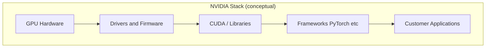
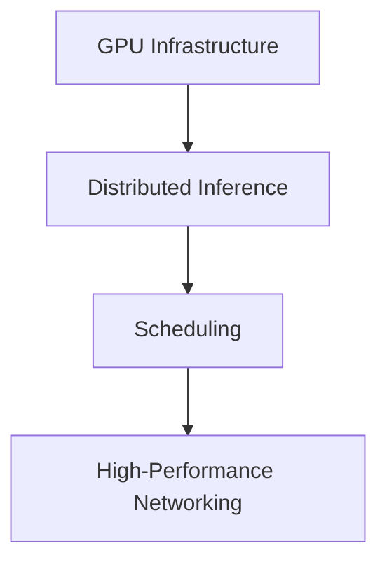

# NVIDIA Interview Preparation

## Interview Culture

NVIDIA interviews principal and distinguished architect candidates at the intersection of **hardware**, **systems software**, and **AI infrastructure**. The company operates in a **high-velocity market** where GPU supply, software stack maturity (CUDA, drivers, libraries), and cloud partnerships directly affect revenue. Panels evaluate whether you can reason across **silicon constraints**, **datacenter operations**, and **developer experience**.

Cultural signals:

| Signal | Principal expectation |
|--------|----------------------|
| **Full-stack thinking** | CPU-GPU-Network-storage co-design |
| **Performance culture** | Profiling, bottlenecks, numerical precision tradeoffs |
| **Partner ecosystem** | Cloud providers, OEMs, ISVs |
| **Long hardware cycles** | Software must abstract generational differences |
| **Operational scale** | DGX clusters, inference at datacenter scale |

Roles span **GPU architecture**, **CUDA/runtime**, **networking (InfiniBand, NVLink)**, **AI enterprise software**, and **automotive**—tailor preparation to the posting.

**Interview formats (typical):**

- System design for ML infrastructure or distributed systems
- Deep technical discussion on past large-scale GPU or HPC projects
- Behavioral: cross-functional work with hardware and software teams
- Optional: performance analysis or architecture whiteboard on memory hierarchy

## Technical Focus Areas

| Domain | Interview depth |
|--------|-----------------|
| **GPU execution model** | Warps, occupancy, memory coalescing (conceptual) |
| **Distributed training** | Data/pipeline/tensor parallelism; AllReduce |
| **Inference serving** | Batching, KV cache, model parallelism, quantization |
| **Cluster networking** | NCCL, RDMA, topology-aware collectives |
| **Container orchestration for GPUs** | K8s device plugins, MIG, scheduling |
| **Storage for checkpoints** | High-throughput parallel filesystem patterns |
| **Reliability** | GPU failure, node drain, checkpoint resume |
| **Multi-tenant GPU clouds** | Isolation, fair share, preemption |

Curriculum anchors: [Distributed Training and Inference](/docs/ai-distributed-systems/distributed-training-and-inference), [LLM Serving and Model Gateways](/docs/ai-distributed-systems/llm-serving-and-model-gateways), [Kubernetes Architecture](/docs/kubernetes-and-platform-engineering/kubernetes-architecture).

**Accuracy note:** Do not invent specific TFLOPS, benchmark wins, or unreleased product capabilities. Discuss **mechanisms** and cite public documentation or papers where possible.

## System Design Expectations

NVIDIA-class system design probes **throughput, latency, and cost per token** (or per training step) as first-class requirements alongside availability.

### Clarifying questions panels expect

1. Model size, precision (FP16/BF16/INT8), batch constraints.
2. Training vs. inference; synchronous vs. asynchronous serving.
3. SLA: p99 latency vs. throughput maximization.
4. Fault model: GPU ECC errors, node loss, network partition.
5. Multi-tenancy: shared cluster vs. dedicated slices.

### Representative prompts

| Prompt | Core topics |
|--------|-------------|
| Design GPU cluster scheduler for LLM training | Gang scheduling, topology, checkpoint frequency |
| Design inference gateway for 10k models | Routing, autoscaling, cold start, model cache |
| Design NCCL-style collective communication | Ring vs. tree algorithms; bandwidth bounds |
| Design fault-tolerant long training job | Checkpoint to object store; elastic training |
| Design developer notebook platform on GPUs | Isolation, quota, preemption, data egress |

## Leadership and Behavioral Focus

Principal architects at NVIDIA often **bridge hardware roadmaps and software abstractions**. Behavioral stories should show:

- **Partner negotiation** (cloud, OEM) with technical constraints.
- **Performance crisis** resolved with profiling—not guessing.
- **Standardization** across GPU generations to protect ISV investment.
- **Safety and reliability** in automotive or regulated contexts (if applicable).

Link: [STAR Story Framework](/docs/behavioral-and-leadership/star-story-framework), [Executive Communication](/docs/architecture-leadership/executive-communication).

## Preparation Strategy

### 10-week GPU infrastructure plan

| Weeks | Activity |
|-------|----------|
| 1–2 | GPU execution model refresh (public CUDA docs); memory hierarchy |
| 3–4 | Distributed training patterns — whiteboard AllReduce |
| 5 | Inference serving — continuous batching concept |
| 6 | K8s GPU scheduling and failure recovery |
| 7 | Networking — NCCL public docs; topology |
| 8 | Cost modeling — GPU-hour unit economics (generic) |
| 9 | Two full mocks |
| 10 | Review + behavioral polish |

### Hands-on recommendation

If possible, run a small **multi-GPU training job** (public tutorial) and capture:

- GPU utilization timeline.
- Checkpoint size and write duration.
- Effect of batch size on throughput.

Bring **observed metrics** to deep-dive interviews—principal signal.

## Common Question Patterns

### Q1: Design a system to train a 100B parameter model across 1000 GPUs

**Expected signals:**

- 3D parallelism decomposition (data, tensor, pipeline) at high level.
- Checkpoint strategy; storage bandwidth as bottleneck.
- Failure recovery: restart from checkpoint; elastic scaling cautions.
- Network: prefer all-to-all aware placement; mention NCCL role without internal secrets.

**Follow-ups:**

- One GPU fails every 4 hours — how does mean time to train change?
- How do you validate numerical correctness across parallelism?

**Scoring rubric:**

| Level | Criteria |
|-------|----------|
| Excellent | Parallelism tradeoffs, fault tolerance, observability, cost |
| Good | Data + model parallel basics, checkpointing |
| Adequate | "Add more GPUs" without communication analysis |
| Weak | Ignores memory per GPU constraint |

Link: [Distributed Training and Inference](/docs/ai-distributed-systems/distributed-training-and-inference).

---

### Q2: Design LLM inference with p99 &lt; 200ms for chat

**Expected signals:**

- Prefill vs. decode phase latency breakdown.
- Continuous batching; KV cache memory management.
- Model placement; tensor parallel for large models.
- Rate limiting and queueing discipline.

Link: [LLM Serving and Model Gateways](/docs/ai-distributed-systems/llm-serving-and-model-gateways).

---

### Q3: How do you schedule GPUs on Kubernetes for mixed workloads?

**Expected signals:**

- Device plugin; resource requests `nvidia.com/gpu`.
- MIG slices for inference sharing (conceptual).
- Preemption policies; quotas per namespace.
- Node affinity for topology (NVLink local).

---

### Q4: Behavioral — Hardware/software disagreement on feature priority

**Expected signals:**

- Data from customers and benchmarks.
- Phased delivery; API stability commitments.

---

### Q5: What happens when GPU memory is exhausted during inference?

**Expected signals:**

- OOM handling; batch splitting; model offloading (high-level).
- Queue backpressure; 503 to clients.
- Monitoring GPU memory headroom.

## Red Flags to Avoid

| Red flag | Panel reaction |
|----------|----------------|
| Treating GPUs as "faster CPUs" only | Misses parallelism model |
| No networking in distributed training answer | Incomplete |
| Invented benchmark claims | Credibility loss |
| Ignoring fault tolerance for week-long jobs | Not production-minded |
| Pure software ignore of power/thermal | Weak at hardware boundary |

## Recommended Study Topics

1. [Distributed Training and Inference](/docs/ai-distributed-systems/distributed-training-and-inference)
2. [LLM Serving and Model Gateways](/docs/ai-distributed-systems/llm-serving-and-model-gateways)
3. [Kubernetes Architecture](/docs/kubernetes-and-platform-engineering/kubernetes-architecture)
4. [Observability Fundamentals](/docs/observability/observability-fundamentals)
5. [Cloud Cost Optimization](/docs/cost-and-finops/cloud-cost-optimization)
6. [Distributed Systems Mock](/docs/mock-interviews/distributed-systems-mock)

## Architecture Review Exercise

A training platform checkpoints every 24 hours to a single NFS server shared across 512 nodes. Jobs fail weekly from GPU errors. **Redesign** for fault tolerance and checkpoint efficiency. Document tradeoffs of checkpoint frequency vs. storage cost.

## Knowledge Check

1. Why is AllReduce the bottleneck in data-parallel training?
2. Explain prefill vs. decode in LLM inference latency.
3. What is gang scheduling and when is it required?
4. How does KV cache size grow with context length?
5. Name three GPU failure modes and mitigations.

## Related Concepts

- [RAG Architecture](/docs/ai-distributed-systems/rag-architecture)
- [Agent Platform Architecture](/docs/agentic-ai-architecture/agent-platform-architecture)
- [Chaos Engineering](/docs/reliability-and-resilience/chaos-engineering)

## Additional Interview Questions

### Q6: Design GPU memory defragmentation strategy for inference

**Expected signals:** KV cache pooling; batch eviction; model unload; fragmentation metrics.

---

### Q7: Compare NVLink vs InfiniBand for training cluster

**Expected signals:** Node-local vs inter-node; topology-aware job placement; qualitative bandwidth hierarchy (verify current public specs).

---

### Q8: Behavioral — Partner escalation on performance regression

**Expected signals:** Repro benchmark; root cause in driver vs application; communication plan.

---

### Q9: Design multi-tenant notebook service on GPUs

**Expected signals:** Namespace isolation; cgroup limits; network policy; image scanning; preemption.

Link: [Kubernetes Architecture](/docs/kubernetes-and-platform-engineering/kubernetes-architecture).

---

### Q10: How measure training job efficiency?

**Expected signals:** Model FLOPs utilization (conceptual); GPU active time; checkpoint overhead ratio; data loader stall detection.

## Extended Preparation Strategy

### Profiling story bank

Prepare one STAR story where **profiling** (nsys, nvprof-class tools) changed architecture decision—not guessing. Include before/after GPU utilization metric (range OK).

### Hardware-software boundary topics

Be ready to discuss without revealing confidential roadmaps:

- CUDA version compatibility matrix strategy.
- Forward compatibility for customer ML frameworks.
- Graceful degradation when GPU ECC errors detected.

### Training vs inference interview split

| If role emphasizes… | Overweight mocks on… |
|-----------------------|----------------------|
| Training | AllReduce, checkpoint, elastic training |
| Inference | Batching, KV cache, model router |
| Platform | K8s scheduling, multi-tenant isolation |
| Networking | NCCL, topology, congestion |

### 6-week intensive plan

| Week | Technical | Behavioral |
|------|-----------|------------|
| 1 | GPU execution model | Cross-functional hardware dispute |
| 2 | Distributed training mock | Customer performance SLA |
| 3 | Inference serving mock | Incident during cluster upgrade |
| 4 | K8s GPU scheduling | Cost vs performance tradeoff |
| 5 | Full loop | Executive briefing on capacity |
| 6 | Review weakest | STAR polish |

## Comprehensive Question Bank

### Q11: Design CUDA stream scheduling for concurrent inference models

**Expected signals:** Stream parallelism; memory copy overlap; SM occupancy awareness at high level.

---

### Q12: Hardware generation migration without customer recompile

**Expected signals:** ABI stability; compatibility layers; feature detection; phased deprecation communications.

---

### Q13: Power cap datacenter scenario

**Expected signals:** Dynamic frequency scaling; job migration; SLA tier prioritization; qualitative tradeoffs (verify public power management docs).

---

### Q14: Behavioral — Balanced research ambition with ship deadline

**Expected signals:** MVP scope; measurable quality bar; timeboxed spike; stakeholder alignment.

## Technical Whiteboard Warmups (daily, 5 min)

1. Draw GPU → HBM → L2 → SM hierarchy.
2. Sketch all-reduce ring on 4 nodes.
3. Timeline: training job from data load to checkpoint.

## Appendix: GPU Infrastructure Interview Modules

### Module 1 — Memory hierarchy impact on batch size

Large language model inference memory = weights + activations + KV cache. Batch size limited by HBM capacity. Explain why increasing batch improves throughput until OOM—interviewers test intuitive GPU economics.

### Module 2 — NCCL collective algorithms

All-reduce implementations: ring (bandwidth optimal on large messages), tree (lower latency small messages). Topology matters: NVLink within node vs IB across nodes. Placement policy: pack communicating ranks on same node when possible.

### Module 3 — Checkpoint frequency tradeoff

Frequent checkpoint: less lost work, more storage IO and training pause. Rule of thumb: checkpoint when `(cost of lost work) > (checkpoint overhead)`—express qualitatively with example numbers from your experience, not invented universal constants.

### Module 4 — MIG (Multi-Instance GPU) conceptual

Partition one physical GPU into isolated instances for inference multi-tenancy. Tradeoff: reduced peak throughput per tenant vs better utilization. Compare with batching unrelated models on shared GPU without hardware partition.

### Module 5 — Driver and CUDA compatibility

Customers run diverse framework versions. Platform must define supported matrix and graceful error when mismatch. Behavioral story: partner escalation on version skew.

### Module 6 — Thermal and power throttling (high level)

Datacenter power cap may throttle GPU clocks—training job runtime variance. Scheduler awareness of power budgets. Qualitative only unless you have measured data.

### Module 7 — Inference autoscaling signals

Scale on queue depth, GPU utilization, p99 latency—not CPU. Cold start model load time; keep warm pool for premium tier.

### Module 8 — Interview whiteboard: 8-GPU node training job placement

Draw NVLink mesh; place ranks communicating heavily on same node; inter-node traffic on IB. NCCL topology detection concept.

### Module 9 — Full mock: Design ML platform notebook → production pipeline

Notebook experimentation; tracked experiments; containerized training job; model registry; staged promotion to inference with eval gates. 55 minutes.

### Module 10 — Hardware failure rate math (qualitative)

If single GPU MTBF implies failures per day at 10K GPU scale, checkpoint frequency and elastic training become mandatory—not optional. Express formula verbally without claiming specific MTBF numbers unless from your ops data.

## Preparation Workbook: 14-Day NVIDIA Intensive

**Days 1–3 — GPU fundamentals:** CUDA programming guide skim; draw memory hierarchy; explain warp divergence qualitatively.

**Days 4–6 — Distributed training:** Whiteboard AllReduce ring; estimate checkpoint time impact if job runs 7 days (qualitative). Module 9 platform pipeline mock.

**Days 7–9 — Inference:** [LLM Serving](/docs/ai-distributed-systems/llm-serving-and-model-gateways) chapter; explain prefill vs decode; Module 7 autoscaling signals.

**Days 10–12 — K8s GPU:** Device plugin mental model; MIG vs batching tradeoff; failure recovery story preparation.

**Days 13–14 — Integration:** Module 10 MTBF qualitative reasoning; behavioral partner escalation story; review Q1–Q14 question bank aloud.

**Success criteria:** Training and inference mocks scored Hire on rubric; can explain NCCL role without overselling; one profiling-based STAR story ready.

## Final Interview Readiness Checklist

Before your onsite or virtual loop, confirm each item:

- [ ] Completed at least two timed mocks scored with [Mock Interview Rubric](/docs/mock-interviews/mock-interview-rubric)
- [ ] Can articulate three architecture decisions from your resume with tradeoffs in under 3 minutes each
- [ ] Prepared five clarifying questions for system design (users, scale, SLAs, consistency, non-goals)
- [ ] Behavioral story bank indexed to company values or Leadership Principles
- [ ] Reviewed company-specific guide question bank for your target employer
- [ ] Linked technical answers to curriculum chapters studied (demonstrates depth if asked what you read)
- [ ] Practiced drawing one architecture diagram from memory in under 4 minutes
- [ ] Identified weakest rubric dimension and studied linked chapter in final 72 hours
- [ ] Prepared two thoughtful questions per interviewer about team scope and success metrics
- [ ] Logistics confirmed: whiteboard tool, time zones, loop schedule, rest breaks planned

Principal loops reward **consistent depth across rounds**, not one brilliant performance. Sleep and pacing matter as much as cramming additional facts.

## Peer Study Group Format (Recommended)

Form a group of 3–4 principal candidates. Weekly 2-hour session structure:

| Segment | Duration | Activity |
|---------|----------|----------|
| Warm-up | 15 min | Flashcard quiz on domain terms |
| Mock | 45 min | One candidate system design; others score silently |
| Debrief | 30 min | Rubric scores + homework assignment |
| Behavioral | 30 min | Round-robin one STAR story each |

Rotate mock facilitator role. Groups that meet 6+ weeks show measurable rubric score improvement on depth and failure dimensions compared to solo study (anecdotal—track your own spreadsheet).

## Closing Note for Principal Candidates

Interview preparation is a **sampling process**: loops test a subset of your experience. Maximize the probability that sampled stories and designs reflect your best judgment by rehearsing aloud, scoring honestly, and iterating on gaps. The guides in this domain are designed to be revisited—first read for structure, second read with mocks, third read the week before onsite for question bank drills. Cross-link every weak area to a curriculum chapter rather than collecting random blog posts.

## References

- NVIDIA CUDA Programming Guide (official documentation).
- NVIDIA NCCL documentation (collective communication).
- Ben-Nun & Hoefler, "Demystifying Parallel and Distributed Deep Learning" (ACM Computing Surveys).
- Dean et al., "Large Scale Distributed Deep Networks" (Google brain — training patterns).
- Public LLM serving papers/blog posts on batching (verify per source).

## Diagram

*Figure: NVIDIA interview focus — GPU platforms and inference at scale.*
