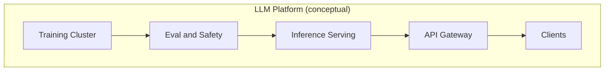
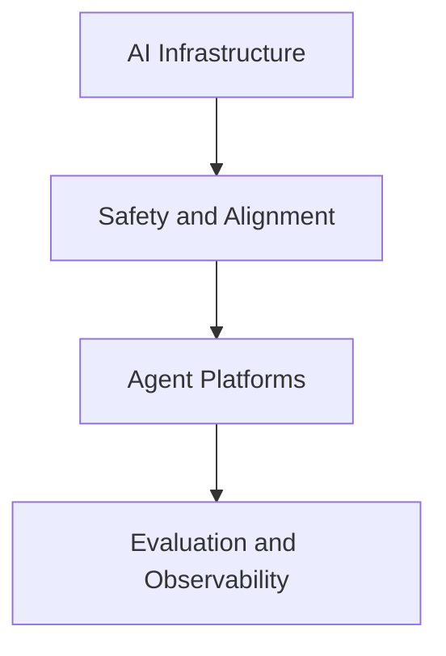

# OpenAI and Anthropic Interview Preparation

## Interview Culture

OpenAI and Anthropic interviews for principal architect and research engineering leadership roles sit at the frontier of **large-scale ML systems**, **AI safety**, and **productized intelligence**. Loops are intense, often blending **distributed systems design**, **ML training/inference mechanics**, and **responsible deployment** philosophy.

Shared evaluation dimensions:

| Dimension | Principal signal |
|-----------|------------------|
| **Systems at ML scale** | Clusters, data pipelines, inference gateways |
| **Safety and alignment awareness** | Abuse, jailbreaks, data leakage—not checkbox ethics |
| **Product velocity vs. caution** | Shipping with guardrails and eval harnesses |
| **Research ↔ engineering bridge** | Implementing papers under production constraints |
| **Ambiguity tolerance** | Rapidly evolving requirements and model capabilities |

**Company distinctions (public positioning only):**

- **OpenAI**: Consumer and API products (ChatGPT class); large-scale training infrastructure; plugin/agent ecosystem.
- **Anthropic**: Constitutional AI and safety-focused research; Claude products; emphasis on interpretability and responsible scaling.

Do not speculate on unreleased models, unreleased capabilities, or internal safety incidents. Frame answers using **public documentation and established ML systems patterns**.

## Technical Focus Areas

| Area | Interview relevance |
|------|---------------------|
| **Distributed training** | Data/tensor/pipeline parallelism; checkpointing |
| **Inference serving** | Batching, routing, KV cache, multi-model |
| **RAG pipelines** | Retrieval quality, latency, grounding |
| **Agent orchestration** | Tool use, state, sandboxing |
| **Eval systems** | Offline benchmarks + online A/B + red teaming |
| **Safety filters** | Classifiers, policy layers, human review loops |
| **API platform** | Rate limits, tenancy, key management |
| **Observability** | Token metrics, drift, cost per request |
| **Data governance** | Training data provenance, retention, PII |

Curriculum: [LLM Serving and Model Gateways](/docs/ai-distributed-systems/llm-serving-and-model-gateways), [RAG Architecture](/docs/ai-distributed-systems/rag-architecture), [Agent Governance and Safety](/docs/agentic-ai-architecture/agent-governance-and-safety), [Distributed Training and Inference](/docs/ai-distributed-systems/distributed-training-and-inference).

## System Design Expectations

Principal designs must address **non-functional requirements unique to LLMs**:

1. **Latency composition** — prefill vs. decode; tail at high concurrency.
2. **Cost** — GPU-hours per million tokens; caching strategies.
3. **Correctness** — not bitwise; eval-driven quality SLOs.
4. **Safety** — policy enforcement before/after model; logging constraints.
5. **Abuse** — prompt injection, data exfiltration via tools.
6. **Reliability** — model version rollout, rollback, canary.

### Representative prompts

| Prompt | Principal depth |
|--------|-----------------|
| Design ChatGPT-class serving platform | Gateway, router, GPU pools, streaming SSE |
| Design RAG for enterprise documents | Chunking, embedding index, citation, ACL filter |
| Design RLHF training pipeline | Reward model, PPO class loop—high level |
| Design agent with tools (code, web) | Sandboxing, approval, audit |
| Design global API with usage tiers | Quotas, billing, fair scheduling |

## Leadership and Behavioral Focus

These organizations value **judgment under uncertainty**:

- **Safety disagreement** — when to delay launch.
- **Cross-functional alignment** — research, policy, legal, product.
- **Incident response** — model behavior regression, API outage.
- **Responsible scaling** — capability vs. risk frameworks (public statements, not internal doctrine).

Prepare STAR stories referencing **eval metrics**, **red team findings**, and **mitigations shipped**.

Link: [STAR Story Framework](/docs/behavioral-and-leadership/star-story-framework), [Executive Communication](/docs/architecture-leadership/executive-communication).

## Preparation Strategy

### 10-week AI platform plan

| Weeks | Focus |
|-------|-------|
| 1–2 | LLM serving fundamentals; trace one request path |
| 3 | RAG end-to-end with ACL-aware retrieval |
| 4 | Agent architecture + sandbox threat model |
| 5 | Eval harness design (offline + online) |
| 6 | Safety layers and abuse scenarios |
| 7 | Distributed training failure recovery |
| 8 | Cost model for inference (generic unit economics) |
| 9 | Two full mocks (design + behavioral) |
| 10 | Read public safety/alignment papers; synthesize talking points |

### Safety interview preparation

Be fluent discussing **classes of harm** (not sensational stories):

- Prompt injection and indirect injection via retrieved content.
- Tool misuse (arbitrary code execution).
- Privacy leakage across tenants in RAG.
- Model memorization and training data exposure (conceptual).

Link: [Agent Governance and Safety](/docs/agentic-ai-architecture/agent-governance-and-safety).

## Common Question Patterns

### Q1: Design API gateway for LLM inference at global scale

**Expected signals:**

- AuthN/Z per API key; org-level quotas.
- Request routing by model, region, GPU availability.
- Streaming responses; backpressure; timeout handling.
- Rate limiting token-weighted not just request-count.
- Observability: latency histograms per model version.
- Canary deployments and instant rollback.

**Follow-ups:**

- Model A GPU pool saturated — degrade gracefully?
- Customer reports inconsistent answers — debug path?

**Scoring rubric:**

| Level | Criteria |
|-------|----------|
| Excellent | Full path + safety + cost + multi-region + versioning |
| Good | Gateway, routing, basic limits |
| Adequate | Single load balancer to one model |
| Weak | No streaming or quota story |

Link: [LLM Serving and Model Gateways](/docs/ai-distributed-systems/llm-serving-and-model-gateways).

---

### Q2: Design enterprise RAG with document-level ACLs

**Expected signals:**

- Ingestion pipeline with metadata tags.
- Retrieval filter **before** LLM sees chunks.
- Citation IDs for auditability.
- Re-ranking; hallucination mitigation via grounded prompts.
- Evaluation set with permission boundary test cases.

Link: [RAG Architecture](/docs/ai-distributed-systems/rag-architecture).

---

### Q3: How do you evaluate a model change before full rollout?

**Expected signals:**

- Offline golden sets; regression thresholds.
- Shadow traffic; A/B with guardrail metrics.
- Red team suite for safety categories.
- Human review for high-risk domains.
- Rollback triggers automated.

**Note:** Do not invent specific eval scores from production; discuss **process**.

---

### Q4: Behavioral — Launched feature with unintended harmful behavior

**Expected signals:**

- Detection mechanism; customer/report path.
- Mitigation (disable, patch prompt, model rollback).
- Postmortem; eval gap identified; process fix.

---

### Q5: Design tool-using agent executing Python code

**Expected signals:**

- Sandboxed execution (container/WASM); network egress deny by default.
- Resource limits CPU/memory/time.
- Human-in-the-loop for sensitive actions.
- Audit log of tool calls.

Link: [Agent Platform Architecture](/docs/agentic-ai-architecture/agent-platform-architecture).

## Red Flags to Avoid

| Red flag | Why |
|----------|-----|
| "Safety is just a filter at the end" | Shallow; misses systemic design |
| Ignoring tenant isolation in RAG | Critical enterprise failure |
| Treating LLM output as always correct | No eval discipline |
| Buzzwords without GPU/memory awareness | Insufficient systems depth |
| Speculation on unreleased capabilities | Professionalism and accuracy |
| Dismissing alignment as non-engineering | Cultural misfit at Anthropic especially |

## Recommended Study Topics

1. [LLM Serving and Model Gateways](/docs/ai-distributed-systems/llm-serving-and-model-gateways)
2. [RAG Architecture](/docs/ai-distributed-systems/rag-architecture)
3. [Agent Governance and Safety](/docs/agentic-ai-architecture/agent-governance-and-safety)
4. [Distributed Training and Inference](/docs/ai-distributed-systems/distributed-training-and-inference)
5. [Distributed Rate Limiter](/docs/system-design/distributed-rate-limiter)
6. [Security Architecture Fundamentals](/docs/security/security-architecture-fundamentals)
7. [Distributed Systems Mock](/docs/mock-interviews/distributed-systems-mock)

## Architecture Review Exercise

An enterprise RAG stack embeds all customer documents in one shared vector index without metadata filters. API keys are scoped per customer but retrieval is global. **Enumerate failures** (security, quality, compliance) and redesign with **defense in depth**.

## Knowledge Check

1. Why is token-weighted rate limiting necessary?
2. Where should ACL enforcement occur in a RAG pipeline?
3. What is shadow deployment for models?
4. Name three agent sandbox escape risks.
5. How do prefill and decode affect autoscaling signals?

## Related Concepts

- [Caching Fundamentals](/docs/caching/caching-fundamentals) — prefix/KV cache analogies
- [Observability Fundamentals](/docs/observability/observability-fundamentals)
- [Idempotency](/docs/distributed-systems-foundations/idempotency) — tool call retries

## Additional Interview Questions

### Q6: Design fine-tuning job orchestration

**Expected signals:** Dataset versioning; GPU queue; experiment tracking; checkpoint to durable store; failure resume.

Link: [Distributed Training and Inference](/docs/ai-distributed-systems/distributed-training-and-inference).

---

### Q7: Design prompt injection defenses for RAG

**Expected signals:** Input sanitization; retrieval boundary; output policy layer; human review for high risk; logging without storing secrets.

Link: [Agent Governance and Safety](/docs/agentic-ai-architecture/agent-governance-and-safety).

---

### Q8: Behavioral — Delayed model launch for safety

**Expected signals:** Eval gap; stakeholder alignment; alternative mitigations; timeline tradeoff.

---

### Q9: Design token billing and metering

**Expected signals:** Accurate token count; streaming partial billing; dispute reconciliation; idempotent charge API.

Link: [Payment Platform](/docs/system-design/payment-platform) — idempotency patterns.

---

### Q10: Multi-model routing by capability and cost

**Expected signals:** Router classifier; fallback chain; quality monitoring per route; cost caps per tenant.

## Extended Preparation Strategy

### Safety eval vocabulary

Prepare definitions (from public literature):

- **Red teaming:** Adversarial testing for harmful outputs.
- **Constitutional AI:** Training with principle-guided critiques (Anthropic public framing).
- **RLHF:** Human preference optimization (high-level).

Do not claim internal eval thresholds.

### Request path drill (draw from memory)

Client → API gateway → auth → rate limit → router → inference worker → safety filter → stream to client. Annotate latency budget per hop.

### OpenAI vs Anthropic emphasis

| Emphasis | OpenAI-leaning loops | Anthropic-leaning loops |
|----------|----------------------|-------------------------|
| Product scale | API traffic, plugins | Enterprise Claude deployments |
| Safety depth | Moderate + operational | Constitutional, interpretability interest |
| Systems | Training cluster stories | Safety pipeline + serving |

Tailor story selection; core systems content overlaps heavily.

### Reading list (2 weeks)

1. InstructGPT / RLHF paper (overview).
2. OWASP LLM Top 10.
3. [RAG Architecture](/docs/ai-distributed-systems/rag-architecture) curriculum chapter.
4. [LLM Serving](/docs/ai-distributed-systems/llm-serving-and-model-gateways) curriculum chapter.
5. One public postmortem on AI service outage (class of failure, not vendor-specific secrets).

## Comprehensive Question Bank

### Q11: Design model A/B test with safety guardrails

**Expected signals:** Traffic split; automatic rollback on harm metric threshold; human review queue for edge cases.

---

### Q12: Prevent training data contamination from user prompts

**Expected signals:** Data handling policy; opt-in; separation of inference logs from training pipeline; retention limits.

---

### Q13: Design embedding store for 1B documents

**Expected signals:** Sharded vector index; approximate nearest neighbor; filtering; rebuild strategy.

Link: [RAG Architecture](/docs/ai-distributed-systems/rag-architecture).

---

### Q14: Behavioral — Communicated model limitation to enterprise sales

**Expected signals:** Honest capability bounds; alternative product paths; documented known failure modes.

## Ethics and Policy Interview Prep

Be prepared to discuss **classes of policy** without claiming internal playbooks:

- Refusal behaviors for harmful requests.
- Age-sensitive content handling (high level).
- Enterprise data processing agreements (DPA) architectural implications.

Frame as **design requirements** for serving platform, not legal advice.

## Appendix: LLM Platform Architecture Modules

### Module 1 — Prefill/decode disaggregation (conceptual)

Some architectures separate prefill (compute-bound) from decode (memory-bandwidth-bound) onto different GPU pools. Improves utilization for chat workloads with long context. Interview: when is disaggregation worth operational complexity?

### Module 2 — Model router design

Router sends request to appropriate model by task complexity, cost tier, or latency SLA. Fallback chain when primary overloaded. Cache frequent system prompts. Monitor quality regression per route with eval harness.

### Module 3 — Tool execution sandbox

Agent runs code in isolated VM with no network by default. Allowlist domains if needed. Timeout kill. Audit log of stdin/stdout hashes—not full secrets. Link [Agent Governance and Safety](/docs/agentic-ai-architecture/agent-governance-and-safety).

### Module 4 — Training data governance

Document lineage: source, license, PII scrubbing pipeline, deduplication against eval sets to prevent leakage. Retention and deletion for compliance requests—connect [Data Governance and Lineage](/docs/data-platforms/data-governance-and-lineage).

### Module 5 — Inference SLO definition

Quality metrics (human eval scores) combined with latency and availability. Error budget for model quality regression, not only uptime. Novel at AI companies—show sophistication by mentioning both.

### Module 6 — Context length scaling costs

KV cache grows linearly with context; pricing per token must reflect prefill vs decode compute. Interview: "Customer wants 1M context"—discuss feasibility, cost, retrieval alternative (RAG).

### Module 7 — Multi-modal pipeline (high level)

Image + text inputs through encoder fusion—latency budget decomposition. Do not claim specific model capabilities; discuss architecture pattern.

### Module 8 — Red team loop integration

Continuous adversarial prompts in CI for safety regressions; block release on severity threshold. Behavioral story if you participated in safety review gate.

### Module 9 — Full mock: Design ChatGPT plugin execution platform

Plugin manifest; OAuth to third party; scoped permissions; user confirmation step; timeout; audit. Threat model: malicious plugin exfiltrating conversation.

### Module 10 — Comparison answer: OpenAI vs Anthropic platform priorities

Prepare non-inflammatory comparison on public positioning: product velocity, safety research emphasis, enterprise deployment patterns—useful for either company's "why us" question.

## Preparation Workbook: 14-Day AI Lab Intensive

**Days 1–3 — Serving path:** Trace request through gateway, router, GPU pool, safety filter, stream response. Read [LLM Serving and Model Gateways](/docs/ai-distributed-systems/llm-serving-and-model-gateways).

**Days 4–6 — RAG:** Design enterprise RAG with ACL filters on paper; Module 3 sandbox threats; OWASP LLM Top 10 skim.

**Days 7–9 — Safety:** Module 5 eval SLOs; red team loop (Module 8); behavioral delayed launch story.

**Days 10–12 — Agents:** Module 9 plugin platform mock; [Agent Governance and Safety](/docs/agentic-ai-architecture/agent-governance-and-safety) knowledge check.

**Days 13–14 — Integration:** Module 10 company comparison answer; token billing design verbal; full loop with distributed + design mocks.

**Success criteria:** Never claim unreleased capabilities; every design includes eval and safety layer; tenant isolation in RAG automatic in answers.

## Final Interview Readiness Checklist

Before your onsite or virtual loop, confirm each item:

- [ ] Completed at least two timed mocks scored with [Mock Interview Rubric](/docs/mock-interviews/mock-interview-rubric)
- [ ] Can articulate three architecture decisions from your resume with tradeoffs in under 3 minutes each
- [ ] Prepared five clarifying questions for system design (users, scale, SLAs, consistency, non-goals)
- [ ] Behavioral story bank indexed to company values or Leadership Principles
- [ ] Reviewed company-specific guide question bank for your target employer
- [ ] Linked technical answers to curriculum chapters studied (demonstrates depth if asked what you read)
- [ ] Practiced drawing one architecture diagram from memory in under 4 minutes
- [ ] Identified weakest rubric dimension and studied linked chapter in final 72 hours
- [ ] Prepared two thoughtful questions per interviewer about team scope and success metrics
- [ ] Logistics confirmed: whiteboard tool, time zones, loop schedule, rest breaks planned

Principal loops reward **consistent depth across rounds**, not one brilliant performance. Sleep and pacing matter as much as cramming additional facts.

## Peer Study Group Format (Recommended)

Form a group of 3–4 principal candidates. Weekly 2-hour session structure:

| Segment | Duration | Activity |
|---------|----------|----------|
| Warm-up | 15 min | Flashcard quiz on domain terms |
| Mock | 45 min | One candidate system design; others score silently |
| Debrief | 30 min | Rubric scores + homework assignment |
| Behavioral | 30 min | Round-robin one STAR story each |

Rotate mock facilitator role. Groups that meet 6+ weeks show measurable rubric score improvement on depth and failure dimensions compared to solo study (anecdotal—track your own spreadsheet).

## References

- OpenAI API documentation (rate limits, streaming — verify current).
- Anthropic public research on constitutional AI (papers/blog).
- Vaswani et al., "Attention Is All You Need" (foundational).
- Brown et al., "Language Models are Few-Shot Learners" (GPT-3 paper).
- Ouyang et al., "Training language models to follow instructions with human feedback" (InstructGPT / RLHF overview).
- Shazeer, "Fast Transformer Decoding: One Write-Head is All You Need" — KV cache concept.
- Public OWASP LLM Top 10 — application security framing.

## Diagram

*Figure: OpenAI/Anthropic interview focus — AI infra, safety, agents.*
