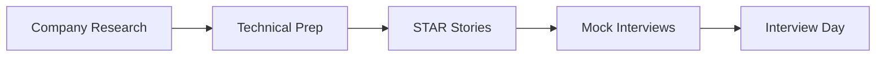

# Company-Specific Preparation

Targeted interview preparation for principal architect loops at major technology companies. Each guide covers interview culture, technical focus areas, system design expectations, behavioral themes, preparation strategy, question patterns with rubrics, and curriculum cross-links.

*Figure: Company-specific interview preparation workflow.*

## Chapters

| Company | Guide |
|---------|-------|
| Adobe | [Adobe Interview Preparation](/docs/company-specific-preparation/adobe) |
| Amazon / AWS | [Amazon and AWS Interview Preparation](/docs/company-specific-preparation/amazon-aws) |
| Google | [Google Interview Preparation](/docs/company-specific-preparation/google) |
| Microsoft | [Microsoft Interview Preparation](/docs/company-specific-preparation/microsoft) |
| NVIDIA | [NVIDIA Interview Preparation](/docs/company-specific-preparation/nvidia) |
| Snowflake / Databricks | [Snowflake and Databricks Interview Preparation](/docs/company-specific-preparation/snowflake-databricks) |
| OpenAI / Anthropic | [OpenAI and Anthropic Interview Preparation](/docs/company-specific-preparation/openai-anthropic) |

## Recommended Study Path

1. Complete [System Design Methodology](/docs/system-design/system-design-methodology) and [STAR Story Framework](/docs/behavioral-and-leadership/star-story-framework).
2. Read the guide for your target company.
3. Run mocks with [Mock Interview Rubric](/docs/mock-interviews/mock-interview-rubric).
4. Cross-train with [Distributed Systems Mock](/docs/mock-interviews/distributed-systems-mock) and [System Design Mock](/docs/mock-interviews/system-design-mock).

## Related Domains

- [Behavioral and Leadership](/docs/behavioral-and-leadership/overview)
- [Mock Interviews](/docs/mock-interviews/overview)
- [Architecture Leadership](/docs/architecture-leadership/overview)
- [Curriculum Overview](/docs/start-here/curriculum-overview)
