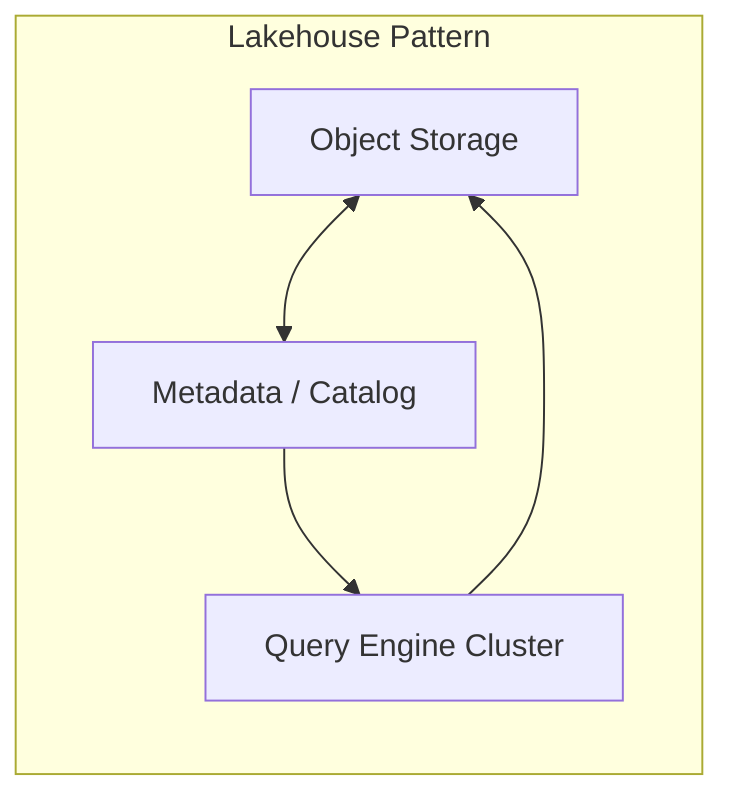
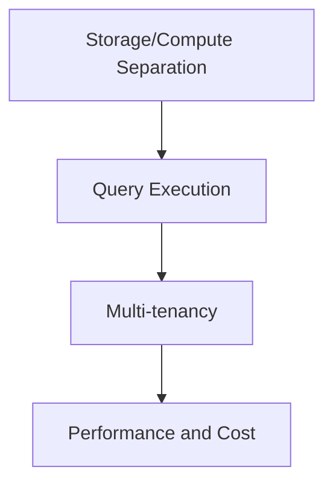

# Snowflake and Databricks Interview Preparation

## Interview Culture

Snowflake and Databricks represent the **modern analytical data platform** market—cloud-native warehouses and lakehouses where **storage/compute separation**, **multi-tenant elasticity**, and **SQL-at-scale** drive architecture interviews. Principal loops test whether you can design **globally distributed query engines**, **metadata services**, and **enterprise governance** while explaining tradeoffs against legacy Hadoop-era thinking.

Shared cultural themes:

| Theme | Interview signal |
|-------|------------------|
| **Separation of storage and compute** | Elastic warehouses/clusters; independent scaling |
| **Multi-tenant efficiency** | Resource isolation without wasted idle capacity |
| **Enterprise trust** | Security, compliance, audit for regulated industries |
| **Open formats** | Delta Lake, Iceberg, Parquet interoperability |
| **Performance at scale** | Partition pruning, caching, spill, vectorization (conceptual) |

**Company distinctions (high level, public positioning):**

- **Snowflake**: Managed data cloud; proprietary storage layer with micro-partitions; strong SQL warehouse narrative.
- **Databricks**: Lakehouse platform; Spark lineage; Unity Catalog governance; AI/ML workload integration.

Interview for the **specific company** in your loop—panels notice generic "data lake" answers without product-aware tradeoffs. Do not claim confidential internals; use **public architecture papers and docs**.

## Technical Focus Areas

| Area | Both companies | Snowflake emphasis | Databricks emphasis |
|------|----------------|--------------------|---------------------|
| **Storage format** | Columnar, immutable files | Micro-partitions, clustering | Delta Lake ACID |
| **Compute** | Elastic clusters | Virtual warehouses | Spark clusters, serverless SQL |
| **Metadata** | Catalog, lineage | Cloud Services layer | Unity Catalog |
| **Concurrency** | Multi-tenant scheduling | Warehouse queues | Job + SQL concurrency |
| **Security** | RBAC, encryption | Role hierarchy, secure views | UC grants, ABAC direction |
| **Streaming** | Ingest pipelines | Snowpipe (conceptual) | Structured Streaming |
| **Cost** | Credit/DBU model | Warehouse auto-suspend | Cluster policies |

Study: [Snowflake Architecture](/docs/distributed-databases/snowflake-architecture), [Data Lakehouse Architecture](/docs/data-platforms/data-lakehouse-architecture), [Stream and Batch Processing](/docs/data-platforms/stream-and-batch-processing), [Data Governance and Lineage](/docs/data-platforms/data-governance-and-lineage).

## System Design Expectations

Data platform system design at principal level includes:

1. **Workload isolation** — ETL vs. interactive BI vs. ML feature generation.
2. **Consistency** — table ACID semantics; exactly-once ingest.
3. **Metadata scale** — billions of files/partitions; catalog hot paths.
4. **Query optimization** — pruning, statistics, join order (conceptual).
5. **Multi-region** — replication, failover, legal residency.
6. **Governance** — lineage, PII tagging, row/column policies.

### Representative prompts

| Prompt | Depth |
|--------|-------|
| Design cloud-native SQL warehouse | Parser, optimizer, executor, storage separation |
| Design multi-tenant query scheduler | Queues, preemption, SLA tiers |
| Design ACID table format on object storage | Transaction log, snapshot isolation |
| Design real-time ingestion to queryable tables | Streaming + compaction + idempotency |
| Design cross-region metadata replication | Consistency vs. availability for catalog |

## Leadership and Behavioral Focus

Principal data architects demonstrate:

- **Customer-facing incident** ownership (query regression, cost spike).
- **Partner integration** (BI tools, identity providers).
- **Open source vs. proprietary** strategic tradeoffs.
- **Field engineering feedback loop** into product.

Prepare stories with **query latency**, **cost per query**, **pipeline SLA**, and **compliance audit** metrics.

Link: [STAR Story Framework](/docs/behavioral-and-leadership/star-story-framework), [Architecture Decision Records](/docs/architecture-leadership/architecture-decision-records).

## Preparation Strategy

### 8-week data platform plan

| Week | Snowflake track | Databricks track |
|------|-----------------|------------------|
| 1 | Public architecture overview | Lakehouse whitepaper |
| 2 | Micro-partition pruning mental model | Delta transaction log |
| 3 | Multi-cluster warehouse design | Spark stage/shuffle |
| 4 | Security: roles, masking | Unity Catalog model |
| 5 | Snowpipe-style ingest design | Structured Streaming + Delta |
| 6 | Cost governance patterns | Cluster policies + spot |
| 7 | Full mock design each | Full mock design each |
| 8 | Behavioral + executive narrative | Behavioral + executive narrative |

### Cross-study synthesis

Be ready to answer **"Why lakehouse vs. warehouse?"** with decision criteria—not religion:

| Criterion | Lean warehouse | Lean lakehouse |
|-----------|----------------|----------------|
| Primary users | SQL analysts | Data scientists + engineers |
| Data types | Structured | Semi-structured + ML features |
| Open format requirement | Lower | Higher |
| Operational complexity tolerance | Lower | Higher |

## Common Question Patterns

### Q1: Design separation of storage and compute for analytics

**Expected signals:**

- Object storage durability; stateless compute nodes.
- Cached local SSD for hot data; remote spill on pressure.
- Elastic scale-out; auto-suspend idle compute.
- Metadata service tracks snapshots, partitions, stats.

**Follow-ups:**

- Cold start latency when warehouse resumes?
- How do you prevent one customer's query from starving others?

**Scoring rubric:**

| Level | Description |
|-------|-------------|
| Excellent | Scheduler, isolation, caching, governance, multi-region |
| Good | Clear separation + basic scaling |
| Adequate | "S3 + Spark" diagram only |
| Weak | Monolithic database cluster |

Link: [Data Lakehouse Architecture](/docs/data-platforms/data-lakehouse-architecture).

---

### Q2: Implement ACID on Parquet files in S3

**Expected signals:**

- Transaction log (Delta/Iceberg pattern); snapshot isolation.
- Compaction jobs; conflict detection on commit.
- Reader sees consistent snapshot; time travel (conceptual).

**Follow-ups:**

- Writer conflict under concurrent MERGE?
- Small file problem and compaction strategy?

---

### Q3: Design query optimizer statistics collection at scale

**Expected signals:**

- Sampled stats; incremental updates on ingest.
- Partition-level min/max; NDV sketches.
- Auto-analyze scheduling; staleness thresholds.

---

### Q4: Behavioral — Customer query regressed 10× after release

**Expected signals:**

- Rollback/feature flag; bisect plan change.
- Communication with customer; postmortem; guardrail metrics.

---

### Q5: Govern PII across 5000 tables

**Expected signals:**

- Classification tags; policy engine; masking views.
- Lineage for impact analysis; audit logs.

Link: [Data Governance and Lineage](/docs/data-platforms/data-governance-and-lineage).

## Red Flags to Avoid

| Red flag | Why |
|----------|-----|
| Hadoop-era only thinking | Misses cloud separation model |
| No multi-tenant isolation | Core platform challenge |
| Ignoring metadata service as bottleneck | Common principal trap |
| Confusing Snowflake and Databricks internals | Shows shallow prep |
| Invented performance numbers | Violates accuracy standards |
| No cost attribution story | Enterprise buyers care |

## Recommended Study Topics

1. [Snowflake Architecture](/docs/distributed-databases/snowflake-architecture)
2. [Data Lakehouse Architecture](/docs/data-platforms/data-lakehouse-architecture)
3. [Stream and Batch Processing](/docs/data-platforms/stream-and-batch-processing)
4. [Apache Kafka](/docs/distributed-databases/apache-kafka) — ingest patterns
5. [LSM Trees](/docs/storage-engines/lsm-trees) — log-structured patterns
6. [Cloud Cost Optimization](/docs/cost-and-finops/cloud-cost-optimization)
7. [System Design Mock](/docs/mock-interviews/system-design-mock)

## Architecture Review Exercise

A lakehouse stores 10 billion small Parquet files, each 1 MB. Queries scan terabytes daily. **Diagnose** performance pathology and propose **compaction, partitioning, and catalog** changes with rollout plan.

## Knowledge Check

1. Why does storage/compute separation reduce cost for bursty workloads?
2. What invariants does a Delta transaction log enforce?
3. How does partition pruning reduce scan cost?
4. Name three multi-tenant isolation mechanisms.
5. How do you trace a wrong dashboard metric to source tables?

## Related Concepts

- [Google Spanner](/docs/distributed-databases/google-spanner) — contrast OLTP vs. OLAP
- [Event-Driven Architecture](/docs/messaging-and-streaming/event-driven-architecture)
- [Security Architecture Fundamentals](/docs/security/security-architecture-fundamentals)

## Additional Interview Questions

### Q6: Design result cache for repetitive analytical queries

**Expected signals:** Query fingerprint; invalidation on table version; TTL; warehouse suspend interaction.

---

### Q7: Snowflake-specific — explain micro-partition pruning (conceptual)

**Expected signals:** Metadata min/max per partition; clustering keys; avoid full table scan; do not invent internal proprietary details beyond public docs.

Link: [Snowflake Architecture](/docs/distributed-databases/snowflake-architecture).

---

### Q8: Databricks-specific — Delta time travel for audit

**Expected signals:** Snapshot retention; query historical version; storage cost tradeoff.

---

### Q9: Behavioral — Customer warehouse bill shock

**Expected signals:** Diagnostics; auto-suspend policy; query optimization; transparent communication.

Link: [Cloud Cost Optimization](/docs/cost-and-finops/cloud-cost-optimization).

---

### Q10: Design cross-cloud data sharing securely

**Expected signals:** Tokenized access; no copy vs replicated copy; encryption; audit; residency.

## Extended Preparation Strategy

### Build vs buy decision framework (verbal)

Practice 3-minute ADR summary:

1. Problem and scale.
2. Options: managed warehouse, lakehouse, hybrid.
3. Criteria: open format, ops burden, SQL latency, ML proximity.
4. Decision and phased migration.

Link: [Architecture Decision Records](/docs/architecture-leadership/architecture-decision-records).

### SQL engine deep-dive checklist

For any warehouse design mock, cover:

- Parser → optimizer → distributed executor.
- Shuffle stage cost.
- Spill to disk behavior.
- Statistics freshness.

### Comparative interview answer template

When asked "Snowflake vs Databricks for customer X":

> "I would decide based on [open format requirement], [primary workload SQL vs ML], [existing Spark investment], and [ops maturity]. Snowflake optimizes for [managed SQL elasticity]. Databricks optimizes for [unified lakehouse + Spark]. For this customer, I recommend [choice] because [measurable criterion]."

Avoid absolutist "one is always better."

### Lab suggestion

Run TPC-H-class query on small public dataset in both trial accounts (if available); compare cold vs warm performance—bring **observed** qualitative notes, not benchmark marketing claims.

Judge scores on decision criteria, not rhetoric.

## Comprehensive Question Bank

### Q11: Design materialized view refresh pipeline

**Expected signals:** Incremental refresh; dependency graph; freshness SLA; failure replay.

---

### Q12: Handle schema evolution in shared analytics lake

**Expected signals:** Compatible column adds; versioned tables; backfill jobs; consumer notification.

Link: [API Versioning and Evolution](/docs/api-and-integration-architecture/api-versioning-and-evolution).

---

### Q13: Multi-tenant query isolation under noisy neighbor

**Expected signals:** Resource governor; query queues; workload management; per-tenant credits.

---

### Q14: Behavioral — Explained technical debt to CFO

**Expected signals:** Risk currency; incident probability; cost of delay vs refactor; phased investment.

Link: [Executive Communication](/docs/architecture-leadership/executive-communication).

## Appendix: Lakehouse and Warehouse Deep Modules

### Module 1 — Query optimizer statistics

Without stats, optimizer chooses bad join order. Auto-analyze schedules sample large tables. Stale stats after bulk load cause regression—detect via plan change alerts. Principal answer includes **operational feedback loop**, not only optimizer theory.

### Module 2 — Small file problem

Billions of small files hurt list operations and metadata. Compaction jobs merge into larger files. Trade compaction CPU cost vs query speedup.

### Module 3 — Zero-copy data sharing (conceptual)

Snowflake data sharing vs copying exports—governance and billing implications. Databricks Delta sharing similar theme. Interview: "Partner needs read-only access to subset of table"—row filters, secure views, audit.

### Module 4 — Streaming ingest to lakehouse

Kafka → Spark Structured Streaming → Delta merge. Idempotent merge key. Late arriving data handling with watermark.

Link: [Stream and Batch Processing](/docs/data-platforms/stream-and-batch-processing).

### Module 5 — Workload management interview

Ad-hoc analyst query vs nightly ETL vs ML training—separate warehouses or clusters. Queue priority inversion story if ETL starves interactive. Cost attribution tags per department.

### Module 6 — Interview comparison drill

Spend 15 minutes writing a decision matrix comparing Snowflake and Databricks for: (a) SQL-only BI team, (b) heavy Spark ML, (c) open Iceberg requirement. Present criteria-weighted recommendation—principal judgment signal.

### Module 7 — Full mock: Design Snowflake-class virtual warehouse scheduler

Queue incoming queries; assign to warehouse cluster; auto-suspend idle; resume cold start latency; multi-cluster warehouse for concurrency scaling. Discuss credit billing visibility to customer.

### Module 8 — Full mock: Design Databricks-class notebook cluster autoscaling

Driver + workers; spot instances for fault-tolerant tasks; shuffle-heavy job tuning; gang scheduling for Spark executors.

### Module 9 — Governance interview depth

Column masking; row access policies; lineage for SOX reporting; prove who accessed PII when auditor asks.

Link: [Data Governance and Lineage](/docs/data-platforms/data-governance-and-lineage).

## Preparation Workbook: 14-Day Data Platform Intensive

**Days 1–3 — Lakehouse foundations:** [Data Lakehouse Architecture](/docs/data-platforms/data-lakehouse-architecture) full read; Delta log mental model; Snowflake micro-partition concept from public docs.

**Days 4–6 — SQL engine:** Optimizer stats (Module 1); small file problem (Module 2); compaction strategy whiteboard.

**Days 7–9 — Mocks:** Module 7 warehouse scheduler + Module 8 cluster autoscaling timed designs. Score with system design rubric.

**Days 10–12 — Governance:** Module 9 SOX lineage scenario; [Data Governance and Lineage](/docs/data-platforms/data-governance-and-lineage) cross-read.

**Days 13–14 — Comparison:** Module 6 decision matrix for three customer personas; behavioral bill shock story; Snowflake vs Databricks debate with peer.

**Success criteria:** Storage/compute separation automatic in designs; ACID on object storage explained; multi-tenant isolation and cost attribution in every warehouse answer.

## Final Interview Readiness Checklist

Before your onsite or virtual loop, confirm each item:

- [ ] Completed at least two timed mocks scored with [Mock Interview Rubric](/docs/mock-interviews/mock-interview-rubric)
- [ ] Can articulate three architecture decisions from your resume with tradeoffs in under 3 minutes each
- [ ] Prepared five clarifying questions for system design (users, scale, SLAs, consistency, non-goals)
- [ ] Behavioral story bank indexed to company values or Leadership Principles
- [ ] Reviewed company-specific guide question bank for your target employer
- [ ] Linked technical answers to curriculum chapters studied (demonstrates depth if asked what you read)
- [ ] Practiced drawing one architecture diagram from memory in under 4 minutes
- [ ] Identified weakest rubric dimension and studied linked chapter in final 72 hours
- [ ] Prepared two thoughtful questions per interviewer about team scope and success metrics
- [ ] Logistics confirmed: whiteboard tool, time zones, loop schedule, rest breaks planned

Principal loops reward **consistent depth across rounds**, not one brilliant performance. Sleep and pacing matter as much as cramming additional facts.

## Peer Study Group Format (Recommended)

Form a group of 3–4 principal candidates. Weekly 2-hour session structure:

| Segment | Duration | Activity |
|---------|----------|----------|
| Warm-up | 15 min | Flashcard quiz on domain terms |
| Mock | 45 min | One candidate system design; others score silently |
| Debrief | 30 min | Rubric scores + homework assignment |
| Behavioral | 30 min | Round-robin one STAR story each |

Rotate mock facilitator role. Groups that meet 6+ weeks show measurable rubric score improvement on depth and failure dimensions compared to solo study (anecdotal—track your own spreadsheet).

## Closing Note for Principal Candidates

Interview preparation is a **sampling process**: loops test a subset of your experience. Maximize the probability that sampled stories and designs reflect your best judgment by rehearsing aloud, scoring honestly, and iterating on gaps. The guides in this domain are designed to be revisited—first read for structure, second read with mocks, third read the week before onsite for question bank drills. Cross-link every weak area to a curriculum chapter rather than collecting random blog posts.

When interviewing for Snowflake specifically, overweight SQL warehouse elasticity and micro-partition pruning examples. For Databricks, overweight Spark stages, shuffle optimization, and Unity Catalog governance. Combined loops may ask you to compare both—practice Module 6 decision matrix until you can deliver it in under four minutes without notes. Record yourself and eliminate filler words before the real loop. Pair this guide with hands-on trial accounts only when your schedule allows—observed behavior beats abstract study alone. Revisit the comprehensive question bank (Q1–Q14) in the final 48 hours before your loop.

## References

- Snowflake, "The Snowflake Elastic Data Warehouse" (public whitepaper/architecture content).
- Armbrust et al., "Lakehouse: A New Generation of Open Platforms" (CIDR 2021).
- Armbrust et al., "Delta Lake: High-Performance ACID Table Storage" (VLDB 2020).
- Kleppmann, *DDIA* — batch and stream processing chapters.
- Zaharia et al., Apache Spark papers (NSDI/HotCloud).

## Diagram

*Figure: Snowflake/Databricks interview focus — data platform internals.*
