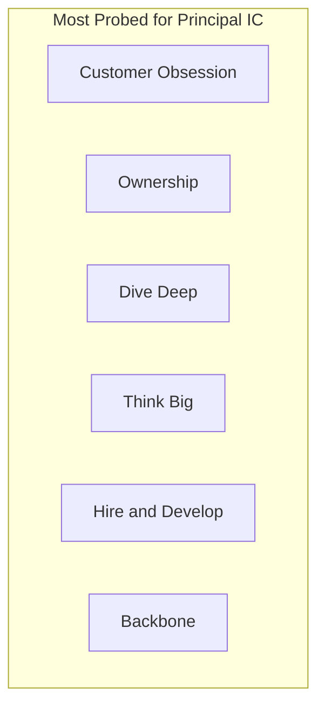
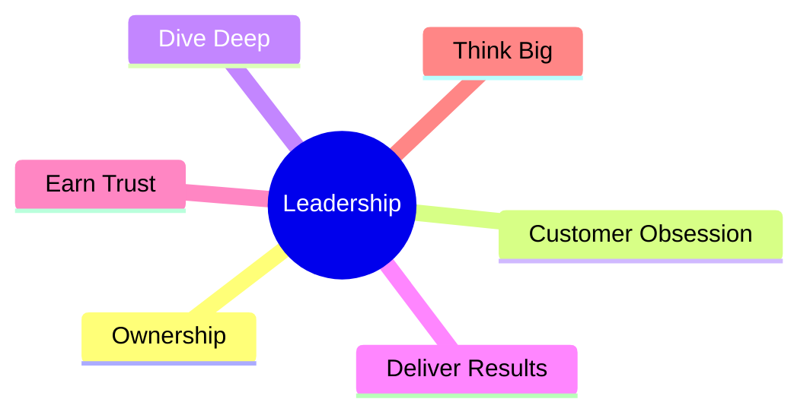

# Leadership Principles for Principal Interviews

## 1. Executive Summary

**Leadership Principles (LPs)** are explicit values used—most famously by Amazon—to evaluate candidates at every level. For **Principal Engineer** and **Principal Architect** roles, LP interviews are not soft screenings; they are **bar calibration** instruments that assess judgment, scope, ownership, and cultural fit alongside technical loops.

This chapter maps all sixteen Amazon Leadership Principles to **principal-level behavioral expectations**, story prompts, scoring rubrics, and preparation strategy. The framework applies broadly to Microsoft, Google, Adobe, and other companies with values-based behavioral rounds—even when they use different vocabulary.

## 2. Why This Topic Matters

Candidates fail principal loops with strong system design when they:

- Cannot demonstrate **multi-year ownership** of outcomes.
- Blame other teams under **Earn Trust** probes.
- Show **shallow Dive Deep** when asked for metrics.
- Lack **Think Big** scope while claiming principal level.

LP preparation converts scattered career history into **repeatable evidence** of principal bar.

## 3. Problems Being Solved

| Problem | LP framework helps |
|---------|-------------------|
| Unstructured behavioral prep | Index stories by principle |
| Level mismatch | Calibrate scope per LP |
| Inconsistent answers across interviewers | Shared vocabulary |
| Weak negative examples | Principles define anti-patterns |
| Cross-company prep | Translate LPs to other value systems |

## 4. Assumptions and System Model

| Assumption | Implication |
|------------|-------------|
| **Amazon LP loop uses 2+ LP-focused interviews** | Minimum 2 stories per heavily used LP |
| **Interviewers score independently** | Consistency matters |
| **Bar Raiser probes depth** | Surface story must have layers |
| **Principal ≠ manager** | Lead via influence, not headcount |
| **Values evolve slowly** | Use official Amazon list; verify current wording |

## 5. Essential Terminology

| Term | Definition |
|------|------------|
| **Leadership Principle** | Amazon's enumerated leadership values (16) |
| **Functional competency** | Technical/role skill (separate from LP) |
| **Bar Raiser** | Calibrated interviewer protecting hiring bar |
| **Scope** | Organizational reach of impact |
| **Mechanism** | Repeatable system producing results |
| **Correction of Error (COE)** | Amazon post-incident learning doc |
| **Single-threaded owner** | One accountable leader per initiative |

## 6. Core Mechanism

### 6.1 The sixteen Leadership Principles (verify official source)

| # | Principle | Principal signal |
|---|-----------|------------------|
| 1 | Customer Obsession | Long-term customer trust over short-term revenue |
| 2 | Ownership | End-to-end including ops; no "not my job" |
| 3 | Invent and Simplify | Novel solution that reduces complexity |
| 4 | Are Right, A Lot | Good judgment; strong instincts + data |
| 5 | Learn and Be Curious | Continuous learning driving innovation |
| 6 | Hire and Develop the Best | Raises bar; mentors future principals |
| 7 | Insist on the Highest Standards | Refuses mediocre; elevates quality |
| 8 | Think Big | Bold vision executed in phases |
| 9 | Bias for Action | Speed with reversible decisions |
| 10 | Frugality | More with less; cost consciousness |
| 11 | Earn Trust | Candor, admit mistakes, listen |
| 12 | Dive Deep | Metrics, details, root cause |
| 13 | Have Backbone; Disagree and Commit | Principled dissent then alignment |
| 14 | Deliver Results | Focus on key outputs despite obstacles |
| 15 | Strive to be Earth's Best Employer | Inclusive, safe teams (behavioral relevance) |
| 16 | Success and Scale Bring Broad Responsibility | Community/sustainability awareness |

### 6.2 Story-to-LP mapping matrix

Build a spreadsheet:

- **Rows:** 12–20 STAR stories ([STAR Story Framework](/docs/behavioral-and-leadership/star-story-framework)).
- **Columns:** 16 LPs.
- **Cells:** Primary (P), Secondary (S), or blank.

**Target:** No empty column for LPs 1–14; at least **two Primary** stories for Ownership, Dive Deep, Customer Obsession, Deliver Results.

### 6.3 Principal scope calibration per LP

| LP | L5–L6 signal | L7+ principal signal |
|----|--------------|----------------------|
| Ownership | Team subsystem | Multi-team platform or product area |
| Think Big | Team roadmap | Org or company technical strategy |
| Dive Deep | Module-level debug | Cross-system incident with org learning |
| Hire and Develop | Mentors juniors | Creates architects; hiring bar influence |

## 7. Step-by-Step Walkthrough

### Amazon LP interview flow

1. Interviewer names LP (e.g., "Give me an example of Dive Deep").
2. Candidate delivers STAR (~3 min).
3. Interviewer drills: timeline, metrics, alternatives, your specific role.
4. May switch LP or ask "what would you do differently?"
5. Interviewer writes structured feedback with hire/no-hire and level.

**Preparation:** For each top-8 LP, prepare **3 stories** (primary, alternate, failure variant).

## 8. Invariants and Guarantees

Strong LP answers exhibit:

- **Specificity** — dates, systems, numbers (ranges OK with disclosure).
- **Personal agency** — "I" decisions documented.
- **Customer linkage** — even internal platforms serve internal customers.
- **Mechanism** — not one-time heroics; repeatable process.

## 9. Failure Scenarios

| Anti-pattern | LP violated | Example |
|--------------|-------------|---------|
| Blame vendor exclusively | Ownership | "AWS caused it" with no your-side fixes |
| Hand-wavy metrics | Dive Deep | "Much faster" |
| Credit hogging | Earn Trust | No mention of team |
| Risk avoidance only | Bias for Action | Never shipped |
| Reckless launch | Insist on Standards / Customer Obsession | Ignored quality gates |
| Yes-person only | Have Backbone | No dissent examples |

## 10. Performance Characteristics

Optimal LP answer:

- **15 sec** — LP explicitly addressed in opening.
- **3 min** — core STAR.
- **2–5 min** — follow-up depth per interviewer question.

Practice **45 LP questions** from flashcard deck (3 per principle).

## 11. Scalability Limits

Memorizing scripted answers fails under Bar Raiser improvisation. **Internalize facts**; speak naturally. Scripts longer than 400 words sound robotic.

## 12. Operational Considerations

- Bring **notebook** to interviews for clarifying questions—not to read stories.
- **Pause** before answering; choose best story for LP, not first story remembered.
- If stuck: "I have two examples—one more technical, one more organizational—which would you prefer?"

## 13. Security Considerations

LP stories about security incidents: share **process and learning**, not exploitable details or unpatched vulnerability specifics.

## 14. Cost Considerations

**Frugality** stories at principal level require **measured savings** and **reliability proof**—not layoffs or starving teams.

Link: [Cloud Cost Optimization](/docs/cost-and-finops/cloud-cost-optimization).

## 15. Production Implementations

### Cross-company translation

| Amazon LP | Google / Microsoft analog |
|-----------|----------------------------|
| Customer Obsession | User/customer focus |
| Ownership | Accountability, DRI culture |
| Dive Deep | Data-driven, SRE rigor |
| Think Big | Moonshot / growth mindset |
| Earn Trust | Integrity, inclusive collaboration |

Use LP vocabulary in Amazon loops; **translate themes** elsewhere.

## 16. Alternatives and Tradeoffs

| Prep approach | Pros | Cons |
|---------------|------|------|
| LP-indexed stories | Comprehensive | Upfront time |
| Improv only | Fast prep | Fails Bar Raiser depth |
| Manager-written stories | Polished | Sounds inauthentic |
| COE-based stories | High Dive Deep signal | Needs real incidents |

## 17. Common Misconceptions

- **"LPs are only for managers"** — False for Amazon IC principal.
- **"Any positive story works"** — Must match LP definition precisely.
- **"Disagree and Commit = always agree eventually"** — Show real disagreement first.
- **"Frugality = cheap"** — Means resourcefulness, not cutting corners on safety.

## 18. Principal Architect Perspective

Principal LP signal = you built **mechanisms**:

- Standardized **SLO policy** (Insist on Highest Standards).
- **Architecture review board** raising design quality (Hire and Develop indirectly).
- **Cost attribution** changing team behavior (Frugality).
- **Customer advisory** loop shaping roadmap (Customer Obsession).

Articulate **organizational systems**, not single projects only.

## 19. Architecture Review Exercise

Pick an ADR you wrote. Which **three LPs** does it exemplify? Write 150-word STAR stub for each.

## 20. Whiteboard Explanation

Draw LP **interdependency**: Customer Obsession drives Dive Deep on incidents; Ownership ensures fixes ship; Earn Trust maintains partner relationships during postmortems.

## 21. Interview Questions

### Q1: Customer Obsession — hardest customer tradeoff

**Expected signals:** Long-term trust; said no to bad-fit feature; data.

**Follow-ups:** Revenue impact? Executive pushback?

**Scoring rubric:**

| Level | Criteria |
|-------|----------|
| Excellent | Quantified customer outcome; principled tradeoff |
| Good | Clear customer focus |
| Adequate | Generic "users first" |
| Weak | Customer as excuse for scope creep |

---

### Q2: Ownership — problem outside your job description

**Expected signals:** Voluntary accountability; sustained until resolved; ops included.

---

### Q3: Dive Deep — diagnosis executives missed

**Expected signals:** You went to primary sources (logs, code, data); changed decision.

---

### Q4: Have Backbone — disagreed with VP

**Expected signals:** Data; respect; outcome whether won or lost; commit after decision.

---

### Q5: Invent and Simplify — removed complexity

**Expected signals:** Before/after architecture; maintenance cost reduction.

**Strong answer outline:** Quantify lines of code, services decommissioned, incident reduction—not only "cleaner."

---

### Q6: Frugality — major cost win

**Expected signals:** Unit economics; no reliability regression metrics.

---

### Q7: Hire and Develop — grew senior talent

**Expected signals:** Specific mentee outcome (promotion, scope); hiring bar actions.

---

### Q8: Think Big — multi-year vision

**Expected signals:** Phased delivery; early skeptics convinced.

## 22. Interview Follow-Ups

Bar Raiser classics:

- "What did **you** do vs. your manager?"
- "How do you **know** it worked?"
- "What **feedback** did you receive?"
- "What would you do **differently**?"
- "Why is this **principal** scope?"

Prepare answers without defensiveness.

## 23. Strong Answer Example (Ownership)

> "After a regional outage, the official COE assigned follow-ups to service teams—but **nobody owned cross-service replay testing**. I wasn't on-call that week, but I volunteered as single-threaded owner for a quarterly game day program. Over six months I built scenarios with SRE, automated failover injectors, and got VP sign-off to block launches missing game day evidence. Replay-related incidents dropped from 4/year to 0 the following year. I'd start earlier with executive sponsorship rather than volunteering into a gap."

## 24. Weak Answer Example (Dive Deep)

> "We had latency issues. I told the team to add caching and it improved."

**Missing:** metrics, root cause analysis, your investigation steps.

## 25. Hands-On Exercise

1. Download official LP list from Amazon Jobs.
2. Write **2 behavioral questions** you would ask per LP.
3. Answer your own questions with STAR.
4. Peer score with rubric from [Mock Interview Rubric](/docs/mock-interviews/mock-interview-rubric).

## 26. Knowledge Check

1. Difference between Ownership and Deliver Results?
2. How does Disagree and Commit differ from passive agreement?
3. Name LPs most critical for principal Bar Raiser.
4. How do you demonstrate Frugality without harming reliability?
5. Translate Customer Obsession to internal platform team context.

## 27. Flashcards

| Front | Back |
|-------|------|
| LP count (Amazon) | 16 — verify official list |
| Backbone + Commit | Disagree with data, then align fully |
| Dive Deep probe | Ask for logs, metrics, root cause |
| Think Big principal | Multi-year, multi-team vision |
| Mechanism vs. heroics | Repeatable system wins at principal bar |

## 28. Cheat Sheet

- **Index 12+ stories** across LPs.
- Open by **naming LP** implicitly through behavior shown.
- **Metrics** in every story.
- Prepare **failure** and **dissent** stories.
- Principal = **scope + mechanism + people**.

## 29. Related Concepts

- [STAR Story Framework](/docs/behavioral-and-leadership/star-story-framework)
- [Amazon and AWS Interview Preparation](/docs/company-specific-preparation/amazon-aws)
- [Executive Communication](/docs/architecture-leadership/executive-communication)
- [Architecture Decision Records](/docs/architecture-leadership/architecture-decision-records)

## LP Combination Questions

Bar Raisers often blend principles in one prompt:

| Combined prompt | Stories to prepare |
|-----------------|-------------------|
| Ownership + Dive Deep | Incident you owned end-to-end with root cause |
| Think Big + Deliver Results | Multi-year vision shipped in phases |
| Frugality + Insist on Standards | Cost cut without reliability regression |
| Have Backbone + Earn Trust | Disagreed with exec, preserved relationship |
| Customer Obsession + Invent and Simplify | Removed feature complexity for customer win |

Practice answering without naming LPs explicitly while still satisfying both.

## Negative Behavioral Preparation

Some loops ask **"Tell me about a time you missed a commitment."**

Structure:

1. Own the miss—no external blame primary.
2. Customer/stakeholder impact stated.
3. Recovery actions immediate and long-term mechanism.
4. Metric showing improved predictability after.

This satisfies **Earn Trust** + **Ownership**.

## Principal Promotion Panel Simulation

90-minute exercise with peer:

| Segment | Activity |
|---------|----------|
| 0–15 | "Why principal?" scope narrative |
| 15–45 | Three LP questions (random draw) |
| 45–75 | Deep dive one story to 8 minutes |
| 75–90 | Feedback with rubric |

## LP-to-Architecture Linkage Table

| LP | Architecture artifact example |
|----|------------------------------|
| Ownership | On-call runbook you authored |
| Dive Deep | Postmortem with tracing evidence |
| Think Big | 3-year platform roadmap |
| Frugality | FinOps dashboard driving behavior |
| Insist on Standards | Mandatory SLO policy |
| Hire and Develop | Promotion packet you sponsored |

Use artifacts as **hooks** in behavioral answers.

## Full LP Reference Table (Study Aid)

| LP | One-line principal signal | Sample question |
|----|---------------------------|-----------------|
| Customer Obsession | Long-term trust over short-term win | Hardest customer tradeoff? |
| Ownership | End-to-end including ops | Problem outside job description? |
| Invent and Simplify | Remove complexity | Simplified architecture story? |
| Are Right, A Lot | Judgment with incomplete data | Wrong prediction reversed? |
| Learn and Be Curious | Continuous learning applied | New domain mastered quickly? |
| Hire and Develop | Raised team bar | Sponsored promotion? |
| Insist on Highest Standards | Refused to ship mediocrity | Pushed back on deadline? |
| Think Big | Multi-year vision | Ambitious bet phased? |
| Bias for Action | Reversible fast decisions | Calculated risk? |
| Frugality | Resourcefulness | Major cost win? |
| Earn Trust | Candor and listening | Recovered from mistake? |
| Dive Deep | Metrics and root cause | Found bug executives missed? |
| Have Backbone | Disagree then commit | VP disagreement? |
| Deliver Results | Output despite obstacles | Missed then recovered? |
| Earth's Best Employer | Inclusive team building | Improved inclusion on team? |
| Broad Responsibility | Societal scale awareness | Sustainability or community impact? |

Verify official LP definitions on Amazon Jobs before your loop.

## 30. References

- Amazon Jobs — Leadership Principles (official definitions).
- Amazon Builder Library — ownership and COE culture articles (selected).
- Stone, B. *The Everything Store* — historical LP context (anecdotal, not policy).
- Your postmortems and performance reviews (primary evidence).

## Diagram

*Figure: Leadership principles map for principal-level behavioral interviews.*
