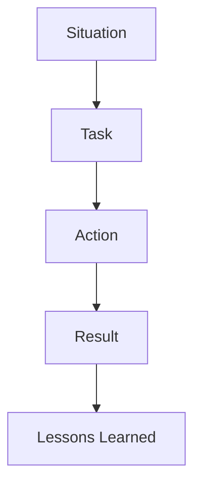

# Behavioral and Leadership

Principal architect loops evaluate organizational impact, judgment, and influence—not only technical depth. This domain provides STAR storytelling frameworks, leadership principle mapping, and domain-specific behavioral narratives for enterprise file transfer and integration platforms.

*Figure: STAR framework for behavioral interview stories.*

## Chapters

| Topic | Guide |
|-------|-------|
| STAR framework | [STAR Story Framework](/docs/behavioral-and-leadership/star-story-framework) |
| Leadership principles | [Leadership Principles for Principal Interviews](/docs/behavioral-and-leadership/leadership-principles) |
| MFT scaling stories | [Enterprise File Transfer Stories](/docs/behavioral-and-leadership/enterprise-file-transfer-stories) |

## Recommended Study Path

1. Build a story bank with [STAR Story Framework](/docs/behavioral-and-leadership/star-story-framework).
2. Map stories to [Leadership Principles](/docs/behavioral-and-leadership/leadership-principles) (especially for Amazon loops).
3. Add domain stories from [Enterprise File Transfer Stories](/docs/behavioral-and-leadership/enterprise-file-transfer-stories) if your background includes B2B integration or MFT.
4. Practice with [Mock Interview Rubric](/docs/mock-interviews/mock-interview-rubric) behavioral dimensions.
5. Pair with [Executive Communication](/docs/architecture-leadership/executive-communication) for leadership rounds.

## Related Domains

- [Company-Specific Preparation](/docs/company-specific-preparation/overview)
- [Mock Interviews](/docs/mock-interviews/overview)
- [Architecture Leadership](/docs/architecture-leadership/overview)
