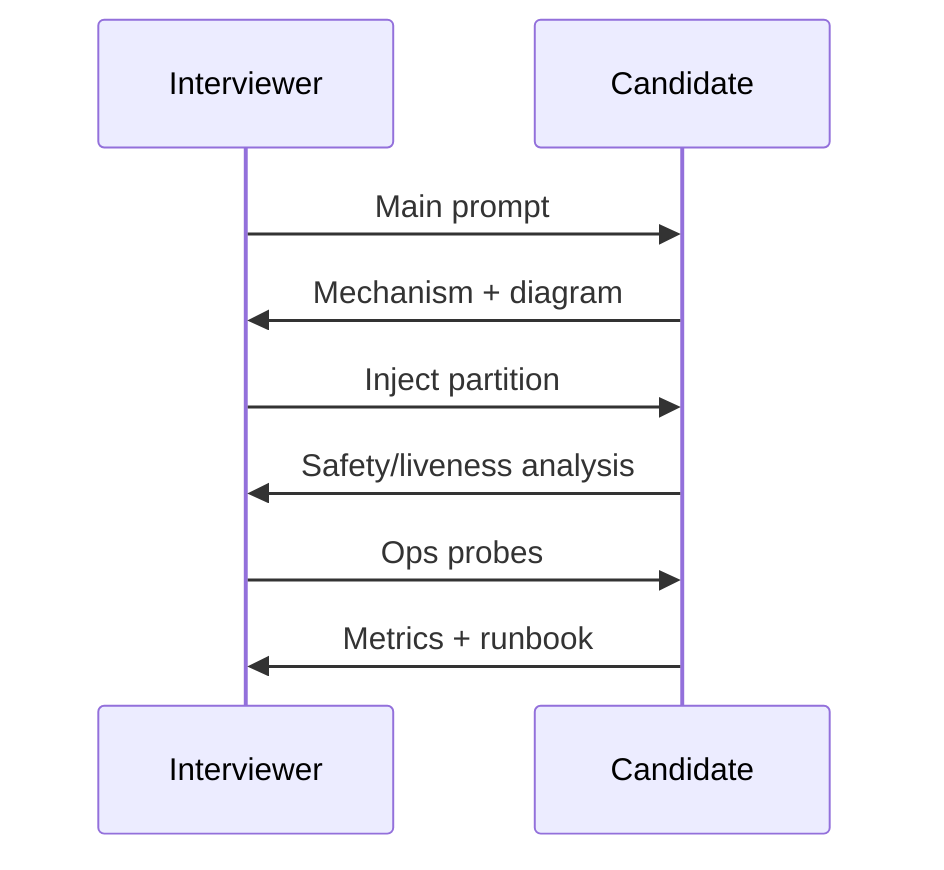
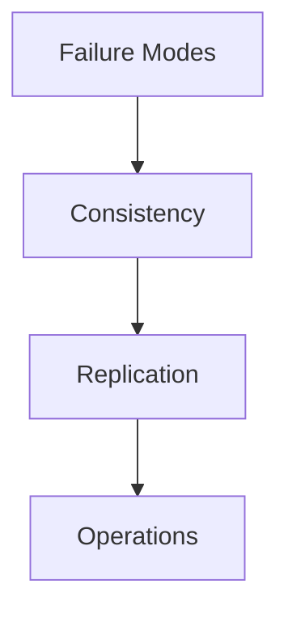

# Distributed Systems Mock Interview

## 1. Executive Summary

The **distributed systems mock interview** simulates principal-level technical depth probes: consistency models, consensus, replication, partitioning, failure detection, and operational recovery. Unlike broad system design mocks, this format emphasizes **mechanism correctness**, **safety and liveness properties**, and **partition behavior**—skills tested heavily at Google, Amazon AWS, Snowflake, NVIDIA, and OpenAI infrastructure loops.

This chapter provides **six full mock sessions** with prompts, interviewer scripts, timing, expected signals, follow-up chains, scoring rubrics, and an 8-week preparation strategy tied to curriculum chapters.

## 2. Why This Topic Matters

Principal architects must reason about **partial failure** as the norm ([Partial Failure](/docs/distributed-systems-foundations/partial-failure)). Panels ask:

- "What happens during a network partition?"
- "Is this linearizable?"
- "How do you detect a failed leader without split brain?"

Candidates who only know system design boxes fail distributed depth rounds. Dedicated mocks build **muscle memory** for formal guarantees vs. implementation choices.

## 3. Problems Being Solved

| Gap | Mock session fixes |
|-----|-------------------|
| Confusing CAP slogan with design | PACELC applied per prompt |
| Hand-waving consensus | Raft/Paxos steps verbalized |
| Ignoring liveness | Leader election timeouts discussed |
| No ops story | Failure detection, metrics, runbooks |
| Weak comparison | Alternatives table under pressure |

## 4. Assumptions and System Model

| Assumption | Implication |
|------------|-------------|
| **Asynchronous network** | Messages delay/lose; no sync link |
| **Crash-stop faults** | Unless Byzantine specified |
| **Clock skew** | No perfect global clock without hardware assist |
| **60-minute session** | One major topic + follow-ups |
| **Whiteboard or virtual board** | Diagrams required |

Link: [Distributed System Models](/docs/distributed-systems-foundations/distributed-system-models).

## 5. Essential Terminology

| Term | Definition |
|------|------------|
| **Safety** | Nothing bad happens (e.g., no split brain writes) |
| **Liveness** | Something good eventually happens (e.g., election completes) |
| **Linearizability** | Strongest single-object consistency |
| **Quorum** | Minimum replicas for read/write |
| **Fencing token** | Monotonic token preventing stale primary writes |
| **Leader election** | Choosing coordinator replica |
| **Heartbeats** | Periodic signals for failure detection |
| **Split brain** | Two leaders believing both are primary |

## 6. Core Mechanism

### 6.1 Mock session structure

| Phase | Minutes | Activity |
|-------|---------|----------|
| Warm-up | 5 | Definitions check (interviewer picks 2 terms) |
| Main prompt | 35 | Candidate explains design/mechanism |
| Failure injection | 15 | Interviewer adds partition, crash, delay |
| Ops & wrap | 5 | Monitoring, rollout |

### 6.2 Interviewer failure injection menu

- Kill leader mid-transaction.
- Delay heartbeat messages (not loss).
- Partition minority quorum.
- Slow client with retries storm.
- Clock skew on lease expiry.

Score using [Mock Interview Rubric](/docs/mock-interviews/mock-interview-rubric) distributed systems section.

## 7. Step-by-Step Walkthrough

### Mock Session A: Leader election and split-brain prevention

**Prompt:** "You have a primary-secondary database failover system using heartbeats. Design failover to avoid split brain."

**Strong path:**

1. Define failure detection timeout > heartbeat interval.
2. Require **quorum** or **fencing token** before promoting secondary.
3. STONITH or revoke old primary's write access via coordinator ([Fencing Tokens](/docs/consensus/fencing-tokens)).
4. Discuss **safety** (no dual writes) vs. **liveness** (availability during partition).

**Follow-ups:**

- What if heartbeat link false-positive?
- Manual failover override risks?

**Rubric target:** Consistency model 4, Failure 4, Mechanism 3+.

---

### Mock Session B: Dynamo-style quorum reads/writes

**Prompt:** "Explain read repair and sloppy quorum in a partitioned key-value store."

**Strong path:**

- N, R, W parameters; R+W>N for strong read-your-writes variant.
- Read repair on digest mismatch.
- Sloppy quorum with hinted handoff—availability tradeoff.
- Cite [Amazon Dynamo](/docs/distributed-databases/amazon-dynamo); distinguish paper from DynamoDB product.

**Follow-ups:**

- Merkle tree anti-entropy when?
- Hot key impact on quorum latency?

---

### Mock Session C: Raft leader election (verbal)

**Prompt:** "Walk through Raft leader election after leader crash."

**Strong path:**

- Terms, randomized election timeout, RequestVote RPC.
- Log matching property (high level).
- Safety: at most one leader per term (under async model assumptions).

Link: [Raft](/docs/consensus/raft).

**Follow-ups:**

- Network partition with two candidates?
- Joint consensus for membership change?

---

### Mock Session D: Distributed transaction across two services

**Prompt:** "Service A and B must commit together or not at all. Options?"

**Strong path:**

- 2PC coordinator failure modes ([Two-Phase Commit](/docs/transactions/two-phase-commit)).
- Saga with compensations ([Sagas](/docs/transactions/sagas)).
- Outbox pattern ([Transactional Outbox](/docs/transactions/transactional-outbox)).
- Explicit **no perfect solution** under partition without sacrifice.

---

### Mock Session E: Exactly-once processing myth

**Prompt:** "Can you implement exactly-once message processing?"

**Strong path:**

- End-to-end idempotency + dedup store + transactional offset commit.
- Kafka semantics: at-least-once + idempotent consumer = effective exactly-once in scope.
- Distinguish **guarantee** from **marketing term**.

Link: [Message Delivery Semantics](/docs/messaging-and-streaming/message-delivery-semantics), [Idempotency](/docs/distributed-systems-foundations/idempotency).

---

### Mock Session F: Global clock and ordering

**Prompt:** "How does Spanner achieve external consistency?"

**Strong path:**

- TrueTime uncertainty interval; commit wait.
- Contrast with [Lamport Clocks](/docs/time-ordering-and-coordination/lamport-clocks) logical ordering.
- Do not claim all databases have TrueTime.

Link: [Google Spanner](/docs/distributed-databases/google-spanner).

## 8. Invariants and Guarantees

Interviewers expect explicit classification:

| Property | Example question |
|----------|------------------|
| **Safety** | Can two leaders serve writes? |
| **Liveness** | Will election complete? |
| **Consistency** | What can stale reader see? |
| **Durability** | Acknowledged write after crash? |

Separate **formal guarantee** from **implementation choice** per [technical accuracy standards](/docs/start-here/how-to-use-this-system).

## 9. Failure Scenarios

Practice verbal analysis for:

| Scenario | Key mechanism |
|----------|---------------|
| **Split brain** | Quorum, fencing |
| **Lost ack** | Client retry idempotency |
| **GC pause** | False failure detection |
| **Cascading retry** | Jitter, budgets |
| **Byzantine node** | Usually out of scope unless stated |

## 10. Performance Characteristics

Discuss **latency vs. consistency**:

- Strong quorum reads add RTT.
- Leader-based writes serialize through coordinator.
- Geo-distributed quorum crosses WAN.

Back-of-envelope: 3 replicas, 2ms LAN RTT → quorum read ~4ms minimum (simplified).

## 11. Scalability Limits

- Single leader throughput ceiling.
- Coordination service (ZooKeeper/etcd) write scalability ([etcd](/docs/consensus/etcd)).
- Vector clock size with replica count.

## 12. Operational Considerations

Every mock should close with:

- **Metrics:** election frequency, replication lag, unavailable quorum events.
- **Alerts:** split brain detection, lag threshold.
- **Runbooks:** forced failover, rebuild replica.
- **Game days:** inject partition in staging.

Link: [Chaos Engineering](/docs/reliability-and-resilience/chaos-engineering).

## 13. Security Considerations

- TLS between replicas; mTLS identity.
- Prevent unauthenticated node join to quorum.
- Audit leader promotion events.

## 14. Cost Considerations

- Cross-AZ replication bandwidth.
- Over-provisioned replicas for read scale.
- Coordination cluster HA cost.

## 15. Production Implementations

Reference public systems for comparison (not internals):

- **etcd/ZooKeeper** — coordination.
- **Cassandra/Dynamo** — quorum AP.
- **Spanner** — CP with TrueTime.
- **Kafka** — log replication, ISR.

Curriculum chapters per system in [Distributed Databases](/docs/distributed-databases/overview).

## 16. Alternatives and Tradeoffs

| Need | Lean CP | Lean AP |
|------|---------|---------|
| Financial ledger | Spanner, etcd | Not naive eventual |
| Social likes | — | Eventual + CRDT |
| Config service | Consensus store | — |
| Shopping cart | Session + merge | Eventual with rules |

Link: [CAP Theorem](/docs/consistency/cap-theorem), [PACELC](/docs/consistency/pacelc).

## 17. Common Misconceptions

- **"CAP means pick two forever"** — PACELC extends for latency.
- **"Raft solves all distributed problems"** — It's replicated log, not magic transaction layer.
- **"Heartbeats are enough"** — Need quorum/fencing for safety.
- **"Linearizable everywhere"** — Often too expensive globally.

## 18. Principal Architect Perspective

Principal answers connect **algorithm to org**:

- "We chose saga because 2PC ops burden exceeded team maturity."
- "We invested in formal verification of failover playbook."
- "We documented accepted inconsistency in read model with product sign-off."

Link: [Architecture Decision Records](/docs/architecture-leadership/architecture-decision-records).

## 19. Architecture Review Exercise

Given: active-active MySQL in two regions with async replication and DNS failover. **List safety violations** and redesign one region active-passive with explicit RPO.

## 20. Whiteboard Explanation

Draw **Raft** election timeline: follower timeout → candidate → majority votes → leader append entries. Mark safety invariant.

## 21. Interview Questions

### Q1: What happens to an in-flight write when leader dies before replication?

**Expected signals:** Client timeout; retry idempotency; uncommitted loss unless sync replicate ack policy.

**Follow-ups:** Durability vs. latency tradeoff?

**Scoring rubric:**

| Level | Criteria |
|-------|----------|
| Excellent | Replication state machine, client behavior, ops |
| Good | Uncommitted may lose |
| Adequate | "It fails" |
| Weak | Silent data loss claim without mechanism |

---

### Q2: Compare etcd and application-level leader election

**Expected signals:** etcd gives proven consensus; app election risks bugs; coordination service as dependency.

---

### Q3: Design idempotent consumer for payment events

**Expected signals:** Dedup key store; exactly-once within consumer boundary; link to sagas.

---

### Q4: Network partition — can system remain available and consistent?

**Expected signals:** CAP/PACELC; choose; explicit sacrifice.

---

### Q5: How detect silent replica lag?

**Expected signals:** Heartbeat + lag metric; read from leader for critical reads; automatic demotion.

## 22. Interview Follow-Ups

Interviewer escalation path:

1. Mechanism correct?
2. Failure injected?
3. Ops metrics?
4. Alternative rejected why?
5. Business impact of chosen consistency?

## 23. Strong Answer Example (quorum excerpt)

> "With N=3, W=2, R=2, a write is durable if two replicas acknowledge before client success. During partition isolating one replica, we can still commit if the majority side has two nodes. Reads from minority may be stale—clients needing read-your-writes must contact coordinator or use session tokens tracking write replica. If R+W≤N, we risk reading pre-write value without repair; I'd use read repair on mismatch detection during quorum read."

## 24. Weak Answer Example

> "We use a load balancer and three databases; if one fails it fails over automatically."

No quorum, no split-brain analysis.

## 25. Hands-On Exercise

1. Pick Mock Session A–F; set 60-min timer.
2. Record whiteboard explanation.
3. Score with distributed rubric.
4. Re-study weakest chapter ([Consensus](/docs/consensus/overview) hub).
5. Repeat session in 5 days.

## 26. Knowledge Check

1. State safety and liveness for leader election.
2. When does R+W>N matter?
3. What problem do fencing tokens solve?
4. Difference between at-least-once and effectively-once?
5. Why is commit wait needed in Spanner-style designs?

## 27. Flashcards

| Front | Back |
|-------|------|
| Split brain prevention | Quorum + fencing |
| Raft safety | One leader per term |
| Read repair | Fix stale during read |
| Saga vs 2PC | Liveness vs simplicity tradeoff |
| Idempotency key | Dedup client retries |

## 28. Cheat Sheet

- Classify **safety vs liveness** first.
- Draw **timeline** for failures.
- Cite **N, R, W** or **Raft terms**.
- Close with **metrics + runbook**.
- Use [Mock Interview Rubric](/docs/mock-interviews/mock-interview-rubric).

## 29. Related Concepts

- [Consensus Overview](/docs/consensus/overview)
- [Replication Overview](/docs/replication/overview)
- [Failure Detectors](/docs/distributed-systems-foundations/failure-detectors)
- [Amazon and AWS Interview Preparation](/docs/company-specific-preparation/amazon-aws)
- [Google Interview Preparation](/docs/company-specific-preparation/google)

## Mock Session G: Kafka consumer lag storm

**Prompt:** "Consumer group lag growing 1M messages/hour. Diagnose and architect fixes."

**Strong path:**

- Partition count vs consumer count.
- Slow handler profiling.
- Backpressure to producers if needed.
- DLQ for poison messages.
- Rebalance storm detection.

Link: [Kafka Architecture](/docs/messaging-and-streaming/kafka-architecture).

---

## Mock Session H: Linearizability litmus test

**Prompt:** "Is this register linearizable?" — interviewer draws concurrent operations timeline.

**Strong path:**

- Draw history; check for real-time order violation.
- Distinguish sequential consistency vs linearizability.

Link: [Linearizability](/docs/consistency/linearizability).

## Timed Drill Cards

Print or flashcard these 5-minute drills:

| Card | Task |
|------|------|
| 1 | Explain 2PC failure modes aloud |
| 2 | Draw Raft election |
| 3 | Compute quorum for N=5, W=3, R=3 |
| 4 | List saga compensations for order flow |
| 5 | Explain fencing token scenario |

## Company Overlay Sessions

After completing Sessions A–H, add one company-specific distributed probe:

| Company | Extra probe |
|---------|-------------|
| Amazon | Dynamo quorum + anti-entropy |
| Google | Spanner commit wait |
| Snowflake | Metadata service HA |
| NVIDIA | NCCL collective failure |
| OpenAI | Inference request timeout cascade |

Link: [Company-Specific Preparation](/docs/company-specific-preparation/overview).

## Safety and Liveness Quick Reference Card

| System | Safety property | Liveness risk |
|--------|-----------------|---------------|
| Leader election | ≤1 leader per term | Split vote delay |
| 2PC | Atomic commit | Coordinator blocking |
| Raft log | Log matching | Election timeout |
| Quorum KV | No stale write ack | Unavailable minority |
| Saga | Compensating consistency | Partial completion visible |

Memorize for rapid interview classification.

## Mock Facilitator Guide

If you are the interviewer:

1. Do not help too early—wait 2 minutes of silence before hint.
2. Hints escalate: clarify requirement → suggest dimension → partial answer.
3. Record which hints were needed—counts against depth score.
4. End with written scores within 5 minutes while memory fresh.

## Appendix: Full Mock Session I (Read Path)

**Prompt:** "Design a distributed configuration service like etcd-lite."

**45-minute candidate path:**

1. Clarify: strong consistency required; watch API; max 10K keys; 1 KB values; 1K QPS reads, 100 writes.
2. Single Raft cluster per environment; linearizable reads from leader or quorum reads with tradeoff explanation.
3. Watch long-poll or gRPC stream for changes.
4. Failure: leader dies—election in &lt;5s; clients retry with backoff.
5. Ops: metrics on proposal latency, election count, fsync duration.

**Scoring expectation:** Mechanism 4 if Raft articulated; Failure 3+ if election covered.

## Appendix: Full Mock Session J (Write Path)

**Prompt:** "Implement distributed lock for cron leader election."

Compare etcd lease lock vs database advisory lock vs Redis Redlock (and known Redlock controversies—cite Martin Kleppmann critique conceptually). Principal answer: prefer consensus-backed lease with fencing token for writers touching external systems.

Link: [Distributed Leases](/docs/consensus/distributed-leases), [Fencing Tokens](/docs/consensus/fencing-tokens).

## Appendix: PACELC verbal drill

For each system below, state PACELC classification aloud in 30 seconds:

1. Cassandra write path
2. etcd key-value
3. Redis primary-replica async
4. Spanner global row
5. Kafka consumer lag commit

Answer key in [PACELC](/docs/consistency/pacelc) chapter—self-check after drill.

## 30. References

- Kleppmann, *Designing Data-Intensive Applications*.
- Ongaro & Ousterhout, "In Search of an Understandable Consensus Algorithm" (Raft).
- Gilbert & Lynch, CAP paper.
- Corbett et al., Spanner paper (OSDI 2012).
- DeCandia et al., Dynamo paper (SOSP 2007).

## Preparation Strategy (8 Weeks)

| Week | Study | Mock |
|------|-------|------|
| 1 | [Partial Failure](/docs/distributed-systems-foundations/partial-failure), [Safety and Liveness](/docs/distributed-systems-foundations/safety-and-liveness) | Session E |
| 2 | [CAP](/docs/consistency/cap-theorem), [PACELC](/docs/consistency/pacelc) | Session B |
| 3 | [Raft](/docs/consensus/raft), [Leader Election](/docs/consensus/leader-election) | Session C |
| 4 | [Fencing Tokens](/docs/consensus/fencing-tokens), [Distributed Leases](/docs/consensus/distributed-leases) | Session A |
| 5 | [Sagas](/docs/transactions/sagas), [2PC](/docs/transactions/two-phase-commit) | Session D |
| 6 | [Kafka Architecture](/docs/messaging-and-streaming/kafka-architecture) | Session E repeat |
| 7 | [Spanner](/docs/distributed-databases/google-spanner) | Session F |
| 8 | Full distributed + system design combo mock | Both rubrics |

**Daily (45 min):** one flashcard deck + one 10-min whiteboard mechanism from memory.

Pair with [System Design Mock](/docs/mock-interviews/system-design-mock) for full loops.

## Diagram

*Figure: Distributed systems mock interview depth progression.*
