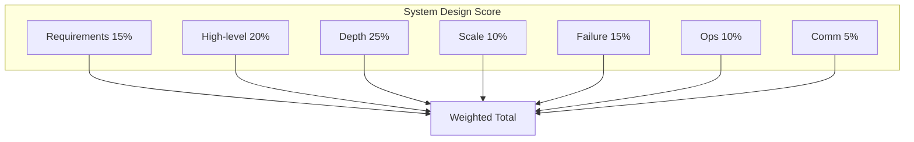
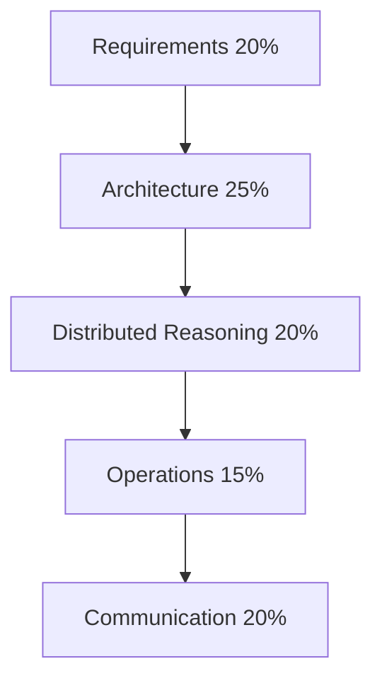

# Mock Interview Rubric

## 1. Executive Summary

A **mock interview rubric** is a structured scoring framework that simulates hiring committee calibration for principal architect loops. Without explicit rubrics, practice sessions devolve into vague feedback ("good job"). With rubrics, candidates and mock interviewers align on **hire bar**, **level signals**, and **improvement priorities** across system design, distributed systems, behavioral, and architecture leadership dimensions.

This chapter provides production-ready rubrics for each interview type, overall loop aggregation, interviewer scripts, candidate self-assessment checklists, and preparation strategy for running effective mocks.

## 2. Why This Topic Matters

Principal candidates invest 50–200 hours in interview prep. **Unstructured mocks** have low marginal value. Rubrics:

- Mirror how **Bar Raisers** and hiring committees think.
- Separate **level** from **polish**.
- Identify **single biggest gap** per week of prep.
- Enable peer practice without professional coaches.

Companies rarely publish internal rubrics; this chapter synthesizes **public hiring practice** and principal-level expectations from architecture leadership literature.

## 3. Problems Being Solved

| Problem | Rubric solution |
|---------|-----------------|
| Inconsistent mock feedback | Shared scoring dimensions |
| False confidence | Explicit weak/strong anchors |
| Level inflation | Scope dimension mandatory |
| Ignored behavioral prep | Equal weight option in loop score |
| No action items | Dimension-linked homework |

## 4. Assumptions and System Model

| Assumption | Implication |
|------------|-------------|
| **45–60 min per mock round** | Time-boxed phases |
| **Interviewer takes notes** | Evidence-based scores |
| **Candidate records session** (optional) | Self-review with consent |
| **Principal bar** | Higher scope than staff |
| **No hire decision** | Practice only; harsh calibration OK |

## 5. Essential Terminology

| Term | Definition |
|------|------------|
| **Strong Hire** | Clear exceed bar; committee would advocate |
| **Hire** | Meets bar with minor gaps |
| **Lean Hire** | Meets bar barely; mixed signals |
| **Lean No Hire** | Below bar in key dimension |
| **No Hire** | Clear fail |
| **Dimension** | Scorable aspect (e.g., depth, communication) |
| **Signal** | Observable evidence in session |
| **Calibration** | Aligning scores across mock interviewers |

## 6. Core Mechanism

### 6.1 Universal four-point scale

| Score | Label | Committee analog |
|-------|-------|------------------|
| 4 | Strong | Strong Hire |
| 3 | Good | Hire |
| 2 | Adequate | Lean Hire / Lean No Hire |
| 1 | Weak | No Hire |

**Principal bar:** Average ≥ 3.0 with **no dimension below 2** in critical areas (depth, scope).

### 6.2 System design rubric

| Dimension | Weight | 4 (Strong) | 1 (Weak) |
|-----------|--------|------------|----------|
| **Requirements** | 15% | Clarifies functional/non-functional; states non-goals | Jumps to design |
| **High-level design** | 20% | Clear components, data flow, APIs | Random boxes |
| **Depth** | 25% | Deep dive on bottleneck with tradeoffs | Surface only |
| **Scale & estimates** | 10% | Back-of-envelope QPS/storage | No numbers |
| **Failure modes** | 15% | Partition, node loss, dependency failure | "It won't fail" |
| **Ops & evolution** | 10% | Monitoring, rollout, migration | Omitted |
| **Communication** | 5% | Structured, checks in with interviewer | Rambling |



### 6.3 Distributed systems rubric

| Dimension | Weight | Strong signal |
|-----------|--------|---------------|
| **Consistency model** | 20% | Names guarantees; PACELC reasoning |
| **Failure handling** | 25% | Partition behavior explicit |
| **Mechanism** | 25% | Correct algorithm/protocol steps |
| **Operations** | 15% | Detection, recovery, tooling |
| **Tradeoffs** | 15% | Alternatives rejected with criteria |

Link: [Distributed Systems Mock](/docs/mock-interviews/distributed-systems-mock).

### 6.4 Behavioral rubric

| Dimension | Weight | Strong signal |
|-----------|--------|---------------|
| **Scope** | 25% | Org-level impact for principal |
| **Personal agency** | 20% | Clear "I" decisions |
| **Metrics** | 20% | Quantified results |
| **Reflection** | 15% | Lessons; what differs next time |
| **LP/values fit** | 10% | Matches asked principle |
| **Concision** | 10% | STAR within time |

Link: [STAR Story Framework](/docs/behavioral-and-leadership/star-story-framework).

### 6.5 Architecture leadership rubric

| Dimension | Weight | Strong signal |
|-----------|--------|---------------|
| **Technical strategy** | 25% | Multi-year phased vision |
| **Stakeholder management** | 20% | Executive communication |
| **Build vs buy** | 15% | Decision criteria |
| **Risk & compliance** | 15% | Security, cost, legal |
| **Team topology** | 15% | Conway, ownership |
| **ADR quality** | 10% | Documented tradeoffs |

## 7. Step-by-Step Walkthrough

### Running a mock session (interviewer script)

**Before (10 min):**

- Agree on type: system design / distributed / behavioral.
- Pick prompt from [System Design Mock](/docs/mock-interviews/system-design-mock) or company guide.
- Interviewer reads rubric dimensions.

**During (45 min):**

- 0–5: Candidate clarifies requirements.
- 5–15: High-level design.
- 15–35: Deep dive + failures (interviewer steers).
- 35–45: Evolution, ops, Q&A.

**After (15 min):**

- Score each dimension 1–4 with **one sentence evidence**.
- Identify **top strength** and **top gap**.
- Assign homework linked to curriculum chapter.

### Candidate self-score

Within 24 hours, candidate scores self **before** reading interviewer sheet. Compare deltas >1 point—communication blind spots.

## 8. Invariants and Guarantees

Valid mock outcome includes:

- **Written scores** per dimension.
- **At least one timestamped quote** as evidence.
- **One concrete homework** assignment.

Invalid mock: "You did great!" without scores.

## 9. Failure Scenarios

| Mock anti-pattern | Fix |
|-------------------|-----|
| Friend too nice | Use anonymous peer from study group |
| No time limit | Enforce timer |
| Wrong level prompt | Use principal-scale requirements |
| Only system design | Full loop includes behavioral |
| No follow-up drills | Interviewer must probe 3+ follow-ups |

## 10. Performance Characteristics

Effective prep cadence:

- **2 mocks/week** for 4 weeks pre-loop.
- **1 full-day loop simulation** (4–5 sessions) 1 week before onsite.
- Diminishing returns after **12 mocks** without new curriculum study.

## 11. Scalability Limits

Solo prep caps at self-recording. **Peer mocks** scale via reciprocal scheduling. Professional coaches add calibration but cost money.

## 12. Operational Considerations

- Record with consent; delete sensitive whiteboard photos.
- Rotate interviewers for bias reduction.
- Track scores in spreadsheet; graph dimension trends.

## 13. Security Considerations

Do not share employer confidential architectures in mocks unless participants share NDA context.

## 14. Cost Considerations

Free peer mocks + rubric ≈ 80% value of paid coaching if **honest scoring**.

## 15. Production Implementations

Hiring committees aggregate written feedback forms similar to these dimensions—Amazon, Google, Microsoft all use structured feedback (exact forms internal).

## 16. Alternatives and Tradeoffs

| Method | Pros | Cons |
|--------|------|------|
| Rubric scoring | Actionable | Setup overhead |
| Freeform feedback | Fast | Low signal |
| Recorded self-mock | Flexible | No follow-up pressure |
| Paid coach | Expert calibration | Cost |

## 17. Common Misconceptions

- **"Mocks are for weak candidates"** — Principals use them universally.
- **"Perfect answer exists"** — Rubric rewards tradeoffs, not memorization.
- **"One Strong Hire mock = ready"** — Need consistent 3+ across types.

## 18. Principal Architect Perspective

Principal mock bar adds **organizational dimension** to every technical score:

- "Who else had to change for this design to work?"
- "What metric would executives track?"
- "What happens at year-3 scale?"

If missing, cap **Scope** at 2 regardless of technical depth.

## 19. Architecture Review Exercise

Score a published architecture blog post (public) using system design rubric. Compare with peer. Discuss inter-rater reliability.

## 20. Whiteboard Explanation

Draw **loop aggregation**: four rounds × dimension scores → radar chart → weakest spoke → study plan.

## 21. Interview Questions

### Q1: (Meta) How should a mock interviewer give feedback?

**Expected signals:** Evidence-based; kind but direct; homework linked.

**Scoring rubric:** Use behavioral rubric on meta-answer.

---

### Q2: Design URL shortener — score a hypothetical "Adequate" answer

**Interviewer exercise:** List missing elements for each dimension scoring 2.

Link: [System Design Mock](/docs/mock-interviews/system-design-mock).

---

### Q3: When is Lean Hire insufficient for principal?

**Expected signals:** Principal needs consistent Hire; scope dimension critical.

## 22. Interview Follow-Ups

For mock debrief, ask candidate:

- "Which dimension surprised you?"
- "What will you study before next mock?"
- "What question stumped you?"

## 23. Strong Answer Example

*(System design excerpt — depth dimension 4)*

Candidate clarifies 100:1 read/write ratio, estimates 10K write QPS peak, chooses separate key generation service with base62 encoding, explains collision handling with DB unique constraint fallback, discusses cache aside for hot URLs with stampede protection, and walks through regional cache invalidation on delete.

## 24. Weak Answer Example

*(Depth dimension 1)*

"Use a hash table in memory." No persistence, no scale, no collision analysis.

## 25. Hands-On Exercise

1. Download rubric dimensions into spreadsheet.
2. Run 45-min mock with peer.
3. Score independently; compare.
4. Assign homework from weakest dimension chapter.
5. Repeat in 7 days.

## 26. Knowledge Check

1. Weight of Depth in system design rubric?
2. Minimum average for principal bar heuristic?
3. Name four behavioral dimensions.
4. What evidence must written feedback include?
5. How often to run full-loop simulation?

## 27. Flashcards

| Front | Back |
|-------|------|
| Principal min dimension | No critical dimension below 2 |
| System design depth weight | 25% |
| Strong Hire score | 4 |
| Mock homework rule | One curriculum chapter per gap |
| Scope dimension | Org-level for principal |

## 28. Cheat Sheet

- Score **1–4 per dimension** with evidence.
- Weighted total for system design.
- **Scope** mandatory for principal behavioral.
- **2 mocks/week** × 4 weeks.
- Full loop sim **1 week before**.

## 29. Related Concepts

- [System Design Mock](/docs/mock-interviews/system-design-mock)
- [Distributed Systems Mock](/docs/mock-interviews/distributed-systems-mock)
- [System Design Methodology](/docs/system-design/system-design-methodology)
- [STAR Story Framework](/docs/behavioral-and-leadership/star-story-framework)

## Loop Aggregation Formula

Compute **overall loop score**:

```
LoopScore = 0.40 × SystemDesign + 0.25 × Distributed + 0.20 × Behavioral + 0.15 × Leadership
```

Adjust weights if company omits distributed round. **Hire recommendation:**

| LoopScore | Recommendation |
|-----------|----------------|
| ≥ 3.2 | Strong Hire |
| 2.8 – 3.19 | Hire |
| 2.5 – 2.79 | Lean Hire |
| 2.0 – 2.49 | Lean No Hire |
| &lt; 2.0 | No Hire |

Principal target: **≥ 3.0** with no dimension below 2.5.

## Inter-Rater Reliability Exercise

Two interviewers score same recorded mock independently. Compare dimension deltas:

| Delta | Action |
|-------|--------|
| 0–0.5 | Well calibrated |
| 0.5–1.0 | Discuss evidence quotes |
| &gt; 1.0 | Rubric misunderstanding—retrain |

## Feedback Delivery Template

```
Strength: [dimension] — "[quote]"
Gap: [dimension] — missing [specific signal]
Homework: Read [chapter] and redo [mock type] in 7 days
Overall: [score]/4 — [Hire level]
```

## Architecture Leadership Mock Rubric Extension

| Dimension | 4 (Strong) | 1 (Weak) |
|-----------|------------|----------|
| **Executive framing** | BLUF with business metric | Technical-only |
| **Roadmap phasing** | MVP + 3 horizons | Big bang only |
| **Risk register** | Top 5 risks ranked | Ignores risk |
| **Conway alignment** | Team topology explicit | Org hand-wave |

Use when mock includes "present to CTO" role-play.

Link: [Executive Communication](/docs/architecture-leadership/executive-communication).

## Candidate Self-Assessment Form

After each mock, candidate completes:

1. **Confidence 1–5** per rubric dimension.
2. **Evidence quote** for lowest dimension.
3. **One diagram** to redraw before retry.
4. **Homework chapter** with estimated hours.
5. **Retry date** within 7 days.

Interviewer validates or adjusts scores in 10-minute debrief.

## Score Tracking Spreadsheet Template

| date | mock_type | req | hld | depth | scale | fail | ops | comm | total | hire_level |
|------|-----------|-----|-----|-------|-------|------|-----|------|-------|------------|

Graph **depth** and **failure** columns over time—principal candidates often improve communication before depth.

## Appendix: Sample Written Feedback (Full Example)

```
Mock: Payment Platform Design — 2026-07-20
Interviewer: Peer A

Requirements: 3 — Asked scale and idempotency but missed non-goals until minute 12.
High-level: 3 — Clear API and ledger separation; diagram readable.
Depth: 4 — Excellent double-entry invariant explanation; reconciliation job detailed.
Scale: 2 — Gave QPS but no storage 5-year estimate; prompted by interviewer.
Failure: 3 — DB failover covered; missed duplicate webhook delivery.
Ops: 2 — Mentioned metrics late; no SLO targets stated upfront.
Communication: 4 — Checked in frequently; structured phases.

Weighted total: 2.95 — Hire (principal lean)
Strength: Depth on financial correctness.
Gap: Scale estimation habit — homework: System Design Mock estimation worksheet.
Retry: Mock 4 again on 2026-07-27.
```

Use this format consistently for compounding improvement.

## Appendix: Calibrating "Principal Bar" vs "Staff Bar"

| Signal | Staff (L6) | Principal (L7) |
|--------|------------|----------------|
| Scope | Team / few teams | Org / multi-org |
| Duration | Quarters | Years |
| Mechanism | Project deliverable | Standards, platforms |
| Influence | Convinced team | Changed executive decision |
| Failure learning | Fixed bug | Changed process for company |

When scoring yourself, ask: "Would hiring committee say this is repeatable principal evidence?"

## Appendix: Rubric Dimension Coaching Notes

**Requirements (common gap):** Practice writing FR/NFR/non-goals in first 3 minutes every mock until automatic.

**Depth (common strength for seniors):** Ensure depth serves interviewer's chosen bottleneck—not your favorite topic.

**Failure (common gap):** Prepare three standard injections: region down, dependency slow, bad deploy.

**Communication:** Narrate transitions: "I'll move from API to data model."

## Appendix: Weekly Mock Calendar Template (4 Weeks)

| Week | Mon | Wed | Fri | Sun |
|------|-----|-----|-----|-----|
| 1 | System design mock | Distributed mock | Behavioral mock | Self-score review |
| 2 | System design (new prompt) | Distributed (repeat weak) | Leadership role-play | Rest |
| 3 | Full loop half-day | — | Company-specific overlay | Rubric calibration with peer |
| 4 | Weakest prompt retry | Light flashcards | Rest before onsite | — |

Adjust intensity; minimum 6 scored mocks before principal onsite.


## Facilitator Certification Checklist

Before facilitating mocks for others, confirm you can:

- [ ] Explain weighted system design score calculation without notes
- [ ] Deliver three failure injections naturally mid-mock
- [ ] Write feedback within 10 minutes using sample format
- [ ] Calibrate principal vs staff scope consistently
- [ ] Assign homework chapter from curriculum based on gap
- [ ] Avoid teaching during mock (hints only after wait time)

Certified facilitators improve candidate outcomes measurably—treat mock facilitation as skill requiring practice, not default seniority.

## Candidate Pre-Mock Checklist

- [ ] Sent prompt category to interviewer 24h ahead (or accept cold prompt)
- [ ] Whiteboard tool tested
- [ ] Timer visible
- [ ] Water; 5-minute break after if multi-mock day
- [ ] Rubric PDF open for interviewer only
- [ ] Recording consent if used


## 30. References

- Amazon interview coaching literature (public blog posts on STAR and Bar Raiser—anecdotal).
- Google re:Work — structured interviewing research (public).
- Curriculum chapters linked per rubric dimension.
- Personal mock score history (primary calibration data).

## Diagram


*Figure: Weighted scoring dimensions for principal-level mock interviews.*
