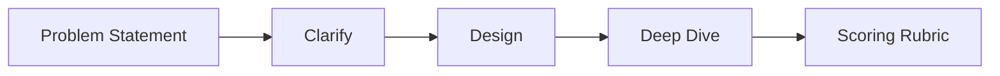

# Mock Interviews

Structured mock interviews with scoring rubrics, full session scripts, and preparation calendars for principal architect loops. Use these chapters with a peer interviewer or self-recording for calibration.

*Figure: Mock interview session structure with rubric evaluation.*

## Chapters

| Topic | Guide |
|-------|-------|
| Scoring rubrics | [Mock Interview Rubric](/docs/mock-interviews/mock-interview-rubric) |
| Distributed systems | [Distributed Systems Mock Interview](/docs/mock-interviews/distributed-systems-mock) |
| System design | [System Design Mock Interview](/docs/mock-interviews/system-design-mock) |
| Coding (if applicable) | [Coding Mock Interview](/docs/coding-preparation/coding-mock-interview) |

## Recommended Study Path

1. Read [Mock Interview Rubric](/docs/mock-interviews/mock-interview-rubric) before your first mock.
2. Alternate [System Design Mock](/docs/mock-interviews/system-design-mock) and [Distributed Systems Mock](/docs/mock-interviews/distributed-systems-mock) sessions weekly.
3. Score every session; track dimension trends in a spreadsheet.
4. Overlay [Company-Specific Preparation](/docs/company-specific-preparation/overview) guides in final two weeks.
5. Include behavioral mocks from [STAR Story Framework](/docs/behavioral-and-leadership/star-story-framework).

## Full Loop Simulation

A typical principal onsite (varies by company):

| Round | Mock chapter |
|-------|--------------|
| System design | [System Design Mock](/docs/mock-interviews/system-design-mock) |
| Distributed depth | [Distributed Systems Mock](/docs/mock-interviews/distributed-systems-mock) |
| Behavioral | [STAR Story Framework](/docs/behavioral-and-leadership/star-story-framework) |
| Architecture leadership | [Executive Communication](/docs/architecture-leadership/executive-communication) |
| Coding (if confirmed) | [Coding Mock Interview](/docs/coding-preparation/coding-mock-interview) |

## Related Domains

- [Coding Preparation](/docs/coding-preparation/overview)
- [Company-Specific Preparation](/docs/company-specific-preparation/overview)
- [Behavioral and Leadership](/docs/behavioral-and-leadership/overview)
- [System Design](/docs/system-design/overview)
