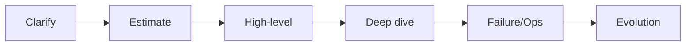
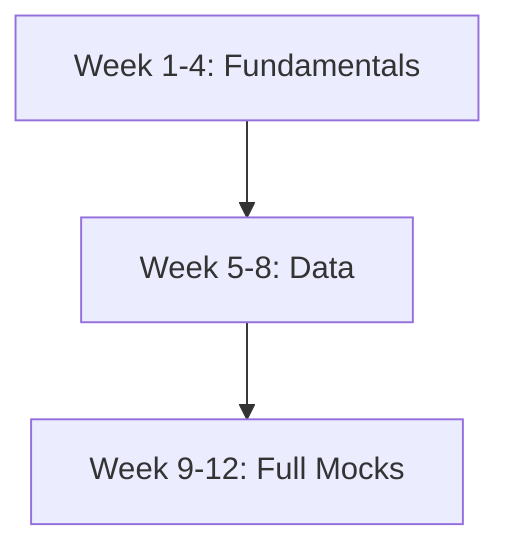

# System Design Mock Interview

## 1. Executive Summary

The **system design mock interview** is the centerpiece of principal architect hiring loops. A 45–60 minute session tests whether you can **clarify ambiguous requirements**, **architect scalable components**, **deep dive under pressure**, and **discuss failure, security, cost, and evolution**—not merely recite familiar diagrams.

This chapter provides **eight full mock prompts** with interviewer scripts, timing guides, capacity estimation worksheets, expected signals, follow-up chains, rubrics, weak vs. strong excerpts, and a **12-week preparation strategy** integrated with curriculum system design chapters.

## 2. Why This Topic Matters

System design performance correlates with **production architecture experience** but requires **interview-specific practice**:

- Time-boxing clarification vs. design.
- Explicit **non-goals** to manage scope.
- **Numbers** even when approximate.
- **Tradeoff narration** while drawing.

Unpracticed principals often over-engineer or under-clarify—both fail bars at Amazon, Google, Microsoft, Meta, and Adobe.

## 3. Problems Being Solved

| Interview failure mode | Mock remediation |
|------------------------|------------------|
| Premature deep dive | Timed requirement phase |
| Missing scale math | Estimation worksheet |
| No failure section | Interviewer injection script |
| Generic components | Curriculum-linked patterns |
| Weak close | Evolution roadmap template |

## 4. Assumptions and System Model

| Assumption | Implication |
|------------|-------------|
| **45–60 min** | MVP design + one deep dive |
| **Principal scope** | Multi-region, ops, cost mentioned |
| **Interactive** | Candidate checks assumptions |
| **No code** | Unless hybrid loop |
| **Public problem** | No employer confidential systems |

Methodology: [System Design Methodology](/docs/system-design/system-design-methodology).

## 5. Essential Terminology

| Term | Definition |
|------|------------|
| **Functional requirements** | Features system must provide |
| **Non-functional requirements** | Latency, availability, scale, consistency |
| **Back-of-envelope** | Order-of-magnitude estimate |
| **Hot path** | Critical latency-sensitive request flow |
| **Fan-out** | One write/read triggers many downstream ops |
| **Shard key** | Partition dimension |
| **Cache aside** | App-managed cache population |
| **Idempotency key** | Client token for safe retries |
| **Error budget** | Allowed unreliability per SLO period |

## 6. Core Mechanism

### 6.1 Phase timing (60-min mock)

| Phase | Min | Candidate actions |
|-------|-----|-------------------|
| Clarify | 8–10 | Users, scale, SLAs, non-goals |
| Estimate | 5–7 | QPS, storage, bandwidth |
| High-level | 10–12 | Components, APIs, data flow |
| Deep dive | 15–18 | Interviewer-chosen bottleneck |
| Failure & ops | 8–10 | Partitions, monitoring, rollout |
| Evolution | 5 | MVP → v2; open questions |



### 6.2 Capacity estimation worksheet

```
DAU × actions/user/day = daily ops
÷ 86400 × peak_factor = peak QPS

Object size × objects = storage
× replication_factor = raw storage

Peak QPS × payload = bandwidth
```

Document assumptions explicitly.

### 6.3 Interviewer script template

1. "Design [X]." (silent 30 sec)
2. "What questions do you have?" (answer briefly)
3. At 25 min: "Let's go deeper on [data model / fan-out / consistency]."
4. At 40 min: "Primary region is down—what happens?"
5. At 50 min: "How roll out v2 without downtime?"
6. Score with [Mock Interview Rubric](/docs/mock-interviews/mock-interview-rubric).

## 7. Step-by-Step Walkthrough

### Mock 1: URL Shortener

**Clarify:** Read-heavy? Custom aliases? Analytics? TTL?

**Scale example:** 100M DAU, 1 shorten / 10 DAU / day → 10M writes/day ≈ 115 write QPS; 100:1 read → 11.5K read QPS peak ×3 ≈ 35K.

**Components:** API, ID generator (base62), metadata DB, redirect cache, analytics queue (optional).

**Deep dive:** Cache stampede on viral link; consistent hashing for cache cluster.

**Curriculum:** [URL Shortener](/docs/system-design/url-shortener), [Distributed Cache Design](/docs/system-design/distributed-cache-design).

---

### Mock 2: News Feed

**Clarify:** Celebrity vs normal user ratio; ranking online vs offline?

**Key decision:** Hybrid fan-out (push normal, pull celebrities).

**Deep dive:** Hot celebrity post; fan-out on write cost.

**Curriculum:** [News Feed](/docs/system-design/news-feed).

---

### Mock 3: Chat Platform

**Clarify:** 1:1 vs groups; E2E encryption in scope?

**Key:** WebSocket gateways; partitioned message log; delivery ACK.

**Deep dive:** Group with 10K members online ratio.

**Curriculum:** [Chat Platform](/docs/system-design/chat-platform).

---

### Mock 4: Payment Platform

**Clarify:** Authorization vs settlement; idempotency requirements.

**Key:** Double-entry ledger; idempotent API; reconciliation.

**Deep dive:** Exactly-once money movement illusion via idempotency.

**Curriculum:** [Payment Platform](/docs/system-design/payment-platform).

---

### Mock 5: Notification Platform

**Clarify:** Push vs email vs SMS; priority tiers.

**Key:** Fan-out; device token registry; provider adapters.

**Deep dive:** Retry storms; rate limits per provider.

**Curriculum:** [Notification Platform](/docs/system-design/notification-platform).

---

### Mock 6: Distributed Rate Limiter

**Clarify:** Global vs per-tenant; burst tolerance.

**Key:** Token bucket; Redis cluster; local cache allowance.

**Curriculum:** [Distributed Rate Limiter](/docs/system-design/distributed-rate-limiter).

---

### Mock 7: Global File Transfer Platform

**Clarify:** Protocols; max file size; compliance.

**Key:** Chunked upload; state machine; metadata/blob split.

**Curriculum:** [Global File Transfer Platform](/docs/system-design/global-file-transfer-platform).

---

### Mock 8: Video Streaming

**Clarify:** Live vs VOD; adaptive bitrate.

**Key:** CDN; transcoding pipeline; origin shield.

**Curriculum:** [Video Streaming Platform](/docs/system-design/video-streaming-platform).

## 8. Invariants and Guarantees

Per prompt, state **safety** (no lost money/messages) vs **liveness** (system responds). Payment and chat differ sharply—clarify invariants early.

## 9. Failure Scenarios

Universal injections for any mock:

| Injection | Expected response |
|-----------|-------------------|
| DB primary down | Failover, RPO, read-only mode |
| Cache cluster lost | Degrade to DB; shed load |
| Dependency 10× latency | Timeout, circuit breaker |
| Bad deploy | Rollback, feature flag |
| Hot shard | Split, cache, queue |

Link: [Resilience Patterns](/docs/microservices/resilience-patterns).

## 10. Performance Characteristics

Principal candidates cite **p99** not average. Discuss:

- Tail latency amplification in RPC chains.
- Caching hit ratio assumptions.
- Async vs sync user experience.

## 11. Scalability Limits

Identify **first bottleneck**:

- Single leader writer.
- Fan-out write amplification.
- Index size on disk.
- Connection count to WebSocket tier.

Propose **next scaling lever** honestly.

## 12. Operational Considerations

Close every mock with:

- **SLIs:** availability, latency, error rate, saturation.
- **Dashboards** for golden signals.
- **Runbooks** for top 3 failures.
- **On-call** expectations realistic for design.

Link: [Observability Fundamentals](/docs/observability/observability-fundamentals), [SLO, SLI, and Error Budgets](/docs/reliability-and-resilience/slo-sli-error-budgets).

## 13. Security Considerations

Minimum principal coverage:

- Authentication and authorization model.
- Tenant isolation if multi-tenant.
- Encryption in transit and at rest.
- Abuse prevention (rate limits, WAF).

Link: [Security Architecture Fundamentals](/docs/security/security-architecture-fundamentals).

## 14. Cost Considerations

Estimate **unit economics**:

- Cost per million requests.
- Storage monthly at scale.
- Egress surprises.

Link: [Cloud Cost Optimization](/docs/cost-and-finops/cloud-cost-optimization).

## 15. Production Implementations

Compare to public architectures (high level):

- Historical fan-out discussions in public engineering blogs.
- Public talks on messaging at scale.
- Stripe idempotency API documentation.

Distinguish **anecdote** from **your design choice**.

## 16. Alternatives and Tradeoffs

Always present **two options**:

| Decision | Option A | Option B |
|----------|----------|----------|
| ID generation | DB auto-increment | Snowflake |
| Feed fan-out | Push | Pull |
| Consistency | Strong | Eventual + repair |
| Storage | SQL | NoSQL + cache |

State **decision criteria**.

## 17. Common Misconceptions

- **"More microservices = better"** — Operational cost.
- **"Kafka everywhere"** — Not a database.
- **"Skip estimates"** — Principal bar expects math.
- **"CDN solves streaming"** — Origin and encoding matter.

## 18. Principal Architect Perspective

Add **organizational** close:

- Team ownership boundaries ([Service Decomposition](/docs/microservices/service-decomposition-and-ddd)).
- **Phase 1 MVP** in 3 months vs full vision.
- **ADRs** for controversial choices.

## 19. Architecture Review Exercise

Redesign Mock 1 (URL shortener) for **enterprise multi-tenant** with custom domains and audit logs. 45-min timed session; self-score.

## 20. Whiteboard Explanation

Practice **5-min narrated walkthrough** of Mock 4 payment flow: client → API → ledger → async settlement → reconciliation job.

## 21. Interview Questions

### Q1: Design Instagram (subset: photo upload + feed)

**Expected signals:** Object storage; CDN; metadata DB; fan-out; ranking optional.

**Follow-ups:** Celebrity problem; delete photo propagation.

**Scoring rubric:**

| Level | Criteria |
|-------|----------|
| Excellent | Estimates, fan-out hybrid, failure, security |
| Good | Solid components, some depth |
| Adequate | CRUD without scale |
| Weak | No storage or CDN strategy |

---

### Q2: How handle viral event 100× traffic spike?

**Expected signals:** Pre-warming cache; autoscale; queue absorption; degrade non-critical features; error budget context.

---

### Q3: Schema migration without downtime

**Expected signals:** Expand-contract; dual write; backfill; feature flags.

Link: [API Versioning and Evolution](/docs/api-and-integration-architecture/api-versioning-and-evolution).

---

### Q4: Multi-region active-active for read-heavy API

**Expected signals:** Replication lag; conflict resolution; routing; data residency.

Link: [Multi-Region Architecture](/docs/cloud-architecture/multi-region-architecture).

---

### Q5: Why not single PostgreSQL?

**Expected signals:** Honest—maybe sufficient at MVP; scale triggers; ops cost; specific bottleneck.

## 22. Interview Follow-Ups

Prepare for:

- "Storage size in 3 years?"
- "Weakest component?"
- "What did you sacrifice?"
- "How test this?"
- "Security threat model top 3?"

## 23. Strong Answer Example (feed fan-out excerpt)

> "For users with fewer than 5K friends we fan-out on write to per-user timelines stored in Cassandra partitioned by user_id. For celebrities above 5M followers we fan-out on read merging post list with follow graph cache. We accept eventual consistency for feed with SLA p99 staleness under 30s measured by checkpoint lag. On celebrity post we write once to post shard and invalidate follower feed caches asynchronously to avoid write amplification storm."

## 24. Weak Answer Example

> "Use MySQL and Redis. Scale horizontally."

No numbers, no fan-out strategy, no failure modes.

## 25. Hands-On Exercise

1. Select Mock 1–8 not yet studied in curriculum chapter.
2. Run 60-min timed session with peer.
3. Fill estimation worksheet post-hoc.
4. Score rubric; gap → curriculum chapter.
5. Redo same mock in 2 weeks.

## 26. Knowledge Check

1. Phases of 60-min system design mock?
2. How derive peak QPS from DAU?
3. Push vs pull fan-out tradeoff?
4. Three SLIs for any API?
5. What belongs in evolution phase?

## 27. Flashcards

| Front | Back |
|-------|------|
| Clarify phase time | 8–10 min |
| Fan-out hybrid | Push normal, pull celebrity |
| Idempotency | Safe client retries |
| Deep dive trigger | Interviewer picks bottleneck |
| Principal close | Org, cost, phased rollout |

## 28. Cheat Sheet

- **Clarify → Estimate → Design → Deep dive → Failures → Evolution**
- State **non-goals**
- One **deep dive** ready
- **p99** and **availability** targets
- Link patterns to curriculum chapters

## 29. Related Concepts

- [System Design Methodology](/docs/system-design/system-design-methodology)
- [Distributed Systems Mock](/docs/mock-interviews/distributed-systems-mock)
- [Mock Interview Rubric](/docs/mock-interviews/mock-interview-rubric)
- [Company-Specific Preparation](/docs/company-specific-preparation/overview)

## Mock 9: Distributed Cache (curriculum-aligned)

**Clarify:** Read/write ratio; TTL policy; max value size; multi-tenant?

**Key:** Consistent hashing; cache-aside; stampede protection; replication for HA.

**Deep dive:** Hot key mitigation.

**Curriculum:** [Distributed Cache Design](/docs/system-design/distributed-cache-design).

---

## Mock 10: URL Shortener at principal bar (hard mode)

Add constraints:

- Custom domains per enterprise tenant.
- Audit log immutable 7 years.
- Geo-routing for compliance.
- 99.99% redirect availability.

Forces security + multi-region + estimation refresh.

## Interviewer Difficulty Knobs

Adjust mock difficulty dynamically:

| Knob | Easy | Hard |
|------|------|------|
| Scale | Given numbers | Candidate estimates |
| Failure | One injection | Chained failures |
| Consistency | Eventual OK | Strong required |
| Scope | Single region | Global + residency |
| Time | 60 min | 45 min |

Principal practice: use **hard** column by week 6+.

## Post-Mock Written Retrospective Template

```markdown
## Mock: [prompt] — [date]
### Scores
- Requirements: /4
- Depth: /4
- ...
### What surprised me
### One diagram I'd redraw
### Homework chapter
### Retry date
```

Store retrospectives; review before onsite.

## Panel Combo Scripts

### Script A: Design + Behavioral (90 min)

- 0–55: System design Mock 4 Payment
- 55–75: Behavioral "incident with financial impact"
- 75–90: "How design choices affected that incident story"

Tests integration of technical and leadership narrative.

### Script B: Design + Distributed (120 min)

- 0–60: System design Mock 3 Chat
- 60–90: Distributed Session E exactly-once for chat delivery
- 90–120: Debrief both rubrics

## Estimation Reference Numbers (Memorize Orders of Magnitude)

| Constant | Value | Use |
|----------|-------|-----|
| Seconds per day | ~86,400 | QPS from daily ops |
| Peak factor | 2–5× | Traffic spikes |
| SSD random read | ~0.1 ms | Latency floor |
| Cross-region RTT | 50–150 ms | Multi-region design |
| IPv4 header + TCP | ~40 bytes | Bandwidth overhead |

Label as rough when used in interview.

## Non-Functional Requirements Checklist

For every mock, explicitly state targets:

- [ ] Availability (e.g., 99.9%)
- [ ] Latency p99 (e.g., 200 ms read)
- [ ] Durability (e.g., 11 nines object)
- [ ] Consistency (strong/eventual/session)
- [ ] Scale (DAU, QPS, storage 5-year)
- [ ] Security (auth model stated)
- [ ] Cost sensitivity (high/medium/low)

## Appendix: Full Mock Walkthrough — Notification Platform (60 min)

**Minutes 0–8 — Clarify:** 50M devices; 10M notifications/min peak; push/email/SMS; priority tiers; at-least-once OK with idempotent handlers.

**Minutes 8–14 — Estimate:** 10M/60 ≈ 167K/sec peak ×3 burst ≈ 500K/sec internal fan-out events if multi-channel.

**Minutes 14–24 — High-level:** API → priority queues → router workers → provider adapters (FCM, SendGrid, Twilio-class) → delivery receipts → analytics.

**Minutes 24–40 — Deep dive:** Device token registry sharded by user_id; invalid token cleanup on provider bounce; retry with exponential backoff; DLQ for poison templates.

**Minutes 40–50 — Failure:** Provider outage—degrade SMS only if push fails? Policy decision explicit. Queue backlog age alert.

**Minutes 50–60 — Evolution:** Phase 1 push only; add email; geo-routing; user preference center.

Self-score immediately with rubric.

## Appendix: API Design Checklist (System Design Mocks)

- [ ] REST resources named as nouns
- [ ] Idempotency-Key header on mutating ops
- [ ] Pagination cursor-based for large lists
- [ ] Rate limit headers (Retry-After)
- [ ] Version prefix /v1/
- [ ] Error model consistent (problem+json style)

Link: [REST, gRPC, and GraphQL](/docs/api-and-integration-architecture/rest-grpc-and-graphql).

## 30. References

- Kleppmann, *DDIA*.
- Public system design interview frameworks (cross-check with curriculum).
- Company engineering blogs (verify per article).
- Curriculum system design chapters listed in Section 7.

## Preparation Strategy (12 Weeks)

| Week | Curriculum read | Mock prompt |
|------|-----------------|-------------|
| 1 | [Methodology](/docs/system-design/system-design-methodology) | Mock 1 URL |
| 2 | [Distributed Cache](/docs/system-design/distributed-cache-design) | Mock 1 repeat |
| 3 | [News Feed](/docs/system-design/news-feed) | Mock 2 |
| 4 | [Chat Platform](/docs/system-design/chat-platform) | Mock 3 |
| 5 | [Payment Platform](/docs/system-design/payment-platform) | Mock 4 |
| 6 | [Notification Platform](/docs/system-design/notification-platform) | Mock 5 |
| 7 | [Rate Limiter](/docs/system-design/distributed-rate-limiter) | Mock 6 |
| 8 | [File Transfer](/docs/system-design/global-file-transfer-platform) | Mock 7 |
| 9 | [Video Streaming](/docs/system-design/video-streaming-platform) | Mock 8 |
| 10 | [Multi-Region](/docs/cloud-architecture/multi-region-architecture) | Mock 4 + region failover |
| 11 | Full loop sim (4 rounds) | Mixed |
| 12 | Light review | Weakest mock repeat |

**Weekly rhythm:**

- 2× 60-min mocks (different prompts).
- 1× curriculum chapter deep read.
- 1× behavioral mock ([STAR Story Framework](/docs/behavioral-and-leadership/star-story-framework)).
- Score all sessions with [Mock Interview Rubric](/docs/mock-interviews/mock-interview-rubric).

**Company overlay:** After week 8, add one company guide session ([Amazon](/docs/company-specific-preparation/amazon-aws), [Google](/docs/company-specific-preparation/google), etc.) tailoring vocabulary and emphasis.

## Diagram


*Figure: 12-week system design mock interview calendar.*
