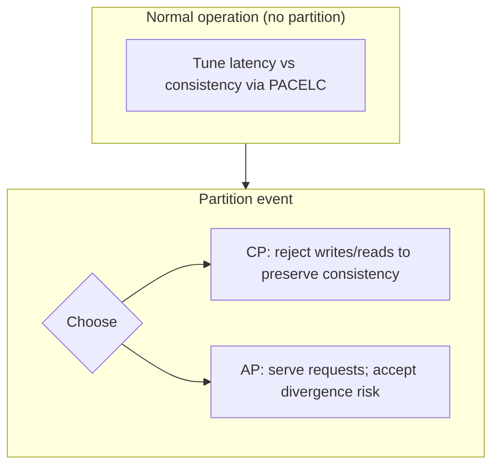

# Decision Frameworks

Structured approaches for architecture decisions at principal level. Use these to **make tradeoffs explicit**, align stakeholders, and document rationale in ADRs.

**Related:** [Architecture Decision Records](/docs/architecture-leadership/architecture-decision-records), [Glossary](/docs/reference/glossary), [CAP Theorem](/docs/consistency/cap-theorem), [PACELC](/docs/consistency/pacelc)

---

## 1. When to Use a Framework

| Situation | Framework |
|-----------|-----------|
| Choosing consistency vs availability | CAP / PACELC |
| Custom software vs vendor | Build vs buy |
| Picking databases, queues, clouds | Technology selection |
| Any significant fork | ADR + weighted criteria matrix |

Avoid framework theater: a one-page ADR beats a 40-slide architecture review with no decision.

---

## 2. CAP Theorem

### 2.1 Problem

During a **network partition**, can the system remain **available** (respond to all requests) and **linearizable** (as defined in Gilbert & Lynch, 2002) for all operations?

### 2.2 Mechanism

CAP is not "pick two of three forever." It states: **if a partition occurs**, you cannot have both strong consistency (linearizability in the CAP formalization) and full availability on both sides of the partition.



### 2.3 Decision criteria

| Choose CP-leaning | Choose AP-leaning |
|-------------------|-------------------|
| Financial ledger, inventory reservation | Social feed, analytics, config cache |
| Cannot tolerate conflicting writes | Business tolerates merge/conflict resolution |
| Clients accept unavailability during partition | Clients must always get a response |
| Strong audit requirements | High write availability across regions |

### 2.4 Common mistakes

| Mistake | Correction |
|---------|------------|
| "We are CA" | Partitions happen; clarify behavior **when** they happen |
| CAP applies to whole system | Different subsystems make different choices |
| CAP replaces consistency model discussion | Name specific guarantee (linearizable, causal, eventual) |

### 2.5 Interview relevance

Principal candidates explain **client-visible behavior** during partition, not slogans. Link to [Partial Failure](/docs/distributed-systems-foundations/partial-failure).

**References:** Gilbert & Lynch (2002); Kleppmann critique of CAP simplification in DDIA.

---

## 3. PACELC Extension

Daniel Abadi (2012): **If P**artition, choose **A**vailability or **C**onsistency; **E**lse (normal operation), choose **L**atency or **C**onsistency.

### 3.1 Why PACELC matters

Most production hours are **not** under partition. Teams still choose between:

- **Low latency, possibly stale reads** (Dynamo-style tunable reads)
- **Higher coordination cost for fresher reads** (Spanner-style commits)

### 3.2 Decision matrix

| Workload | P: partition | EL: normal operation |
|----------|--------------|----------------------|
| Metadata / coordination (etcd) | CP | LC (consistency over latency) |
| Product catalog cache | AP | EL (low latency, eventual) |
| User session store | CP or AP depending on stickiness | Often EL with TTL |
| Cross-region bank transfer | CP | LC |

### 3.3 Walkthrough example

**Feature flag service** evaluated on every page load:

1. **Partition:** Serve last-known flags from edge cache (AP) vs fail closed (CP). Product choice: AP with version numbers; risky flags fail closed via policy.
2. **Else:** Edge cache (EL) for sub-ms latency; control plane strongly consistent (LC).

Document per-component PACELC in ADR, not one label for entire platform.

---

## 4. Build vs Buy

### 4.1 Problem

Should the organization implement a capability in-house or adopt managed/open-source/vendor solution?

### 4.2 Decision criteria matrix

| Criterion | Weight (example) | Build signal | Buy signal |
|-----------|------------------|--------------|------------|
| **Strategic differentiation** | High | Core competitive advantage | Commodity capability |
| **Time to market** | High | Team ready; small scope | Urgent delivery |
| **Total cost of ownership** | High | 3-year TCO lower incl. on-call | Vendor scale economies |
| **Operational burden** | High | Dedicated platform team | Small team; limited SRE |
| **Risk & compliance** | Medium | Unique requirements | Vendor certifications (SOC2, HIPAA) |
| **Exit / portability** | Medium | Accept lock-in for speed | Need multi-cloud abstraction |
| **Team expertise** | Medium | Deep domain skills | Skill gap in protocol/ops |

### 4.3 TCO components (do not ignore)

- Engineering headcount (build + maintain)
- On-call and incident cost
- Infrastructure and license fees
- Migration and training
- Opportunity cost (what else team cannot build)

### 4.4 When build is justified

- Capability is **differentiator** (e.g., proprietary ranking, custom hardware path)
- No vendor meets **latency, compliance, or scale** constraints
- Organization has **sustained** platform team with Jepsen-level verification for coordination systems

### 4.5 When buy is justified

- **Undifferentiated heavy lifting** (email delivery, payments rail, identity broker)
- **Coordination primitives** (etcd, Consul, ZooKeeper)—subtle bugs are expensive
- Team must ship product in **&lt; 6 months** without platform staffing

### 4.6 Hybrid pattern

**Buy the base, build the wedge:** managed Kafka + custom stream processing; managed Postgres + domain schema and migration tooling.

### 4.7 ADR template snippet

```text
Decision: Adopt managed DynamoDB for session store
Alternatives: Self-hosted Cassandra, Redis Cluster
Criteria scores: [table]
Risks accepted: vendor lock-in, per-request cost at scale
Revisit trigger: monthly cost > $X or p99 > Y ms for 2 quarters
```

Link: [Architecture Decision Records](/docs/architecture-leadership/architecture-decision-records).

---

## 5. Technology Selection Framework

### 5.1 Process


### 5.2 Requirement categories

| Category | Example questions |
|----------|-------------------|
| **Functional** | Query patterns, throughput, data model |
| **Non-functional** | p99 latency, RPO/RTO, multi-region |
| **Consistency** | Linearizable? Causal? Eventual? |
| **Operational** | Managed vs self-hosted, upgrade path |
| **Security** | Encryption, IAM, audit, data residency |
| **Cost** | Unit economics at projected scale |
| **Ecosystem** | Client libraries, hiring pool, K8s operators |
| **Migration** | Dual-write period, rollback |

### 5.3 Weighted scorecard (example)

| Dimension | Weight | Option A | Option B | Option C |
|-----------|--------|----------|----------|----------|
| Meets consistency need | 25% | 5 | 3 | 4 |
| Operability | 20% | 3 | 5 | 4 |
| Performance at scale | 20% | 4 | 4 | 3 |
| Cost at 3-year projection | 15% | 3 | 4 | 5 |
| Team familiarity | 10% | 5 | 2 | 3 |
| Vendor risk / portability | 10% | 2 | 4 | 4 |

Score 1–5 per cell; multiply by weight; document assumptions behind each score.

### 5.4 Proof-of-concept scope

POC must test **riskiest assumption**, not happy path:

- Consensus: partition behavior, failover time, write latency at target fsync
- Database: hot key, cross-shard transaction need, replication lag under load
- Queue: consumer lag recovery, reordering, poison messages

### 5.5 Anti-patterns

| Anti-pattern | Why it fails |
|--------------|--------------|
| Resume-driven development | Picks tech for career, not fit |
| Benchmark marketing only | Vendor numbers without your workload |
| Single-vendor default | Misses multi-cloud or open requirements |
| Analysis paralysis | No time-boxed POC |
| No sunset criteria | Stuck on wrong choice |

---

## 6. Consistency Model Selection

Quick decision tree (complements PACELC):

1. **Must all clients see writes in real-time order on one object?** → Linearizability (cost: coordination).
2. **Must users see own writes and monotonic reads?** → Session guarantees on eventually consistent store.
3. **Must causal chains (comments on post) be ordered?** → Causal consistency.
4. **Can merge conflicts asynchronously?** → Eventual + CRDT/version vectors.

Link: [Consistency](/docs/consistency/overview).

---

## 7. Replication Topology Selection

| Pattern | When | Risk |
|---------|------|------|
| Single-leader sync | Low RPO, acceptable write latency | Leader failure, failover |
| Single-leader async | Read scale, tolerate lag | Stale reads, data loss on crash |
| Multi-leader | Multi-region write latency | Conflict resolution required |
| Leaderless quorum | High write availability | Complex read repair, SLAs |

---

## 8. Messaging Semantics Selection

| Need | Pattern |
|------|---------|
| Fire-and-forget metrics | At-most-once |
| Default event processing | At-least-once + idempotent consumer |
| Financial side effects | Outbox + idempotent sink; avoid claiming true exactly-once |
| Ordering per entity | Partition key = entity id |

Link: [Message Delivery Semantics](/docs/messaging-and-streaming/message-delivery-semantics).

---

## 9. Multi-Region Strategy

| Strategy | RPO | Complexity | Use when |
|----------|-----|------------|----------|
| Active-passive | Low with sync | Lower | Strict consistency, DR focus |
| Active-active eventual | Non-zero | High | Global latency, conflict tolerance |
| Cell-based architecture | Per-cell | Medium | Blast radius containment at scale |

Link: [Multi-Region Architecture](/docs/cloud-architecture/multi-region-architecture).

---

## 10. Documenting Decisions

Every framework output should land in an ADR with:

1. **Context** — constraints, stakeholders, SLOs
2. **Decision** — one clear choice
3. **Consequences** — positive, negative, risks accepted
4. **Alternatives considered** — why rejected
5. **Revisit triggers** — metrics or dates

Principal architects optimize for **decision quality and reversibility**, not being right forever.

---

## References

- Seth Gilbert & Nancy Lynch, CAP (2002) — `references/papers.yaml#gilbert-lynch-2002-cap`
- Daniel Abadi, PACELC (2012) — `references/papers.yaml#abadi-2012-pacelc`
- Martin Kleppmann, *Designing Data-Intensive Applications* (2017)
- Michael Nygard, *Release It!* — stability patterns
- Mark Richards & Neal Ford, *Fundamentals of Software Architecture* — architecture characteristics

See [Reading List](/docs/reference/reading-list).
