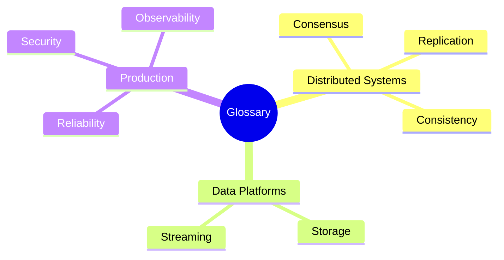

# Glossary

Key terms for distributed systems, data platforms, and principal-level architecture. Definitions emphasize **decision criteria** and **failure behavior**, not slogans.

*Figure: Glossary term categories mapped to curriculum domains.*

**Related:** [Decision Frameworks](/docs/reference/decision-frameworks), [Reading List](/docs/reference/reading-list), curriculum chapters linked inline.

---

## A

| Term | Definition |
|------|------------|
| **ACID** | Atomicity, Consistency, Isolation, Durability—transaction properties for a single database. *Distributed* systems often relax or reinterpret these (see BASE, sagas). |
| **ADR (Architecture Decision Record)** | Short document capturing context, decision, consequences, and alternatives for a significant architecture choice. |
| **At-least-once delivery** | Message may be delivered one or more times; consumers must be idempotent or deduplicate. |
| **At-most-once delivery** | Message delivered zero or one time; may be lost, never duplicated. |
| **Availability** | System remains operational and responds to requests. In CAP, formalized as every request receiving a non-error response (under a defined model). |
| **Anti-entropy** | Background process reconciling divergent replicas (e.g., Merkle trees, read repair). |

## B

| Term | Definition |
|------|------------|
| **Backpressure** | Mechanism slowing upstream producers when downstream cannot keep pace; prevents unbounded buffering and cascading failure. |
| **BASE** | Basically Available, Soft state, Eventually consistent—design philosophy contrasting with strict ACID in large-scale systems. |
| **Blast radius** | Scope of impact when a component, AZ, or team fails; architecture goal is to contain it. |
| **Bulkhead** | Isolation pattern limiting resource sharing so failure in one pool does not exhaust all capacity (named after ship compartments). |
| **Byzantine fault** | Node may behave arbitrarily or maliciously; requires stronger protocols (e.g., BFT) and typically `3f+1` replicas for `f` faults. |

## C

| Term | Definition |
|------|------------|
| **CAP theorem** | In presence of a network **partition**, a distributed system cannot simultaneously provide **linearizability** (as defined in the CAP paper) and **availability** (every node responding). See [CAP Theorem](/docs/consistency/cap-theorem). |
| **CAS (Compare-And-Swap)** | Atomic instruction testing a value and updating if unchanged; basis for lock-free algorithms and optimistic concurrency. |
| **CDC (Change Data Capture)** | Streaming row-level changes from a database log for replication, analytics, or outbox relay. |
| **Circuit breaker** | Pattern stopping calls to a failing dependency after threshold, allowing recovery time; states: closed, open, half-open. |
| **Causal consistency** | Operations causally related are seen in same order by all nodes; concurrent operations may be seen differently. |
| **Commit index** | In Raft, highest log index known to be committed on a majority; entries at or below are durable. |
| **Compaction (LSM)** | Merging SSTable files in log-structured merge trees; trades write amplification for read efficiency. |
| **Consensus** | Agreement among nodes on a single value or ordered log despite failures. See [Consensus](/docs/consensus/overview). |
| **Consistent hashing** | Hash ring mapping keys to nodes; adding/removing nodes moves only adjacent key ranges. |
| **CRDT** | Conflict-free Replicated Data Type—data structure merging replicas without coordination if updates commute or converge. |
| **CQRS** | Command Query Responsibility Segregation—separate write and read models, often with async projection. |

## D

| Term | Definition |
|------|------------|
| **Dead letter queue (DLQ)** | Queue holding messages that failed processing after retries; requires operational triage. |
| **Distributed lease** | Time-bounded grant of authority (e.g., leadership); must combine with fencing at the protected resource. |
| **Dual write problem** | Updating database and external system separately without atomicity; solved by transactional outbox or saga. |
| **Durability** | Committed data survives process crash; typically via write-ahead log and replication. |

## E

| Term | Definition |
|------|------------|
| **Epoch** | Monotonic generation number (e.g., ZAB, leader era) invalidating prior leader state after failover. |
| **Error budget** | Allowed unreliability derived from SLO; when exhausted, prioritize stability over feature velocity. |
| **Eventual consistency** | Replicas converge if no new updates; no bound on staleness without additional guarantees. |
| **Exactly-once semantics** | End-to-end illusion combining idempotent processing with deduplication; rare across system boundaries. |
| **External consistency** | Spanner term: transactions appear in some serial order consistent with real-time ordering of transactions. |

## F

| Term | Definition |
|------|------------|
| **Failure detector** | Module estimating whether a process has crashed; unreliable in theory, practical with timeouts (see φ-accrual). |
| **Fan-out** | One event triggering many downstream deliveries; bottleneck in feeds and notifications. |
| **Fencing token** | Monotonic token from lock service; storage rejects writes with stale token. See [Fencing Tokens](/docs/consensus/fencing-tokens). |
| **FLP impossibility** | No deterministic consensus in fully asynchronous model with even one crash failure. |
| **FLP / partial synchrony** | Practical systems assume eventual bounds on message delay (partial synchrony) to regain liveness. |

## G

| Term | Definition |
|------|------------|
| **Gossip protocol** | Epidemic dissemination of membership or state; eventually consistent, scalable. |
| **Gray failure** | Degraded behavior (slow, flaky) not detected as hard crash; especially dangerous at scale. |
| **Golden path** | Paved, supported default for teams; faster than undifferentiated DIY if done well. |

## H

| Term | Definition |
|------|------------|
| **Happens-before** | Partial order relation: if A happens-before B, all nodes observe A before B. |
| **Heartbeat** | Periodic signal proving liveness; missed heartbeats trigger suspicion or failover. |
| **Hot key / hot partition** | Disproportionate traffic to one shard; causes skew and tail latency. |
| **Hybrid Logical Clock (HLC)** | Combines physical and logical time for ordering with bounded drift; used in CockroachDB, MongoDB. |

## I

| Term | Definition |
|------|------------|
| **Idempotency key** | Client-supplied key ensuring duplicate requests produce same effect once. |
| **Invariant** | Property that must always hold (safety); e.g., no two leaders in same term. |
| **Isolation (transaction)** | Degree to which concurrent transactions interfere; levels include read committed, snapshot, serializable. |

## J

| Term | Definition |
|------|------------|
| **Joint consensus** | Raft membership change technique using overlapping majorities to avoid two independent quorums. |
| **Jepsen** | Framework and historical analyses testing distributed databases under partition and failure. |

## K

| Term | Definition |
|------|------------|
| **KV cache** | Key-value cache layer (Redis, Memcached) reducing database load; consistency with DB is application concern. |

## L

| Term | Definition |
|------|------------|
| **Lamport clock** | Logical counter incremented per event; provides total order but not concurrency detection. |
| **Leader election** | Process selecting coordinator; must avoid split brain via quorum or fencing. |
| **Linearizability** | Strongest single-object consistency: operations appear atomic in real-time order. |
| **Liveness** | Something good eventually happens (progress, termination); may be sacrificed during partitions. |
| **Load shedding** | Dropping low-priority work under overload to protect core SLO. |
| **Log compaction** | Truncating replicated log after snapshot; required for unbounded operation. |

## M

| Term | Definition |
|------|------------|
| **Majority quorum** | More than half of replicas; intersection property enables consistency arguments. |
| **Membership change** | Adding/removing voters in consensus cluster; dangerous without joint consensus. |
| **Monotonic reads** | Session guarantee: reads never return older data than previously read in session. |
| **MVCC** | Multi-Version Concurrency Control—readers see snapshot without blocking writers. |
| **Multi-Paxos** | Paxos variant with stable leader amortizing prepare phase over log entries. |

## N

| Term | Definition |
|------|------------|
| **NTP** | Network Time Protocol—synchronizes clocks; subject to skew and jumps; insufficient alone for ordering. |
| **Noisy neighbor** | Tenant or workload consuming shared resources, degrading others in multi-tenant systems. |

## O

| Term | Definition |
|------|------------|
| **Observability** | Ability to infer internal state from outputs (metrics, logs, traces). |
| **Outbox pattern** | Transactional table of events relayed to message broker; avoids dual writes. |
| **Overselling** | Admitting more work than capacity; requires admission control or queueing discipline. |

## P

| Term | Definition |
|------|------------|
| **PACELC** | If **P**artition: choose **A** or **C**; **E**lse: choose **L**atency or **C**onsistency. See [PACELC](/docs/consistency/pacelc). |
| **Paxos** | Family of consensus protocols using ballots and majority quorums. |
| **Partial failure** | Subset of components fail while others continue—the defining challenge of distributed systems. |
| **Partition tolerance** | System continues despite network partitions (message loss/delay between nodes). |
| **Phi-accrual failure detector** | Adaptive suspicion based on heartbeat inter-arrival distribution. |
| **Poison message** | Message causing repeated consumer failure; routed to DLQ after retry limit. |
| **Primary-secondary replication** | Single leader accepts writes; replicas follow log; failover risk without fencing. |
| **Paxos / Raft term** | Logical epoch in Raft; new term implies new election. |

## Q

| Term | Definition |
|------|------------|
| **Quorum** | Minimum replicas participating in read/write; `R + W > N` prevents stale reads in single-writer models. |
| **QUIC** | UDP-based transport with multiplexed streams and integrated TLS; used by HTTP/3. |

## R

| Term | Definition |
|------|------------|
| **Raft** | Understandable consensus algorithm: leader election, log replication, safety. |
| **RAG** | Retrieval-Augmented Generation—LLM pipeline fetching context from vector store. |
| **Read-your-writes** | Session guarantee: client sees own prior writes. |
| **Replication lag** | Delay between primary update and replica visibility; drives staleness UX. |
| **Retry storm** | Amplified load from synchronized retries; mitigated by jitter and budgets. |
| **RPO** | Recovery Point Objective—max acceptable data loss window. |
| **RTO** | Recovery Time Objective—max acceptable downtime. |
| **Runbook** | Operational procedure for incident or maintenance; architecture should enable automation. |

## S

| Term | Definition |
|------|------------|
| **Safety** | Nothing bad happens (no invalid states, no split-brain commits). |
| **Saga** | Sequence of local transactions with compensating actions; alternative to 2PC across services. |
| **Sequential consistency** | All operations appear in some total order consistent with each process program order. |
| **Service mesh** | Infrastructure layer for mTLS, routing, retries between services (sidecar or eBPF). |
| **Sharding** | Horizontal partition of data by key range or hash. |
| **SLI** | Service Level Indicator—measurable aspect of service (availability, latency). |
| **SLO** | Service Level Objective—target for SLI over window; drives error budgets. |
| **SLA** | Service Level Agreement—contractual commitment, often stricter business framing of SLO. |
| **Split brain** | Two nodes believing they are primary; risks divergent writes without fencing. |
| **State machine replication** | Replicated log of commands applied in order to deterministic state machines. |
| **Sticky session** | Routing client to same backend for session guarantees. |
| **Strong eventual consistency** | Replicas converge; concurrent updates commute via CRDTs or merge rules. |

## T

| Term | Definition |
|------|------------|
| **Tail latency** | High-percentile latency (p99, p999); dominates user experience at scale. |
| **Thundering herd** | Many clients simultaneously miss cache and hit backend. |
| **Transactional outbox** | See **Outbox pattern**. |
| **TrueTime** | Google Spanner API exposing clock uncertainty interval; enables external consistency waits. |
| **Two-phase commit (2PC)** | Atomic commit protocol; blocking and coordinator SPOF concerns in distributed deployments. |
| **TTL** | Time-to-live; expiration for cache entries, DNS, leases. |

## U

| Term | Definition |
|------|------------|
| **Unbounded queue** | Queue without backpressure; hides overload until OOM or catastrophic latency. |

## V

| Term | Definition |
|------|------------|
| **Vector clock** | Per-node counters detecting concurrent events; enables conflict detection. |
| **Version vector** | Vector clock variant per replica for detecting write conflicts in Dynamo-style systems. |
| **View change** | Transition to new primary in Viewstamped Replication or similar protocols. |

## W

| Term | Definition |
|------|------------|
| **WAL (Write-Ahead Log)** | Append-only log persisted before applying state changes; basis for durability and CDC. |
| **Witness replica** | Votes in quorum without storing full data; reduces storage cost, changes fault math. |
| **Write amplification** | Bytes written to storage per logical byte written; critical for SSD/LSM tuning. |

## Z

| Term | Definition |
|------|------------|
| **ZAB (ZooKeeper Atomic Broadcast)** | Total-order broadcast protocol underlying ZooKeeper; epoch-based leader recovery. |
| **Zero trust** | Security model verifying every request regardless of network location; identity-centric. |

---

## Cross-Reference Index

| Concept cluster | Curriculum chapters |
|-----------------|---------------------|
| Consistency models | [Consistency](/docs/consistency/overview) |
| Consensus | [Consensus](/docs/consensus/overview) |
| Replication | [Replication](/docs/replication/overview) |
| Transactions | [Transactions](/docs/transactions/overview) |
| Observability | [Observability](/docs/observability/overview) |
| System design | [System Design](/docs/system-design/overview) |

**Term count:** 110+ entries (including acronyms expanded inline).

---

## References

- Martin Kleppmann, *Designing Data-Intensive Applications* (2017)
- Maurice Herlihy & Jeannette Wing, linearizability (1990)
- Daniel Abadi, PACELC (2012)
- Leslie Lamport, time clocks (1978)

See [Reading List](/docs/reference/reading-list) for full bibliography.
