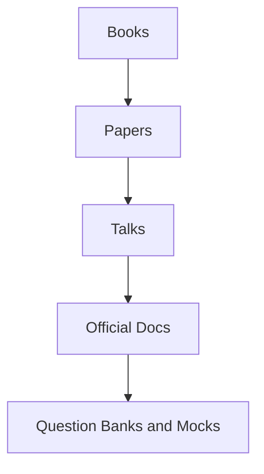

# Reading List

Authoritative books, papers, and talks organized by domain for principal architect preparation. Prefer **primary sources** (papers, official docs, engineering blogs from system authors).

*Figure: Reading progression from foundational books to practice.*

Canonical machine-readable bibliographies: `references/books.yaml`, `references/papers.yaml`, `references/talks.yaml`, `references/documentation.yaml`.

**Study strategy:** Read for mechanism and tradeoffs, not memorization. Pair each paper with a curriculum chapter and one interview question from `interview/question-bank/`.

---

## How to Use This List

| Phase | Focus |
|-------|-------|
| **Foundation** | DDIA + TCP/IP + OS chapters; Lamport clocks |
| **Distributed core** | CAP, PACELC, FLP, Raft, Dynamo, Spanner |
| **Production** | SRE books, observability, failure postmortems |
| **Interview sprint** | Question banks + mocks + weak-area papers |

---

## Books

### Distributed Systems & Data

| Title | Authors | Why read | Curriculum link |
|-------|---------|----------|-----------------|
| *Designing Data-Intensive Applications* | Martin Kleppmann | Modern foundation: replication, consistency, streaming | [Distributed Databases](/docs/distributed-databases/overview) |
| *Database Internals* | Alex Petrov | Storage engines, B-trees, LSM, distributed DB mechanics | [Storage Engines](/docs/storage-engines/overview) |
| *Understanding Distributed Systems* (2nd ed.) | Roberto Vitillo | Accessible theory + practical patterns | [Distributed Systems Foundations](/docs/distributed-systems-foundations/overview) |
| *Distributed Systems* (3rd ed.) | Maarten van Steen & Andrew Tanenbaum | Academic breadth: models, algorithms | [Consensus](/docs/consensus/overview) |

### Concurrency & Correctness

| Title | Authors | Why read | Curriculum link |
|-------|---------|----------|-----------------|
| *The Art of Multiprocessor Programming* | Herlihy & Shavit | Linearizability, concurrent objects | [Consistency](/docs/consistency/linearizability) |
| *Concurrent Programming on Windows* / patterns literature | Various | Practical concurrency (language-specific supplements) | [Memory Ordering](/docs/computer-architecture/memory-ordering-and-concurrency) |

### Architecture & Leadership

| Title | Authors | Why read | Curriculum link |
|-------|---------|----------|-----------------|
| *Fundamentals of Software Architecture* | Richards & Ford | Architecture characteristics, modularity | [Architecture Leadership](/docs/architecture-leadership/overview) |
| *Software Architecture: The Hard Parts* | Richards, Ford, Dehghani, et al. | Distributed architecture tradeoffs | [Microservices](/docs/microservices/overview) |
| *The Staff Engineer's Path* | Tanya Reilly | Scope, influence, technical strategy | [Technical Strategy](/docs/architecture-leadership/technical-strategy-and-roadmaps) |
| *Team Topologies* | Skelton & Pais | Conway's law, platform teams | [Architecture Governance](/docs/architecture-leadership/architecture-governance) |

### Reliability & Operations

| Title | Authors | Why read | Curriculum link |
|-------|---------|----------|-----------------|
| *Site Reliability Engineering* | Google SRE | SLOs, error budgets, toil | [SLO, SLI, Error Budgets](/docs/reliability-and-resilience/slo-sli-error-budgets) |
| *The Site Reliability Workbook* | Google SRE | Implementing SRE practices | [Reliability](/docs/reliability-and-resilience/overview) |
| *Release It!* (2nd ed.) | Michael Nygard | Stability patterns, bulkheads, circuit breakers | [Resilience Patterns](/docs/microservices/resilience-patterns) |
| *Seeking SRE* | Various | Organizational SRE adoption | [Postmortem Culture](/docs/production-failures/postmortem-culture) |

### Networking & Platforms

| Title | Authors | Why read | Curriculum link |
|-------|---------|----------|-----------------|
| *Computer Networking: A Top-Down Approach* | Kurose & Ross | TCP/IP, HTTP, DNS foundation | [Networking](/docs/networking/overview) |
| *Kubernetes in Action* | Lukša | K8s mechanics for platform design | [Kubernetes Architecture](/docs/kubernetes-and-platform-engineering/kubernetes-architecture) |

### Security

| Title | Authors | Why read | Curriculum link |
|-------|---------|----------|-----------------|
| *Security Engineering* (3rd ed.) | Ross Anderson | Threat modeling, systems security | [Security Architecture](/docs/security/security-architecture-fundamentals) |
| NIST Zero Trust publications | NIST | Zero trust reference architecture | [Zero Trust](/docs/security/zero-trust-architecture) |

---

## Papers by Domain

### Time, Ordering & Causality

| Paper | Year | Key idea | ID in `references/papers.yaml` |
|-------|------|----------|-------------------------------|
| Time, Clocks, and the Ordering of Events | 1978 | Happens-before, Lamport clocks | `lamport-1978-time-clocks` |
| Timestamps in Message-Passing Systems (vector clocks) | 1988 | Concurrency detection | `fidge-1988-vector-clocks` |
| Logical Physical Clocks (HLC) | 2014 | Hybrid logical clocks | `kulkarni-2014-hlc` |

**Curriculum:** [Time, Ordering, and Coordination](/docs/time-ordering-and-coordination/overview)

### Consistency & CAP

| Paper | Year | Key idea | ID |
|-------|------|----------|-----|
| Brewer's Conjecture (CAP) | 2002 | Partition vs consistency/availability | `gilbert-lynch-2002-cap` |
| PACELC | 2012 | Latency vs consistency in normal case | `abadi-2012-pacelc` |
| Linearizability | 1990 | Strongest single-object consistency | `herlihy-wing-1990-linearizability` |
| Session Guarantees | 1994 | RYW, monotonic reads | `terry-1994-session-guarantees` |
| Causal Memory | 1995 | Causal consistency | `ahamad-1995-causal-memory` |
| CRDTs | 2011 | Conflict-free replication | `shapiro-2011-crdt` |

**Curriculum:** [Consistency](/docs/consistency/overview)

### Consensus & Coordination

| Paper | Year | Key idea | ID |
|-------|------|----------|-----|
| FLP Impossibility | 1985 | No async deterministic consensus | `fischer-lynch-patterson-1985-flp` |
| Paxos Made Simple | 2001 | Understandable Paxos | (see consensus chapters) |
| In Search of an Understandable Consensus Algorithm (Raft) | 2014 | Raft | (see [Raft](/docs/consensus/raft)) |
| Unreliable Failure Detectors | 1996 | Practical consensus enabler | `chandra-toueg-1996-failure-detectors` |
| φ Accrual Failure Detector | 2004 | Adaptive suspicion | `hayashibara-2004-phi-accrual` |

**Curriculum:** [Consensus](/docs/consensus/overview)

### Replication & Distributed Databases

| Paper | Year | Key idea | ID |
|-------|------|----------|-----|
| Dynamo | 2007 | Quorum, eventual consistency at scale | `dynamo-2007-sosp` |
| Spanner / TrueTime | 2012 | Global consistency with clock uncertainty | `spanner-truetime-2012` |
| Weighted Voting (Quorums) | 1979 | Quorum intersection | `gifford-1979-quorum` |
| SWIM | 2008 | Scalable membership | `das-2008-swim` |

**Curriculum:** [Distributed Databases](/docs/distributed-databases/overview), [Replication](/docs/replication/overview)

### Transactions & Streaming

| Paper | Year | Key idea | Notes |
|-------|------|----------|-------|
| Sagas | 1987 | Long-lived distributed transactions | See [Sagas](/docs/transactions/sagas) |
| Kafka original design docs / Jay Kreps essays | 2010s | Log-centric architecture | [Kafka Architecture](/docs/messaging-and-streaming/kafka-architecture) |
| MillWheel / Dataflow papers | 2013+ | Stream processing semantics | [Stream Processing](/docs/data-platforms/stream-and-batch-processing) |

---

## Talks & Lectures

| Talk | Speaker / Source | Topic | When to watch |
|------|------------------|-------|---------------|
| **MIT 6.824 Distributed Systems** (lecture playlist) | Robert Morris et al. | End-to-end distributed systems course | Structured 12-week parallel to curriculum |
| **Raft lecture** (6.824) | 6.824 staff | Raft walkthrough | Before [Raft](/docs/consensus/raft) chapter |
| **DynamoDB Deep Dive** | AWS re:Invent | Managed distributed DB operations | [DynamoDB](/docs/distributed-databases/dynamodb) |
| **Spanner: Becoming a SQL System** | Google | Spanner evolution | [Google Spanner](/docs/distributed-databases/google-spanner) |
| **The Log: What every software engineer should know** | Jay Kreps | Log as integration primitive | [Kafka](/docs/distributed-databases/apache-kafka) |
| **Jepsen talks / Kyle Kingsbury** | Jepsen | Testing distributed systems | Before consensus/database interviews |
| **Phi Accrual Failure Detector** | Akka / Hayashibara | Adaptive failure detection | [Failure Detectors](/docs/distributed-systems-foundations/failure-detectors) |
| **CAP Twelve Years Later** | Eric Brewer | Nuanced CAP | [CAP Theorem](/docs/consistency/cap-theorem) |

Add entries to `references/talks.yaml` as you complete each talk (catalog currently sparse—expand during study).

---

## Official Documentation (Production Implementations)

| System | Documentation focus | Curriculum |
|--------|---------------------|------------|
| **etcd** | Raft, leases, watches | [etcd](/docs/consensus/etcd) |
| **Apache Kafka** | Protocol, ISR, transactions | [Kafka Architecture](/docs/messaging-and-streaming/kafka-architecture) |
| **PostgreSQL** | MVCC, replication | [MVCC](/docs/transactions/mvcc) |
| **Redis** | Persistence, cluster slot migration | [Redis](/docs/distributed-databases/redis) |
| **Kubernetes** | Control plane, etcd, networking | [Kubernetes](/docs/kubernetes-and-platform-engineering/kubernetes-architecture) |
| **AWS Well-Architected** | Reliability, cost pillars | [AWS Fundamentals](/docs/cloud-architecture/aws-fundamentals) |

---

## Postmortems & Case Studies

Study for **failure mode vocabulary** and **organizational response**—do not treat anecdotal numbers as universal benchmarks.

| Incident / case | Lessons | Curriculum |
|-----------------|---------|------------|
| Amazon DynamoDB (2015) | Blast radius, dependency | [Production Failures](/docs/production-failures/overview) |
| GitHub (2018) database incident | Failover, orchestration | [Failure Analysis](/docs/production-failures/failure-analysis-methodology) |
| Knight Capital (2012) | Deployment, risk controls | Architecture governance |
| S3 us-east-1 (2017) | Cascading dependency | [Partial Failure](/docs/distributed-systems-foundations/partial-failure) |

Catalog: `references/postmortems.yaml`, `case-studies/` directory.

---

## Domain Study Paths

### Path A: Distributed Systems Interview (8 weeks)

1. DDIA Ch. 5–9
2. Lamport clocks → vector clocks → CAP/PACELC papers
3. Raft paper + 6.824 lab mindset
4. Dynamo + quorum reading
5. `interview/question-bank/distributed-systems.yaml` (10 questions/week)
6. [Distributed Systems Mock](/docs/mock-interviews/distributed-systems-mock)

### Path B: System Design Interview (12 weeks)

1. DDIA + System Design Methodology chapter
2. 2 design chapters/week (URL shortener → payment → streaming)
3. `interview/question-bank/system-design.yaml`
4. [System Design Mock](/docs/mock-interviews/system-design-mock)
5. [Mock Interview Rubric](/docs/mock-interviews/mock-interview-rubric)

### Path C: Principal Leadership

1. *Staff Engineer's Path* + Team Topologies
2. ADR and strategy curriculum chapters
3. `interview/question-bank/leadership.yaml`
4. STAR stories with metrics

---

## Interview Question Bank Index

| File | Questions | Rubric |
|------|-----------|--------|
| `interview/question-bank/distributed-systems.yaml` | 50 | [Distributed Systems Mock](/docs/mock-interviews/distributed-systems-mock) |
| `interview/question-bank/consensus.yaml` | 30 | [Consensus module](/docs/consensus/overview) |
| `interview/question-bank/system-design.yaml` | 40 | [System Design Mock](/docs/mock-interviews/system-design-mock) |
| `interview/question-bank/leadership.yaml` | 25 | [Mock Interview Rubric](/docs/mock-interviews/mock-interview-rubric) |

---

## Contributing References

When adding sources:

1. Add entry to appropriate `references/*.yaml` with `id`, `topics`, and URL if public.
2. Link from curriculum chapter **References** section.
3. Distinguish **formal guarantee** (paper) vs **implementation choice** (vendor doc) vs **operational anecdote** (postmortem).

---

## References

- Repository bibliographies: `references/books.yaml`, `references/papers.yaml`
- [Glossary](/docs/reference/glossary)
- [Decision Frameworks](/docs/reference/decision-frameworks)
