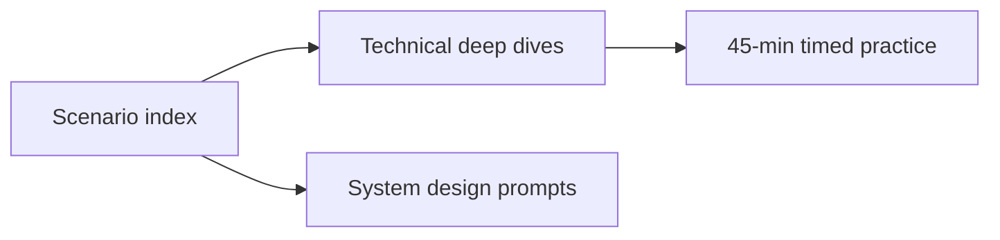

# Real-World Scenario Index

Quick lookup for **production-grounded interview walkthroughs**. Each scenario includes timed step-by-step answers, whiteboard guides, and links to deep chapters.

## By Interview Type

### Technical Deep Dive (30–45 min)

| Scenario | Company | Core topic |
|----------|---------|------------|
| [Stripe Payment Idempotency](/docs/real-world-scenarios/stripe-payment-idempotency) | Stripe | Timeout ambiguity, idempotency keys |
| [Netflix Cascading Failure](/docs/real-world-scenarios/netflix-cascading-failure) | Netflix | Circuit breakers, retry storms |
| [Shopify Transactional Outbox](/docs/real-world-scenarios/shopify-transactional-outbox) | Shopify | Dual-write, event publishing |
| [Amazon DynamoDB Consistency](/docs/real-world-scenarios/amazon-dynamodb-eventual-consistency) | AWS | Session guarantees, GSI lag |
| [Slack Message Delivery](/docs/real-world-scenarios/slack-message-delivery) | Slack | Kafka ordering, at-least-once |
| [Google Spanner TrueTime](/docs/real-world-scenarios/google-spanner-global-consistency) | Google | External consistency, commit wait |
| [AWS S3 Multi-Region DR](/docs/real-world-scenarios/aws-s3-multi-region-dr) | AWS | RPO/RTO, cross-region replication |
| [Dropbox Sync Conflicts](/docs/real-world-scenarios/dropbox-file-sync-conflicts) | Dropbox | Conflict copies, vector clocks |

### System Design (45–60 min)

| Scenario | Company | Core topic |
|----------|---------|------------|
| [Uber Ride Matching](/docs/real-world-scenarios/uber-ride-matching) | Uber | Geospatial dispatch, hot cells |
| [Meta News Feed](/docs/real-world-scenarios/meta-news-feed-design) | Meta | Fan-out on write vs read |
| [Airbnb Rate Limiting](/docs/real-world-scenarios/airbnb-distributed-rate-limiting) | Airbnb | Global quotas, Redis |
| [OpenAI LLM Gateway](/docs/real-world-scenarios/openai-llm-gateway) | OpenAI | Model routing, token budgets |

## By Curriculum Domain

| Domain | Scenarios |
|--------|-----------|
| Distributed systems foundations | Stripe, Netflix |
| Transactions & messaging | Shopify, Slack |
| Consistency & databases | DynamoDB, Spanner, Dropbox |
| System design | Uber, Meta, Airbnb, OpenAI |
| Cloud & reliability | AWS S3 DR |

## Study Order for Active Interviews

1. [Real-World Interview Prep](/docs/start-here/real-world-interview-prep) — read the STEP framework
2. Week 1: Stripe → Netflix → Shopify
3. Week 2: DynamoDB → Slack → Uber
4. Week 3: Spanner → Meta → S3 DR
5. Week 4: Airbnb → Dropbox → OpenAI

## Template

Author new scenarios using `templates/real-world-scenario-template.md`.
