# Scenario: Airbnb Distributed Rate Limiting

> **Diagram convention:** Arrows and messages are labeled **1, 2, 3…** to show processing order. Each diagram is followed by a **Step-by-step flow** table explaining every numbered step.

## 1. The Interview Question

> "Design a distributed rate limiter for a public API: 1M RPS globally, per-tenant limits, burst allowed, fair across regions."

## 2. Real-World Context

| Dimension | Detail |
|-----------|--------|
| **Company / system** | [Airbnb](https://medium.com/airbnb-engineering) and similar platforms — public APIs with per-host/per-app tenant quotas |
| **Scale** | 1M RPS globally; 10K+ API tenants; edge + regional enforcement |
| **Why architects care** | **Accuracy vs. latency** tradeoff; hot tenant keys; fail-open vs fail-closed policy |
| **Public references** | Token bucket / sliding window; [Envoy Rate Limit Service](https://github.com/envoyproxy/rate-limit); Redis GCRA |

### AWS deployment context

Typical distributed rate limiter on AWS: **Amazon CloudFront + AWS WAF** at edge (IP/global buckets); **API Gateway** or **ALB + Envoy** with local token cache; **Amazon ElastiCache Redis Cluster** for regional sliding-window counters; **ECS Fargate** rate-limit service; **DynamoDB** for tenant quota config; **CloudWatch** for throttle metrics; **Route 53** geo-routing to regional Redis clusters.

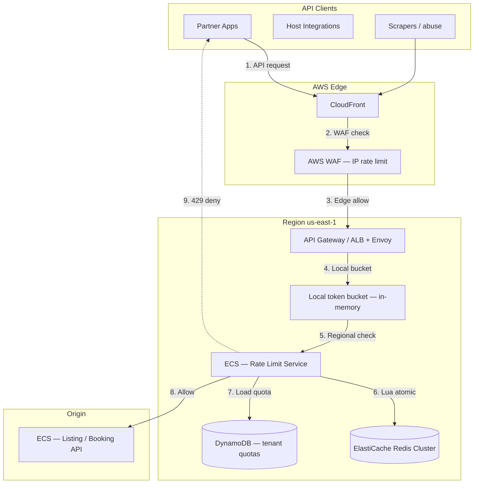

**Step-by-step flow:**

| Step | Action | Explanation |
|------|--------|-------------|
| **1** | API request | Client calls `GET /v2/listings` with API key. |
| **2** | WAF check | Global IP rate limit — blocks DDoS before app tier. |
| **3** | Edge allow | CloudFront forwards to regional API Gateway. |
| **4** | Local bucket | In-memory token bucket — fast path; approximate. |
| **5** | Regional check | Redis sliding window — authoritative per-tenant count. |
| **6** | Lua atomic | Atomic check-and-increment — no race conditions. |
| **7** | Load quota | Tenant limit from DynamoDB (cached in Redis). |
| **8** | Allow | Request forwarded to origin API. |
| **9** | 429 deny | Limit exceeded — `Retry-After` header returned. |

## 3. Step-by-Step Interview Answer

### Minutes 0–8: Requirements

| Type | Detail |
|------|--------|
| **Per-tenant** | 1000 req/min default; burst 2000 (token bucket) |
| **Global accuracy** | Within 1% of true count — acceptable for SaaS tiers |
| **Latency** | p99 check &lt; 5ms (local cache + one Redis hop) |
| **Hierarchy** | Global → tenant → endpoint must all pass |
| **Policy** | Fail-closed for public API; fail-open for internal tier |
| **Headers** | `X-RateLimit-Limit`, `Remaining`, `Reset`, `Retry-After` on 429 |

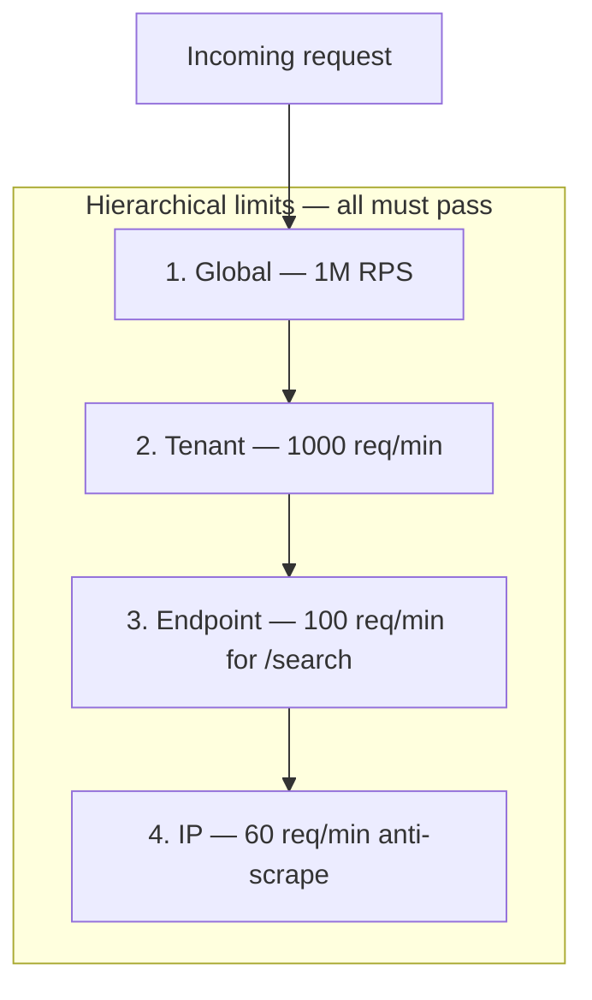

**Step-by-step flow:**

| Step | Action | Explanation |
|------|--------|-------------|
| **1** | Global | Total platform RPS cap — protects origin. |
| **2** | Tenant | Per API key / partner quota. |
| **3** | Endpoint | Expensive endpoints get tighter limits. |
| **4** | IP | Anti-scrape layer at WAF. |

### Minutes 8–20: Two-tier design

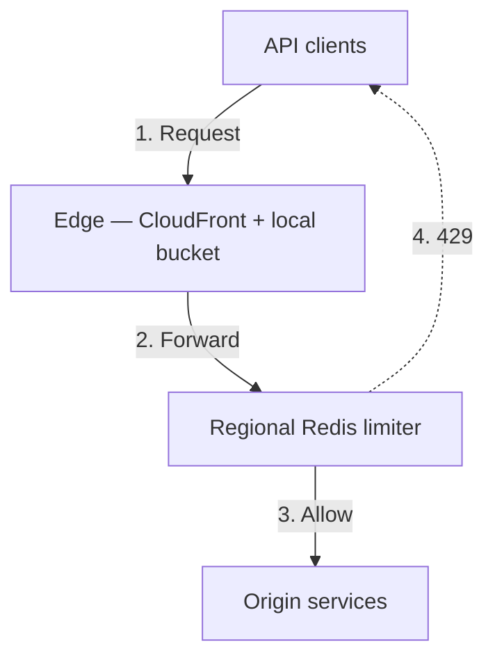

**Tier 1 — Edge (local):** Token bucket in memory per edge PoP / gateway pod; absorbs burst; approximate; &lt;1ms.

**Tier 2 — Regional (authoritative):** ElastiCache Redis Cluster with sliding window log (ZSET) or GCRA.

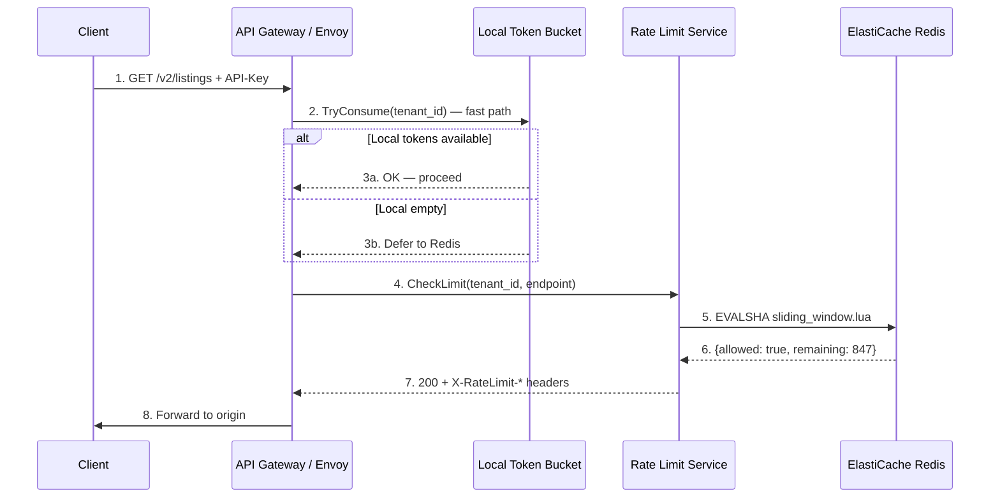

**Step-by-step flow:**

| Step | Action | Explanation |
|------|--------|-------------|
| **1** | Request | Client hits API with tenant API key. |
| **2** | Local bucket | In-memory token bucket — sub-ms check. |
| **3a** | Fast path | Local tokens available — skip Redis (approximate). |
| **3b** | Defer | Local exhausted — authoritative Redis check required. |
| **4** | CheckLimit | Rate limit service called with tenant + endpoint. |
| **5** | Lua script | Atomic sliding window check-and-increment. |
| **6** | Result | `{allowed, remaining, reset_at}` returned. |
| **7** | Headers | `X-RateLimit-Remaining: 847` attached to response. |
| **8** | Forward | Request proceeds to origin API. |

**Redis sliding window (ZSET):**

```
key = rl:tenant:{id}:route:{path}:min:{epoch_minute}
ZADD key {timestamp_ms} {request_id}
ZREMRANGEBYSCORE key -inf {now_ms - window_ms}
ZCARD key → compare to limit
EXPIRE key {window_seconds + buffer}
```

**Lua script for atomicity:**

```lua
-- sliding_window.lua — atomic check-and-increment
local key = KEYS[1]
local now = tonumber(ARGV[1])
local window = tonumber(ARGV[2])
local limit = tonumber(ARGV[3])
local req_id = ARGV[4]

redis.call('ZREMRANGEBYSCORE', key, '-inf', now - window)
local count = redis.call('ZCARD', key)
if count < limit then
    redis.call('ZADD', key, now, req_id)
    redis.call('EXPIRE', key, math.ceil(window / 1000) + 1)
    return {1, limit - count - 1}  -- allowed, remaining
else
    return {0, 0}  -- denied
end
```

### Minutes 20–35: Deep dive

| Challenge | Solution |
|-----------|----------|
| Redis hot key | Shard counter: `tenant:123:shard:{hash%16}` — aggregate sum |
| Cross-region drift | Regional Redis per region; global cap via separate counter |
| Race conditions | Lua script — single-shard atomic ops |
| Burst allowance | Token bucket at edge; refill rate + burst capacity |
| Retry-After | Return 429 with header from window reset time |

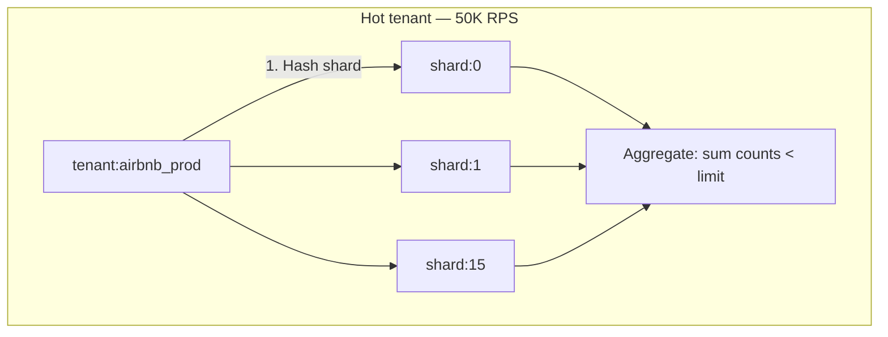

**Step-by-step flow:**

| Step | Action | Explanation |
|------|--------|-------------|
| **1** | Hash shard | `shard = hash(request_id) % 16` — spread hot key. |
| **2** | Parallel ZADD | Each shard gets fraction of traffic. |
| **3** | Aggregate | Sum shard counts; deny if total &gt; limit. |

**Algorithm comparison:**

| Algorithm | Burst | Accuracy | Memory | Use tier |
|-----------|-------|----------|--------|----------|
| **Token bucket** | Yes — smooth burst | Approximate | O(1) | Edge local cache |
| **Fixed window** | Boundary spike | Poor at window edge | O(1) | Avoid |
| **Sliding window log** | No spike | Exact | O(limit) per key | Redis authoritative |
| **Sliding window counter** | Moderate | ~99% accurate | O(1) | High-volume alternative |
| **GCRA** | Yes | Exact | O(1) | Redis Cell style |

### Minutes 35–45: Failure modes

| Failure | Policy | Behavior |
|---------|--------|----------|
| Redis partition | Fail-closed (public API) | Return 503/429 — protect origin |
| Redis partition | Fail-open (internal) | Allow traffic — availability over accuracy |
| Redis slow (&gt;5ms) | Timeout | Fail-closed for paid tiers |
| DDoS | WAF first | IP bucket before tenant bucket |
| Clock skew | Redis TIME | Use server time in Lua, not client |

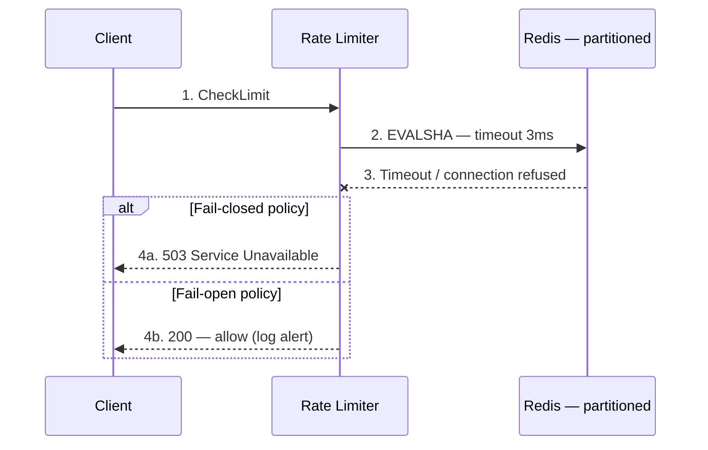

**Step-by-step flow:**

| Step | Action | Explanation |
|------|--------|-------------|
| **1** | CheckLimit | Normal rate limit check. |
| **2** | Redis timeout | 3ms timeout — don't block request path. |
| **3** | Partition | Redis unreachable or slow. |
| **4a** | Fail-closed | Deny — protects origin during outage. |
| **4b** | Fail-open | Allow — internal APIs prioritize availability. |

**Capacity math:**

| Metric | Value | Calculation |
|--------|-------|-------------|
| Global RPS | 1M | Platform peak |
| Redis ops/s per region | ~200K | After local cache absorbs 80% |
| Tenants | 10K | Active API partners |
| Ops per check | 1 (Lua EVALSHA) | Single round-trip |
| Redis nodes | 6+ shard cluster | 200K ops ÷ 33K per node |

---

## 4. Whiteboard Guide

1. **Left:** Clients → CloudFront → WAF (IP bucket)
2. **Center:** API Gateway → local token bucket → Redis (authoritative)
3. **Right:** Origin API
4. Label **hierarchical limits**: global → tenant → endpoint
5. Draw **hot key sharding** with 16 shards
6. Annotate **fail-closed** vs **fail-open** policy box

### AWS whiteboard layout

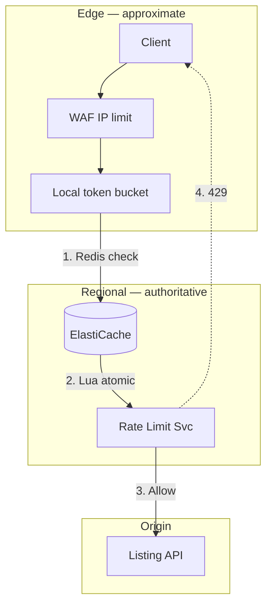

**Step-by-step flow:**

| Step | Action | Explanation |
|------|--------|-------------|
| **1** | Redis check | Authoritative sliding window per tenant. |
| **2** | Lua atomic | No race condition on concurrent requests. |
| **3** | Allow | Forward to origin with rate limit headers. |
| **4** | 429 | Deny with `Retry-After` when over limit. |

---

## 5. Principal-Level Signals

- **Token bucket vs sliding window** — burst vs accuracy tradeoff
- **Hot key sharding** — `hash % N` spread for top tenants
- **Explicit fail-open vs fail-closed** — product decision per API tier
- **Edge + central two-tier** — local absorbs 80%; Redis authoritative
- **Hierarchical limits** — global AND tenant AND endpoint must pass
- **Lua atomicity** — never INCR then GET separately

## 6. Red Flags

- Single Redis key per hot tenant — hot key bottleneck at 50K RPS
- Fail-open on public API during Redis outage — origin gets DDoS'd
- Fixed window counter — 2× spike at window boundaries
- No `Retry-After` header on 429 — clients retry immediately (retry storm)
- Rate limit after origin — too late; must be at gateway edge

## 7. Follow-Up Questions

| Question | Strong answer |
|----------|---------------|
| 1M RPS — how many Redis ops? | ~200K/s after 80% local cache hit; 6-node cluster |
| Token bucket vs sliding window? | Bucket for burst at edge; sliding window for accurate billing |
| Cross-region fairness? | Regional Redis + periodic global reconciliation counter |
| Envoy RLS vs custom? | Envoy for K8s mesh; custom for DynamoDB-driven dynamic quotas |
| How to test accuracy? | Load test 10K RPS; measure actual vs allowed within 1% |

## 8. Related Study

- [Distributed Rate Limiter](/docs/system-design/distributed-rate-limiter)
- [Distributed Caching](/docs/caching/distributed-caching)
- Lab: [Rate limiter](/docs/system-design/distributed-rate-limiter#25-hands-on-exercise) on **`:8101`**

## 9. Practice Drill

Implement mental model: 10K tenants, 1M RPS — how many Redis ops/s? Whiteboard Lua sliding window script from memory.

---

## 10. Production High-Level Design

### 10.1 Architecture diagram index

| Section | Topic |
|---------|-------|
| [§2](#aws-deployment-context) | End-to-end AWS deployment |
| [§3](#minutes-820-two-tier-design) | Edge + regional two-tier flow |
| [§10.2](#102-system-context-c4-level-1) | C4 logical context |
| [§10.3](#103-aws-production-architecture) | Full multi-region stack |
| [§10.4](#104-hierarchical-limit-evaluation) | Global → tenant → endpoint |
| [§11.4](#114-rate-limit-check--step-by-step) | Check sequence |
| [§11.5](#115-lua-sliding-window-implementation) | Redis Lua script |
| [§11.6](#116-hot-key-sharding) | Shard aggregation |
| [§12](#12-hadr-and-multi-region) | Regional Redis clusters |
| [§13](#13-observability-and-operations) | Metrics and alerts |
| [§14](#14-implementation-roadmap) | 6-week rollout |
| [§15](#15-testing-strategy) | Accuracy + failover tests |
| [§16](#16-architecture-review-checklist) | Production readiness |

### 10.2 System context (C4 Level 1)

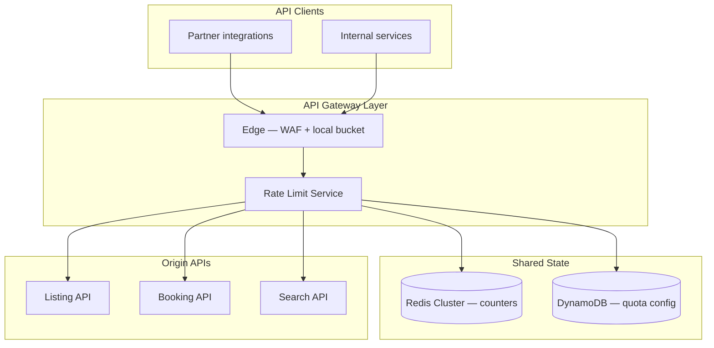

### 10.3 AWS production architecture

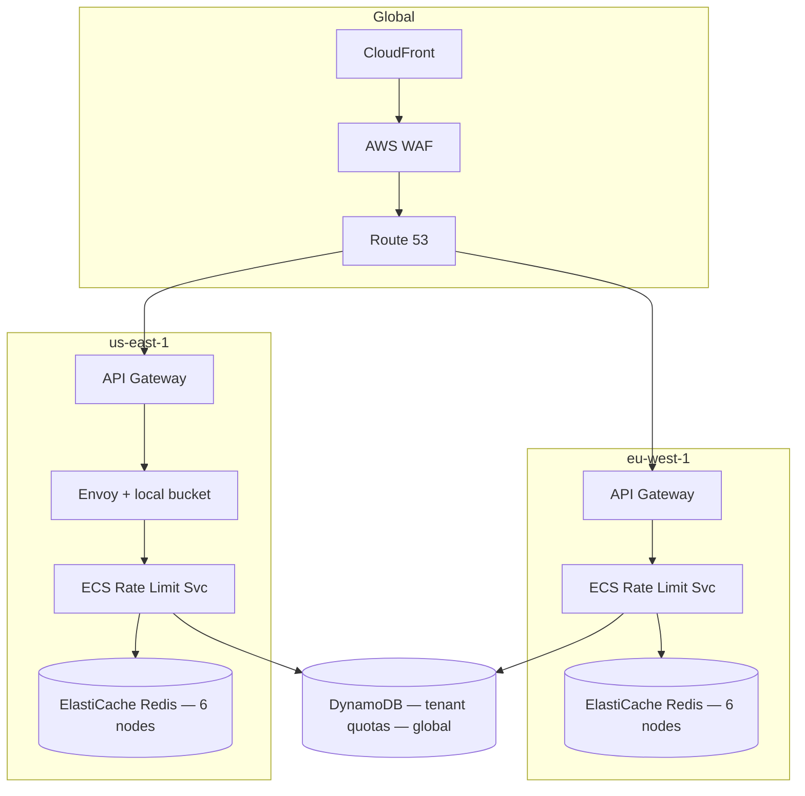

| AWS component | Rate limit responsibility |
|---------------|--------------------------|
| **CloudFront + WAF** | IP-level DDoS; 10K req/5min per IP |
| **API Gateway** | Usage plans; optional first-pass throttle |
| **Envoy + local bucket** | Sub-ms approximate check; 80% cache hit |
| **ElastiCache Redis** | Authoritative sliding window per tenant |
| **DynamoDB** | Tenant quota config; plan tier limits |
| **CloudWatch** | `throttle_rate`, `redis_latency_p99` |

### 10.4 Hierarchical limit evaluation

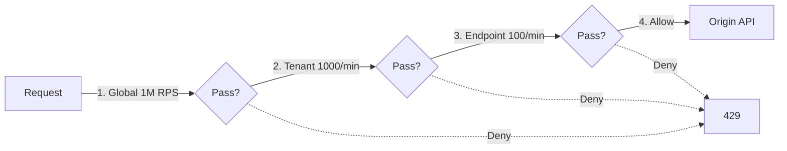

**Quota tiers (DynamoDB):**

| Tier | req/min | burst | fail policy |
|------|---------|-------|-------------|
| **Free** | 60 | 100 | fail-closed |
| **Standard** | 1000 | 2000 | fail-closed |
| **Premium** | 10000 | 20000 | fail-closed |
| **Internal** | unlimited | — | fail-open on Redis outage |

---

## 11. Production Low-Level Design

### 11.1 API response headers

```http
HTTP/1.1 200 OK
X-RateLimit-Limit: 1000
X-RateLimit-Remaining: 847
X-RateLimit-Reset: 1735689660
```

```http
HTTP/1.1 429 Too Many Requests
Retry-After: 42
X-RateLimit-Limit: 1000
X-RateLimit-Remaining: 0
X-RateLimit-Reset: 1735689660
```

### 11.2 DynamoDB quota schema

```json
{
  "tenant_id": "partner_abc",
  "plan_tier": "standard",
  "limits": {
    "global_rpm": 1000,
    "burst": 2000,
    "endpoints": {
      "/v2/search": 100,
      "/v2/listings": 500
    }
  },
  "fail_policy": "closed",
  "updated_at": "2026-07-28T21:00:00Z"
}
```

### 11.3 Local token bucket (edge)

```python
class LocalTokenBucket:
    def __init__(self, rate: float, burst: int):
        self.rate = rate          # tokens per second
        self.burst = burst
        self.tokens = burst
        self.last_refill = time.monotonic()

    def try_consume(self, n: int = 1) -> bool:
        now = time.monotonic()
        elapsed = now - self.last_refill
        self.tokens = min(self.burst, self.tokens + elapsed * self.rate)
        self.last_refill = now
        if self.tokens >= n:
            self.tokens -= n
            return True
        return False  # defer to Redis
```

### 11.4 Rate limit check — step-by-step

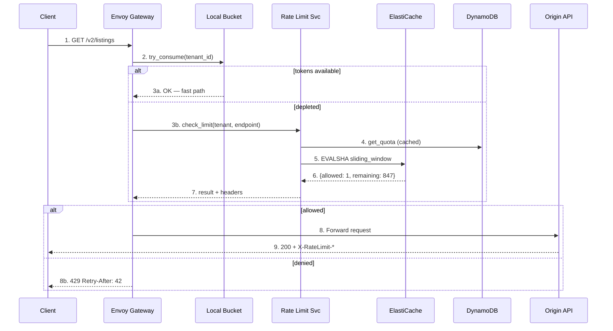

**Step-by-step flow:**

| Step | Action | Explanation |
|------|--------|-------------|
| **1** | GET request | Client calls API with tenant key. |
| **2** | try_consume | Local token bucket — sub-ms. |
| **3a** | Fast path | ~80% of requests never hit Redis. |
| **3b** | Redis check | Local depleted — authoritative check. |
| **4** | get_quota | Tenant limits from DynamoDB (Redis-cached). |
| **5** | EVALSHA | Atomic sliding window Lua script. |
| **6** | Result | allowed + remaining count. |
| **7–9** | Forward | Attach headers; proxy to origin. |
| **8b** | 429 | Deny with `Retry-After`. |

### 11.5 Lua sliding window implementation

```python
def check_rate_limit(tenant_id: str, endpoint: str, request_id: str) -> RateLimitResult:
    shard = hash(request_id) % NUM_SHARDS
    key = f"rl:{tenant_id}:{endpoint}:shard:{shard}"
    now_ms = int(time.time() * 1000)
    quota = get_quota(tenant_id)  # cached from DynamoDB

    allowed, remaining = redis.evalsha(
        SLIDING_WINDOW_SHA,
        keys=[key],
        args=[now_ms, quota.window_ms, quota.limit // NUM_SHARDS, request_id],
    )

    if not allowed:
        # Aggregate across shards for final decision
        total = sum(get_shard_count(tenant_id, endpoint, s) for s in range(NUM_SHARDS))
        if total >= quota.limit:
            return RateLimitResult(allowed=False, retry_after=compute_reset())

    return RateLimitResult(allowed=True, remaining=remaining)
```

### 11.6 Hot key sharding

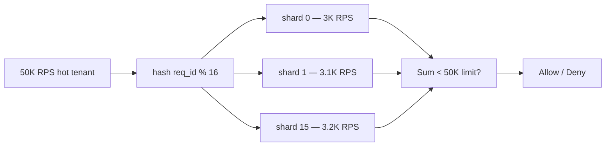

| Parameter | Value |
|-----------|-------|
| Shards per hot tenant | 16 |
| Per-shard limit | `global_limit / 16` |
| Aggregation | Sum all shard ZCARD before deny |
| Shard selection | `hash(request_id) % 16` |

### 11.7 Fail policy implementation

```python
def check_with_policy(tenant_id: str, endpoint: str) -> RateLimitResult:
    try:
        return check_rate_limit(tenant_id, endpoint, request_id)
    except (RedisTimeout, RedisConnectionError) as e:
        policy = get_fail_policy(tenant_id)  # from DynamoDB
        if policy == "closed":
            metrics.increment("rate_limit.redis_failure_deny")
            return RateLimitResult(allowed=False, status=503)
        else:
            metrics.increment("rate_limit.redis_failure_allow")
            return RateLimitResult(allowed=True)  # fail-open
```

---

## 12. HA/DR and Multi-Region

```mermaid
flowchart TB
    subgraph US["us-east-1"]
        Redis_US[(Redis Cluster — primary)]
        RL_US[Rate Limit Svc]
    end

    subgraph EU["eu-west-1"]
        Redis_EU[(Redis Cluster — independent)]
        RL_EU[Rate Limit Svc]
    end

    DDB[(DynamoDB Global — quota config)]

  Note over Redis_US,Redis_EU: Regional counters — no cross-region sync per request
  Note over DDB: Global quota config replicated
```

| Principle | Implementation |
|-----------|----------------|
| **Regional Redis** | Each region enforces independently — no cross-region RTT |
| **Global cap** | Separate low-frequency global counter; 1% accuracy OK |
| **Quota config** | DynamoDB global table — consistent tier limits |
| **Failover** | Route 53 shifts traffic; regional Redis already warm |

---

## 13. Observability and Operations

| Metric | Alert threshold |
|--------|-----------------|
| `rate_limit.throttle_rate` per tenant | &gt; 50% for 5 min |
| `rate_limit.redis_latency_p99` | &gt; 5ms |
| `rate_limit.local_cache_hit_rate` | &lt; 70% — tune bucket size |
| `rate_limit.redis_failure_deny` | &gt; 0 — Redis outage |
| `rate_limit.hot_key_shard_skew` | &gt; 2× average — rebalance |

**Structured log:**

```json
{
  "tenant_id": "partner_abc",
  "endpoint": "/v2/listings",
  "decision": "allow",
  "remaining": 847,
  "latency_ms": 1.2,
  "path": "local_cache",
  "shard": null
}
```

### Runbook — Redis outage

| Step | Action |
|------|--------|
| **1** | Confirm ElastiCache cluster health in CloudWatch |
| **2** | Check `redis_failure_deny` vs `redis_failure_allow` rates |
| **3** | Public API: expect 503 spike — communicate to partners |
| **4** | Internal API: fail-open — monitor origin load |
| **5** | Failover to replica if single-node failure |
| **6** | Post-incident: review fail policy per tier |

---

## 14. Implementation Roadmap (6-Week Rollout)

| Week | Deliverable |
|------|-------------|
| 1 | DynamoDB quota schema + tenant tier config API |
| 2 | Redis sliding window Lua + rate limit service |
| 3 | Local token bucket in Envoy / API Gateway |
| 4 | Hierarchical limits + response headers |
| 5 | Hot key sharding + load test 200K Redis ops/s |
| 6 | Fail policy per tier + dashboards + runbook |

---

## 15. Testing Strategy

| Test | Pass criteria |
|------|---------------|
| 1000 req/min limit | Request 1001st returns 429 within same window |
| Burst 2000 | First 2000 in burst allowed; then throttled |
| Concurrent 100 threads | No over-count &gt; 1% vs sequential |
| Redis outage fail-closed | Public API returns 503 — zero origin overload |
| Redis outage fail-open | Internal API allows traffic — alert fired |
| Hot tenant 50K RPS | Shard skew &lt; 2×; p99 &lt; 5ms |
| `Retry-After` header | Present on all 429 responses |

---

## 16. Architecture Review Checklist

| # | Gate | Status |
|---|------|--------|
| 1 | Two-tier: local bucket + Redis authoritative | ☐ |
| 2 | Lua atomic check-and-increment (no race) | ☐ |
| 3 | Hierarchical limits: global → tenant → endpoint | ☐ |
| 4 | Hot key sharding for top tenants | ☐ |
| 5 | Fail-closed for public API; fail-open for internal | ☐ |
| 6 | `X-RateLimit-*` and `Retry-After` headers on all responses | ☐ |
| 7 | WAF IP rate limit before tenant limit | ☐ |
| 8 | Redis p99 latency dashboard + 5ms alert | ☐ |
| 9 | Load test 200K Redis ops/s per region | ☐ |
| 10 | Accuracy within 1% at 10K RPS tenant | ☐ |

---

## 17. Related Study

- [Distributed Rate Limiter](/docs/system-design/distributed-rate-limiter)
- [Distributed Caching](/docs/caching/distributed-caching)
- [Netflix Cascading Failure](/docs/real-world-scenarios/netflix-cascading-failure) — retry storm after 429 without `Retry-After`
- Lab: [Rate limiter](/docs/system-design/distributed-rate-limiter#25-hands-on-exercise) on **`:8101`**
