# Scenario: Amazon DynamoDB Consistency

> **Diagram convention:** Arrows and messages are labeled **1, 2, 3…** to show processing order. Each diagram is followed by a **Step-by-step flow** table explaining every numbered step.

## 1. The Interview Question

> "A user updates their profile and immediately refreshes the page but sees stale data. You're using DynamoDB with global tables. Diagnose and fix without killing availability."

## 2. Real-World Context

| Dimension | Detail |
|-----------|--------|
| **Company / system** | [Amazon DynamoDB](https://docs.aws.amazon.com/amazondynamodb/) — AWS managed key-value/document store; evolved from the [Dynamo paper](https://www.allthingsdistributed.com/files/amazon-dynamo-sosp2007.pdf) (2007) |
| **Scale** | Single-digit ms latency; multi-region Global Tables; tunable read consistency per request |
| **Why architects care** | Default reads are **eventually consistent**; GSI has a **separate** replication timeline; Global Tables add cross-region lag |
| **Public references** | DynamoDB developer guide on [read consistency](https://docs.aws.amazon.com/amazondynamodb/latest/developerguide/HowItWorks.ReadConsistency.html); session guarantees |

### AWS deployment context

Typical profile/cart service on AWS: **API Gateway + Lambda** or **ECS Fargate** behind **ALB**; **Amazon DynamoDB** base table + **GSI** for email lookup; **DynamoDB Global Tables** for multi-region; optional **DAX** (microsecond cache); **CloudFront** for API responses (separate stale-read risk); **CloudWatch** for `SuccessfulRequestLatency` and replication lag; **Route 53** geo-routing for read-your-writes via same region.

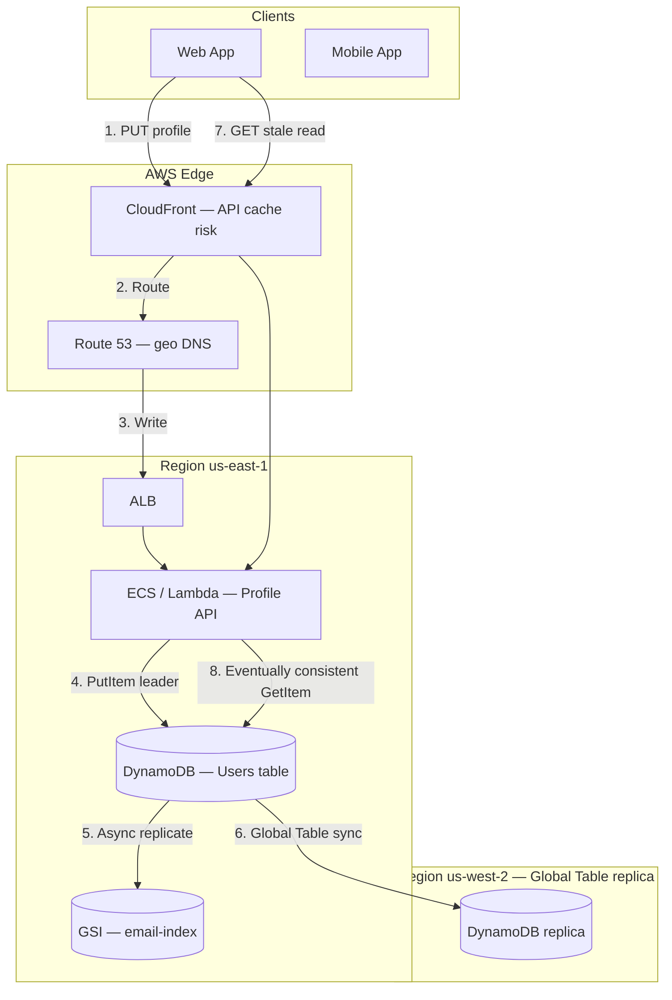

**Step-by-step flow:**

| Step | Action | Explanation |
|------|--------|-------------|
| **1** | PUT profile | User saves profile change via `PUT /profile`. |
| **2** | Route | CloudFront may cache GET responses — **second stale-read source**. |
| **3** | Write | API writes to DynamoDB leader partition in us-east-1. |
| **4** | PutItem leader | Strongly consistent write commits on partition leader. |
| **5** | Async replicate | GSI update is **asynchronous** — email lookup may lag. |
| **6** | Global Table sync | Cross-region replication typically &lt; 1s but not zero. |
| **7** | GET stale read | User refreshes immediately — hits eventually consistent read path. |
| **8** | Eventually consistent GetItem | Read may hit replica **before** write propagates — **stale data**. |

## 3. Step-by-Step Interview Answer

### Minutes 0–5: Diagnose

1. **Symptom:** Stale read after write — classic **read-your-writes** violation.
2. **Questions:** Same region? Read from GSI or base table? Eventually vs strongly consistent read? CloudFront cache?
3. **Likely causes (ranked):**
   - Eventually consistent `GetItem` on base table (default)
   - Read from **GSI** after write to base table (async GSI replication)
   - **Global Tables** cross-region read after write in different region
   - **DAX** cache not invalidated after write
   - **CloudFront / API cache** serving old response

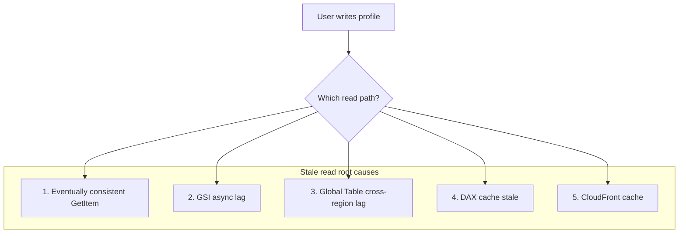

**Step-by-step flow (diagnosis):**

| Step | Action | Explanation |
|------|--------|-------------|
| **1** | Check read API | Is `ConsistentRead=true` set? Default is `false`. |
| **2** | Check table | Base table vs GSI — GSI always eventually consistent. |
| **3** | Check region | Write us-east-1, read us-west-2 → Global Table lag. |
| **4** | Check DAX | DAX hit may return pre-write value until TTL/invalidation. |
| **5** | Check CDN | CloudFront may cache `GET /profile` independently of DynamoDB. |

### Minutes 5–15: DynamoDB consistency model

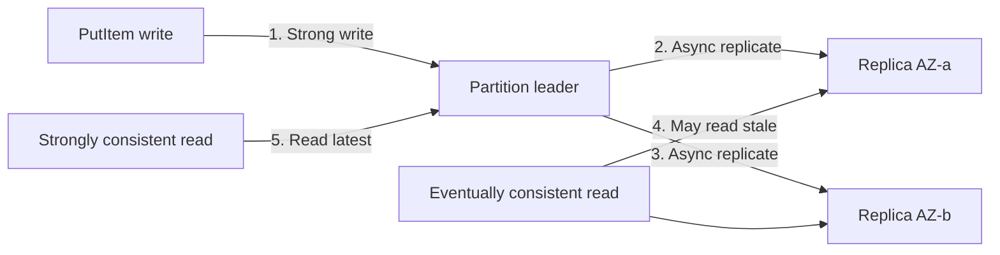

**Step-by-step flow:**

| Step | Action | Explanation |
|------|--------|-------------|
| **1** | Strong write | `PutItem` always writes to partition leader — durable on ack. |
| **2–3** | Async replicate | Leader replicates to AZ replicas asynchronously (typically &lt;1s). |
| **4** | Eventually consistent read | Default `GetItem` may read from any replica — **stale possible**. |
| **5** | Strongly consistent read | `ConsistentRead=true` reads from leader — latest write guaranteed. |

| Read type | Guarantee | RCU cost | Use when |
|-----------|-----------|----------|----------|
| **Eventually consistent** | May return stale data | 0.5× (half RCU) | Lists, analytics, non-critical reads |
| **Strongly consistent** | Latest write on leader partition | 1× (full RCU) | Read-after-write, profile, cart |
| **Transactional** | ACID across ≤100 items same region | 2× | Multi-item atomic updates |

**GSI caveat — separate replication timeline:**

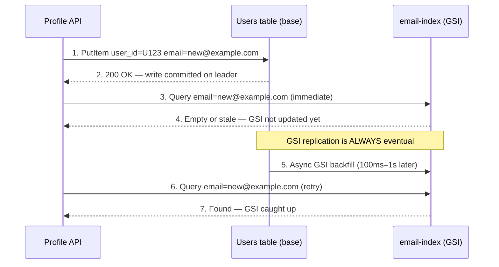

**Step-by-step flow:**

| Step | Action | Explanation |
|------|--------|-------------|
| **1** | PutItem base | Write commits on base table leader. |
| **2** | 200 OK | API returns success — user expects data visible. |
| **3** | Query GSI | Lookup by email on GSI immediately after write. |
| **4** | Empty/stale | GSI has **not** received update yet — classic bug. |
| **5** | Async backfill | DynamoDB propagates change to GSI asynchronously. |
| **6–7** | Retry | GSI query succeeds after replication lag. |

### Minutes 15–30: Fixes (pick by requirement)

| Option | Mechanism | Tradeoff |
|--------|-----------|----------|
| **A — Strong read after write** | `ConsistentRead=true` on `GetItem` | 2× RCU cost; leader latency |
| **B — Return in write response** | Return updated item from `PutItem` response | No second read needed |
| **C — Session token** | Sticky routing until replica catches up | Platform complexity |
| **D — Geo-routing** | Route read+write to same region | Cross-region stale reads remain |
| **E — DAX invalidation** | Write-through or TTL=0 on profile keys | Cache layer management |
| **F — Avoid GSI for read-after-write** | Query base table by PK after write | GSI only for search, not critical path |

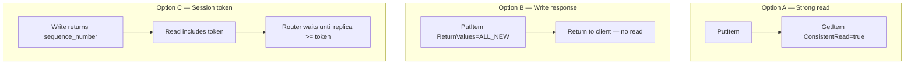

**Step-by-step flow:**

| Step | Action | Explanation |
|------|--------|-------------|
| **A1–A2** | Strong read | After write, explicitly request consistent read on base table. |
| **B1–B2** | Write response | `ReturnValues=ALL_NEW` — client gets fresh data without `GetItem`. |
| **C1–C3** | Session token | App-level sequence in item + routing logic for session guarantees. |

### Minutes 30–45: CAP framing and Global Tables

During partition, DynamoDB chooses **availability** with **eventual consistency** for default reads. Strong reads route to leader — may fail if leader unreachable.

```mermaid
flowchart TB
    subgraph East["us-east-1"]
        API_E[Profile API]
        DDB_E[(DynamoDB leader)]
    end

    subgraph West["us-west-2 — Global Table"]
        API_W[Profile API]
        DDB_W[(DynamoDB replica)]
    end

    API_E -->|"1. PutItem"| DDB_E
    DDB_E -->|"2. Async replicate < 1s"| DDB_W
    API_W -->|"3. GetItem eventual"| DDB_W
    Note over API_W,DDB_W: User wrote East, reads West — stale until replicate
```

**Step-by-step flow:**

| Step | Action | Explanation |
|------|--------|-------------|
| **1** | PutItem East | User updates profile in us-east-1. |
| **2** | Async replicate | Global Table streams change to us-west-2 (typically &lt;1s). |
| **3** | GetItem West | User in California reads us-west-2 — may see old profile. |

**Global Tables fixes:**

| Strategy | Implementation |
|----------|----------------|
| **Geo-DNS sticky** | Route 53 latency routing — user always hits home region |
| **UX "syncing"** | Show spinner for 1–2s after save; poll with strong read |
| **Conflict resolution** | Last-writer-wins with `version` attribute + conditional writes |
| **Critical reads** | `ConsistentRead=true` in **same region** as write |

**Measure:** `SuccessfulRequestLatency`, `UserErrors`, `ReplicationLatency` (Global Tables), GSI backfill lag, DAX `CacheHitRate`.

---

## 4. Whiteboard Guide

1. Client → API → DynamoDB **leader partition** (label write path)
2. Show **replicas** with lag arrow labeled "eventual (default read)"
3. Branch: **GSI** with async replication (dashed line, longer lag)
4. Branch: **Global Table** cross-region arrow
5. Annotate fixes: `ConsistentRead=true`, `ReturnValues=ALL_NEW`, geo-DNS

### AWS whiteboard layout

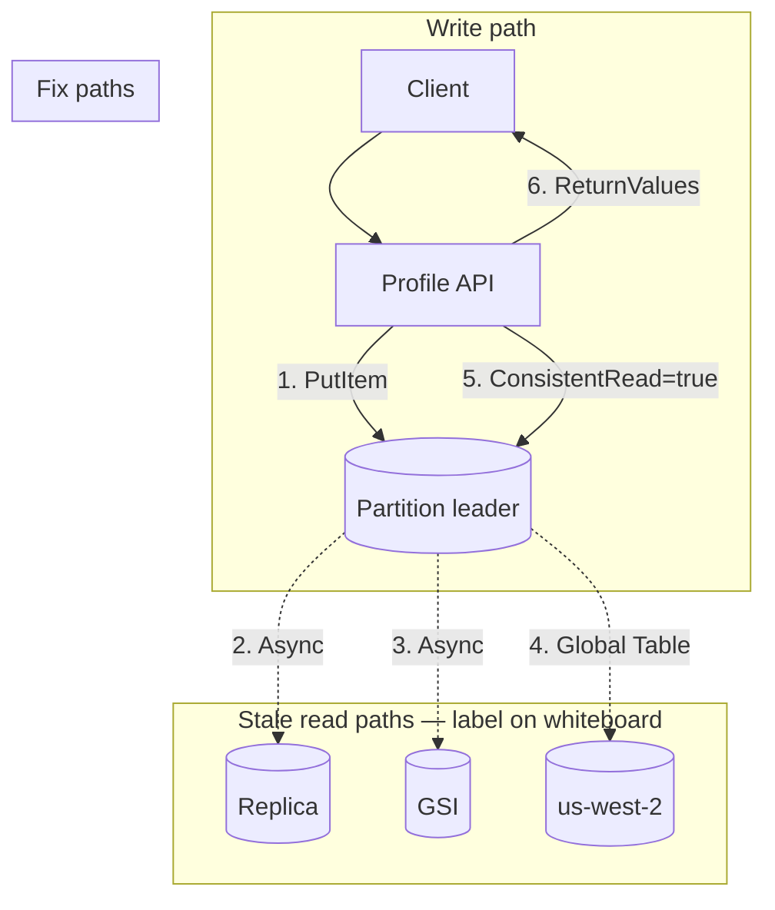

**Step-by-step flow:**

| Step | Action | Explanation |
|------|--------|-------------|
| **1** | PutItem | Write always hits leader — strongly consistent on ack. |
| **2** | Replica lag | Default read may hit replica before replication. |
| **3** | GSI lag | GSI always eventual — separate timeline. |
| **4** | Global Table | Cross-region replication adds lag. |
| **5** | ConsistentRead | Fix for same-region read-after-write. |
| **6** | ReturnValues | Fix without second round-trip. |

---

## 5. Principal-Level Signals

- Distinguishes **DynamoDB strong read** (base table) vs **GSI eventual** (always)
- Does not claim "DynamoDB is strongly consistent" globally — only per-request opt-in
- Proposes **session guarantees** when strong read on every request is too expensive
- Checks **CloudFront / DAX** before blaming DynamoDB
- Measures **Global Table replication lag** before tuning UX
- Knows **GSI cannot use ConsistentRead** — design around it

## 6. Red Flags

- "DynamoDB is strongly consistent" — only with `ConsistentRead=true` on base table
- Query GSI immediately after PutItem to base table for read-your-writes
- Strong read on every list/browse request — 2× RCU cost at scale
- Ignore CloudFront cache when diagnosing stale profile
- Global Tables without conflict resolution strategy for concurrent writes

## 7. Follow-Up Questions

| Question | Strong answer |
|----------|---------------|
| Can GSI use strongly consistent reads? | **No** — GSI reads are always eventually consistent |
| Strong read cost? | 2× RCU vs eventual; reads from leader — slightly higher latency |
| Shopping cart offline sync? | Version vectors + conditional writes + last-writer-wins merge |
| DAX vs strong read? | DAX is cache — write-through or invalidate; not a consistency fix alone |
| When Global Tables? | Multi-region active-active; accept eventual cross-region or geo-route |

## 8. Related Study

- [DynamoDB](/docs/distributed-databases/dynamodb)
- [Eventual Consistency](/docs/consistency/eventual-consistency)
- [Session Guarantees](/docs/consistency/session-guarantees)
- Lab: [Eventual consistency](/docs/consistency/eventual-consistency#25-hands-on-exercise) on **`:8099`**

## 9. Practice Drill

Answer in 15 minutes: "Design a shopping cart that works offline on mobile and syncs when online." Tie to version vectors, conditional writes, and conflict resolution. Then whiteboard the GSI stale-read sequence from memory.

---

## 10. Production High-Level Design

Build guide for profile/cart services with correct DynamoDB consistency guarantees on AWS.

### 10.1 Architecture diagram index

| Section | Topic |
|---------|-------|
| [§2](#aws-deployment-context) | End-to-end AWS deployment |
| [§3](#minutes-515-dynamodb-consistency-model) | Leader/replica + GSI lag |
| [§10.2](#102-system-context-c4-level-1) | C4 logical context |
| [§10.3](#103-aws-production-architecture) | Full stack with Global Tables |
| [§10.4](#104-consistency-decision-matrix) | When to use each read type |
| [§11.4](#114-profile-update-handler--step-by-step) | Profile update sequence |
| [§11.5](#115-shopping-cart-offline-sync) | Version vectors + conflict resolution |
| [§12](#12-hadr-global-tables-and-failover) | Global Tables HA/DR |
| [§13](#13-observability-and-operations) | Metrics and alerts |
| [§14](#14-implementation-roadmap-6-week-rollout) | 6-week rollout |
| [§15](#15-testing-strategy) | Consistency integration tests |
| [§16](#16-architecture-review-checklist) | Production readiness |

### 10.2 System context (C4 Level 1)

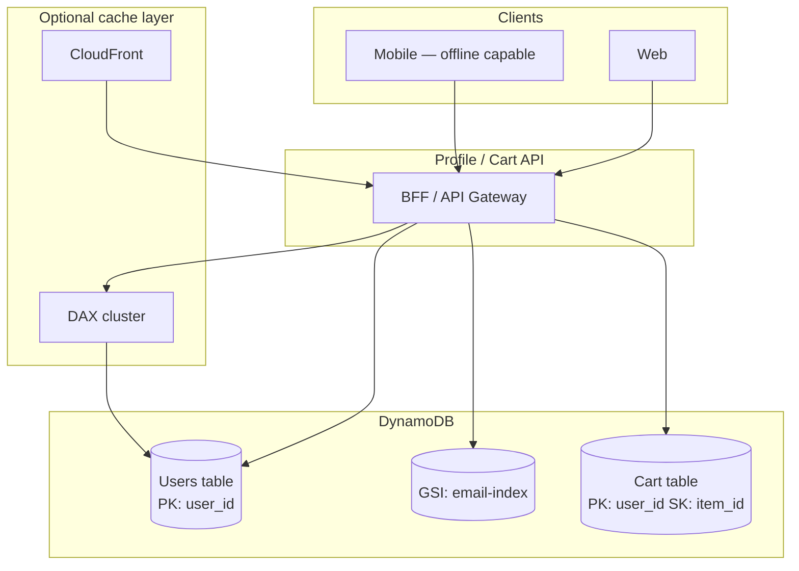

**Step-by-step flow:**

| Step | Action | Explanation |
|------|--------|-------------|
| **1** | Client request | Profile update or cart sync. |
| **2** | BFF routing | API applies consistency policy per operation type. |
| **3** | Base table | Critical reads/writes on `Users` by `user_id` PK. |
| **4** | GSI | Email lookup only — never for read-after-write path. |
| **5** | Cart | Per-user partition — version attribute for offline merge. |

### 10.3 AWS production architecture

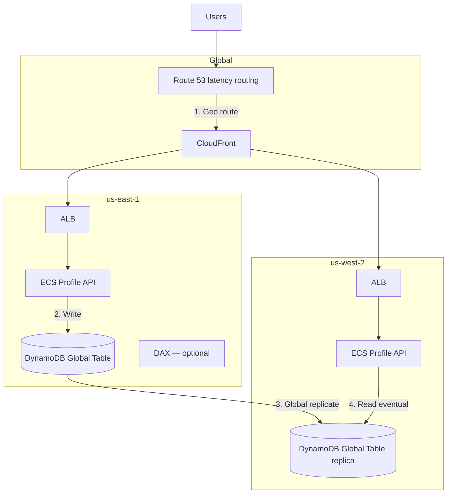

**Step-by-step flow:**

| Step | Action | Explanation |
|------|--------|-------------|
| **1** | Geo route | Route 53 sends user to nearest region for latency. |
| **2** | Write | Profile update writes to local region DynamoDB leader. |
| **3** | Global replicate | Change streams replicate to other regions (&lt;1s typical). |
| **4** | Read eventual | Cross-region read may be stale — use geo-sticky or strong read in write region. |

| AWS component | Consistency responsibility |
|---------------|---------------------------|
| **DynamoDB base table** | `ConsistentRead=true` for read-your-writes |
| **GSI** | Always eventual — not for critical read-after-write |
| **Global Tables** | Cross-region eventual; conflict handler required |
| **DAX** | Write-through or explicit invalidation on PutItem |
| **CloudFront** | Cache-Control: no-store on profile GET or purge on PUT |
| **Route 53** | Latency routing for same-region read-after-write |

### 10.4 Consistency decision matrix

| Operation | Read type | Table | Rationale |
|-----------|-----------|-------|-----------|
| Profile update → show profile | Strong or ReturnValues | Base table | Read-your-writes |
| Search user by email | Eventually consistent | GSI | Stale OK for search |
| Cart after add item | Strong on base table | Cart table | User expects immediate cart |
| Browse product catalog | Eventually consistent | Catalog table | Stale OK |
| Admin audit log | Strong | Base table | Compliance |
| Cross-region profile view | Eventually consistent + UX delay | Global Table replica | Accept lag or geo-route |

---

## 11. Production Low-Level Design

### 11.1 Table schema — Users

```json
{
  "TableName": "Users",
  "KeySchema": [{"AttributeName": "user_id", "KeyType": "HASH"}],
  "GlobalSecondaryIndexes": [{
    "IndexName": "email-index",
    "KeySchema": [{"AttributeName": "email", "KeyType": "HASH"}],
    "Projection": {"ProjectionType": "ALL"}
  }],
  "BillingMode": "PAY_PER_REQUEST"
}
```

**Item shape:**

```json
{
  "user_id": "U123",
  "email": "user@example.com",
  "display_name": "Alice",
  "version": 42,
  "updated_at": "2026-07-28T21:00:00Z",
  "region_written": "us-east-1"
}
```

### 11.2 API contract

**Endpoint:** `PUT /v1/profile` — return updated item from `PutItem` (`ReturnValues=ALL_NEW`).

**Endpoint:** `GET /v1/profile` — default `ConsistentRead=true` on DynamoDB.

### 11.3 SDK calls — correct patterns

**Anti-pattern:**

```python
dynamodb.put_item(TableName="Users", Item={...})
response = dynamodb.get_item(TableName="Users", Key={"user_id": {"S": "U123"}})
# WRONG — eventually consistent; may return stale data
```

**Pattern A — Strong read:**

```python
dynamodb.put_item(TableName="Users", Item={...})
response = dynamodb.get_item(
    TableName="Users",
    Key={"user_id": {"S": "U123"}},
    ConsistentRead=True,
)
```

**Pattern B — Return from write (preferred):**

```python
response = dynamodb.put_item(
    TableName="Users",
    Item={...},
    ReturnValues="ALL_NEW",
)
return deserialize(response["Attributes"])
```

**Pattern C — Conditional write with version:**

```python
dynamodb.put_item(
    TableName="Users",
    Item={**item, "version": current_version + 1},
    ConditionExpression="version = :v OR attribute_not_exists(version)",
    ExpressionAttributeValues={":v": current_version},
)
```

### 11.4 Profile update handler — step-by-step

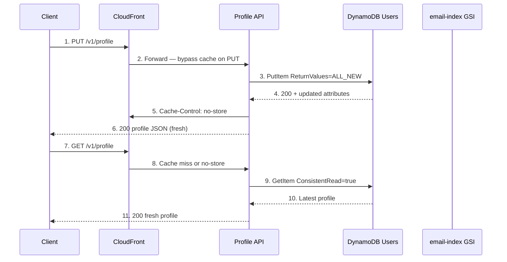

**Step-by-step flow:**

| Step | Action | Explanation |
|------|--------|-------------|
| **1** | PUT profile | Client submits profile update. |
| **2** | Forward | CloudFront passes PUT to origin. |
| **3** | PutItem | Write to base table leader with `ReturnValues=ALL_NEW`. |
| **4** | 200 + attributes | DynamoDB returns committed item. |
| **5** | Cache-Control | `no-store` — prevent CloudFront stale GET. |
| **6** | 200 fresh | Client receives updated profile immediately. |
| **7–11** | GET refresh | Strong read on base table — read-your-writes guaranteed. |

### 11.5 Shopping cart — offline sync

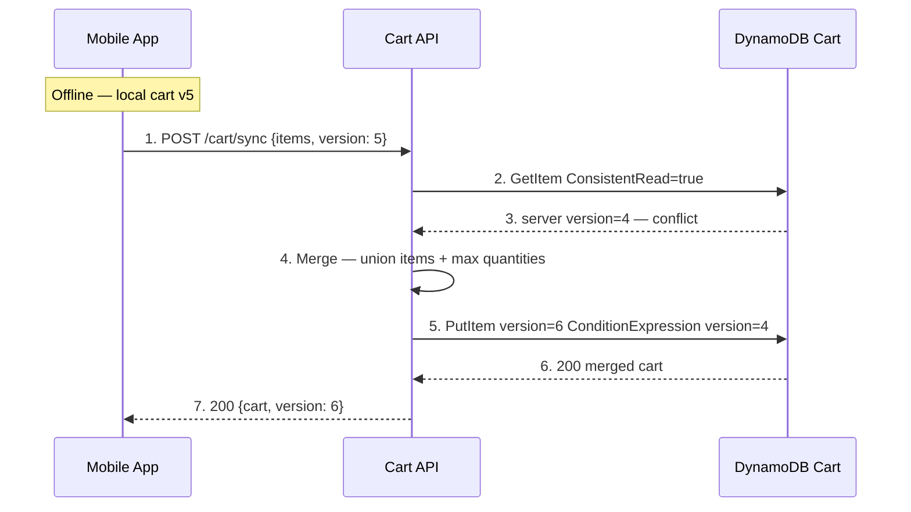

**Step-by-step flow:**

| Step | Action | Explanation |
|------|--------|-------------|
| **1** | POST sync | Mobile reconnects with local cart version. |
| **2** | Strong read | Fetch server state with `ConsistentRead=true`. |
| **3** | Conflict | Server version 4 &lt; client version 5 — diverged offline. |
| **4** | Merge | Union items, max qty — Dynamo AP semantics. |
| **5** | Conditional write | Optimistic lock with `version` attribute. |
| **6–7** | Merged cart | Client receives merged state at version 6. |

### 11.6 DAX integration

| Pattern | Consistency | When |
|---------|-------------|------|
| **Write-through DAX** | DAX updates cache on PutItem | Profile writes |
| **TTL=60s** | Stale reads possible | Non-critical reads only |
| **Bypass DAX** | Direct DDB with ConsistentRead | Read-after-write critical path |

### 11.7 GSI design rules

| Rule | Rationale |
|------|-----------|
| Never query GSI for read-after-write | GSI is always eventually consistent |
| Use GSI for login lookup by email | Stale by 100ms OK |
| Base table PK lookup after write | `user_id` known — use base table |

---

## 12. HA/DR — Global Tables and Failover

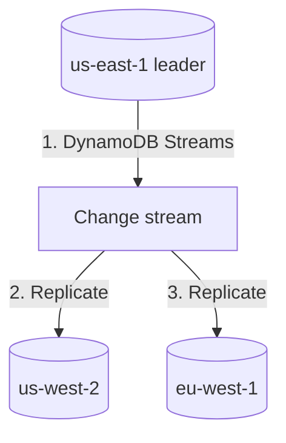

**Conflict mitigation:**

```python
dynamodb.put_item(
    Item={**item, "version": new_version, "updated_at": now()},
    ConditionExpression="updated_at < :client_time OR attribute_not_exists(updated_at)",
    ExpressionAttributeValues={":client_time": client_updated_at},
)
```

| Failover step | Action | RTO |
|---------------|--------|-----|
| **1** | Route 53 fails over to us-west-2 | ~60s TTL |
| **2** | Global Table already has data | RPO &lt;1s |
| **3** | Brief cross-region stale reads | UX "syncing" banner |

---

## 13. Observability and Operations

| Metric | Alert threshold |
|--------|-----------------|
| `SuccessfulRequestLatency` GetItem p99 | &gt; 50ms |
| Strong read ratio | &gt; 30% — cost review |
| `ReplicationLatency` Global Tables | &gt; 1000ms |
| `ConditionalCheckFailed` spike | Conflict storm |

**Runbook — stale profile reports:**

| Step | Action |
|------|--------|
| **1** | Confirm user_id, timestamp, region |
| **2** | Check if read used GSI |
| **3** | Check CloudFront cache on GET |
| **4** | Verify `ConsistentRead=true` or `ReturnValues` |
| **5** | Check Global Table replication lag |

---

## 14. Implementation Roadmap (6-Week Rollout)

| Week | Deliverable |
|------|-------------|
| 1 | Audit all read paths + GSI usage |
| 2 | `ConsistentRead` + `ReturnValues` on profile/cart |
| 3 | CloudFront `no-store` on profile GET |
| 4 | DAX write-through evaluation |
| 5 | Global Tables conflict handling |
| 6 | Read-your-writes integration tests in CI |

---

## 15. Testing Strategy

| Test | Pass criteria |
|------|---------------|
| PutItem → GetItem eventual | May fail — documents bug |
| PutItem → GetItem ConsistentRead=true | Always matches |
| PutItem → immediate GSI Query | May be empty — expected |
| Write East → read West | Document acceptable lag |
| Offline cart merge | No data loss |

---

## 16. Architecture Review Checklist

| # | Gate | Status |
|---|------|--------|
| 1 | Read-after-write uses base table + `ConsistentRead` or `ReturnValues` | ☐ |
| 2 | GSI never on critical read-after-write path | ☐ |
| 3 | CloudFront `no-store` on profile GET | ☐ |
| 4 | Global Tables conflict resolution with `version` | ☐ |
| 5 | Cart offline sync uses version vectors | ☐ |
| 6 | DAX write-through or bypass on critical reads | ☐ |
| 7 | `ReplicationLatency` dashboard | ☐ |
| 8 | Read-your-writes integration test in CI | ☐ |

---

## 17. Related Study

- [DynamoDB](/docs/distributed-databases/dynamodb)
- [Amazon Dynamo](/docs/distributed-databases/amazon-dynamo)
- [Eventual Consistency](/docs/consistency/eventual-consistency)
- [Session Guarantees](/docs/consistency/session-guarantees)
- [PACELC — DynamoDB PA/EL](/docs/consistency/pacelc)
- Lab: [Eventual consistency](/docs/consistency/eventual-consistency#25-hands-on-exercise) on **`:8099`**
