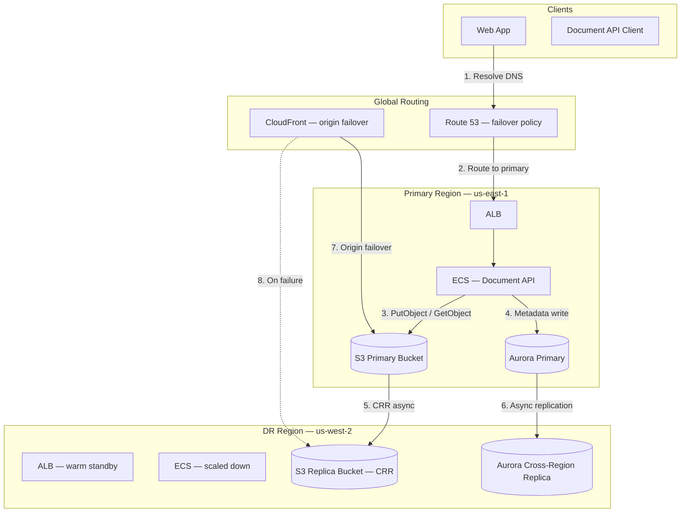
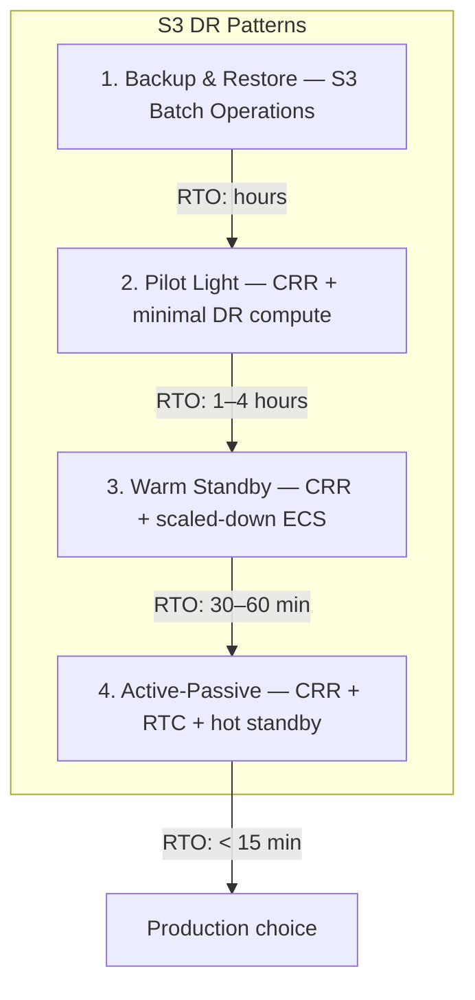
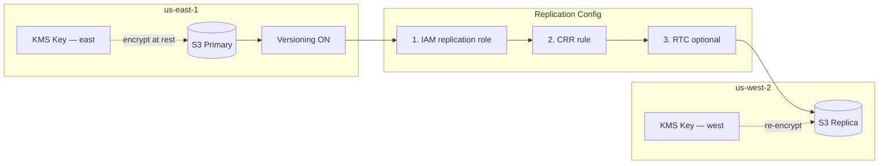
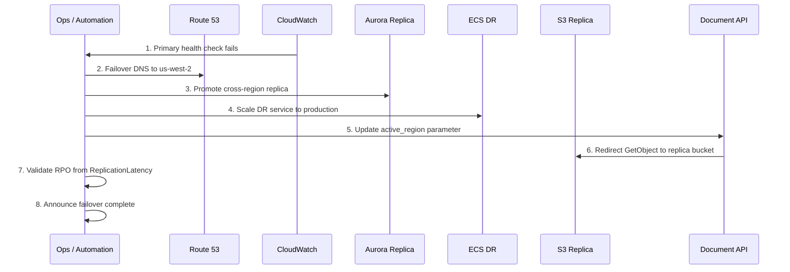
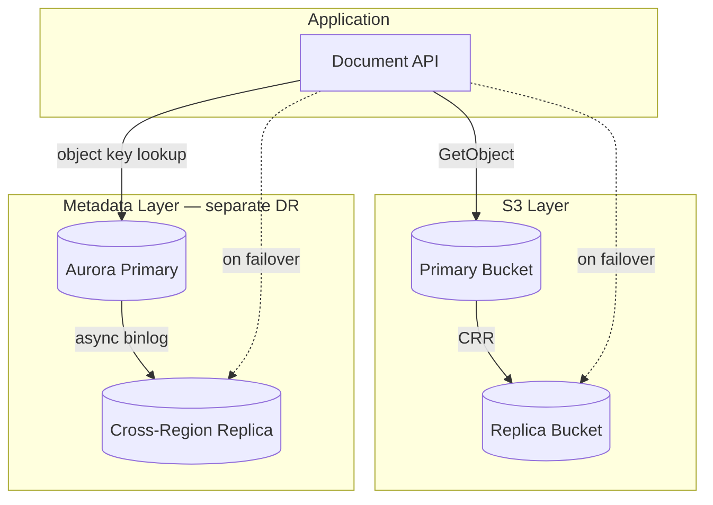
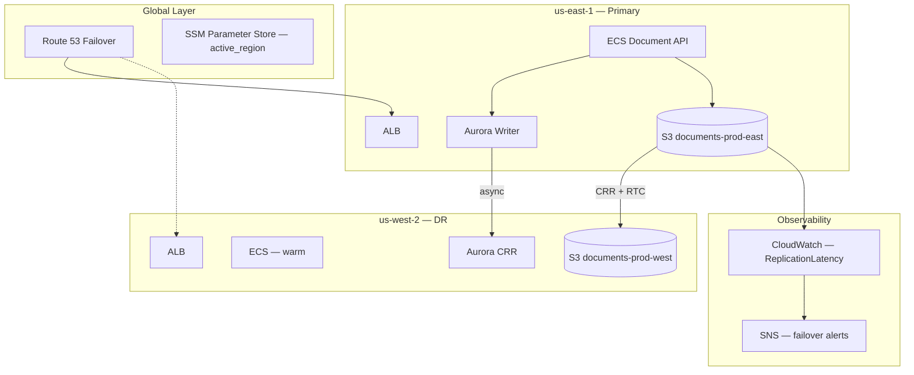
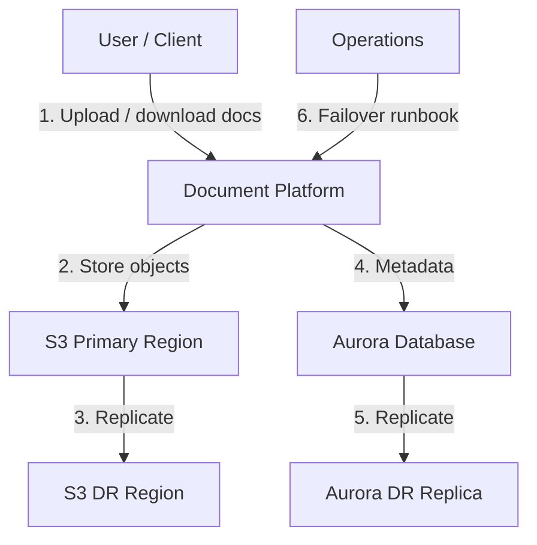
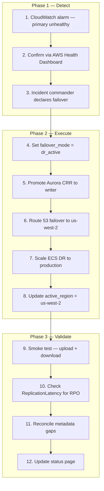
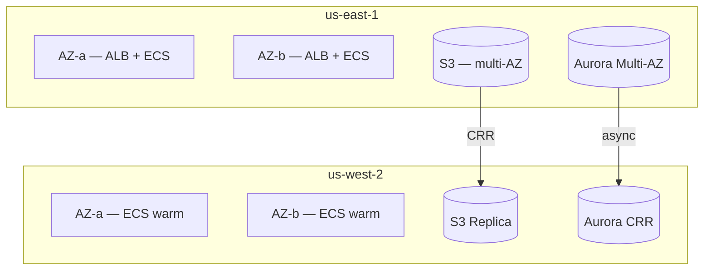

# Scenario: AWS S3 Multi-Region DR

> **Diagram convention:** Arrows and messages are labeled **1, 2, 3…** to show processing order. Each diagram is followed by a **Step-by-step flow** table explaining every numbered step.

## 1. The Interview Question

> "Your platform stores critical documents in S3. Define RPO/RTO for regional failure and design failover."

## 2. Real-World Context

| Dimension | Detail |
|-----------|--------|
| **Company / system** | [Amazon S3](https://aws.amazon.com/s3/) — 11 nines durability within a region; cross-region replication (CRR) for regional DR |
| **Scale** | Exabyte-scale object storage; millions of objects; compliance archives with multi-year retention |
| **Why architects care** | **Durability ≠ availability** — S3 survives AZ loss but not regional outage without explicit DR design |
| **Public references** | [AWS S3 CRR docs](https://docs.aws.amazon.com/AmazonS3/latest/userguide/replication.html); [AWS Builder's Library on resilience](https://aws.amazon.com/builders-library/) |

### AWS deployment context

Typical document platform with S3 DR on AWS: **S3 primary bucket** in `us-east-1` with versioning; **S3 Cross-Region Replication** to `us-west-2` standby bucket; optional **S3 Replication Time Control (RTC)** for bounded RPO; **ECS Fargate** document API; **RDS Aurora** with cross-region read replica; **Route 53** failover routing; **CloudFront** with origin failover for static assets; **AWS Systems Manager Parameter Store** for active-region flag; **CloudWatch** for `ReplicationLatency` and failover alarms; **AWS Backup** for point-in-time recovery.



**Step-by-step flow:**

| Step | Action | Explanation |
|------|--------|-------------|
| **1** | Resolve DNS | Route 53 returns primary region ALB when health check passes. |
| **2** | Route to primary | Traffic flows to `us-east-1` under normal operation. |
| **3** | PutObject / GetObject | Document API reads/writes objects in primary S3 bucket. |
| **4** | Metadata write | Object keys, ACLs, and search index stored in Aurora — separate DR concern. |
| **5** | CRR async | S3 replicates new/updated objects to standby bucket — RPO floor = replication lag. |
| **6** | Async replication | Aurora cross-region replica trails primary — promote on failover. |
| **7** | Origin failover | CloudFront can switch S3 origin to replica bucket on health failure. |
| **8** | On failure | DR path activated when primary region impaired. |

## 3. Step-by-Step Interview Answer

### Step 1 — Define RPO/RTO with business

| Tier | RPO | RTO | Example workload | DR pattern |
|------|-----|-----|------------------|------------|
| **Critical** | 15 min | 1 hour | Customer contracts, legal docs | CRR + RTC; warm standby ECS |
| **Standard** | 24 hours | 4 hours | Analytics exports, reports | CRR without RTC; pilot light |
| **Archive** | 7 days | 24 hours | Compliance cold storage | S3 Batch Replication + Glacier |

**Key distinction:**

| Concept | S3 within region | Cross-region |
|---------|------------------|--------------|
| **Durability** | 99.999999999% (11 nines) | Depends on CRR + RTC |
| **Availability** | 99.99% SLA per region | Not automatic — requires failover design |
| **AZ failure** | Tolerated natively | N/A |
| **Regional failure** | **Not auto-recovered** | Requires CRR + runbook |

### Step 2 — Capacity and cost math

| Metric | Calculation | Result |
|--------|-------------|--------|
| **Storage** | 50 TB primary + CRR | 100 TB total (2× storage cost) |
| **CRR transfer** | 500 GB new objects/day | ~$10/day cross-region egress |
| **RTC premium** | 99.99% of objects within 15 min | Additional per-GB fee |
| **Replication lag** | Typical without RTC | 1–15 min; measure `ReplicationLatency` |
| **Failover RTO** | DNS TTL (60s) + RDS promote (15 min) + ECS scale (10 min) | ~30 min realistic |

### Step 3 — DR architecture options



**Step-by-step flow:**

| Step | Pattern | When to use |
|------|---------|-------------|
| **1** | Backup & Restore | Non-critical; lowest cost; RPO = backup interval |
| **2** | Pilot Light | CRR replicates data; DR region has infra stubs only |
| **3** | Warm Standby | CRR + scaled-down ECS/RDS replica; faster RTO |
| **4** | Active-Passive | CRR + RTC + hot standby; critical tier with 15-min RPO |

### Step 4 — S3 CRR configuration



**Step-by-step flow:**

| Step | Action | Explanation |
|------|--------|-------------|
| **1** | IAM replication role | S3 assumes role with `s3:ReplicateObject`, `s3:ReplicateDelete` permissions. |
| **2** | CRR rule | Configure destination bucket, prefix filters, storage class. |
| **3** | RTC optional | Replication Time Control: 99.99% of objects replicated within 15 minutes. |
| **4** | Versioning ON | Required on both source and destination buckets. |
| **5** | KMS per region | Re-encrypt with destination-region KMS key on replicate. |
| **6** | Delete markers | Optionally replicate delete markers for consistency. |

### Step 5 — Regional failover sequence



**Step-by-step flow:**

| Step | Action | Explanation |
|------|--------|-------------|
| **1** | Health check fails | Route 53 or CloudWatch alarm detects primary region impairment. |
| **2** | Failover DNS | Route 53 failover policy routes to DR ALB (TTL propagation ~60s). |
| **3** | Promote RDS replica | Aurora cross-region replica promoted to writer — accept RPO gap. |
| **4** | Scale DR ECS | Warm standby tasks scaled to production capacity. |
| **5** | Update active_region | SSM Parameter Store flag flips app config to `us-west-2`. |
| **6** | Redirect S3 reads | Application reads from replica bucket prefix or MRAP endpoint. |
| **7** | Validate RPO | Check `ReplicationLatency` metric — quantify data loss window. |
| **8** | Announce complete | Status page update; begin failback planning. |

### Step 6 — Metadata DB DR (common miss)



**Step-by-step flow:**

| Step | Layer | Explanation |
|------|-------|-------------|
| **1** | S3 CRR | Objects replicate asynchronously — RPO = lag. |
| **2** | Aurora CRR | Metadata (object keys, ACLs, search index) has **separate** replication lag. |
| **3** | Combined RPO | **Worst of both** — object may exist in S3 but metadata missing, or vice versa. |
| **4** | Failover | Must promote **both** data planes: S3 read path + RDS writer. |
| **5** | Consistency check | Post-failover: reconcile orphaned objects vs metadata gaps. |

## 4. Whiteboard Guide

Draw three layers top-to-bottom: **Routing** → **Compute + Metadata** → **S3 Storage**. Emphasize S3 does not auto-failover — the application or routing layer must redirect.



**Step-by-step flow:**

| Step | Component | Role |
|------|-----------|------|
| **1** | Route 53 | Failover routing with health checks on primary ALB. |
| **2** | SSM Parameter Store | `active_region` flag consumed by application at startup. |
| **3** | S3 CRR + RTC | Async replication; RTC bounds RPO to 15 min for 99.99% of objects. |
| **4** | Aurora CRR | Metadata replication; promote on failover. |
| **5** | CloudWatch | `ReplicationLatency`, `BytesPendingReplication` alarms. |
| **6** | SNS | Page on-call when replication lag exceeds RPO threshold. |

## 5. Principal-Level Signals

| Signal | What strong candidates say |
|--------|---------------------------|
| **Durability ≠ availability** | "11 nines durability within a region does not protect against regional outage." |
| **RPO from replication lag** | "Our RPO floor is measured `ReplicationLatency`, not a wish — typically 1–15 min without RTC." |
| **Metadata DB included** | "S3 CRR alone is insufficient — object keys live in RDS; both must fail over." |
| **No auto-failover** | "S3 has no built-in regional failover — Route 53 or app config must redirect." |
| **Failback plan** | "Returning to primary requires preventing split-brain writes to both buckets." |
| **Tested runbook** | "Untested DR is fiction — quarterly game days with timed RTO." |

## 6. Red Flags

| Red flag | Why it fails |
|----------|-------------|
| **"S3 is durable, we're fine"** | Durability ≠ regional availability; regional outage loses read/write access. |
| **S3 CRR without versioning** | CRR requires versioning enabled on source and destination. |
| **Ignoring metadata DB** | Objects replicate but app can't find them without metadata failover. |
| **Assuming zero RPO** | CRR is async; RPO > 0 unless RTC + measurement proves otherwise. |
| **No failback plan** | Split-brain writes to both buckets corrupt data on return to primary. |
| **Never tested failover** | RTO in runbook ≠ RTO in production without game days. |
| **CRR for existing objects only via rule** | Pre-existing objects need S3 Batch Replication — CRR is forward-only by default. |

## 7. Follow-Up Questions

| Question | Strong answer |
|----------|---------------|
| **S3 Multi-Region Access Points (MRAP)?** | Single global endpoint; automatic routing to nearest bucket; simplifies client failover but adds cost. |
| **How to replicate existing objects?** | S3 Batch Replication job — CRR rules only apply to new changes after rule creation. |
| **Delete marker replication?** | Configure in replication rule; otherwise deletes in primary don't propagate. |
| **Encryption across regions?** | Use destination-region KMS key; replication role needs `kms:Decrypt` + `kms:GenerateDataKey`. |
| **How to prevent split-brain on failback?** | Read-only primary until CRR backfill complete; single-writer enforcement via SSM flag. |
| **S3 vs Glacier for DR?** | Glacier for archive tier; CRR to Glacier Deep Archive for compliance; higher RTO on restore. |
| **What about S3 Object Lock?** | WORM compliance; replication of locked objects requires matching retention on destination. |

## 8. Practice Drill (10 min)

1. **2 min** — State RPO/RTO for critical vs standard tier with business justification.
2. **3 min** — Draw CRR flow: primary bucket → replication role → replica bucket.
3. **3 min** — Draw failover sequence: health fail → DNS → RDS promote → S3 redirect.
4. **2 min** — Name the metadata DB gap — why S3 CRR alone is insufficient.

## 9. Key Takeaways

1. **Durability ≠ availability** — S3's 11 nines protect against object loss, not regional outage.
2. **CRR is async** — RPO floor = replication lag; use RTC for bounded 15-min RPO.
3. **Metadata is a separate DR story** — RDS/Aurora promotion must accompany S3 failover.
4. **No built-in S3 failover** — Route 53, CloudFront origin failover, or app config redirect required.
5. **Test quarterly** — Game days with timed RTO; chaos-block primary endpoints in staging.

## 10. Production HLD

### 10.1 C4 Context



**Step-by-step flow:**

| Step | Interaction | Explanation |
|------|-------------|-------------|
| **1** | User ↔ Platform | Upload, download, search documents. |
| **2** | S3 Primary | Source of truth for object bytes in active region. |
| **3** | S3 DR | CRR replica; becomes read/write target on failover. |
| **4** | Aurora | Metadata: object keys, ACLs, search index. |
| **5** | Aurora DR | Cross-region replica; promoted on failover. |
| **6** | Operations | Executes tested runbook on regional impairment. |

### 10.2 Full production stack

| Layer | AWS Service | Purpose |
|-------|-------------|---------|
| **Object storage** | S3 (versioned) | Primary + replica buckets with CRR |
| **Bounded RPO** | S3 Replication Time Control | 99.99% objects within 15 min |
| **Existing object backfill** | S3 Batch Replication | Replicate pre-rule objects |
| **Metadata** | Aurora PostgreSQL | Object index, ACLs, audit log |
| **Metadata DR** | Aurora Global Database / CRR | Cross-region read replica |
| **Compute** | ECS Fargate | Document API (warm standby in DR) |
| **Routing** | Route 53 failover | DNS-based regional failover |
| **CDN** | CloudFront origin failover | Static asset resilience |
| **Config** | SSM Parameter Store | `active_region`, bucket names |
| **Encryption** | KMS (per region) | SSE-KMS with cross-region grant |
| **Observability** | CloudWatch + SNS | Replication lag, failover alarms |
| **Compliance** | S3 Object Lock + AWS Backup | WORM + point-in-time recovery |

### 10.3 Architecture index

| # | Diagram | Section |
|---|---------|---------|
| 1 | AWS deployment context | §2 |
| 2 | DR pattern options | §3 Step 3 |
| 3 | S3 CRR configuration | §3 Step 4 |
| 4 | Regional failover sequence | §3 Step 5 |
| 5 | Metadata DB DR gap | §3 Step 6 |
| 6 | Whiteboard AWS layout | §4 |
| 7 | C4 context | §10.1 |
| 8 | Replication IAM policy | §11.2 |
| 9 | Failover runbook flow | §11.4 |
| 10 | HA / multi-region | §12 |

## 11. Production LLD

### 11.1 S3 bucket configuration

**Primary bucket (`documents-prod-us-east-1`)**

| Setting | Value | Why |
|---------|-------|-----|
| Versioning | Enabled | Required for CRR |
| Encryption | SSE-KMS (`alias/s3-east`) | Compliance; per-region key |
| Object Lock | Governance mode (optional) | WORM for legal holds |
| Lifecycle | Transition to IA after 90 days | Cost optimization on standby |
| Replication | CRR → `documents-prod-us-west-2` | Regional DR |
| RTC | Enabled (critical tier) | Bounded 15-min RPO |

**Replica bucket (`documents-prod-us-west-2`)**

| Setting | Value | Why |
|---------|-------|-----|
| Versioning | Enabled | Required for CRR destination |
| Encryption | SSE-KMS (`alias/s3-west`) | Re-encrypt on replicate |
| Access | Block all public | Standby — no direct client access until failover |

### 11.2 IAM replication role policy

```json
{
  "Version": "2012-10-17",
  "Statement": [
    {
      "Effect": "Allow",
      "Action": [
        "s3:GetReplicationConfiguration",
        "s3:ListBucket"
      ],
      "Resource": "arn:aws:s3:::documents-prod-us-east-1"
    },
    {
      "Effect": "Allow",
      "Action": [
        "s3:GetObjectVersionForReplication",
        "s3:GetObjectVersionAcl",
        "s3:GetObjectVersionTagging"
      ],
      "Resource": "arn:aws:s3:::documents-prod-us-east-1/*"
    },
    {
      "Effect": "Allow",
      "Action": [
        "s3:ReplicateObject",
        "s3:ReplicateDelete",
        "s3:ReplicateTags",
        "s3:ObjectOwnerOverrideToBucketOwner"
      ],
      "Resource": "arn:aws:s3:::documents-prod-us-west-2/*"
    },
    {
      "Effect": "Allow",
      "Action": ["kms:Decrypt"],
      "Resource": "arn:aws:kms:us-east-1:ACCOUNT:key/EAST-KEY-ID"
    },
    {
      "Effect": "Allow",
      "Action": ["kms:Encrypt", "kms:GenerateDataKey"],
      "Resource": "arn:aws:kms:us-west-2:ACCOUNT:key/WEST-KEY-ID"
    }
  ]
}
```

### 11.3 Application configuration

**SSM Parameter Store**

| Parameter | Example | Purpose |
|-----------|---------|---------|
| `/doc-platform/active_region` | `us-east-1` | Current write region |
| `/doc-platform/primary_bucket` | `documents-prod-us-east-1` | Active S3 bucket |
| `/doc-platform/replica_bucket` | `documents-prod-us-west-2` | DR S3 bucket |
| `/doc-platform/failover_mode` | `normal` / `dr_active` | Prevents split-brain |

**Document API — region-aware S3 client**

```python
import boto3

def get_active_bucket() -> str:
    ssm = boto3.client("ssm")
    region = ssm.get_parameter(Name="/doc-platform/active_region")["Parameter"]["Value"]
    if region == "us-east-1":
        return ssm.get_parameter(Name="/doc-platform/primary_bucket")["Parameter"]["Value"]
    return ssm.get_parameter(Name="/doc-platform/replica_bucket")["Parameter"]["Value"]

def put_document(key: str, body: bytes, metadata: dict) -> str:
    bucket = get_active_bucket()
    s3 = boto3.client("s3", region_name=active_region())
    s3.put_object(Bucket=bucket, Key=key, Body=body, Metadata=metadata)
    db.insert_object_metadata(key, bucket, metadata)  # Aurora — same region
    return key

def get_document(key: str) -> bytes:
    bucket = get_active_bucket()
    s3 = boto3.client("s3", region_name=active_region())
    return s3.get_object(Bucket=bucket, Key=key)["Body"].read()
```

### 11.4 Failover runbook flow



**Step-by-step flow:**

| Step | Action | Target RTO contribution |
|------|--------|------------------------|
| **1–3** | Detect + declare | 0–5 min |
| **4** | Set failover_mode | Prevents split-brain writes |
| **5** | Promote Aurora | 10–15 min |
| **6** | Route 53 failover | 1–5 min (DNS TTL) |
| **7** | Scale ECS | 5–10 min |
| **8** | Update active_region | App reads from replica bucket |
| **9–12** | Validate + communicate | 5–10 min |
| **Total** | | **~30–45 min realistic RTO** |

### 11.5 CloudWatch alarms

| Alarm | Metric | Threshold | Action |
|-------|--------|-----------|--------|
| `s3-replication-lag-critical` | `ReplicationLatency` | &gt; 900s (15 min) | SNS page |
| `s3-pending-replication` | `BytesPendingReplication` | &gt; 10 GB for 10 min | SNS warn |
| `primary-alb-unhealthy` | Route 53 health check | 3 consecutive failures | Auto-failover (optional) |
| `aurora-replica-lag` | `AuroraReplicaLag` | &gt; 300s | SNS warn |

## 12. HA, DR, and Multi-Region



| Concern | Strategy |
|---------|----------|
| **AZ failure (within region)** | S3 multi-AZ; Aurora Multi-AZ; ALB cross-AZ — no failover needed |
| **Regional failure** | Route 53 failover + Aurora promote + S3 replica redirect |
| **Replication lag** | RTC for critical tier; alarm on `ReplicationLatency` |
| **Split-brain prevention** | `failover_mode` SSM flag; read-only primary until failback |
| **Failback** | Reverse CRR or S3 Batch Replication; promote Aurora back; flip DNS |
| **Ransomware** | S3 Object Lock + AWS Backup vault lock; immutable copies |

## 13. Observability

| Metric | Target | Alarm |
|--------|--------|-------|
| `ReplicationLatency` (S3) | &lt; 15 min (RTC) | &gt; 900s |
| `BytesPendingReplication` | Near zero | &gt; 1 GB sustained |
| `AuroraReplicaLag` | &lt; 60s | &gt; 300s |
| `failover.drill.success_rate` | 100% quarterly | Any failure |
| `document.api.p99` | &lt; 500ms | &gt; 1s during failover |

**Dashboards:** S3 replication health per bucket; Aurora lag; active region indicator; failover drill timeline.

## 14. Evolution Roadmap

| Phase | Capability | Trigger |
|-------|------------|---------|
| **V1** | S3 versioning + daily AWS Backup | Initial compliance requirement |
| **V2** | CRR to DR region | Regional DR mandate |
| **V3** | RTC + warm standby ECS | Critical tier RPO &lt; 15 min |
| **V4** | S3 Multi-Region Access Points | Simplify client failover |
| **V5** | Active-active with conflict resolution | Global write requirement |

## 15. Testing Strategy

| Test type | Scenario | Pass criteria |
|-----------|----------|---------------|
| **Replication** | Upload object in primary | Object appears in replica within RTC window |
| **Failover drill** | Quarterly game day | RTO &lt; 1 hour; RPO within tier |
| **Chaos** | Block `us-east-1` endpoints in staging | App serves from `us-west-2` |
| **Metadata gap** | Object in S3 but missing in RDS | Reconciliation job detects and repairs |
| **Failback** | Return to primary after DR | No split-brain; data consistent |
| **Batch backfill** | Pre-existing objects | S3 Batch Replication completes |

## 16. Production Checklist

- [ ] Versioning enabled on primary and replica buckets
- [ ] CRR rule with IAM replication role configured
- [ ] RTC enabled for critical-tier buckets
- [ ] KMS keys in both regions with cross-region grants
- [ ] Aurora cross-region replica in DR region
- [ ] Route 53 failover health checks on primary ALB
- [ ] SSM `active_region` and `failover_mode` parameters
- [ ] Application reads active bucket from SSM (not hardcoded)
- [ ] CloudWatch alarms on `ReplicationLatency` and `AuroraReplicaLag`
- [ ] Quarterly failover game day with documented RTO
- [ ] Failback runbook with split-brain prevention
- [ ] S3 Batch Replication for pre-existing objects

## 17. Related Study

- [Multi-Region Architecture](/docs/cloud-architecture/multi-region-architecture) — DR patterns, Route 53, Global Accelerator
- [Disaster Recovery and Multi-Region](/docs/reliability-and-resilience/disaster-recovery-and-multi-region) — RPO/RTO, game days, split-brain
- [Scenario: Dropbox File Sync Conflicts](/docs/real-world-scenarios/dropbox-file-sync-conflicts) — S3 block storage with metadata separation
- Lab: [Multi-region DR](/docs/cloud-architecture/multi-region-architecture#25-hands-on-exercise) on **`:8102`** — active-passive failover simulation
