# Scenario: Dropbox File Sync Conflicts

> **Diagram convention:** Arrows and messages are labeled **1, 2, 3…** to show processing order. Each diagram is followed by a **Step-by-step flow** table explaining every numbered step.

## 1. The Interview Question

> "Two users edit the same file offline. Both come online. How do you merge without losing data?"

## 2. Real-World Context

| Dimension | Detail |
|-----------|--------|
| **Company / system** | [Dropbox](https://dropbox.tech/) — block-level sync; exabytes stored; multi-device offline editing |
| **Scale** | Billions of files; millions of concurrent sync clients; offline-first mobile and desktop |
| **Why architects care** | **Conflict resolution** is a product + protocol decision — not just CRDT theory |
| **Public references** | Dropbox engineering blog; [vector clocks](https://dropbox.tech/infrastructure/speeding-up-a-distributed-filesystem-with-partial-replication) |

### AWS deployment context

Typical Dropbox-style sync platform on AWS: **desktop/mobile clients** with local change queue; **ECS Fargate** sync API; **Amazon S3** for content-addressed block storage; **Amazon DynamoDB** for file metadata + revision graph; **Amazon SQS** for async conflict processing; **Amazon SNS** for conflict notifications; **CloudFront** for block CDN; **AWS KMS** for client-side encryption keys.

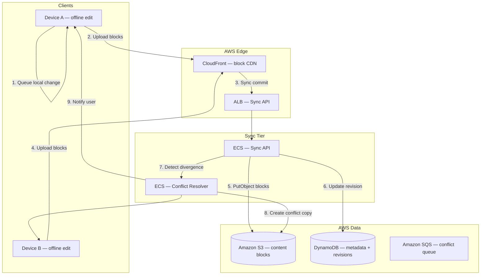

**Step-by-step flow:**

| Step | Action | Explanation |
|------|--------|-------------|
| **1** | Queue local change | Device A edits file offline; change queued locally. |
| **2** | Upload blocks | On reconnect, client uploads only changed 4MB blocks. |
| **3** | Sync commit | Sync API receives commit with parent revision ID. |
| **4** | Device B sync | Device B also uploads with same parent revision — divergent. |
| **5** | PutObject blocks | Content-addressed blocks stored in S3 (dedup). |
| **6** | Update revision | DynamoDB revision graph updated with vector clock. |
| **7** | Detect divergence | Server sees two children of same parent → conflict. |
| **8** | Conflict copy | Create `file (conflicted copy).doc` — no silent data loss. |
| **9** | Notify user | Push notification to both devices. |

## 3. Step-by-Step Interview Answer

### Minutes 0–8: Requirements

| Type | Detail |
|------|--------|
| **Availability offline** | Local edits queue; sync when connected |
| **Durability** | No silent data loss — both edits preserved |
| **UX** | User understands conflicts — "conflicted copy" vs automatic merge |
| **Scope** | Single file conflict (not real-time collab like Google Docs) |
| **Bandwidth** | Block-level delta sync — only changed 4MB blocks uploaded |

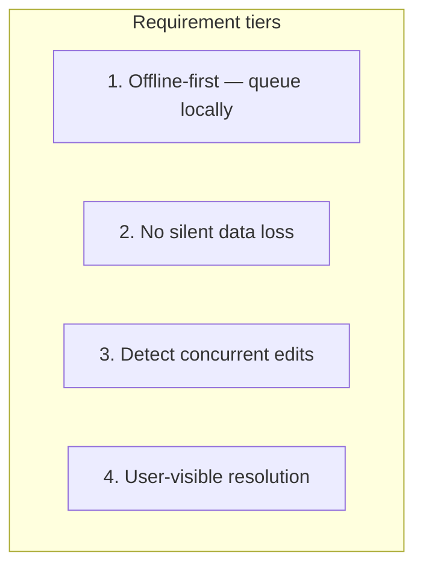

**Step-by-step flow:**

| Step | Action | Explanation |
|------|--------|-------------|
| **1** | Offline-first | Client works without network; changes queued. |
| **2** | No silent loss | Both divergent versions preserved — never overwrite silently. |
| **3** | Detect concurrency | Vector clock / revision graph detects divergent branches. |
| **4** | User-visible | Conflict copy created; user notified to merge manually. |

### Minutes 8–20: Metadata model and revision graph

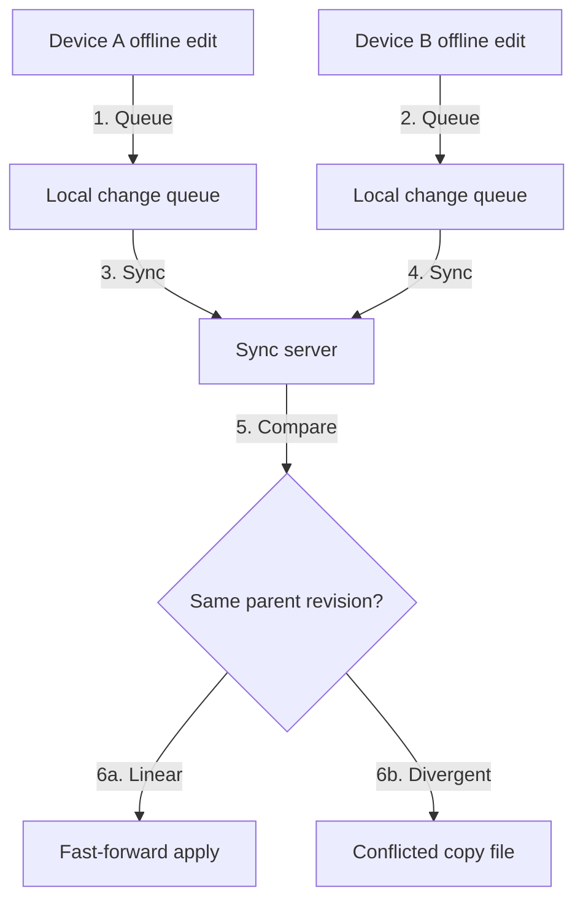

**Step-by-step flow:**

| Step | Action | Explanation |
|------|--------|-------------|
| **1–2** | Queue | Each device queues changes with parent revision ID. |
| **3–4** | Sync | On reconnect, client uploads blocks + metadata commit. |
| **5** | Compare | Server compares revision graph against parent. |
| **6a** | Linear | Single child of parent — fast-forward, no conflict. |
| **6b** | Divergent | Two children of same parent — **conflict detected**. |

**Revision graph (whiteboard):**

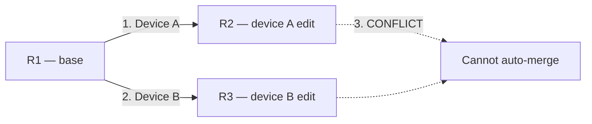

**Each file version metadata:**

| Field | Purpose |
|-------|---------|
| `revision_id` | Unique server-assigned revision |
| `parent_revision_id` | Previous revision — forms DAG |
| `vector_clock` | `{device_A: 3, device_B: 1}` — detect concurrency |
| `content_hash` | SHA-256 of block manifest |
| `block_list` | Ordered list of content-addressed block hashes |
| `modified_by` | Device / user ID |
| `modified_at` | Wall-clock timestamp (advisory only) |

**On sync:**

1. Client uploads changed blocks (content-addressed — dedup in S3).
2. Server compares revision graph.
3. If **linear history** → fast-forward apply.
4. If **divergent branches** → conflict detected → conflict copy.

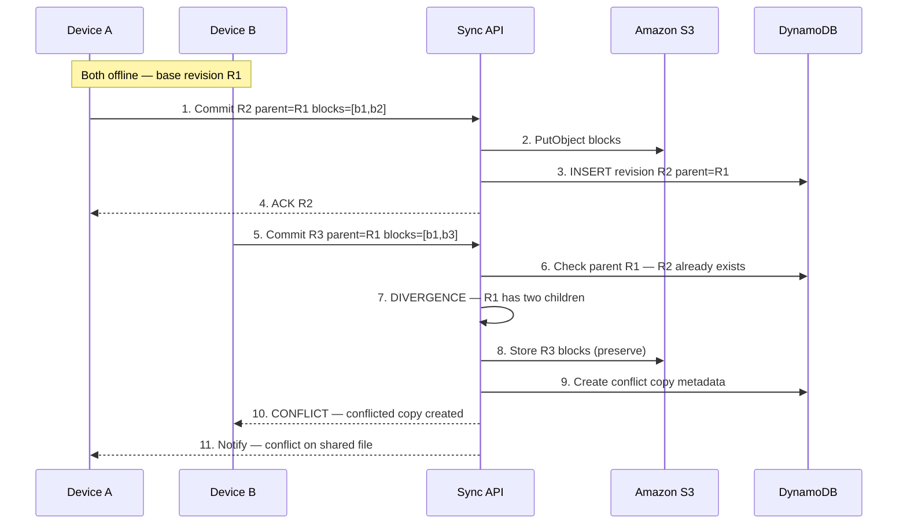

**Step-by-step flow:**

| Step | Action | Explanation |
|------|--------|-------------|
| **1** | Device A commit | Uploads changed blocks; claims parent=R1. |
| **2–3** | Store R2 | Blocks in S3; revision R2 in DynamoDB. |
| **4** | ACK R2 | Device A sync complete. |
| **5** | Device B commit | Also claims parent=R1 — divergent. |
| **6–7** | Divergence | R1 already has child R2; R3 is concurrent. |
| **8–9** | Preserve both | R3 blocks stored; conflict copy metadata created. |
| **10–11** | Notify | Both devices informed — no silent overwrite. |

### Minutes 20–35: Resolution strategies

| Strategy | When | Dropbox-style |
|----------|------|---------------|
| **Last-writer-wins** | Low stakes metadata | Risky for documents — silent data loss |
| **Conflict copies** | Arbitrary binary files | `file (conflicted copy).doc` |
| **Operational transform / CRDT** | Real-time collab | Different product (Dropbox Paper) |
| **App-level merge** | Structured data | JSON/text merge rules |
| **Three-way merge** | Text files with base | Git-style — optional for `.txt` |

**Principal answer:** For arbitrary binary files, **automatic merge is impossible** — create conflict copy + notify user. For structured types, app-specific merge.

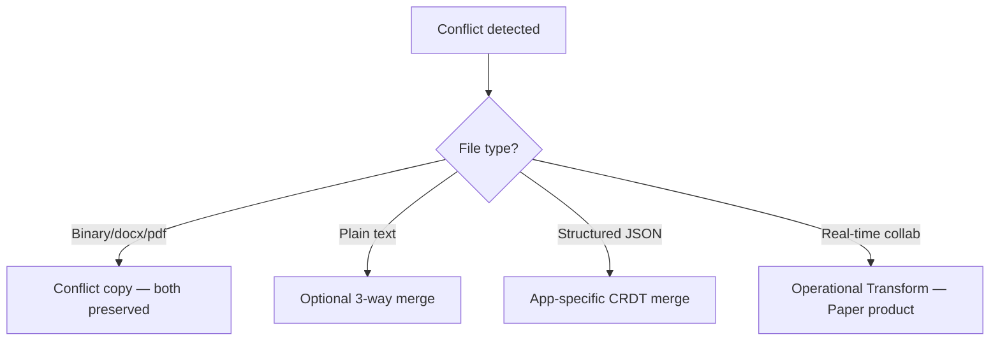

**Step-by-step flow:**

| Step | Action | Explanation |
|------|--------|-------------|
| **1** | Conflict detected | Divergent revision graph. |
| **2** | Binary | Create `file (conflicted copy).ext` — user merges manually. |
| **3** | Plain text | Optional automatic 3-way merge if low risk. |
| **4** | Structured | App knows schema — field-level merge. |
| **5** | Real-time | Different architecture — OT/CRDT, not sync conflict. |

### Minutes 35–45: Interview depth

| Topic | Detail |
|-------|--------|
| **Block-level sync** | 4MB blocks; content-addressed; only changed blocks uploaded |
| **Vector clocks** | Detect concurrency without central sequencer |
| **Bandwidth** | Edit 1KB in 1GB file → upload 1 block (~4MB max), not 1GB |
| **Security** | Client-side encryption — server sees ciphertext; conflict at metadata layer |
| **Garbage collection** | Orphan blocks swept after revision GC |

**Block-level sync:**

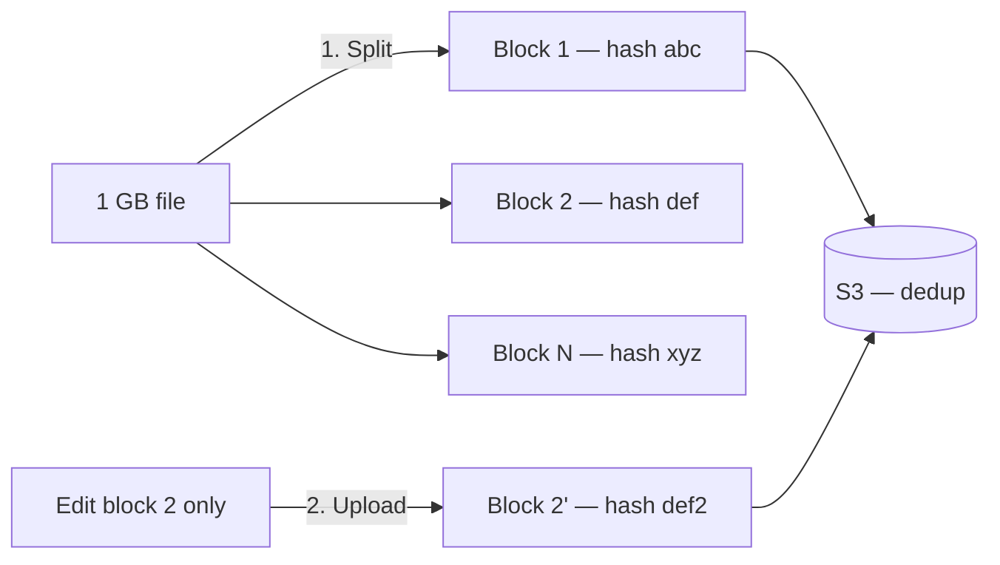

**Capacity math:**

| Metric | Value |
|--------|-------|
| Block size | 4 MB |
| Dedup ratio | ~30% storage saved via content addressing |
| Metadata ops/sync | ~10 per file commit |
| Conflict rate | ~0.1% of sync commits (multi-device users) |

---

## 4. Whiteboard Guide

1. Draw **revision graph**: R1 → R2 (device A), R1 → R3 (device B) → CONFLICT
2. Show **block-level sync**: file split into hashed blocks; only changed block uploaded
3. Label **conflict copy** resolution path
4. Contrast with **Google Docs OT** — real-time vs async sync

### AWS whiteboard layout

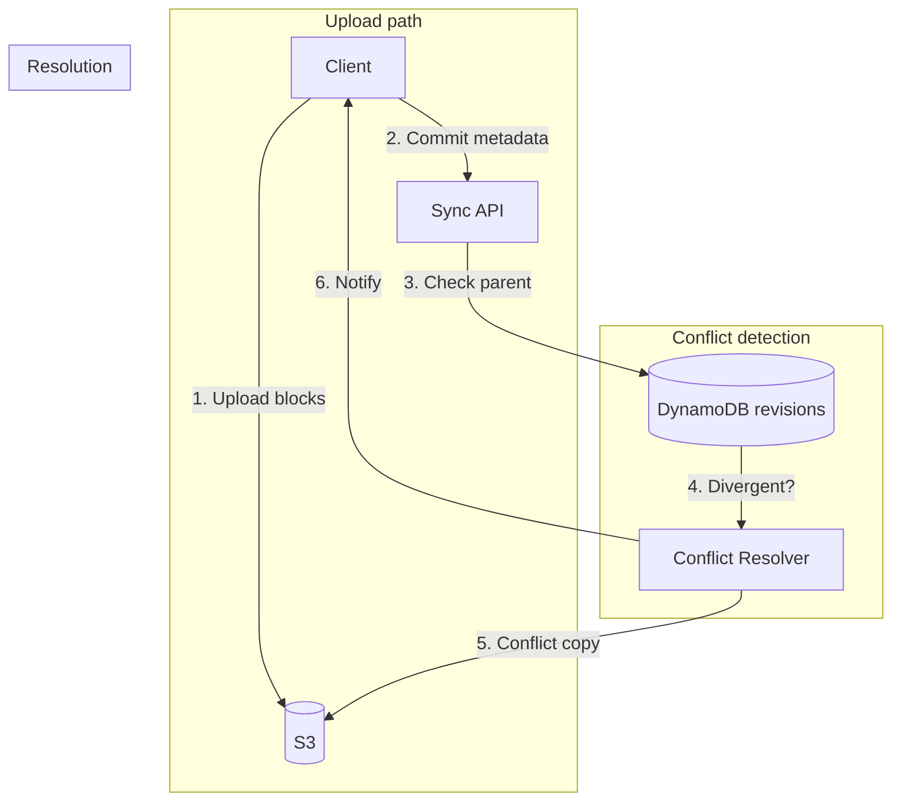

**Step-by-step flow:**

| Step | Action | Explanation |
|------|--------|-------------|
| **1** | Upload blocks | Content-addressed to S3. |
| **2** | Commit metadata | Revision with parent ID to DynamoDB. |
| **3** | Check parent | Single child = fast-forward. |
| **4** | Divergent | Two children = conflict. |
| **5** | Conflict copy | Both versions preserved in S3. |
| **6** | Notify | User informed on all devices. |

---

## 5. Principal-Level Signals

- **Automatic merge impossible** for arbitrary binary — conflict copy is correct
- **Vector clocks** detect concurrency — not just timestamps
- **Block-level sync** — bandwidth efficiency; conflicts at metadata layer
- **No silent data loss** — both versions always preserved
- **Distinguishes sync conflict** from **real-time collab** (OT/CRDT)
- **Client-side encryption** — server conflict detection on metadata only

## 6. Red Flags

- Last-writer-wins on documents — silent data loss
- Full file re-upload on every edit — bandwidth disaster
- Timestamp-only conflict detection — clock skew causes wrong merges
- Automatic merge of binary files — corrupts content
- No user notification on conflict — user discovers days later

## 7. Follow-Up Questions

| Question | Strong answer |
|----------|---------------|
| Dropbox vs Google Docs? | Dropbox: async sync + conflict copies; Docs: OT real-time merge |
| Vector clock vs revision ID? | Revision ID for linear; vector clock detects concurrent branches |
| Delete conflict? | Tombstone revision; propagate delete; handle delete vs edit conflict |
| Shared folder conflict? | Same mechanism; notify all folder members |
| Client-side encryption? | Server sees encrypted blocks + metadata; conflict copy still works |

## 8. Related Study

- [File Storage System](/docs/system-design/file-storage-system)
- [Conflict Resolution](/docs/replication/conflict-resolution)
- [Vector Clocks](/docs/time-ordering-and-coordination/vector-clocks)
- Lab: [Vector clocks](/docs/time-ordering-and-coordination/vector-clocks#25-hands-on-exercise) on **`:8097`**

## 9. Practice Drill

Compare Dropbox conflict model vs Google Docs OT in 10 minutes. Whiteboard revision graph R1→R2, R1→R3 from memory.

---

## 10. Production High-Level Design

### 10.1 Architecture diagram index

| Section | Topic |
|---------|-------|
| [§2](#aws-deployment-context) | End-to-end AWS deployment |
| [§3](#minutes-820-metadata-model-and-revision-graph) | Revision graph + conflict detection |
| [§10.2](#102-system-context-c4-level-1) | C4 logical context |
| [§10.3](#103-aws-production-architecture) | Full stack |
| [§10.4](#104-block-storage-model) | Content-addressed blocks in S3 |
| [§11.4](#114-sync-commit-handler--step-by-step) | Sync commit sequence |
| [§11.5](#115-conflict-resolution-handler) | Conflict copy creation |
| [§11.6](#116-offline-client-queue) | Local change queue |
| [§12](#12-hadr-and-durability) | S3 durability + DynamoDB HA |
| [§13](#13-observability-and-operations) | Metrics and alerts |
| [§14](#14-implementation-roadmap) | 8-week rollout |
| [§15](#15-testing-strategy) | Conflict scenario tests |
| [§16](#16-architecture-review-checklist) | Production readiness |

### 10.2 System context (C4 Level 1)

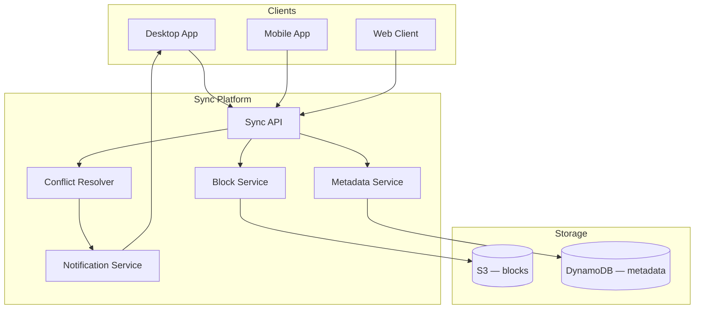

### 10.3 AWS production architecture

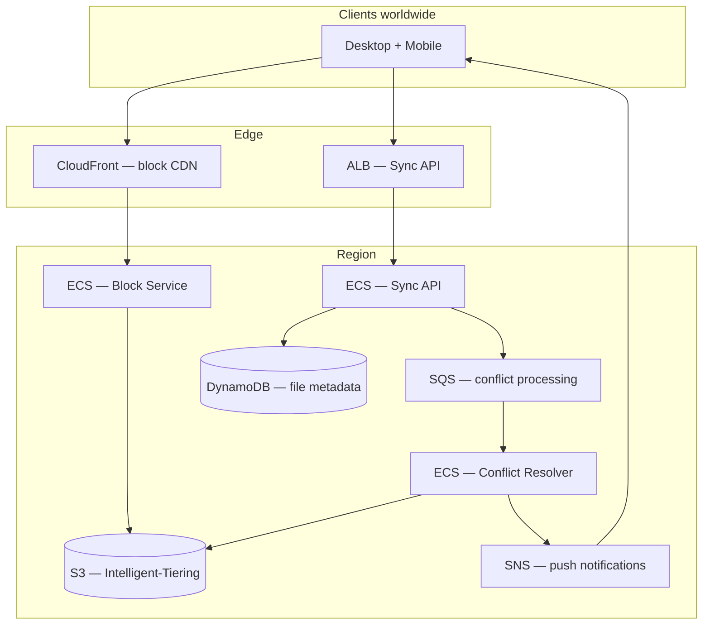

| AWS component | Sync responsibility |
|---------------|---------------------|
| **S3** | Content-addressed blocks; 11 nines durability |
| **DynamoDB** | Revision graph; file metadata; conditional writes |
| **CloudFront** | Block CDN — reduce upload/download latency |
| **ECS Sync API** | Commit handler; divergence detection |
| **SQS** | Async conflict resolution — don't block sync path |
| **SNS** | Push conflict notifications to devices |

### 10.4 Block storage model

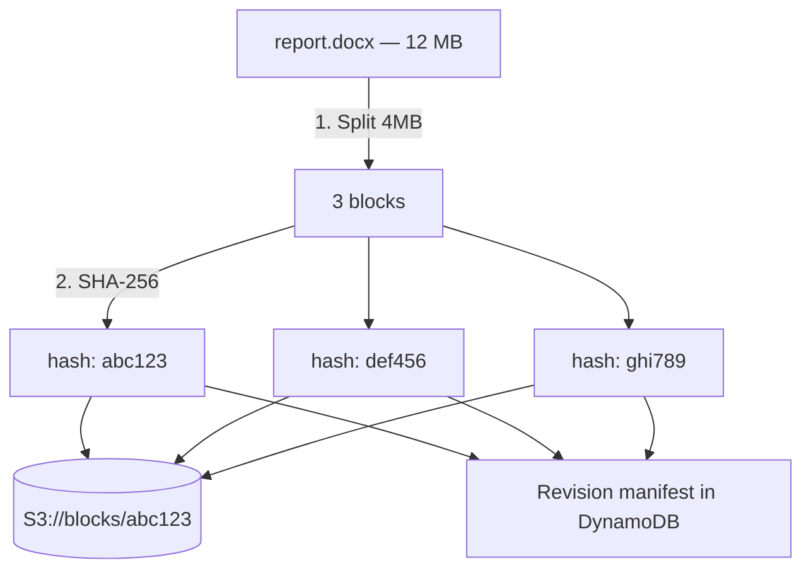

**Step-by-step flow:**

| Step | Action | Explanation |
|------|--------|-------------|
| **1** | Split 4MB | File divided into fixed-size blocks. |
| **2** | SHA-256 | Each block content-addressed. |
| **3** | S3 store | Dedup — identical blocks stored once. |
| **4** | Manifest | Ordered block list in revision metadata. |

---

## 11. Production Low-Level Design

### 11.1 DynamoDB metadata schema

**Table: FileRevisions**

```json
{
  "file_id": "f_abc123",
  "revision_id": "rev_002",
  "parent_revision_id": "rev_001",
  "vector_clock": {"device_A": 2, "device_B": 1},
  "content_hash": "sha256:manifest_hash",
  "block_list": ["abc123", "def456_v2", "ghi789"],
  "file_name": "report.docx",
  "modified_by": "device_A",
  "modified_at": "2026-07-28T22:00:00Z",
  "is_conflict_copy": false,
  "conflict_of_revision": null
}
```

**GSI: `parent_revision_id-index`** — find all children of a revision (divergence check).

### 11.2 Sync commit API

**Endpoint:** `POST /v1/files/{file_id}/commit`

```json
{
  "parent_revision_id": "rev_001",
  "vector_clock": {"device_A": 2},
  "block_list": ["abc123", "def456_v2", "ghi789"],
  "device_id": "device_A",
  "client_commit_id": "cc_8f3a"
}
```

**Response (success):**

```json
{
  "revision_id": "rev_002",
  "status": "applied"
}
```

**Response (conflict):**

```json
{
  "revision_id": "rev_003",
  "status": "conflict",
  "conflict_copy_path": "/report (conflicted copy).docx",
  "conflicting_revision": "rev_002"
}
```

### 11.3 Sync commit handler — step-by-step

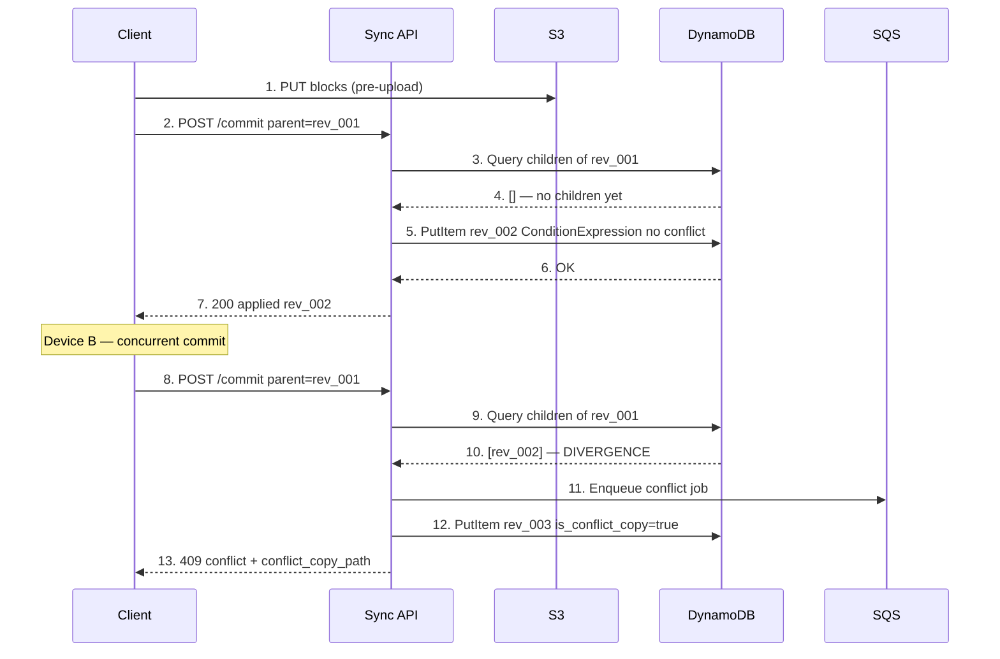

**Handler pseudocode:**

```python
def commit_revision(file_id: str, commit: CommitRequest) -> CommitResponse:
    # Step 1: Idempotency
    if existing := ddb.get_client_commit(commit.client_commit_id):
        return existing

    # Step 2: Check for divergence
    siblings = ddb.query_children(commit.parent_revision_id)
    if siblings:
        # DIVERGENCE — concurrent edit detected
        conflict_rev = create_conflict_copy(file_id, commit, siblings[0])
        notify_devices(file_id, conflict_rev)
        return CommitResponse(status="conflict", revision_id=conflict_rev.id)

    # Step 3: Linear fast-forward
    new_rev = ddb.put_revision(
        file_id=file_id,
        parent=commit.parent_revision_id,
        vector_clock=merge_vector_clock(commit),
        block_list=commit.block_list,
        condition=ParentHasNoChildren(commit.parent_revision_id),
    )
    return CommitResponse(status="applied", revision_id=new_rev.id)
```

### 11.4 Conflict resolution handler

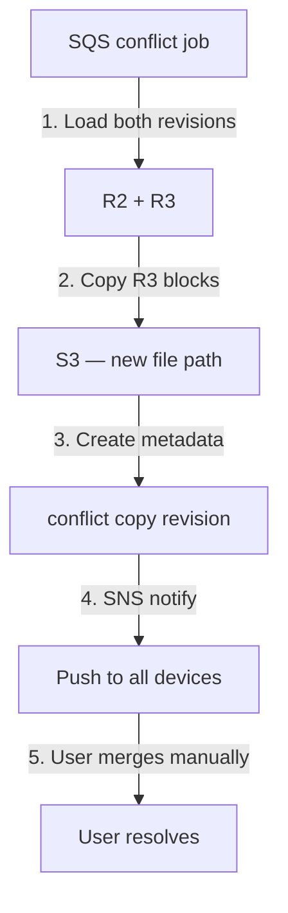

**Conflict copy naming:**

```
Original:     /Projects/report.docx
Conflict:     /Projects/report (conflicted copy 2026-07-28).docx
```

**Step-by-step flow:**

| Step | Action | Explanation |
|------|--------|-------------|
| **1** | Load both | Fetch R2 (device A) and R3 (device B) metadata. |
| **2** | Copy blocks | R3 blocks copied to new S3 path — preserved. |
| **3** | Create metadata | New file entry with `is_conflict_copy=true`. |
| **4** | Notify | SNS push to all folder members. |
| **5** | User merges | Manual merge in app — product decision. |

### 11.5 Offline client queue

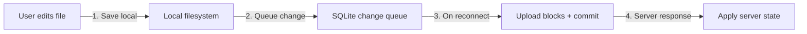

**Local queue schema (SQLite):**

```sql
CREATE TABLE pending_changes (
    id              INTEGER PRIMARY KEY,
    file_path       TEXT NOT NULL,
    parent_revision TEXT NOT NULL,
    block_hashes    TEXT NOT NULL,  -- JSON array
    vector_clock    TEXT NOT NULL,  -- JSON
    created_at      INTEGER NOT NULL,
    retry_count     INTEGER DEFAULT 0
);
```

**Step-by-step flow:**

| Step | Action | Explanation |
|------|--------|-------------|
| **1** | Save local | Edit saved to local filesystem immediately. |
| **2** | Queue change | Metadata queued in SQLite — survives app restart. |
| **3** | On reconnect | Upload blocks then commit in order. |
| **4** | Apply server state | Handle conflict or fast-forward response. |

### 11.6 Vector clock merge rules

```python
def is_concurrent(clock_a: dict, clock_b: dict) -> bool:
    """True if neither clock dominates the other."""
    a_dominates = all(clock_a.get(k, 0) >= clock_b.get(k, 0) for k in set(clock_a) | set(clock_b))
    b_dominates = all(clock_b.get(k, 0) >= clock_a.get(k, 0) for k in set(clock_a) | set(clock_b))
    return not a_dominates and not b_dominates

def merge_vector_clock(local: dict, server: dict) -> dict:
    keys = set(local) | set(server)
    return {k: max(local.get(k, 0), server.get(k, 0)) + (1 if k in local else 0) for k in keys}
```

| Scenario | Vector clocks | Result |
|----------|---------------|--------|
| A then B (sequential) | A: {A:2}, B: {A:2,B:1} | B dominates A — fast-forward |
| A and B concurrent | A: {A:2}, B: {B:2} | Concurrent — conflict |
| Same device retry | Same clock | Idempotent — dedup by client_commit_id |

---

## 12. HA/DR and Durability

| Component | Durability | HA |
|-----------|------------|-----|
| **S3 blocks** | 11 nines; cross-AZ replication | 99.99% availability |
| **DynamoDB metadata** | Multi-AZ; point-in-time recovery | 99.99% |
| **Revision graph** | No single point of loss — both branches preserved | |
| **Client local queue** | Device-local SQLite — user responsible for backup | |

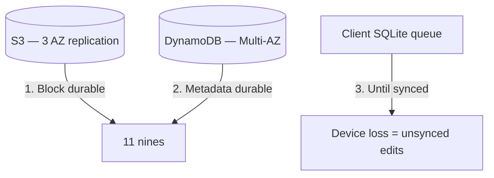

---

## 13. Observability and Operations

| Metric | Alert threshold |
|--------|-----------------|
| `sync.conflict_rate` | &gt; 1% of commits — UX issue |
| `sync.commit_latency_p99` | &gt; 2s |
| `block.upload_failure_rate` | &gt; 0.1% |
| `offline_queue_depth` per device | &gt; 1000 changes — stuck sync |
| `orphan_block_count` | Growing — GC job failure |

**Structured log:**

```json
{
  "file_id": "f_abc123",
  "event": "conflict_detected",
  "parent_revision": "rev_001",
  "sibling_revision": "rev_002",
  "new_revision": "rev_003",
  "devices": ["device_A", "device_B"],
  "resolution": "conflict_copy"
}
```

---

## 14. Implementation Roadmap (8-Week Rollout)

| Week | Deliverable |
|------|-------------|
| 1 | S3 block storage + content addressing |
| 2 | DynamoDB revision graph schema |
| 3 | Sync commit API + fast-forward path |
| 4 | Divergence detection + vector clocks |
| 5 | Conflict copy creation + SNS notifications |
| 6 | Offline client queue (SQLite) |
| 7 | Block-level delta sync in desktop client |
| 8 | Conflict rate dashboards + GC job |

---

## 15. Testing Strategy

| Test | Pass criteria |
|------|---------------|
| Sequential edits A then B | Fast-forward; no conflict |
| Concurrent offline edits | Conflict copy created; both preserved |
| Same client_commit_id retry | Idempotent — same revision returned |
| Edit 1KB in 1GB file | Only 1 block uploaded |
| Delete vs edit conflict | Tombstone wins or conflict copy — policy defined |
| Device loss before sync | Local queue lost — document limitation |

---

## 16. Architecture Review Checklist

| # | Gate | Status |
|---|------|--------|
| 1 | Block-level sync — not full file re-upload | ☐ |
| 2 | Revision graph with parent_revision_id | ☐ |
| 3 | Vector clock concurrency detection | ☐ |
| 4 | Conflict copy — no silent data loss | ☐ |
| 5 | SNS notification on conflict | ☐ |
| 6 | Offline SQLite change queue | ☐ |
| 7 | client_commit_id idempotency | ☐ |
| 8 | S3 block GC for orphan blocks | ☐ |
| 9 | Conflict rate dashboard | ☐ |
| 10 | Distinguish sync conflict from real-time collab scope | ☐ |

---

## 17. Related Study

- [File Storage System](/docs/system-design/file-storage-system)
- [Conflict Resolution](/docs/replication/conflict-resolution)
- [Vector Clocks](/docs/time-ordering-and-coordination/vector-clocks)
- [Amazon DynamoDB Consistency](/docs/real-world-scenarios/amazon-dynamodb-eventual-consistency) — offline cart sync parallels
- Lab: [Vector clocks](/docs/time-ordering-and-coordination/vector-clocks#25-hands-on-exercise) on **`:8097`**
