# Scenario: Google Spanner TrueTime

> **Diagram convention:** Arrows and messages are labeled **1, 2, 3…** to show processing order. Each diagram is followed by a **Step-by-step flow** table explaining every numbered step.

## 1. The Interview Question

> "How does Google Spanner provide external consistency globally, and what does TrueTime actually guarantee?"

## 2. Real-World Context

| Dimension | Detail |
|-----------|--------|
| **Company / system** | [Google Spanner](https://research.google/pubs/spanner/) — globally distributed SQL; [Cloud Spanner](https://cloud.google.com/spanner) on GCP |
| **Scale** | Multi-datacenter; TrueTime via GPS + atomic clocks; external consistency at global scale |
| **Why architects care** | Rare example of **strong global consistency** — with latency, cost, and clock infrastructure tradeoffs |
| **Public references** | Spanner paper (Corbett et al., OSDI 2012); TrueTime API |

### GCP deployment context

Typical global OLTP workload on **Google Cloud Spanner**: multi-region instance spanning `us-east1`, `us-central1`, `europe-west1`; application on **GKE** or **Cloud Run**; **TrueTime** provided by GCP infrastructure (GPS + atomic clocks in Google DCs); **VPC** private access; **Cloud Monitoring** for commit latency and replication lag; use cases: global inventory, financial ledgers, identity, multi-region SaaS metadata.

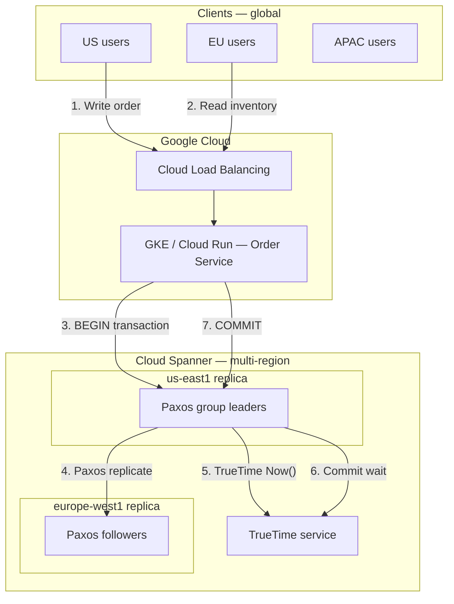

**Step-by-step flow:**

| Step | Action | Explanation |
|------|--------|-------------|
| **1** | Write order | US client deducts inventory in global transaction. |
| **2** | Read inventory | EU client reads stock — sees consistent global state. |
| **3** | BEGIN transaction | App opens read-write transaction on Spanner. |
| **4** | Paxos replicate | Write replicates synchronously across regions in Paxos quorum. |
| **5** | TrueTime Now() | Leader obtains time interval `[earliest, latest]`. |
| **6** | Commit wait | Wait until `TT.now().earliest > commit_timestamp` — external consistency. |
| **7** | COMMIT | Transaction ack — globally externally consistent. |

## 3. Step-by-Step Interview Answer

### Minutes 0–5: Define external consistency

- Transactions appear to execute in **real-time order** — if T1 commits before T2 starts, T2 sees T1's writes.
- Stronger than **serializability** alone — serializable order may not match wall-clock order.
- Relates to **linearizability** across clients with real-time constraint.

| Guarantee | Definition | Spanner provides? |
|-----------|------------|-------------------|
| **Serializability** | Transactions appear in some total order | Yes |
| **Linearizability** | Operations appear instantaneous at some point between call and response | Yes (per key) |
| **External consistency** | Serializable order matches real-time order | Yes — via TrueTime + commit wait |

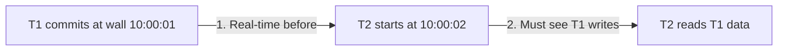

**Step-by-step flow:**

| Step | Action | Explanation |
|------|--------|-------------|
| **1** | Real-time before | T1 fully committed before T2 began (wall clock). |
| **2** | Must see T1 | External consistency — T2's snapshot includes T1. |

### Minutes 5–15: Mechanism

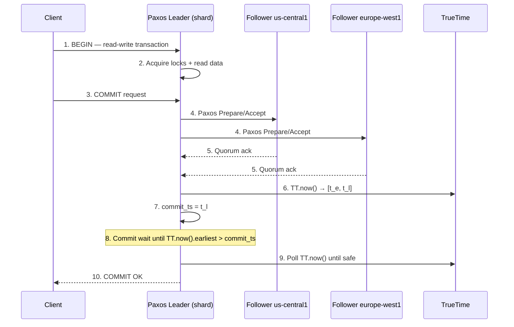

**Step-by-step flow:**

| Step | Action | Explanation |
|------|--------|-------------|
| **1** | BEGIN | Client opens read-write transaction. |
| **2** | Acquire locks | Leader locks rows; reads at transaction timestamp. |
| **3** | COMMIT request | Client requests commit. |
| **4–5** | Paxos quorum | Write replicates to majority of replicas synchronously. |
| **6** | TT.now() | TrueTime returns interval `[earliest, latest]` — uncertainty ε. |
| **7** | commit_ts | Assign commit timestamp = `latest` from TrueTime. |
| **8** | Commit wait | **Critical** — wait until uncertainty window passes commit_ts. |
| **9** | Poll until safe | `TT.now().earliest > commit_ts` — no clock skew violation. |
| **10** | COMMIT OK | External consistency guaranteed for this transaction. |

**Architecture layers:**

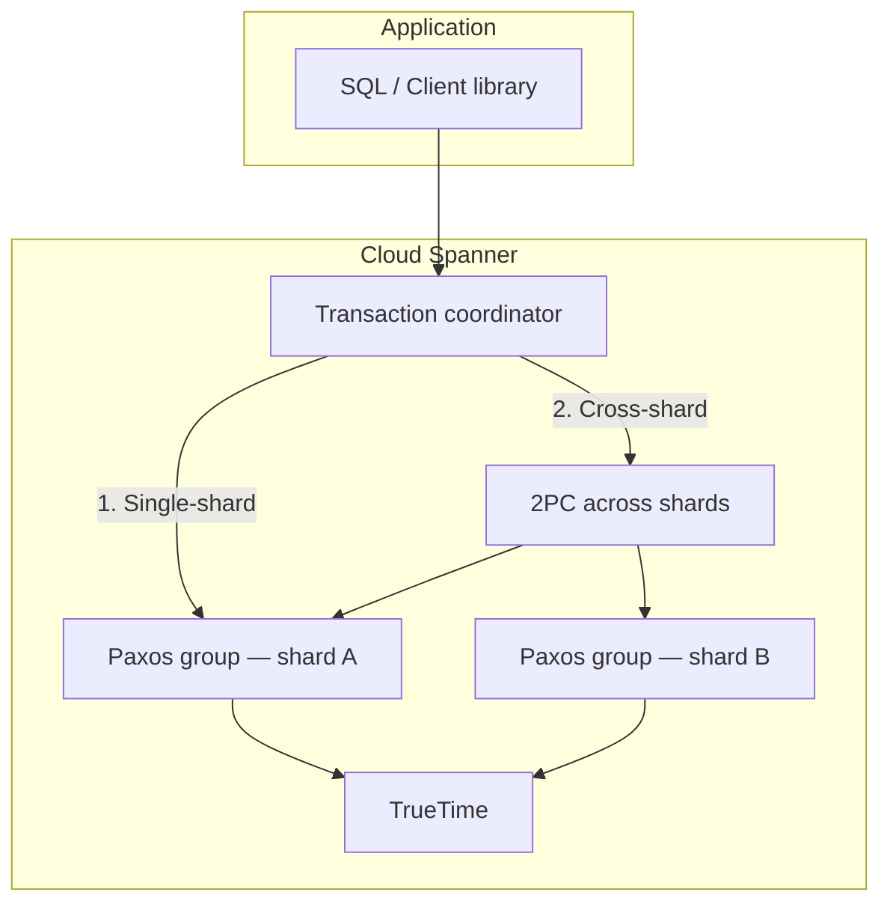

**Step-by-step flow:**

| Step | Action | Explanation |
|------|--------|-------------|
| **1** | Single-shard | One Paxos group — local commit + commit wait. |
| **2** | Cross-shard | 2PC coordinator + Paxos commit on each shard + commit wait. |

| Component | Role |
|-----------|------|
| **Paxos group** | Per-shard replication; leader handles writes; quorum durability |
| **2PC coordinator** | Cross-shard distributed transactions |
| **TrueTime** | Global time with bounded uncertainty ε (~1–7ms in Google DCs) |
| **Commit wait** | Delay ack until `TT.now().earliest > commit_ts` |

### Minutes 15–30: What TrueTime is NOT

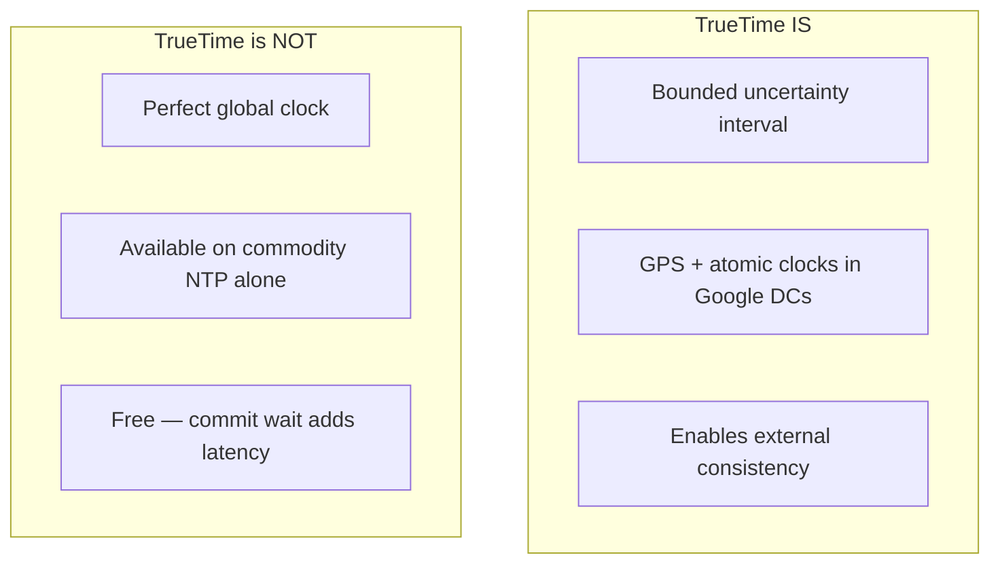

**Step-by-step flow:**

| Claim | Reality |
|-------|---------|
| **Perfect clock** | Uncertainty ε exists — typically 1–7ms in Google DCs |
| **NTP substitute** | NTP drift can be 10–100ms — commit wait would be unusable |
| **Zero latency cost** | Commit wait adds ~ε to every write — 8–15ms cross-region typical |
| **Magic** | Requires GPS antennas, atomic clocks, ops discipline per DC |

**Why NTP fails:**

| Clock source | Typical uncertainty ε | Commit wait impact |
|--------------|----------------------|-------------------|
| **TrueTime (Google DC)** | 1–7 ms | Acceptable for global OLTP |
| **NTP (commodity)** | 10–100+ ms | Write latency unacceptable |
| **HLC (CockroachDB)** | Logical — no wall clock | External consistency not guaranteed |

### Minutes 30–45: When to use / alternatives

| Use Spanner when | Use alternative when |
|------------------|---------------------|
| Global strong consistency required | Eventual consistency OK (DynamoDB, Cassandra) |
| SQL + horizontal scale globally | Single-region Postgres sufficient |
| Financial / inventory correctness | Sub-10ms local writes required |
| Budget for cross-region write latency | Cost-sensitive; PA/EL acceptable |

**Interview comparison:**

| System | Consistency | Clock mechanism | Write latency |
|--------|-------------|-----------------|---------------|
| **Cloud Spanner** | External consistency | TrueTime + commit wait | 10–50ms multi-region |
| **CockroachDB** | Serializable | Hybrid Logical Clock (HLC) | Lower; no external consistency |
| **Aurora Global** | Regional strong | Per-region; async cross-region | Low in-region; stale cross-region |
| **DynamoDB Global Tables** | Eventual cross-region | Last-writer-wins | Single-digit ms |
| **Calvin** | Serializable | Global sequencer | High throughput; different model |

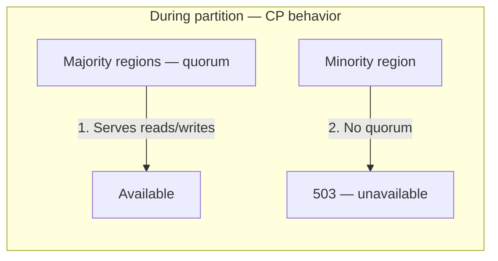

**Step-by-step flow:**

| Step | Action | Explanation |
|------|--------|-------------|
| **1** | Majority serves | Paxos quorum in 2 of 3 regions — reads/writes continue. |
| **2** | Minority rejects | No quorum — **sacrifices availability** for consistency (CP). |

---

## 4. Whiteboard Guide

1. Draw **Paxos group** per shard with leader + followers across 3 regions
2. Label **TrueTime** box with `[earliest, latest]` interval
3. Draw **commit wait** timeline: assign `commit_ts`, wait until `earliest > commit_ts`
4. Show **2PC** arrow across two shards for distributed transaction
5. Compare to **NTP** with large ε — why commit wait fails

### GCP whiteboard layout

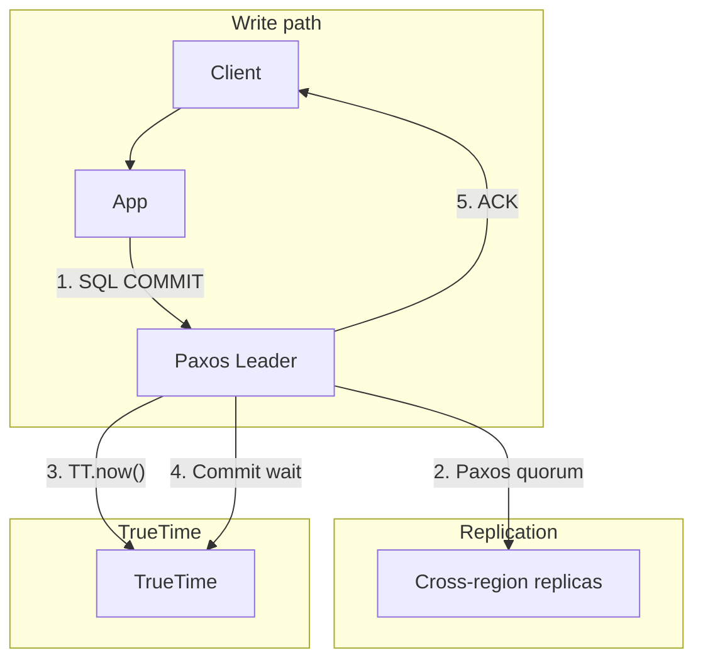

**Step-by-step flow:**

| Step | Action | Explanation |
|------|--------|-------------|
| **1** | SQL COMMIT | Application commits distributed transaction. |
| **2** | Paxos quorum | Synchronous replication to majority. |
| **3** | TT.now() | Obtain time interval for commit timestamp. |
| **4** | Commit wait | Wait for uncertainty window to pass. |
| **5** | ACK | Externally consistent commit confirmed. |

---

## 5. Principal-Level Signals

- Explains **commit wait** without hand-waving — `TT.now().earliest > commit_ts`
- States **uncertainty interval ε** honestly — not a perfect clock
- Names **latency cost** — commit wait + WAN Paxos RTT per write
- Compares to **HLC** (CockroachDB) when TrueTime unavailable
- Distinguishes **external consistency** from **serializability**
- Knows **CP during partition** — minority region unavailable

## 6. Red Flags

- "Spanner is CA" — CP when partitioned; minority loses quorum
- "NTP is good enough for commit wait" — ε too large; writes stall
- "Spanner is fast" — global writes 10–50ms; not for hot-row microsecond latency
- Confuse **bounded staleness reads** with strong reads — product offers both
- Ignore **2PC cross-shard** latency for multi-shard transactions

## 7. Follow-Up Questions

| Question | Strong answer |
|----------|---------------|
| Why commit wait? | Ensures no transaction commits with timestamp in the past relative to real time |
| What if GPS fails? | TrueTime ε widens; commit wait increases; ops alert |
| CockroachDB vs Spanner? | Cockroach: HLC, serializable, no external consistency; lower latency |
| Hot row problem? | Spanner doesn't solve hot keys — shard design + application patterns |
| Read-only transaction? | Snapshot at read timestamp; no commit wait; much faster |

## 8. Related Study

- [Google Spanner](/docs/distributed-databases/google-spanner)
- [Physical and Logical Time](/docs/time-ordering-and-coordination/physical-and-logical-time)
- [PACELC — Spanner PC/EC](/docs/consistency/pacelc)

## 9. Practice Drill

Whiteboard Spanner commit timeline (steps 1–10) in 10 minutes. Answer: "Why can't you use NTP instead of TrueTime?"

---

## 10. Production High-Level Design

### 10.1 Architecture diagram index

| Section | Topic |
|---------|-------|
| [§2](#gcp-deployment-context) | GCP multi-region deployment |
| [§3](#minutes-515-mechanism) | Paxos + TrueTime commit sequence |
| [§10.2](#102-system-context--global-inventory) | Global inventory use case |
| [§10.3](#103-cloud-spanner-instance-topology) | Instance + replica placement |
| [§10.4](#104-read-vs-write-paths) | Strong vs bounded staleness reads |
| [§11.4](#114-inventory-deduction--step-by-step) | Cross-shard transaction sequence |
| [§11.5](#115-schema-and-sharding-design) | Schema + hot row mitigation |
| [§12](#12-hadr-and-failover) | Regional failure behavior |
| [§13](#13-observability-and-operations) | Metrics and alerts |
| [§14](#14-implementation-roadmap) | 6-week rollout |
| [§15](#15-testing-strategy) | Consistency + failover tests |
| [§16](#16-architecture-review-checklist) | Production readiness |

### 10.2 System context — global inventory

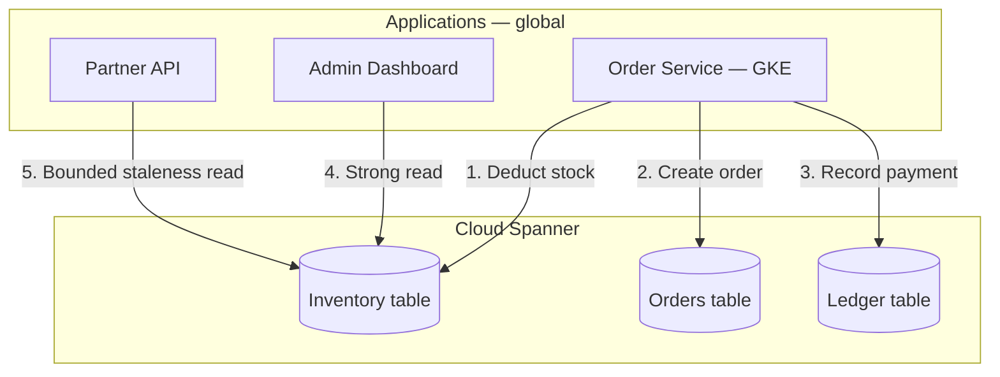

**Step-by-step flow:**

| Step | Action | Explanation |
|------|--------|-------------|
| **1** | Deduct stock | `UPDATE inventory SET qty = qty - 1 WHERE sku = X` in transaction. |
| **2** | Create order | Same transaction — atomic inventory + order. |
| **3** | Record payment | Cross-table ACID — no oversell. |
| **4** | Strong read | Admin sees exact global stock. |
| **5** | Bounded staleness | Partner API tolerates 10s stale for catalog browse. |

### 10.3 Cloud Spanner instance topology

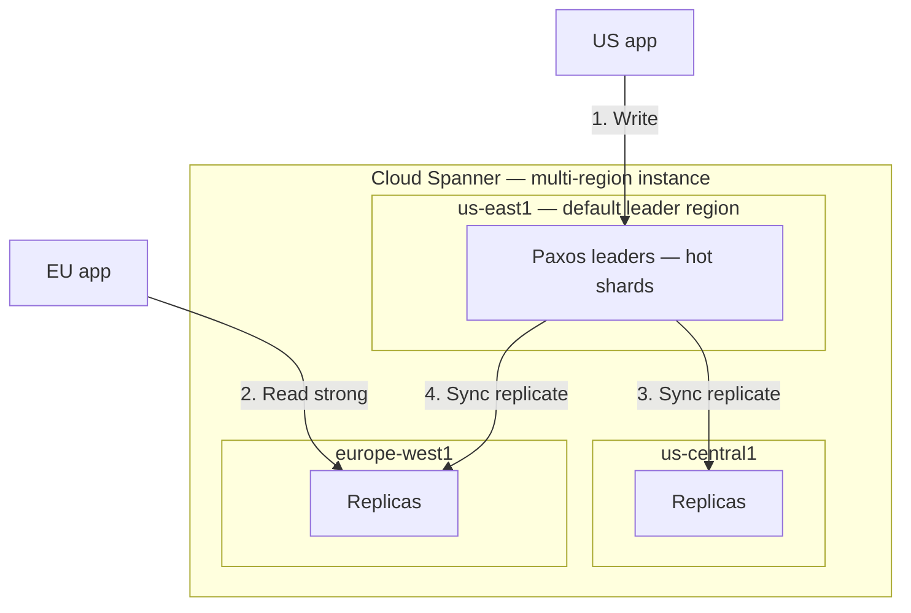

**Instance configuration:**

| Setting | Value | Rationale |
|---------|-------|-----------|
| Instance type | Multi-region | Global external consistency |
| Regions | us-east1, us-central1, europe-west1 | US + EU user base |
| Processing units | 1000+ | Scale with QPS |
| Default leader | us-east1 | Co-locate with primary write traffic |

**Step-by-step flow:**

| Step | Action | Explanation |
|------|--------|-------------|
| **1** | Write | US app writes to Paxos leader (may be in us-east1). |
| **2** | Read strong | EU app reads from local replica — still strong (Paxos quorum). |
| **3–4** | Sync replicate | Every write replicates before ack. |

### 10.4 Read vs write paths

| Read type | API | Latency | Consistency |
|-----------|-----|---------|-------------|
| **Strong read** | Default | Higher — latest commit | External consistency |
| **Bounded staleness** | `max_staleness=10s` | Lower — local replica | Stale up to 10s |
| **Stale read** | `exact_staleness` | Lowest | Point-in-time snapshot |
| **Read-only transaction** | `BEGIN TRANSACTION READ ONLY` | Fast — no locks | Snapshot isolation |

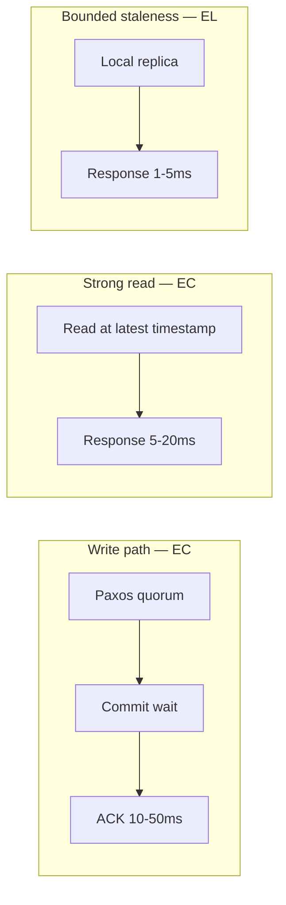

---

## 11. Production Low-Level Design

### 11.1 Schema and sharding design

```sql
CREATE TABLE Inventory (
    sku           STRING(64) NOT NULL,
    warehouse_id  STRING(32) NOT NULL,
    quantity      INT64 NOT NULL,
    version       INT64 NOT NULL,
    updated_at    TIMESTAMP NOT NULL OPTIONS (allow_commit_timestamp=true)
) PRIMARY KEY (sku, warehouse_id);

CREATE TABLE Orders (
    order_id      STRING(64) NOT NULL,
    sku           STRING(64) NOT NULL,
    quantity      INT64 NOT NULL,
    status        STRING(16) NOT NULL,
    created_at    TIMESTAMP NOT NULL OPTIONS (allow_commit_timestamp=true)
) PRIMARY KEY (order_id);

CREATE INDEX OrdersBySku ON Orders(sku, created_at DESC);
```

| Design choice | Rationale |
|---------------|-----------|
| `PRIMARY KEY (sku, warehouse_id)` | Co-locate inventory per SKU+warehouse — single-shard hot path |
| `allow_commit_timestamp=true` | TrueTime commit timestamp on `updated_at` |
| Interleaved tables | Parent-child same shard — single-shard transactions |

### 11.2 Hot row mitigation

| Problem | Mitigation |
|---------|------------|
| Single SKU global counter | Shard by `warehouse_id`; aggregate in app |
| Flash sale on one SKU | Pre-allocate inventory buckets per region |
| Write hotspot | Spanner split/merge; distribute PK hash prefix |

### 11.3 Client library — transaction pattern

```python
def deduct_inventory_and_create_order(sku: str, warehouse_id: str, qty: int, order_id: str):
    def execute_transaction(transaction):
        # Step 1: Read current stock (strong within transaction)
        row = transaction.execute_sql(
            "SELECT quantity FROM Inventory WHERE sku = @sku AND warehouse_id = @wh",
            params={"sku": sku, "wh": warehouse_id},
            request_options={"priority": spanner.RequestOptions.Priority.PRIORITY_HIGH},
        ).one()

        if row[0] < qty:
            raise InsufficientStockError(sku)

        # Step 2: Deduct inventory
        transaction.execute_update(
            "UPDATE Inventory SET quantity = quantity - @qty, "
            "updated_at = PENDING_COMMIT_TIMESTAMP() "
            "WHERE sku = @sku AND warehouse_id = @wh",
            params={"sku": sku, "wh": warehouse_id, "qty": qty},
        )

        # Step 3: Create order (same transaction — atomic)
        transaction.execute_update(
            "INSERT INTO Orders (order_id, sku, quantity, status, created_at) "
            "VALUES (@oid, @sku, @qty, 'pending', PENDING_COMMIT_TIMESTAMP())",
            params={"oid": order_id, "sku": sku, "qty": qty},
        )

    # Step 4: Commit — Paxos + TrueTime commit wait happens here
    database.run_in_transaction(execute_transaction)
```

### 11.4 Inventory deduction — step-by-step

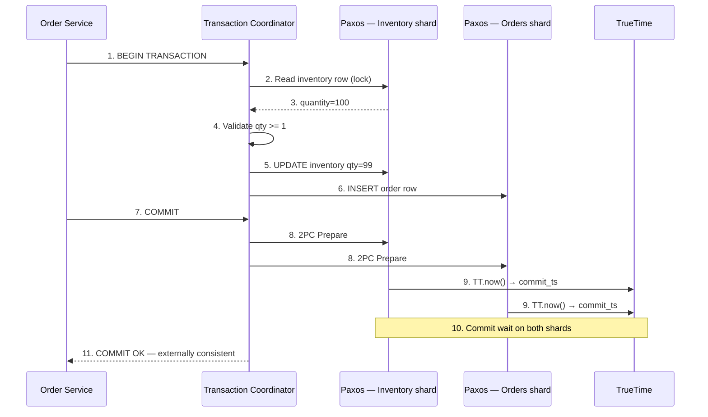

**Step-by-step flow:**

| Step | Action | Explanation |
|------|--------|-------------|
| **1** | BEGIN | Start read-write transaction. |
| **2–3** | Read inventory | Lock row; read current quantity. |
| **4** | Validate | Reject if insufficient stock. |
| **5–6** | Write | Update inventory + insert order. |
| **7** | COMMIT | Client requests commit. |
| **8** | 2PC Prepare | Cross-shard two-phase commit. |
| **9** | TT.now() | Assign commit timestamps on each shard. |
| **10** | Commit wait | Wait for TrueTime safe time on all shards. |
| **11** | COMMIT OK | Globally externally consistent — no oversell. |

### 11.5 Cross-shard vs single-shard

| Transaction scope | Mechanism | Latency |
|-------------------|-----------|---------|
| **Single shard** | Paxos commit + commit wait | ~10–20ms |
| **Cross-shard (2)** | 2PC + 2× Paxos + 2× commit wait | ~20–50ms |
| **Read-only** | Snapshot timestamp; no commit wait | ~5–10ms |

**Design goal:** Co-locate `Inventory` and `Orders` on same shard via interleaving when possible.

### 11.6 Bounded staleness read (catalog API)

```python
# Partner catalog API — EL acceptable
with database.snapshot(
    read_timestamp=spanner.TimestampBounds(max_staleness=datetime.timedelta(seconds=10))
) as snapshot:
    results = snapshot.execute_sql(
        "SELECT sku, quantity FROM Inventory WHERE warehouse_id = @wh",
        params={"wh": warehouse_id},
    )
```

| API | Staleness | Use case |
|-----|-----------|----------|
| Admin dashboard | Strong (default) | Exact stock count |
| Partner catalog | `max_staleness=10s` | Browse; oversell protected at checkout |
| Analytics export | `exact_staleness` | Point-in-time report |

---

## 12. HA/DR and Failover

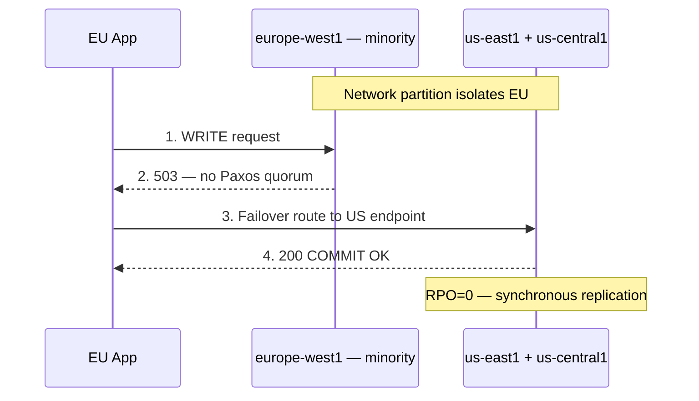

**Step-by-step flow:**

| Step | Action | Explanation |
|------|--------|-------------|
| **1** | WRITE to minority | EU region isolated from quorum. |
| **2** | 503 | No quorum — **fail closed** (CP behavior). |
| **3** | Failover route | App retries via US endpoint. |
| **4** | COMMIT OK | Majority quorum serves — RPO=0. |

| Failure | RPO | RTO | Behavior |
|---------|-----|-----|----------|
| Single replica crash | 0 | Seconds | Paxos elects new leader |
| AZ failure | 0 | Minutes | Quorum in remaining AZs |
| Region partition (minority) | 0 | N/A | Minority unavailable until heal |
| Full region loss (majority) | 0 | Minutes | Remaining regions serve if quorum |

---

## 13. Observability and Operations

| Metric | Alert threshold |
|--------|-----------------|
| `spanner/transaction_stat.total.commit_latency` p99 | > 100ms |
| `spanner/transaction_stat.total.abort_count` | Spike — hot row contention |
| `spanner/query_stat.total.execution_count` | Capacity planning |
| TrueTime ε (internal) | > 10ms — GPS/atomic clock issue |
| `2pc_abort_rate` | > 1% — cross-shard contention |

**Structured log:**

```json
{
  "transaction_id": "txn_abc",
  "operation": "deduct_inventory",
  "shards_touched": 2,
  "commit_latency_ms": 34,
  "commit_timestamp": "2026-07-28T21:52:00.123Z",
  "abort_reason": null
}
```

### Runbook — elevated commit latency

| Step | Action |
|------|--------|
| **1** | Check `commit_latency` p99 in Cloud Monitoring |
| **2** | Identify hot rows — `abort_count` by table |
| **3** | Review cross-shard transaction ratio |
| **4** | Consider interleaved schema or PK redesign |
| **5** | Scale processing units if CPU-bound |
| **6** | Check TrueTime ε if commit wait dominates |

---

## 14. Implementation Roadmap (6-Week Rollout)

| Week | Deliverable |
|------|-------------|
| 1 | Cloud Spanner instance provisioning (multi-region) |
| 2 | Schema design + interleaved tables |
| 3 | Order service integration — single-shard transactions |
| 4 | Cross-shard 2PC paths + latency testing |
| 5 | Bounded staleness reads for catalog API |
| 6 | Failover drill + commit latency dashboards |

---

## 15. Testing Strategy

| Test | Pass criteria |
|------|---------------|
| Concurrent deduct same SKU | No oversell — quantity never negative |
| T1 commits before T2 starts | T2 sees T1 writes (external consistency) |
| Minority region partition | Writes fail closed (503) |
| Bounded staleness read | Response &lt; 10s stale per config |
| Cross-shard transaction | Atomic commit or full rollback |
| Hot row 1K TPS | Abort rate &lt; 5%; latency p99 &lt; 100ms |

---

## 16. Architecture Review Checklist

| # | Gate | Status |
|---|------|--------|
| 1 | Multi-region instance for global consistency requirement | ☐ |
| 2 | PK design minimizes cross-shard transactions | ☐ |
| 3 | Hot rows identified — mitigation plan | ☐ |
| 4 | Strong reads for checkout; bounded staleness for browse | ☐ |
| 5 | `commit_latency` p99 dashboard + alert | ☐ |
| 6 | Minority partition fail-closed tested | ☐ |
| 7 | Processing units sized for peak QPS | ☐ |
| 8 | Interleaved tables for parent-child atomicity | ☐ |
| 9 | Compare vs Cockroach/Aurora — decision documented in ADR | ☐ |
| 10 | TrueTime / commit wait latency accepted by product SLO | ☐ |

---

## 17. Related Study

- [Google Spanner](/docs/distributed-databases/google-spanner)
- [Physical and Logical Time](/docs/time-ordering-and-coordination/physical-and-logical-time)
- [PACELC — Spanner PC/EC](/docs/consistency/pacelc)
- [CAP Theorem](/docs/consistency/cap-theorem)
- [Two-Phase Commit](/docs/transactions/two-phase-commit)
