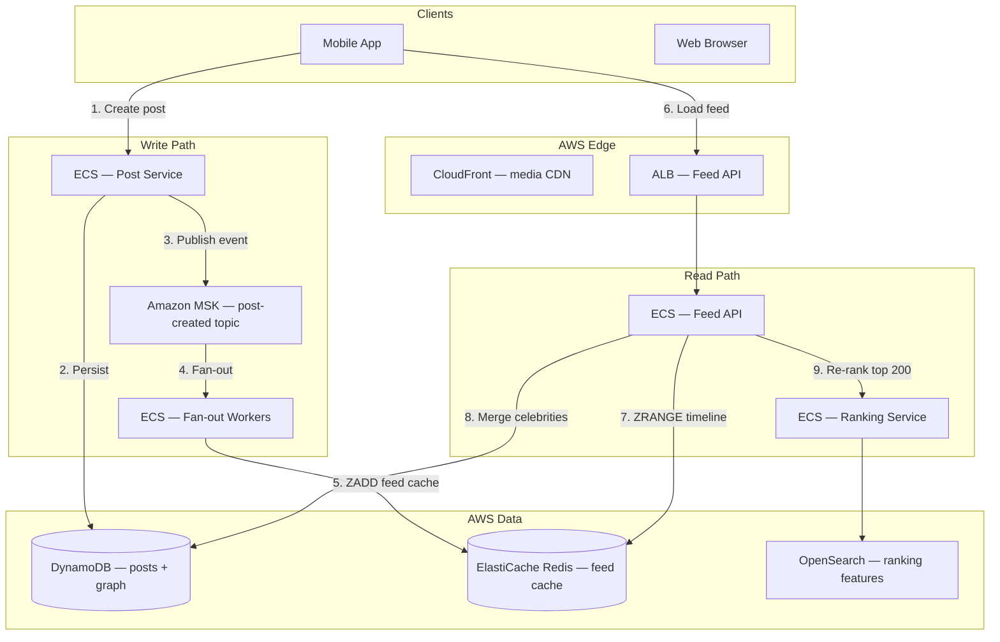
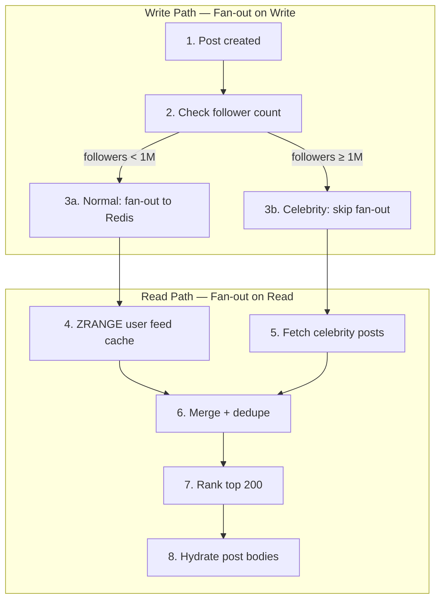
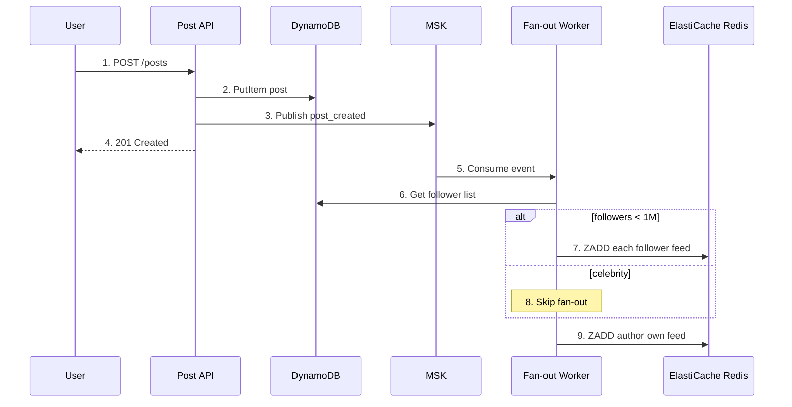
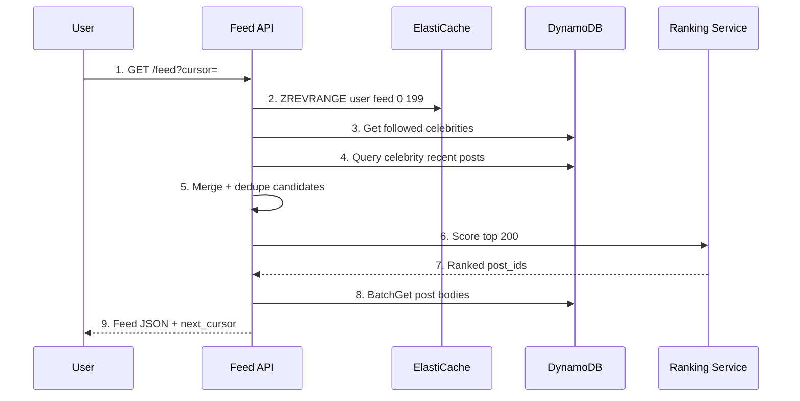
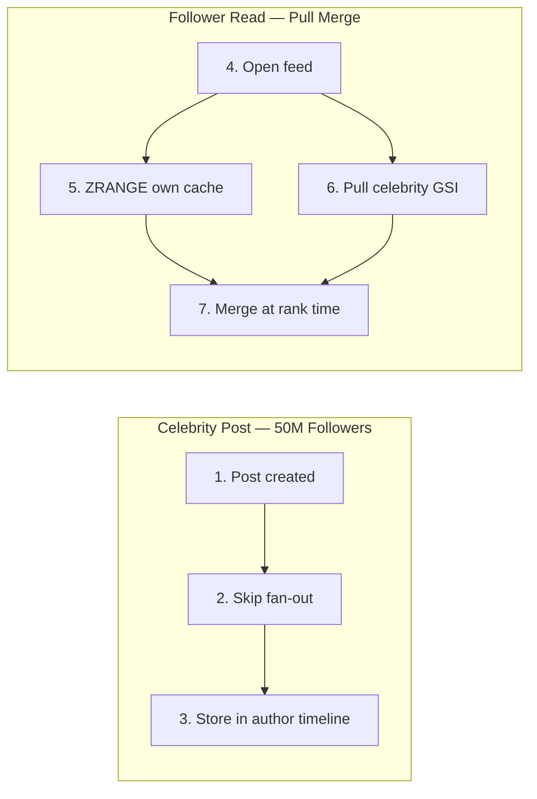
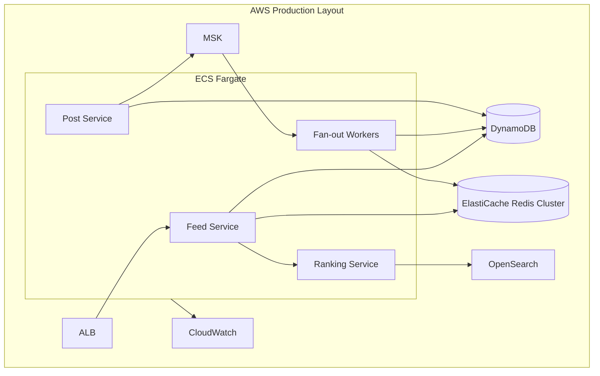
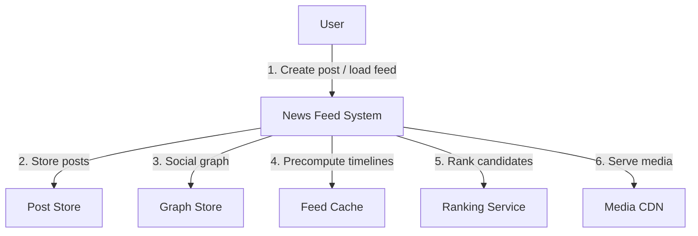
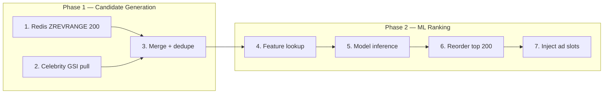
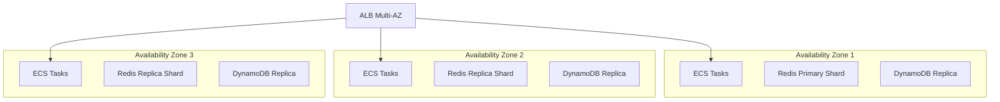

# Scenario: Meta News Feed Design

> **Diagram convention:** Arrows and messages are labeled **1, 2, 3…** to show processing order. Each diagram is followed by a **Step-by-step flow** table explaining every numbered step.

## 1. The Interview Question

> "Design a news feed for 200M DAU. Users follow up to 5K accounts. p99 feed load &lt; 500ms."

## 2. Real-World Context

| Dimension | Detail |
|-----------|--------|
| **Company / system** | [Meta (Facebook)](https://research.facebook.com/) — canonical fan-out problem at planetary scale |
| **Scale** | 200M DAU; 500M posts/day; celebrity accounts with 50M+ followers (hot keys) |
| **Why architects care** | **Fan-out on write vs read** is the central tradeoff; hybrid model required |
| **Public references** | Classic system design problem; Meta research on feed ranking and TAO graph store |

### AWS deployment context

Typical Meta-scale news feed on AWS: **ECS Fargate** post + feed services; **Amazon DynamoDB** for posts and social graph; **Amazon ElastiCache Redis** for precomputed feed timelines (sorted sets); **Amazon MSK** for async fan-out events; **Amazon OpenSearch** for ranking feature store; **CloudFront** for media CDN; **Amazon Personalize** or custom ML ranker on **SageMaker**; **CloudWatch** for feed latency SLOs.



**Step-by-step flow:**

| Step | Action | Explanation |
|------|--------|-------------|
| **1** | Create post | User publishes text/image/video. |
| **2** | Persist | Post stored in DynamoDB with `post_id`, `author_id`, timestamp. |
| **3** | Publish event | `post_created` event to MSK for async fan-out. |
| **4** | Fan-out | Worker pushes post_id to followers' Redis sorted sets. |
| **5** | ZADD feed cache | `ZADD user:{follower_id}:feed {score} {post_id}`. |
| **6** | Load feed | User opens app; requests home feed. |
| **7** | ZRANGE timeline | Fetch top 200 post_ids from Redis — sub-ms. |
| **8** | Merge celebrities | Pull recent posts from celebrity accounts (fan-out on read). |
| **9** | Re-rank top 200 | ML ranker scores and reorders candidates. |

## 3. Step-by-Step Interview Answer

### Step 1 — Clarify requirements

| Requirement | Target |
|-------------|--------|
| **DAU** | 200M |
| **Posts/day** | 500M (~5.8K/sec avg; 50K/sec peak) |
| **Feed reads** | ~10 reads/user/day → 2B reads/day (~23K/sec avg) |
| **Follow limit** | 5K accounts per user |
| **Feed load p99** | &lt; 500ms |
| **Freshness** | New posts visible within 5–30 seconds |
| **Celebrity** | Accounts with &gt; 1M followers use pull merge |

### Step 2 — Capacity math

| Metric | Calculation | Result |
|--------|-------------|--------|
| **Avg follow count** | Power-law distribution | ~200 median; 5K max |
| **Fan-out writes/post** | Avg 200 followers × 5.8K posts/sec | ~1.16M Redis ZADD/sec |
| **Feed cache size** | 200M users × 500 post_ids × 16B | ~1.6 TB (trim to 200/post) |
| **Celebrity threshold** | Fan-out &gt; 1M ZADDs/post | Switch to pull at 1M followers |
| **Read QPS** | 2B reads/day | ~23K/sec (peak 100K+) |

### Step 3 — Hybrid fan-out architecture



**Step-by-step flow:**

| Step | Action | Explanation |
|------|--------|-------------|
| **1** | Post created | Author publishes; event emitted to MSK. |
| **2** | Check follower count | Fan-out worker reads author metadata from DynamoDB. |
| **3a** | Normal fan-out | For users with &lt; 1M followers: ZADD to each follower's Redis feed. |
| **3b** | Celebrity skip | For celebrities: store post only; no fan-out (avoids 50M writes/post). |
| **4** | ZRANGE feed cache | Read path fetches precomputed timeline from Redis sorted set. |
| **5** | Fetch celebrity posts | Pull recent posts from followed celebrities at read time. |
| **6** | Merge + dedupe | Union push + pull candidates; remove duplicates by post_id. |
| **7** | Rank top 200 | ML ranker scores engagement, recency, affinity. |
| **8** | Hydrate post bodies | Batch-fetch post content from DynamoDB by post_id. |

### Step 4 — Write path sequence



**Step-by-step flow:**

| Step | Action | Explanation |
|------|--------|-------------|
| **1** | POST /posts | Client submits new post. |
| **2** | PutItem post | Persist post with `post_id`, `author_id`, `created_at`, content ref. |
| **3** | Publish post_created | Async fan-out via MSK — API returns fast. |
| **4** | 201 Created | User sees confirmation; feed update is eventual. |
| **5** | Consume event | Fan-out worker picks up from `post-created` topic. |
| **6** | Get follower list | Query social graph: `followers:{author_id}` from DynamoDB. |
| **7** | ZADD each follower | Push `post_id` with score = `created_at` epoch to each feed. |
| **8** | Skip fan-out | Celebrity: post stored but not pushed to 50M feeds. |
| **9** | ZADD author own feed | Author always sees own post immediately (read-your-writes). |

### Step 5 — Read path sequence



**Step-by-step flow:**

| Step | Action | Explanation |
|------|--------|-------------|
| **1** | GET /feed | User requests home timeline with pagination cursor. |
| **2** | ZREVRANGE | Fetch top 200 post_ids from precomputed Redis feed. |
| **3** | Get celebrities | Load list of followed accounts with &gt; 1M followers. |
| **4** | Query celebrity posts | Pull last N posts per celebrity from DynamoDB GSI. |
| **5** | Merge + dedupe | Union push and pull candidates; dedupe by `post_id`. |
| **6** | Score top 200 | Ranker applies ML features: engagement, affinity, recency. |
| **7** | Ranked post_ids | Ordered list returned to Feed API. |
| **8** | BatchGet post bodies | Hydrate full post objects from DynamoDB. |
| **9** | Feed JSON | Return ranked feed with `next_cursor` for infinite scroll. |

### Step 6 — Celebrity hot path



**Step-by-step flow:**

| Step | Action | Explanation |
|------|--------|-------------|
| **1** | Post created | Celebrity publishes — would cause 50M Redis writes if fan-out. |
| **2** | Skip fan-out | Worker detects `follower_count ≥ 1M`; no ZADD storm. |
| **3** | Store in author timeline | Post indexed on `author_id` GSI for pull queries. |
| **4** | Open feed | Follower loads home feed. |
| **5** | ZRANGE own cache | Precomputed posts from normal followees. |
| **6** | Pull celebrity GSI | Query `posts_by_author` for each followed celebrity. |
| **7** | Merge at rank time | Celebrity posts enter candidate pool before ranking. |

## 4. Whiteboard Guide

Draw three boxes left-to-right: **Write Path** → **Feed Cache** → **Read Path**. Emphasize the celebrity fork: fan-out stops at 1M followers.



**Step-by-step flow:**

| Step | Component | Role |
|------|-----------|------|
| **1** | ALB | Terminates TLS; routes `/feed` and `/posts`. |
| **2** | Post Service | Synchronous write; publishes to MSK. |
| **3** | MSK | Decouples fan-out from API latency. |
| **4** | Fan-out Workers | Horizontally scaled; partition by `author_id`. |
| **5** | ElastiCache Redis | Sorted-set timelines; cluster mode for sharding. |
| **6** | DynamoDB | Posts table + social graph; GSI for celebrity pull. |
| **7** | Ranking Service | Two-phase: candidate gen → ML scoring. |
| **8** | OpenSearch | Feature store for engagement signals. |
| **9** | CloudWatch | Feed p99, fan-out lag, Redis memory alarms. |

## 5. Principal-Level Signals

| Signal | What strong candidates say |
|--------|---------------------------|
| **Hybrid fan-out** | "Push for normal users; pull merge for celebrities above 1M followers." |
| **Write amplification math** | "50M ZADDs per celebrity post is unacceptable — that's the fork point." |
| **Read-your-writes** | "Author's own feed always gets ZADD even when fan-out is skipped." |
| **Ranking as separate phase** | "Fetch 200 candidates cheaply; rank only the merged pool." |
| **Cache trimming** | "Cap feed at 200–500 post_ids; evict oldest on ZADD." |
| **Eventual consistency** | "5–30s fan-out lag is acceptable; not linearizable." |

## 6. Red Flags

| Red flag | Why it fails |
|----------|-------------|
| **Pure fan-out on write** | Celebrity post melts Redis — 50M writes in seconds. |
| **Pure fan-out on read** | Every feed load queries 5K followees — 5K DynamoDB reads/request. |
| **No feed cache** | Cannot hit 500ms p99 at 23K read QPS. |
| **Synchronous fan-out in API** | Post API blocks on follower iteration — timeout at scale. |
| **Single Redis instance** | Hot keys and memory ceiling; need cluster mode. |
| **Ranking entire graph** | Must limit candidates to ~200 before ML scoring. |

## 7. Follow-Up Questions

| Question | Strong answer |
|----------|---------------|
| **How do you handle a user unfollowing someone?** | Lazy removal: don't purge history; filter at read time. Or async purge job on unfollow event. |
| **How do ads fit in?** | Slot-based injection in ranker output — positions 3, 7, 12 reserved for ads. |
| **Real-time feed updates?** | WebSocket push for new posts after initial load; polling fallback. |
| **Feed for new user with no follows?** | Cold-start: popular/trending posts from ranking service. |
| **How to shard Redis?** | Hash slot per `user_id`; cluster mode with 16384 slots. |
| **Duplicate posts after merge?** | Dedupe by `post_id` in merge step before ranking. |

## 8. Practice Drill (10 min)

1. **2 min** — State hybrid fan-out and celebrity threshold.
2. **3 min** — Draw write path: Post → MSK → Fan-out → Redis.
3. **3 min** — Draw read path: Redis ZRANGE + celebrity pull + rank.
4. **2 min** — Capacity: 200 followers × 5.8K posts/sec = fan-out QPS.

## 9. Key Takeaways

1. **Hybrid fan-out** is non-negotiable at Meta scale — pure push or pull both fail.
2. **Redis sorted sets** are the production timeline cache — `ZADD`/`ZREVRANGE` with score = timestamp.
3. **Async fan-out via MSK** keeps post API fast; lag is acceptable.
4. **Two-phase ranking**: cheap candidate fetch → expensive ML on top 200.
5. **Read-your-writes** for author's own posts bypasses celebrity skip logic.

## 10. Production HLD

### 10.1 C4 Context



**Step-by-step flow:**

| Step | Interaction | Explanation |
|------|-------------|-------------|
| **1** | User ↔ Feed System | Create posts and load personalized home feed. |
| **2** | Post Store | DynamoDB — source of truth for post content. |
| **3** | Graph Store | Follow/follower relationships; follower counts. |
| **4** | Feed Cache | ElastiCache Redis — precomputed timelines per user. |
| **5** | Ranker | ML scoring on merged candidate pool. |
| **6** | Media CDN | CloudFront serves images/video referenced by posts. |

### 10.2 Full production stack

| Layer | AWS Service | Purpose |
|-------|-------------|---------|
| **Edge** | CloudFront + ALB | TLS, media CDN, API routing |
| **Compute** | ECS Fargate | Post, Feed, Fan-out, Ranking services |
| **Messaging** | Amazon MSK | `post-created`, `unfollow` events |
| **Timeline cache** | ElastiCache Redis (cluster) | Sorted-set feeds per user |
| **Posts** | DynamoDB | Posts table; GSI `author_id-created_at` |
| **Social graph** | DynamoDB | `follows` adjacency; `follower_count` on user |
| **Ranking features** | OpenSearch | Engagement signals, affinity scores |
| **ML** | SageMaker | Feed ranking model inference |
| **Observability** | CloudWatch + X-Ray | Latency, fan-out lag, cache hit rate |

### 10.3 Architecture index

| # | Diagram | Section |
|---|---------|---------|
| 1 | AWS deployment context | §2 |
| 2 | Hybrid fan-out flowchart | §3 Step 3 |
| 3 | Write path sequence | §3 Step 4 |
| 4 | Read path sequence | §3 Step 5 |
| 5 | Celebrity hot path | §3 Step 6 |
| 6 | Whiteboard AWS layout | §4 |
| 7 | C4 context | §10.1 |
| 8 | Fan-out worker internals | §11.2 |
| 9 | Ranking pipeline | §11.4 |
| 10 | HA / multi-AZ | §12 |

## 11. Production LLD

### 11.1 Data schemas

**Posts table (DynamoDB)**

| Attribute | Type | Key | Description |
|-----------|------|-----|-------------|
| `post_id` | String | PK | UUID |
| `author_id` | String | GSI PK | Author user ID |
| `created_at` | Number | GSI SK | Epoch ms — sort key |
| `content_type` | String | — | text, image, video |
| `content_ref` | String | — | S3 key or text body |
| `like_count` | Number | — | Eventually consistent counter |

**Social graph table (DynamoDB)**

| Attribute | Type | Key | Description |
|-----------|------|-----|-------------|
| `user_id` | String | PK | Follower |
| `followee_id` | String | SK | Followed account |
| `created_at` | Number | — | Follow timestamp |

**User metadata (DynamoDB)**

| Attribute | Type | Description |
|-----------|------|-------------|
| `user_id` | String PK | User identifier |
| `follower_count` | Number | Used for celebrity threshold |
| `is_celebrity` | Boolean | Cached flag when count ≥ 1M |

**Feed cache (Redis sorted set)**

```
Key:    feed:{user_id}
Score:  created_at epoch ms
Member: post_id
Max:    500 members (ZREMRANGEBYRANK trim)
```

### 11.2 Fan-out worker pseudocode

```python
def handle_post_created(event):
    post = event.post
    author = get_user(post.author_id)

    # Always push to author's own feed (read-your-writes)
    redis.zadd(f"feed:{post.author_id}", {post.post_id: post.created_at})
    trim_feed(post.author_id, max_size=500)

    if author.follower_count >= CELEBRITY_THRESHOLD:
        log.info("celebrity skip", author_id=post.author_id)
        return

    followers = get_followers(post.author_id)  # paginated scan
    for batch in chunks(followers, 1000):
        pipe = redis.pipeline()
        for follower_id in batch:
            pipe.zadd(f"feed:{follower_id}", {post.post_id: post.created_at})
            pipe.zremrangebyrank(f"feed:{follower_id}", 0, -501)
        pipe.execute()
```

### 11.3 API contracts

**POST /v1/posts**

```json
// Request
{ "content_type": "text", "body": "Hello world" }

// Response 201
{ "post_id": "p_abc123", "created_at": 1722123456789 }
```

**GET /v1/feed?limit=20&cursor=eyJ...**

```json
// Response 200
{
  "posts": [
    { "post_id": "p_abc", "author_id": "u_1", "body": "...", "like_count": 42 }
  ],
  "next_cursor": "eyJ..."
}
```

### 11.4 Ranking pipeline



**Step-by-step flow:**

| Step | Action | Explanation |
|------|--------|-------------|
| **1** | Redis ZREVRANGE 200 | Cheap precomputed candidates from push fan-out. |
| **2** | Celebrity GSI pull | Recent posts from followed celebrities. |
| **3** | Merge + dedupe | Union pools; unique by `post_id`. |
| **4** | Feature lookup | Engagement, affinity, recency from OpenSearch. |
| **5** | Model inference | SageMaker endpoint scores each candidate. |
| **6** | Reorder top 200 | Sort by score; take top `limit` for response. |
| **7** | Inject ad slots | Insert sponsored content at fixed positions. |

### 11.5 Feed read handler pseudocode

```python
def get_feed(user_id: str, cursor: str | None, limit: int = 20):
    # Phase 1: candidates
    cached_ids = redis.zrevrange(f"feed:{user_id}", 0, 199, withscores=True)
    celebrities = get_followed_celebrities(user_id)
    celebrity_posts = []
    for celeb_id in celebrities:
        celebrity_posts.extend(query_recent_posts(celeb_id, limit=10))
    candidates = dedupe_by_post_id(cached_ids + celebrity_posts)

    # Phase 2: rank
    ranked_ids = ranker.score_and_sort(user_id, candidates)[:200]

    # Phase 3: hydrate + paginate
    posts = batch_get_posts(ranked_ids)
    page, next_cursor = paginate(posts, cursor, limit)
    return {"posts": page, "next_cursor": next_cursor}
```

## 12. HA, DR, and Multi-AZ



| Concern | Strategy |
|---------|----------|
| **Feed API HA** | ECS service across 3 AZs; ALB health checks |
| **Redis HA** | ElastiCache cluster mode; replica per shard; automatic failover |
| **DynamoDB** | On-demand capacity; multi-AZ by default |
| **MSK** | 3-broker cluster; replication factor 3 |
| **Fan-out lag** | Monitor consumer lag; auto-scale workers on backlog |
| **DR** | Cross-region DynamoDB Global Tables for posts; Redis rebuilt from fan-out replay |

## 13. Observability

| Metric | Target | Alarm |
|--------|--------|-------|
| `feed.load.p99` | &lt; 500ms | &gt; 800ms for 5 min |
| `fanout.lag.seconds` | &lt; 30s | &gt; 60s |
| `redis.memory.used_pct` | &lt; 80% | &gt; 85% |
| `fanout.zadd.rate` | baseline | 3× spike |
| `ranker.inference.p99` | &lt; 100ms | &gt; 200ms |
| `post.create.p99` | &lt; 200ms | &gt; 500ms |

**Dashboards:** Feed load latency breakdown (Redis / DDB / Ranker); fan-out throughput per worker; celebrity skip rate; cache hit ratio.

## 14. Evolution Roadmap

| Phase | Capability | Trigger |
|-------|------------|---------|
| **V1** | Push fan-out only | &lt; 10M DAU; no celebrities |
| **V2** | Hybrid + celebrity pull | Hot user incidents |
| **V3** | Two-phase ranking | Engagement optimization |
| **V4** | Real-time WebSocket push | Product freshness requirement |
| **V5** | Graph-aware fan-out | Close friends get priority ZADD |

## 15. Testing Strategy

| Test type | Scenario | Pass criteria |
|-----------|----------|---------------|
| **Unit** | Celebrity threshold logic | Skip fan-out at ≥ 1M followers |
| **Integration** | Post → MSK → Redis | Follower feed contains post within 30s |
| **Load** | 50K posts/sec fan-out | Worker lag &lt; 30s |
| **Chaos** | Redis shard failover | Feed load p99 &lt; 1s during failover |
| **Correctness** | Author read-your-writes | Own post visible before fan-out completes |
| **Merge** | Celebrity + normal followee | No duplicate post_ids in feed |

## 16. Production Checklist

- [ ] Celebrity threshold configured (default 1M followers)
- [ ] Redis cluster mode with ≥ 3 shards per region
- [ ] Feed cache trimmed to 500 post_ids max
- [ ] Fan-out workers partitioned by `author_id` on MSK
- [ ] Author own-feed ZADD on every post (read-your-writes)
- [ ] Ranking limited to 200 candidates before ML inference
- [ ] CloudWatch alarms on fan-out lag and feed p99
- [ ] DynamoDB GSI `author_id-created_at` for celebrity pull
- [ ] Cursor-based pagination (not offset)
- [ ] Idempotent fan-out (dedupe by `post_id` on ZADD)

## 17. Related Study

- [News Feed System Design](/docs/system-design/news-feed) — canonical chapter with fan-out math
- [Distributed Cache Design](/docs/system-design/distributed-cache-design) — Redis timeline patterns
- [Scenario: Slack Message Delivery](/docs/real-world-scenarios/slack-message-delivery) — fan-out to online users
- [Scenario: Uber Ride Matching](/docs/real-world-scenarios/uber-ride-matching) — geo-scale read/write asymmetry
