# Scenario: Netflix Cascading Failure

> **Diagram convention:** Arrows and messages are labeled **1, 2, 3…** to show processing order. Each diagram is followed by a **Step-by-step flow** table explaining every numbered step.

## 1. The Interview Question

> "A downstream authentication service slows from 50ms to 8 seconds. Your API tier starts failing health checks. Walk through what happens and how you contain it."

## 2. Real-World Context

| Dimension | Detail |
|-----------|--------|
| **Company / system** | [Netflix](https://netflixtechblog.com/) — microservices at massive scale; pioneered [Hystrix](https://github.com/Netflix/Hystrix) circuit breakers |
| **Scale** | Thousands of services; correlated failures during dependency degradation; edge + origin tiers |
| **Why architects care** | Root cause is often **small** (one dependency); blast radius is **large** due to thread pool exhaustion and retry amplification |
| **Public references** | Netflix tech blog on resilience; Nygard *Release It!*; [Chaos Monkey](https://netflix.github.io/chaosmonkey/) |

### AWS deployment context

Typical Netflix-style streaming API on AWS: **ECS Fargate** or **EKS** microservices behind **ALB**; **Amazon ElastiCache Redis** for session/token cache; **Amazon DynamoDB** or **Aurora** for entitlements; **AWS App Mesh** or **Envoy** sidecars for timeouts/retries; **CloudWatch** + **X-Ray** for SLO burn detection; **AWS FIS** for chaos experiments.

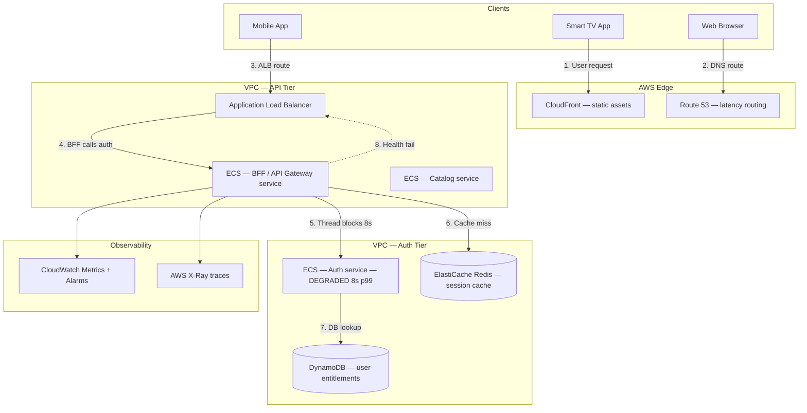
```mermaid
flowchart TB
    subgraph Clients["Clients"]
        TV[Smart TV App]
        Web[Web Browser]
        Mobile[Mobile App]
    end

    subgraph Edge["AWS Edge"]
        CF[CloudFront — static assets]
        R53[Route 53 — latency routing]
    end

    subgraph API_Tier["VPC — API Tier"]
        ALB[Application Load Balancer]
        API[ECS — BFF / API Gateway service]
        CAT[ECS — Catalog service]
    end

    subgraph Auth_Tier["VPC — Auth Tier"]
        AUTH[ECS — Auth service — DEGRADED 8s p99]
        Redis[(ElastiCache Redis — session cache)]
        DDB[(DynamoDB — user entitlements)]
    end

    subgraph Observability["Observability"]
        CW[CloudWatch Metrics + Alarms]
        XR[AWS X-Ray traces]
    end

    TV -->|"1. User request"| CF
    Web -->|"2. DNS route"| R53
    Mobile -->|"3. ALB route"| ALB
    ALB -->|"4. BFF calls auth"| API
    API -->|"5. Thread blocks 8s"| AUTH
    API -->|"6. Cache miss"| Redis
    AUTH -->|"7. DB lookup"| DDB
    API -.->|"8. Health fail"| ALB
    API --> CW
    API --> XR
```

**Step-by-step flow:**

| Step | Action | Explanation |
|------|--------|-------------|
| **1** | User request | Client opens home screen; BFF must validate session via Auth. |
| **2** | DNS route | Route 53 latency-based routing to nearest region. |
| **3** | ALB route | ALB forwards to healthy API task (initially all appear healthy). |
| **4** | BFF calls auth | Synchronous `GET /auth/validate` on critical path — no timeout configured. |
| **5** | Thread blocks 8s | Auth p99 latency spikes; API worker thread held for full 8s per request. |
| **6** | Cache miss | Redis session cache cold or TTL expired — every request hits Auth. |
| **7** | DB lookup | Auth itself slow on DynamoDB — compounds latency. |
| **8** | Health fail | Thread pool saturated → health endpoint times out → ALB marks instance unhealthy. |

## 3. Step-by-Step Interview Answer

### Minutes 0–5: Scope

1. **Symptom:** Auth p99 goes 50ms → 8s; API error rate climbs over 5–10 minutes.
2. **Constraint:** Users must still browse catalog (degrade auth-heavy features).
3. **Non-goal:** Fix auth root cause in this answer (focus containment).
4. **Assumption:** Clients retry on 5xx; upstream services use default HTTP client (no retry budget).

### Minutes 5–15: Failure propagation

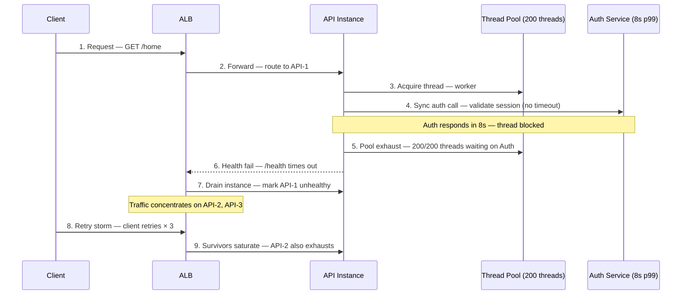
```mermaid
sequenceDiagram
    participant C as Client
    participant ALB as ALB
    participant API as API Instance
    participant Pool as Thread Pool (200 threads)
    participant Auth as Auth Service (8s p99)

    C->>ALB: 1. Request — GET /home
    ALB->>API: 2. Forward — route to API-1
    API->>Pool: 3. Acquire thread — worker #1
    API->>Auth: 4. Sync auth call — validate session (no timeout)
    Note over API,Auth: Auth responds in 8s — thread blocked
    API->>Pool: 5. Pool exhaust — 200/200 threads waiting on Auth
    API-->>ALB: 6. Health fail — /health times out
    ALB->>API: 7. Drain instance — mark API-1 unhealthy
    Note over ALB: Traffic concentrates on API-2, API-3
    C->>ALB: 8. Retry storm — client retries × 3
    ALB->>API: 9. Survivors saturate — API-2 also exhausts
```

**Step-by-step flow:**

| Step | Action | Explanation |
|------|--------|-------------|
| **1** | Request | Client loads home screen; BFF requires auth validation. |
| **2** | Forward | ALB routes to API instance with available capacity. |
| **3** | Acquire thread | Servlet/worker thread assigned from fixed pool (e.g. 200). |
| **4** | Sync auth call | Blocking HTTP call to Auth — **no timeout** or timeout &gt; 8s. |
| **5** | Pool exhaust | All 200 threads blocked waiting on Auth; queue backs up. |
| **6** | Health fail | `/health` cannot get a thread → ALB marks instance **unhealthy**. |
| **7** | Drain instance | ALB stops sending traffic to API-1; load shifts to survivors. |
| **8** | Retry storm | Clients + upstream services retry failed requests — **amplifies** Auth load. |
| **9** | Survivors saturate | Remaining instances exhaust → **metastable failure** — won't self-heal when Auth recovers. |

**Cascade summary (say aloud):**

| Phase | Step | What happens |
|-------|------|--------------|
| **T+0** | 1 | Auth latency spikes (DB hotspot, GC pause, deploy bug) |
| **T+2 min** | 2–3 | API threads block; latency climbs; error rate still low |
| **T+5 min** | 4–5 | Thread pools full; new requests queue or timeout |
| **T+7 min** | 6–7 | Health checks fail; ALB removes instances |
| **T+10 min** | 8–9 | Retry storm; survivors fail; **total API outage** despite Auth still serving (slowly) |

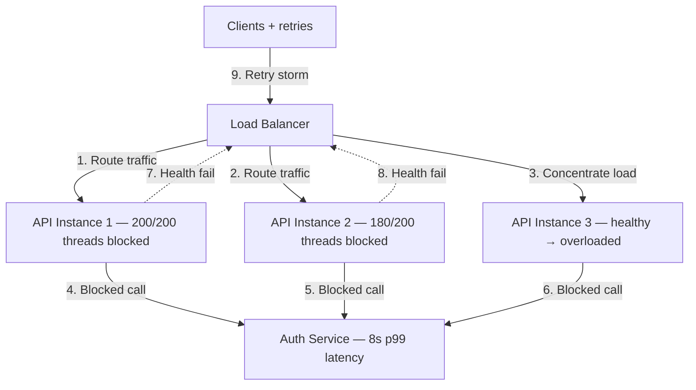
```mermaid
flowchart TB
    LB[Load Balancer]
    API1[API Instance 1 — 200/200 threads blocked]
    API2[API Instance 2 — 180/200 threads blocked]
    API3[API Instance 3 — healthy → overloaded]
    Auth[Auth Service — 8s p99 latency]

    LB -->|"1. Route traffic"| API1
    LB -->|"2. Route traffic"| API2
    LB -->|"3. Concentrate load"| API3
    API1 -->|"4. Blocked call"| Auth
    API2 -->|"5. Blocked call"| Auth
    API3 -->|"6. Blocked call"| Auth
    API1 -.->|"7. Health fail"| LB
    API2 -.->|"8. Health fail"| LB
    Clients[Clients + retries] -->|"9. Retry storm"| LB
```

**Step-by-step flow:**

| Step | Action | Explanation |
|------|--------|-------------|
| **1–2** | Route traffic | ALB distributes across API fleet. |
| **3** | Concentrate load | As instances fail health checks, survivors get **more** traffic. |
| **4–6** | Blocked call | Every API thread waits on slow Auth — fan-in bottleneck. |
| **7–8** | Health fail | Saturated instances removed from rotation — **negative feedback loop**. |
| **9** | Retry storm | Retries add ~30–300% extra load on already-failing tier. |

### Minutes 15–30: Containment layers

| Layer | Mechanism | Effect |
|-------|-----------|--------|
| **1. Timeout** | Auth call timeout 200ms | Fail fast; free threads immediately |
| **2. Circuit breaker** | Open after 50% errors in 10s window | Stop calling sick dependency |
| **3. Bulkhead** | Separate thread pool for auth vs. catalog | Catalog survives auth saturation |
| **4. Retry budget** | Max 1% of traffic retries | Prevent retry storm |
| **5. Load shed** | Return 503 for non-critical paths | Protect core tier |
| **6. Degrade** | Allow cached session / read-only mode | Partial UX vs. total outage |

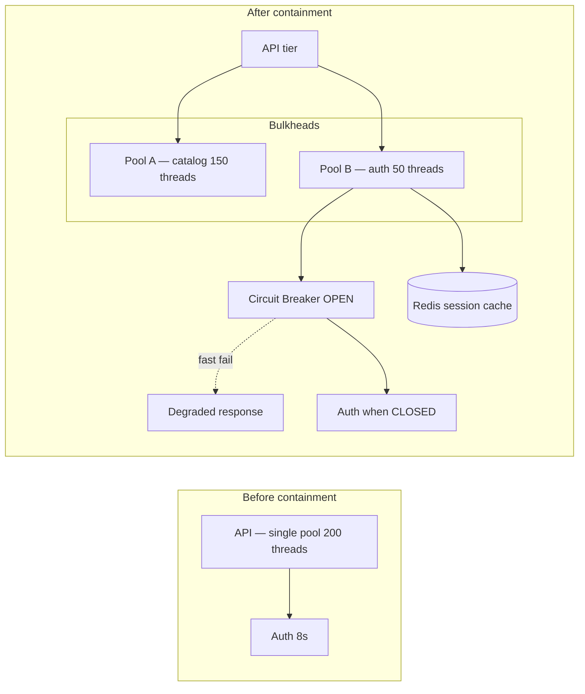
```mermaid
flowchart LR
    subgraph Before["Before containment"]
        APIb[API — single pool 200 threads]
        APIb --> Authb[Auth 8s]
    end

    subgraph After["After containment"]
        APIa[API tier]
        subgraph Bulkhead["Bulkheads"]
            P1[Pool A — catalog 150 threads]
            P2[Pool B — auth 50 threads]
        end
        CB[Circuit Breaker OPEN]
        Cache[(Redis session cache)]
        APIa --> P1
        APIa --> P2
        P2 --> CB
        CB -.->|fast fail| Fallback[Degraded response]
        P2 --> Cache
        CB --> Autha[Auth when CLOSED]
    end
```

**Step-by-step flow:**

| Step | Action | Explanation |
|------|--------|-------------|
| **1** | Single pool (before) | Auth slowness consumes **all** threads — catalog dies too. |
| **2** | Bulkhead split | Catalog pool isolated — home/browse keeps working. |
| **3** | Circuit breaker | After error threshold, fail fast without calling Auth. |
| **4** | Cache fallback | Serve stale session from Redis — **degraded** but available. |
| **5** | Fast fail | Return 401/503 in &lt;5ms instead of blocking 8s. |

### Minutes 30–45: Operations

- **Detect:** SLO burn rate on API; `thread_pool_active / thread_pool_max` &gt; 0.9; auth latency histogram shift; circuit breaker state = OPEN.
- **Respond:** Manually trip circuit breaker fleet-wide; scale Auth horizontally; reduce retry limits in platform SDK; enable read-only degradation mode.
- **Prevent:** Chaos experiments (latency injection on auth); default timeouts in service mesh; retry budgets in platform SDK; bulkhead enforcement in golden-path library.
- **Org:** Platform team owns resilience libraries (Hystrix → Resilience4j / Envoy); exceptions via ADR.

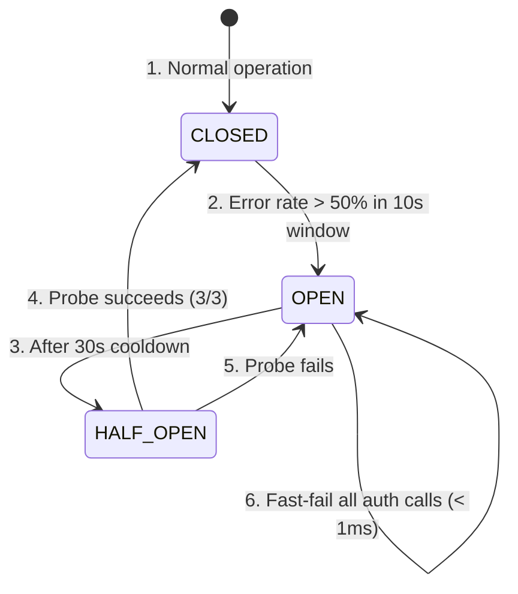
```mermaid
stateDiagram-v2
    [*] --> CLOSED: 1. Normal operation
    CLOSED --> OPEN: 2. Error rate > 50% in 10s window
    OPEN --> HALF_OPEN: 3. After 30s cooldown
    HALF_OPEN --> CLOSED: 4. Probe succeeds (3/3)
    HALF_OPEN --> OPEN: 5. Probe fails
    OPEN --> OPEN: 6. Fast-fail all auth calls (< 1ms)
```

**Step-by-step flow:**

| Step | Action | Explanation |
|------|--------|-------------|
| **1** | Normal operation | Circuit CLOSED — all auth calls pass through. |
| **2** | Trip open | Sliding window detects sustained failures → OPEN. |
| **3** | Cooldown | 30s pause — let dependency recover; no calls sent. |
| **4** | Probe success | Single canary request succeeds → CLOSED. |
| **5** | Probe fails | Re-open immediately — dependency still sick. |
| **6** | Fast-fail | OPEN state returns fallback in &lt;1ms — threads freed. |

## 4. Whiteboard Guide

Draw left-to-right:

1. **Client** → **ALB** → **API tier** (shade thread pool filling red)
2. **API** → **Auth** (label arrow "8s blocking, no timeout")
3. Show **negative feedback loop**: health fail → drain → concentrate → exhaust
4. Add **circuit breaker** on Auth arrow — label "OPEN"
5. Show **bulkhead** as separate pool: "catalog reads" vs "auth calls"
6. Add **Redis cache** bypass path for degraded mode

### AWS whiteboard layout

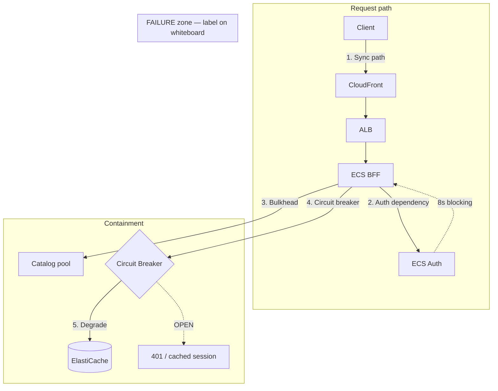
```mermaid
flowchart TB
    subgraph Lane1["Request path"]
        direction LR
        C[Client] -->|"1. Sync path"| CF[CloudFront] --> ALB[ALB] --> BFF[ECS BFF]
        BFF -->|"2. Auth dependency"| AUTH[ECS Auth]
    end

    subgraph Lane2["FAILURE zone — label on whiteboard"]
        AUTH -.->|8s blocking| BFF
    end

    subgraph Lane3["Containment"]
        direction LR
        BFF -->|"3. Bulkhead"| CAT[Catalog pool]
        BFF -->|"4. Circuit breaker"| CB{Circuit Breaker}
        CB -->|"5. Degrade"| Redis[(ElastiCache)]
        CB -.->|OPEN| Fallback[401 / cached session]
    end
```

**Step-by-step flow:**

| Step | Action | Explanation |
|------|--------|-------------|
| **1** | Sync path | Client → CloudFront → ALB → BFF — auth on critical path. |
| **2** | Auth dependency | Blocking call — **FAILURE zone** when Auth slows. |
| **3** | Bulkhead | Catalog reads use separate thread pool. |
| **4** | Circuit breaker | Trip open when error rate exceeds threshold. |
| **5** | Degrade | Redis cached session or anonymous browse mode. |

---

## 5. Principal-Level Signals

- Names **metastable failure** and why recovery isn't automatic when Auth heals
- Quantifies **retry amplification** (1% retry × 10K RPS = +100 RPS; × 3 retries = +300 RPS on Auth)
- Separates **root cause fix** (Auth DB hotspot) from **containment** (circuit breaker)
- Mentions **chaos engineering** as validation, not heroics
- Explains **bulkhead** vs **circuit breaker** — bulkhead limits resource sharing; breaker stops calls entirely
- Discusses **health check design** — deep health checks that call dependencies cause cascading unhealthiness

## 6. Red Flags

- "Scale API horizontally" without fixing blocking — adds more threads that also block on Auth
- Infinite retries with exponential backoff only — backoff helps but doesn't cap total retry **budget**
- No bulkhead between critical and optional dependencies
- Health check calls Auth synchronously — unhealthy Auth makes entire API fleet unhealthy
- Circuit breaker per-instance only — need fleet-wide coordination or low threshold to trip quickly

## 7. Follow-Up Questions

| Question | Strong answer |
|----------|---------------|
| Why doesn't Auth recovering fix the API tier? | **Metastable state** — queues full, clients still retrying, cold thread pools need drain + circuit half-open probes |
| Half-open vs closed? | Half-open sends **probe traffic** (1–3 requests) before fully closing circuit |
| Where to put timeout — client or mesh? | **Both** — mesh enforces platform default (200ms); client can be stricter for UX |
| How do you test this? | **Chaos**: inject 8s latency on Auth in staging; verify catalog still loads with bulkhead |
| gRPC vs HTTP blocking? | gRPC async doesn't eliminate cascade — **semaphore/concurrency limits** still required |

## 8. Related Study

- [Resilience Patterns](/docs/microservices/resilience-patterns)
- [Partial Failure](/docs/distributed-systems-foundations/partial-failure)
- [Chaos Engineering](/docs/reliability-and-resilience/chaos-engineering)
- Lab: [Chaos testing](/docs/reliability-and-resilience/chaos-engineering#25-hands-on-exercise) on **`:8103`**

## 9. Practice Drill

Draw the cascade on paper in 5 minutes. Label steps 1–9. Explain containment in 10 minutes without notes. Then whiteboard the circuit breaker state machine from memory.

---

## 10. Production High-Level Design

This section is a **build guide** for implementing Netflix-style cascading-failure containment in production on AWS.

### 10.1 Architecture diagram index

| Section | Topic |
|---------|-------|
| [§2](#aws-deployment-context) | End-to-end AWS deployment context |
| [§3](#minutes-515-failure-propagation) | Failure propagation sequence |
| [§10.2](#102-system-context-c4-level-1) | C4 logical context |
| [§10.3](#103-aws-production-architecture-full-stack) | Full VPC production stack |
| [§10.4](#104-containment-architecture-layers) | Containment layer stack |
| [§11.4](#114-bff-request-handler--step-by-step-low-level) | BFF request path sequence |
| [§11.5](#115-circuit-breaker-implementation) | Circuit breaker state machine + config |
| [§12](#12-hadr-and-failover) | Multi-AZ, regional failover |
| [§13](#13-chaos-engineering-and-validation) | AWS FIS chaos experiments |
| [§14](#14-security-observability-and-operations) | Security + observability |
| [§15](#15-implementation-roadmap-6-week-rollout) | 6-week rollout |
| [§16](#16-testing-strategy) | Load + chaos testing |
| [§17](#17-architecture-review-checklist) | Production readiness gates |

### 10.2 System context (C4 Level 1)

*Logical view — technology-agnostic component boundaries.*

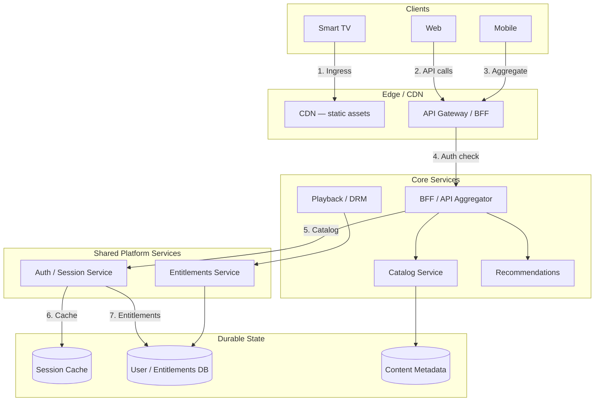
```mermaid
flowchart TB
    subgraph Clients["Clients"]
        TV[Smart TV]
        Web[Web]
        Mobile[Mobile]
    end

    subgraph Edge["Edge / CDN"]
        CDN[CDN — static assets]
        GW[API Gateway / BFF]
    end

    subgraph Core["Core Services"]
        BFF[BFF / API Aggregator]
        CAT[Catalog Service]
        REC[Recommendations]
        PLAY[Playback / DRM]
    end

    subgraph Shared["Shared Platform Services"]
        AUTH[Auth / Session Service]
        ENT[Entitlements Service]
    end

    subgraph Data["Durable State"]
        Redis[(Session Cache)]
        DDB[(User / Entitlements DB)]
        S3[(Content Metadata)]
    end

    TV -->|"1. Ingress"| CDN
    Web -->|"2. API calls"| GW
    Mobile -->|"3. Aggregate"| GW
    GW -->|"4. Auth check"| BFF
    BFF -->|"5. Catalog"| AUTH
    BFF --> CAT
    BFF --> REC
    CAT --> S3
    AUTH -->|"6. Cache"| Redis
    AUTH -->|"7. Entitlements"| DDB
    ENT --> DDB
    PLAY --> ENT
```

**Step-by-step flow:**

| Step | Action | Explanation |
|------|--------|-------------|
| **1** | Ingress | Clients fetch static UI from CDN. |
| **2** | API calls | Dynamic requests hit API Gateway / BFF. |
| **3** | Aggregate | BFF composes home screen from multiple services. |
| **4** | Auth check | Session validation on critical path — **cascade risk**. |
| **5** | Catalog | Catalog reads can be bulkheaded separately from auth. |
| **6** | Cache | Redis holds hot session tokens — reduces Auth fan-in. |
| **7** | Entitlements | DynamoDB stores subscription state — Auth dependency. |

### 10.3 AWS production architecture (full stack)

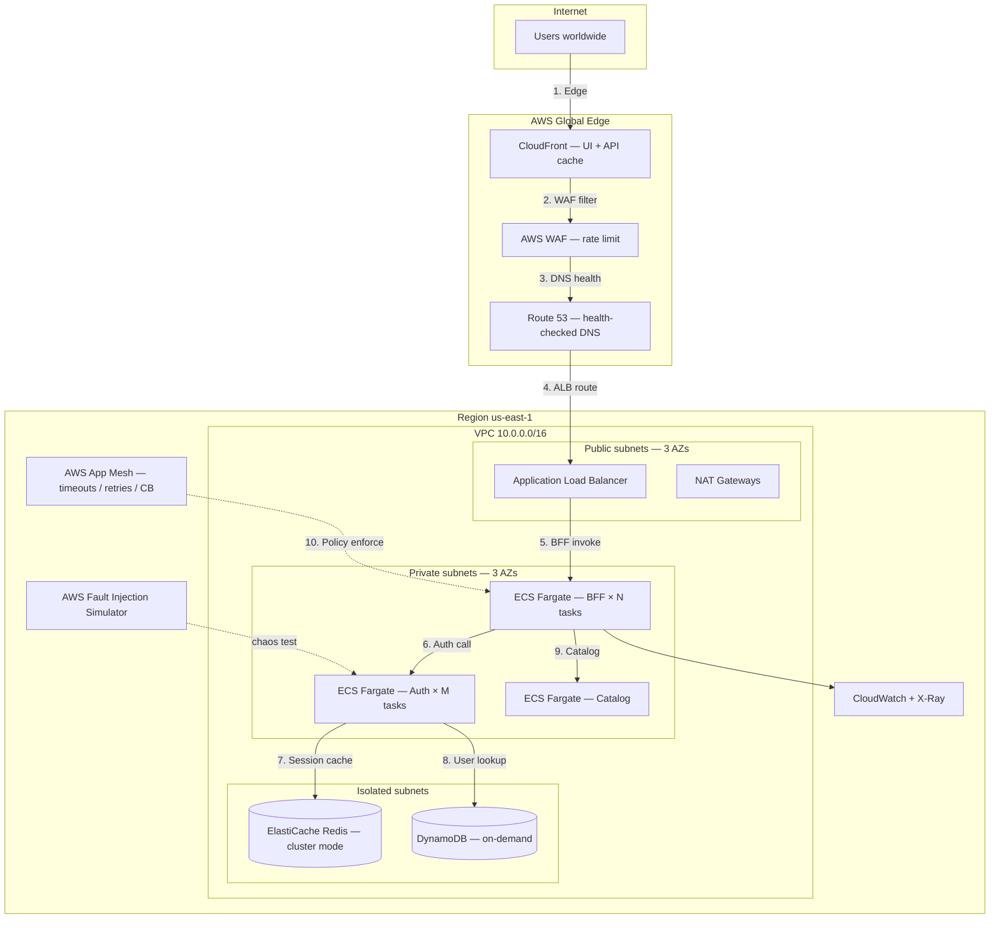
```mermaid
flowchart TB
    subgraph Internet["Internet"]
        Users[Users worldwide]
    end

    subgraph Edge["AWS Global Edge"]
        CF[CloudFront — UI + API cache]
        WAF[AWS WAF — rate limit]
        R53[Route 53 — health-checked DNS]
    end

    subgraph Region["Region us-east-1"]
        subgraph VPC["VPC 10.0.0.0/16"]
            subgraph PubAZ["Public subnets — 3 AZs"]
                ALB[Application Load Balancer]
                NAT[NAT Gateways]
            end
            subgraph PrivAZ["Private subnets — 3 AZs"]
                BFFa[ECS Fargate — BFF × N tasks]
                AUTHa[ECS Fargate — Auth × M tasks]
                CATa[ECS Fargate — Catalog]
            end
            subgraph Data["Isolated subnets"]
                Redis[(ElastiCache Redis — cluster mode)]
                DDB[(DynamoDB — on-demand)]
            end
        end
        Mesh[AWS App Mesh — timeouts / retries / CB]
        CW[CloudWatch + X-Ray]
        FIS[AWS Fault Injection Simulator]
    end

    Users -->|"1. Edge"| CF
    CF -->|"2. WAF filter"| WAF
    WAF -->|"3. DNS health"| R53
    R53 -->|"4. ALB route"| ALB
    ALB -->|"5. BFF invoke"| BFFa
    BFFa -->|"6. Auth call"| AUTHa
    AUTHa -->|"7. Session cache"| Redis
    AUTHa -->|"8. User lookup"| DDB
    BFFa -->|"9. Catalog"| CATa
    Mesh -.->|"10. Policy enforce"| BFFa
    BFFa --> CW
    FIS -.->|"chaos test"| AUTHa
```

**Step-by-step flow:**

| Step | Action | Explanation |
|------|--------|-------------|
| **1** | Edge | CloudFront terminates TLS; caches static responses. |
| **2** | WAF filter | Bot control, geo block, rate limiting. |
| **3** | DNS health | Route 53 fails over if regional ALB unhealthy. |
| **4** | ALB route | Cross-AZ load balance to BFF tasks. |
| **5** | BFF invoke | BFF aggregates home screen; calls Auth synchronously. |
| **6** | Auth call | **Critical dependency** — must have timeout + circuit breaker. |
| **7** | Session cache | Redis GET session — miss falls through to Auth DB. |
| **8** | User lookup | DynamoDB GetItem for entitlements. |
| **9** | Catalog | Parallel bulkheaded call — survives Auth degradation. |
| **10** | Policy enforce | App Mesh enforces 200ms timeout, retry budget, circuit breaker. |

| AWS component | Resilience responsibility |
|---------------|--------------------------|
| **ALB** | Health checks on shallow `/health` (not Auth); connection draining on deregister |
| **ECS Fargate** | Task-level thread pools; circuit breaker in app or sidecar |
| **App Mesh** | Platform-enforced timeouts, outlier detection, retry policies |
| **ElastiCache Redis** | Session cache for degraded-mode fallback |
| **DynamoDB** | Auth backing store — on-demand scales; DAX optional for hot keys |
| **CloudWatch** | `ThreadPoolActive`, `CircuitBreakerState`, SLO burn alarms |
| **AWS FIS** | Inject Auth latency in staging/prod game days |

### 10.4 Containment architecture (layers)

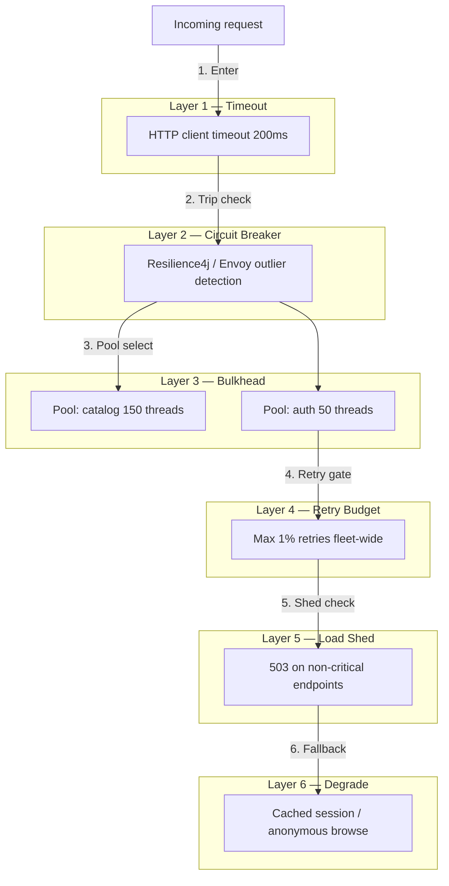
```mermaid
flowchart TB
    subgraph L1["Layer 1 — Timeout"]
        T[HTTP client timeout 200ms]
    end

    subgraph L2["Layer 2 — Circuit Breaker"]
        CB[Resilience4j / Envoy outlier detection]
    end

    subgraph L3["Layer 3 — Bulkhead"]
        BH1[Pool: catalog 150 threads]
        BH2[Pool: auth 50 threads]
    end

    subgraph L4["Layer 4 — Retry Budget"]
        RB[Max 1% retries fleet-wide]
    end

    subgraph L5["Layer 5 — Load Shed"]
        LS[503 on non-critical endpoints]
    end

    subgraph L6["Layer 6 — Degrade"]
        DG[Cached session / anonymous browse]
    end

    Request[Incoming request] -->|"1. Enter"| T
    T -->|"2. Trip check"| CB
    CB -->|"3. Pool select"| BH1
    CB --> BH2
    BH2 -->|"4. Retry gate"| RB
    RB -->|"5. Shed check"| LS
    LS -->|"6. Fallback"| DG
```

**Step-by-step flow:**

| Step | Action | Explanation |
|------|--------|-------------|
| **1** | Enter | Request hits BFF; passes through containment stack in order. |
| **2** | Trip check | Circuit breaker — fast-fail if OPEN. |
| **3** | Pool select | Bulkhead routes to catalog or auth pool. |
| **4** | Retry gate | Retry only if budget allows (≤1% of RPS). |
| **5** | Shed check | Non-critical paths return 503 immediately under pressure. |
| **6** | Fallback | Serve degraded UX from Redis cache or anonymous mode. |

### 10.5 Service sizing at 10K RPS peak

| Metric | Value | Reasoning |
|--------|-------|-----------|
| Peak BFF RPS | 10K | Mid-size streaming API |
| Auth calls per home load | 1 | Session validate on critical path |
| Auth p99 (healthy) | 50ms | Baseline |
| Auth p99 (degraded) | 8s | Incident scenario |
| BFF thread pool | 200 / instance | Tomcat / Netty worker threads |
| BFF instances | 20 | 10K RPS ÷ 500 RPS/instance |
| Time to exhaust (no timeout) | ~2 min | 200 threads × 8s = 25 RPS capacity vs 500 RPS demand |

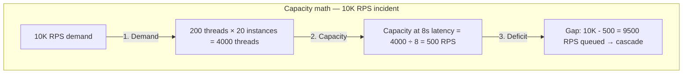
```mermaid
flowchart TB
    subgraph Sizing["Capacity math — 10K RPS incident"]
        RPS[10K RPS demand]
        Pool[200 threads × 20 instances = 4000 threads]
        Cap[Capacity at 8s latency = 4000 ÷ 8 = 500 RPS]
        Gap[Gap: 10K - 500 = 9500 RPS queued → cascade]
    end

    RPS -->|"1. Demand"| Pool
    Pool -->|"2. Capacity"| Cap
    Cap -->|"3. Deficit"| Gap
```

**Step-by-step flow:**

| Step | Action | Explanation |
|------|--------|-------------|
| **1** | Demand | 10K RPS hits BFF during peak evening traffic. |
| **2** | Capacity | With 8s Auth latency, each thread handles 0.125 RPS. |
| **3** | Deficit | 95% of requests queue or timeout — cascade in minutes. |

---

## 11. Production Low-Level Design

### 11.1 API contract — BFF home endpoint

**Endpoint:** `GET /v1/home`

**Required headers:**

| Header | Rule |
|--------|------|
| `Authorization` | `Bearer <session_token>` |
| `X-Request-ID` | UUID for distributed tracing |
| `X-Client-Version` | App version for degradation routing |

**Response semantics (degradation modes):**

| HTTP | Meaning | Client action |
|------|---------|---------------|
| `200` | Full home screen (auth + catalog + recommendations) | Render normally |
| `200` + `X-Degraded: auth` | Catalog only; recommendations omitted | Show banner "personalization unavailable" |
| `401` | Session invalid (circuit OPEN, cache miss) | Redirect to login |
| `503` + `Retry-After: 30` | Load shed — system under pressure | Backoff; do not retry more than 2× |
| `504` | BFF timeout (auth + catalog &gt; 500ms budget) | Show cached home if available |

### 11.2 Thread pool and bulkhead configuration

**application.yml (Spring Boot + Resilience4j example):**

```yaml
resilience4j:
  thread-pool-bulkhead:
    instances:
      catalogBulkhead:
        max-thread-pool-size: 150
        core-thread-pool-size: 50
        queue-capacity: 100
      authBulkhead:
        max-thread-pool-size: 50
        core-thread-pool-size: 20
        queue-capacity: 25

  circuitbreaker:
    instances:
      authService:
        sliding-window-size: 100
        failure-rate-threshold: 50
        wait-duration-in-open-state: 30s
        permitted-number-of-calls-in-half-open-state: 3
        slow-call-rate-threshold: 80
        slow-call-duration-threshold: 200ms

  timelimiter:
    instances:
      authService:
        timeout-duration: 200ms

  retry:
    instances:
      authService:
        max-attempts: 2
        wait-duration: 50ms
        retry-exceptions:
          - java.net.SocketTimeoutException
```

| Parameter | Value | Why |
|-----------|-------|-----|
| `authBulkhead.max-thread-pool-size` | 50 | Caps auth fan-in — catalog pool unaffected |
| `failure-rate-threshold` | 50% | Trip after half of sliding window fails |
| `slow-call-duration-threshold` | 200ms | Treat slow calls as failures — trip before 8s |
| `wait-duration-in-open-state` | 30s | Cooldown before half-open probes |
| `max-attempts` | 2 | One retry max — prevents retry storm |

### 11.3 HTTP client configuration

```java
// OkHttp client for Auth service calls
OkHttpClient authClient = new OkHttpClient.Builder()
    .connectTimeout(Duration.ofMillis(100))
    .readTimeout(Duration.ofMillis(200))
    .writeTimeout(Duration.ofMillis(100))
    .connectionPool(new ConnectionPool(50, 5, TimeUnit.MINUTES))
    .addInterceptor(new RetryBudgetInterceptor(maxRetryPercent = 0.01))
    .build();
```

| Setting | Value | Failure prevented |
|---------|-------|-------------------|
| `readTimeout` | 200ms | Thread blocked 8s on slow Auth |
| `connectionPool` max | 50 | Connection exhaustion to Auth |
| `RetryBudgetInterceptor` | 1% fleet cap | Retry storm amplification |

### 11.4 BFF request handler — step-by-step (low level)

**AWS request path — end to end:**

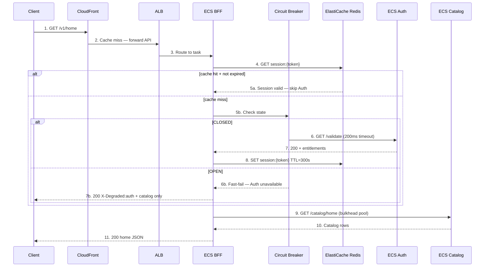
```mermaid
sequenceDiagram
    participant Client
    participant CF as CloudFront
    participant ALB as ALB
    participant BFF as ECS BFF
    participant CB as Circuit Breaker
    participant Redis as ElastiCache Redis
    participant Auth as ECS Auth
    participant Cat as ECS Catalog

    Client->>CF: 1. GET /v1/home
    CF->>ALB: 2. Cache miss — forward API
    ALB->>BFF: 3. Route to task
    BFF->>Redis: 4. GET session:{token}
    alt cache hit + not expired
        Redis-->>BFF: 5a. Session valid — skip Auth
    else cache miss
        BFF->>CB: 5b. Check state
        alt CLOSED
            CB->>Auth: 6. GET /validate (200ms timeout)
            Auth-->>BFF: 7. 200 + entitlements
            BFF->>Redis: 8. SET session:{token} TTL=300s
        else OPEN
            CB-->>BFF: 6b. Fast-fail — Auth unavailable
            BFF-->>Client: 7b. 200 X-Degraded:auth + catalog only
        end
    end
    BFF->>Cat: 9. GET /catalog/home (bulkhead pool)
    Cat-->>BFF: 10. Catalog rows
    BFF-->>Client: 11. 200 home JSON
```

**Step-by-step flow:**

| Step | Action | Explanation |
|------|--------|-------------|
| **1** | GET /v1/home | Client requests home screen composition. |
| **2** | Cache miss | CloudFront forwards dynamic API to ALB. |
| **3** | Route to task | ALB picks healthy BFF task with capacity. |
| **4** | GET session | Check Redis for cached session validation. |
| **5a** | Cache hit | Skip Auth entirely — **fast path** during incident. |
| **5b** | Cache miss | Must validate; check circuit breaker state first. |
| **6** | Auth validate | CLOSED: call Auth with 200ms timeout. |
| **6b** | Fast-fail | OPEN: skip Auth; degrade to catalog-only mode. |
| **7** | Response | Auth returns entitlements or times out → counts as failure. |
| **8** | Cache write | On success, cache session for 300s — reduces Auth fan-in. |
| **9** | Catalog fetch | Parallel call on **separate bulkhead pool**. |
| **10** | Catalog rows | Home metadata from Catalog service. |
| **11** | Home JSON | BFF composes and returns response to client. |

### 11.5 Circuit breaker implementation

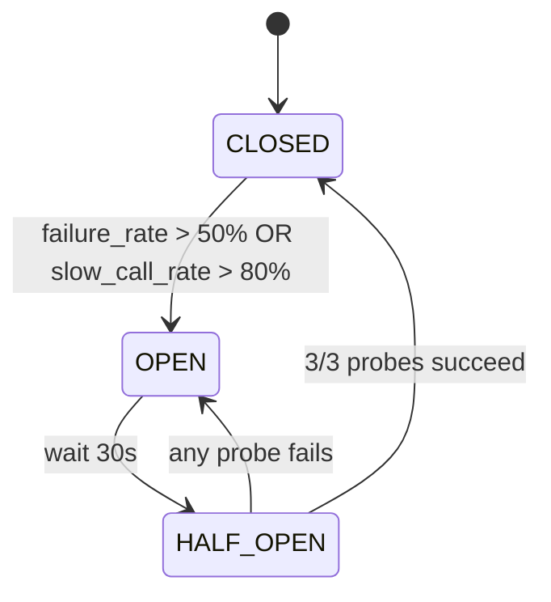
```mermaid
stateDiagram-v2
    [*] --> CLOSED
    CLOSED --> OPEN: failure_rate > 50% OR slow_call_rate > 80%
    OPEN --> HALF_OPEN: wait 30s
    HALF_OPEN --> CLOSED: 3/3 probes succeed
    HALF_OPEN --> OPEN: any probe fails
```

**Handler pseudocode:**

```python
def validate_session(token: str) -> SessionResult:
    # Step 1: Check circuit breaker state
    if auth_circuit.state == OPEN:
        cached = redis.get(f"session:{token}")
        if cached:
            return SessionResult(degraded=True, data=cached)
        raise AuthUnavailableError()  # fast-fail < 1ms

    # Step 2: Attempt auth with timeout (bulkhead pool)
    try:
        with auth_bulkhead.acquire(timeout=0.05):
            response = auth_client.get(
                "/validate",
                headers={"Authorization": f"Bearer {token}"},
                timeout=0.2,
            )
    except (Timeout, CircuitOpen, BulkheadFull):
        auth_circuit.record_failure()
        return fallback_session(token)

    # Step 3: Cache success + record metrics
    auth_circuit.record_success()
    redis.setex(f"session:{token}", 300, response.json())
    return SessionResult(degraded=False, data=response.json())
```

**Step-by-step flow (code path):**

| Step | Action | Explanation |
|------|--------|-------------|
| **1** | Check CB state | OPEN → skip Auth call entirely. |
| **2** | Bulkhead acquire | Wait max 50ms for auth pool slot; reject if full. |
| **3** | HTTP call | 200ms read timeout — fail fast, free thread. |
| **4** | Record failure | Timeout/error increments sliding window toward OPEN. |
| **5** | Fallback | Return cached session or degraded catalog-only mode. |
| **6** | Cache success | Write-through to Redis — reduce future Auth load. |

### 11.6 Health check design

**Anti-pattern (causes cascade):**

```http
GET /health
→ calls Auth /validate synchronously
→ Auth slow → all BFF instances unhealthy → total outage
```

**Correct pattern — shallow liveness:**

```http
GET /health/live   → 200 if process up + thread pool < 95%
GET /health/ready  → 200 if can accept traffic (bulkhead has capacity)
GET /health/deep   → calls Auth — for monitoring only, NOT used by ALB
```

| Check | ALB uses? | Calls Auth? | Purpose |
|-------|-----------|-------------|---------|
| `/health/live` | Yes | No | Process alive; thread pool not saturated |
| `/health/ready` | Optional | No | Bulkhead has queue capacity |
| `/health/deep` | **No** | Yes | Dashboard / synthetic monitoring only |

### 11.7 Retry budget (fleet-wide)

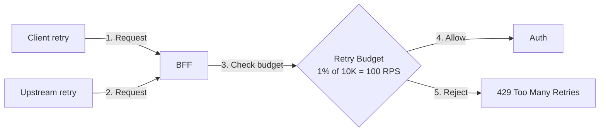
```mermaid
flowchart LR
    R1[Client retry] -->|"1. Request"| BFF[BFF]
    R2[Upstream retry] -->|"2. Request"| BFF
    BFF -->|"3. Check budget"| RB{Retry Budget<br/>1% of 10K = 100 RPS}
    RB -->|"4. Allow"| Auth[Auth]
    RB -->|"5. Reject"| Reject[429 Too Many Retries]
```

**Step-by-step flow:**

| Step | Action | Explanation |
|------|--------|-------------|
| **1** | Client retry | Mobile app retries on 503 — must be capped. |
| **2** | Upstream retry | Other services retry BFF calls — compounds load. |
| **3** | Check budget | Token bucket: max 100 retry RPS fleet-wide. |
| **4** | Allow | Retry proceeds if budget has tokens. |
| **5** | Reject | Return 429 — forces client backoff. |

**Retry amplification math:**

| Source | RPS | Retry rate | Extra load |
|--------|-----|------------|------------|
| Clients | 10,000 | 3% × 2 retries | +600 RPS |
| Upstream services | 2,000 | 5% × 1 retry | +100 RPS |
| **Total amplification** | | | **+700 RPS on Auth** |

### 11.8 App Mesh policy (Envoy sidecar)

```yaml
# AWS App Mesh virtual node — auth dependency
spec:
  listeners:
    - portMapping:
        port: 8080
        protocol: http
      timeout:
        perRequest:
          value: 0.2  # 200ms
  backends:
    - virtualService:
        virtualServiceName: auth-service
      connectionPool:
        http:
          maxConnections: 50
          maxPendingRequests: 25
      outlierDetection:
        maxServerErrors: 5
        interval: 10s
        baseEjectionTime: 30s
        maxEjectionPercent: 50
```

| Policy | Value | Effect |
|--------|-------|--------|
| `perRequest.timeout` | 200ms | Platform-enforced — apps can't override without ADR |
| `maxConnections` | 50 | Connection bulkhead to Auth per task |
| `outlierDetection` | 5 errors / 10s | Envoy-level circuit breaker |

---

## 12. HA/DR and Failover

### 12.1 Single-region multi-AZ (baseline)

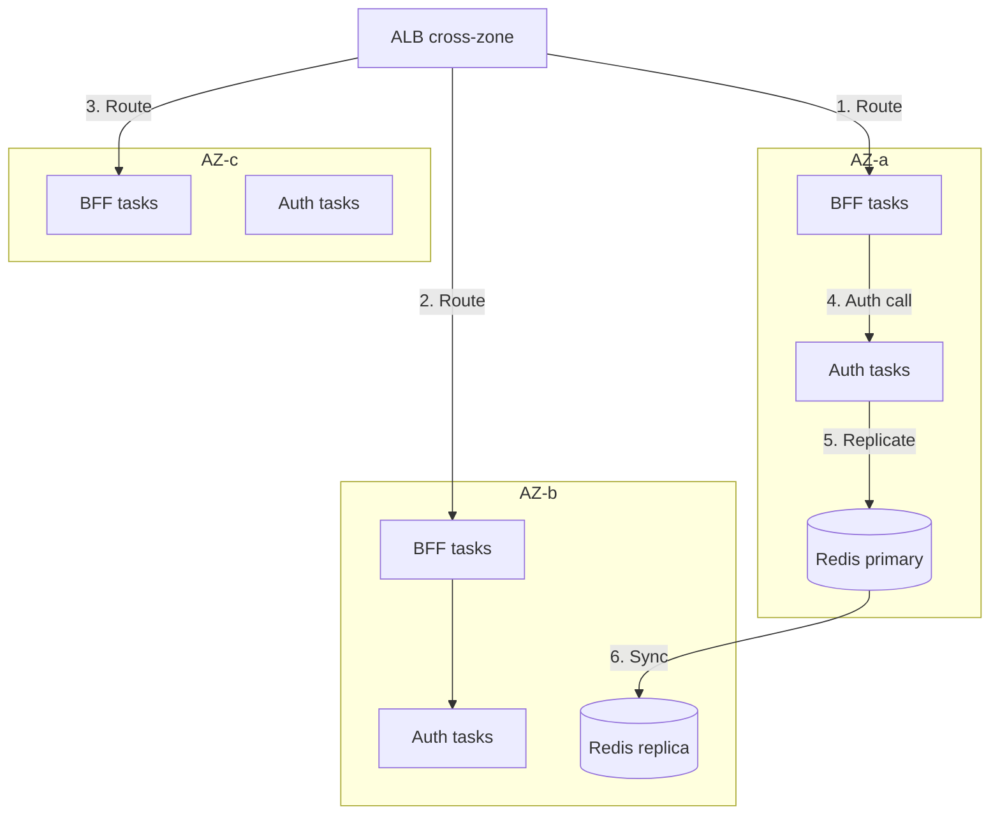
```mermaid
flowchart TB
    subgraph AZa["AZ-a"]
        BFFa[BFF tasks]
        AUTHa[Auth tasks]
        Redisa[(Redis primary)]
    end
    subgraph AZb["AZ-b"]
        BFFb[BFF tasks]
        AUTHb[Auth tasks]
        Redisb[(Redis replica)]
    end
    subgraph AZc["AZ-c"]
        BFFc[BFF tasks]
        AUTHc[Auth tasks]
    end

    ALB[ALB cross-zone] -->|"1. Route"| BFFa
    ALB -->|"2. Route"| BFFb
    ALB -->|"3. Route"| BFFc
    BFFa -->|"4. Auth call"| AUTHa
    BFFb --> AUTHb
    AUTHa -->|"5. Replicate"| Redisa
    Redisa -->|"6. Sync"| Redisb
```

**Step-by-step flow:**

| Step | Action | Explanation |
|------|--------|-------------|
| **1–3** | Route | ALB distributes across 3 AZs — survives single AZ loss. |
| **4** | Auth call | Prefer same-AZ Auth via locality routing (optional). |
| **5–6** | Replicate | Redis cluster mode — automatic failover on node loss. |

**Cascading failure interaction:** Multi-AZ does **not** prevent cascade — it only survives AZ hardware failure. Auth slowness affects **all** AZs simultaneously.

### 12.2 Regional failover

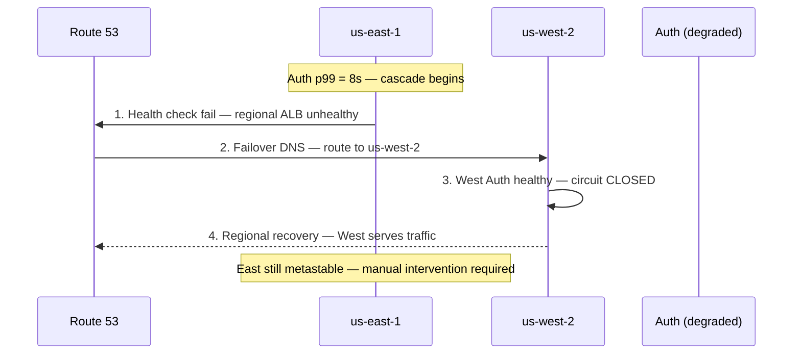
```mermaid
sequenceDiagram
    participant R53 as Route 53
    participant East as us-east-1
    participant West as us-west-2
    participant Auth as Auth (degraded)

    Note over East: Auth p99 = 8s — cascade begins
    East->>R53: 1. Health check fail — regional ALB unhealthy
    R53->>West: 2. Failover DNS — route to us-west-2
    West->>West: 3. West Auth healthy — circuit CLOSED
    West-->>R53: 4. Regional recovery — West serves traffic
    Note over East: East still metastable — manual intervention required
```

**Step-by-step flow:**

| Step | Action | Explanation |
|------|--------|-------------|
| **1** | Health check fail | Regional ALB health degrades as BFF fleet exhausts. |
| **2** | Failover DNS | Route 53 shifts traffic to healthy region. |
| **3** | West healthy | West region Auth + BFF operating normally. |
| **4** | Regional recovery | Users in failover region get full service. |

**Caution:** Failover does not fix metastable East — drain connections, reset circuit breakers, clear retry queues before re-admitting traffic.

### 12.3 Recovery runbook (metastable failure)

| Step | Action | Owner | Duration |
|------|--------|-------|----------|
| **1** | Confirm Auth root cause identified (or still investigating) | Auth team | — |
| **2** | Manually OPEN circuit breaker fleet-wide on BFF | Platform SRE | 2 min |
| **3** | Enable degraded mode (`X-Degraded: auth` catalog-only) | BFF team | 1 min |
| **4** | Reduce client retry rate via feature flag (SSM Parameter) | Client platform | 5 min |
| **5** | Scale Auth horizontally (if CPU-bound) | Auth team | 10 min |
| **6** | Wait for BFF thread pools to drain (no new Auth calls) | — | 5–15 min |
| **7** | HALF_OPEN probe — 3 canary requests to Auth | SRE | 1 min |
| **8** | CLOSE circuit breaker; re-enable full home screen | SRE | 2 min |
| **9** | Post-incident: verify retry budget metrics returned to baseline | SRE | 30 min |

---

## 13. Chaos Engineering and Validation

### 13.1 AWS FIS experiment — Auth latency injection

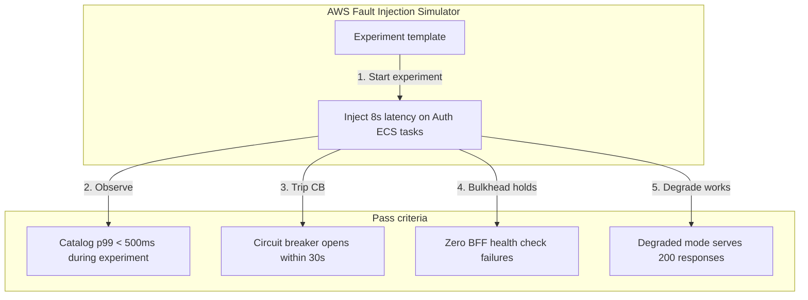
```mermaid
flowchart TB
    subgraph FIS["AWS Fault Injection Simulator"]
        EXP[Experiment template]
        LAT[Inject 8s latency on Auth ECS tasks]
    end

    subgraph Validation["Pass criteria"]
        V1[Catalog p99 < 500ms during experiment]
        V2[Circuit breaker opens within 30s]
        V3[Zero BFF health check failures]
        V4[Degraded mode serves 200 responses]
    end

    EXP -->|"1. Start experiment"| LAT
    LAT -->|"2. Observe"| V1
    LAT -->|"3. Trip CB"| V2
    LAT -->|"4. Bulkhead holds"| V3
    LAT -->|"5. Degrade works"| V4
```

**Step-by-step flow:**

| Step | Action | Explanation |
|------|--------|-------------|
| **1** | Start experiment | FIS adds 8s latency to Auth tasks in staging. |
| **2** | Observe | Catalog latency must stay &lt; 500ms — bulkhead proof. |
| **3** | Trip CB | Circuit opens within 30s of slow-call threshold. |
| **4** | Bulkhead holds | BFF `/health/live` stays 200 — shallow health check. |
| **5** | Degrade works | Clients receive catalog-only home with `X-Degraded: auth`. |

### 13.2 Chaos experiment catalog

| Experiment | Injection | Pass criteria |
|------------|-----------|---------------|
| Auth latency 8s | FIS network latency | Catalog unaffected; CB opens |
| Auth 100% error | FIS HTTP 500 | Fast-fail &lt; 5ms; no thread exhaustion |
| Auth complete down | Scale Auth to 0 | Degraded mode; no cascade |
| Retry storm | Load test 3% retry rate | Retry budget caps at 1% |
| AZ failure | FIS terminate AZ-a | ALB reroutes; no user impact |
| Metastable recovery | Latency injection → heal → verify | Manual CB reset required |

---

## 14. Security, Observability, and Operations

### 14.1 Security architecture

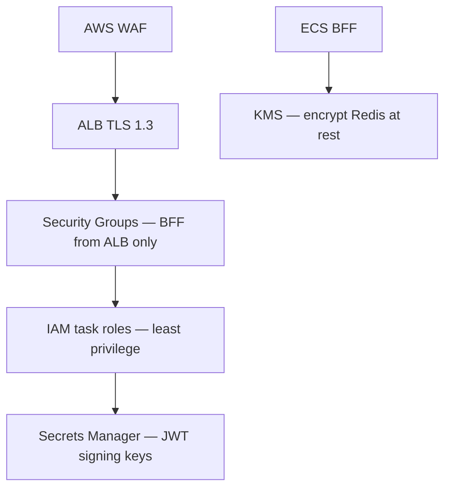
```mermaid
flowchart TB
    WAF[AWS WAF] --> ALB[ALB TLS 1.3]
    ALB --> SG[Security Groups — BFF from ALB only]
    SG --> IAM[IAM task roles — least privilege]
    IAM --> SM[Secrets Manager — JWT signing keys]
    BFF[ECS BFF] --> KMS[KMS — encrypt Redis at rest]
```

| Topic | Implementation |
|-------|----------------|
| **Session tokens** | Short-lived JWT; Redis encrypted at rest (KMS) |
| **Degraded mode** | Never bypass entitlements for paid content — catalog-only is safe |
| **Rate limit** | WAF + per-client token bucket on BFF |
| **Circuit breaker admin** | Manual trip requires break-glass IAM role + CloudTrail audit |

### 14.2 Observability architecture

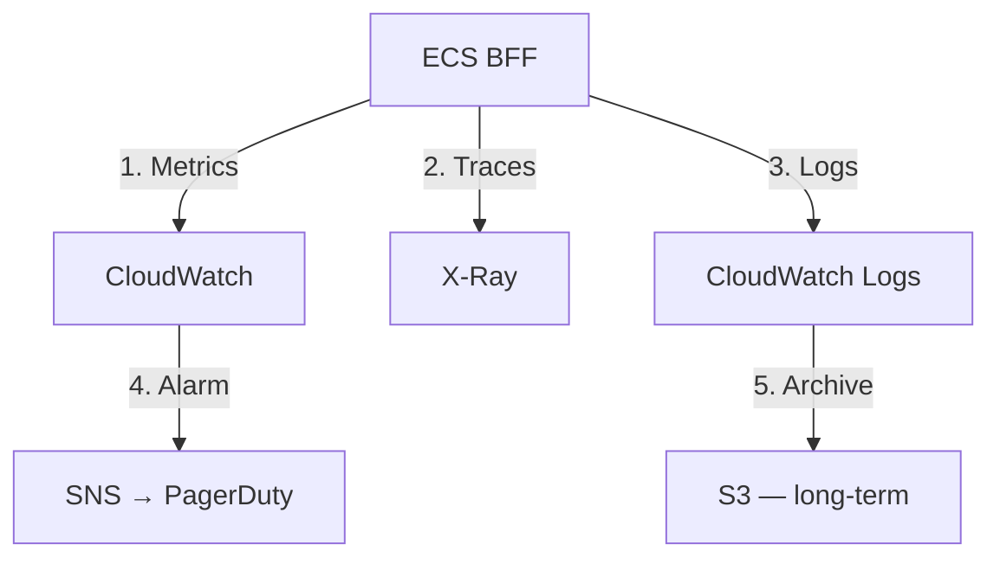
```mermaid
flowchart TB
    BFF[ECS BFF] -->|"1. Metrics"| CW[CloudWatch]
    BFF -->|"2. Traces"| XR[X-Ray]
    BFF -->|"3. Logs"| CWL[CloudWatch Logs]
    CW -->|"4. Alarm"| SNS[SNS → PagerDuty]
    CWL -->|"5. Archive"| S3[S3 — long-term]
```

**Required metrics:**

| Metric | Alert threshold | Why |
|--------|-----------------|-----|
| `bff_thread_pool_active_ratio` | > 0.9 for 2 min | Cascade imminent |
| `auth_circuit_breaker_state` | OPEN for > 5 min | Sustained Auth degradation |
| `auth_client_latency_p99` | > 200ms for 1 min | Slow-call threshold breach |
| `retry_budget_utilization` | > 80% | Retry storm building |
| `degraded_response_rate` | > 10% | User-visible degradation |
| `catalog_bulkhead_rejected` | > 0 | Catalog pool saturated — escalate |

**Structured log (every auth call):**

```json
{
  "request_id": "req_8f3a",
  "auth_outcome": "success|timeout|circuit_open|bulkhead_rejected",
  "auth_latency_ms": 45,
  "circuit_state": "CLOSED",
  "degraded": false,
  "bulkhead_pool": "auth"
}
```

---

## 15. Implementation Roadmap (6-Week Rollout)

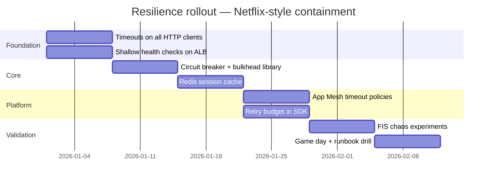
```mermaid
gantt
    title Resilience rollout — Netflix-style containment
    dateFormat YYYY-MM-DD
    section Foundation
    Timeouts on all HTTP clients     :w1, 2026-01-01, 7d
    Shallow health checks on ALB      :w1, 2026-01-01, 7d
    section Core
    Circuit breaker + bulkhead library  :w2, 2026-01-08, 7d
    Redis session cache               :w3, 2026-01-15, 7d
    section Platform
    App Mesh timeout policies         :w4, 2026-01-22, 7d
    Retry budget in SDK               :w4, 2026-01-22, 7d
    section Validation
    FIS chaos experiments             :w5, 2026-01-29, 7d
    Game day + runbook drill          :w6, 2026-02-05, 7d
```

| Week | Deliverable | AWS services |
|------|-------------|--------------|
| 1 | Timeouts + shallow health | ALB, ECS, CloudWatch |
| 2 | Circuit breaker + bulkhead | ECS, Resilience4j library |
| 3 | Session cache + degraded mode | ElastiCache Redis |
| 4 | Mesh policies + retry budget | App Mesh, SSM Parameter Store |
| 5 | Chaos experiments | AWS FIS, staging VPC |
| 6 | Game day + production gates | CloudWatch dashboards, PagerDuty |

---

## 16. Testing Strategy

| Test type | Tool | Scenario |
|-----------|------|----------|
| Unit | JUnit / pytest | Circuit breaker state transitions |
| Integration | Testcontainers | Auth timeout → fallback path |
| Load | k6 / Gatling | 10K RPS with 3% client retry |
| Chaos | AWS FIS | 8s Auth latency injection |
| Game day | Manual + FIS | Full metastable recovery runbook |

**Load test pass criteria:**

| Metric | Threshold |
|--------|-----------|
| Catalog p99 during Auth degradation | < 500ms |
| BFF error rate | < 0.1% (excluding degraded 200s) |
| Thread pool saturation | < 80% on catalog bulkhead |
| Circuit breaker trip time | < 30s from injection start |

---

## 17. Architecture Review Checklist

| # | Gate | Status |
|---|------|--------|
| 1 | Every outbound HTTP call has explicit timeout ≤ 200ms | ☐ |
| 2 | Circuit breaker on all synchronous dependencies | ☐ |
| 3 | Bulkhead separates critical vs optional dependency pools | ☐ |
| 4 | ALB health check does NOT call downstream dependencies | ☐ |
| 5 | Retry budget caps fleet-wide retry rate ≤ 1% | ☐ |
| 6 | Degraded mode defined and tested for each critical dependency | ☐ |
| 7 | Redis session cache with TTL + encryption at rest | ☐ |
| 8 | FIS chaos experiment passes in staging | ☐ |
| 9 | Metastable recovery runbook documented and drilled | ☐ |
| 10 | Dashboards: thread pool, CB state, retry budget, degraded rate | ☐ |
| 11 | App Mesh / sidecar enforces platform timeout defaults | ☐ |
| 12 | Post-incident: Auth latency injection in CI pipeline (weekly) | ☐ |

---

## 18. Related Study

- [Resilience Patterns](/docs/microservices/resilience-patterns)
- [Partial Failure](/docs/distributed-systems-foundations/partial-failure)
- [Chaos Engineering](/docs/reliability-and-resilience/chaos-engineering)
- [PACELC — Netflix scenarios](/docs/consistency/pacelc#scenario-b-netflix-streaming--pael-for-metadata-reads-pcec-for-billing)
- Lab: [Chaos testing](/docs/reliability-and-resilience/chaos-engineering#25-hands-on-exercise) on **`:8103`**
