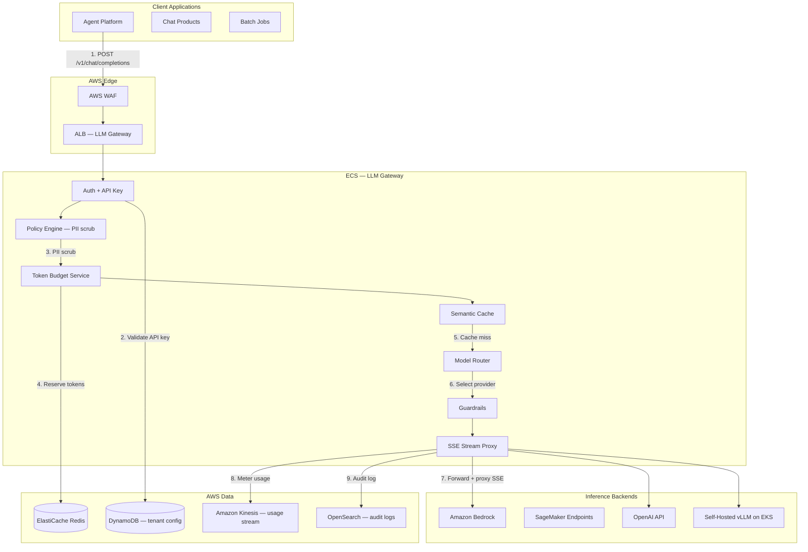
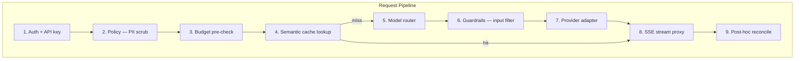
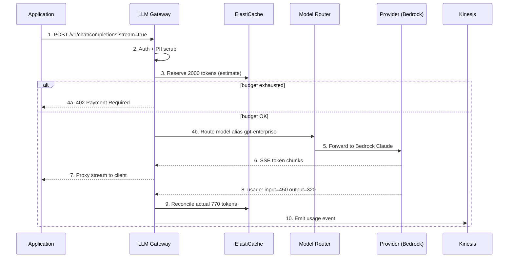
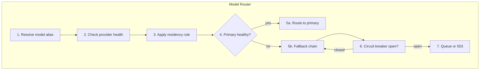
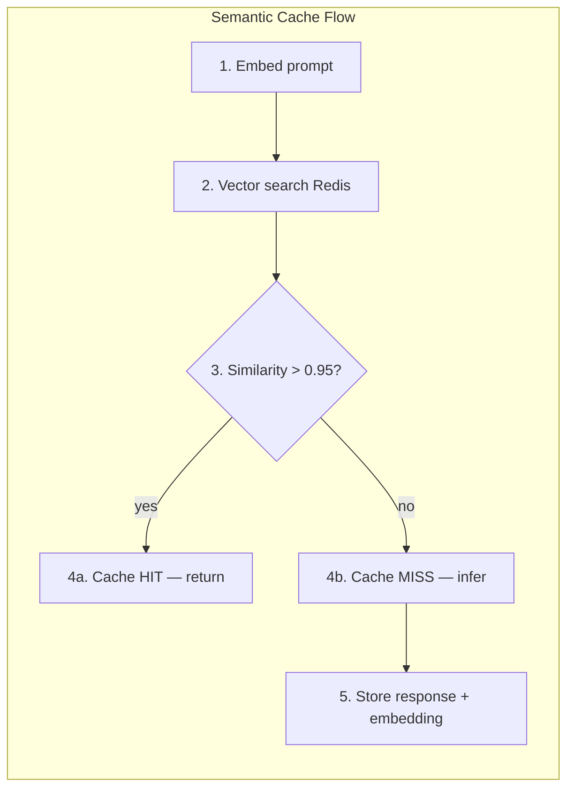
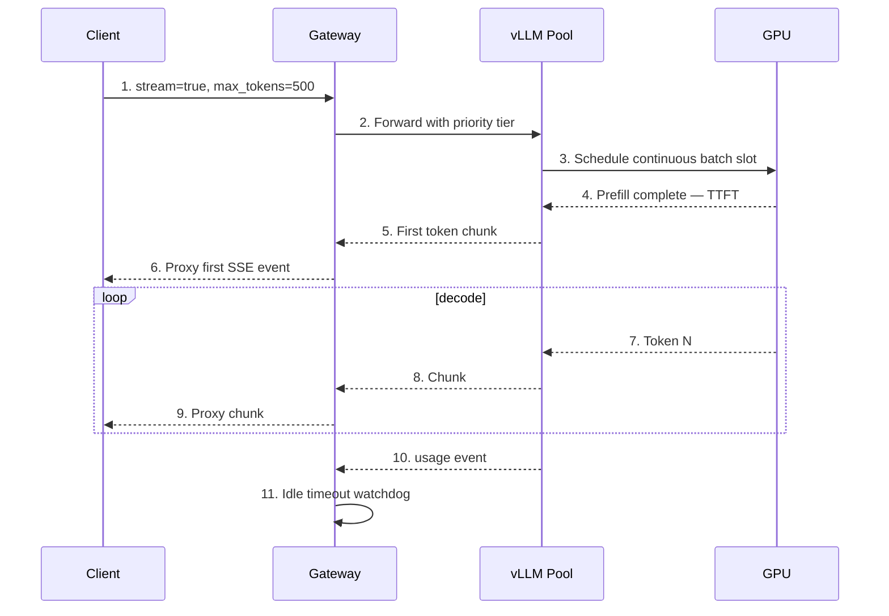
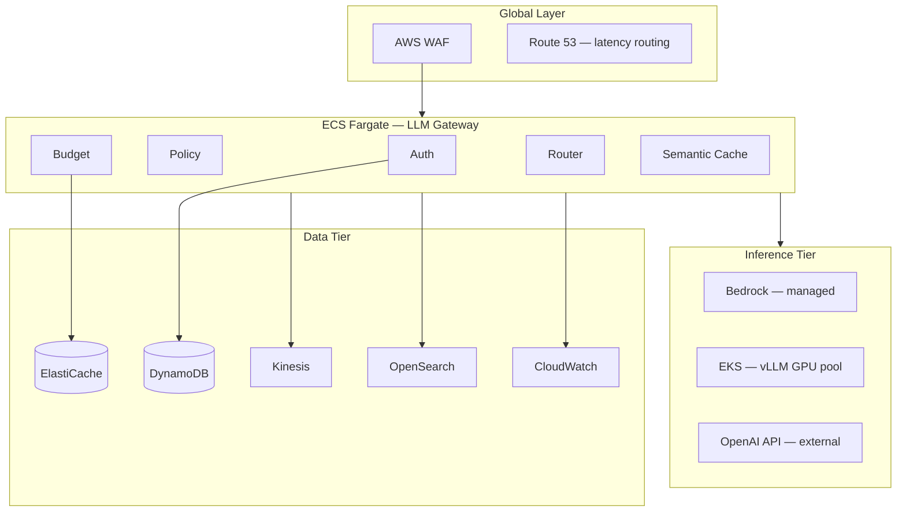
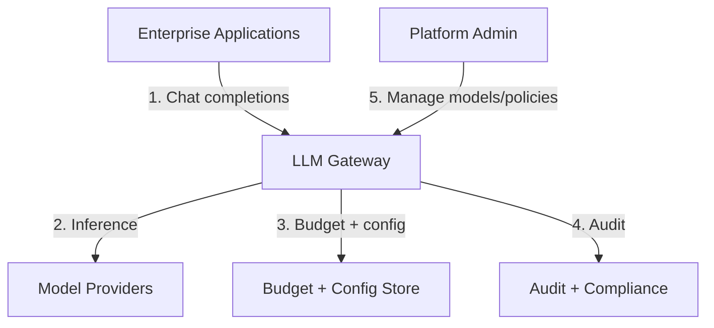
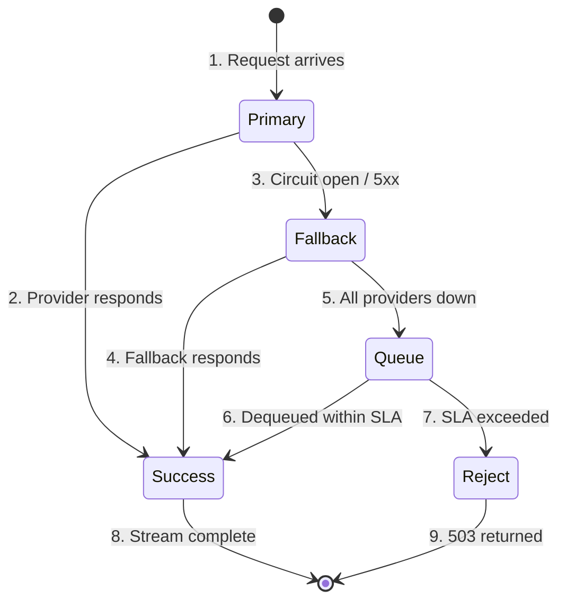
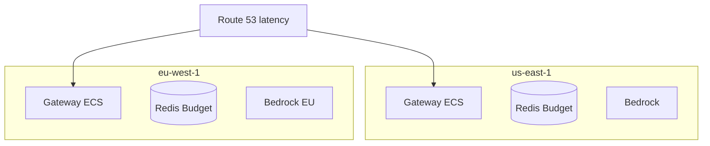

# Scenario: OpenAI LLM Gateway

> **Diagram convention:** Arrows and messages are labeled **1, 2, 3…** to show processing order. Each diagram is followed by a **Step-by-step flow** table explaining every numbered step.

## 1. The Interview Question

> "Design an LLM gateway that routes requests across multiple model providers, enforces per-tenant budgets, and keeps p99 latency under 2 seconds for chat workloads."

## 2. Real-World Context

| Dimension | Detail |
|-----------|--------|
| **Company / system** | [OpenAI API](https://platform.openai.com/docs) / enterprise AI platforms — routing, quotas, observability across heterogeneous inference backends |
| **Scale** | 500+ consuming apps; 2K req/sec peak; variable token lengths; GPU-bound inference; provider outages |
| **Why architects care** | New distributed systems constraints: **token budgets**, **streaming SSE**, **semantic cache**, **KV cache** on GPU side |
| **Public references** | OpenAI API docs; [vLLM](https://docs.vllm.ai/); platform engineering blogs on LLM serving |

### AWS deployment context

Typical enterprise LLM gateway on AWS: **Amazon API Gateway** or **ALB + ECS Fargate** gateway service; **Amazon ElastiCache Redis** for token budgets and semantic cache embeddings; **Amazon DynamoDB** for tenant config, model registry, and durable usage ledger; **AWS Secrets Manager** for provider API keys; **Amazon Bedrock** + **SageMaker** endpoints as inference backends; **Amazon OpenSearch** for audit log search; **Amazon Kinesis** for usage event stream; **CloudWatch + X-Ray** for TTFT/latency SLOs; **AWS WAF** for abuse protection.



**Step-by-step flow:**

| Step | Action | Explanation |
|------|--------|-------------|
| **1** | POST /v1/chat/completions | Client sends chat request with `stream=true`. |
| **2** | Validate API key | Lookup tenant config: budget, allowed models, residency rules. |
| **3** | PII scrub | Redact SSN, email, credit card before any provider call. |
| **4** | Reserve tokens | Pre-deduct estimated input+output tokens from tenant budget in Redis. |
| **5** | Cache miss | Semantic cache lookup by embedding similarity — skip if hit. |
| **6** | Select provider | Router picks backend by model alias, health, cost, residency. |
| **7** | Forward + proxy SSE | Gateway proxies streaming tokens to client; meters on `usage` events. |
| **8** | Meter usage | Async usage events to Kinesis for chargeback and reconciliation. |
| **9** | Audit log | Redacted prompt hash + metadata to OpenSearch for compliance. |

## 3. Step-by-Step Interview Answer

### Step 1 — Clarify requirements

| Requirement | Target |
|-------------|--------|
| **API contract** | OpenAI-compatible `POST /v1/chat/completions` with SSE streaming |
| **Throughput** | 10K RPS peak; 100K concurrent SSE connections |
| **Gateway p99** | &lt; 20ms overhead (excluding model inference time) |
| **Chat p99** | &lt; 2s TTFT for standard workloads |
| **Tenants** | 500+ apps; per-tenant token budgets and model allowlists |
| **Providers** | OpenAI, Anthropic, Azure OpenAI, Amazon Bedrock, self-hosted vLLM |
| **Security** | PII redaction; audit log; no training on customer data |
| **Non-goals** | Model training pipelines; fine-tuning infrastructure |

### Step 2 — Capacity and cost math

| Metric | Calculation | Result |
|--------|-------------|--------|
| **Peak RPS** | 10K req/sec | ~500 gateway ECS tasks (20 RPS/task) |
| **Concurrent SSE** | 100K streams | Connection pooling; 2K streams/task |
| **Token budget check** | Redis INCRBY per request | &lt; 5ms p99 |
| **Monthly inference spend** | 2B tokens/day × $0.01/1K avg | ~$600K/month — budget enforcement critical |
| **Semantic cache hit rate** | 20–30% for support bots | Saves ~$120–180K/month |
| **Small model routing** | 40% queries → cheap model | Additional ~$200K/month savings |

### Step 3 — Gateway architecture



**Step-by-step flow:**

| Step | Action | Explanation |
|------|--------|-------------|
| **1** | Auth | Validate API key; load tenant config from DynamoDB (cached). |
| **2** | PII scrub | Regex + NER model redact sensitive fields before provider. |
| **3** | Budget pre-check | Reserve estimated tokens; reject 402 if budget exhausted. |
| **4** | Semantic cache | Embedding similarity search — return cached response on hit. |
| **5** | Model router | Select provider by alias, health, cost tier, data residency. |
| **6** | Guardrails | Block prompt injection patterns; content policy filter. |
| **7** | Provider adapter | Unified interface → OpenAI / Bedrock / vLLM native API. |
| **8** | SSE stream proxy | Multiplex provider token stream to client connection. |
| **9** | Post-hoc reconcile | True-up token count from `usage` event; refund over-reservation. |

### Step 4 — Chat completion request sequence



**Step-by-step flow:**

| Step | Action | Explanation |
|------|--------|-------------|
| **1** | POST request | Client sends messages array with `stream=true`. |
| **2** | Auth + PII scrub | Validate tenant; redact sensitive content. |
| **3** | Reserve tokens | Pre-deduct estimated tokens (input length + max_output). |
| **4a** | Budget exhausted | Return 402 with `Retry-After` when daily cap hit. |
| **4b** | Route | Router resolves `gpt-enterprise` → Bedrock Claude 3.5. |
| **5** | Forward | Provider adapter translates to Bedrock Converse API. |
| **6** | SSE chunks | Provider streams `data: {"choices":[{"delta":{"content":"Hi"}}]}` |
| **7** | Proxy stream | Gateway forwards chunks; client sees low TTFT. |
| **8** | Usage event | Provider returns final `usage` with actual token counts. |
| **9** | Reconcile | Adjust Redis budget: refund over-reservation delta. |
| **10** | Usage event | Async to Kinesis for chargeback warehouse. |

### Step 5 — Model routing and fallback



**Step-by-step flow:**

| Step | Action | Explanation |
|------|--------|-------------|
| **1** | Resolve alias | `gpt-enterprise` → `{provider: bedrock, model: claude-3-5-sonnet}` |
| **2** | Check health | Circuit breaker state per provider — error rate / latency. |
| **3** | Residency rule | EU tenant → EU-only endpoints (Bedrock eu-west-1). |
| **4** | Primary healthy? | If yes, route to primary; if no, enter fallback chain. |
| **5a** | Route primary | Normal path — lowest latency, preferred model. |
| **5b** | Fallback chain | `gpt-4` → `gpt-4-turbo` → `gpt-3.5-turbo` ordered list. |
| **6** | Circuit breaker | Open after 5 consecutive 5xx or p99 &gt; 10s. |
| **7** | Queue or 503 | If all providers down: queue with SLA or return 503. |

### Step 6 — Semantic cache



**Step-by-step flow:**

| Step | Action | Explanation |
|------|--------|-------------|
| **1** | Embed prompt | Generate embedding via small model (e.g., `text-embedding-3-small`). |
| **2** | Vector search | Redis vector index (RedisSearch) — tenant-scoped keys. |
| **3** | Similarity threshold | Cosine similarity &gt; 0.95 → cache hit. |
| **4a** | Cache HIT | Return cached response — skip provider call; meter as cache hit. |
| **4b** | Cache MISS | Forward to provider; stream response to client. |
| **5** | Store response | Cache response + embedding with TTL (e.g., 24h). |

### Step 7 — Streaming and tail latency



**Step-by-step flow:**

| Step | Action | Explanation |
|------|--------|-------------|
| **1** | Stream request | Client expects SSE with `data:` prefixed JSON chunks. |
| **2** | Priority tier | Premium tenants get higher queue priority on vLLM. |
| **3** | Continuous batch | vLLM dynamically batches prefill + decode requests. |
| **4** | Prefill complete | TTFT dominated by prompt length and GPU queue depth. |
| **5–6** | First token | Gateway proxies first chunk — client sees responsive UI. |
| **7–9** | Decode loop | Inter-token latency (TPOT) — typically 20–50ms/token. |
| **10** | Usage event | Final token count for budget reconciliation. |
| **11** | Idle timeout | Close SSE if no token for 30s — prevent zombie connections. |

## 4. Whiteboard Guide

Draw three layers: **Gateway** (policy + budget + routing) → **Provider Adapters** → **Inference Backends**. Emphasize gateway overhead is separate from model latency.



**Step-by-step flow:**

| Step | Component | Role |
|------|-----------|------|
| **1** | WAF | Rate limit abusive IPs; block known attack patterns. |
| **2** | Auth + Policy | API key validation; PII scrub; tenant isolation. |
| **3** | Budget | Redis token counters; pre-reserve + reconcile pattern. |
| **4** | Semantic Cache | Embedding similarity — 20–30% cost reduction. |
| **5** | Router | Health-aware provider selection with fallback chains. |
| **6** | Inference tier | Heterogeneous backends behind unified adapter interface. |
| **7** | Kinesis + OpenSearch | Usage metering and compliance audit trail. |

## 5. Principal-Level Signals

| Signal | What strong candidates say |
|--------|---------------------------|
| **Token budget first-class** | "Tokens are the currency — pre-reserve, reconcile, hard-stop on exhaustion." |
| **Gateway vs model latency** | "Our p99 &lt; 2s SLO is TTFT; gateway overhead target is &lt; 20ms." |
| **Provider abstraction** | "OpenAI-compatible facade; model aliases hide provider/version churn." |
| **Fallback with degradation** | "GPT-4 down → GPT-3.5 with `model_degraded: true` header." |
| **Tenant-scoped cache** | "Semantic cache keys include tenant_id — no cross-tenant leakage." |
| **Streaming metering** | "Meter tokens on final `usage` event; mid-stream budget exhaustion is a policy choice." |

## 6. Red Flags

| Red flag | Why it fails |
|----------|-------------|
| **Direct OpenAI calls from every app** | No cost control, no audit, no unified fallback. |
| **Rate limit by request count only** | LLM cost is token-based — 1 request can be 100K tokens. |
| **No pre-reservation** | Race conditions cause budget overruns across concurrent requests. |
| **Shared semantic cache** | Tenant A's prompt returns Tenant B's cached response — data leak. |
| **Ignoring streaming** | Blocking on full response kills UX; SSE is default for chat. |
| **No circuit breaker** | Provider 503 cascades into gateway thread exhaustion. |
| **Synchronous audit logging** | Blocks hot path; audit must be async to Kinesis/OpenSearch. |

## 7. Follow-Up Questions

| Question | Strong answer |
|----------|---------------|
| **GPT-4 down, GPT-3.5 up?** | Fallback chain auto-routes; return `X-Model-Degraded: true` header; notify tenant via webhook. |
| **Agent loop burning tokens?** | Per-session budget cap; max tool-call iterations; circuit breaker on loop detection. |
| **EU data residency?** | Route EU tenants to Bedrock `eu-west-1` only; block external API calls for EU data. |
| **Underestimated token count?** | Reserve with buffer (1.2× estimate); reconcile post-response; async overage billing. |
| **Cache poisoning?** | Tenant-scoped keys; TTL; admin cache purge API; no cache for user-specific data. |
| **Multi-modal (images)?** | Separate routing tier; vision models cost more — different budget pool. |
| **Eval-gated model promotion?** | Canary 5% traffic to new model; promote only if eval score ≥ baseline. |

## 8. Practice Drill (10 min)

1. **2 min** — State token budget pre-reserve + reconcile pattern.
2. **3 min** — Draw request flow: auth → budget → cache → router → provider → SSE proxy.
3. **3 min** — Design fallback when primary provider circuit breaker opens.
4. **2 min** — Explain why semantic cache keys must be tenant-scoped.

## 9. Key Takeaways

1. **Token budgets** are first-class — pre-reserve in Redis, reconcile on `usage` event.
2. **Gateway overhead ≠ model latency** — measure TTFT and gateway p99 separately.
3. **OpenAI-compatible facade** — model aliases + provider adapters enable multi-vendor routing.
4. **Semantic cache** — 20–30% cost savings for repetitive prompts; tenant-scoped keys mandatory.
5. **Streaming is default** — SSE proxy with idle timeout; meter tokens asynchronously.

## 10. Production HLD

### 10.1 C4 Context



**Step-by-step flow:**

| Step | Interaction | Explanation |
|------|-------------|-------------|
| **1** | Apps ↔ Gateway | OpenAI-compatible chat completion API. |
| **2** | Providers | Bedrock, SageMaker, OpenAI, self-hosted vLLM. |
| **3** | Budget + config | Redis counters; DynamoDB tenant/model registry. |
| **4** | Audit | Redacted logs to OpenSearch; usage to Kinesis. |
| **5** | Admin | Register models, set budgets, configure policies. |

### 10.2 Full production stack

| Layer | AWS Service | Purpose |
|-------|-------------|---------|
| **Edge** | WAF + ALB | Abuse protection; TLS termination |
| **Gateway** | ECS Fargate | Auth, policy, budget, router, SSE proxy |
| **Token budgets** | ElastiCache Redis | Pre-reserve + reconcile counters |
| **Semantic cache** | ElastiCache Redis (vector) | Embedding similarity search |
| **Tenant config** | DynamoDB | API keys, budgets, model allowlists, residency |
| **Provider secrets** | Secrets Manager | OpenAI/Anthropic API keys; auto-rotate |
| **Managed inference** | Amazon Bedrock | Claude, Llama, Titan models |
| **Self-hosted inference** | EKS + vLLM | Custom models; GPU autoscaling |
| **Usage metering** | Kinesis → S3 → Athena | Chargeback warehouse |
| **Audit** | OpenSearch | Compliance search; prompt hash index |
| **Observability** | CloudWatch + X-Ray | TTFT, token usage, error rate per model |

### 10.3 Architecture index

| # | Diagram | Section |
|---|---------|---------|
| 1 | AWS deployment context | §2 |
| 2 | Request pipeline | §3 Step 3 |
| 3 | Chat completion sequence | §3 Step 4 |
| 4 | Model routing + fallback | §3 Step 5 |
| 5 | Semantic cache flow | §3 Step 6 |
| 6 | Streaming + tail latency | §3 Step 7 |
| 7 | Whiteboard AWS layout | §4 |
| 8 | C4 context | §10.1 |
| 9 | Budget service LLD | §11.2 |
| 10 | Fallback state machine | §11.4 |

## 11. Production LLD

### 11.1 Data schemas

**Tenant config (DynamoDB)**

| Attribute | Type | Key | Description |
|-----------|------|-----|-------------|
| `tenant_id` | String | PK | API key owner |
| `daily_token_budget` | Number | — | Max tokens per day (default 100K) |
| `burst_rps` | Number | — | Max requests per second (default 50) |
| `allowed_models` | List | — | Model aliases permitted |
| `residency` | String | — | `us`, `eu`, `global` |
| `tier` | String | — | `free`, `standard`, `premium` |

**Model registry (DynamoDB)**

| Attribute | Type | Description |
|-----------|------|-------------|
| `alias` | String PK | Logical name: `gpt-enterprise` |
| `provider` | String | `bedrock`, `openai`, `vllm` |
| `model_id` | String | Provider-specific model ID |
| `fallback_chain` | List | Ordered fallback aliases |
| `cost_per_1k_input` | Number | For chargeback |
| `cost_per_1k_output` | Number | For chargeback |

**Usage ledger (Kinesis → S3)**

| Field | Type | Description |
|-------|------|-------------|
| `tenant_id` | String | Consumer |
| `model_alias` | String | Logical model used |
| `provider` | String | Actual backend |
| `input_tokens` | Number | From `usage` event |
| `output_tokens` | Number | From `usage` event |
| `latency_ms` | Number | TTFT + total |
| `cache_hit` | Boolean | Semantic cache hit |
| `timestamp` | ISO8601 | Event time |

### 11.2 Budget service pseudocode

```python
def reserve_tokens(tenant_id: str, estimated: int) -> Reservation:
    key = f"budget:{tenant_id}:{today()}"
    pipe = redis.pipeline()
    pipe.get(key)
    pipe.incrby(key, estimated)
    current, new_total = pipe.execute()
    current = int(current or 0)
    budget = get_tenant_budget(tenant_id)

    if new_total > budget:
        redis.decrby(key, estimated)  # rollback
        raise BudgetExhausted(tenant_id, budget, current)

    return Reservation(tenant_id, estimated, reservation_id=uuid4())

def reconcile(reservation: Reservation, actual_tokens: int):
    delta = reservation.estimated - actual_tokens
    if delta > 0:
        redis.decrby(f"budget:{reservation.tenant_id}:{today()}", delta)
    emit_usage_event(reservation, actual_tokens)
```

### 11.3 API contract

**POST /v1/chat/completions**

```json
// Request
{
  "model": "gpt-enterprise",
  "messages": [{"role": "user", "content": "Summarize this document"}],
  "stream": true,
  "max_tokens": 500
}

// Response headers
// X-Request-Id: req_abc123
// X-Model-Used: claude-3-5-sonnet (via gpt-enterprise)
// X-Tokens-Reserved: 2000
// X-Cache: MISS

// SSE stream
data: {"id":"chatcmpl-abc","choices":[{"delta":{"content":"The"}}]}
data: {"id":"chatcmpl-abc","choices":[{"delta":{"content":" document"}}]}
data: [DONE]
```

**Error responses**

| Code | Condition | Body |
|------|-----------|------|
| `401` | Invalid API key | `{"error": "invalid_api_key"}` |
| `402` | Budget exhausted | `{"error": "budget_exhausted", "retry_after": 3600}` |
| `429` | Rate limit | `{"error": "rate_limit", "retry_after": 60}` |
| `503` | All providers down | `{"error": "service_unavailable", "fallback_attempted": true}` |

### 11.4 Fallback state machine



**Step-by-step flow:**

| Step | State | Explanation |
|------|-------|-------------|
| **1** | Primary | Router selects primary provider for model alias. |
| **2** | Success | Normal path — stream response to client. |
| **3** | Fallback | Circuit breaker open or 5xx — try next in chain. |
| **4** | Success | Fallback provider responds — add degradation header. |
| **5** | Queue | All providers unhealthy — enqueue with timeout. |
| **6** | Success | Request dequeued when provider recovers. |
| **7** | Reject | SLA exceeded — return 503 with retry guidance. |

### 11.5 Provider adapter interface

```python
class ProviderAdapter(Protocol):
    async def chat_completion(
        self,
        model_id: str,
        messages: list[dict],
        stream: bool,
        max_tokens: int,
    ) -> AsyncIterator[StreamChunk] | ChatCompletion:
        ...

class BedrockAdapter(ProviderAdapter):
    async def chat_completion(self, model_id, messages, stream, max_tokens):
        client = boto3.client("bedrock-runtime", region_name=self.region)
        response = client.converse_stream(
            modelId=model_id,
            messages=translate_messages(messages),
            inferenceConfig={"maxTokens": max_tokens},
        )
        async for event in response["stream"]:
            yield translate_chunk(event)

class OpenAIAdapter(ProviderAdapter):
    async def chat_completion(self, model_id, messages, stream, max_tokens):
        async with httpx.AsyncClient() as client:
            async with client.stream(
                "POST", "https://api.openai.com/v1/chat/completions",
                json={"model": model_id, "messages": messages, "stream": stream},
                headers={"Authorization": f"Bearer {self.api_key}"},
            ) as response:
                async for line in response.aiter_lines():
                    yield parse_sse_line(line)
```

## 12. HA, DR, and Multi-Region



| Concern | Strategy |
|---------|----------|
| **Gateway HA** | ECS across 3 AZs; ALB health checks; auto-scale on RPS |
| **Redis HA** | ElastiCache cluster mode; replica per shard |
| **Provider outage** | Circuit breaker + fallback chain; cross-provider routing |
| **EU residency** | EU tenants pinned to `eu-west-1`; no cross-border inference |
| **SSE connection drain** | ALB connection draining on deploy; 30s idle timeout |
| **Budget consistency** | Redis atomic INCRBY; eventual reconciliation via Kinesis |

## 13. Observability

| Metric | Target | Alarm |
|--------|--------|-------|
| `gateway.overhead.p99` | &lt; 20ms | &gt; 50ms |
| `ttft.p99` | &lt; 2s | &gt; 5s |
| `budget.check.p99` | &lt; 5ms | &gt; 20ms |
| `semantic_cache.hit_rate` | &gt; 20% | &lt; 10% |
| `provider.error_rate` | &lt; 1% | &gt; 5% |
| `circuit_breaker.open` | 0 | Any open &gt; 5 min |

**Dashboards:** Token usage per tenant; cost per model; TTFT by provider; fallback rate; cache hit ratio.

## 14. Evolution Roadmap

| Phase | Capability | Trigger |
|-------|------------|---------|
| **V1** | Single provider (OpenAI) + rate limit | Initial launch |
| **V2** | Multi-provider routing + fallback | Provider outage incident |
| **V3** | Token budgets + semantic cache | Cost overrun |
| **V4** | Self-hosted vLLM on EKS | Data residency / cost at scale |
| **V5** | Eval-gated canary routing | Model quality regression |

## 15. Testing Strategy

| Test type | Scenario | Pass criteria |
|-----------|----------|---------------|
| **Unit** | Budget reserve + reconcile | No overruns under concurrent load |
| **Integration** | End-to-end streaming | SSE chunks arrive; usage metered |
| **Fallback** | Primary provider 503 | Fallback responds within 500ms |
| **Cache** | Identical prompt twice | Second request cache hit; no provider call |
| **Isolation** | Tenant A cache | Tenant B does not see Tenant A cached response |
| **Load** | 10K RPS sustained | Gateway p99 &lt; 20ms; no connection leaks |
| **Chaos** | Kill Redis shard | Budget check degrades gracefully (fail-closed) |

## 16. Production Checklist

- [ ] OpenAI-compatible API contract (`/v1/chat/completions`)
- [ ] Token budget pre-reserve + reconcile in Redis
- [ ] Model aliases with fallback chains in DynamoDB
- [ ] Provider adapters for Bedrock, OpenAI, vLLM
- [ ] Circuit breaker per provider with health metrics
- [ ] Semantic cache with tenant-scoped keys
- [ ] PII scrub before any provider call
- [ ] SSE stream proxy with idle timeout
- [ ] Async audit log to OpenSearch (no raw PII)
- [ ] Usage events to Kinesis for chargeback
- [ ] EU residency routing enforced for EU tenants
- [ ] `X-Model-Degraded` header on fallback responses

## 17. Related Study

- [LLM Gateway](/docs/system-design/llm-gateway) — canonical chapter with routing, budgets, guardrails
- [LLM Serving and Model Gateways](/docs/ai-distributed-systems/llm-serving-and-model-gateways) — vLLM, continuous batching, TTFT
- [Scenario: Airbnb Distributed Rate Limiting](/docs/real-world-scenarios/airbnb-distributed-rate-limiting) — Redis token buckets at scale
- Lab: [Agent platform](/docs/agentic-ai-architecture/agent-platform-architecture#25-hands-on-exercise) on **`:8106`** — enterprise agent platform with gateway integration
