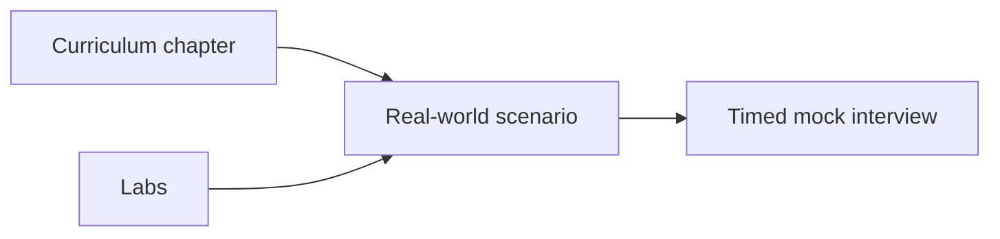

# Real-World Scenarios Overview

Step-by-step interview walkthroughs grounded in **production systems** at scale. Each scenario includes the interview question, real company context, timed answer structure, whiteboard guide, failure modes, and principal-level signals.

## How to Use

1. Study the related curriculum chapter first.
2. Complete the linked lab if available.
3. Practice the scenario **aloud** in 45 minutes using the [STEP framework](/docs/start-here/real-world-interview-prep#the-step-interview-framework) (Scope → Topology → Explore → Production → Evolve).
4. Compare your answer to the provided walkthrough.

## Foundations and Reliability

| Scenario | Topic | Deep chapter | Lab |
|----------|-------|--------------|-----|
| [Stripe Payment Idempotency](./stripe-payment-idempotency) | Partial failure, timeout ambiguity | [Partial Failure](/docs/distributed-systems-foundations/partial-failure) | [008](/docs/distributed-systems-foundations/idempotency#25-hands-on-exercise) `:8081` / [017](./stripe-payment-idempotency#hands-on-lab-local) `:8080` |
| [Netflix Cascading Failure](./netflix-cascading-failure) | Circuit breakers, retry storms | [Resilience Patterns](/docs/microservices/resilience-patterns) | [013](/docs/reliability-and-resilience/chaos-engineering#25-hands-on-exercise) `:8103` |

## Data and Messaging

| Scenario | Topic | Deep chapter | Lab |
|----------|-------|--------------|-----|
| [Shopify Transactional Outbox](./shopify-transactional-outbox) | Reliable event publishing | [Transactional Outbox](/docs/transactions/transactional-outbox) | [009](/docs/transactions/transactional-outbox#25-hands-on-exercise) `:8092`, [010](/docs/transactions/sagas#25-hands-on-exercise) `:8093` |
| [Amazon DynamoDB Consistency](./amazon-dynamodb-eventual-consistency) | Tunable consistency, partitions | [DynamoDB](/docs/distributed-databases/dynamodb) | [005](/docs/consistency/eventual-consistency#25-hands-on-exercise) `:8099` |
| [Slack Message Delivery](./slack-message-delivery) | Ordering, at-least-once | [Message Delivery Semantics](/docs/messaging-and-streaming/message-delivery-semantics) | [006](/docs/messaging-and-streaming/kafka-architecture#25-hands-on-exercise) `:8094` |

## System Design

| Scenario | Topic | Deep chapter | Lab |
|----------|-------|--------------|-----|
| [Uber Ride Matching](./uber-ride-matching) | Real-time matching at scale | [Ride-Sharing Platform](/docs/system-design/ride-sharing-platform) | — |
| [Meta News Feed](./meta-news-feed-design) | Fan-out on write vs read | [News Feed](/docs/system-design/news-feed) | — |
| [Airbnb Rate Limiting](./airbnb-distributed-rate-limiting) | Global API quotas | [Distributed Rate Limiter](/docs/system-design/distributed-rate-limiter) | [011](/docs/system-design/distributed-rate-limiter#25-hands-on-exercise) `:8101` |
| [Dropbox Sync Conflicts](./dropbox-file-sync-conflicts) | Conflict resolution | [File Storage System](/docs/system-design/file-storage-system) | [002](/docs/time-ordering-and-coordination/vector-clocks#25-hands-on-exercise) `:8097` |

## Global and Platform

| Scenario | Topic | Deep chapter | Lab |
|----------|-------|--------------|-----|
| [Google Spanner TrueTime](./google-spanner-global-consistency) | External consistency | [Google Spanner](/docs/distributed-databases/google-spanner) | [003](/docs/consensus/raft#25-hands-on-exercise) `:8098`, [004](/docs/consistency/quorum-systems#25-hands-on-exercise) `:8095` |
| [AWS S3 Multi-Region DR](./aws-s3-multi-region-dr) | Eleven-nines durability | [Multi-Region Architecture](/docs/cloud-architecture/multi-region-architecture) | [012](/docs/cloud-architecture/multi-region-architecture#25-hands-on-exercise) `:8102` |
| [OpenAI LLM Gateway](./openai-llm-gateway) | Model routing, budgets | [LLM Gateway](/docs/system-design/llm-gateway) | [016](/docs/agentic-ai-architecture/agent-platform-architecture#25-hands-on-exercise) `:8106` |

Full lab index: [Curriculum Overview — Hands-On Labs](/docs/start-here/curriculum-overview#hands-on-labs).

## Practice Path

**Week 1:** Stripe → Netflix → Shopify  
**Week 2:** DynamoDB → Slack → Uber  
**Week 3:** Spanner → Meta feed → S3 DR  
**Week 4:** Airbnb → Dropbox → OpenAI gateway
