# Scenario: Shopify Transactional Outbox

> **Diagram convention:** Arrows and messages are labeled **1, 2, 3…** to show processing order. Each diagram is followed by a **Step-by-step flow** table explaining every numbered step.

## 1. The Interview Question

> "When a customer places an order, you must update inventory, persist the order, and notify the search index and shipping service. How do you avoid the dual-write problem?"

## 2. Real-World Context

| Dimension | Detail |
|-----------|--------|
| **Company / system** | [Shopify](https://shopify.engineering/) — commerce platform; event-driven architecture at massive Black Friday scale |
| **Scale** | Peak order spikes (millions/hour); downstream consumers (search, fulfillment, analytics) must stay consistent with orders DB |
| **Why architects care** | "Write DB then publish to Kafka" causes **silent drift** — orders exist but search doesn't show them |
| **Public references** | Shopify engineering blog; [transactional outbox pattern](https://microservices.io/patterns/data/transactional-outbox.html) |

### AWS deployment context

Typical Shopify-style order platform on AWS: **ECS Fargate** order service with **Amazon Aurora PostgreSQL** (orders + `outbox` table in same DB); **Amazon MSK** (Kafka) for event bus; **ECS/Lambda outbox relay** (polling or **MSK Connect + Debezium** CDC); **OpenSearch** for search index; **SQS** for shipping webhooks; **CloudWatch** for outbox lag metrics; **DynamoDB** optional for consumer inbox dedup at scale.

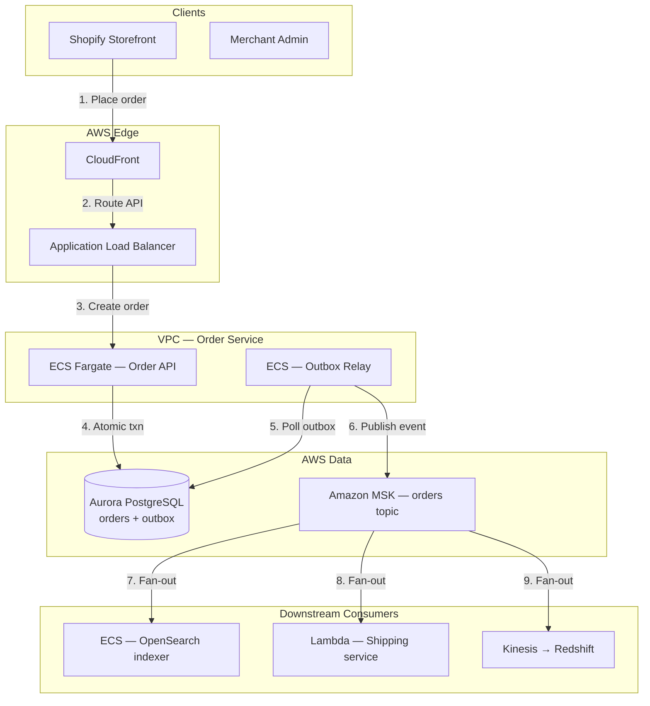

**Step-by-step flow:**

| Step | Action | Explanation |
|------|--------|-------------|
| **1** | Place order | Customer completes checkout; `POST /orders`. |
| **2** | Route API | CloudFront + ALB route to Order API. |
| **3** | Create order | Order service validates inventory reservation. |
| **4** | Atomic txn | Single Aurora transaction: `INSERT orders` + `INSERT outbox`. |
| **5** | Poll outbox | Relay claims unpublished rows (`FOR UPDATE SKIP LOCKED`). |
| **6** | Publish event | Relay produces `OrderCreated` to MSK with `key=order_id`. |
| **7–9** | Fan-out | Search, shipping, analytics consume independently — at-least-once. |

## 3. Step-by-Step Interview Answer

### Minutes 0–5: Requirements

1. **Atomicity:** Order row and "something happened" must not diverge.
2. **Delivery:** Downstream gets **at-least-once** events; consumers idempotent.
3. **Ordering:** Per `order_id`, events must be ordered.
4. **Non-goal:** Distributed transaction across inventory and search DBs (different services).
5. **Assumption:** Single Aurora cluster per order service; MSK for event bus.

### Minutes 5–15: Pattern — dual-write problem vs outbox

**The dual-write anti-pattern (say aloud):**

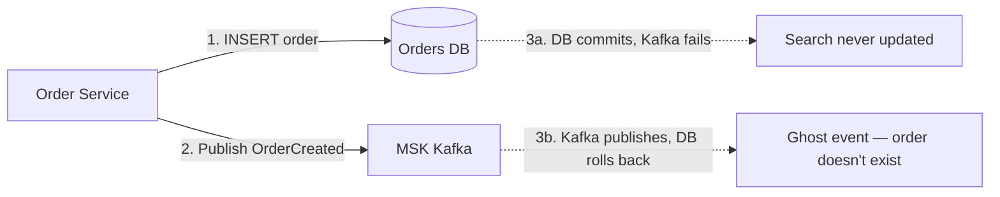

**Step-by-step flow:**

| Step | Action | Explanation |
|------|--------|-------------|
| **1** | INSERT order | Order row written to Aurora. |
| **2** | Publish event | Separate network call to MSK — **not atomic** with step 1. |
| **3a** | DB commits, Kafka fails | Order exists; search/fulfillment never notified — **silent drift**. |
| **3b** | Kafka publishes, DB rolls back | Consumers act on order that was never committed — **ghost event**. |

**The transactional outbox solution:**

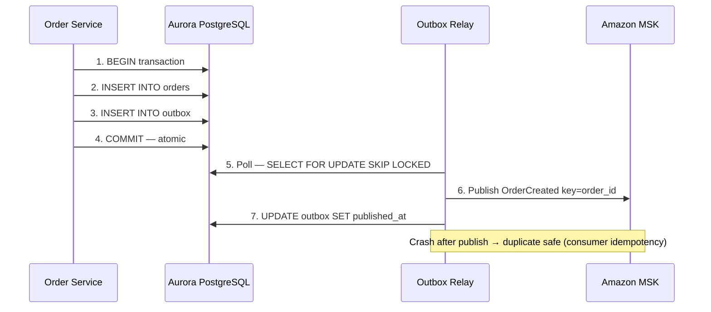

**Step-by-step flow:**

| Step | Action | Explanation |
|------|--------|-------------|
| **1** | BEGIN transaction | Open local ACID transaction on Aurora. |
| **2** | INSERT orders | Persist order row with status `pending`. |
| **3** | INSERT outbox | Write `OrderCreated` event payload in same txn. |
| **4** | COMMIT | Both rows durable atomically — **no orphan publish possible**. |
| **5** | Poll outbox | Relay claims batch of unpublished rows; `SKIP LOCKED` for concurrency. |
| **6** | Publish | Produce to MSK topic `orders` with partition key = `order_id`. |
| **7** | Mark published | Set `published_at`; on crash before step 7, relay retries — duplicate event. |

**Step 1 — Single DB transaction (SQL):**

```sql
BEGIN;
INSERT INTO orders (order_id, merchant_id, total_cents, status, created_at)
  VALUES ('ord_991', 'shop_42', 24750, 'pending', now());
INSERT INTO outbox (id, aggregate_id, event_type, payload, created_at)
  VALUES (
    'evt_a1b2',
    'ord_991',
    'OrderCreated',
    '{"order_id":"ord_991","merchant_id":"shop_42","total_cents":24750}',
    now()
  );
COMMIT;
```

### Minutes 15–30: Relay implementations

| Approach | Pros | Cons |
|----------|------|------|
| **Polling** | Simple; works everywhere; easy to debug | Latency 100–500ms; DB read load |
| **CDC (Debezium + MSK Connect)** | Near real-time (&lt;100ms); less poll load | Ops complexity; schema coupling to WAL |
| **Transactional messaging** | Kafka transactions | Broker + DB coupling; limited portability |

**Principal pick:** Start polling; move to CDC when relay lag becomes SLO risk (p99 &gt; 500ms).

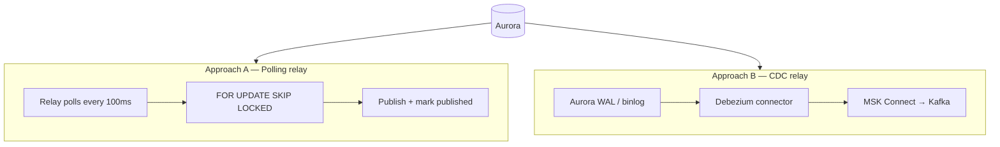

**Step-by-step flow:**

| Step | Action | Explanation |
|------|--------|-------------|
| **A1** | Poll loop | Relay wakes every 100ms; queries `published_at IS NULL`. |
| **A2** | Claim rows | `SKIP LOCKED` lets multiple relay instances work in parallel. |
| **A3** | Publish + mark | After MSK ack, set `published_at` in same relay txn. |
| **B1** | WAL stream | Aurora writes change to write-ahead log on commit. |
| **B2** | Debezium | Connector tails WAL; emits change events without polling. |
| **B3** | MSK Connect | Streams directly to Kafka — relay logic in connector. |

### Minutes 30–45: Failure modes and consumer idempotency

| Failure | Outcome | Mitigation |
|---------|---------|------------|
| Relay crash after publish, before mark | Duplicate event | Consumer inbox dedup by `event.id` |
| Relay stuck | Growing outbox lag | Alert on `unpublished_count`; scale relay |
| Poison row (bad payload) | Relay blocks partition | DLQ + skip policy after N attempts |
| Consumer slow | Consumer lag | Scale consumers; backpressure |
| Cross-service inventory | No atomicity with order DB | Saga or reservation pattern |

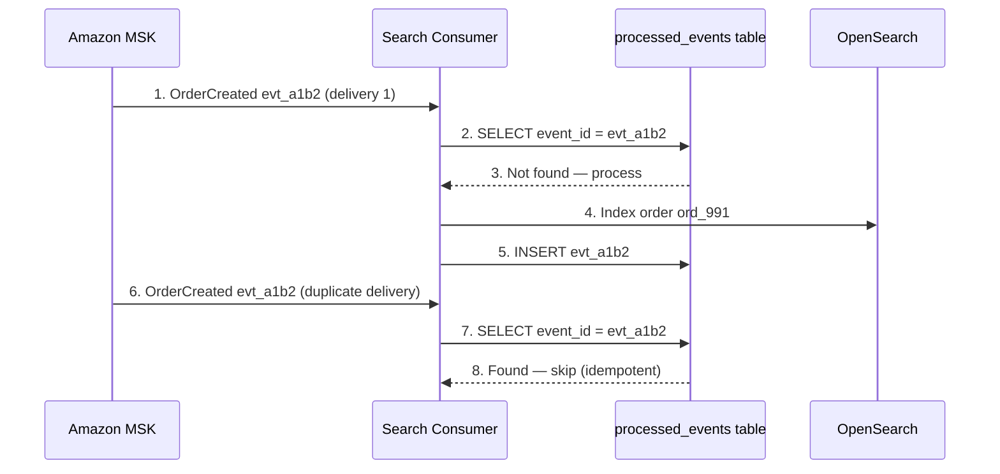

**Step-by-step flow:**

| Step | Action | Explanation |
|------|--------|-------------|
| **1** | First delivery | MSK delivers `OrderCreated` to search consumer. |
| **2–3** | Dedup check | Query `processed_events` — not seen before. |
| **4** | Index order | Write to OpenSearch index. |
| **5** | Record processed | Insert `event_id` in inbox — same txn as index write. |
| **6** | Duplicate delivery | Relay retry or MSK redelivery sends same event again. |
| **7–8** | Skip | Inbox hit — consumer returns without re-indexing. |

**Metrics:** Outbox lag (p99 age of unpublished rows); consumer lag; duplicate rate; relay throughput.

---

## 4. Whiteboard Guide

Draw left-to-right:

1. Box: **Order Service DB** containing `orders` + `outbox` tables (single transaction arrow)
2. Arrow to **Relay** → **MSK Kafka** (partition by `order_id`)
3. Fan-out to **Search**, **Shipping**, **Analytics** consumers
4. Each consumer: **Inbox dedup** → business logic
5. Label the gap: "dual-write = two separate commits"

### AWS whiteboard layout

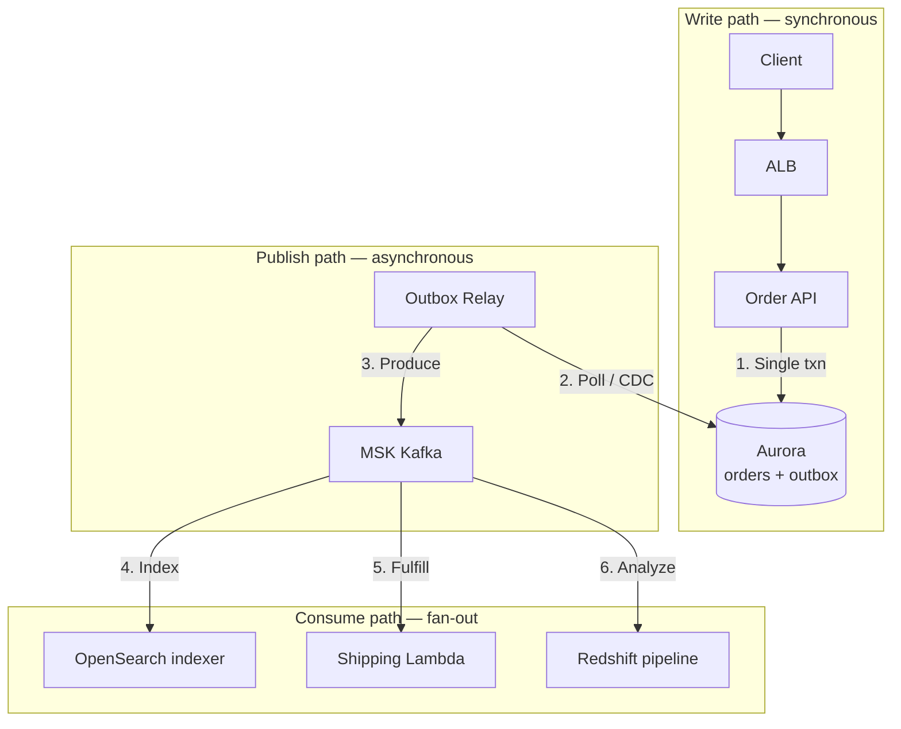

**Step-by-step flow:**

| Step | Action | Explanation |
|------|--------|-------------|
| **1** | Single txn | Order + outbox committed atomically in Aurora. |
| **2** | Poll / CDC | Relay reads unpublished outbox rows. |
| **3** | Produce | Event published to MSK with ordering key. |
| **4–6** | Fan-out | Independent consumers with inbox dedup. |

---

## 5. Principal-Level Signals

- Explains why **2PC across DB + Kafka** is avoided (blocking, ops complexity, partial failure)
- States **at-least-once + idempotent consumer** = effective exactly-once illusion
- Mentions **ordering per aggregate** via Kafka partition key (`order_id`)
- Operational metric: **outbox relay lag** (p99 age of unpublished rows)
- Distinguishes **outbox** (producer side) from **inbox** (consumer side dedup)
- Knows when to graduate from polling to **CDC** (relay lag SLO breach)

## 6. Red Flags

- "Write to DB then publish to Kafka" without outbox — dual-write guaranteed eventually
- Expecting Kafka exactly-once without idempotent consumers
- No `event.id` for dedup — duplicates cause double-shipments
- Polling without `SKIP LOCKED` — relay instances block each other
- Marking published **before** MSK ack — event loss on crash

## 7. Follow-Up Questions

| Question | Strong answer |
|----------|---------------|
| What if relay publishes but crashes before marking? | Duplicate event — safe if consumers dedupe by `event.id` |
| How to order events per order? | Kafka partition key = `order_id`; single partition per key |
| Outbox vs inbox? | Outbox = producer atomicity; inbox = consumer idempotency |
| When CDC over polling? | Relay lag p99 &gt; 500ms or DB poll load &gt; 10% CPU |
| Inventory in different service? | Saga: reserve → order → confirm; outbox per service |

## Hands-On Lab (Local)

Run the full outbox pattern on your laptop — **no AWS required**.

```bash
cd labs/lab-009-outbox-pattern
docker compose -p lab009 -f docker/docker-compose.yml up --build -d
curl http://localhost:8092/health
./scripts/demo_outbox.sh
```

| Step | API | Proves |
|------|-----|--------|
| `POST /v1/orders` | Order + outbox row commit atomically | No dual-write |
| `POST /v1/relay/run` | Publish to broker | At-least-once relay |
| `POST /v1/consumer/run` ×2 | Second call dedupes | Idempotent consumer |

**Swagger:** http://localhost:8092/docs

Chapter deep-dive: [Transactional Outbox](/docs/transactions/transactional-outbox#25-hands-on-exercise).

## 8. Related Study

- [Transactional Outbox](/docs/transactions/transactional-outbox)
- [Sagas](/docs/transactions/sagas)
- Lab: [Transactional outbox](/docs/transactions/transactional-outbox#25-hands-on-exercise) on **`:8092`** (Docker + Swagger)

## 9. Practice Drill

Whiteboard the outbox flow in 8 minutes with numbered steps 1–7. Answer: "What if relay publishes but crashes before marking published?" Then draw the consumer inbox dedup flow.

---

## 10. Production High-Level Design

Build guide for implementing Shopify-style transactional outbox on AWS.

### 10.1 Architecture diagram index

| Section | Topic |
|---------|-------|
| [§2](#aws-deployment-context) | End-to-end AWS deployment |
| [§3](#minutes-515-pattern--dual-write-problem-vs-outbox) | Dual-write vs outbox sequence |
| [§10.2](#102-system-context-c4-level-1) | C4 logical context |
| [§10.3](#103-aws-production-architecture-full-stack) | Full VPC production stack |
| [§10.4](#104-event-topology-and-ordering) | MSK topic design + ordering |
| [§11.4](#114-order-placement-handler--step-by-step-low-level) | Order handler sequence |
| [§11.5](#115-outbox-relay--polling-implementation) | Relay polling loop |
| [§11.6](#116-cdc-relay-debezium--msk-connect) | CDC alternative |
| [§12](#12-hadr-and-failover) | Multi-AZ Aurora + MSK |
| [§13](#13-observability-and-operations) | Metrics and alerts |
| [§14](#14-implementation-roadmap-6-week-rollout) | 6-week rollout |
| [§15](#15-testing-strategy) | Integration + chaos tests |
| [§16](#16-architecture-review-checklist) | Production readiness |

### 10.2 System context (C4 Level 1)

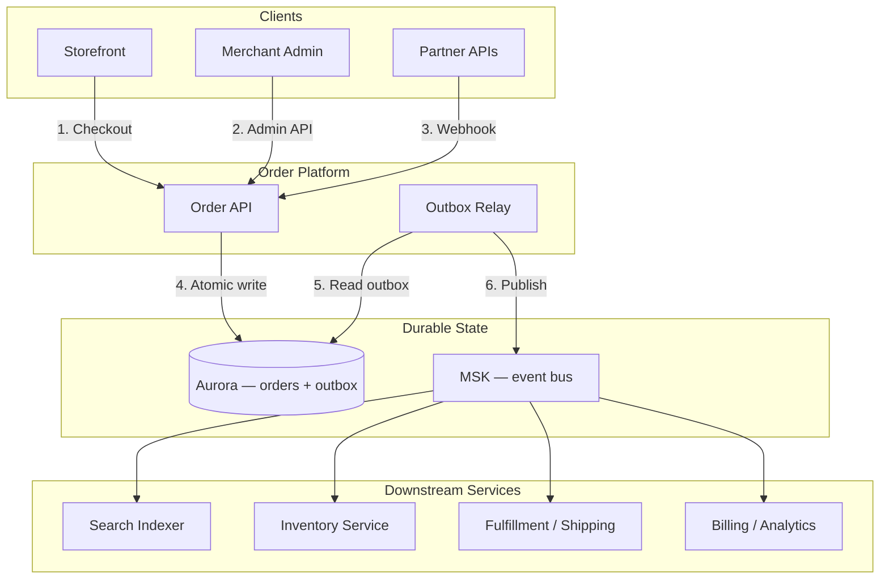

**Step-by-step flow:**

| Step | Action | Explanation |
|------|--------|-------------|
| **1** | Checkout | Customer places order via storefront. |
| **2** | Admin API | Merchant updates order status — also uses outbox. |
| **3** | Webhook | Partner integrations receive events via outbox fan-out. |
| **4** | Atomic write | Order + outbox in single Aurora transaction. |
| **5** | Read outbox | Relay claims unpublished events. |
| **6** | Publish | Events flow to MSK for downstream consumption. |

### 10.3 AWS production architecture (full stack)

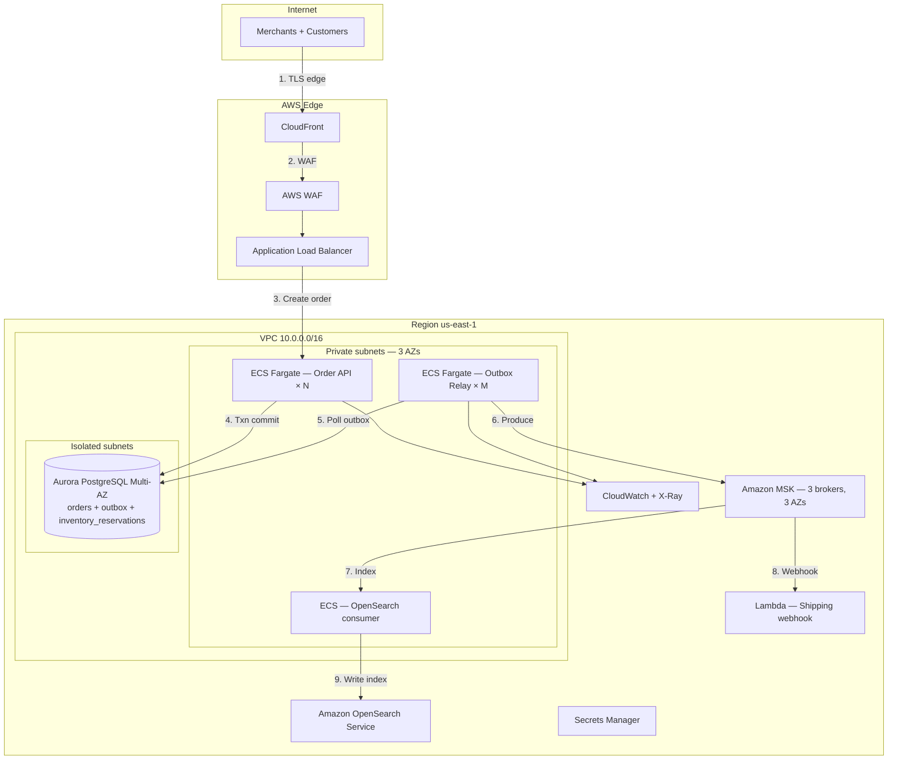

**Step-by-step flow:**

| Step | Action | Explanation |
|------|--------|-------------|
| **1** | TLS edge | CloudFront terminates TLS for storefront API. |
| **2** | WAF | Rate limit checkout; bot protection during Black Friday. |
| **3** | Create order | ALB routes to Order API; validates idempotency key. |
| **4** | Txn commit | Aurora: `orders` + `outbox` + `inventory_reservations` in one txn. |
| **5** | Poll outbox | Relay claims rows; multiple relay tasks via `SKIP LOCKED`. |
| **6** | Produce | MSK `orders` topic; key = `order_id` for ordering. |
| **7** | Index | Search consumer reads from MSK; inbox dedup. |
| **8** | Webhook | Shipping Lambda triggered by MSK event source mapping. |
| **9** | Write index | OpenSearch document indexed for merchant search. |

| AWS component | Outbox responsibility |
|---------------|----------------------|
| **Aurora PostgreSQL** | `orders` + `outbox` in same DB — atomic local txn |
| **ECS Order API** | Writes outbox row on every state change |
| **ECS Outbox Relay** | Polls + publishes; horizontal scale with `SKIP LOCKED` |
| **Amazon MSK** | Durable event log; partition by `order_id` |
| **OpenSearch** | Search projection — eventually consistent with orders DB |
| **CloudWatch** | `outbox_lag_seconds`, `relay_throughput`, `consumer_lag` |

### 10.4 Event topology and ordering

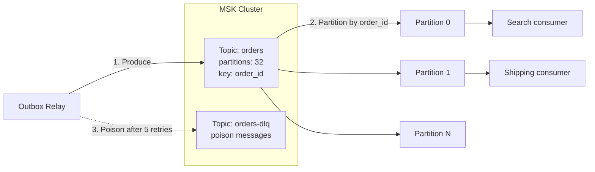

**Step-by-step flow:**

| Step | Action | Explanation |
|------|--------|-------------|
| **1** | Produce | Relay sends event with `key=order_id` — same order always same partition. |
| **2** | Partition | MSK hashes key → partition; guarantees order per `order_id`. |
| **3** | Poison DLQ | After 5 failed publish attempts, row moves to DLQ for manual review. |

**Event catalog:**

| Event type | Topic | Key | Consumers |
|------------|-------|-----|-----------|
| `OrderCreated` | `orders` | `order_id` | Search, Shipping, Analytics |
| `OrderPaid` | `orders` | `order_id` | Fulfillment, Billing |
| `OrderCancelled` | `orders` | `order_id` | Inventory (release), Search (remove) |
| `OrderShipped` | `orders` | `order_id` | Notifications, Analytics |

### 10.5 Service sizing at 5K orders/sec peak (Black Friday)

| Metric | Value | Reasoning |
|--------|-------|-----------|
| Peak order QPS | 5,000 | Large merchant platform |
| Outbox rows per order | 1–3 | Created + paid + shipped events |
| Relay batch size | 100 rows | Balance latency vs DB round-trips |
| Relay instances | 10 | 5K rows/sec ÷ 500 rows/sec/instance |
| MSK partitions | 32 | 5K/sec ÷ 32 ≈ 156 msg/sec/partition |
| Target relay lag p99 | &lt; 500ms | Search index freshness SLO |

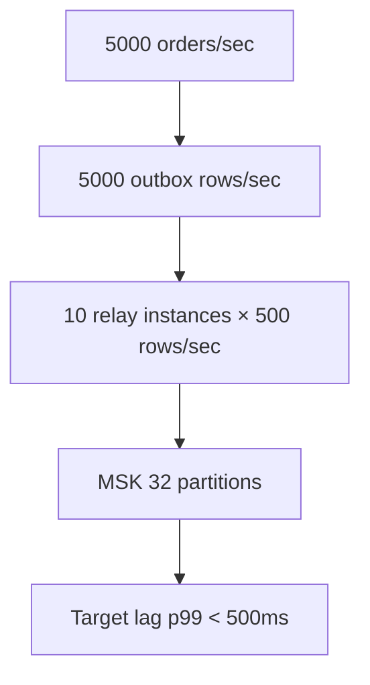

**Step-by-step flow:**

| Step | Action | Explanation |
|------|--------|-------------|
| **1** | Order rate | 5K checkout completions per second at peak. |
| **2** | Outbox growth | One row per order event — 5K rows/sec written. |
| **3** | Relay capacity | 10 relays × 100 batch × 5 polls/sec = 5K rows/sec. |
| **4** | MSK throughput | 32 partitions distribute load; monitor per-partition lag. |

---

## 11. Production Low-Level Design

### 11.1 API contract

**Endpoint:** `POST /v1/orders`

**Required headers:**

| Header | Rule |
|--------|------|
| `Authorization` | `Bearer <merchant_api_key>` |
| `Idempotency-Key` | Unique per checkout attempt — prevents duplicate orders |
| `Content-Type` | `application/json` |

**Request body:**

```json
{
  "merchant_id": "shop_42",
  "line_items": [
    {"variant_id": "var_991", "quantity": 2, "price_cents": 12375}
  ],
  "customer_id": "cust_8f3a",
  "shipping_address": {"country": "US", "zip": "94105"}
}
```

**Response semantics:**

| HTTP | Meaning | Client action |
|------|---------|---------------|
| `201` | Order created; outbox event queued | Poll `GET /orders/{id}` or wait for webhook |
| `200` | Idempotency hit — same key, same response | Use cached `order_id` |
| `409` | Same key, different payload | Bug — new idempotency key required |
| `422` | Inventory insufficient | Do not retry; show user "out of stock" |
| `503` | Aurora unavailable | Retry with same idempotency key |

### 11.2 Database schema

**Table: `orders`**

```sql
CREATE TABLE orders (
    order_id        VARCHAR(64) PRIMARY KEY,
    merchant_id     VARCHAR(64) NOT NULL,
    customer_id     VARCHAR(64) NOT NULL,
    total_cents     BIGINT NOT NULL,
    status          VARCHAR(16) NOT NULL DEFAULT 'pending',
    idempotency_key VARCHAR(255),
    created_at      TIMESTAMPTZ NOT NULL DEFAULT now(),
    updated_at      TIMESTAMPTZ NOT NULL DEFAULT now(),

    CONSTRAINT uq_merchant_idem UNIQUE (merchant_id, idempotency_key)
);

CREATE INDEX idx_orders_merchant_status ON orders (merchant_id, status, created_at DESC);
```

**Table: `outbox`**

```sql
CREATE TABLE outbox (
    id              UUID PRIMARY KEY DEFAULT gen_random_uuid(),
    aggregate_id    VARCHAR(64) NOT NULL,       -- order_id
    event_type      VARCHAR(64) NOT NULL,       -- OrderCreated, OrderPaid, etc.
    payload         JSONB NOT NULL,
    topic           VARCHAR(128) NOT NULL DEFAULT 'orders',
    partition_key   VARCHAR(64) NOT NULL,       -- order_id for Kafka ordering
    created_at      TIMESTAMPTZ NOT NULL DEFAULT now(),
    published_at    TIMESTAMPTZ,
    publish_attempts SMALLINT NOT NULL DEFAULT 0,
    last_error      TEXT,

    CONSTRAINT chk_publish_state CHECK (
        (published_at IS NULL AND publish_attempts >= 0) OR
        (published_at IS NOT NULL)
    )
);

CREATE INDEX idx_outbox_unpublished ON outbox (created_at ASC)
    WHERE published_at IS NULL;
```

**Table: `inventory_reservations` (same txn)**

```sql
CREATE TABLE inventory_reservations (
    reservation_id  UUID PRIMARY KEY DEFAULT gen_random_uuid(),
    order_id        VARCHAR(64) NOT NULL REFERENCES orders(order_id),
    variant_id      VARCHAR(64) NOT NULL,
    quantity        INT NOT NULL,
    status          VARCHAR(16) NOT NULL DEFAULT 'reserved',
    created_at      TIMESTAMPTZ NOT NULL DEFAULT now(),

    CONSTRAINT uq_variant_order UNIQUE (variant_id, order_id)
);
```

**Table: `processed_events` (consumer inbox — search service DB)**

```sql
CREATE TABLE processed_events (
    event_id        UUID PRIMARY KEY,
    processed_at    TIMESTAMPTZ NOT NULL DEFAULT now()
);

-- TTL cleanup: DELETE WHERE processed_at < now() - interval '7 days'
```

### 11.3 Outbox row lifecycle

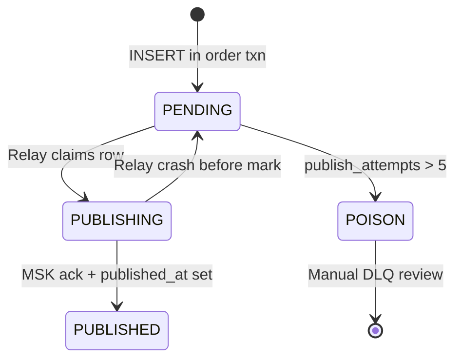

**Step-by-step flow:**

| Step | Action | Explanation |
|------|--------|-------------|
| **1** | PENDING | Row inserted in same txn as order — `published_at IS NULL`. |
| **2** | PUBLISHING | Relay claims with `FOR UPDATE SKIP LOCKED`. |
| **3** | PUBLISHED | MSK ack received; `published_at = now()`. |
| **4** | Back to PENDING | Crash before mark — relay retries; duplicate delivery OK. |
| **5** | POISON | 5 failed attempts — move to DLQ; alert on-call. |

### 11.4 Order placement handler — step-by-step (low level)

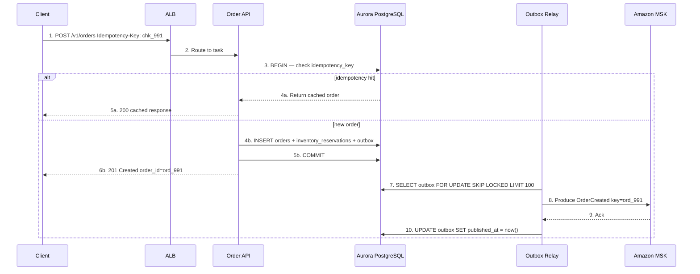

**Step-by-step flow:**

| Step | Action | Explanation |
|------|--------|-------------|
| **1** | POST /orders | Client submits checkout with idempotency key. |
| **2** | Route | ALB picks healthy Order API task. |
| **3** | BEGIN | Open transaction; check `(merchant_id, idempotency_key)`. |
| **4a** | Idempotency hit | Return cached order — no duplicate outbox row. |
| **4b** | New order | Insert order, reserve inventory, write outbox row. |
| **5b** | COMMIT | All three writes atomic — order exists iff event queued. |
| **6b** | 201 Created | Return `order_id` to client immediately — async publish follows. |
| **7** | Claim outbox | Relay polls unpublished rows; `SKIP LOCKED` for parallelism. |
| **8** | Produce | Send `OrderCreated` to MSK partition keyed by `order_id`. |
| **9** | Ack | MSK confirms durable write to partition leader. |
| **10** | Mark published | Set `published_at` — relay complete for this row. |

**Handler pseudocode:**

```python
def create_order(req: CreateOrderRequest, idempotency_key: str) -> OrderResponse:
    with db.transaction() as txn:
        # Step 1: Idempotency check
        existing = txn.query(
            "SELECT order_id, response_body FROM orders "
            "WHERE merchant_id = %s AND idempotency_key = %s",
            req.merchant_id, idempotency_key,
        )
        if existing:
            return OrderResponse.from_cache(existing.response_body)

        # Step 2: Reserve inventory (same txn)
        for item in req.line_items:
            txn.execute(
                "UPDATE inventory SET reserved = reserved + %s "
                "WHERE variant_id = %s AND available >= %s",
                item.quantity, item.variant_id, item.quantity,
            )
            if txn.rowcount == 0:
                raise InsufficientInventoryError(item.variant_id)

        # Step 3: Insert order
        order_id = generate_order_id()
        txn.execute("INSERT INTO orders (...) VALUES (...)", order_id, ...)

        # Step 4: Insert outbox event (same txn)
        event_id = str(uuid4())
        txn.execute(
            "INSERT INTO outbox (id, aggregate_id, event_type, payload, partition_key) "
            "VALUES (%s, %s, 'OrderCreated', %s, %s)",
            event_id, order_id, json.dumps({...}), order_id,
        )

        # Step 5: COMMIT — atomic
        txn.commit()

    return OrderResponse(order_id=order_id, status="pending")
```

### 11.5 Outbox relay — polling implementation

```python
def relay_loop(batch_size: int = 100, poll_interval_ms: int = 100):
    while True:
        with db.transaction() as txn:
            rows = txn.query("""
                SELECT id, topic, partition_key, event_type, payload
                FROM outbox
                WHERE published_at IS NULL
                  AND publish_attempts < 5
                ORDER BY created_at ASC
                LIMIT %s
                FOR UPDATE SKIP LOCKED
            """, batch_size)

            for row in rows:
                try:
                    # Step 1: Produce to MSK (wait for ack)
                    producer.send(
                        topic=row.topic,
                        key=row.partition_key.encode(),
                        value=serialize_avro(row),
                        headers=[("event_id", str(row.id).encode())],
                    ).get(timeout=5)  # blocks until ack

                    # Step 2: Mark published ONLY after ack
                    txn.execute(
                        "UPDATE outbox SET published_at = now() WHERE id = %s",
                        row.id,
                    )
                except Exception as e:
                    txn.execute(
                        "UPDATE outbox SET publish_attempts = publish_attempts + 1, "
                        "last_error = %s WHERE id = %s",
                        str(e), row.id,
                    )
            txn.commit()

        time.sleep(poll_interval_ms / 1000)
```

**Step-by-step flow (relay):**

| Step | Action | Explanation |
|------|--------|-------------|
| **1** | Claim batch | `SKIP LOCKED` — multiple relay instances work in parallel. |
| **2** | Produce | Send to MSK; block until broker ack. |
| **3** | Mark published | Only after ack — prevents event loss. |
| **4** | On failure | Increment `publish_attempts`; row retried next poll. |
| **5** | Poison | After 5 attempts → alert + manual DLQ review. |

| Parameter | Value | Why |
|-----------|-------|-----|
| `batch_size` | 100 | Throughput vs latency tradeoff |
| `poll_interval_ms` | 100 | Target p99 relay lag &lt; 500ms |
| `FOR UPDATE SKIP LOCKED` | Required | Multi-instance relay without blocking |
| Mark after ack | Required | Publish-before-mark = event loss on crash |

### 11.6 CDC relay (Debezium + MSK Connect)

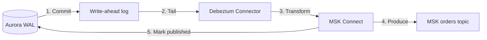

**Step-by-step flow:**

| Step | Action | Explanation |
|------|--------|-------------|
| **1** | Commit | Order + outbox row written to Aurora WAL on commit. |
| **2** | Tail | Debezium reads WAL — no polling load on outbox table. |
| **3** | Transform | Connector maps `outbox` row → Kafka record. |
| **4** | Produce | Direct stream to MSK — sub-100ms latency. |
| **5** | Mark published | Optional: connector updates `published_at` via sink connector. |

**When to use CDC:**

| Signal | Threshold | Action |
|--------|-----------|--------|
| Relay lag p99 | &gt; 500ms sustained | Evaluate CDC migration |
| Outbox poll CPU | &gt; 10% Aurora CPU | CDC removes poll load |
| Event volume | &gt; 10K rows/sec | CDC scales better |

### 11.7 Search consumer — inbox pattern

```python
def handle_order_created(event: OrderCreatedEvent):
    with search_db.transaction() as txn:
        # Step 1: Dedup check
        exists = txn.query(
            "SELECT 1 FROM processed_events WHERE event_id = %s",
            event.event_id,
        )
        if exists:
            return  # idempotent — already processed

        # Step 2: Business logic
        txn.execute(
            "INSERT INTO search_index (order_id, merchant_id, status, ...) "
            "VALUES (%s, %s, %s, ...)",
            event.order_id, event.merchant_id, "pending", ...,
        )

        # Step 3: Record processed (same txn as index write)
        txn.execute(
            "INSERT INTO processed_events (event_id) VALUES (%s)",
            event.event_id,
        )
        txn.commit()
```

**Step-by-step flow:**

| Step | Action | Explanation |
|------|--------|-------------|
| **1** | Dedup check | Query inbox — skip if `event_id` already seen. |
| **2** | Business logic | Index order in OpenSearch / search DB. |
| **3** | Record processed | Insert `event_id` in same txn — atomic with index write. |

### 11.8 Cross-service inventory (saga complement)

Outbox is **per-service**. Inventory lives in a separate service — use saga. Hands-on: [Sagas §25](/docs/transactions/sagas#25-hands-on-exercise) — Lab 010 on `:8093` ([engineer guide](/docs/transactions/sagas#engineer-guide-how-the-local-stack-works)).

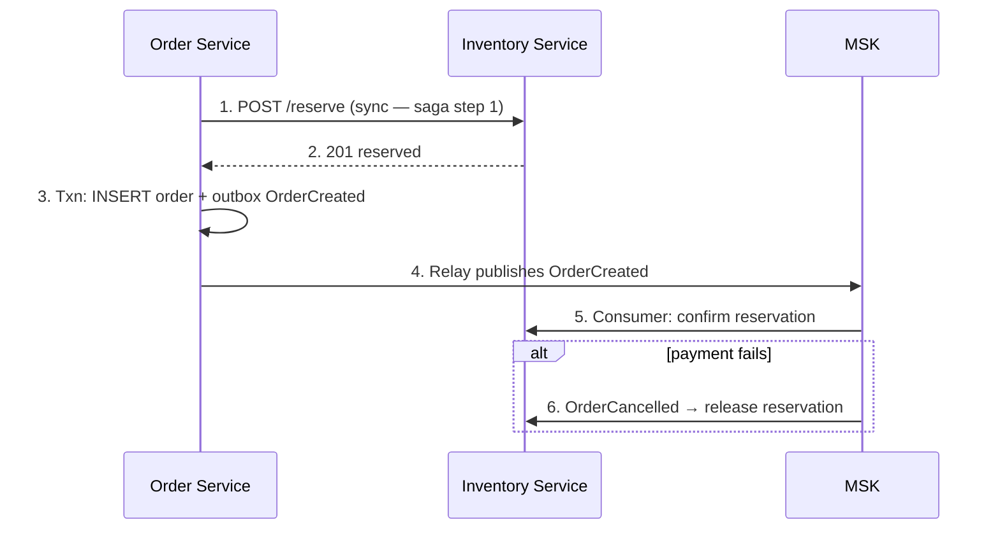

**Step-by-step flow:**

| Step | Action | Explanation |
|------|--------|-------------|
| **1** | Reserve | Sync call to inventory — saga step 1 (compensatable). |
| **2** | Reserved | Inventory holds stock with TTL. |
| **3** | Order txn | Order + outbox committed — order exists. |
| **4** | Publish | Downstream notified asynchronously. |
| **5** | Confirm | Inventory consumer confirms reservation on `OrderCreated`. |
| **6** | Compensate | `OrderCancelled` event triggers reservation release. |

---

## 12. HA/DR and Failover

### 12.1 Aurora Multi-AZ (write path)

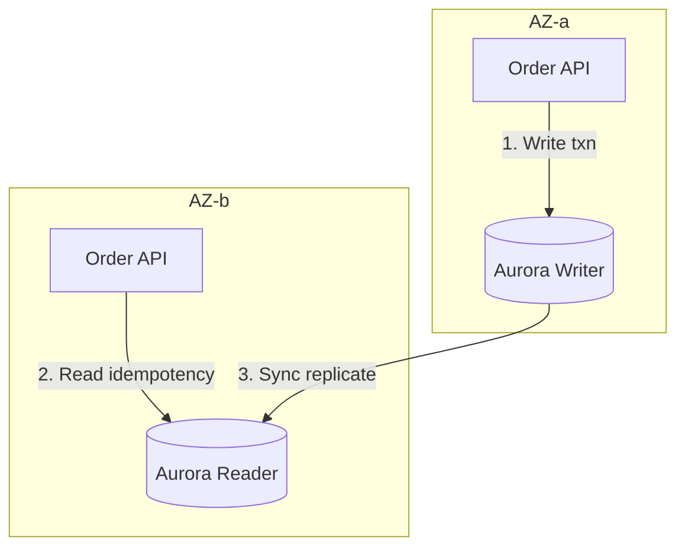

**Step-by-step flow:**

| Step | Action | Explanation |
|------|--------|-------------|
| **1** | Write txn | All order + outbox writes go to Aurora writer. |
| **2** | Read idempotency | Read replica OK for idempotency cache hits. |
| **3** | Sync replicate | Reader catches up in &lt;100ms — failover ready. |

**Failover impact:** Unpublished outbox rows survive on promoted replica; relay resumes automatically.

### 12.2 MSK Multi-AZ (publish path)

| Component | HA config | Failover behavior |
|-----------|-----------|-------------------|
| MSK brokers | 3 AZs, replication factor 3 | Automatic leader election |
| Outbox relay | ECS service × 3 AZs | `SKIP LOCKED` — no duplicate claim |
| Consumer groups | Rebalance on broker failover | At-least-once redelivery |

### 12.3 Regional DR

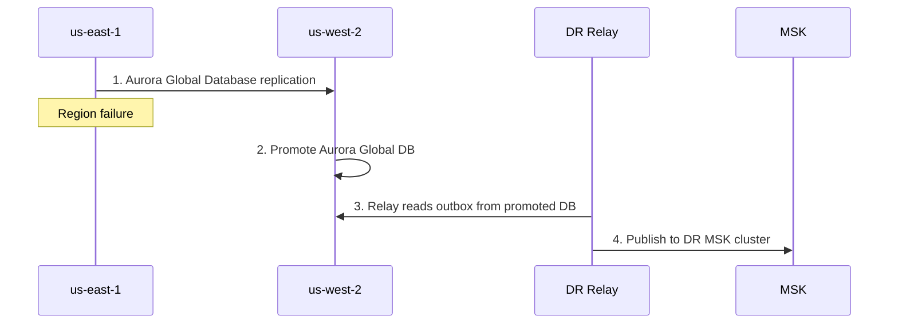

**Step-by-step flow:**

| Step | Action | Explanation |
|------|--------|-------------|
| **1** | Replication | Aurora Global Database streams outbox rows to DR region. |
| **2** | Promote | RPO typically &lt;1s; RTO target &lt;15 min. |
| **3** | DR relay | Relay in DR region reads unpublished rows from promoted DB. |
| **4** | DR MSK | Events published to DR MSK cluster; consumers failover via DNS. |

---

## 13. Observability and Operations

### 13.1 Metrics and alerts

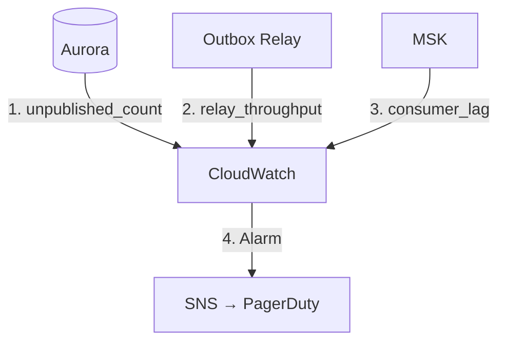

**Required metrics:**

| Metric | Alert threshold | Why |
|--------|-----------------|-----|
| `outbox_unpublished_count` | > 1000 for 5 min | Relay falling behind |
| `outbox_lag_seconds_p99` | > 500ms | Search freshness SLO breach |
| `outbox_poison_count` | > 0 | Manual intervention required |
| `relay_publish_error_rate` | > 1% | MSK connectivity issue |
| `msk_consumer_lag` | > 10,000 messages | Downstream slow |
| `duplicate_event_rate` | Informational | Validates idempotency working |

**Structured log (every outbox publish):**

```json
{
  "event_id": "evt_a1b2",
  "order_id": "ord_991",
  "event_type": "OrderCreated",
  "relay_instance": "relay-task-3",
  "publish_latency_ms": 42,
  "msk_partition": 7,
  "outbox_age_ms": 128
}
```

### 13.2 Runbook — outbox lag incident

| Step | Action | Owner |
|------|--------|-------|
| **1** | Confirm `outbox_lag_seconds_p99` alert firing | SRE |
| **2** | Check MSK broker health + relay error rate | SRE |
| **3** | Scale relay ECS tasks (+50%) | SRE |
| **4** | If DB CPU high from polling → evaluate CDC migration | Platform |
| **5** | If poison rows → move to DLQ, fix payload, replay | Order team |
| **6** | Verify consumer lag decreasing | SRE |
| **7** | Post-incident: review relay batch size + poll interval | Platform |

---

## 14. Implementation Roadmap (6-Week Rollout)

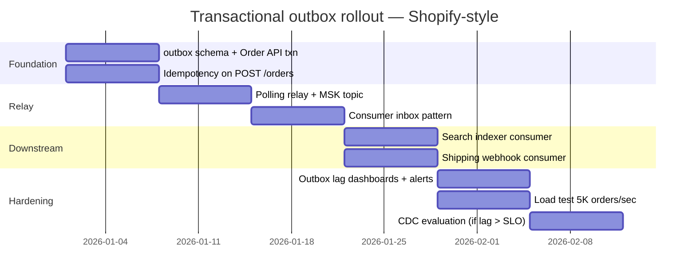

| Week | Deliverable | AWS services |
|------|-------------|--------------|
| 1 | Outbox schema + atomic order txn | Aurora, ECS |
| 2 | Polling relay + MSK topic | ECS, MSK |
| 3 | Consumer inbox dedup | Aurora (search DB), ECS |
| 4 | Search + shipping consumers | OpenSearch, Lambda |
| 5 | Dashboards + load test | CloudWatch, k6 |
| 6 | CDC evaluation | MSK Connect, Debezium |

---

## 15. Testing Strategy

| Test type | Tool | Scenario |
|-----------|------|----------|
| Unit | pytest / JUnit | Outbox insert in mocked txn |
| Integration | Testcontainers (Postgres + Kafka) | Full order → relay → consumer |
| Idempotency | Custom | Duplicate `Idempotency-Key` → same response |
| Relay crash | Chaos | Kill relay after MSK ack, before mark → duplicate delivery |
| Load | k6 | 5K orders/sec; verify lag p99 &lt; 500ms |
| Poison row | Manual | Bad payload → DLQ after 5 attempts |

**Pass criteria:**

| Metric | Threshold |
|--------|-----------|
| Outbox lag p99 at 5K QPS | &lt; 500ms |
| Zero lost events (order exists → event eventually published) | 100% |
| Duplicate delivery handled | Consumer inbox dedup 100% |
| Idempotency | Same key → same `order_id` |

---

## 16. Architecture Review Checklist

| # | Gate | Status |
|---|------|--------|
| 1 | Order + outbox in single Aurora transaction | ☐ |
| 2 | Relay marks `published_at` only after MSK ack | ☐ |
| 3 | `FOR UPDATE SKIP LOCKED` for multi-instance relay | ☐ |
| 4 | Kafka partition key = `order_id` for ordering | ☐ |
| 5 | Every consumer has inbox dedup by `event_id` | ☐ |
| 6 | Poison row policy (5 attempts → DLQ) | ☐ |
| 7 | `outbox_lag_seconds` dashboard + alert | ☐ |
| 8 | Idempotency key on `POST /orders` | ☐ |
| 9 | Load test at peak QPS validates relay lag SLO | ☐ |
| 10 | Cross-service inventory uses saga (not 2PC) | ☐ |
| 11 | Aurora Multi-AZ + MSK 3-AZ deployment | ☐ |
| 12 | DR runbook: relay resumes on promoted replica | ☐ |

---

## 17. Related Study

- [Transactional Outbox](/docs/transactions/transactional-outbox)
- [Sagas](/docs/transactions/sagas)
- [PACELC — Shopify order scenario](/docs/consistency/pacelc)
- Lab: [Transactional outbox](/docs/transactions/transactional-outbox#25-hands-on-exercise) — [Hands-On Lab (Local)](#hands-on-lab-local)
- Lab: [Saga orchestration](/docs/transactions/sagas#25-hands-on-exercise) (`:8093`, [engineer guide](/docs/transactions/sagas#engineer-guide-how-the-local-stack-works))
