# Scenario: Slack Message Delivery

> **Diagram convention:** Arrows and messages are labeled **1, 2, 3…** to show processing order. Each diagram is followed by a **Step-by-step flow** table explaining every numbered step.

## 1. The Interview Question

> "How does Slack deliver messages reliably to millions of concurrent connections while preserving per-channel ordering?"

## 2. Real-World Context

| Dimension | Detail |
|-----------|--------|
| **Company / system** | [Slack](https://slack.engineering/) — real-time messaging; migrated from Redis job queues to [Kafka](https://slack.engineering/real-time-messaging/) |
| **Scale** | Billions of messages/day; millions of concurrent WebSocket connections; hot channels during incidents |
| **Why architects care** | Combines **log-based messaging**, **per-channel ordering**, **at-least-once delivery**, and **WebSocket fan-out** |
| **Public references** | Slack engineering blog on Kafka migration; Vitess for message store sharding |

### AWS deployment context

Typical Slack-style messaging on AWS: **API Gateway + ECS Fargate** message API; **Amazon MSK** (Kafka) with `channel_id` partition key; **ECS persistence workers** writing to **Amazon Aurora** or **DynamoDB** message store; **ECS WebSocket gateway** fleet behind **ALB** with sticky sessions; **Amazon ElastiCache Redis** for presence + connection routing; **Amazon SNS** for mobile push fallback; **CloudWatch** for consumer lag and delivery latency.

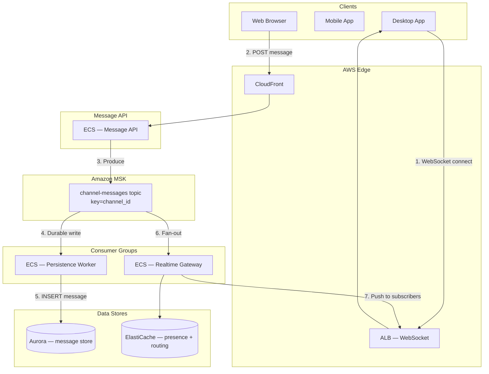

**Step-by-step flow:**

| Step | Action | Explanation |
|------|--------|-------------|
| **1** | WebSocket connect | Client opens persistent connection to realtime gateway via ALB. |
| **2** | POST message | User sends message; API validates auth + channel membership. |
| **3** | Produce | Message written to MSK with `key=channel_id` for ordering. |
| **4** | Durable write | Persistence consumer writes to Aurora message store. |
| **5** | INSERT message | `message_id` unique constraint — idempotent dedup. |
| **6** | Fan-out | Realtime gateway consumer reads same topic. |
| **7** | Push | WebSocket push to all channel subscribers. |

## 3. Step-by-Step Interview Answer

### Minutes 0–5: Requirements

| Type | Detail |
|------|--------|
| **Ordering** | Messages in a channel appear in send order |
| **Delivery** | Online users get real-time push; offline users catch up on reconnect |
| **Semantics** | At-least-once from producer; dedupe at consumer by `message_id` |
| **Scale** | Hot channels (incidents, all-hands) without single-partition bottleneck |
| **Session** | Sender sees own message immediately (read-your-writes within session) |

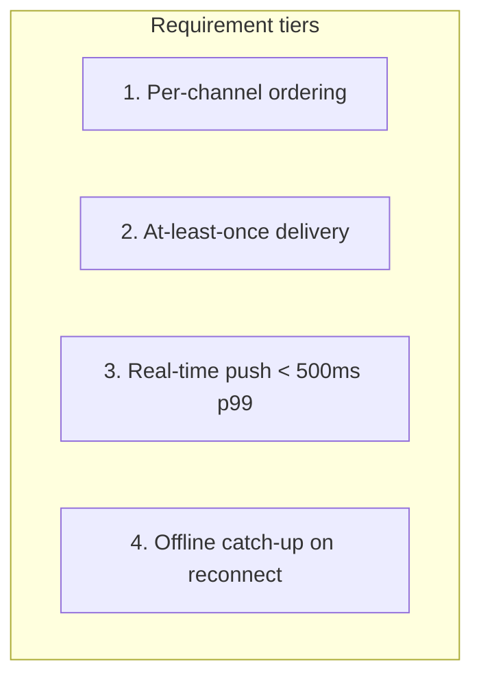

**Step-by-step flow:**

| Step | Action | Explanation |
|------|--------|-------------|
| **1** | Per-channel ordering | Kafka partition key = `channel_id`. |
| **2** | At-least-once | Producer acks=all; consumer dedupes by `message_id`. |
| **3** | Real-time push | WebSocket fan-out within 500ms p99 for online users. |
| **4** | Offline catch-up | Fetch from `last_read_sequence` on reconnect. |

### Minutes 5–15: Architecture

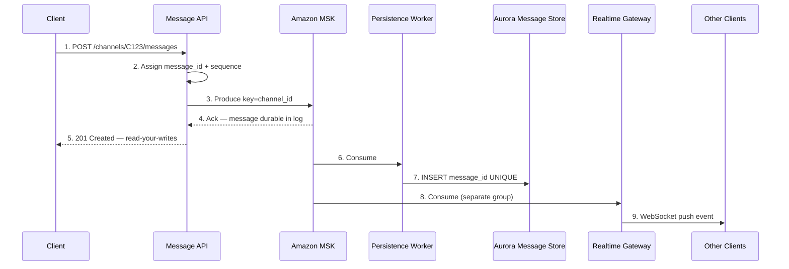

**Step-by-step flow:**

| Step | Action | Explanation |
|------|--------|-------------|
| **1** | POST message | Client sends message body to API. |
| **2** | Assign IDs | Server assigns `message_id` (time-ordered) + `channel_sequence`. |
| **3** | Produce | Write to MSK topic with `key=channel_id` — ordering guarantee. |
| **4** | Ack | Kafka acks=all — message durable in ISR before API responds. |
| **5** | 201 Created | Client sees own message — session read-your-writes. |
| **6–7** | Persist | Consumer writes to Aurora; `message_id` UNIQUE dedupes duplicates. |
| **8–9** | Fan-out | Realtime gateway pushes to all WebSocket subscribers. |

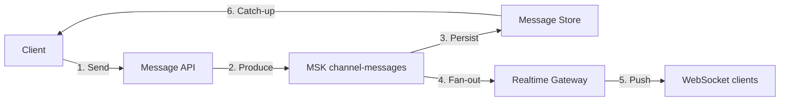

**Step-by-step flow:**

| Step | Action | Explanation |
|------|--------|-------------|
| **1** | Send | Client posts message via HTTP or WebSocket. |
| **2** | Produce | MSK log — source of truth for ordering. |
| **3** | Persist | Durable storage for history + offline catch-up. |
| **4** | Fan-out | Separate consumer group for realtime path. |
| **5** | Push | Online subscribers receive via WebSocket. |
| **6** | Catch-up | Offline clients fetch gap on reconnect. |

### Minutes 15–30: Deep dive

**Ordering — partition key = channel_id:**

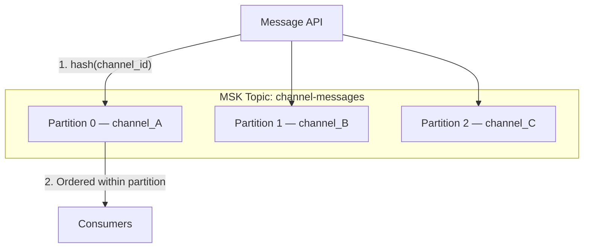

**Step-by-step flow:**

| Step | Action | Explanation |
|------|--------|-------------|
| **1** | hash(channel_id) | All messages for channel land on same partition — strict order. |
| **2** | Ordered consume | Consumers process partition sequentially — preserve order. |

**Hot channel mitigation:**

| Strategy | When | Mechanism |
|----------|------|-----------|
| **Dedicated partition** | CEO all-hands channel | Pre-assign hot channel to own partition |
| **Sequence service** | Partition saturated | Server-side sequence + merge on read |
| **Rate limit posting** | Abuse / flood | API rate limit per channel per user |
| **Read replicas** | History fetch overload | Aurora read replicas for catch-up |

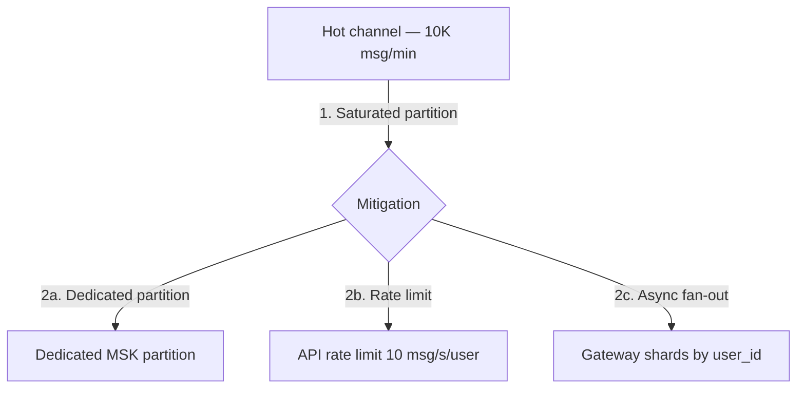

**Dedup and delivery semantics:**

| Layer | Mechanism |
|-------|-----------|
| **Producer** | `enable.idempotence=true`, `acks=all` |
| **Persistence** | `INSERT ... ON CONFLICT (message_id) DO NOTHING` |
| **Gateway** | Per-connection `last_delivered_sequence` map |
| **Client** | Client-side dedup by `message_id` on receive |

### Minutes 30–45: Failures

| Failure | Behavior | Mitigation |
|---------|----------|------------|
| MSK broker down | ISR replication; producer retries | Multi-AZ MSK cluster |
| Gateway crash | Client reconnects; replay from last ack sequence | Sticky sessions + Redis connection registry |
| Duplicate consume | Idempotent write by `message_id` | UNIQUE constraint in store |
| Message edit conflict | Version field on message | Last-writer-wins or CRDT policy |
| Consumer lag | Realtime delay | Scale gateway consumers; alert on lag |

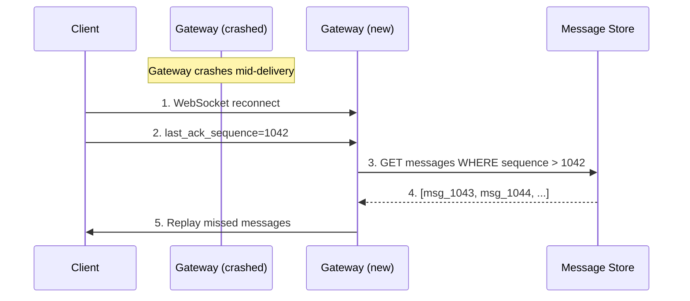

**Step-by-step flow:**

| Step | Action | Explanation |
|------|--------|-------------|
| **1** | Reconnect | Client detects WebSocket disconnect. |
| **2** | last_ack_sequence | Client sends last successfully received sequence. |
| **3–4** | Fetch gap | Gateway queries store for messages after sequence. |
| **5** | Replay | Client receives missed messages — no loss. |

---

## 4. Whiteboard Guide

1. **Left:** Client apps (WebSocket + HTTP)
2. **Center:** Message API → MSK (label partition key = `channel_id`)
3. **Branch down:** Persistence worker → Aurora
4. **Branch right:** Realtime gateway → WebSocket fan-out
5. Label **hot channel** problem on single partition
6. Annotate **at-least-once + dedup** at persistence layer

### AWS whiteboard layout

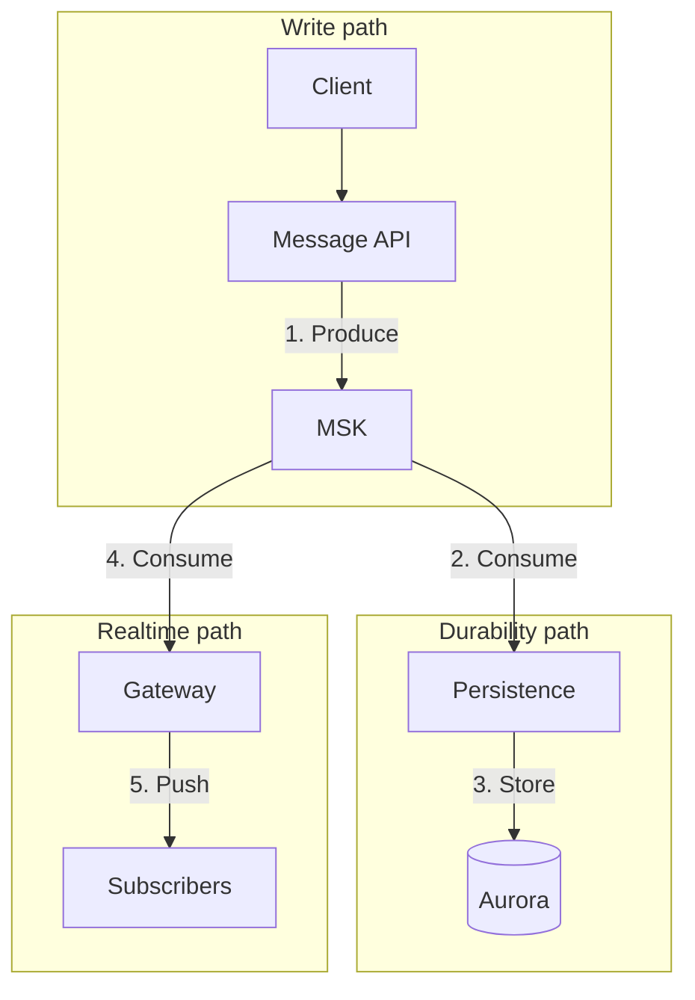

**Step-by-step flow:**

| Step | Action | Explanation |
|------|--------|-------------|
| **1** | Produce | Single write to MSK — fan-out via consumer groups. |
| **2–3** | Durability | Persist for history + offline catch-up. |
| **4–5** | Realtime | Push to online WebSocket subscribers. |

---

## 5. Principal-Level Signals

- Partition key = **`channel_id`** for per-channel ordering
- Distinguishes **realtime path** vs **durability path** (separate consumer groups)
- Mentions **hot partition** problem and mitigation strategies
- **At-least-once + idempotent consumer** = effective exactly-once for users
- **Session read-your-writes** — API returns 201 before fan-out completes
- **Offline catch-up** via `last_read_sequence` — not relying on Kafka retention alone

## 6. Red Flags

- Global ordering across all channels — unnecessary; kills throughput
- No `message_id` dedup — duplicate messages visible to users
- Single consumer group for persist + fan-out — coupling; can't scale independently
- Relying on Kafka retention for history — need durable message store
- WebSocket without reconnect replay — message loss on gateway crash

## 7. Follow-Up Questions

| Question | Strong answer |
|----------|---------------|
| Exactly-once delivery? | At-least-once + `message_id` dedup at store and client |
| Hot channel 10K msg/min? | Dedicated partition + gateway shard fan-out by subscriber |
| Cross-channel ordering? | Not required — only per-channel order matters |
| Message edit? | Version field; broadcast edit event on same partition |
| EU user reads US channel? | EL replication lag — session + monotonic reads per region |

## 8. Related Study

- [Kafka Architecture](/docs/messaging-and-streaming/kafka-architecture)
- [Message Delivery Semantics](/docs/messaging-and-streaming/message-delivery-semantics)
- [PACELC — Slack scenario](/docs/consistency/pacelc)
- Lab: [Kafka streams](/docs/messaging-and-streaming/kafka-architecture#25-hands-on-exercise) on **`:8094`**

## 9. Practice Drill

Explain at-least-once vs exactly-once in Slack context in 10 minutes. Whiteboard the send sequence (steps 1–9) from memory.

---

## 10. Production High-Level Design

### 10.1 Architecture diagram index

| Section | Topic |
|---------|-------|
| [§2](#aws-deployment-context) | End-to-end AWS deployment |
| [§3](#minutes-515-architecture) | Send + fan-out sequence |
| [§10.2](#102-system-context-c4-level-1) | C4 logical context |
| [§10.3](#103-aws-production-architecture) | Full VPC stack |
| [§10.4](#104-msk-topic-design) | Topic partitioning + hot channels |
| [§11.4](#114-message-send-handler--step-by-step) | Send handler sequence |
| [§11.5](#115-websocket-gateway) | Connection routing + fan-out |
| [§11.6](#116-offline-catch-up) | Reconnect replay |
| [§12](#12-hadr-and-multi-region) | Multi-AZ MSK + regional cells |
| [§13](#13-observability-and-operations) | Metrics and alerts |
| [§14](#14-implementation-roadmap) | 8-week rollout |
| [§15](#15-testing-strategy) | Delivery + ordering tests |
| [§16](#16-architecture-review-checklist) | Production readiness |

### 10.2 System context (C4 Level 1)

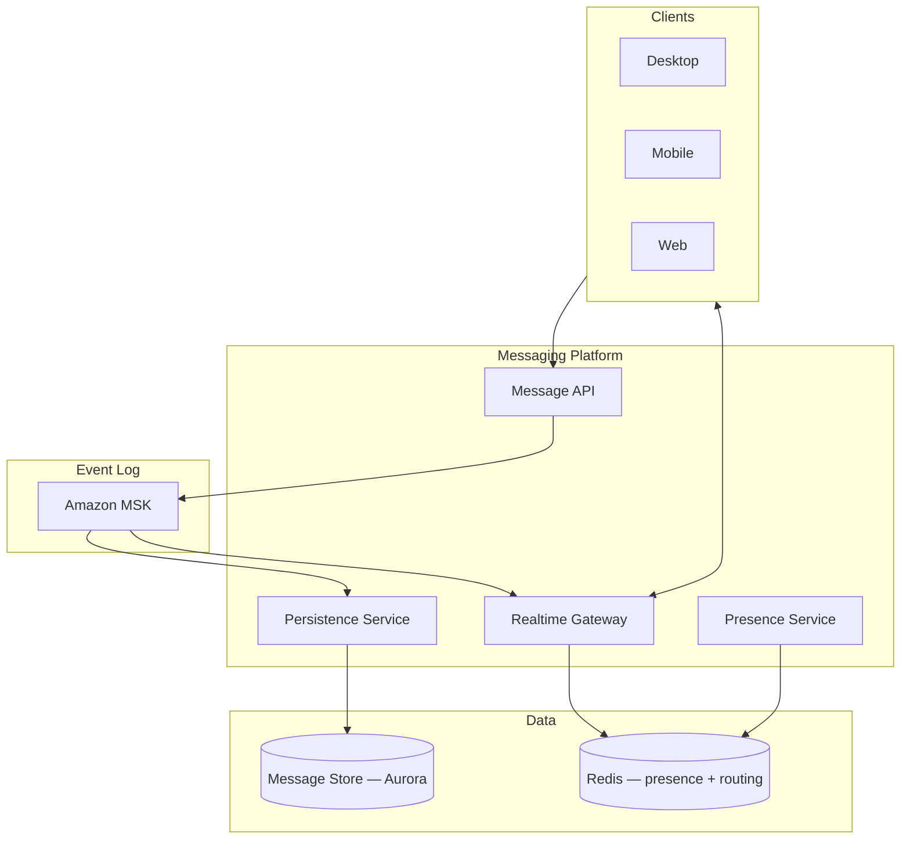

**Step-by-step flow:**

| Step | Action | Explanation |
|------|--------|-------------|
| **1** | Message API | Auth, validate, produce to MSK. |
| **2** | MSK | Ordered log per channel partition. |
| **3** | Persistence | Durable write to Aurora. |
| **4** | Gateway | WebSocket fan-out to subscribers. |
| **5** | Presence | Redis tracks online users per channel. |

### 10.3 AWS production architecture

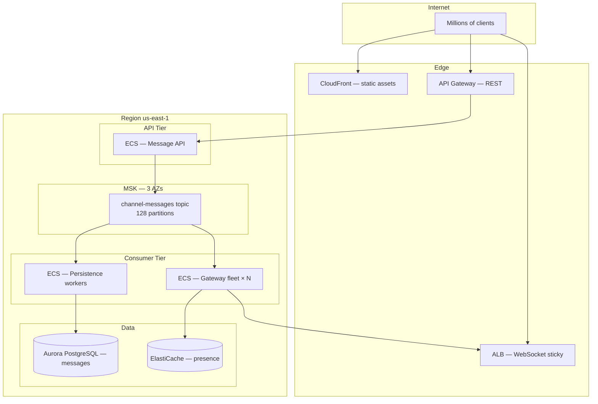

**Step-by-step flow:**

| Step | Action | Explanation |
|------|--------|-------------|
| **1** | REST ingress | API Gateway → Message API for POST. |
| **2** | WebSocket | ALB sticky sessions → Gateway fleet. |
| **3** | MSK produce | Partition by `channel_id`. |
| **4** | Dual consume | Persistence + Gateway independent consumer groups. |
| **5** | Store + push | Aurora durability; Redis presence routing. |

| AWS component | Responsibility |
|---------------|----------------|
| **MSK** | Ordered message log; 128 partitions; 3-broker HA |
| **ECS Message API** | Auth, produce, return 201 |
| **ECS Persistence** | Consume → Aurora INSERT dedup |
| **ECS Gateway** | Consume → WebSocket fan-out |
| **Aurora** | Message history; sharded by `channel_id` |
| **ElastiCache Redis** | `channel:{id}:subscribers` set; connection routing |
| **ALB** | WebSocket upgrade; sticky sessions |

### 10.4 MSK topic design

| Parameter | Value | Rationale |
|-----------|-------|-----------|
| Topic | `channel-messages` | Single topic; partition by channel |
| Partitions | 128 | ~10K channels per partition at scale |
| Replication factor | 3 | ISR durability |
| Retention | 7 days | Replay buffer; history in Aurora |
| Key | `channel_id` | Per-channel ordering |
| Hot channel | Dedicated partition mapping | Pre-map `#incidents` to partition 0 |

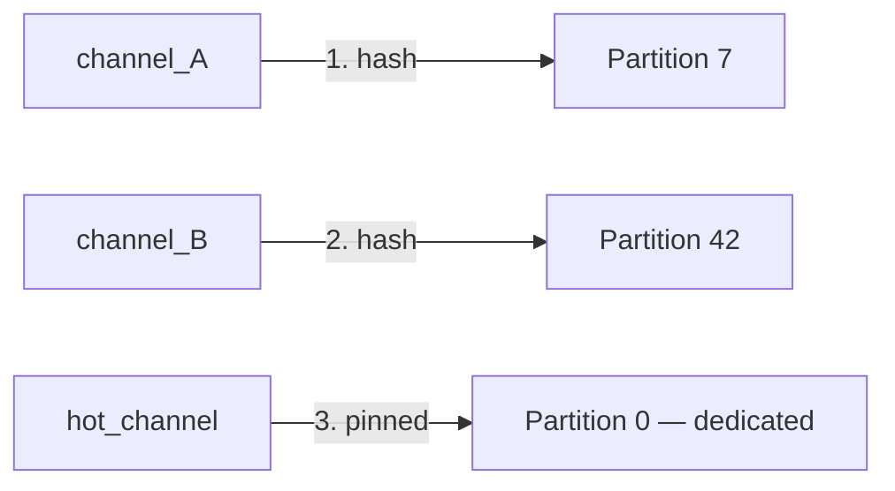

---

## 11. Production Low-Level Design

### 11.1 API contract

**Endpoint:** `POST /v1/channels/{channel_id}/messages`

```json
{
  "text": "Deploy starting in 5 minutes",
  "client_msg_id": "cm_8f3a",
  "thread_ts": null
}
```

**Response:**

```json
{
  "message_id": "msg_1735689600_abc",
  "channel_id": "C123",
  "channel_sequence": 1043,
  "ts": "1735689600.123456",
  "text": "Deploy starting in 5 minutes"
}
```

| HTTP | Meaning |
|------|---------|
| `201` | Message accepted; durable in MSK before response |
| `409` | Duplicate `client_msg_id` — idempotency hit |
| `429` | Rate limited — hot channel protection |
| `503` | MSK unavailable — client retry with same `client_msg_id` |

### 11.2 Message store schema (Aurora)

```sql
CREATE TABLE messages (
    message_id      VARCHAR(64) PRIMARY KEY,
    channel_id      VARCHAR(32) NOT NULL,
    channel_sequence BIGINT NOT NULL,
    user_id         VARCHAR(32) NOT NULL,
    text            TEXT NOT NULL,
    version         INT NOT NULL DEFAULT 1,
    client_msg_id   VARCHAR(64),
    created_at      TIMESTAMPTZ NOT NULL DEFAULT now(),

    CONSTRAINT uq_channel_sequence UNIQUE (channel_id, channel_sequence),
    CONSTRAINT uq_client_msg UNIQUE (channel_id, user_id, client_msg_id)
);

CREATE INDEX idx_messages_channel_seq ON messages (channel_id, channel_sequence DESC);
```

### 11.3 MSK producer configuration

```python
producer_config = {
    "bootstrap.servers": MSK_BROKERS,
    "enable.idempotence": True,
    "acks": "all",
    "retries": 5,
    "max.in.flight.requests.per.connection": 5,
    "compression.type": "lz4",
    "key.serializer": channel_id.encode(),
}
```

| Setting | Value | Why |
|---------|-------|-----|
| `enable.idempotence` | True | No duplicate produces on retry |
| `acks` | all | Wait for ISR before API 201 |
| `key` | channel_id | Partition ordering |

### 11.4 Message send handler — step-by-step

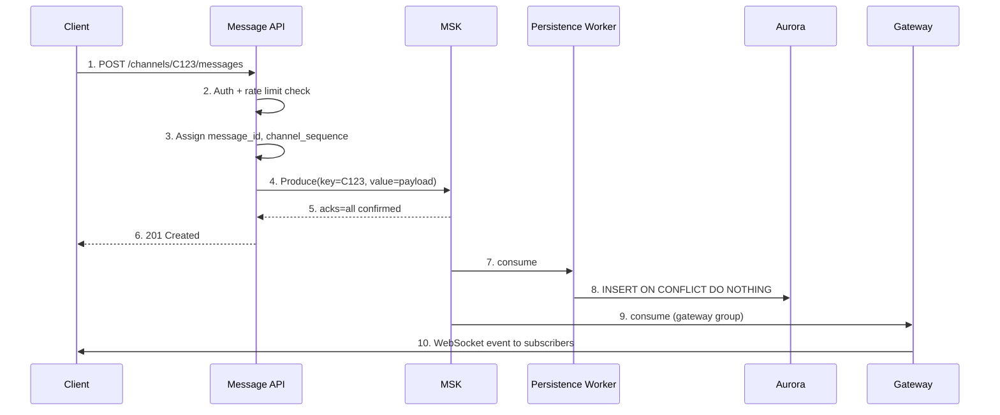

**Step-by-step flow:**

| Step | Action | Explanation |
|------|--------|-------------|
| **1** | POST | Client sends message. |
| **2** | Auth | Validate workspace membership + channel access. |
| **3** | Assign IDs | Server-side `message_id` + monotonic `channel_sequence`. |
| **4** | Produce | Write to MSK partition for C123. |
| **5** | acks=all | Durability confirmed before 201. |
| **6** | 201 Created | Client sees own message — session guarantee. |
| **7–8** | Persist | Async durable write; dedup by `message_id`. |
| **9–10** | Fan-out | Gateway pushes to all channel subscribers. |

**Handler pseudocode:**

```python
def post_message(channel_id: str, user_id: str, body: dict) -> Message:
    # Step 1: Idempotency check
    if body.get("client_msg_id"):
        existing = db.get_by_client_msg(channel_id, user_id, body["client_msg_id"])
        if existing:
            return existing

    # Step 2: Assign server IDs
    message_id = generate_message_id()
    sequence = sequence_service.next(channel_id)

    payload = {
        "message_id": message_id,
        "channel_id": channel_id,
        "channel_sequence": sequence,
        "user_id": user_id,
        "text": body["text"],
        "ts": now_ts(),
    }

    # Step 3: Produce to MSK (blocks until acks=all)
    producer.produce(
        topic="channel-messages",
        key=channel_id.encode(),
        value=json.dumps(payload).encode(),
    ).get(timeout=5)

    return Message(**payload)
```

### 11.5 WebSocket gateway

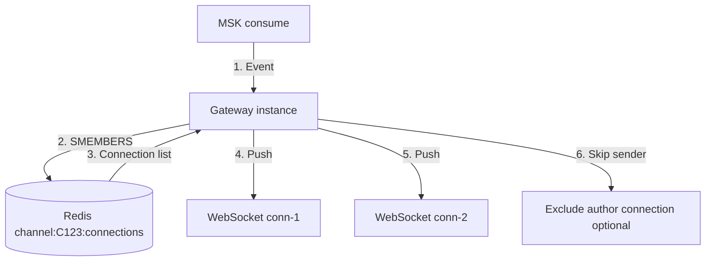

**Step-by-step flow:**

| Step | Action | Explanation |
|------|--------|-------------|
| **1** | Event | Gateway consumes message from MSK. |
| **2** | Lookup | Redis set of connection IDs subscribed to channel. |
| **3** | Connection list | May span multiple gateway instances. |
| **4–5** | Push | Send JSON event on each WebSocket. |
| **6** | Skip sender | Optional — client already has 201 response. |

**Redis structures:**

```
# Channel subscribers (connection IDs)
SADD channel:C123:connections gw-1:conn-abc gw-2:conn-def

# Connection metadata
HSET conn:gw-1:conn-abc user_id U456 gateway gw-1 channels C123,C789

# Presence
SETEX presence:U456 60 online
```

### 11.6 Offline catch-up

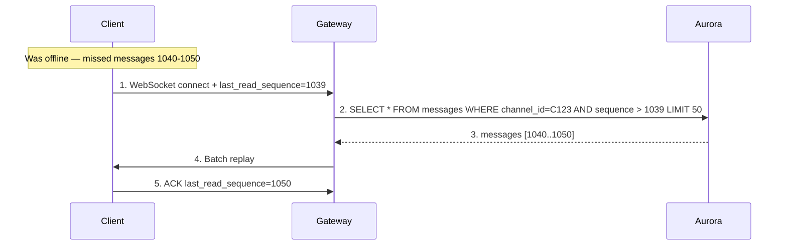

**Step-by-step flow:**

| Step | Action | Explanation |
|------|--------|-------------|
| **1** | Connect | Client reconnects with last known sequence. |
| **2** | Query gap | Fetch messages after `last_read_sequence`. |
| **3** | Batch | Return up to 50 messages per batch. |
| **4** | Replay | Client renders missed messages in order. |
| **5** | ACK | Update cursor for next disconnect. |

### 11.7 Message edit and delete

```python
# Edit broadcasts on same partition — ordering preserved
edit_payload = {
    "type": "message_edited",
    "message_id": "msg_abc",
    "channel_id": "C123",
    "text": "Updated text",
    "version": 2,
}
producer.produce(topic="channel-messages", key="C123", value=json.dumps(edit_payload))
```

| Event type | Ordering | Conflict resolution |
|------------|----------|-------------------|
| `message_posted` | Per channel_sequence | N/A |
| `message_edited` | Same partition | `version` field — last-writer-wins |
| `message_deleted` | Same partition | Tombstone in store |

---

## 12. HA/DR and Multi-Region

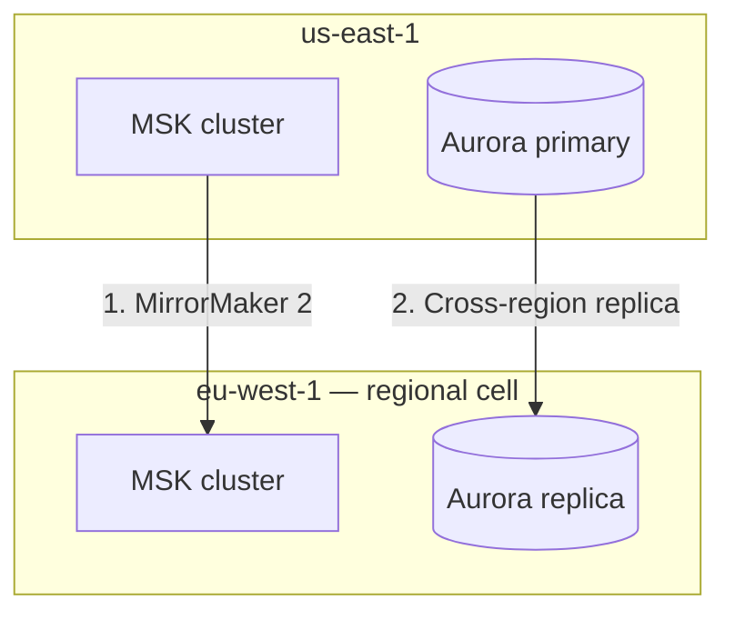

| Principle | Implementation |
|-----------|----------------|
| **Regional cells** | US workspace data in US; EU in EU |
| **EL fan-out** | Cross-region message lag 100–400ms acceptable |
| **Session stickiness** | User reads from home region — monotonic reads |
| **Admin revoke** | Strong metadata store — PC for security |

---

## 13. Observability and Operations

| Metric | Alert threshold |
|--------|-----------------|
| `msk_consumer_lag` persistence | > 10,000 for 5 min |
| `msk_consumer_lag` gateway | > 1,000 for 2 min |
| `message_delivery_latency_p99` | > 500ms |
| `websocket_connections_active` | Capacity planning |
| `duplicate_message_insert_rate` | Spike — consumer rebalance issue |
| `hot_channel_message_rate` | > 100/s per channel |

**Structured log:**

```json
{
  "message_id": "msg_abc",
  "channel_id": "C123",
  "channel_sequence": 1043,
  "produce_latency_ms": 12,
  "persist_latency_ms": 45,
  "fanout_latency_ms": 38,
  "subscribers_notified": 847
}
```

---

## 14. Implementation Roadmap (8-Week Rollout)

| Week | Deliverable |
|------|-------------|
| 1 | Message API + MSK topic + producer |
| 2 | Persistence worker + Aurora schema |
| 3 | WebSocket gateway + Redis presence |
| 4 | Offline catch-up + reconnect replay |
| 5 | Idempotency (`client_msg_id`) + dedup |
| 6 | Hot channel rate limiting |
| 7 | Load test 100K concurrent WebSockets |
| 8 | Multi-AZ hardening + consumer lag dashboards |

---

## 15. Testing Strategy

| Test | Pass criteria |
|------|---------------|
| Per-channel ordering | 1000 messages — strict sequence order |
| Duplicate produce | Idempotent producer — single row in Aurora |
| Gateway crash | Reconnect replays from `last_read_sequence` |
| Hot channel 1K msg/s | Rate limit engages; no partition stall |
| Offline 1 hour | Catch-up returns all missed messages in order |
| Edit conflict | Version increment; last edit wins |

---

## 16. Architecture Review Checklist

| # | Gate | Status |
|---|------|--------|
| 1 | MSK partition key = `channel_id` | ☐ |
| 2 | Producer `enable.idempotence=true`, `acks=all` | ☐ |
| 3 | Separate consumer groups for persist vs gateway | ☐ |
| 4 | `message_id` UNIQUE constraint in store | ☐ |
| 5 | WebSocket reconnect with gap replay | ☐ |
| 6 | `client_msg_id` idempotency on POST | ☐ |
| 7 | Hot channel rate limiting | ☐ |
| 8 | Consumer lag dashboards + alerts | ☐ |
| 9 | Load test 100K concurrent connections | ☐ |
| 10 | Message edit uses same partition for ordering | ☐ |

---

## 17. Related Study

- [Kafka Architecture](/docs/messaging-and-streaming/kafka-architecture)
- [Message Delivery Semantics](/docs/messaging-and-streaming/message-delivery-semantics)
- [PACELC — Slack messaging](/docs/consistency/pacelc)
- [Transactional Outbox](/docs/transactions/transactional-outbox)
- Lab: [Kafka streams](/docs/messaging-and-streaming/kafka-architecture#25-hands-on-exercise) on **`:8094`**
