# Scenario: Stripe Payment Idempotency

> **Diagram convention:** Arrows and messages are labeled **1, 2, 3…** to show processing order. Each diagram is followed by a **Step-by-step flow** table explaining every numbered step.

## 1. The Interview Question

> "A client times out while calling your payment API. How do you prevent duplicate charges, and what guarantees can you actually offer?"

## 2. Real-World Context

| Dimension | Detail |
|-----------|--------|
| **Company / system** | [Stripe](https://stripe.com/docs/api/idempotent_requests) — payment APIs used by millions of merchants |
| **Scale** | Billions of API requests; network timeouts are routine, not edge cases |
| **Why architects care** | Money requires **safety** over liveness; ambiguous outcomes are the default after timeouts |
| **Public references** | Stripe Idempotent Requests docs; Kleppmann *DDIA* Ch. 11 on stream processing and exactly-once |

Stripe requires an `Idempotency-Key` header on mutating requests. The server stores the key with the response for 24 hours. Retries with the same key return the **original response** without re-executing side effects.

### AWS deployment context

Typical merchant production stack on AWS — idempotency state lives in **Aurora PostgreSQL** (or **DynamoDB** at high QPS); payment orchestration runs on **ECS Fargate** or **Lambda** behind **ALB**; webhooks buffer through **SQS**; reconciliation runs on **EventBridge** + **Lambda**.

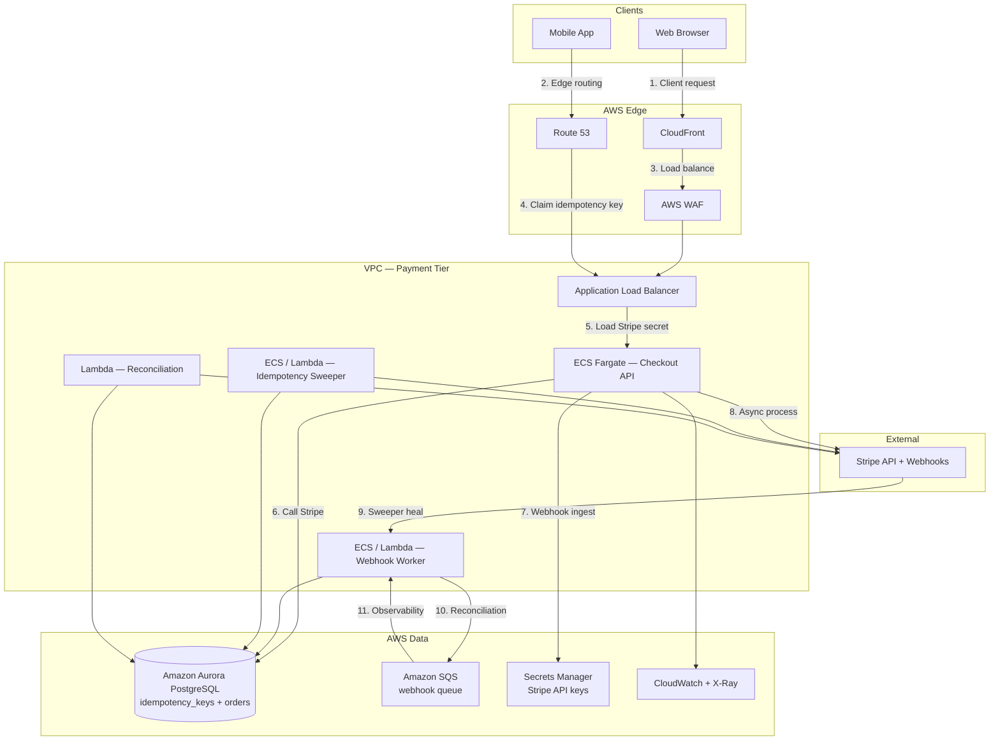
```mermaid
flowchart TB
    subgraph Clients["Clients"]
        Web[Web Browser]
        Mobile[Mobile App]
    end

    subgraph AWS_Edge["AWS Edge"]
        CF[CloudFront]
        WAF[AWS WAF]
        R53[Route 53]
    end

    subgraph AWS_Compute["VPC — Payment Tier"]
        ALB[Application Load Balancer]
        API[ECS Fargate — Checkout API]
        WH[ECS / Lambda — Webhook Worker]
        SW[ECS / Lambda — Idempotency Sweeper]
        REC[Lambda — Reconciliation]
    end

    subgraph AWS_Data["AWS Data"]
        Aurora[(Amazon Aurora PostgreSQL<br/>idempotency_keys + orders)]
        SQS[Amazon SQS<br/>webhook queue]
        SM[Secrets Manager<br/>Stripe API keys]
        CW[CloudWatch + X-Ray]
    end

    subgraph External["External"]
        Stripe[Stripe API + Webhooks]
    end

    Web -->|"1. Client request"| CF
    Mobile -->|"2. Edge routing"| R53
    CF -->|"3. Load balance"| WAF --> ALB
    R53 -->|"4. Claim idempotency key"| ALB
    ALB -->|"5. Load Stripe secret"| API
    API -->|"6. Call Stripe"| Aurora
    API -->|"7. Webhook ingest"| SM
    API -->|"8. Async process"| Stripe
    Stripe -->|"9. Sweeper heal"| WH
    WH -->|"10. Reconciliation"| SQS
    SQS -->|"11. Observability"| WH
    WH --> Aurora
    SW --> Aurora
    SW --> Stripe
    REC --> Aurora
    REC --> Stripe
    API --> CW
```

**Step-by-step flow:**

| Step | Action | Explanation |
|------|--------|-------------|
| **1** | Client request | Web/mobile user initiates checkout with `Idempotency-Key` header. |
| **2** | Edge routing | CloudFront serves static UI; API traffic passes WAF and Route 53 to ALB. |
| **3** | Load balance | ALB routes to healthy ECS Fargate checkout-api task. |
| **4** | Claim idempotency key | ECS inserts `processing` row in Aurora (`idempotency_keys`). |
| **5** | Load Stripe secret | ECS fetches `sk_live_*` from Secrets Manager. |
| **6** | Call Stripe | POST `payment_intents` with same `Idempotency-Key` (25s timeout). |
| **7** | Webhook ingest | Stripe sends event → webhook worker enqueues to SQS. |
| **8** | Async process | Consumer dedupes `event_id`, updates orders/charges in Aurora. |
| **9** | Sweeper heal | Lambda queries stuck `processing` rows; reconciles with Stripe. |
| **10** | Reconciliation | Hourly Lambda compares Aurora ledger vs Stripe settlements. |
| **11** | Observability | Structured logs and metrics emitted to CloudWatch. |


---

### Minutes 0–5: Clarify requirements

1. **Functional:** Accept charge requests; return success/failure; support client retries.
2. **Non-functional:** No duplicate charges (safety); p99 latency &lt; 500ms; audit trail for compliance.
3. **Non-goals:** Exactly-once over the network (impossible); synchronous cross-bank settlement.
4. **Assumption:** At-least-once delivery from client; crash-stop failures.

**Say aloud:** "After a timeout, we are in an **ambiguous state** — I cannot assume failure."

### Minutes 5–15: Architecture

1. Client generates **UUID idempotency key** per logical operation (not per HTTP attempt).
2. API gateway validates key format; routes to payment service.
3. Payment service opens DB transaction:
   - Check `idempotency_keys` table for `(tenant_id, key)`.
   - If `COMPLETED`: return stored response.
   - If `IN_FLIGHT`: return 409 or wait (short poll).
   - Else: insert `IN_FLIGHT`, call gateway, update ledger, mark `COMPLETED` with response body.
4. Background **reconciliation job** compares ledger vs. gateway settlement files hourly.

**AWS reference (interview whiteboard):**

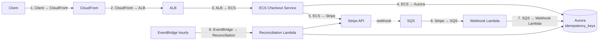
```mermaid
flowchart LR
    Client[Client] -->|"1. Client → CloudFront"| CF[CloudFront]
    CF -->|"2. CloudFront → ALB"| ALB[ALB]
    ALB -->|"3. ALB → ECS"| ECS[ECS Checkout Service]
    ECS -->|"4. ECS → Aurora"| Aurora[(Aurora<br/>idempotency_keys)]
    ECS -->|"5. ECS → Stripe"| Stripe[Stripe API]
    Stripe -.->|webhook| SQS[SQS]
    SQS -->|"6. Stripe → SQS"| WH[Webhook Lambda]
    WH -->|"7. SQS → Webhook Lambda"| Aurora
    EventBridge[EventBridge hourly] -->|"8. EventBridge → Reconciliation"| REC[Reconciliation Lambda]
    REC --> Aurora
    REC --> Stripe
```

**Step-by-step flow:**

| Step | Action | Explanation |
|------|--------|-------------|
| **1** | Client → CloudFront | TLS-terminated entry; static assets cached. |
| **2** | CloudFront → ALB | API path forwarded to Application Load Balancer. |
| **3** | ALB → ECS | Route to checkout service; validate idempotency key format. |
| **4** | ECS → Aurora | Atomic claim or cache hit on `idempotency_keys`. |
| **5** | ECS → Stripe | PaymentIntent create with merchant idempotency key. |
| **6** | Stripe → SQS | Webhook buffered for at-least-once delivery. |
| **7** | SQS → Webhook Lambda | Dedupe `event_id`; idempotent order update. |
| **8** | EventBridge → Reconciliation | Scheduled hourly ledger vs Stripe diff. |


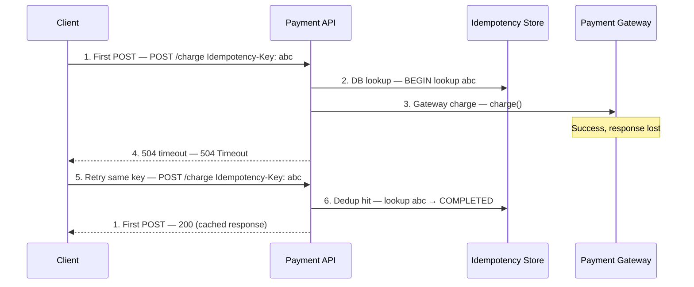
```mermaid
sequenceDiagram
    participant C as Client
    participant API as Payment API
    participant DB as Idempotency Store
    participant GW as Payment Gateway

    C->>API: 1. First POST — POST /charge Idempotency-Key: abc
    API->>DB: 2. DB lookup — BEGIN lookup abc
    API->>GW: 3. Gateway charge — charge()
    Note over GW: Success, response lost
    API-->>C: 4. 504 timeout — 504 Timeout
    C->>API: 5. Retry same key — POST /charge Idempotency-Key: abc
    API->>DB: 6. Dedup hit — lookup abc → COMPLETED
    API-->>C: 1. First POST — 200 (cached response)
```

**Step-by-step flow:**

| Step | Action | Explanation |
|------|--------|-------------|
| **1** | First POST | Client sends charge with `Idempotency-Key: abc`. |
| **2** | DB lookup | API begins transaction; inserts `processing`. |
| **3** | Gateway charge | Stripe authorizes; success at gateway. |
| **4** | 504 timeout | Response lost — client in **ambiguous** state. |
| **5** | Retry same key | Client retries with **identical** key (not new UUID). |
| **6** | Dedup hit | DB returns `completed`; cached 200 — no second charge. |


### Minutes 15–30: Deep dive

1. **Request hash:** Reject same key with different body (409 Conflict) — prevents semantic bugs.
2. **TTL:** Keys expire after 24h; document that clients must use new keys for new operations.
3. **Gateway support:** If gateway supports idempotency, pass key through; else query-by-key before re-charge.
4. **State machine:** `PENDING → COMPLETED | FAILED`; never skip states.
5. **Concurrent duplicates:** Unique constraint on `(tenant_id, idempotency_key)`; one wins, others read result.

### Minutes 30–45: Failures and ops

| Failure | Behavior |
|---------|----------|
| Idempotency store down | **Fail closed** on mutations; reads may use cache |
| Gateway slow | Timeout &lt; client deadline; return 504 with retry guidance |
| Duplicate webhook | Dedupe by `event_id` in webhook handler |
| Reconciliation drift | Alert + manual review queue; never auto-reverse without policy |

**Metrics:** Idempotency cache hit rate; reconciliation gap count; charge latency by gateway.

## 4. Whiteboard Guide

Draw left-to-right:

1. **Client** → **API** → **Idempotency DB** + **Ledger** → **Gateway**
2. Label the timeout zone with **"UNKNOWN"** between gateway and API
3. Add **reconciliation cron** below ledger ↔ gateway

### AWS whiteboard layout

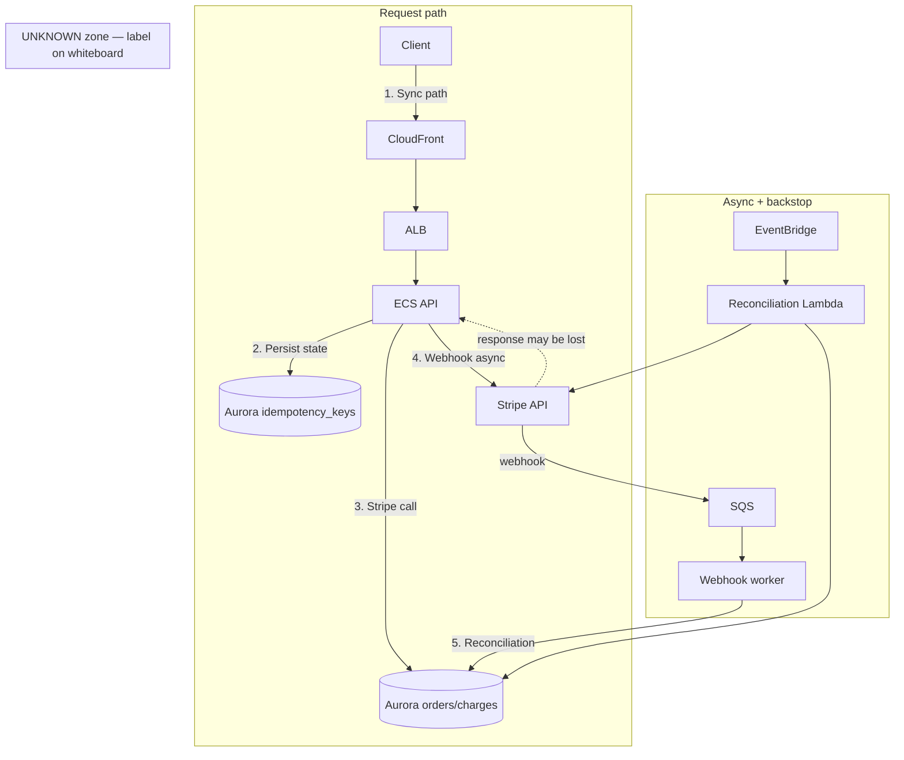
```mermaid
flowchart TB
    subgraph Lane1["Request path"]
        direction LR
        C[Client] -->|"1. Sync path"| CF[CloudFront] --> ALB[ALB] --> API[ECS API]
        API -->|"2. Persist state"| IDEM[(Aurora idempotency_keys)]
        API -->|"3. Stripe call"| LED[(Aurora orders/charges)]
        API -->|"4. Webhook async"| GW[Stripe API]
    end

    subgraph Lane2["UNKNOWN zone — label on whiteboard"]
        GW -.->|response may be lost| API
    end

    subgraph Lane3["Async + backstop"]
        direction LR
        GW -->|webhook| SQS[SQS] --> WH[Webhook worker]
        WH -->|"5. Reconciliation"| LED
        EB[EventBridge] --> REC[Reconciliation Lambda]
        REC --> LED
        REC --> GW
    end
```

**Step-by-step flow:**

| Step | Action | Explanation |
|------|--------|-------------|
| **1** | Sync path | Client → CloudFront → ALB → ECS API. |
| **2** | Persist state | Write `idempotency_keys` + ledger rows in Aurora. |
| **3** | Stripe call | External authorization — **UNKNOWN zone** if response lost. |
| **4** | Webhook async | Stripe event → SQS → worker updates ledger. |
| **5** | Reconciliation | EventBridge cron compares ledger ↔ Stripe (backstop). |


---

| Metric | Value | Reasoning |
|--------|-------|-----------|
| Peak charge QPS | 5K | Mid-size payment platform |
| Idempotency key TTL | 24h | Stripe default; covers retry windows |
| Client timeout | 30s | Mobile networks |
| Internal gateway timeout | 25s | Must be &lt; client timeout |
| Reconciliation lag SLA | 1h | Detect drift before settlement close |

### AWS service mapping at 5K QPS peak

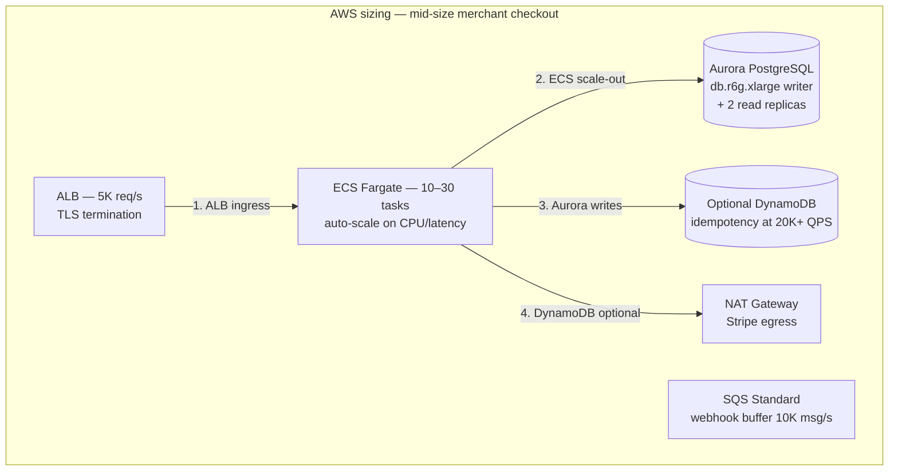
```mermaid
flowchart TB
    subgraph Sizing["AWS sizing — mid-size merchant checkout"]
        ALB[ALB — 5K req/s<br/>TLS termination]
        ECS[ECS Fargate — 10–30 tasks<br/>auto-scale on CPU/latency]
        Aurora[(Aurora PostgreSQL<br/>db.r6g.xlarge writer<br/>+ 2 read replicas)]
        DDB[(Optional DynamoDB<br/>idempotency at 20K+ QPS)]
        SQS[SQS Standard<br/>webhook buffer 10K msg/s]
        NAT[NAT Gateway<br/>Stripe egress]
    end

  ALB -->|"1. ALB ingress"| ECS
  ECS -->|"2. ECS scale-out"| Aurora
  ECS -->|"3. Aurora writes"| DDB
  ECS -->|"4. DynamoDB optional"| NAT
```

**Step-by-step flow:**

| Step | Action | Explanation |
|------|--------|-------------|
| **1** | ALB ingress | 5K req/s TLS termination and path routing. |
| **2** | ECS scale-out | 10–30 Fargate tasks; auto-scale on p99 latency. |
| **3** | Aurora writes | Idempotency + ledger strong consistency (writer). |
| **4** | DynamoDB optional | High-QPS idempotency shard if Aurora contends. |
| **5** | NAT egress | Outbound HTTPS to `api.stripe.com`. |


| AWS service | Role at this scale |
|-------------|-------------------|
| **ALB** | Path-based routing `/api/checkout`, `/webhooks/stripe` |
| **ECS Fargate** | Stateless checkout service; 25s Stripe timeout per task |
| **Aurora PostgreSQL** | `idempotency_keys`, `orders`, `charges` — sync multi-AZ |
| **ElastiCache Redis** | Optional session / rate-limit counters (not dedup primary) |
| **SQS** | Webhook durability; DLQ for poison events |
| **EventBridge** | Cron `rate(1 hour)` reconciliation |
| **Secrets Manager** | `sk_live_*` rotation; IAM task role for ECS |
| **CloudWatch** | `idempotency_processing_stuck`, `charge_latency_p99` alarms |

---

- Distinguishes **network failure** from **application failure**
- Names **safety** (no double charge) vs **liveness** (eventual settlement)
- Mentions **fail-closed** when dedup store unavailable
- Describes **reconciliation** as the backstop, not hope

## 7. Red Flags

- "Retry until success" without idempotency keys
- "Kubernetes restarts fix it"
- Claims **exactly-once** without idempotent consumers
- No mention of ambiguous timeout state

## 8. Follow-Up Questions

| Follow-up | Strong outline |
|-----------|----------------|
| Same key, different amount? | 409 Conflict; store request hash |
| Store partitioned? | Per-tenant sharding; sticky routing |
| Cross-region active-active? | Avoid for payment write path; Route 53 weighted writes to single region |

**AWS — sticky routing for payment writes:**

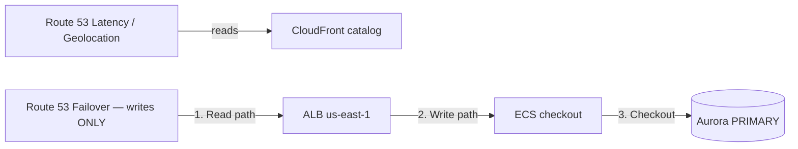
```mermaid
flowchart LR
    R53[Route 53 Latency / Geolocation] -->|reads| CF[CloudFront catalog]
    R53W[Route 53 Failover — writes ONLY] -->|"1. Read path"| ALBE[ALB us-east-1]
    ALBE -->|"2. Write path"| ECS[ECS checkout]
    ECS -->|"3. Checkout"| Aurora[(Aurora PRIMARY)]
```

**Step-by-step flow:**

| Step | Action | Explanation |
|------|--------|-------------|
| **1** | Read path | Route 53 latency routing → CloudFront catalog (geo). |
| **2** | Write path | Route 53 failover → **single** ALB us-east-1 only. |
| **3** | Checkout | ECS processes payment; Aurora primary is sole writer. |

## Hands-On Lab (Local)

Run the full scenario stack on your laptop — **no AWS account required** ($0 cost).

| Lab | Path | What you build |
|-----|------|----------------|
| **Intro** | `labs/lab-008-idempotent-api/` | FastAPI + Swagger on `:8081`; in-memory idempotency store |
| **Full stack** | `labs/lab-017-stripe-payment-idempotency/` | FastAPI + PostgreSQL/SQLite + Redis + Stripe mock + webhook worker + sweeper |

### Quick start (SQLite — no Docker)

```bash
cd labs/lab-017-stripe-payment-idempotency
python3 -m venv .venv && source .venv/bin/activate
pip install -r requirements.txt
pytest tests/ -v                    # 8 acceptance tests
python -m src.main --serve          # API on :8080
```

In another terminal:

```bash
./scripts/demo_retry.sh             # same Idempotency-Key twice → no double charge
```

### Full stack (Docker Compose)

```bash
docker compose -f docker/docker-compose.yml up --build -d
curl http://localhost:8080/health
./scripts/demo_retry.sh
```

**Services:** API `:8080`, PostgreSQL `:5434`, Redis `:6381`.

### STEP mapping

| Phase | Exercise in lab |
|-------|-----------------|
| **Scope** | Read `requirements.md` — FR/NFR from this scenario |
| **Topology** | Compare `architecture.md` local map to AWS diagrams in §2 and §11 |
| **Explore** | Trace `src/service.py` idempotency state machine; run pytest |
| **Production** | Run webhook worker (`python -m src.main --worker`) and sweeper |
| **Evolve** | Extension exercises in lab README (DynamoDB, metrics, Stripe CLI) |

Full lab guide: [`labs/lab-017-stripe-payment-idempotency/README.md`](https://github.com/hbhadra/principal-architect-knowledge-system/tree/main/labs/lab-017-stripe-payment-idempotency).

### Engineer guide: how the local stack works

This section documents the **runtime behavior** of `lab-017` as you would read it in a production runbook — component boundaries, request path, persistence, and how to verify correctness.

#### Runtime topology

| Process | Port / entrypoint | Responsibility |
|---------|-------------------|----------------|
| **Checkout API** | `:8080` — `python -m src.main --serve` | Synchronous charge path; idempotency claim + Stripe call |
| **PostgreSQL** | `:5434` — `stripe_lab` / `stripe_lab` | Durable idempotency store + order ledger |
| **Redis** | `:6381` | Webhook event queue (SQS stand-in) |
| **Webhook worker** | `python -m src.main --worker` | Consumes Redis queue; dedupes by `event_id` |
| **Sweeper** | `python -m src.main --sweeper` | Heals rows stuck in `processing` |

**Browser entrypoints:** `http://localhost:8080/` (HTML landing), `http://localhost:8080/docs` (Swagger UI), `http://localhost:8080/health`.

#### API contract — `POST /v1/charges`

**Required headers**

| Header | Rule |
|--------|------|
| `Idempotency-Key` | Non-empty string; **one key per logical checkout**; reuse on retry |
| `X-Tenant-Id` | Tenant namespace (default `demo`); keys are unique per `(tenant_id, idempotency_key)` |
| `Content-Type` | `application/json` |

**Request body** (validated by Pydantic — invalid body returns **422**, not 500):

```json
{
  "amount_cents": 2500,
  "currency": "usd"
}
```

**Success response — `201 Created`:**

```json
{
  "order_id": "ord_78772d8f6715",
  "payment_intent_id": "pi_09686b12cbd048c5",
  "status": "succeeded",
  "amount_cents": 2500,
  "currency": "USD"
}
```

| Field | Semantics |
|-------|-----------|
| `order_id` | Internal ledger row — **one per real charge** |
| `payment_intent_id` | Stripe mock intent — **one per real charge** |
| `status` | Terminal state from mock gateway |

#### Handler algorithm (`src/service.py`)

The charge handler executes in this order on every `POST /v1/charges`:

1. **Fail closed** if idempotency store is unavailable → `503` (no Stripe call).
2. **Validate** `Idempotency-Key` present → `400` if missing.
3. **Validate** `amount_cents` + `currency` before any side effect → `400` / `422`.
4. **Compute** `request_hash = SHA-256(JSON body)` — same key + different body → `409 Conflict`.
5. **Lookup** `(tenant_id, idempotency_key)` in `idempotency_keys`:
   - `completed` → return **cached** `response_body` (no Stripe call, no new order).
   - `processing` → `409 request in flight`.
6. **Claim key** — `INSERT … status='processing'` with unique constraint on `(tenant_id, idempotency_key)`; concurrent losers read winner's result.
7. **Call Stripe mock** — `create_payment_intent()`; mock dedupes by idempotency key internally.
8. **Insert order** — one row in `orders` table.
9. **Complete idempotency** — `UPDATE … status='completed'`, persist full response JSON for replay.
10. **Publish webhook** — mock pushes `payment_intent.succeeded` event to Redis queue.

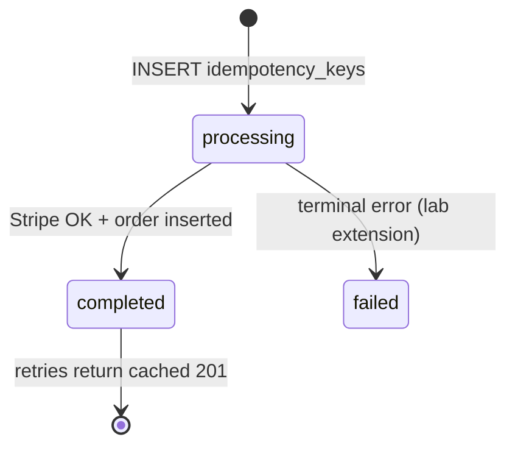
```mermaid
stateDiagram-v2
    [*] --> processing: INSERT idempotency_keys
    processing --> completed: Stripe OK + order inserted
    processing --> failed: terminal error (lab extension)
    completed --> [*]: retries return cached 201
```

#### How to tell: new charge vs idempotent replay

Compare **response IDs**, not HTTP status — both paths return `201`.

| Observation | Interpretation |
|-------------|----------------|
| Same `Idempotency-Key`, same `order_id` + `payment_intent_id` | **Replay** — no new charge, no new DB order |
| New `Idempotency-Key`, new `order_id` + `payment_intent_id` | **New charge** — new ledger row |
| `SELECT COUNT(*) FROM orders` unchanged after retry | Confirms no duplicate ledger entry |

**Swagger UI procedure**

1. Open `http://localhost:8080/docs` → **POST /v1/charges** → **Try it out**.
2. Set `Idempotency-Key: test-2`, `X-Tenant-Id: demo`.
3. Body: `{"amount_cents": 2500, "currency": "usd"}` — do **not** use the generic `additionalProp1` placeholder.
4. **Execute** → note `order_id` and `payment_intent_id`.
5. **Execute again** without changing the key → identical IDs = idempotency working.

#### PostgreSQL inspection (Docker)

```bash
# Order count — should increment only on NEW idempotency keys
docker compose -f docker/docker-compose.yml exec postgres \
  psql -U stripe_lab -d stripe_lab -c "SELECT COUNT(*) FROM orders;"

# Full ledger
docker compose -f docker/docker-compose.yml exec postgres \
  psql -U stripe_lab -d stripe_lab \
  -c "SELECT order_id, amount_cents, stripe_payment_intent_id, created_at FROM orders ORDER BY created_at;"

# Idempotency state — shows processing → completed + cached response
docker compose -f docker/docker-compose.yml exec postgres \
  psql -U stripe_lab -d stripe_lab \
  -c "SELECT tenant_id, idempotency_key, status, response_status, stripe_payment_intent_id FROM idempotency_keys;"
```

**Schema (3 tables):**

| Table | Purpose |
|-------|---------|
| `idempotency_keys` | PK `(tenant_id, idempotency_key)`; stores `request_hash`, `status`, cached `response_body` |
| `orders` | Business ledger; `stripe_payment_intent_id` UNIQUE |
| `webhook_events` | PK `event_id`; at-least-once webhook dedup |

#### Async path — webhooks + sweeper

After each successful charge, the Stripe mock enqueues a webhook event to Redis. The API does **not** block on webhook delivery.

```bash
# Terminal 1 — API (already running via compose)
# Terminal 2 — drain webhook queue
docker compose -f docker/docker-compose.yml exec api python -m src.main --worker

# Terminal 3 — heal stuck processing rows (crash mid-flight simulation)
docker compose -f docker/docker-compose.yml exec api python -m src.main --sweeper
```

Webhook handler dedupes on `event_id` — duplicate delivery inserts once into `webhook_events`, second call returns `duplicate: true`.

#### Error codes (charge path)

| HTTP | Condition | Client action |
|------|-----------|---------------|
| `201` | New charge or idempotent replay | Treat as success; same body on replay |
| `400` | Missing key or invalid amount/currency | Fix request |
| `409` | Same key, different body OR request in flight | New key for new op; backoff if in flight |
| `422` | Pydantic validation (Swagger default body) | Use `{"amount_cents": N, "currency": "usd"}` |
| `503` | Idempotency store down | Fail closed — retry later |

#### Code map

| File | Responsibility |
|------|----------------|
| `src/api.py` | HTTP surface, Swagger schema (`ChargeRequest`), HTML landing page |
| `src/service.py` | Idempotency state machine + orchestration |
| `src/db.py` | PostgreSQL/SQLite persistence, unique-constraint races |
| `src/stripe_mock.py` | PaymentIntent mock with per-key dedup |
| `src/queue.py` | Redis list (in-memory fallback for tests) |
| `src/webhook_worker.py` | Queue consumer |
| `src/sweeper.py` | Stuck `processing` reconciliation |
| `tests/test_stripe_idempotency_lab.py` | 9 acceptance tests |

#### Mapping local behavior → production (this scenario)

| Local observation | Production equivalent |
|-------------------|----------------------|
| Same key → same `payment_intent_id` | Stripe Idempotent Requests (24h window) |
| `orders` count stable on retry | Aurora ledger — no duplicate settlement |
| `webhook_events` dedup | SQS + Lambda `event_id` check |
| Sweeper heals `processing` | EventBridge scheduled reconciliation Lambda |
| `503` when store down | Fail closed — prefer outage over double charge |

## 9. Related Study

- [Partial Failure](/docs/distributed-systems-foundations/partial-failure)
- [Idempotency](/docs/distributed-systems-foundations/idempotency)
- Lab (intro): `labs/lab-008-idempotent-api`
- Lab (full local stack): `labs/lab-017-stripe-payment-idempotency`
- Case study: `case-studies/stripe`

## 10. Practice Drill

**45 minutes:** Answer the interview question using STEP. Record yourself. Score: Did you mention ambiguous state, idempotency store, reconciliation, and fail-closed?

---

## 11. Production High-Level Design

This section is a **build guide** for implementing Stripe-style payment idempotency in production — whether you are the **merchant** integrating Stripe or building an **internal payment platform** that exposes idempotent APIs to your own services.

### AWS architecture diagram index

| Section | AWS diagram topic |
|---------|-------------------|
| [§2](#aws-deployment-context) | End-to-end AWS deployment context |
| [§3](#minutes-515-architecture) | Interview AWS reference stack |
| [§4](#aws-whiteboard-layout) | AWS whiteboard layout |
| [§5](#aws-service-mapping-at-5k-qps-peak) | Service sizing at 5K QPS |
| [§11.2.1](#1121-aws-production-architecture-full-stack) | Full VPC production stack |
| [§11.4](#114-two-deployment-patterns) | Pattern A vs B on AWS |
| [§12.2.1](#1221-aws-data-layer-architecture) | Aurora vs DynamoDB data layer |
| [§12.4](#124-payment-service-handler--step-by-step-low-level) | Request path through ALB/ECS/Aurora |
| [§12.6](#126-webhook-path-async-completion) | SQS webhook pipeline |
| [§12.7](#127-reconciliation-worker) | EventBridge reconciliation |
| [§13.4](#134-aws-client-integration-topology) | CloudFront + SPA client flow |
| [§14](#14-hadr-and-failover) | Multi-AZ, multi-region DR, active-active |
| [§15](#151-aws-security-architecture) | Security + observability |
| [§16](#161-aws-services-per-phase) | Rollout Gantt + AWS services |
| [§17](#171-aws-test-environment-architecture) | Staging + FIS chaos testing |
| [§18](#181-aws-production-readiness-diagram) | Production readiness gates |
| [§20](#20-aws-architecture-png-exports-presentations) | **18 PNG exports** — AWS Architecture Icons for slides |

### 11.1 Problem statement

| Constraint | Requirement |
|------------|-------------|
| **Safety** | At most one financial side effect per logical payment intent |
| **Liveness** | Clients can retry after timeout without special-case logic |
| **Auditability** | Every charge traceable to idempotency key + gateway reference |
| **Ambiguity** | After timeout, neither client nor server knows outcome — design for that |

**Non-goals:** Exactly-once over the network; synchronous global settlement; hiding failures from merchants.

### 11.2 System context (C4 Level 1)

*Logical view — technology-agnostic component boundaries.*

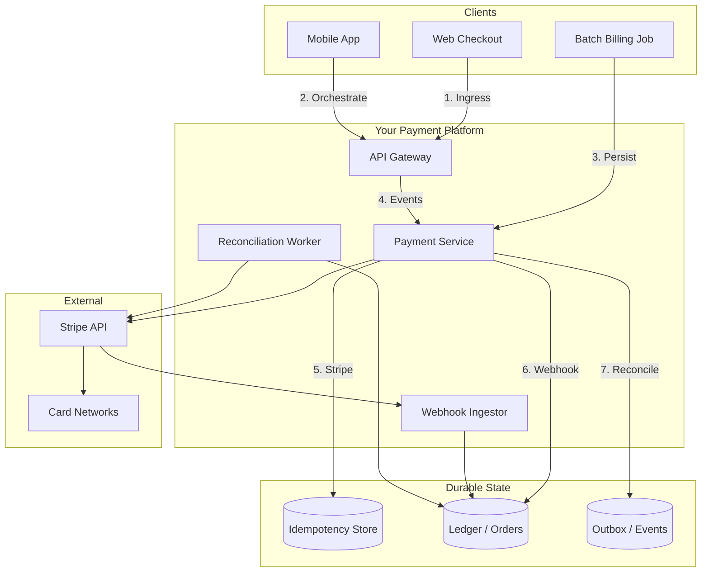
```mermaid
flowchart TB
    subgraph Clients["Clients"]
        Web[Web Checkout]
        Mobile[Mobile App]
        Batch[Batch Billing Job]
    end

    subgraph Platform["Your Payment Platform"]
        GW[API Gateway]
        PS[Payment Service]
        WH[Webhook Ingestor]
        REC[Reconciliation Worker]
    end

    subgraph Data["Durable State"]
        IDEM[(Idempotency Store)]
        LED[(Ledger / Orders)]
        EVT[(Outbox / Events)]
    end

    subgraph External["External"]
        Stripe[Stripe API]
        Card[Card Networks]
    end

    Web -->|"1. Ingress"| GW
    Mobile -->|"2. Orchestrate"| GW
    Batch -->|"3. Persist"| PS
    GW -->|"4. Events"| PS
    PS -->|"5. Stripe"| IDEM
    PS -->|"6. Webhook"| LED
    PS -->|"7. Reconcile"| EVT
    PS --> Stripe
    Stripe --> Card
    Stripe --> WH
    WH --> LED
    REC --> Stripe
    REC --> LED
```

**Step-by-step flow:**

| Step | Action | Explanation |
|------|--------|-------------|
| **1** | Ingress | Clients hit API Gateway / load balancer. |
| **2** | Orchestrate | Payment Service claims idempotency key. |
| **3** | Persist | Write idempotency store + ledger atomically. |
| **4** | Events | Outbox publishes domain events (deduped). |
| **5** | Stripe | External charge with same idempotency key. |
| **6** | Webhook | Async confirmation updates ledger. |
| **7** | Reconcile | Worker diffs ledger vs Stripe settlements. |


### 11.2.1 AWS production architecture (full stack)

*Physical AWS deployment — Pattern A merchant integrating Stripe.*

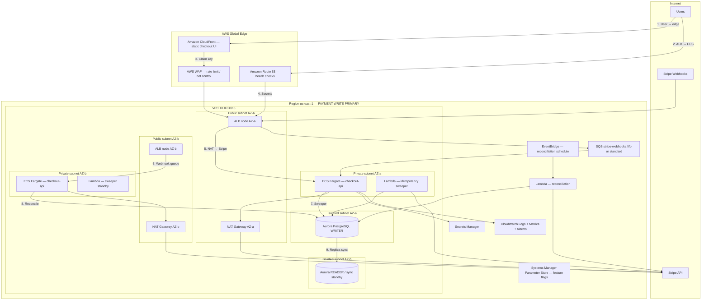
```mermaid
flowchart TB
    subgraph Internet["Internet"]
        Users[Users]
        StripeAPI[Stripe API]
        StripeWH[Stripe Webhooks]
    end

    subgraph Edge["AWS Global Edge"]
        CF[Amazon CloudFront — static checkout UI]
        WAF[AWS WAF — rate limit / bot control]
        R53[Amazon Route 53 — health checks]
    end

    subgraph Region["Region us-east-1 — PAYMENT WRITE PRIMARY"]
        subgraph VPC["VPC 10.0.0.0/16"]
            subgraph PubAZa["Public subnet AZ-a"]
                ALBa[ALB node AZ-a]
                NATa[NAT Gateway AZ-a]
            end
            subgraph PubAZb["Public subnet AZ-b"]
                ALBb[ALB node AZ-b]
                NATb[NAT Gateway AZ-b]
            end
            subgraph PrivAZa["Private subnet AZ-a"]
                ECSa[ECS Fargate — checkout-api]
                LSWa[Lambda — idempotency sweeper]
            end
            subgraph PrivAZb["Private subnet AZ-b"]
                ECSb[ECS Fargate — checkout-api]
                LSWb[Lambda — sweeper standby]
            end
            subgraph DataAZa["Isolated subnet AZ-a"]
                AuroraW[(Aurora PostgreSQL WRITER)]
            end
            subgraph DataAZb["Isolated subnet AZ-b"]
                AuroraR[(Aurora READER / sync standby)]
            end
        end
        SQS[SQS stripe-webhooks.fifo or standard]
        EB[EventBridge — reconciliation schedule]
        LRec[Lambda — reconciliation]
        SM[Secrets Manager]
        SSM[Systems Manager Parameter Store — feature flags]
        CW[CloudWatch Logs + Metrics + Alarms]
    end

    Users -->|"1. User → edge"| CF
    Users -->|"2. ALB → ECS"| R53
    CF -->|"3. Claim key"| WAF --> ALBa
    R53 -->|"4. Secrets"| ALBa
    ALBa -->|"5. NAT → Stripe"| ECSa
    ALBb -->|"6. Webhook queue"| ECSb
    ECSa -->|"7. Sweeper"| AuroraW
    ECSb -->|"8. Reconcile"| AuroraW
    AuroraW -->|"9. Replica sync"| AuroraR
    ECSa --> NATa --> StripeAPI
    ECSb --> NATb --> StripeAPI
    ECSa --> SM
    StripeWH --> ALBa
    ALBa --> SQS
    SQS --> ECSa
    EB --> LRec
    LRec --> AuroraW
    LRec --> StripeAPI
    LSWa --> AuroraW
    LSWa --> StripeAPI
    ECSa --> CW
```

**Step-by-step flow:**

| Step | Action | Explanation |
|------|--------|-------------|
| **1** | User → edge | CloudFront + WAF + Route 53 health-checked routing. |
| **2** | ALB → ECS | Cross-AZ load balance to checkout-api tasks. |
| **3** | Claim key | INSERT `idempotency_keys` on Aurora writer. |
| **4** | Secrets | Fetch Stripe API key from Secrets Manager. |
| **5** | NAT → Stripe | Egress via NAT Gateway; POST with Idempotency-Key. |
| **6** | Webhook queue | Stripe webhook → ALB → SQS → ECS consumer. |
| **7** | Sweeper | Lambda heals `processing` rows every 30s. |
| **8** | Reconcile | EventBridge triggers hourly Stripe vs ledger job. |
| **9** | Replica sync | Aurora reader + cross-AZ sync for HA. |


| AWS component | Idempotency responsibility |
|---------------|---------------------------|
| **ALB** | TLS, path routing, `503` when target unhealthy during DR |
| **ECS Fargate** | Claim key, call Stripe, cache response — stateless |
| **Aurora PostgreSQL** | `idempotency_keys` unique constraint; multi-AZ sync |
| **NAT Gateway** | Outbound HTTPS to `api.stripe.com` |
| **SQS** | Buffer webhooks; survive consumer crash |
| **Lambda sweeper** | Heal `processing` rows; EventBridge `rate(30 seconds)` |
| **EventBridge + Lambda** | Hourly reconciliation job |
| **SSM Parameter Store** | `payments_fail_closed=true` during DR promotion |
| **Secrets Manager** | Stripe secret key; IAM role per ECS task |

### 11.3 Component responsibilities

| Component | Responsibility | Idempotency role |
|-----------|----------------|------------------|
| **API Gateway** | AuthN/Z, rate limit, validate `Idempotency-Key` format | Reject malformed keys before payment service |
| **Payment Service** | Orchestrate charge; own state machine | Atomic claim in idempotency store |
| **Idempotency Store** | `(tenant, key) → status, request hash, response` | Source of truth for "already executed?" |
| **Ledger** | Immutable financial records | Natural key `charge_id`; links to idempotency key |
| **Outbox** | Reliable async events | Dedupe publish via `event_id` |
| **Webhook Ingestor** | Process Stripe `payment_intent.succeeded` etc. | Dedupe by `event.id` |
| **Reconciliation Worker** | Compare ledger vs Stripe balance transactions | Backstop for crash-window bugs |
| **Client SDK** | Generate key once; retry with same key | Keys tied to business intent, not HTTP attempt |

### 11.4 Two deployment patterns

**Pattern A — Merchant integrating Stripe (most common)**

You call Stripe's API with `Idempotency-Key`. Stripe owns the dedup store. You still need **merchant-side** idempotency: persist key with order **before** calling Stripe, and dedupe your own `POST /checkout` endpoint.

**Pattern B — Internal payment platform (Stripe-like)**

You expose `POST /v1/charges` to internal teams. You own idempotency store, ledger, gateway adapter, webhooks, and reconciliation.

Both patterns share the same **state machine** and **ambiguous timeout** semantics. The sections below cover Pattern B in full; Pattern A notes appear where the merchant layer differs.

**Pattern A — AWS (merchant + Stripe):**

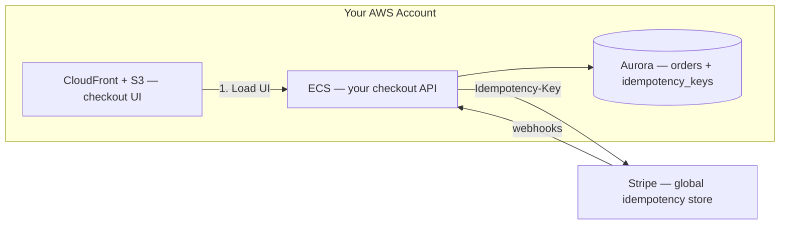
```mermaid
flowchart LR
    subgraph YourAWS["Your AWS Account"]
        FE[CloudFront + S3 — checkout UI]
        API[ECS — your checkout API]
        DB[(Aurora — orders + idempotency_keys)]
    end
    Stripe[Stripe — global idempotency store]
    FE -->|"1. Load UI"| API --> DB
    API -->|Idempotency-Key| Stripe
    Stripe -->|webhooks| API
```

**Step-by-step flow:**

| Step | Action | Explanation |
|------|--------|-------------|
| **1** | Load UI | CloudFront + S3 serves checkout SPA. |
| **2** | Checkout API | ECS receives POST with idempotency key. |
| **3** | Persist order | Aurora stores order + key **before** Stripe call. |
| **4** | Stripe charge | Same key passed to Stripe global dedup cache. |
| **5** | Webhook | Stripe confirms → ECS updates order status. |


**Pattern B — AWS (internal payment platform):**

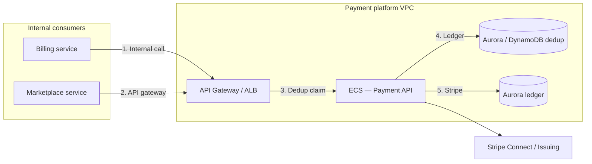
```mermaid
flowchart LR
    subgraph Internal["Internal consumers"]
        SvcA[Billing service]
        SvcB[Marketplace service]
    end
    subgraph PaymentPlatform["Payment platform VPC"]
        APIGW[API Gateway / ALB]
        Pay[ECS — Payment API]
        IDEM[(Aurora / DynamoDB dedup)]
        LED[(Aurora ledger)]
    end
    Stripe[Stripe Connect / Issuing]
    SvcA -->|"1. Internal call"| APIGW
    SvcB -->|"2. API gateway"| APIGW
    APIGW -->|"3. Dedup claim"| Pay
    Pay -->|"4. Ledger"| IDEM
    Pay -->|"5. Stripe"| LED
    Pay --> Stripe
```

**Step-by-step flow:**

| Step | Action | Explanation |
|------|--------|-------------|
| **1** | Internal call | Billing/marketplace services call Payment API. |
| **2** | API gateway | ALB authenticates internal service. |
| **3** | Dedup claim | Payment API writes idempotency store. |
| **4** | Ledger | Immutable charge row created. |
| **5** | Stripe | External gateway with platform-owned keys. |


### 11.5 High-level request lifecycle

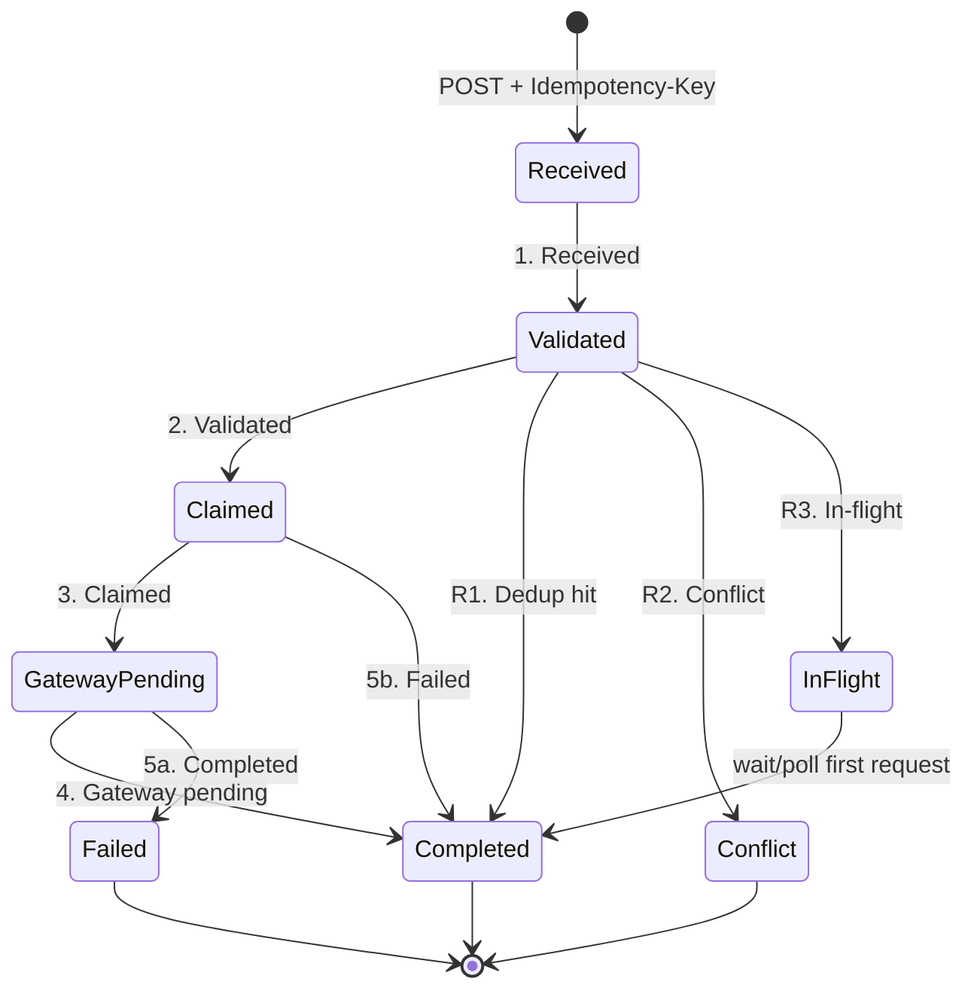
```mermaid
stateDiagram-v2
    [*] --> Received: POST + Idempotency-Key
    Received --> Validated: 1. Received
    Validated --> Claimed: 2. Validated
    Claimed --> GatewayPending: 3. Claimed
    GatewayPending --> Completed: 4. Gateway pending
    GatewayPending --> Failed: 5a. Completed
    Claimed --> Completed: 5b. Failed
    Validated --> Completed: R1. Dedup hit
    Validated --> Conflict: R2. Conflict
    Validated --> InFlight: R3. In-flight
    InFlight --> Completed: wait/poll first request
    Completed --> [*]
    Failed --> [*]
    Conflict --> [*]
```

**Step-by-step flow:**

| Step | Action | Explanation |
|------|--------|-------------|
| **1** | Received | POST arrives with `Idempotency-Key`. |
| **2** | Validated | Schema, auth, request hash computed. |
| **3** | Claimed | INSERT `processing` (unique constraint). |
| **4** | Gateway pending | Call Stripe outside long DB transaction. |
| **5a** | Completed | Cache response; terminal success. |
| **5b** | Failed | Cache error (e.g. 402); terminal failure. |
| **R1** | Dedup hit | Retry returns cached response — skip gateway. |
| **R2** | Conflict | Same key, different body → 422. |
| **R3** | In-flight | Concurrent duplicate → 409 or short poll. |


### 11.6 Key architectural decisions

| Decision | Recommendation | Rationale |
|----------|----------------|-----------|
| **Write path topology** | Single primary region; CP leader per merchant shard | Avoid split-brain double charge |
| **Idempotency store consistency** | Strong consistency (Postgres txn, DynamoDB conditional write) | Must not execute gateway twice |
| **Gateway call inside or outside DB txn** | **Outside** long txn; use `processing` + recovery sweeper | Holding DB lock during 25s gateway call kills throughput |
| **Response caching** | Store full HTTP status + body | Retries must be bit-identical to original |
| **TTL** | 24h (Stripe default) or 7d for B2B | Balance storage vs retry window |
| **Fail closed** | If idempotency store down → `503` on mutations | Safety over liveness for money |

---

## 12. Production Low-Level Design

### 12.1 API contract

**Endpoint:** `POST /v1/charges`

**Required headers:**

| Header | Rule |
|--------|------|
| `Authorization` | `Bearer <api_key>` or mTLS |
| `Idempotency-Key` | 1–255 chars; `[A-Za-z0-9_-]`; unique per logical operation |
| `Content-Type` | `application/json` |

**Request body (example):**

```json
{
  "amount": 24750,
  "currency": "usd",
  "customer_id": "cus_8f3a",
  "payment_method_id": "pm_card_visa",
  "metadata": {
    "order_id": "ord_20260728_001"
  }
}
```

**Response semantics:**

| HTTP | Meaning | Client action |
|------|---------|---------------|
| `200` / `201` | Success (may be cached on retry) | Store `charge_id`; stop retrying |
| `402` | Card declined (terminal) | Do not retry same payload blindly |
| `409` | Same key still `processing` | Retry with `Retry-After` (exponential backoff) |
| `422` | Same key, different request hash | Bug — new key required |
| `503` | Idempotency store or gateway unavailable | Retry with **same key** |
| `504` | Gateway timeout — **ambiguous** | Retry with **same key** |

**Stripe reference:** [Idempotent requests](https://docs.stripe.com/api/idempotent_requests) — keys expire after 24 hours; same key returns cached response including errors.

### 12.2 Database schema

**Table: `idempotency_keys`**

```sql
CREATE TABLE idempotency_keys (
    id              BIGSERIAL PRIMARY KEY,
    tenant_id       VARCHAR(64) NOT NULL,
    idempotency_key VARCHAR(255) NOT NULL,
    request_hash    CHAR(64) NOT NULL,          -- SHA-256 of canonical JSON body
    status          VARCHAR(16) NOT NULL,       -- processing | completed | failed
    http_status     SMALLINT,
    response_body   JSONB,
    charge_id       VARCHAR(64),                -- FK to ledger when known
    stripe_pi_id    VARCHAR(64),                 -- external reference
    created_at      TIMESTAMPTZ NOT NULL DEFAULT now(),
    updated_at      TIMESTAMPTZ NOT NULL DEFAULT now(),
    expires_at      TIMESTAMPTZ NOT NULL,     -- created_at + 24h

    CONSTRAINT uq_tenant_key UNIQUE (tenant_id, idempotency_key)
);

CREATE INDEX idx_idempotency_expires ON idempotency_keys (expires_at)
    WHERE status IN ('completed', 'failed');
```

**Table: `charges` (ledger)**

```sql
CREATE TABLE charges (
    charge_id       VARCHAR(64) PRIMARY KEY,    -- ch_xxx generated server-side
    tenant_id       VARCHAR(64) NOT NULL,
    idempotency_key VARCHAR(255) NOT NULL,
    amount          BIGINT NOT NULL,
    currency        CHAR(3) NOT NULL,
    status          VARCHAR(16) NOT NULL,       -- pending | succeeded | failed
    stripe_pi_id    VARCHAR(64) UNIQUE,
    created_at      TIMESTAMPTZ NOT NULL DEFAULT now(),

    CONSTRAINT uq_tenant_idem UNIQUE (tenant_id, idempotency_key)
);
```

**Table: `webhook_events` (async dedup)**

```sql
CREATE TABLE webhook_events (
    event_id        VARCHAR(64) PRIMARY KEY,    -- Stripe evt_xxx
    event_type      VARCHAR(64) NOT NULL,
    payload         JSONB NOT NULL,
    processed_at    TIMESTAMPTZ,
    created_at      TIMESTAMPTZ NOT NULL DEFAULT now()
);
```

**DynamoDB alternative (high QPS):**

| Attribute | Type | Notes |
|-----------|------|-------|
| `PK` | `TENANT#<id>#IDEM#<key>` | Partition key |
| `status` | String | `processing` / `completed` / `failed` |
| `request_hash` | String | |
| `response` | Map | Cached API response |
| `ttl` | Number | Unix epoch for 24h expiry |

Use `ConditionExpression: attribute_not_exists(PK)` for atomic claim.

### 12.2.1 AWS data layer architecture

**Option A — Aurora PostgreSQL (recommended for &lt; 20K charge QPS):**

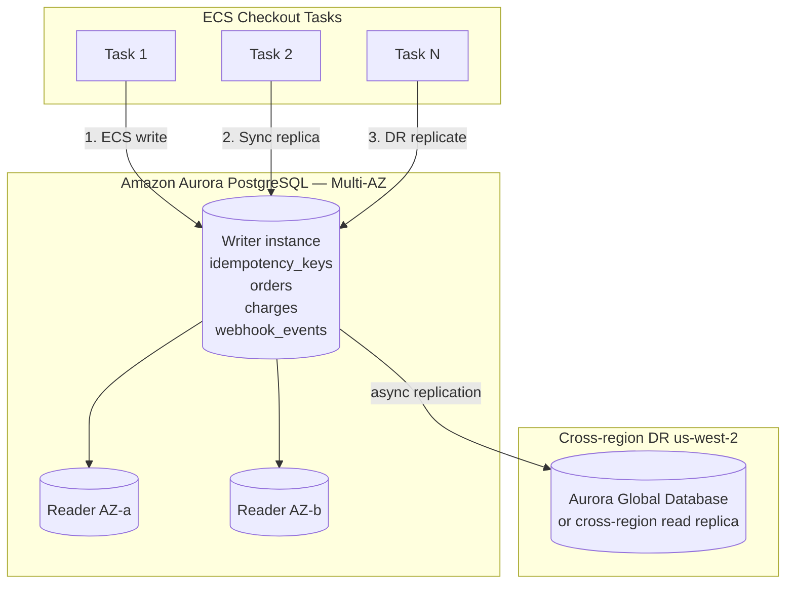
```mermaid
flowchart TB
    subgraph ECS["ECS Checkout Tasks"]
        T1[Task 1]
        T2[Task 2]
        T3[Task N]
    end

    subgraph Aurora["Amazon Aurora PostgreSQL — Multi-AZ"]
        Writer[(Writer instance<br/>idempotency_keys<br/>orders<br/>charges<br/>webhook_events)]
        Reader1[(Reader AZ-a)]
        Reader2[(Reader AZ-b)]
    end

    subgraph DR["Cross-region DR us-west-2"]
        GlobalDB[(Aurora Global Database<br/>or cross-region read replica)]
    end

    T1 -->|"1. ECS write"| Writer
    T2 -->|"2. Sync replica"| Writer
    T3 -->|"3. DR replicate"| Writer
    Writer --> Reader1
    Writer --> Reader2
    Writer -->|async replication| GlobalDB
```

**Step-by-step flow:**

| Step | Action | Explanation |
|------|--------|-------------|
| **1** | ECS write | All checkout tasks write to single Aurora writer. |
| **2** | Sync replica | In-region readers serve consistent reads if needed. |
| **3** | DR replicate | Async replication to us-west-2 Global DB / replica. |


**Option B — DynamoDB for idempotency + Aurora for ledger (high QPS):**

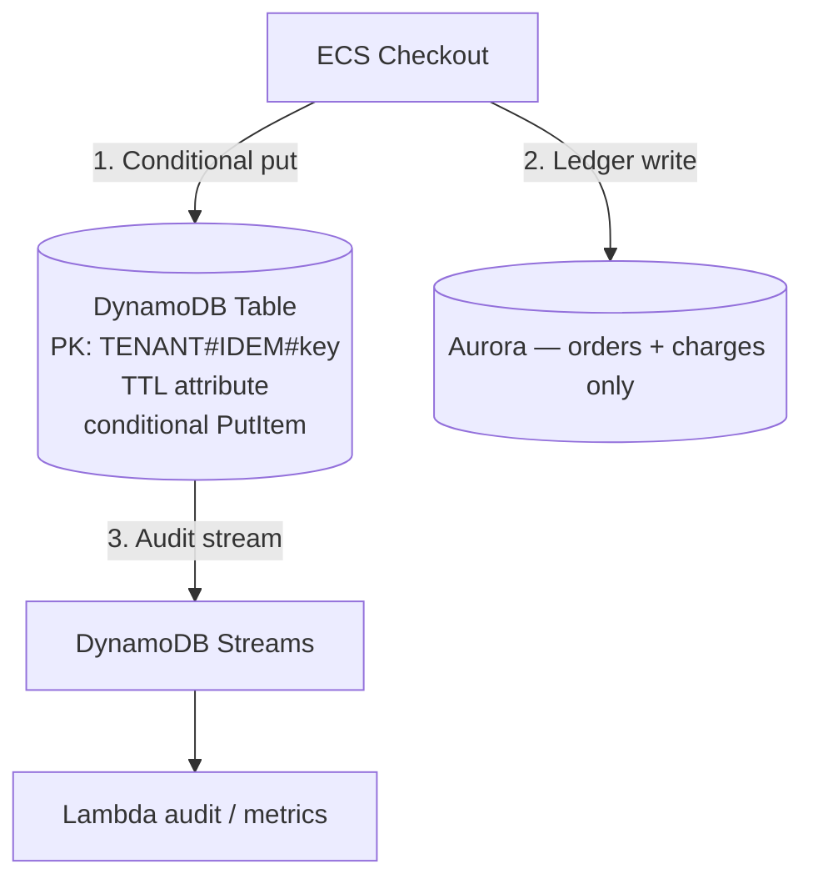
```mermaid
flowchart TB
    ECS[ECS Checkout] -->|"1. Conditional put"| DDB[(DynamoDB Table<br/>PK: TENANT#IDEM#key<br/>TTL attribute<br/>conditional PutItem)]
    ECS -->|"2. Ledger write"| Aurora[(Aurora — orders + charges only)]
    DDB -->|"3. Audit stream"| DDBStream[DynamoDB Streams]
    DDBStream --> Lambda[Lambda audit / metrics]
```

**Step-by-step flow:**

| Step | Action | Explanation |
|------|--------|-------------|
| **1** | Conditional put | DynamoDB `PutItem` claims idempotency key atomically. |
| **2** | Ledger write | Aurora stores orders/charges (relational integrity). |
| **3** | Audit stream | DynamoDB Streams → Lambda metrics/audit. |


| Store | AWS service | Idempotency pattern |
|-------|-------------|---------------------|
| Dedup + ledger (simple) | Aurora PostgreSQL | `INSERT ... ON CONFLICT` in transaction |
| Dedup only (scale) | DynamoDB | `PutItem` with `attribute_not_exists(PK)` |
| Dedup cache (optional) | ElastiCache Redis | **Not** primary — Aurora/DynamoDB is source of truth |
| Audit trail | S3 + Athena | Append-only payment audit logs |

### 12.3 Request hash (fingerprint)

Canonicalize JSON before hashing to prevent false mismatches:

1. Sort object keys recursively.
2. Normalize amounts (integer cents only).
3. `SHA-256(method + path + canonical_body)`.

If `(tenant, key)` exists and `request_hash` differs → `422 Unprocessable Entity`.

### 12.4 Payment service handler — step-by-step (low level)

**AWS request path — end to end:**

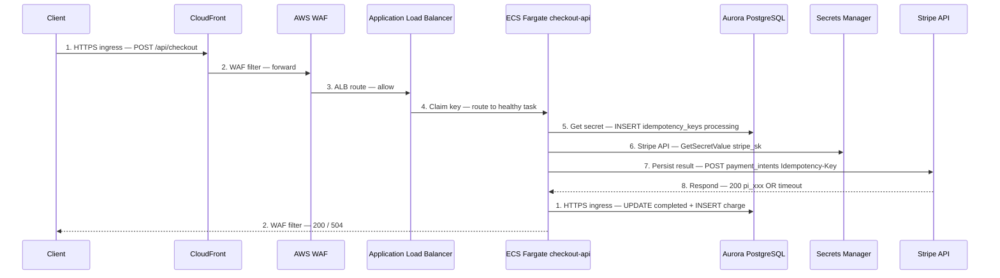
```mermaid
sequenceDiagram
    participant Client
    participant CF as CloudFront
    participant WAF as AWS WAF
    participant ALB as Application Load Balancer
    participant ECS as ECS Fargate checkout-api
    participant Aurora as Aurora PostgreSQL
    participant SM as Secrets Manager
    participant Stripe as Stripe API

    Client->>CF: 1. HTTPS ingress — POST /api/checkout
    CF->>WAF: 2. WAF filter — forward
    WAF->>ALB: 3. ALB route — allow
    ALB->>ECS: 4. Claim key — route to healthy task
    ECS->>Aurora: 5. Get secret — INSERT idempotency_keys processing
    ECS->>SM: 6. Stripe API — GetSecretValue stripe_sk
    ECS->>Stripe: 7. Persist result — POST payment_intents Idempotency-Key
    Stripe-->>ECS: 8. Respond — 200 pi_xxx OR timeout
    ECS->>Aurora: 1. HTTPS ingress — UPDATE completed + INSERT charge
    ECS-->>Client: 2. WAF filter — 200 / 504
```

**Step-by-step flow:**

| Step | Action | Explanation |
|------|--------|-------------|
| **1** | HTTPS ingress | Client POST `/api/checkout` via CloudFront. |
| **2** | WAF filter | Rate limit and OWASP rule check. |
| **3** | ALB route | Forward to healthy ECS task. |
| **4** | Claim key | INSERT `idempotency_keys` status=`processing`. |
| **5** | Get secret | Secrets Manager returns Stripe API key. |
| **6** | Stripe API | POST `payment_intents` with Idempotency-Key. |
| **7** | Persist result | UPDATE idempotency + INSERT charge. |
| **8** | Respond | 200 success or 504 ambiguous to client. |


**Step 1 — Ingress validation (synchronous, &lt;5ms)**

```
1. Parse Idempotency-Key header — reject 400 if missing on POST
2. Authenticate tenant_id from API key
3. Validate body schema (amount > 0, currency ISO 4217)
4. Compute request_hash
```

**Step 2 — Idempotency claim (single DB round-trip)**

```sql
INSERT INTO idempotency_keys (tenant_id, idempotency_key, request_hash, status, expires_at)
VALUES ($1, $2, $3, 'processing', now() + interval '24 hours')
ON CONFLICT (tenant_id, idempotency_key) DO NOTHING
RETURNING id, status;
```

| Outcome | Next action |
|---------|-------------|
| INSERT succeeded | You own the key — proceed to Step 3 |
| INSERT failed — row `completed` | Return cached `http_status` + `response_body` — **STOP** |
| INSERT failed — row `failed` | Return cached error — **STOP** |
| INSERT failed — row `processing` | Go to Step 2b (concurrent handling) |

**Step 2b — Concurrent duplicate**

Option A (Stripe-style): Short poll — `SELECT ... FOR UPDATE` wait up to 2s for status change, then return cached response.

Option B: Immediate `409 Conflict` + `Retry-After: 1`.

**Step 3 — Create ledger row (same txn as claim, optional)**

```sql
INSERT INTO charges (charge_id, tenant_id, idempotency_key, amount, currency, status)
VALUES ($charge_id, $tenant, $key, $amount, $currency, 'pending');
UPDATE idempotency_keys SET charge_id = $charge_id WHERE id = $idem_id;
COMMIT;
```

**Step 4 — Call Stripe (outside long transaction)**

```
POST https://api.stripe.com/v1/payment_intents
Headers:
  Idempotency-Key: <same key>
  Authorization: Bearer sk_live_...
Body:
  amount, currency, customer, payment_method, metadata[order_id]
Timeout: 25s (internal) < 30s (client)
```

| Stripe result | Action |
|---------------|--------|
| `200` + `pi_xxx` succeeded | Update ledger `succeeded`, idempotency `completed`, cache response |
| `402` card_error | Mark `failed`, cache 402 body (retries return same 402) |
| Timeout / `504` | Leave `processing` — **critical** — go to Step 5 |
| `500` Stripe error | Retry Stripe with same key (Stripe dedupes) or query status |

**Step 5 — Ambiguous timeout recovery**

Do **not** mark `failed`. Leave `processing`. Options:

1. **Client retries** with same key → your handler hits `processing` → poll or query Stripe by idempotency key.
2. **Sweeper job** (every 30s): `SELECT * FROM idempotency_keys WHERE status='processing' AND updated_at < now() - interval '30 seconds'`. For each: `GET /v1/payment_intents?metadata[idempotency_key]=...` or list by metadata.
3. **Stripe Search API** / reconciliation file for `pi_xxx` if you stored partial response.

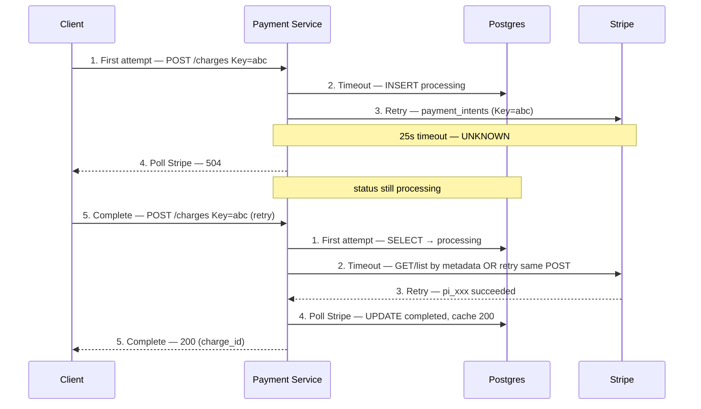
```mermaid
sequenceDiagram
    participant C as Client
    participant API as Payment Service
    participant DB as Postgres
    participant S as Stripe

    C->>API: 1. First attempt — POST /charges Key=abc
    API->>DB: 2. Timeout — INSERT processing
    API->>S: 3. Retry — payment_intents (Key=abc)
    Note over API,S: 25s timeout — UNKNOWN
    API-->>C: 4. Poll Stripe — 504

  Note over API,DB: status still processing

    C->>API: 5. Complete — POST /charges Key=abc (retry)
    API->>DB: 1. First attempt — SELECT → processing
    API->>S: 2. Timeout — GET/list by metadata OR retry same POST
    S-->>API: 3. Retry — pi_xxx succeeded
    API->>DB: 4. Poll Stripe — UPDATE completed, cache 200
    API-->>C: 5. Complete — 200 (charge_id)
```

**Step-by-step flow:**

| Step | Action | Explanation |
|------|--------|-------------|
| **1** | First attempt | INSERT `processing`; call Stripe. |
| **2** | Timeout | 504 to client; row stays `processing`. |
| **3** | Retry | Client retries **same key**. |
| **4** | Poll Stripe | Query PI or retry POST — Stripe dedupes. |
| **5** | Complete | UPDATE `completed`; return cached 200. |


**Step 6 — Persist terminal state**

```sql
UPDATE idempotency_keys
SET status = 'completed',
    http_status = 200,
    response_body = $json,
    stripe_pi_id = $pi,
    updated_at = now()
WHERE tenant_id = $1 AND idempotency_key = $2;

UPDATE charges SET status = 'succeeded', stripe_pi_id = $pi
WHERE charge_id = $charge_id;
```

All in one transaction. Response to client only after commit.

### 12.5 Reference handler pseudocode

```python
def create_charge(tenant_id: str, idem_key: str, body: dict) -> Response:
    req_hash = sha256_canonical(body)

    # Fast path: already done
    existing = db.get_idempotency(tenant_id, idem_key)
    if existing:
        if existing.request_hash != req_hash:
            return Response(422, "Idempotency key reused with different parameters")
        if existing.status == "completed":
            return Response(existing.http_status, existing.response_body)
        if existing.status == "failed":
            return Response(existing.http_status, existing.response_body)
        if existing.status == "processing":
            return wait_or_409(existing, timeout=2.0)

    # Claim key
    claimed = db.try_insert_processing(tenant_id, idem_key, req_hash)
    if not claimed:
        return create_charge(tenant_id, idem_key, body)  # retry from top

    charge_id = generate_charge_id()
    db.insert_charge_pending(charge_id, tenant_id, idem_key, body)

    try:
        stripe_resp = stripe.payment_intents.create(
            **map_body(body),
            idempotency_key=idem_key,
            timeout=25,
        )
    except Timeout:
        return Response(504, {"error": "ambiguous", "retry_with_same_key": True})
    except StripeError as e:
        db.mark_idempotency_failed(tenant_id, idem_key, e.http_status, e.json)
        return Response(e.http_status, e.json)

    response = map_stripe_to_api(stripe_resp, charge_id)
    db.mark_idempotency_completed(tenant_id, idem_key, 200, response, stripe_resp.id)
    return Response(200, response)
```

### 12.6 Webhook path (async completion)

Stripe may confirm payment asynchronously (3DS, network delays). Webhooks are **at-least-once**.

**Handler steps:**

1. Verify signature (`Stripe-Signature` header).
2. `INSERT INTO webhook_events (event_id, ...) ON CONFLICT DO NOTHING`.
3. If conflict (duplicate `event_id`) → return `200` immediately.
4. Process `payment_intent.succeeded`: update `charges` + `orders` if not already `succeeded`.
5. Use `charge_id` or `stripe_pi_id` as idempotent update key: `UPDATE ... WHERE status != 'succeeded'`.

**Never** create a second charge from webhook — only transition existing ledger row.

**AWS webhook architecture:**

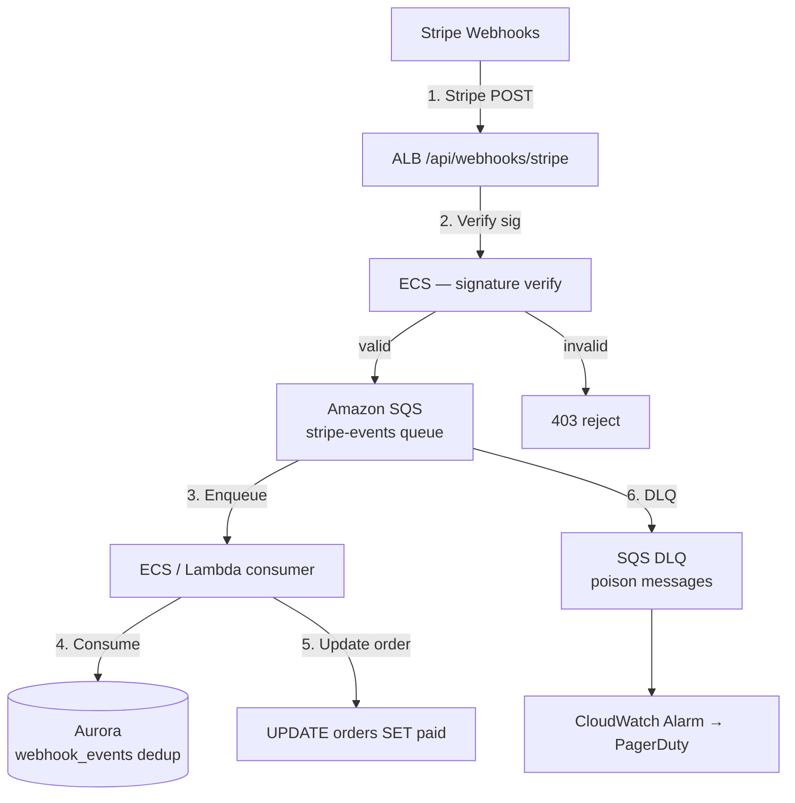
```mermaid
flowchart TB
    Stripe[Stripe Webhooks] -->|"1. Stripe POST"| ALB[ALB /api/webhooks/stripe]
    ALB -->|"2. Verify sig"| Val[ECS — signature verify]
    Val -->|valid| SQS[Amazon SQS<br/>stripe-events queue]
    Val -->|invalid| Reject[403 reject]
    SQS -->|"3. Enqueue"| Consumer[ECS / Lambda consumer]
    Consumer -->|"4. Consume"| Aurora[(Aurora<br/>webhook_events dedup)]
    Consumer -->|"5. Update order"| Aurora2[UPDATE orders SET paid]
    SQS -->|"6. DLQ"| DLQ[SQS DLQ<br/>poison messages]
    DLQ --> Alarm[CloudWatch Alarm → PagerDuty]
```

**Step-by-step flow:**

| Step | Action | Explanation |
|------|--------|-------------|
| **1** | Stripe POST | Webhook hits ALB `/api/webhooks/stripe`. |
| **2** | Verify sig | Validate `Stripe-Signature` HMAC. |
| **3** | Enqueue | Push raw event to SQS (fast ACK). |
| **4** | Consume | Worker pulls message; INSERT `event_id` dedup. |
| **5** | Update order | Idempotent `UPDATE orders SET paid`. |
| **6** | DLQ | Poison messages → DLQ → CloudWatch alarm. |


| AWS component | Configuration |
|---------------|---------------|
| **ALB** | Fast ACK to Stripe (`200` after SQS enqueue) — or sync process if low volume |
| **SQS** | Visibility timeout > max handler duration; maxReceiveCount=5 → DLQ |
| **ECS/Lambda** | Idempotent consumer: `INSERT event_id ON CONFLICT DO NOTHING` |
| **DLQ** | Manual replay after fix; never auto-replay without dedup check |

### 12.7 Reconciliation worker

**Schedule:** Hourly + end-of-day settlement.

**Algorithm:**

1. Pull Stripe Balance Transactions for window `[T-2h, T]`.
2. Join on `stripe_pi_id` / `charge_id` / metadata `order_id`.
3. Flag:
   - **Stripe charge, no ledger row** → crash after Stripe, before DB — auto-insert or alert.
   - **Ledger succeeded, no Stripe** → phantom row — critical alert.
   - **Amount mismatch** → P1 incident.

**Output:** Reconciliation gap dashboard; never auto-refund without policy engine approval.

**AWS reconciliation architecture:**

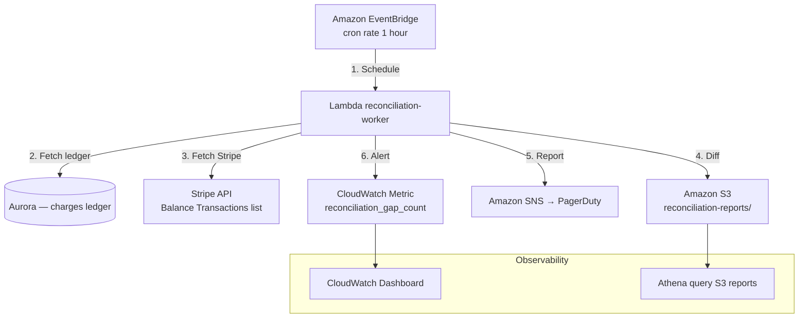
```mermaid
flowchart TB
    EB[Amazon EventBridge<br/>cron rate 1 hour] -->|"1. Schedule"| LRec[Lambda reconciliation-worker]
    LRec -->|"2. Fetch ledger"| Aurora[(Aurora — charges ledger)]
    LRec -->|"3. Fetch Stripe"| Stripe[Stripe API<br/>Balance Transactions list]
    LRec -->|"4. Diff"| S3[Amazon S3<br/>reconciliation-reports/]
    LRec -->|"5. Report"| SNS[Amazon SNS → PagerDuty]
    LRec -->|"6. Alert"| CW[CloudWatch Metric<br/>reconciliation_gap_count]

    subgraph Dashboard["Observability"]
        CW2[CloudWatch Dashboard]
        Athena[Athena query S3 reports]
    end

    S3 --> Athena
    CW --> CW2
```

**Step-by-step flow:**

| Step | Action | Explanation |
|------|--------|-------------|
| **1** | Schedule | EventBridge cron `rate(1 hour)`. |
| **2** | Fetch ledger | Lambda reads Aurora charges for window. |
| **3** | Fetch Stripe | List Balance Transactions from Stripe API. |
| **4** | Diff | Join on `stripe_pi_id`; flag gaps. |
| **5** | Report | Write CSV to S3; emit `reconciliation_gap_count`. |
| **6** | Alert | SNS → PagerDuty on any mismatch. |


---

### 13.1 Merchant checkout (Pattern A)

| Step | Owner | Action |
|------|-------|--------|
| 1 | Frontend | User clicks "Pay" — disable double-submit |
| 2 | Backend | Create `order` row `status=draft` |
| 3 | Backend | Generate `idempotency_key = f"ord_{order_id}"` — persist on order row **before** Stripe call |
| 4 | Backend | `POST /v1/payment_intents` with key |
| 5 | Backend | On `200`: update `order.status=paid`, store `payment_intent_id` |
| 6 | Backend | On `504`/timeout: return `202` to frontend with `order_id` — frontend polls `GET /orders/{id}` |
| 7 | Frontend | Poll order status; backend may retry Stripe with **same key** server-side |

**Critical bug to avoid:** Generating a new UUID on each HTTP retry.

```javascript
// Browser — key once per checkout session
const idemKey = sessionStorage.getItem('checkout_idem')
  ?? crypto.randomUUID();
sessionStorage.setItem('checkout_idem', idemKey);

await fetch('/api/checkout', {
  method: 'POST',
  headers: { 'Idempotency-Key': idemKey },
  body: JSON.stringify({ cartId }),
});
```

### 13.2 Server-side retry policy

| Condition | Retry? | Same key? |
|-----------|--------|-----------|
| `503`, `504`, connection reset | Yes | Yes |
| `409` processing | Yes | Yes — after `Retry-After` |
| `200`, `201` | No | — |
| `402` card declined | No | Same key returns same 402 |
| `422` hash mismatch | No | Fix bug — new key |

**Backoff:** `min(2^n, 30s)` + jitter; max 5 attempts over 2 minutes; then surface "payment pending" UX.

### 13.3 Batch billing jobs

Use deterministic keys: `sub_{subscription_id}_{billing_period_start}`.

Persist key in `invoices` table before calling payment API. Job retries on next cron with same key.

### 13.4 AWS client integration topology

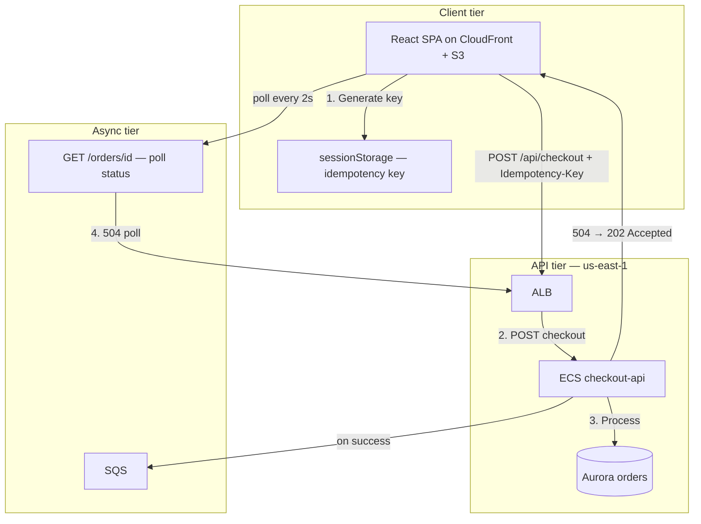
```mermaid
flowchart TB
    subgraph Browser["Client tier"]
        SPA[React SPA on CloudFront + S3]
        SS[sessionStorage — idempotency key]
    end

    subgraph API["API tier — us-east-1"]
        ALB[ALB]
        ECS[ECS checkout-api]
        Aurora[(Aurora orders)]
    end

    subgraph Async["Async tier"]
        SQS[SQS]
        Poll[GET /orders/id — poll status]
    end

    SPA -->|"1. Generate key"| SS
    SPA -->|POST /api/checkout + Idempotency-Key| ALB
    ALB -->|"2. POST checkout"| ECS
    ECS -->|"3. Process"| Aurora
    ECS -->|504 → 202 Accepted| SPA
    SPA -->|poll every 2s| Poll
    Poll -->|"4. 504 poll"| ALB
    ECS -->|on success| SQS
```

**Step-by-step flow:**

| Step | Action | Explanation |
|------|--------|-------------|
| **1** | Generate key | Browser stores UUID in `sessionStorage` (once per checkout). |
| **2** | POST checkout | SPA calls ALB with `Idempotency-Key`. |
| **3** | Process | ECS claims key; calls Stripe. |
| **4** | 504 poll | On timeout, return 202; SPA polls `GET /orders/{id}`. |


**AWS-specific client patterns:**

| Pattern | AWS implementation |
|---------|-------------------|
| Key persistence | Browser `sessionStorage`; mobile Keychain; server `orders.idempotency_key` column |
| Timeout UX | API returns `202` + `order_id`; frontend polls ALB `GET /orders/{id}` |
| Fail closed during DR | SSM `payments_fail_closed` → ALB returns `503` via Lambda@Edge or app middleware |
| Static assets | CloudFront caches checkout UI; API calls bypass cache (`Cache-Control: no-store`) |

---

Payment idempotency and HA/DR are inseparable: **failover moves or duplicates your dedup store** while clients keep retrying with the same keys. This section is a production runbook for Stripe-style payment flows across **single-region active-passive**, **multi-region DR**, and **active-active** — with minute-by-minute timelines, fencing rules, and recovery procedures.

**Core principle:** Your idempotency store and Stripe's idempotency cache must **agree on outcome** after any failover. When they cannot (async replication lag), **Stripe is the global authority** — query or retry with the same `Idempotency-Key` before creating a new charge.

See also: [Idempotency HA/DR](/docs/distributed-systems-foundations/idempotency#72-idempotency-in-active-passive-active-active-and-disaster-recovery), [CAP HA/DR](/docs/consistency/cap-theorem#72-cap-in-active-passive-active-active-and-disaster-recovery).

### 14.1 DR vocabulary (payment idempotency lens)

| Term | Payment meaning | Idempotency implication |
|------|-----------------|-------------------------|
| **RPO** | Max ledger + dedup loss | Dedup rows missing after promotion → retry looks like new charge |
| **RTO** | Max payment API downtime | Longer RTO → more client retries → more pressure on dedup |
| **Active-passive** | One write region for payments | Single dedup authority — simplest for money |
| **Active-active** | Multiple regions accept writes | Requires global dedup or Stripe-only authority |
| **Split brain** | Two regions both charge | **Worst case** — duplicate `PaymentIntent` unless fenced |
| **Failback** | Return to original primary | Stale east primary must not accept writes with old keys |
| **Fencing** | Revoke old primary IAM/credentials | Prevents double Stripe calls after promotion |
| **Fail closed** | `503` on mutations when dedup uncertain | Safety default during promotion window |

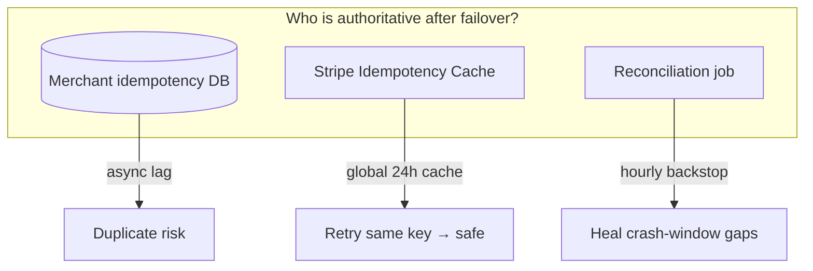
```mermaid
flowchart TB
    subgraph Authority["Who is authoritative after failover?"]
        Local[(Merchant idempotency DB)]
        Stripe[Stripe Idempotency Cache]
        Recon[Reconciliation job]
    end
    Local -->|async lag| Risk[Duplicate risk]
    Stripe -->|global 24h cache| Safe[Retry same key → safe]
    Recon -->|hourly backstop| Heal[Heal crash-window gaps]
```

**Step-by-step flow:**

| Step | Action | Explanation |
|------|--------|-------------|
| **1** | Local DB | Merchant idempotency store — may lag on async DR. |
| **2** | Stripe cache | Global 24h idempotency — retry same key. |
| **3** | Reconciliation | Hourly backstop heals crash-window gaps. |


---

### 14.2 Reference architecture — payment write path

**Recommended production topology for Pattern A (merchant + Stripe) on AWS:**

```mermaid
flowchart TB
    subgraph Global["AWS Global"]
        R53[Route 53 — failover routing policy]
        GA[AWS Global Accelerator — optional TCP health checks]
    end

    subgraph East["us-east-1 — ACTIVE"]
        subgraph VPCEast["VPC"]
            ALBE[ALB]
            ECSE[ECS Fargate checkout]
            AuroraE[(Aurora PostgreSQL PRIMARY<br/>idempotency_keys + orders)]
            SQSE[SQS webhooks]
        end
    end

    subgraph West["us-west-2 — DR STANDBY"]
        subgraph VPCWest["VPC"]
            ALBW[ALB — warm or scaled to 0]
            ECSW[ECS — 0-2 tasks]
            AuroraW[(Aurora cross-region replica<br/>promote on DR)]
            SQSW[SQS — standby queue]
        end
    end

    Users[Clients] -->|"1. Normal"| R53
    R53 -->|"2. Replicate"| GA
    GA -->|"3. Detect failure"| ALBE
    ALBE -->|"4. Promote"| ECSE
    ECSE -->|"5. Failover DNS"| AuroraE
    ECSE -->|"6. Retry same key"| Stripe[Stripe API]
    AuroraE -->|Aurora cross-region replication| AuroraW
    Stripe -->|webhooks| ALBE
    ALBE --> SQSE
```

**Step-by-step flow:**

| Step | Action | Explanation |
|------|--------|-------------|
| **1** | Normal | Route 53 → us-east-1 ALB → ECS → Aurora primary. |
| **2** | Replicate | Aurora Global DB streams to us-west-2. |
| **3** | Detect failure | Health checks fail; enable `payments_fail_closed`. |
| **4** | Promote | West Aurora promoted to writer. |
| **5** | Failover DNS | Route 53 → us-west-2 ALB. |
| **6** | Retry same key | Clients retry; Stripe returns cached PI. |


**Rules:**

1. **All payment mutations** route to primary region only (DNS, Global Accelerator, or feature flag).
2. **Idempotency key** persisted on `orders` row in primary DB **before** Stripe call.
3. **Same key** sent to Stripe on every retry and after regional failover.
4. **DR region** does not accept payment writes until promotion + fencing complete.

---

### 14.3 Topology 1: Single-region active-passive (hot standby)

**Use when:** Mid-size merchant; single AWS region; multi-AZ HA within region.

```mermaid
flowchart TB
    subgraph Region["us-east-1 — Single Region Multi-AZ"]
        R53[Route 53]
        ALB[Application Load Balancer<br/>cross-zone enabled]

        subgraph AZa["Availability Zone a"]
            ECSa[ECS Fargate tasks]
            NATa[NAT Gateway]
            AuroraW[(Aurora WRITER)]
        end

        subgraph AZb["Availability Zone b"]
            ECSb[ECS Fargate tasks]
            NATb[NAT Gateway]
            AuroraR[(Aurora READER + sync standby)]
        end

        subgraph AZc["Availability Zone c"]
            ECSc[ECS Fargate tasks]
            AuroraR2[(Aurora READER)]
        end
    end

    Users -->|"1. DNS"| R53 --> ALB
    ALB -->|"2. Multi-AZ LB"| ECSa
    ALB -->|"3. ECS tasks"| ECSb
    ALB -->|"4. Aurora writer"| ECSc
    ECSa -->|"5. NAT egress"| AuroraW
    ECSb --> AuroraW
    ECSa --> NATa
    ECSb --> NATb
    AuroraW -->|sync replication| AuroraR
    AuroraW --> AuroraR2
    NATa --> Stripe[Stripe API]
```

**Step-by-step flow:**

| Step | Action | Explanation |
|------|--------|-------------|
| **1** | DNS | Route 53 resolves to regional ALB. |
| **2** | Multi-AZ LB | ALB distributes across AZ-a/b/c. |
| **3** | ECS tasks | Stateless workers in each AZ. |
| **4** | Aurora writer | Single writer; sync replicas in other AZs. |
| **5** | NAT egress | Stripe API calls via NAT Gateway. |


**Failover within region (AZ-a loss):**

```mermaid
flowchart LR
    subgraph Before["Before — AZ-a fails"]
        ALB1[ALB] -->|"1. AZ-a fails"| ECSa1[ECS AZ-a DOWN]
        ALB1 -->|"2. ALB drain"| ECSb1[ECS AZ-b OK]
        ECSa1 -->|"3. ECS reschedule"| AuroraW1[(Writer AZ-a)]
    end

    subgraph After["After — Aurora failover ~30-120s"]
        ALB2[ALB] -->|"4. Aurora failover"| ECSb2[ECS AZ-b + AZ-c]
        ECSb2 -->|"5. Client retry"| AuroraW2[(Writer promoted AZ-b)]
    end
```

**Step-by-step flow:**

| Step | Action | Explanation |
|------|--------|-------------|
| **1** | AZ-a fails | Primary AZ becomes unreachable. |
| **2** | ALB drain | Unhealthy targets removed from rotation. |
| **3** | ECS reschedule | Tasks spin up in AZ-b and AZ-c. |
| **4** | Aurora failover | Writer promoted to sync replica (~30–120s). |
| **5** | Client retry | Same idempotency key → dedup hit or Stripe cache. |


| AWS behavior | Idempotency impact |
|--------------|-------------------|
| **ALB** removes unhealthy AZ-a targets | Traffic → AZ-b/c; same dedup DB |
| **Aurora** auto-failover writer to replica | Brief write unavailability; sync rep = RPO ≈ 0 |
| **ECS** replaces tasks in healthy AZs | Stateless — no dedup state on task |
| **Stripe retry same key** | Backstop if dedup row lagging on new writer |

#### Normal operation

| Component | Behavior |
|-----------|----------|
| App fleet | Active in AZ-a; standby in AZ-b |
| Dedup writes | All `INSERT idempotency_keys` → primary |
| Stripe calls | From AZ-a; `Idempotency-Key` on every `POST` |
| Retries | Same key → dedup hit on primary |

#### Failover scenario — primary AZ lost (granular timeline)

**Setup:** Async replication lag = 2s average. Sync replication **not** enabled. RPO ≈ 2s.

| Time | Event | Idempotency state | Risk |
|------|-------|-------------------|------|
| T+0 | Client `POST /checkout` key `ord_991` | `processing` inserted primary | — |
| T+0.15s | Stripe `payment_intents` succeeds `pi_abc` | Stripe cached key `ord_991` | — |
| T+0.18s | App crashes before `UPDATE completed` | Row still `processing` on primary | — |
| T+0.5s | **AZ-a fails** — primary DB unreachable | Replica in AZ-b lagging 1.8s | — |
| T+1s | Client timeout; retries key `ord_991` | Request hits AZ-b app | — |
| T+2s | LB promotes replica to primary | Dedup row may **not exist yet** on replica | **HIGH** |
| T+2.1s | Retry: `INSERT ord_991` succeeds (looks new) | Second Stripe call with **same key** | **Stripe returns cached `pi_abc`** ✓ |

**Outcome with Stripe as authority:** Safe — second Stripe call deduped.

**Outcome without Stripe key (hypothetical internal gateway):** **Duplicate charge** unless you query gateway by key before re-charging.

| Time | Event (no gateway dedup) | Result |
|------|--------------------------|--------|
| T+2.1s | Second charge attempt | **Double charge** |
| T+3s | Replication finally applies first `processing` row | Too late |

#### Mitigations (single-region)

| Mitigation | RPO | Implementation |
|------------|-----|----------------|
| **Sync replication** | ≈ 0 | Postgres `synchronous_standby_names`; Aurora sync replica |
| **Fail closed during promotion** | N/A | Global `503` on `POST /checkout` for 60–120s |
| **Stripe same-key retry** | N/A | Always pass merchant key to Stripe |
| **Sweeper + Stripe query** | N/A | Heal `processing` rows via `GET /payment_intents` |
| **Reconciliation** | N/A | Hourly Stripe vs ledger |

**Sync replication example (RPO ≈ 0):**

| Time | Event |
|------|-------|
| T+0 | `INSERT processing` — commit waits for sync replica ACK |
| T+0.2s | Stripe succeeds |
| T+0.25s | `UPDATE completed` — sync replicated |
| T+1s | AZ-a fails |
| T+90s | Promote AZ-b replica |
| T+91s | Client retries `ord_991` → dedup hit `completed` → **no Stripe call** |

**PACELC framing:** Sync standby = **PC/EC** normal (+1 AZ RTT); async = **PC/EL** — fast writes, dedup lag risk on failover.

---

### 14.4 Topology 2: Multi-region active-passive (DR standby)

**Use when:** Regional disaster tolerance required. **us-east-1** active, **us-west-2** warm/cold DR.

```mermaid
flowchart TB
    subgraph DNS["Route 53"]
        HC[Health checks — us-east-1 ALB]
        FP[Failover PRIMARY → us-east-1]
        FS[Failover SECONDARY → us-west-2]
    end

    subgraph East["us-east-1 ACTIVE"]
        ALBE[ALB]
        ECSE[ECS — 10-30 tasks]
        AuroraE[(Aurora Global DB primary cluster)]
        SSME[SSM payments_fail_closed=false]
    end

    subgraph West["us-west-2 STANDBY"]
        ALBW[ALB]
        ECSW[ECS — 0-2 warm tasks]
        AuroraW[(Aurora Global DB secondary<br/>read-only until promoted)]
        SSMW[SSM payments_fail_closed=true until promotion]
    end

    Users -->|"1. Normal"| HC
    HC -->|"2. Replicate"| FP --> ALBE
    HC -.->|east unhealthy| FS --> ALBW
    ECSE -->|"3. Detect failure"| AuroraE
    ECSW -->|"4. Promote"| AuroraW
    AuroraE -->|Global Database replication<br/>typical lag under 1s| AuroraW
    ECSE -->|"5. Failover DNS"| Stripe[Stripe API]
    ECSW -->|"6. Retry same key"| Stripe
```

**Step-by-step flow:**

| Step | Action | Explanation |
|------|--------|-------------|
| **1** | Normal | Route 53 → us-east-1 ALB → ECS → Aurora primary. |
| **2** | Replicate | Aurora Global DB streams to us-west-2. |
| **3** | Detect failure | Health checks fail; enable `payments_fail_closed`. |
| **4** | Promote | West Aurora promoted to writer. |
| **5** | Failover DNS | Route 53 → us-west-2 ALB. |
| **6** | Retry same key | Clients retry; Stripe returns cached PI. |


**DR failover sequence on AWS:**

```mermaid
sequenceDiagram
    participant Ops as On-call / Runbook
    participant SSM as SSM Parameter Store
    participant R53 as Route 53
    participant Aurora as Aurora Global DB
    participant ECS as ECS us-west-2
    participant Stripe as Stripe API

    Note over Ops: us-east-1 region impairment detected
    Ops->>SSM: 1. Detect — payments_fail_closed=true (global)
    Ops->>Aurora: 2. Fail closed — Detach / promote us-west-2 secondary
    Aurora-->>Ops: 3. Promote — New writer endpoint
    Ops->>ECS: 4. Scale west — Scale west 0→30 tasks
    Ops->>R53: 5. DNS failover — Failover DNS to us-west-2 ALB
    Ops->>SSM: 6. Resume — payments_fail_closed=false
    Note over ECS,Stripe: Clients retry same Idempotency-Key
    ECS->>Stripe: 7. Stripe dedup — POST payment_intents Key=ord_991
    Stripe-->>ECS: 1. Detect — cached pi_xxx
```

**Step-by-step flow:**

| Step | Action | Explanation |
|------|--------|-------------|
| **1** | Detect | Region impairment; PagerDuty alert. |
| **2** | Fail closed | SSM `payments_fail_closed=true`. |
| **3** | Promote | Detach/promote Aurora Global DB secondary. |
| **4** | Scale west | ECS tasks 0 → production count. |
| **5** | DNS failover | Route 53 → us-west-2 ALB. |
| **6** | Resume | Disable fail closed; clients retry same keys. |
| **7** | Stripe dedup | Same Idempotency-Key returns cached PaymentIntent. |


#### Planned regional DR failover — phase-by-phase runbook

| Phase | Duration | Actions | Idempotency controls |
|-------|----------|---------|----------------------|
| **0 — Detect** | 0–3 min | Route 53 health checks fail; PagerDuty | Enable `payments_fail_closed` feature flag globally |
| **1 — Isolate** | 1–5 min | Revoke east DB write IAM; fence east app ENIs | Prevent east from calling Stripe if partially alive |
| **2 — Assess lag** | 2–10 min | `SELECT pg_last_wal_replay_lag()` on west replica | Document **effective RPO** = lag at failure time |
| **3 — Promote** | 5–15 min | Promote west DB to primary; update secrets | West must become sole write target |
| **4 — Redirect** | 5–30 min | Route 53 → us-west-2; scale west app fleet | Resume mutations only after step 3 complete |
| **5 — Drain retries** | 30–120 min | Clients retry with same keys | Dedup in west must serve cached responses |
| **6 — Reconcile** | 1–4 h | Full Stripe settlement vs ledger | Close crash-window gaps |
| **7 — Communicate** | Ongoing | Status page; merchant notification | Document max duplicate window = RPO |

#### Granular scenario — charge during region failure

**Setup:** Cross-region async replication lag = **4 minutes**. RPO target = 5 min. Order key `ord_8f3a_20260728_001`.

| Time | Event | East | West | Stripe |
|------|-------|------|------|--------|
| T+0 | Customer checkout | `processing` inserted | Replicating... | — |
| T+0.2s | Stripe auth succeeds | `pi_xxx` created | — | Key cached 24h |
| T+0.25s | App crash before `completed` | `processing` | Lag 4 min behind | `pi_xxx` exists |
| T+30s | **us-east-1 region failure** | Unreachable | Replica last txn T-4min | — |
| T+2min | Fail closed enabled | — | No writes accepted | — |
| T+12min | West DB promoted | — | Primary; **no row for ord_8f3a** | — |
| T+15min | DNS → west | — | App accepts traffic | — |
| T+16min | Client retries same key | — | `INSERT processing` (new to west) | — |
| T+16.1s | Stripe call same key | — | — | Returns cached `pi_xxx` ✓ |
| T+16.2s | West marks `completed` | — | Healed | — |

**Without Stripe idempotency:** West would create second `pi_yyy` → **double charge**.

#### RPO breach scenario — unacceptable without intervention

| Time | Event | Problem |
|------|-------|---------|
| T+0 | Charge succeeds east; dedup `completed` | Row at T+0 |
| T+1min | Region fails | West replica last sync T-6min |
| T+15min | Promote west | **Dedup row never existed on west** |
| T+16min | Retry same key | West: new `processing` |
| T+16.1s | Stripe same key | Cached ✓ **if Stripe was called** |
| T+0 alt | Charge succeeded but **Stripe never called** (crash before gateway) | West retry calls Stripe — **first Stripe call** — OK if only one retry wins |

**Edge case — east completed locally, Stripe never called, row not replicated:**

| State east (lost) | State west | Client retry | Outcome |
|-------------------|------------|--------------|---------|
| `completed` + `pi_xxx` | No row | Same key → Stripe | Stripe returns `pi_xxx` — safe |
| `processing` | No row | Same key → Stripe | Stripe may create or return in-flight — **sweeper required** |
| No row (crash before insert) | No row | Same key | New charge — **correct if first never charged** |
| `completed` no Stripe | No row | New key by bug | **Duplicate** — reconciliation catches |

#### Multi-region DR — production requirements

| Requirement | Implementation |
|-------------|----------------|
| **RPO ≤ idempotency TTL** | 24h Stripe window >> 5 min RPO — retries safe **if same key** |
| **Fail closed during promotion** | Feature flag blocks `POST /checkout` globally |
| **Fencing** | Revoke east DB credentials; security group deny east → Stripe |
| **Stripe as global dedup** | Mandatory — same `Idempotency-Key` on every regional retry |
| **Order row has key** | `orders.idempotency_key` set before any Stripe call |
| **Webhook routing** | Webhooks still arrive globally — west must process `evt_xxx` dedup |
| **Reconciliation** | Run immediately post-failover; compare last 24h |

#### Client experience during 15-minute promotion

| User location | T+0 normal | T+2min region down | T+15min post-failover |
|---------------|------------|--------------------|-----------------------|
| US | East **200** ~200ms | **503** fail closed | West **200** or **202** pending |
| EU | East ~120ms (WAN) | **503** | West ~80ms (local) |
| Mobile (retry) | Same key | Same key — queued | Same key → Stripe dedup |

**UX pattern during failover:**

1. Return `503` with `Retry-After: 60` and `error_code: region_failover`.
2. Client SDK backs off; **never** rotates idempotency key.
3. After west healthy: retry → `200` or `202` with `order_id` for polling.

---

### 14.5 Topology 3: Multi-region active-active (payments)

**Default recommendation:** **Do not** use active-active for payment **writes**. Use active-active for **read path** (catalog, CDN) only; **funnel writes** to single primary per `merchant_id` or `account_id` shard.

```mermaid
flowchart TB
    subgraph Recommended["RECOMMENDED — active-passive writes + active-active reads"]
        R53W[Route 53 — writes → us-east-1 only]
        R53R[Route 53 / CloudFront — reads geo-routed]
        CF[CloudFront — catalog CDN]
        ALBE[ALB us-east-1 — checkout writes]
        AuroraE[(Aurora PRIMARY east)]
    end

    subgraph Antipattern["ANTI-PATTERN — active-active payment writes"]
        GA[Global Accelerator]
        E1[ECS east writes]
        W1[ECS west writes]
        DDE[(DynamoDB east)]
        DDW[(DynamoDB west)]
        GA -->|"1. Recommended writes"| E1
        GA -->|"2. CDN reads"| W1
        E1 -->|"3. Anti-pattern"| DDE
        W1 -->|"4. Risk"| DDW
        DDE <-->|Global Tables lag| DDW
    end
```

**Step-by-step flow:**

| Step | Action | Explanation |
|------|--------|-------------|
| **1** | Recommended writes | All payment writes → single region ALB. |
| **2** | CDN reads | CloudFront serves catalog globally. |
| **3** | Anti-pattern | Dual-region writes without global dedup. |
| **4** | Risk | DynamoDB Global Tables lag → duplicate charges. |


**If you must use DynamoDB Global Tables for dedup:**

```mermaid
flowchart LR
    ECS_E[ECS us-east-1] -->|"1. East write"| DDB[(DynamoDB Global Table<br/>conditional PutItem)]
    ECS_W[ECS us-west-2] -->|"2. West write"| DDB
    DDB -->|replication 1-30s| DDB
    ECS_E -->|"3. Replication lag"| Stripe[Stripe — still use same Idempotency-Key]
    ECS_W -->|"4. Duplicate risk"| Stripe
```

**Step-by-step flow:**

| Step | Action | Explanation |
|------|--------|-------------|
| **1** | East write | ECS writes idempotency key to local region. |
| **2** | West write | Concurrent write before replication completes. |
| **3** | Replication lag | 1–30s Global Tables delay. |
| **4** | Duplicate risk | Both regions may call Stripe with different keys. |


#### Split-brain duplicate charge (minute-by-minute)

| Time | East | West | Stripe |
|------|------|------|--------|
| T+0 | `POST ord_991` → `processing` | — | — |
| T+0.1s | Stripe `pi_aaa` succeeded | Replication lag | Cached `ord_991` → `pi_aaa` |
| T+0.5s | Response lost; client retries | — | — |
| T+0.6s | — | DNS resolves west; **no dedup row** | — |
| T+0.7s | — | `INSERT processing` succeeds | — |
| T+0.8s | — | Stripe same key `ord_991` | Returns `pi_aaa` ✓ (if same key) |
| T+0 alt | — | Client bug: **new key** `ord_991_retry` | Creates `pi_bbb` → **DOUBLE CHARGE** |

#### Active-active mitigations (ranked)

| Priority | Strategy | How it works | Tradeoff |
|----------|----------|--------------|----------|
| 1 | **Stripe idempotency key = order key** | Global dedup at gateway | Vendor lock-in; 24h TTL |
| 2 | **Sticky routing** | `hash(merchant_id) → region` | Travel / DNS breaks stickiness |
| 3 | **Global dedup store** | Spanner / DynamoDB global table with conditional write | +50–150ms cross-region |
| 4 | **Single writer per account** | Route `account_id` to home region; reject foreign writes | Complex routing layer |
| 5 | **Fail closed on cross-region** | If `home_region != local` → `307` redirect | Extra RTT |

```mermaid
sequenceDiagram
    title Active-Active — safe vs unsafe retry
    participant C as Client
    participant East as us-east-1
    participant West as us-west-2
    participant S as Stripe

    C->>East: 1. East charge — POST Key=ord_991
    East->>S: 2. Stripe caches — payment_intents Key=ord_991
    S-->>East: 3. Partition/lag — pi_aaa
    Note over East,West: Replication lag

    C->>West: 4. Safe retry — RETRY Key=ord_991
    West->>S: 5. Bug retry — payment_intents Key=ord_991
    S-->>West: 1. East charge — pi_aaa (cached — SAFE)

    C->>West: 2. Stripe caches — RETRY Key=ord_991_new (BUG)
    West->>S: 3. Partition/lag — payment_intents Key=ord_991_new
    S-->>West: 4. Safe retry — pi_bbb (DUPLICATE)
```

**Step-by-step flow:**

| Step | Action | Explanation |
|------|--------|-------------|
| **1** | East charge | POST with key `ord_991`. |
| **2** | Stripe caches | PI created; key stored globally. |
| **3** | Partition/lag | West has no dedup row yet. |
| **4** | Safe retry | Same key to Stripe → cached PI. |
| **5** | Bug retry | New key → **duplicate charge**. |


---

### 14.6 Component-level failover behavior

**AWS component failover map:**

```mermaid
flowchart TB
    subgraph Components["AWS component → failover behavior"]
        ALB[ALB unhealthy targets] -->|auto| RemainingAZ[Route to healthy AZs]
        ECS[ECS task crash] -->|auto| NewTask[ECS replaces task — stateless]
        Aurora[Aurora writer failure] -->|auto 30-120s| PromoteReplica[Promote sync replica]
        NAT[NAT Gateway AZ down] -->|manual/arch| NATOther[Use NAT in other AZ]
        SQS[SQS consumer crash] -->|auto| Redeliver[Message redelivered — dedup event_id]
        SM[Secrets Manager rotation] -->|auto| DualSecret[Brief dual-secret window]
    end

    subgraph Idempotency["Idempotency-specific actions"]
        Aurora -->|"1. ALB"| FailClosed[Enable payments_fail_closed during promotion]
        FailClosed -->|"2. ECS"| StripeRetry[Retry Stripe with same key]
        StripeRetry -->|"3. Aurora"| Sweeper[Lambda sweeper heals processing rows]
    end
```

**Step-by-step flow:**

| Step | Action | Explanation |
|------|--------|-------------|
| **1** | ALB | Removes unhealthy AZ targets automatically. |
| **2** | ECS | Replaces crashed tasks (stateless). |
| **3** | Aurora | Auto-failover writer to sync replica. |
| **4** | Fail closed | SSM flag during promotion uncertainty. |
| **5** | Stripe retry | Same Idempotency-Key on all retries. |
| **6** | Sweeper | Heals orphaned `processing` rows. |


#### 14.6.1 Idempotency store (Aurora / DynamoDB)

| Failure | Behavior | Action |
|---------|----------|--------|
| Primary unreachable | Cannot claim keys | **Fail closed** `503` — do not call Stripe |
| Replica lagging | Reads stale dedup state | Route payment reads to primary only |
| Split brain (dual primary) | Duplicate `INSERT` possible | **Fence** lower epoch primary immediately |
| Promotion in progress | Uncertain authority | Global write freeze 60–120s |

**Postgres promotion checklist:**

```sql
-- Before accepting writes on promoted replica
SELECT pg_last_wal_replay_lag();          -- document RPO
SELECT count(*) FROM idempotency_keys
  WHERE status = 'processing'
  AND updated_at < now() - interval '5 minutes';  -- stuck rows
```

#### 14.6.2 Stripe API (external authority)

| Event | Behavior | Your action |
|-------|----------|-------------|
| Stripe 503/504 | Ambiguous | Retry same key — Stripe dedupes |
| Regional Stripe outage | Rare; Stripe is global | Retry with backoff; same key |
| Key expired (>24h) | New key required | Reconciliation + manual review |
| Different key same order | New PaymentIntent | **Prevent in client/SDK** |

**Stripe during your DR:** Stripe does not failover with your region — same API endpoint globally. Your DR changes **where your app runs**, not Stripe's dedup store.

Reference: [Stripe Idempotent Requests](https://docs.stripe.com/api/idempotent_requests).

#### 14.6.3 Webhook ingestor during failover

Webhooks are **global** — Stripe sends to your configured endpoint regardless of which region initiated the charge.

| Scenario | Risk | Mitigation |
|----------|------|------------|
| East down; webhook arrives | West must process | Multi-region webhook consumer OR Route 53 failover on webhook URL |
| Duplicate `event_id` | At-least-once delivery | `INSERT event_id ON CONFLICT DO NOTHING` |
| Webhook before DB promotion | West lacks order row | Queue events in SQS; replay after promotion |
| Webhook + API race | Double `order.paid` update | `UPDATE orders SET status='paid' WHERE status != 'paid'` |

**Webhook DR pattern on AWS:**

```mermaid
flowchart TB
    Stripe[Stripe Webhooks] -->|"1. Stripe webhook"| R53[Route 53 — failover record]
    R53 -->|primary| ALBE[ALB us-east-1]
    R53 -->|failover| ALBW[ALB us-west-2]
    ALBE -->|"2. Primary region"| SQSE[SQS us-east-1]
    ALBW -->|"3. Failover"| SQSW[SQS us-west-2]
    SQSE -->|"4. Dedup"| LambdaE[Lambda consumer east]
    SQSW --> LambdaW[Lambda consumer west]
    LambdaE --> Aurora[(Aurora — event_id dedup)]
    LambdaW --> Aurora
    SQSE --> DLQ[SQS DLQ]
    SQSW --> DLQ
```

**Step-by-step flow:**

| Step | Action | Explanation |
|------|--------|-------------|
| **1** | Stripe webhook | Global delivery to Route 53 endpoint. |
| **2** | Primary region | East ALB → SQS → Lambda → Aurora dedup. |
| **3** | Failover | Route 53 flips to west ALB + SQS. |
| **4** | Dedup | Same `event_id` processed once across regions. |


Only one consumer processes each `event_id` (dedup table). During DR, Route 53 flips webhook endpoint; Stripe retries undelivered webhooks for up to 3 days.

#### 14.6.4 Sweeper job during failover

| State | Sweeper action |
|-------|----------------|
| `processing` > 30s | Query Stripe by `Idempotency-Key` or metadata `order_id` |
| Stripe has `pi_xxx` | Mark `completed`; cache response |
| Stripe has no PI | Safe to retry or mark `failed` per policy |
| East down | Sweeper runs in **west only** after promotion — elect single leader |

**Leader election:** Run sweeper as singleton — **EventBridge** triggers one **Lambda** with **DynamoDB lease table** or Aurora `pg_advisory_lock`.

**AWS sweeper architecture:**

```mermaid
flowchart LR
    EB[EventBridge rate 30 seconds] -->|"1. Trigger"| Lambda[Lambda idempotency-sweeper]
    Lambda -->|"2. Acquire lease"| Lock[(DynamoDB lease table<br/>or pg_advisory_lock)]
    Lambda -->|"3. Scan stuck"| Aurora[(Aurora — processing rows)]
    Lambda -->|"4. Query Stripe"| Stripe[Stripe API — query PI status]
    Lambda -->|"5. Heal row"| CW[CloudWatch — stuck count metric]
```

**Step-by-step flow:**

| Step | Action | Explanation |
|------|--------|-------------|
| **1** | Trigger | EventBridge every 30 seconds. |
| **2** | Acquire lease | DynamoDB lease / advisory lock (singleton). |
| **3** | Scan stuck | SELECT `processing` older than 30s. |
| **4** | Query Stripe | GET PaymentIntent by metadata/key. |
| **5** | Heal row | Mark `completed` or `failed`; emit metric. |


---

### 14.7 Failover scenario matrix (payments)

| Scenario | Topology | Duplicate charge risk | Required response |
|----------|----------|----------------------|-------------------|
| AZ failure, sync rep | Single-region AP | Low | Promote; retries hit dedup |
| AZ failure, async rep | Single-region AP | Medium | Stripe same-key retry |
| Region disaster, async DR | Multi-region AP | Medium–High | Fail closed → promote → Stripe authority |
| Region disaster, sync DR | Multi-region AP | Low | Global write stop during partition |
| DNS flip mid-retry | Active-active | High | Sticky routing + same Stripe key |
| Split brain (dual primary) | Misconfigured HA | **Critical** | Fence; reconciliation; pause mutations |
| Dedup DB down | Any | **Critical** | Fail closed; no Stripe calls |
| Stripe timeout | Any | Low (ambiguous) | Leave `processing`; same-key retry |
| Failback to east | DR | Medium | Bidirectional sync; fence west writes |
| Cold backup restore | Cold DR | **Critical** | 24h+ dedup loss — reconciliation only |

---

### 14.8 Failback procedure (return to primary region)

| Step | Action | Idempotency note |
|------|--------|------------------|
| 1 | Verify east region healthy | — |
| 2 | **Stop west writes** — feature flag | Prevent dual writers |
| 3 | Replicate west → east (catch-up) | Merge `idempotency_keys` — `completed` wins |
| 4 | Reconcile Stripe vs both DBs | Resolve any `processing` stuck rows |
| 5 | Promote east DB to primary | — |
| 6 | DNS → east | — |
| 7 | Resume writes east | — |
| 8 | Scale west to read replica only | West dedup writes **disabled** |

**Conflict resolution for dedup rows:**

| East row | West row | Resolution |
|----------|----------|------------|
| `completed` | `completed` | Same `stripe_pi_id` — OK; different PI — P1 alert |
| `processing` | `completed` | West wins — mark east `completed` |
| `processing` | `processing` | Query Stripe; single terminal state |
| missing | `completed` | Copy west row to east |

---

### 14.9 RPO / RTO targets for payment idempotency

| Tier | RPO | RTO | Dedup replication | Stripe role |
|------|-----|-----|-------------------|-------------|
| **Tier 1 — Consumer checkout** | 0–5s | 5 min | Sync in-region + async cross-region | Same-key retry mandatory |
| **Tier 2 — B2B invoicing** | 5 min | 15 min | Async cross-region | Same-key + sweeper |
| **Tier 3 — Internal tools** | 1 h | 4 h | Backup-based | Reconciliation-heavy |

**Formula for max duplicate window:**

```
duplicate_risk_window = max(merchant_dedup_rpo, stripe_key_ttl_remaining)
                      - stripe_idempotency_protection
```

If `merchant_dedup_rpo > 0` **and** Stripe was never called → reconciliation is the only backstop.

---

### 14.10 DR drill — payment idempotency checklist

**AWS game day architecture:**

```mermaid
flowchart TB
    subgraph GameDay["DR game day — AWS FIS + manual runbook"]
        FIS[AWS Fault Injection Simulator<br/>stop us-east-1 ECS + RDS]
        SSM[SSM payments_fail_closed=true]
        Ops[On-call promotes Aurora west]
        R53[Route 53 failover to us-west-2]
        Script[100 synthetic checkouts script<br/>pre-generated idempotency keys]
        Verify[Verify 1 pi_xxx per key in Stripe dashboard]
    end

    FIS -->|"1. Inject failure"| SSM
    SSM -->|"2. Fail closed"| Ops
    Ops -->|"3. Promote DB"| R53
    R53 -->|"4. DNS flip"| Script
    Script -->|"5. Synthetic traffic"| Verify
```

**Step-by-step flow:**

| Step | Action | Explanation |
|------|--------|-------------|
| **1** | Inject failure | AWS FIS stops east ECS/RDS. |
| **2** | Fail closed | SSM `payments_fail_closed=true`. |
| **3** | Promote DB | On-call promotes Aurora west. |
| **4** | DNS flip | Route 53 → west ALB. |
| **5** | Synthetic traffic | 100 checkouts with pre-set keys. |
| **6** | Verify | Exactly one `pi_xxx` per key in Stripe. |


#### Before drill

- [ ] Document RPO/RTO for `idempotency_keys` table separately from `orders`
- [ ] Baseline: count `processing`, `completed` in last 24h
- [ ] Baseline: Stripe Balance Transactions export
- [ ] Verify `payments_fail_closed` feature flag works
- [ ] Verify east → west replication lag metric alerting
- [ ] Confirm all services pass same `Idempotency-Key` to Stripe
- [ ] Webhook SQS queue depth baseline

#### During drill (inject region failure)

- [ ] Enable fail closed — confirm `503` on `POST /checkout`
- [ ] Inject: stop east app + DB (game day)
- [ ] Measure detection → promotion time (target RTO)
- [ ] Promote west; fence east credentials
- [ ] Disable fail closed
- [ ] Replay script: 100 synthetic checkouts with **pre-generated keys** — some mid-`processing`
- [ ] Verify: each key → exactly one `stripe_pi_id`
- [ ] Verify: webhooks processed once (`event_id` dedup)

#### After drill

- [ ] Reconciliation: zero gaps or documented exceptions
- [ ] Scan `processing` older than 5 min — must be 0
- [ ] Compare dedup row count east vs west (post-sync)
- [ ] Update runbook with observed RPO (replication lag at failure)
- [ ] Postmortem: any duplicate `pi_xxx`? any missing orders?

#### Failback drill (optional quarter 2)

- [ ] West → east sync without dual writes
- [ ] Conflict resolution tested on conflicting `idempotency_keys`
- [ ] DNS cutback without client key rotation

---

### 14.11 On-call runbook snippets

**Alert: `idempotency_processing_stuck_count > 0`**

1. Query: `SELECT * FROM idempotency_keys WHERE status='processing' AND updated_at < now() - interval '5 min'`
2. For each row: `GET Stripe PaymentIntent` by metadata `order_id` or retry `POST` with same key
3. If Stripe has PI → mark `completed`; if not → mark `failed` or retry per policy
4. Page payments on-call if `stripe_pi_id` mismatch

**Alert: `region_failover_initiated`**

1. Enable `payments_fail_closed`
2. Follow promotion runbook §14.4
3. Do **not** disable fail closed until west `SELECT 1` on promoted primary succeeds
4. Run reconciliation job manually for last 24h

**Alert: `reconciliation_gap_count > 0`**

1. Halt auto-refunds
2. Join ledger `stripe_pi_id` vs Stripe export
3. For orphan Stripe PI: create compensating ledger row or refund per policy
4. For orphan ledger: query Stripe; possible crash before gateway call

---

### 14.12 Architecture decision summary

| If you need... | Choose... | Idempotency pattern |
|----------------|-----------|---------------------|
| Simplest safe payments | Single-region + Stripe keys | Merchant dedup + Stripe authority |
| Regional DR | Active-passive DR + fail closed | Same Stripe key on west retry |
| RPO = 0 | Sync cross-region or Spanner | **PC/EC** — expensive writes |
| Global low-latency writes | Active-active reads only | Writes to single home region |
| No vendor lock-in | Internal gateway with global dedup | Spanner/DynamoDB conditional writes |

**Principal interview answer:** "For Stripe integrations, I treat **Stripe's idempotency cache as the global backstop** across failover. My merchant dedup store must be **strongly consistent in the write region** and **fail closed during promotion**. I never run active-active payment writes without a global dedup layer — I run active-passive DR with the same `Idempotency-Key` on every retry, hourly reconciliation, and a game day that kills the primary mid-checkout."

---

## 15. Security, Compliance, and Operations

### 15.1 AWS security architecture

```mermaid
flowchart TB
    subgraph Perimeter["Perimeter"]
        WAF[AWS WAF — rate limit, geo block, OWASP rules]
        Shield[AWS Shield Standard — DDoS]
        CF[CloudFront — TLS 1.3]
    end

    subgraph Network["VPC security"]
        ALB[ALB — TLS termination]
        SG[Security Groups — ECS only from ALB]
        NACL[NACLs — deny direct internet to data subnets]
        VPCE[VPC Endpoints — S3, Secrets Manager, SQS]
    end

    subgraph Identity["Identity and secrets"]
        IAM[IAM roles — ECS task role least privilege]
        SM[Secrets Manager — Stripe sk_live_*]
        KMS[AWS KMS — encrypt Aurora + S3 audit logs]
    end

    subgraph Audit["Audit and compliance"]
        CT[CloudTrail — API audit]
        CW[CloudWatch Logs — structured payment logs]
        Config[AWS Config — drift detection]
    end

    Users -->|"1. DDoS"| CF --> WAF --> ALB
    ALB -->|"2. WAF"| SG
    SG -->|"3. TLS"| IAM
    IAM -->|"4. VPC isolate"| SM
    Aurora[(Aurora encrypted KMS)] -->|"5. IAM + secrets"| KMS
    CT -->|"6. Encrypt"| S3Audit[S3 audit bucket]
```

**Step-by-step flow:**

| Step | Action | Explanation |
|------|--------|-------------|
| **1** | DDoS | Shield Standard at edge. |
| **2** | WAF | Rate limit, geo block, OWASP rules. |
| **3** | TLS | CloudFront TLS 1.3 termination. |
| **4** | VPC isolate | ECS in private subnets; SG allows ALB only. |
| **5** | IAM + secrets | Task role least privilege; Secrets Manager for Stripe key. |
| **6** | Encrypt | Aurora encrypted with KMS. |
| **7** | Audit | CloudTrail + CloudWatch Logs → S3 archive. |


| Topic | AWS implementation |
|-------|-------------------|
| **PCI** | Never log PAN; Stripe Elements / `payment_method_id` only; scope reduction via SAQ A |
| **Key entropy** | UUID v4 minimum; WAF rate-limit predictable keys |
| **Tenant isolation** | `(tenant_id, key)` in Aurora; IAM condition keys per merchant |
| **Audit log** | CloudWatch → Kinesis Firehose → S3 → Athena; append-only |
| **Rate limit** | WAF + API Gateway usage plans or ElastiCache token bucket |
| **Fail closed** | SSM `payments_fail_closed` + ALB health check integration |

### 15.2 AWS observability architecture

```mermaid
flowchart TB
    subgraph App["ECS checkout-api"]
        Logs[Structured JSON logs]
        Metrics[Embedded metrics — charge latency]
        Traces[X-Ray traces — Stripe segment]
    end

    subgraph CW["Amazon CloudWatch"]
        LogG[Log Groups]
        Dash[Dashboard — idempotency KPIs]
        Alarms[Alarms → SNS → PagerDuty]
    end

    subgraph Analytics["Analytics"]
        S3[S3 log archive]
        Athena[Athena — payment audit queries]
    end

    Logs -->|"1. Emit logs"| LogG
    Metrics -->|"2. CloudWatch"| Dash
    Traces -->|"3. Archive"| XRay[AWS X-Ray]
    LogG -->|"4. Alert"| S3
    S3 -->|"5. Query"| Athena
    Alarms --> SNS[Amazon SNS]
```

**Step-by-step flow:**

| Step | Action | Explanation |
|------|--------|-------------|
| **1** | Emit logs | ECS structured JSON per charge. |
| **2** | CloudWatch | Logs + custom metrics dashboards. |
| **3** | Archive | S3 long-term storage. |
| **4** | Alert | Alarms → SNS → PagerDuty. |
| **5** | Query | Athena ad-hoc audit on S3 logs. |


**Metrics (required):**

| Metric | Alert threshold |
|--------|-----------------|
| `idempotency_cache_hit_rate` | Informational — high after incidents |
| `idempotency_processing_stuck_count` | > 0 for 5 min |
| `payment_ambiguous_timeout_rate` | > 1% of charges |
| `reconciliation_gap_count` | > 0 |
| `charge_latency_p99` | > 500ms |

**Structured logs (every charge):**

```json
{
  "tenant_id": "acct_123",
  "idempotency_key": "ord_8f3a_20260728_001",
  "charge_id": "ch_abc",
  "stripe_pi_id": "pi_xyz",
  "outcome": "completed|ambiguous|failed",
  "duration_ms": 142
}
```

---

## 16. Implementation Roadmap (8-Week Production Rollout)

### 16.1 AWS services per phase

```mermaid
gantt
    title AWS rollout — Stripe idempotency platform
    dateFormat YYYY-MM-DD
    section Foundation
    VPC + ALB + Aurora           :w1, 2026-01-01, 7d
    ECS cluster + ECR            :w1, 2026-01-01, 7d
    section Core
    Idempotency schema + ECS API :w2, 2026-01-08, 7d
    Stripe adapter + Secrets Mgr  :w3, 2026-01-15, 7d
    section Async
    SQS webhooks + consumer      :w4, 2026-01-22, 7d
    EventBridge reconciliation   :w6, 2026-02-05, 7d
    section Hardening
    CloudWatch alarms + DR drill :w7, 2026-02-12, 7d
    Canary via Route 53 weighted :w8, 2026-02-19, 7d
```

**Step-by-step flow:**

| Step | Action | Explanation |
|------|--------|-------------|
| **1** | Week 1 | VPC, ALB, Aurora, ECS cluster. |
| **2** | Week 2–3 | Idempotency schema + Stripe adapter. |
| **3** | Week 4 | SQS webhooks + consumer. |
| **4** | Week 6 | EventBridge reconciliation. |
| **5** | Week 7 | FIS chaos + DR game day. |
| **6** | Week 8 | Route 53 weighted canary → 100%. |


| Phase | Week | AWS deliverables |
|-------|------|------------------|
| **0 — Design** | 1 | VPC design (3 AZ), IAM roles, ADR, Threat Model in Security Hub |
| **1 — Core dedup** | 2 | Aurora schema; ECS service; ALB target group; CloudWatch logs |
| **2 — Stripe** | 3 | Secrets Manager; NAT Gateway egress; Lambda sweeper + EventBridge |
| **3 — Ledger** | 4 | Aurora migrations; SQS queue + DLQ; ECS webhook consumer |
| **4 — Client** | 5 | CloudFront + S3 SPA; CORS on ALB; `202` polling endpoint |
| **5 — Reconciliation** | 6 | EventBridge hourly; Lambda; S3 reports; SNS → PagerDuty |
| **6 — Hardening** | 7 | AWS FIS chaos (kill ECS tasks, Aurora failover); DR game day |
| **7 — Launch** | 8 | Route 53 weighted routing 1% canary; CloudWatch dashboard |

**Logical deliverables (cross-cutting):**

| Phase | Week | Deliverables |
|-------|------|--------------|
| **0 — Design review** | 1 | ADR: state machine, schema, fail-closed policy; threat model |
| **1 — Core dedup** | 2 | `idempotency_keys` table; claim + cache hit; unit tests |
| **2 — Stripe adapter** | 3 | Pass-through `Idempotency-Key`; timeout handling; sweeper job |
| **3 — Ledger** | 4 | `charges` table; link to orders; webhook dedup |
| **4 — Client SDK** | 5 | JS + server libraries; key persistence; retry policy |
| **5 — Reconciliation** | 6 | Hourly job; gap dashboard; PagerDuty runbook |
| **6 — Hardening** | 7 | Load test 5K QPS; chaos (DB kill, Stripe 504); DR drill |
| **7 — Launch** | 8 | Shadow mode → 1% canary → 100%; post-launch review |

**Launch gates:**

- [ ] Jepsen-style concurrent duplicate test (100 parallel same-key requests → 1 charge)
- [ ] Timeout injection test → client retry → single `stripe_pi_id`
- [ ] Reconciliation zero gaps over 7-day staging soak
- [ ] On-call runbook for `processing` stuck > 5 min

---

## 17. Testing Strategy

### 17.1 AWS test environment architecture

```mermaid
flowchart TB
    subgraph Staging["AWS Staging Account — isolated VPC"]
        ALB[ALB]
        ECS[ECS checkout-api]
        Aurora[(Aurora staging)]
        StripeTest[Stripe Test Mode API]
    end

    subgraph CI["CI/CD — GitHub Actions / CodePipeline"]
        Unit[Unit tests]
        Integ[Integration tests]
        Contract[Contract tests]
    end

    subgraph Chaos["AWS Fault Injection Simulator"]
        FIS1[Kill ECS tasks]
        FIS2[Aurora failover injection]
        FIS3[AZ impairment]
    end

    subgraph Load["Load testing"]
        DD[Artillery / k6 from EC2]
        DD -->|"1. CI tests"| ALB
    end

    CI -->|"2. Staging deploy"| ECS
    ECS -->|"3. Stripe test mode"| Aurora
    ECS -->|"4. Load test"| StripeTest
    FIS1 -->|"5. Chaos"| ECS
    FIS2 -->|"6. DR drill"| Aurora
    FIS3 --> ALB
```

**Step-by-step flow:**

| Step | Action | Explanation |
|------|--------|-------------|
| **1** | CI tests | Unit/integration in pipeline. |
| **2** | Staging deploy | ECS + Aurora in isolated VPC. |
| **3** | Stripe test mode | Test keys in Secrets Manager. |
| **4** | Load test | k6 from EC2 → ALB at 5K QPS. |
| **5** | Chaos | FIS kills tasks / Aurora failover. |
| **6** | DR drill | Route 53 failover + same-key verification. |


| Test type | Scenario | AWS tooling |
|-----------|----------|-------------|
| **Unit** | Hash mismatch → 422; completed → cached response | CodeBuild / local |
| **Integration** | Stripe test mode; timeout mock → retry → dedup | ECS staging + Stripe test keys in Secrets Manager |
| **Concurrency** | 50 parallel same-key requests → 1 Stripe call | k6 from EC2; CloudWatch `ConcurrentExecutions` |
| **Chaos** | Kill ECS after Stripe success, before DB update | AWS FIS — `aws:ecs:task-stop` |
| **DR drill** | Promote Aurora west; verify same-key retry | Route 53 failover + SSM fail-closed flag |
| **Contract** | Golden files for API response shape on retry | S3 artifact store in pipeline |
| **Reconciliation** | Inject orphan Stripe PI — gap detected in &lt; 1h | Lambda reconciliation in staging |

---

## 18. Architecture Review Checklist

### 18.1 AWS production readiness diagram

```mermaid
flowchart TB
    subgraph Ready["Production readiness gates"]
        R1[VPC 3-AZ + private subnets]
        R2[Aurora Multi-AZ sync]
        R3[ECS auto-scaling 5K QPS tested]
        R4[Secrets Manager — no keys in env]
        R5[SQS + DLQ webhooks]
        R6[EventBridge reconciliation]
        R7[CloudWatch alarms configured]
        R8[DR game day completed]
        R9[Stripe same-key E2E verified]
        R10[Fail-closed SSM flag tested]
    end

    R1 -->|"1. Network"| Go[Production go-live]
    R2 -->|"2. Data"| Go
    R3 -->|"3. Scale"| Go
    R4 -->|"4. Secrets"| Go
    R5 -->|"5. Async"| Go
    R6 -->|"6. Reconcile"| Go
    R7 -->|"7. Alerts"| Go
    R8 -->|"8. DR"| Go
    R9 -->|"9. E2E"| Go
    R10 -->|"10. Fail closed"| Go
```

**Step-by-step flow:**

| Step | Action | Explanation |
|------|--------|-------------|
| **1** | Network | VPC 3-AZ private subnets validated. |
| **2** | Data | Aurora Multi-AZ sync replication. |
| **3** | Scale | 5K QPS load test passed. |
| **4** | Secrets | No keys in environment variables. |
| **5** | Async | SQS + DLQ webhooks operational. |
| **6** | Reconcile | EventBridge hourly job running. |
| **7** | Alerts | CloudWatch alarms → PagerDuty. |
| **8** | DR | Game day completed; RPO/RTO documented. |
| **9** | E2E | Same-key retry → single PaymentIntent verified. |
| **10** | Fail closed | SSM flag tested during promotion. |


Before production:

- [ ] Idempotency key required on all mutating payment endpoints
- [ ] Key persisted with business entity **before** external gateway call
- [ ] Request hash prevents same-key-different-body bugs
- [ ] `processing` state + sweeper for ambiguous timeouts
- [ ] Gateway (Stripe) receives same key as your API
- [ ] Webhook dedup by `event_id`
- [ ] Reconciliation as backstop, not primary dedup
- [ ] Fail closed when dedup store unavailable
- [ ] Metrics and alerts for stuck `processing` and reconciliation gaps
- [ ] Client documentation: one key per logical operation, retry policy table

---

## 20. AWS Architecture PNG Exports (Presentations)

High-resolution **AWS Architecture Icons** stencil diagrams for slides, architecture reviews, and interview whiteboards. Generated with the [diagrams](https://diagrams.mingrammer.com/) library (official AWS icon set).

**Regenerate locally:**

```bash
python3 -m venv .venv-diagrams
.venv-diagrams/bin/pip install -r scripts/requirements-diagrams.txt
make generate-stripe-aws-pngs
```

**Download:** Right-click any image → *Save image as…*, or copy from `static/img/aws-architecture/stripe-payment-idempotency/`.

### PNG gallery

| # | Diagram | Use in presentations |
|---|---------|----------------------|
| 01 | End-to-end AWS stack | Executive overview slide |
| 02 | VPC production (3 AZ) | Principal / security review |
| 03 | Pattern A — merchant | Merchant integration pitch |
| 04 | Pattern B — platform | Internal payment platform ADR |
| 05 | Aurora data layer | DBA / data architecture |
| 06 | DynamoDB hybrid | High-QPS idempotency design |
| 07 | Request path ALB→ECS | Synchronous charge flow |
| 08 | Webhook SQS pipeline | Async completion deep-dive |
| 09 | EventBridge reconciliation | Ops / finance backstop |
| 10 | CloudFront SPA client | Frontend + API integration |
| 11 | Single-region multi-AZ | HA within one region |
| 12 | Multi-region DR | DR strategy slide |
| 13 | Active-passive vs active-active | **Critical** — why not dual-write |
| 14 | Webhook DR failover | Webhook resilience |
| 15 | Security perimeter | Security / PCI review |
| 16 | Observability | SRE / on-call setup |
| 17 | Sweeper Lambda | Ambiguous timeout recovery |
| 18 | DR game day | Chaos engineering / game day |

#### 01 — End-to-End AWS Stack


**Step-by-step flow:**

| Step | Action | Explanation |
|------|--------|-------------|
| **1** | Client request | Web/mobile user initiates checkout with `Idempotency-Key` header. |
| **2** | Edge routing | CloudFront serves static UI; API traffic passes WAF and Route 53 to ALB. |
| **3** | Load balance | ALB routes to healthy ECS Fargate checkout-api task. |
| **4** | Claim idempotency key | ECS inserts `processing` row in Aurora (`idempotency_keys`). |
| **5** | Load Stripe secret | ECS fetches `sk_live_*` from Secrets Manager. |
| **6** | Call Stripe | POST `payment_intents` with same `Idempotency-Key` (25s timeout). |
| **7** | Webhook ingest | Stripe sends event → webhook worker enqueues to SQS. |
| **8** | Async process | Consumer dedupes `event_id`, updates orders/charges in Aurora. |
| **9** | Sweeper heal | Lambda queries stuck `processing` rows; reconciles with Stripe. |
| **10** | Reconciliation | Hourly Lambda compares Aurora ledger vs Stripe settlements. |
| **11** | Observability | Structured logs and metrics emitted to CloudWatch. |

*Figure: CloudFront, WAF, Route 53, ALB, ECS, Aurora, SQS, Lambda sweeper, Secrets Manager, Stripe.*

#### 02 — VPC Production Full Stack (3 AZ)


**Step-by-step flow:**

| Step | Action | Explanation |
|------|--------|-------------|
| **1** | User → edge | CloudFront + WAF + Route 53 health-checked routing. |
| **2** | ALB → ECS | Cross-AZ load balance to checkout-api tasks. |
| **3** | Claim key | INSERT `idempotency_keys` on Aurora writer. |
| **4** | Secrets | Fetch Stripe API key from Secrets Manager. |
| **5** | NAT → Stripe | Egress via NAT Gateway; POST with Idempotency-Key. |
| **6** | Webhook queue | Stripe webhook → ALB → SQS → ECS consumer. |
| **7** | Sweeper | Lambda heals `processing` rows every 30s. |
| **8** | Reconcile | EventBridge triggers hourly Stripe vs ledger job. |
| **9** | Replica sync | Aurora reader + cross-AZ sync for HA. |

*Figure: Public/private/isolated subnets, NAT gateways, Aurora writer/reader, EventBridge reconciliation.*

#### 03 — Pattern A: Merchant + Stripe


**Step-by-step flow:**

| Step | Action | Explanation |
|------|--------|-------------|
| **1** | Load UI | CloudFront + S3 serves checkout SPA. |
| **2** | Checkout API | ECS receives POST with idempotency key. |
| **3** | Persist order | Aurora stores order + key **before** Stripe call. |
| **4** | Stripe charge | Same key passed to Stripe global dedup cache. |
| **5** | Webhook | Stripe confirms → ECS updates order status. |

#### 04 — Pattern B: Internal Payment Platform


**Step-by-step flow:**

| Step | Action | Explanation |
|------|--------|-------------|
| **1** | Internal call | Billing/marketplace services call Payment API. |
| **2** | API gateway | ALB authenticates internal service. |
| **3** | Dedup claim | Payment API writes idempotency store. |
| **4** | Ledger | Immutable charge row created. |
| **5** | Stripe | External gateway with platform-owned keys. |

#### 05 — Data Layer: Aurora Multi-AZ


**Step-by-step flow:**

| Step | Action | Explanation |
|------|--------|-------------|
| **1** | ECS write | All checkout tasks write to single Aurora writer. |
| **2** | Sync replica | In-region readers serve consistent reads if needed. |
| **3** | DR replicate | Async replication to us-west-2 Global DB / replica. |

#### 06 — Data Layer: DynamoDB + Aurora Hybrid


**Step-by-step flow:**

| Step | Action | Explanation |
|------|--------|-------------|
| **1** | Conditional put | DynamoDB `PutItem` claims idempotency key atomically. |
| **2** | Ledger write | Aurora stores orders/charges (relational integrity). |
| **3** | Audit stream | DynamoDB Streams → Lambda metrics/audit. |

#### 07 — Synchronous Request Path


**Step-by-step flow:**

| Step | Action | Explanation |
|------|--------|-------------|
| **1** | HTTPS ingress | Client POST `/api/checkout` via CloudFront. |
| **2** | WAF filter | Rate limit and OWASP rule check. |
| **3** | ALB route | Forward to healthy ECS task. |
| **4** | Claim key | INSERT `idempotency_keys` status=`processing`. |
| **5** | Get secret | Secrets Manager returns Stripe API key. |
| **6** | Stripe API | POST `payment_intents` with Idempotency-Key. |
| **7** | Persist result | UPDATE idempotency + INSERT charge. |
| **8** | Respond | 200 success or 504 ambiguous to client. |

#### 08 — Webhook SQS Pipeline


**Step-by-step flow:**

| Step | Action | Explanation |
|------|--------|-------------|
| **1** | Stripe POST | Webhook hits ALB `/api/webhooks/stripe`. |
| **2** | Verify sig | Validate `Stripe-Signature` HMAC. |
| **3** | Enqueue | Push raw event to SQS (fast ACK). |
| **4** | Consume | Worker pulls message; INSERT `event_id` dedup. |
| **5** | Update order | Idempotent `UPDATE orders SET paid`. |
| **6** | DLQ | Poison messages → DLQ → CloudWatch alarm. |

#### 09 — Reconciliation (EventBridge)


**Step-by-step flow:**

| Step | Action | Explanation |
|------|--------|-------------|
| **1** | Schedule | EventBridge cron `rate(1 hour)`. |
| **2** | Fetch ledger | Lambda reads Aurora charges for window. |
| **3** | Fetch Stripe | List Balance Transactions from Stripe API. |
| **4** | Diff | Join on `stripe_pi_id`; flag gaps. |
| **5** | Report | Write CSV to S3; emit `reconciliation_gap_count`. |
| **6** | Alert | SNS → PagerDuty on any mismatch. |

#### 10 — Client Integration (CloudFront SPA)


**Step-by-step flow:**

| Step | Action | Explanation |
|------|--------|-------------|
| **1** | Generate key | Browser stores UUID in `sessionStorage` (once per checkout). |
| **2** | POST checkout | SPA calls ALB with `Idempotency-Key`. |
| **3** | Process | ECS claims key; calls Stripe. |
| **4** | 504 poll | On timeout, return 202; SPA polls `GET /orders/{id}`. |

#### 11 — Single Region Multi-AZ


**Step-by-step flow:**

| Step | Action | Explanation |
|------|--------|-------------|
| **1** | DNS | Route 53 resolves to regional ALB. |
| **2** | Multi-AZ LB | ALB distributes across AZ-a/b/c. |
| **3** | ECS tasks | Stateless workers in each AZ. |
| **4** | Aurora writer | Single writer; sync replicas in other AZs. |
| **5** | NAT egress | Stripe API calls via NAT Gateway. |

#### 12 — Multi-Region DR (Active-Passive)


**Step-by-step flow:**

| Step | Action | Explanation |
|------|--------|-------------|
| **1** | Normal | Route 53 → us-east-1 ALB → ECS → Aurora primary. |
| **2** | Replicate | Aurora Global DB streams to us-west-2. |
| **3** | Detect failure | Health checks fail; enable `payments_fail_closed`. |
| **4** | Promote | West Aurora promoted to writer. |
| **5** | Failover DNS | Route 53 → us-west-2 ALB. |
| **6** | Retry same key | Clients retry; Stripe returns cached PI. |

#### 13 — Active-Passive vs Active-Active


**Step-by-step flow:**

| Step | Action | Explanation |
|------|--------|-------------|
| **1** | Recommended writes | All payment writes → single region ALB. |
| **2** | CDN reads | CloudFront serves catalog globally. |
| **3** | Anti-pattern | Dual-region writes without global dedup. |
| **4** | Risk | DynamoDB Global Tables lag → duplicate charges. |

#### 14 — Webhook DR Failover


**Step-by-step flow:**

| Step | Action | Explanation |
|------|--------|-------------|
| **1** | Stripe webhook | Global delivery to Route 53 endpoint. |
| **2** | Primary region | East ALB → SQS → Lambda → Aurora dedup. |
| **3** | Failover | Route 53 flips to west ALB + SQS. |
| **4** | Dedup | Same `event_id` processed once across regions. |

#### 15 — Security Perimeter


**Step-by-step flow:**

| Step | Action | Explanation |
|------|--------|-------------|
| **1** | DDoS | Shield Standard at edge. |
| **2** | WAF | Rate limit, geo block, OWASP rules. |
| **3** | TLS | CloudFront TLS 1.3 termination. |
| **4** | VPC isolate | ECS in private subnets; SG allows ALB only. |
| **5** | IAM + secrets | Task role least privilege; Secrets Manager for Stripe key. |
| **6** | Encrypt | Aurora encrypted with KMS. |
| **7** | Audit | CloudTrail + CloudWatch Logs → S3 archive. |

#### 16 — Observability


**Step-by-step flow:**

| Step | Action | Explanation |
|------|--------|-------------|
| **1** | Emit logs | ECS structured JSON per charge. |
| **2** | CloudWatch | Logs + custom metrics dashboards. |
| **3** | Archive | S3 long-term storage. |
| **4** | Alert | Alarms → SNS → PagerDuty. |
| **5** | Query | Athena ad-hoc audit on S3 logs. |

#### 17 — Idempotency Sweeper Lambda


**Step-by-step flow:**

| Step | Action | Explanation |
|------|--------|-------------|
| **1** | Trigger | EventBridge every 30 seconds. |
| **2** | Acquire lease | DynamoDB lease / advisory lock (singleton). |
| **3** | Scan stuck | SELECT `processing` older than 30s. |
| **4** | Query Stripe | GET PaymentIntent by metadata/key. |
| **5** | Heal row | Mark `completed` or `failed`; emit metric. |

#### 18 — DR Game Day


**Step-by-step flow:**

| Step | Action | Explanation |
|------|--------|-------------|
| **1** | Inject failure | AWS FIS stops east ECS/RDS. |
| **2** | Fail closed | SSM `payments_fail_closed=true`. |
| **3** | Promote DB | On-call promotes Aurora west. |
| **4** | DNS flip | Route 53 → west ALB. |
| **5** | Synthetic traffic | 100 checkouts with pre-set keys. |
| **6** | Verify | Exactly one `pi_xxx` per key in Stripe. |

---

## 19. Related Study

- [Partial Failure](/docs/distributed-systems-foundations/partial-failure)
- [Idempotency](/docs/distributed-systems-foundations/idempotency) — §7.1 Scenario A (Stripe timeout at T+29s)
- [CAP Theorem](/docs/consistency/cap-theorem) — CP posture for payments
- [Stripe Idempotent Requests (official)](https://docs.stripe.com/api/idempotent_requests)
- Case study: `case-studies/stripe`
