# Scenario: Uber Ride Matching

> **Diagram convention:** Arrows and messages are labeled **1, 2, 3…** to show processing order. Each diagram is followed by a **Step-by-step flow** table explaining every numbered step.

## 1. The Interview Question

> "Design the ride-matching system for a city with 100K active drivers and 50K concurrent ride requests at peak. Match riders to drivers within 30 seconds."

## 2. Real-World Context

| Dimension | Detail |
|-----------|--------|
| **Company / system** | [Uber](https://www.uber.com/blog/engineering/) — real-time marketplace; geospatial indexing + dispatch |
| **Scale** | Millions of trips/day; sub-second location updates; 100K drivers × 1 update/5s = 20K location writes/sec per city |
| **Why architects care** | Combines **real-time geospatial data** (EL), **atomic trip assignment** (EC), and **hot-cell** mitigation at airports/events |
| **Public references** | Uber engineering blog (dispatch, geospatial); [H3 hexagonal indexing](https://h3geo.org/) |

### AWS deployment context

Typical Uber-style dispatch on AWS: **API Gateway + ECS Fargate** dispatch service; **Amazon Kinesis** for driver location stream; **ElastiCache Redis** with **H3 cell** indexing for geospatial queries; **Amazon DynamoDB** for trip state machine (conditional writes); **Amazon SNS** + **Pinpoint** for driver push offers; **Amazon Location Service** or own ETA graph for road-network refinement; **CloudWatch** for match latency SLOs.

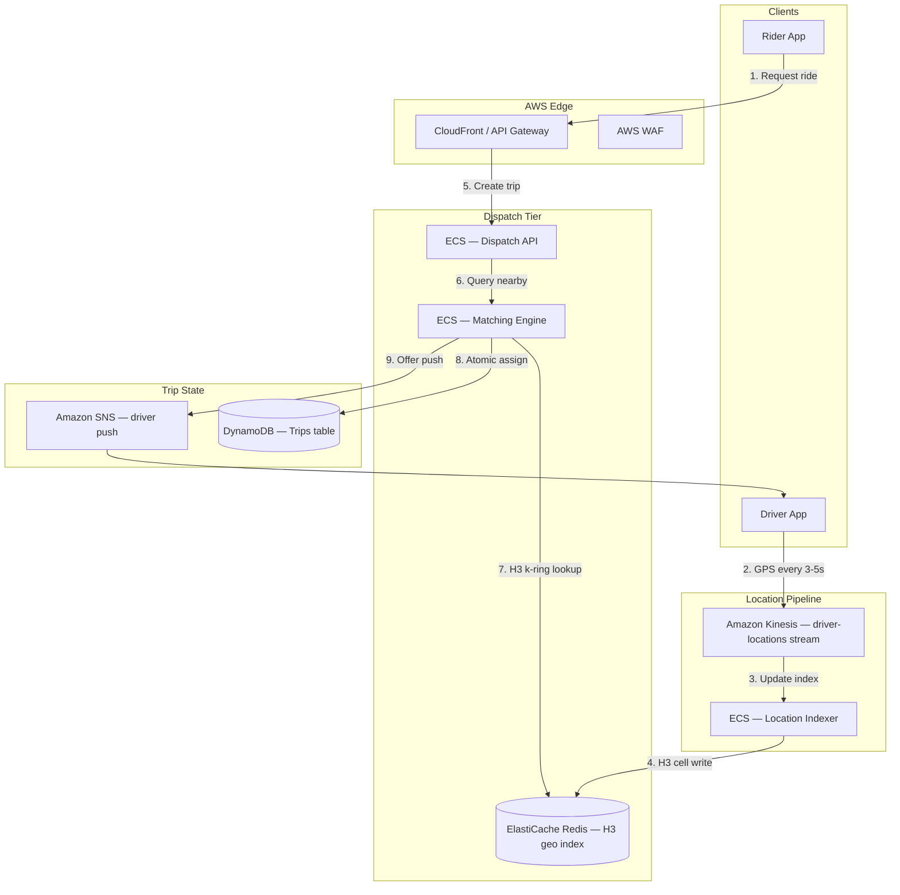

**Step-by-step flow:**

| Step | Action | Explanation |
|------|--------|-------------|
| **1** | Request ride | Rider submits pickup/dropoff via `POST /trips`. |
| **2** | GPS stream | Driver app sends location every 3–5s to Kinesis. |
| **3** | Update index | Location indexer consumes stream shards. |
| **4** | H3 cell write | Driver position stored in Redis keyed by H3 cell ID. |
| **5** | Create trip | Dispatch API creates trip in `REQUESTED` state. |
| **6** | Query nearby | Matching engine searches expanding H3 k-ring. |
| **7** | k-ring lookup | Redis returns available drivers in surrounding cells. |
| **8** | Atomic assign | Conditional write assigns driver — prevents double-booking. |
| **9** | Offer push | SNS sends trip offer to driver app. |

## 3. Step-by-Step Interview Answer (60 min)

### Minutes 0–8: Requirements

| Type | Detail |
|------|--------|
| **FR** | Request ride; match driver; track trip; complete payment |
| **NFR** | p99 match &lt; 30s; 99.9% availability; driver location freshness &lt; 5s |
| **Non-goals** | Global cross-city matching; autonomous routing; surge pricing (unless time permits) |

**Clarify:** One city scope; partition by city boundary for multi-region.

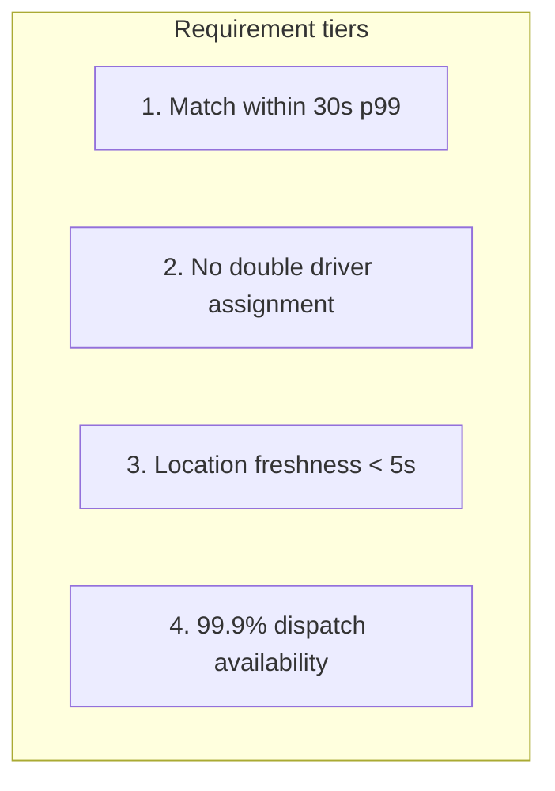

**Step-by-step flow:**

| Step | Action | Explanation |
|------|--------|-------------|
| **1** | Match SLO | p99 &lt; 30s from request to driver accept. |
| **2** | Atomic assign | Same driver never assigned to two active trips. |
| **3** | Location EL | Driver positions may be 1–2s stale — acceptable for matching. |
| **4** | Availability | Dispatch must survive AZ failure; city-boundary partition. |

### Minutes 8–20: High-level architecture

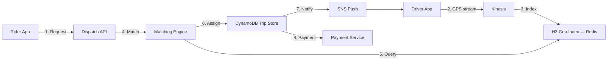

**Step-by-step flow:**

| Step | Action | Explanation |
|------|--------|-------------|
| **1** | Request | Rider creates trip with pickup coordinates. |
| **2** | GPS stream | Driver locations ingested continuously. |
| **3** | Index | H3 cell index updated in Redis. |
| **4** | Match | Matching engine scores candidates. |
| **5** | Query | Expanding k-ring search around rider pickup. |
| **6** | Assign | Atomic conditional write on trip + driver lock. |
| **7** | Notify | Push offer to top-ranked driver. |
| **8** | Payment | Trip completion triggers payment (out of scope for matching). |

**Component responsibilities:**

| Component | Responsibility | Consistency |
|-----------|----------------|-------------|
| **Location pipeline** | Ingest GPS → update geo index | **EL** — 1–2s staleness OK |
| **Geospatial index** | H3 cells; shard by city | **EL** — eventual |
| **Matching engine** | Score + rank drivers | Reads stale locations OK |
| **Trip store** | State machine + assignment | **EC** — conditional writes |
| **Notification** | Driver offer push | At-least-once |

### Minutes 20–40: Deep dives

**Geospatial — H3 indexing:**

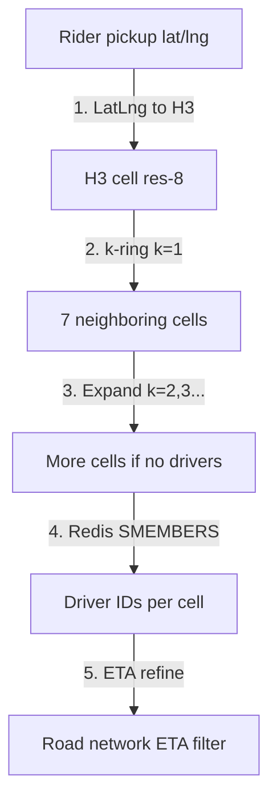

**Step-by-step flow:**

| Step | Action | Explanation |
|------|--------|-------------|
| **1** | LatLng to H3 | Convert pickup to H3 cell at resolution 8 (~0.5 km²). |
| **2** | k-ring k=1 | Search rider cell + 6 immediate neighbors. |
| **3** | Expand radius | If no available drivers, expand k-ring to k=2, 3… up to 30s timeout. |
| **4** | Redis lookup | `SMEMBERS h3:cell:{id}:drivers` — O(1) per cell. |
| **5** | ETA refine | Filter by road-network ETA (not straight-line distance). |

**Matching algorithm — sequential offer:**

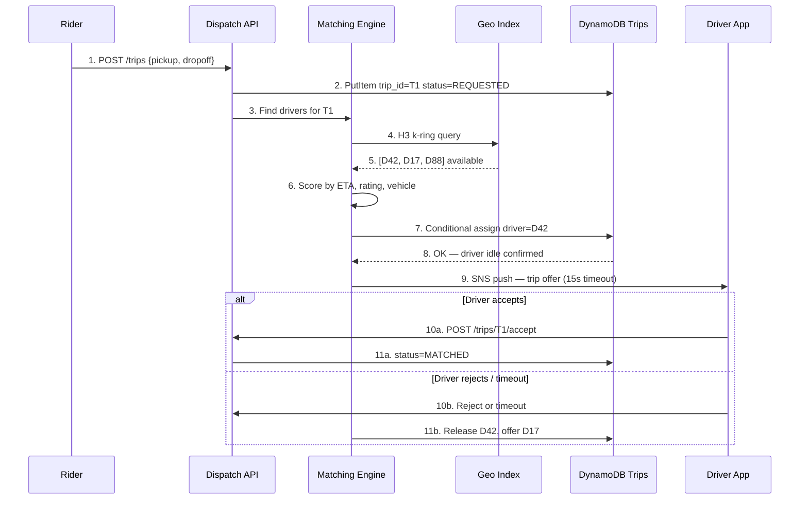

**Step-by-step flow:**

| Step | Action | Explanation |
|------|--------|-------------|
| **1** | POST /trips | Rider requests ride. |
| **2** | Create trip | Persist `REQUESTED` state in DynamoDB. |
| **3** | Find drivers | Matching engine invoked asynchronously or inline. |
| **4–5** | H3 query | Retrieve candidate driver IDs from geo index. |
| **6** | Score | Rank by ETA (60%), rating (25%), vehicle type (15%). |
| **7–8** | Conditional assign | `driver_status=idle` condition — atomic lock. |
| **9** | Push offer | Driver has 15s to accept. |
| **10a–11a** | Accept | Trip transitions to `MATCHED`. |
| **10b–11b** | Reject | Release driver; offer next candidate. |

**Atomic assignment — prevent double-booking:**

```python
# DynamoDB conditional write — trip assignment
dynamodb.update_item(
    TableName="Trips",
    Key={"trip_id": trip_id},
    UpdateExpression="SET driver_id = :d, #s = :matched, version = version + 1",
    ConditionExpression="attribute_not_exists(driver_id) AND #s = :requested",
    ExpressionAttributeNames={"#s": "status"},
    ExpressionAttributeValues={
        ":d": driver_id,
        ":matched": "MATCHED",
        ":requested": "REQUESTED",
    },
)

# Separate driver lock table
dynamodb.update_item(
    TableName="DriverLocks",
    Key={"driver_id": driver_id},
    UpdateExpression="SET trip_id = :t, locked_at = :now",
    ConditionExpression="attribute_not_exists(trip_id)",
    ExpressionAttributeValues={":t": trip_id, ":now": now()},
)
```

**Hot spots — airport surge:**

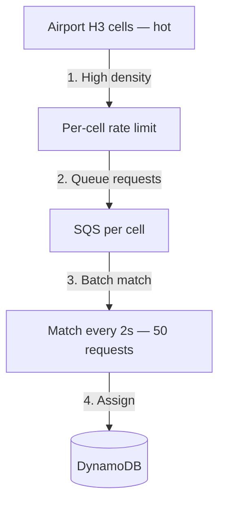

**Step-by-step flow:**

| Step | Action | Explanation |
|------|--------|-------------|
| **1** | High density | 500 concurrent requests in single H3 cell (airport). |
| **2** | Rate limit | Cap matching QPS per cell — prevent Redis overload. |
| **3** | Queue | Buffer requests in SQS; process in batches. |
| **4** | Batch match | Greedy or auction matching every 2s for efficiency. |

### Minutes 40–55: Scale numbers

| Metric | Estimate | Calculation |
|--------|----------|-------------|
| Location updates | 20K writes/s | 100K drivers ÷ 5s |
| Ride requests peak | ~85/s | 5K/min |
| Kinesis shards | 20+ | 20K records/s ÷ 1K/shard |
| Redis memory per city | ~500 MB | 100K drivers × 5 KB/driver state |
| DynamoDB trips | 1M trips/day | 2 KB × 1M ≈ 2 GB/day |
| Match latency target | p99 &lt; 30s | Expand k-ring until match or timeout |

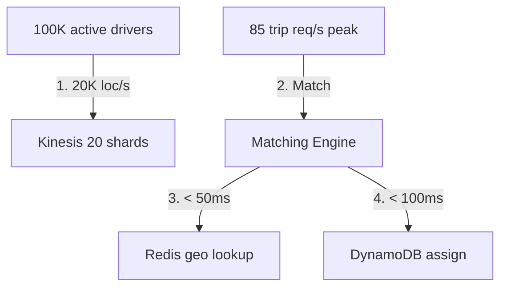

### Minutes 55–60: Evolution

| Phase | Scope | Key change |
|-------|-------|------------|
| **1** | Single city | Batch matching every 2s; polling geo index |
| **2** | Real-time | Kinesis stream; sequential offer; ML ETA |
| **3** | Multi-region | City-boundary partition; no cross-city matching |

---

## 4. Whiteboard Guide

1. **Left:** Rider + Driver apps
2. **Center-top:** Kinesis → Location indexer → Redis H3 index (label **EL**)
3. **Center-bottom:** Dispatch API → Matching engine → DynamoDB trips (label **EC**)
4. **Right:** SNS push to driver
5. Shade airport cell red — hot spot mitigation
6. Draw conditional write arrow on trip assignment

### AWS whiteboard layout

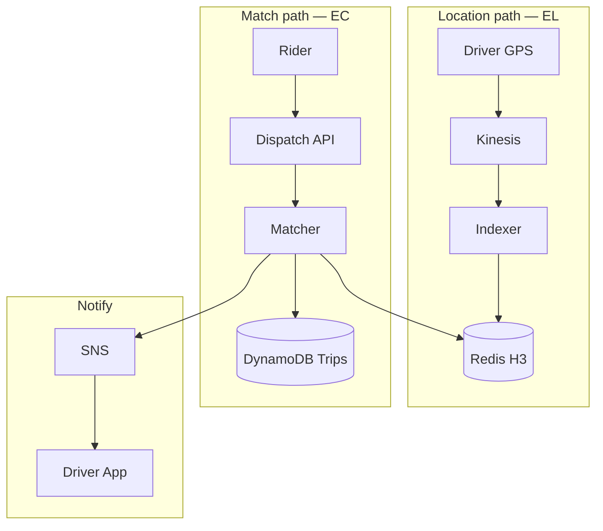

**Step-by-step flow:**

| Step | Action | Explanation |
|------|--------|-------------|
| **1** | Location path | High-volume EL writes to geo index. |
| **2** | Match path | EC assignment on trip + driver lock. |
| **3** | Notify | Push offer after successful assign. |

---

## 5. Principal-Level Signals

- **Atomic driver assignment** — conditional writes; never assign same driver twice
- **Separates location freshness (EL) from trip consistency (EC)** — PACELC framing
- **H3 vs quadtree** — H3 uniform cells; quadtree variable depth; H3 preferred at Uber scale
- **Hot-cell mitigation** — per-cell rate limit + batch matching at airports
- **Expanding radius** — k-ring search with 30s timeout; surge signal if no drivers
- **Sequential vs batch offer** — sequential simpler; batch auction better for dense hotspots

## 6. Red Flags

- Assign driver without conditional write — race condition double-booking
- Strong consistency on location index — unnecessary; kills throughput
- Global matching across cities — latency + complexity; partition by city
- Straight-line distance only — ignore road network ETA
- No driver release on reject/timeout — driver stuck "busy" forever

## 7. Follow-Up Questions

| Question | Strong answer |
|----------|---------------|
| Driver location stale 5s? | OK for matching — EL; trip assign uses EC lock at match time |
| Two riders same driver? | Conditional write on `DriverLocks` — second assign fails |
| Airport 500 requests/cell? | Per-cell SQS queue + batch auction every 2s |
| H3 resolution? | res-8 for city blocks (~460m edge); res-9 for dense urban |
| Driver goes offline mid-offer? | Offer timeout 15s → release lock → next candidate |

## 8. Related Study

- [Ride-Sharing Platform](/docs/system-design/ride-sharing-platform)
- [PACELC — Uber scenario](/docs/consistency/pacelc)
- [Eventual Consistency](/docs/consistency/eventual-consistency)

## 9. Practice Drill

60-minute timed whiteboard with numbered steps 1–9 on match sequence. Self-score: requirements (10), diagram (15), deep dive (20), failures (10), numbers (5).

---

## 10. Production High-Level Design

### 10.1 Architecture diagram index

| Section | Topic |
|---------|-------|
| [§2](#aws-deployment-context) | End-to-end AWS deployment |
| [§3](#minutes-820-high-level-architecture) | Core component flow |
| [§10.2](#102-system-context-c4-level-1) | C4 logical context |
| [§10.3](#103-aws-production-architecture) | Full VPC stack |
| [§10.4](#104-trip-state-machine) | Trip lifecycle states |
| [§11.4](#114-match-handler--step-by-step) | Match sequence |
| [§11.5](#115-location-indexer) | Kinesis → Redis pipeline |
| [§12](#12-hadr-and-city-partitioning) | Multi-AZ + city boundaries |
| [§13](#13-observability-and-operations) | Metrics and alerts |
| [§14](#14-implementation-roadmap) | 8-week rollout |
| [§15](#15-testing-strategy) | Load + race condition tests |
| [§16](#16-architecture-review-checklist) | Production readiness |

### 10.2 System context (C4 Level 1)

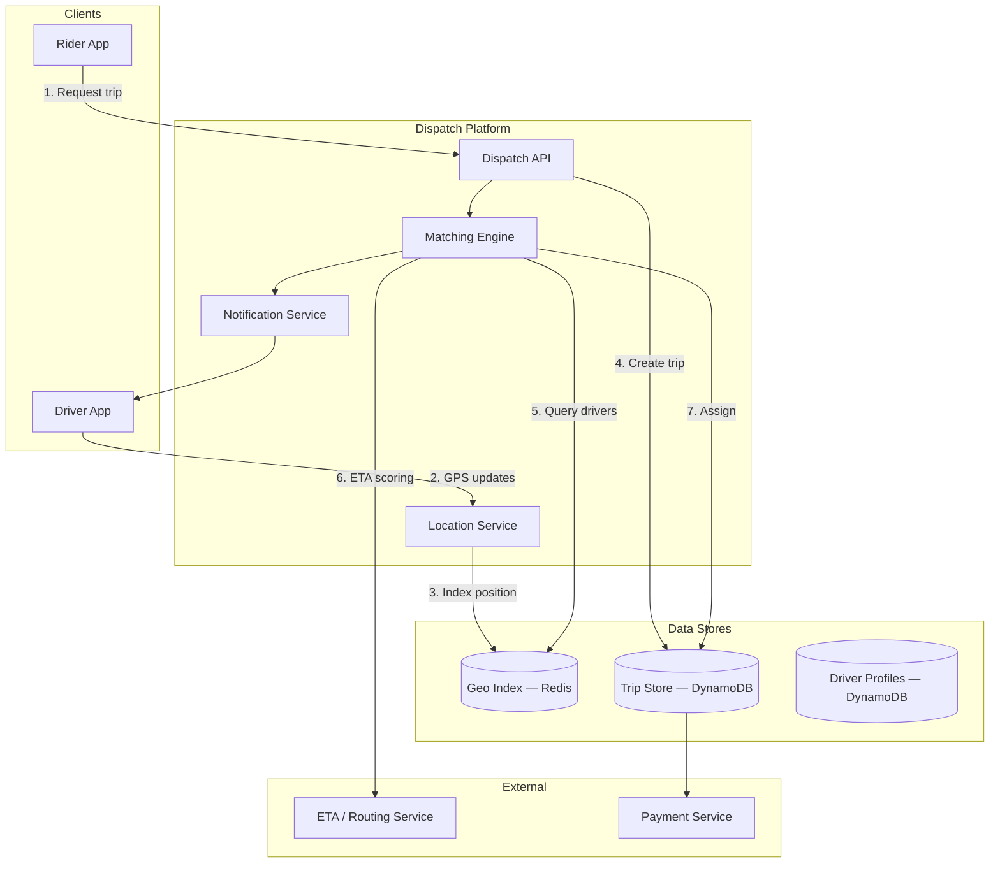

**Step-by-step flow:**

| Step | Action | Explanation |
|------|--------|-------------|
| **1** | Request trip | Rider submits pickup/dropoff. |
| **2** | GPS updates | Driver stream at 3–5s interval. |
| **3** | Index position | Update H3 cell membership in Redis. |
| **4** | Create trip | Persist `REQUESTED` in trip store. |
| **5** | Query drivers | k-ring search in geo index. |
| **6** | ETA scoring | Road-network ETA for top candidates. |
| **7** | Assign | Atomic write; push notification. |

### 10.3 AWS production architecture

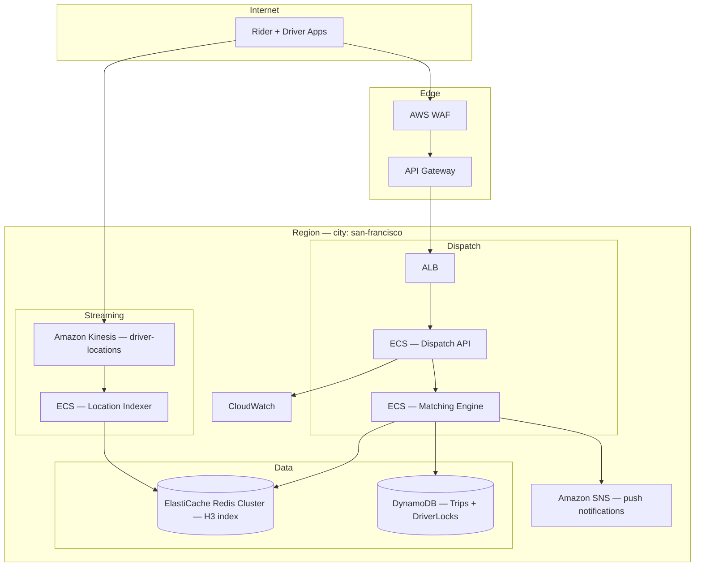

**Step-by-step flow:**

| Step | Action | Explanation |
|------|--------|-------------|
| **1** | API ingress | WAF + API Gateway → ALB → Dispatch API. |
| **2** | Location stream | Driver GPS → Kinesis (partitioned by `driver_id`). |
| **3** | Index update | Location indexer writes to Redis H3 cells. |
| **4** | Match flow | Matcher queries Redis, assigns in DynamoDB. |
| **5** | Push | SNS delivers offer to driver device endpoint. |

| AWS component | Responsibility |
|---------------|----------------|
| **Kinesis** | Durable location stream; 20+ shards at 20K/s |
| **ElastiCache Redis** | H3 cell → driver set; sub-ms lookups |
| **DynamoDB** | Trip state machine; conditional assignment |
| **ECS Fargate** | Stateless dispatch + matcher; auto-scale on queue depth |
| **SNS** | Mobile push for trip offers |
| **CloudWatch** | `match_latency_p99`, `unmatched_trips`, `driver_lock_conflicts` |

### 10.4 Trip state machine

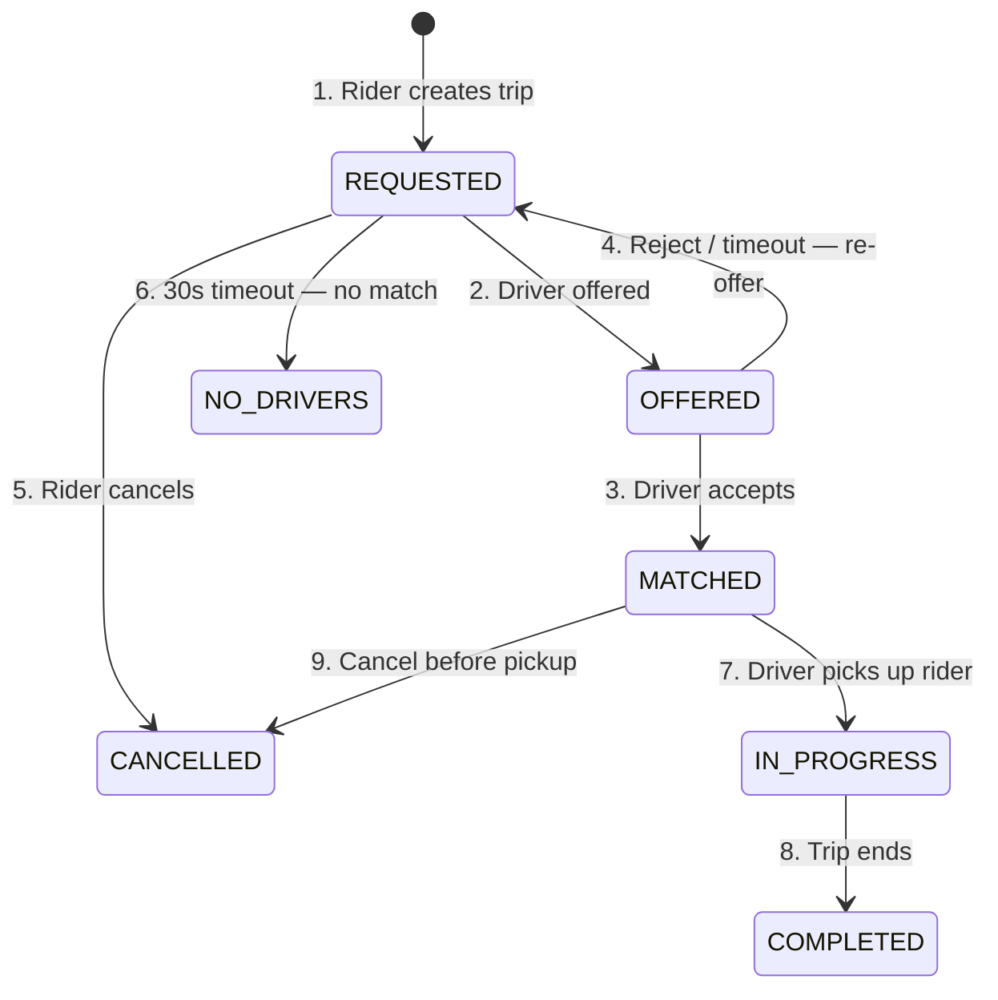

**Step-by-step flow:**

| Step | Action | Explanation |
|------|--------|-------------|
| **1** | REQUESTED | Trip created; matching begins. |
| **2** | OFFERED | Driver received push; 15s to respond. |
| **3** | MATCHED | Driver accepted; rider notified. |
| **4** | Re-offer | Release driver lock; try next candidate. |
| **5–6** | Terminal | Cancel or no drivers found. |
| **7–8** | Active trip | Pickup → dropoff → payment. |

---

## 11. Production Low-Level Design

### 11.1 API contract

**Endpoint:** `POST /v1/trips`

```json
{
  "rider_id": "R123",
  "pickup": {"lat": 37.7749, "lng": -122.4194},
  "dropoff": {"lat": 37.7849, "lng": -122.4094},
  "vehicle_type": "uberx",
  "idempotency_key": "req_8f3a"
}
```

**Response:**

```json
{
  "trip_id": "T991",
  "status": "REQUESTED",
  "estimated_match_seconds": 15
}
```

| HTTP | Meaning |
|------|---------|
| `201` | Trip created; matching in progress |
| `200` | Idempotency hit — same trip returned |
| `503` | Dispatch overloaded — retry with same key |

### 11.2 DynamoDB schema

**Table: Trips**

```json
{
  "trip_id": "T991",
  "rider_id": "R123",
  "driver_id": null,
  "status": "REQUESTED",
  "pickup_h3": "8828308281fffff",
  "pickup": {"lat": 37.7749, "lng": -122.4194},
  "dropoff": {"lat": 37.7849, "lng": -122.4094},
  "vehicle_type": "uberx",
  "version": 1,
  "created_at": "2026-07-28T21:00:00Z",
  "city": "san-francisco"
}
```

**Table: DriverLocks**

```json
{
  "driver_id": "D42",
  "trip_id": "T991",
  "locked_at": "2026-07-28T21:00:05Z",
  "ttl": 1735689600
}
```

**GSI: `city-status-index`** — query active trips per city for ops dashboard.

### 11.3 Redis geo index structure

```
# Driver in H3 cell
SADD h3:8828308281fffff:drivers D42 D17

# Driver metadata (hash)
HSET driver:D42 lat 37.7750 lng -122.4190 status idle vehicle uberx rating 4.9 updated_at 1735689600

# On location update: remove from old cell, add to new cell
SREM h3:{old_cell}:drivers D42
SADD h3:{new_cell}:drivers D42
HSET driver:D42 lat ... lng ... updated_at ...
```

### 11.4 Match handler — step-by-step

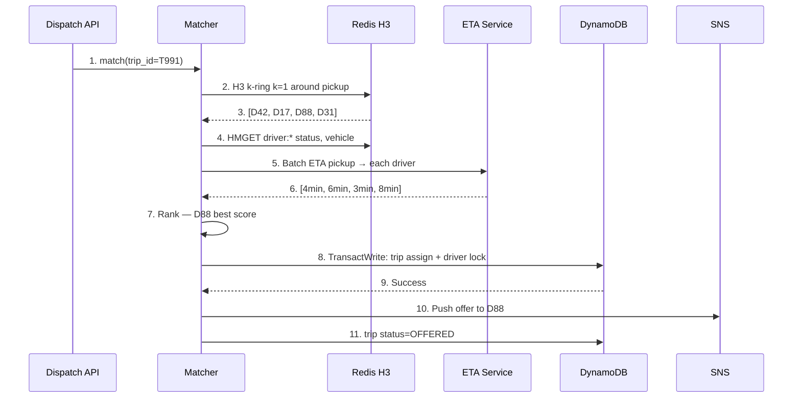

**Step-by-step flow:**

| Step | Action | Explanation |
|------|--------|-------------|
| **1** | match() | Matcher invoked for trip T991. |
| **2–3** | k-ring | Query Redis for drivers in nearby H3 cells. |
| **4** | Filter | Remove busy/offline drivers. |
| **5–6** | ETA batch | Road-network ETA for remaining candidates. |
| **7** | Rank | Score: 60% ETA + 25% rating + 15% vehicle match. |
| **8–9** | TransactWrite | Atomic trip assign + driver lock in DynamoDB. |
| **10** | Push | SNS notification to driver D88. |
| **11** | OFFERED | Update trip status; start 15s accept timer. |

**TransactWriteItems (atomic assign):**

```python
dynamodb.transact_write_items(TransactItems=[
    {
        "Update": {
            "TableName": "Trips",
            "Key": {"trip_id": trip_id},
            "UpdateExpression": "SET driver_id=:d, #s=:offered, version=version+1",
            "ConditionExpression": "#s = :requested AND attribute_not_exists(driver_id)",
            "ExpressionAttributeNames": {"#s": "status"},
            "ExpressionAttributeValues": {":d": driver_id, ":offered": "OFFERED", ":requested": "REQUESTED"},
        }
    },
    {
        "Update": {
            "TableName": "DriverLocks",
            "Key": {"driver_id": driver_id},
            "UpdateExpression": "SET trip_id=:t, locked_at=:now",
            "ConditionExpression": "attribute_not_exists(trip_id)",
            "ExpressionAttributeValues": {":t": trip_id, ":now": now()},
        }
    },
])
```

### 11.5 Location indexer

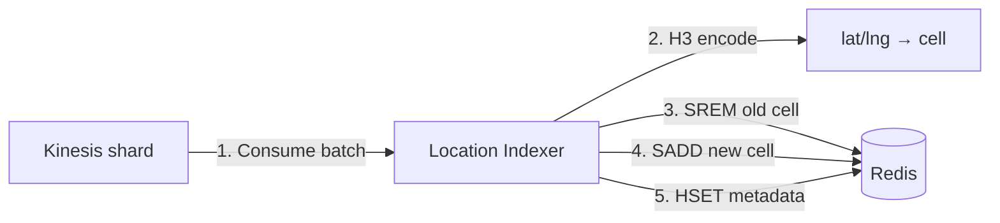

**Step-by-step flow:**

| Step | Action | Explanation |
|------|--------|-------------|
| **1** | Consume batch | Read up to 500 records per Kinesis poll. |
| **2** | H3 encode | Convert lat/lng to H3 cell at resolution 8. |
| **3** | SREM old | Remove driver from previous cell (if cell changed). |
| **4** | SADD new | Add driver to current cell set. |
| **5** | HSET metadata | Update lat, lng, `updated_at` for ETA queries. |

| Parameter | Value |
|-----------|-------|
| Kinesis retention | 24 hours |
| Indexer batch size | 500 records |
| Driver TTL in Redis | 30s without update → remove from index |
| H3 resolution | 8 (city), 9 (dense urban) |

### 11.6 Driver offer timeout handler

```python
def on_offer_timeout(trip_id: str, driver_id: str):
    # Step 1: Release driver lock
    dynamodb.delete_item(
        TableName="DriverLocks",
        Key={"driver_id": driver_id},
        ConditionExpression="trip_id = :t",
        ExpressionAttributeValues={":t": trip_id},
    )
    # Step 2: Reset trip to REQUESTED
    dynamodb.update_item(
        TableName="Trips",
        Key={"trip_id": trip_id},
        UpdateExpression="SET #s = :requested REMOVE driver_id",
        ConditionExpression="#s = :offered",
        ExpressionAttributeNames={"#s": "status"},
        ExpressionAttributeValues={":requested": "REQUESTED", ":offered": "OFFERED"},
    )
    # Step 3: Re-match with excluded driver
    match_engine.match(trip_id, exclude=[driver_id])
```

---

## 12. HA/DR and City Partitioning

```mermaid
flowchart TB
    subgraph US["United States"]
        SF[san-francisco region]
        NYC[new-york region]
        LA[los-angeles region]
    end

    Rider_SF[Rider in SF] --> SF
    Rider_NYC[Rider in NYC] --> NYC
    Note over SF,NYC: No cross-city matching — city is partition boundary
```

| Principle | Implementation |
|-----------|----------------|
| **City partition** | Each city = separate Redis cluster + DynamoDB table prefix |
| **Multi-AZ** | ECS + Redis cluster + DynamoDB global tables optional |
| **Failover** | Route 53 health check; shift traffic to standby AZ |
| **No cross-city** | Rider in SF never matched to driver in NYC |

---

## 13. Observability and Operations

| Metric | Alert threshold |
|--------|-----------------|
| `match_latency_p99` | &gt; 30s |
| `unmatched_trips_rate` | &gt; 5% for 5 min |
| `driver_lock_conflict_rate` | Spike — race condition indicator |
| `kinesis_iterator_age_ms` | &gt; 5000 — location index stale |
| `redis_cell_driver_count` max | &gt; 200 per cell — hot spot |
| `offer_accept_rate` | &lt; 60% — driver supply issue |

**Structured log:**

```json
{
  "trip_id": "T991",
  "event": "driver_assigned",
  "driver_id": "D88",
  "h3_cell": "8828308281fffff",
  "k_ring": 2,
  "candidates_evaluated": 12,
  "match_latency_ms": 1240,
  "eta_seconds": 180
}
```

---

## 14. Implementation Roadmap (8-Week Rollout)

| Week | Deliverable |
|------|-------------|
| 1 | Trip API + DynamoDB schema + state machine |
| 2 | Kinesis location stream + Redis H3 indexer |
| 3 | Matching engine — k-ring + sequential offer |
| 4 | TransactWrite assign + driver lock |
| 5 | SNS push + offer timeout handler |
| 6 | Hot-cell rate limiting (airport POC) |
| 7 | Load test 85 req/s + 20K loc/s |
| 8 | Multi-AZ hardening + dashboards |

---

## 15. Testing Strategy

| Test | Pass criteria |
|------|---------------|
| Concurrent assign same driver | Exactly one succeeds — TransactWrite |
| Offer timeout | Driver lock released; re-match triggered |
| k-ring expand | Match found within 30s in sparse area |
| Hot cell 500 req | Rate limit engages; no Redis timeout |
| Location stale 5s | Match still succeeds with EL positions |
| Idempotent trip create | Same key → same `trip_id` |

---

## 16. Architecture Review Checklist

| # | Gate | Status |
|---|------|--------|
| 1 | Trip assignment uses TransactWrite or conditional writes | ☐ |
| 2 | Driver lock table with TTL for orphaned locks | ☐ |
| 3 | Location index EL — not blocking on strong consistency | ☐ |
| 4 | H3 k-ring expand with 30s timeout | ☐ |
| 5 | Offer timeout releases driver + re-matches | ☐ |
| 6 | Hot-cell rate limiting for airport/event cells | ☐ |
| 7 | City-boundary partition — no cross-city matching | ☐ |
| 8 | `match_latency_p99` dashboard + alert | ☐ |
| 9 | Load test at 85 req/s + 20K loc/s | ☐ |
| 10 | Race condition integration test in CI | ☐ |

---

## 17. Related Study

- [Ride-Sharing Platform](/docs/system-design/ride-sharing-platform)
- [PACELC — Uber ride matching](/docs/consistency/pacelc)
- [Eventual Consistency](/docs/consistency/eventual-consistency)
- [Idempotency](/docs/distributed-systems-foundations/idempotency)
