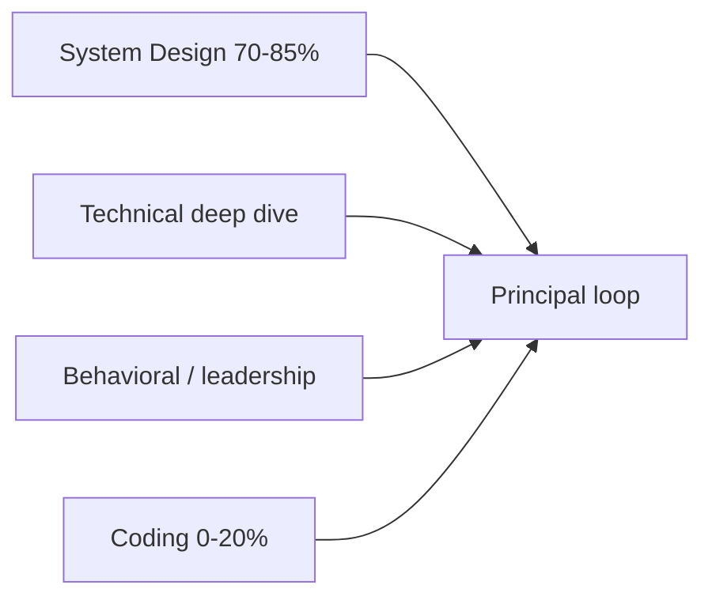

# Coding Preparation Overview

Principal Architect interviews are **not** LeetCode marathons — but they are **not coding-free**. Some companies (notably Google) still include 1–2 coding or design+coding hybrid rounds at L7+. Others replace coding with architecture deep dives. **Always confirm with your recruiter.**

This domain covers **what to expect**, **what to practice**, and **how much time to invest** so coding does not become a surprise gap in your loop.

*Figure: Typical principal loop composition — coding is optional but non-zero at some companies.*

## Who Needs This Module

| Situation | Action |
|-----------|--------|
| Amazon / AWS / most enterprise architect loops | Light maintenance — design-adjacent pseudo-code only |
| Google L7+ (coding confirmed) | Dedicated 2–4 week coding maintenance block |
| Platform / infra principal with live pairing | Medium depth — scripts, concurrency, debugging |
| Distinguished / pure architecture IC | Minimal — stay fluent, do not over-index |

## Chapters

| Topic | Guide |
|-------|-------|
| What panels test at L7+ | [Principal-Level Coding Expectations](/docs/coding-preparation/principal-level-expectations) |
| High-yield problems | [Design-Adjacent Problems](/docs/coding-preparation/design-adjacent-problems) |
| Weekly routine | [Practice Routine](/docs/coding-preparation/practice-routine) |
| Timed mock | [Coding Mock Interview](/docs/coding-preparation/coding-mock-interview) |

## How Coding Fits the Knowledge System

| Layer | Location | Role |
|-------|----------|------|
| **Theory** | [Computer Architecture](/docs/computer-architecture/overview), [OS](/docs/operating-systems/overview) | Complexity, concurrency, memory |
| **Distributed patterns** | [Idempotency](/docs/distributed-systems-foundations/idempotency), [Distributed Caching](/docs/caching/distributed-caching) | Rate limiters, consistent hashing |
| **Hands-on** | [All 17 labs](/docs/start-here/curriculum-overview#hands-on-labs) — start with [Lab 008](/docs/distributed-systems-foundations/idempotency#25-hands-on-exercise) and [Lab 011](/docs/system-design/distributed-rate-limiter#25-hands-on-exercise) | Implement before whiteboarding |
| **System design** | [System Design](/docs/system-design/overview) | Many "coding" rounds are design + pseudo-code |
| **Company guides** | [Google](/docs/company-specific-preparation/google), [Amazon/AWS](/docs/company-specific-preparation/amazon-aws) | Loop-specific coding expectations |

## Recommended Time Allocation

For a 12-week sprint with **active applications**:

| Priority | % of study time | Focus |
|----------|-----------------|-------|
| System design + scenarios | 50–60% | [12-Week Sprint](/docs/start-here/12-week-learning-path) |
| Distributed systems depth | 20–25% | Consensus, consistency, failure |
| Leadership + behavioral | 10–15% | STAR stories, ADRs |
| **Coding maintenance** | **5–15%** | This domain — only increase if recruiter confirms coding rounds |

## Quick Start

1. Read [Principal-Level Coding Expectations](/docs/coding-preparation/principal-level-expectations).
2. Ask your recruiter: *"Are there dedicated coding rounds for this principal loop?"*
3. If yes → follow [Practice Routine](/docs/coding-preparation/practice-routine) for 2–4 weeks.
4. Complete one [Coding Mock Interview](/docs/coding-preparation/coding-mock-interview) before the onsite.
5. Map problems to labs — implement a rate limiter and idempotent API handler in your language of choice.

## Related

- [Interview Readiness](/docs/start-here/interview-readiness)
- [Mock Interviews](/docs/mock-interviews/overview)
- [Real-World Interview Prep](/docs/start-here/real-world-interview-prep)
