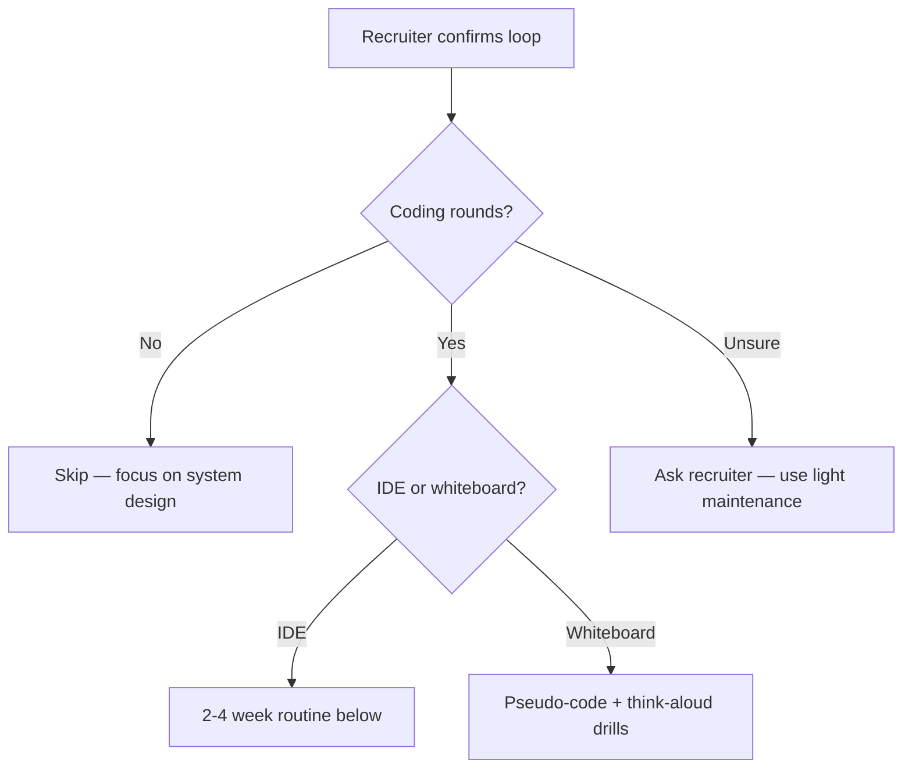

# Coding Practice Routine

Use this routine **only when your recruiter confirms coding rounds** — or as **light maintenance** (1–2 hours/week) during any principal prep cycle.

## Decision Tree



## Light Maintenance (1–2 hrs/week)

For loops **without** dedicated coding (Amazon, most AWS, many enterprise):

| Activity | Time | Details |
|----------|------|---------|
| One design-adjacent problem | 45 min | From [problem bank](/docs/coding-preparation/design-adjacent-problems) — explain aloud |
| One lab exercise | 30 min | Rate limiter or idempotent API |
| Review one code snippet | 15 min | Find bugs in retry/lock sample |

## Intensive Block (2–4 weeks, Google-style)

**When:** Recruiter confirms 1–2 coding rounds.

| Week | Focus | Problems / activities |
|------|-------|----------------------|
| **1** | Foundations refresh | Rate limiter, LRU, idempotent handler — implement in lab |
| **2** | Medium algorithms | 3 problems: array/hash, tree/BFS, heap — **medium** only |
| **3** | Hybrids | Design+coding: autocomplete, consistent hash, merge K streams |
| **4** | Mocks | 2× [Coding Mock Interview](/docs/coding-preparation/coding-mock-interview); taper |

**Volume:** 3 problems per week maximum — quality and explanation over quantity.

## Weekly Schedule (fits 12-week sprint)

Integrate with [Weekly Study Routine](/docs/start-here/weekly-study-routine):

| Day | Coding activity (if applicable) |
|-----|--------------------------------|
| **Tuesday** | Replace generic algorithms with one [design-adjacent problem](/docs/coding-preparation/design-adjacent-problems) |
| **Thursday** | Lab: [008](/docs/distributed-systems-foundations/idempotency#25-hands-on-exercise) or [011](/docs/system-design/distributed-rate-limiter#25-hands-on-exercise) |
| **Friday** | 30 min timed pseudo-code (one problem, think aloud) |
| **Sunday** | Optional: one LeetCode **medium** if Google coding confirmed |

## 12-Week Sprint Integration

| Weeks | Coding focus |
|-------|----------------|
| 1–7 | **None** — distributed systems and design priority |
| 8–9 | **Coding maintenance** — 3 medium problems/week if coding expected |
| 10–11 | One coding mock + review weak patterns |
| 12 | Taper — cheat sheet review only |

See [12-Week Learning Path](/docs/start-here/12-week-learning-path).

## Language Choice

- Use the language **listed on the job description** or confirm with recruiter
- Python is acceptable at most companies for architecture roles
- If IDE round: know standard library for collections, heaps, hashing
- Consistency matters more than language novelty

## Tracking

Update `progress/skills-matrix.yaml` with a `coding_interview` topic when you add it, or note completion in `progress/completed-topics.yaml`:

```yaml
completed:
  - coding-preparation/design-adjacent-problems
  - coding-preparation/coding-mock-interview
```

## Resources (External)

Use sparingly — prefer this portal's problem bank and labs:

- [LeetCode](https://leetcode.com/) — medium problems only; tags: heap, hash table, tree BFS
- NeetCode / Blind 75 — optional shortcut list
- **Do not** spend 40+ hours on hard DP unless recruiter explicitly tests it

## Success Criteria

Before your onsite (if coding confirmed):

- [ ] Can implement rate limiter + idempotent handler in 25 minutes each
- [ ] Can state time/space complexity without hesitation
- [ ] Can name 3 edge cases per problem before coding
- [ ] Completed at least one timed coding mock with peer feedback
- [ ] Read target [company guide](/docs/company-specific-preparation/overview) coding section

## Related

- [Principal-Level Coding Expectations](/docs/coding-preparation/principal-level-expectations)
- [Interview Readiness](/docs/start-here/interview-readiness)
- [Mock Interviews](/docs/mock-interviews/overview)
