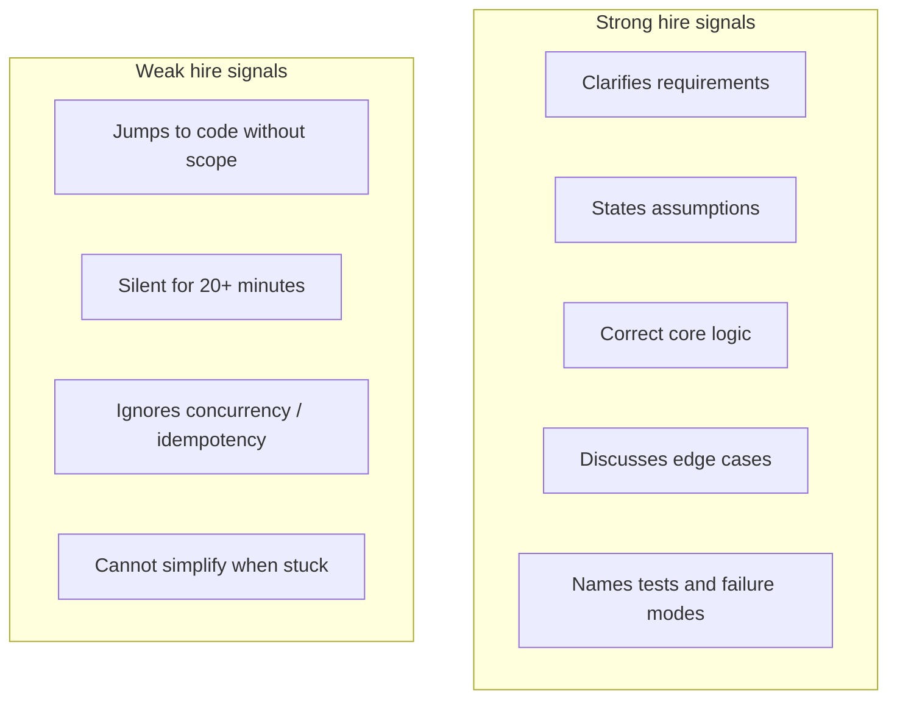

# Principal-Level Coding Expectations

At **Principal (L7)**, **Senior Principal (L8)**, and **Distinguished Engineer** levels, interviewers evaluate whether you can **still think precisely about code** when architecture decisions depend on it — not whether you win competitive programming contests.

## What Changes vs Senior Engineer Loops

| Dimension | Senior (L5–L6) | Principal (L7+) |
|-----------|----------------|-----------------|
| **Primary signal** | Correctness + optimal complexity | Judgment + clarity + production awareness |
| **Problem type** | Classic algorithms (trees, graphs, DP) | Design-adjacent, concurrency, API logic |
| **Format** | 45 min IDE or whiteboard | Often pseudo-code; may be waived entirely |
| **Follow-ups** | Optimize time/space | Failure modes, testing, operability |
| **Bar** | Solve medium/hard | Explain tradeoffs while coding critical path |

## Round Types You May See

### 1. Classic algorithms (less common at L7+)

- Medium LeetCode-style problems
- **More likely at Google** if coding is not waived — confirm with recruiter
- Expect **clean code** and **verbal reasoning**, not just AC

### 2. Design + code hybrid (common)

Interviewer gives a system-design prompt and asks you to implement **one critical component**:

- Rate limiter (token bucket / sliding window)
- LRU cache with TTL
- Idempotency key store lookup
- Consistent hashing ring
- Autocomplete trie + top-K
- Job queue with at-least-once semantics

**Signal:** Can you translate architecture into correct, testable logic?

### 3. Pseudo-code / whiteboard only

- No runnable environment
- Focus on **correctness of state transitions**
- Example: leader election sketch, two-phase commit coordinator

### 4. Code reading and critique

- "What's wrong with this distributed lock?"
- "How would you fix this retry loop?"
- Tests **production judgment**, not greenfield coding speed

### 5. Domain-specific hands-on (role-dependent)

| Role / company | Example |
|----------------|---------|
| Snowflake / Databricks | SQL plan analysis, partition pruning |
| NVIDIA | Memory hierarchy, kernel launch patterns (conceptual) |
| Microsoft | OAuth/OIDC flow whiteboard |
| Platform architect | K8s operator logic, Terraform patterns |

## Company Patterns (Summary)

| Company | Coding at principal level? | Notes |
|---------|---------------------------|-------|
| **Google** | Sometimes 1–2 rounds | May be omitted for very senior IC — **confirm** |
| **Amazon / AWS** | Uncommon | System design + project deep dive + LPs |
| **Microsoft** | Low–medium | Identity / API flows; architecture-heavy |
| **Meta** | Varies by org | System design dominates |
| **NVIDIA** | Optional whiteboard | GPU / perf architecture |
| **Snowflake / Databricks** | SQL / engine whiteboards | Not LeetCode |
| **OpenAI / Anthropic** | ML systems focus | Routing, batching — not graph DP |

See full guides: [Company-Specific Preparation](/docs/company-specific-preparation/overview).

## What Interviewers Score

| Dimension | Principal bar |
|-----------|---------------|
| **Problem decomposition** | Break into testable functions; name invariants |
| **Correctness** | Core path works; acknowledges edge cases |
| **Complexity** | States Big-O; knows when it matters |
| **Production sense** | Timeouts, retries, observability hooks |
| **Communication** | Think aloud; invite interviewer input |

## What to Ask Your Recruiter

Before investing weeks in LeetCode:

1. "Are there **dedicated coding/algorithms** rounds for this principal loop?"
2. "Is it **whiteboard pseudo-code** or **live IDE**?"
3. "For L7+, are coding rounds **waived** or replaced with design?"
4. "Any **hands-on** component (SQL, infra, pairing)?"
5. "Which **language** should I use?"

Document answers in your interview prep notes.

## What You Do *Not* Need

- 500+ LeetCode problems
- Red-black tree implementation from memory
- Competitive programming tricks
- Perfect syntax without any hints

## What You *Do* Need

- Fluency on **10–15 design-adjacent problems** (see [Design-Adjacent Problems](/docs/coding-preparation/design-adjacent-problems))
- Ability to write **idempotent handler** pseudo-code in 15 minutes
- Comfort explaining **concurrency basics** (locks, races, deadlocks)
- One **lab implementation** each for rate limiter and idempotent API ([Lab 011](/docs/system-design/distributed-rate-limiter#25-hands-on-exercise), [Lab 008](/docs/distributed-systems-foundations/idempotency#25-hands-on-exercise))

## Knowledge Checks

1. Why might Google include coding at L7 but Amazon often does not?
2. What is the difference between a coding round and a design+coding hybrid?
3. Name three production edge cases for a rate limiter implementation.
4. When should you push back on spending 80% of prep time on LeetCode?

**Answers (outline):** (1) Culture and bar calibration — Google values code readability across all levels; Amazon weights LP + design + ownership. (2) Hybrid scopes the problem to one component with system context. (3) Clock skew across nodes, burst vs sustained, per-tenant fairness, Redis failure. (4) When recruiter confirms no coding rounds and timeline is short — redirect to system design.

## Related Chapters

- [Design-Adjacent Problems](/docs/coding-preparation/design-adjacent-problems)
- [Practice Routine](/docs/coding-preparation/practice-routine)
- [Google Interview Preparation](/docs/company-specific-preparation/google)
