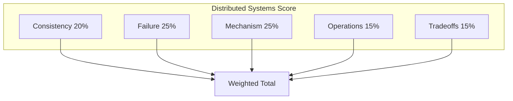

# Distributed Systems Deep-Dive Scoring Rubric

Scoring framework for **45–60 minute distributed systems depth interviews**—distinct from broad system design. Evaluates **mechanism correctness**, **safety and liveness reasoning**, **partition behavior**, and **operational recovery**.

## When to Use

- Consensus, replication, and consistency mock sessions
- Infrastructure/platform principal loops (Google, AWS, Snowflake, NVIDIA)
- Homework calibration after weak distributed-systems mock

**Related resources:** [Distributed Systems Mock](/docs/mock-interviews/distributed-systems-mock), [Mock Interview Rubric](/docs/mock-interviews/mock-interview-rubric), question banks in `interview/question-bank/`

---

## Universal Scale

| Score | Label | Hiring analog |
|-------|---------|---------------|
| 4 | Strong | Strong Hire |
| 3 | Good | Hire |
| 2 | Adequate | Lean Hire / Lean No Hire |
| 1 | Weak | No Hire |

**Principal pass bar:** Weighted average ≥ **3.0** with **no dimension below 2** in Consistency Model, Failure Handling, or Mechanism.

---

## Dimensions and Weights

| Dimension | Weight | What interviewers observe |
|-----------|--------|---------------------------|
| Consistency model & guarantees | 20% | Names guarantee; distinguishes safety vs liveness; PACELC reasoning |
| Failure handling & partitions | 25% | Partial failure as norm; partition behavior explicit |
| Mechanism & algorithm depth | 25% | Correct protocol steps; quorum math; edge cases |
| Operations & recovery | 15% | Detection, tooling, runbooks, metrics |
| Tradeoffs & alternatives | 15% | Rejected options with criteria; cost and complexity |



---

## Dimension Anchors

### 1. Consistency model & guarantees (20%)

| Score | Anchors |
|-------|---------|
| **4** | Precisely names guarantee (e.g., linearizability, sequential, causal, eventual); separates **safety** (nothing bad) from **liveness** (something good eventually); applies PACELC (latency vs consistency under normal conditions) |
| **3** | Correct high-level model; minor imprecision on formal definitions |
| **2** | Confuses CAP slogan with design; uses "strong" without definition |
| **1** | Claims ACID everywhere; no consistency discussion |

**Principal signals:** Maps guarantee to **client-visible behavior** and **business risk** (financial ledger vs social feed).

**Red flags:** "We pick CP" without defining operation set; ignores session guarantees.

---

### 2. Failure handling & partitions (25%)

| Score | Anchors |
|-------|---------|
| **4** | Models async network; crash-stop vs Byzantine when relevant; partition: who progresses, who stalls, what clients observe; split-brain prevention; stale read handling |
| **3** | Covers node crash and partition at high level |
| **2** | Assumes reliable network or instant failure detection |
| **1** | "Replicas handle it" with no quorum or fencing story |

**Principal signals:** Discusses **gray failures**, cascading timeouts, and operator-induced failures.

**Follow-up probes:** "Leader isolated from majority—what happens?" "Client retries after timeout—duplicate writes?"

---

### 3. Mechanism & algorithm depth (25%)

| Score | Anchors |
|-------|---------|
| **4** | Verbalizes correct steps (Raft election, Paxos phases, 2PC, quorum R/W); handles edge cases (membership change, log compaction, clock uncertainty); math correct (N, F, quorum size) |
| **3** | Mostly correct mechanism; small gaps under pressure |
| **2** | Hand-waves; confuses algorithms (e.g., Raft vs Multi-Paxos roles) |
| **1** | Cannot explain chosen protocol |

**Principal signals:** Distinguishes **formal guarantee** from **production implementation** (e.g., etcd vs textbook Raft).

---

### 4. Operations & recovery (15%)

| Score | Anchors |
|-------|---------|
| **4** | Failure detection (heartbeats, φ-accrual); metrics (lag, election rate); runbooks for recovery; tooling (etcdctl, zkCli); rollout of protocol changes |
| **3** | Basic monitoring and manual recovery |
| **2** | "SSH and fix" without detection story |
| **1** | No operational path |

**Principal signals:** On-call impact; change management for consensus cluster upgrades.

---

### 5. Tradeoffs & alternatives (15%)

| Score | Anchors |
|-------|---------|
| **4** | Compares ≥2 approaches (Paxos vs Raft, strong vs eventual, sync vs async replication); criteria: latency, availability, complexity, team expertise |
| **3** | One alternative with reasonable rejection |
| **2** | Single solution only |
| **1** | Technology religion without criteria |

**Principal signals:** Build vs buy for coordination service; managed vs self-hosted tradeoffs.

---

## Session Structure

| Phase | Minutes | Activity |
|-------|---------|----------|
| Warm-up | 5 | Define 2 terms (e.g., linearizability, quorum) |
| Main prompt | 35 | Mechanism walkthrough with diagram |
| Failure injection | 15 | Partition, crash, delay, clock skew |
| Ops wrap | 5 | Monitoring, recovery, rollout |

---

## Failure Injection Menu

| Injection | Strong response includes |
|-----------|-------------------------|
| Network partition (minority/majority) | Minority stops accepting writes; majority elects; fencing |
| Leader crash mid-write | Election timeout; uncommitted entries; client retry idempotency |
| Slow follower (not failed) | Commit blocked if sync replication; lag metrics if async |
| Clock jump (NTP) | Spanner TrueTime wait; or logical clocks; not wall-clock ordering |
| Membership change during traffic | Joint consensus / two-phase membership (Raft §6) |
| Duplicate client request | Idempotency keys; at-least-once + dedup |

---

## Topic-Specific Probe Chains

### Replication

1. Sync vs async—what fails first under load?
2. Read-your-writes without sticky sessions?
3. Failover: RPO/RTO and split-brain prevention?

### Consensus

1. Why can't FLP allow deterministic consensus in async model?
2. Raft: when is an entry committed?
3. Why Multi-Paxos needs stable leader?

### Consistency

1. Is Cassandra write QUORUM + read QUORUM linearizable?
2. Causal consistency without centralized sequencer?
3. Session guarantees for mobile clients?

Link curriculum: [Consensus](/docs/consensus/overview), [Consistency](/docs/consistency/overview), [Replication](/docs/replication/overview).

---

## Score Aggregation

```
Total = 0.20×C + 0.25×F + 0.25×M + 0.15×O + 0.15×T
```

| Total | Interpretation |
|-------|----------------|
| ≥ 3.5 | Ready for principal distributed depth onsite |
| 3.0 – 3.4 | Hire with depth coaching on weakest dimension |
| 2.5 – 2.9 | Staff-level depth; more consensus/replication study |
| < 2.5 | Foundational gaps—return to curriculum core |

---

## Interviewer Notes Template

```text
Topic:
Warm-up terms correct: Y/N
Consistency score (/4):
Failure score (/4):
Mechanism score (/4):
Operations score (/4):
Tradeoffs score (/4):
Weighted total:
Safety/liveness articulated: Y/N
Partition story coherent: Y/N
Homework: [chapter id]
Overall:
```

---

## Candidate Self-Assessment Checklist

- [ ] I stated safety and liveness properties for the problem
- [ ] I explained partition behavior without assuming reliable network
- [ ] I gave correct quorum or protocol steps under follow-up
- [ ] I named what clients observe during failure
- [ ] I compared at least one alternative approach
- [ ] I mentioned metrics and recovery operators would use

---

## Question Bank Cross-Links

| Topic area | File |
|------------|------|
| General distributed systems | `interview/question-bank/distributed-systems.yaml` |
| Consensus & coordination | `interview/question-bank/consensus.yaml` |

---

## References

- [Safety and Liveness](/docs/distributed-systems-foundations/safety-and-liveness)
- [Partial Failure](/docs/distributed-systems-foundations/partial-failure)
- [CAP Theorem](/docs/consistency/cap-theorem)
- [PACELC](/docs/consistency/pacelc)
- [Raft](/docs/consensus/raft)
- [FLP Impossibility](/docs/consensus/flp-impossibility)
