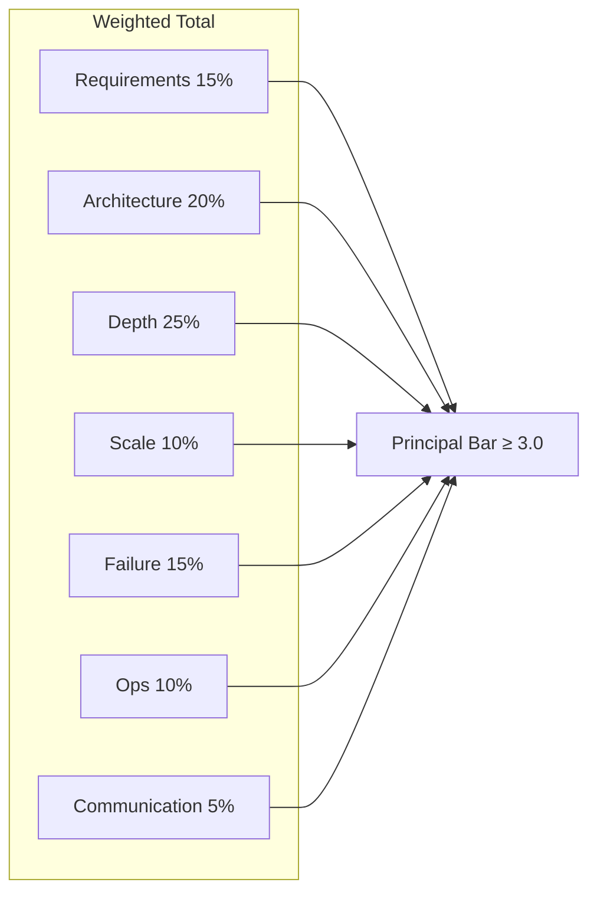

# Principal System Design Scoring Rubric

Scoring framework for **45–60 minute principal architect system design interviews**. Calibrate against hiring committee bar: principal candidates must demonstrate **organizational scope**, **operational realism**, and **explicit tradeoffs**—not only component diagrams.

## When to Use

- Mock interviews and peer practice
- Interviewer calibration before onsite loops
- Self-assessment after timed design sessions
- Homework assignment after weak mock performance

**Related resources:** [Mock Interview Rubric](/docs/mock-interviews/mock-interview-rubric), [System Design Mock](/docs/mock-interviews/system-design-mock), [System Design Methodology](/docs/system-design/system-design-methodology)

---

## Universal Scale

| Score | Label | Hiring analog |
|-------|-------|---------------|
| 4 | Strong | Strong Hire — exceeds bar; would advocate |
| 3 | Good | Hire — meets bar with minor gaps |
| 2 | Adequate | Lean Hire / Lean No Hire — mixed signals |
| 1 | Weak | No Hire — critical dimension failure |

**Principal pass bar:** Weighted average ≥ **3.0** with **no dimension below 2** in Depth, Failure Modes, or Scope.

---

## Dimensions and Weights

| Dimension | Weight | What interviewers observe |
|-----------|--------|---------------------------|
| Requirements & scope | 15% | Functional/non-functional clarity; non-goals; principal-level scope |
| High-level architecture | 20% | Components, data flow, APIs, trust boundaries |
| Depth & tradeoffs | 25% | Bottleneck deep dive; alternatives rejected with criteria |
| Scale & estimation | 10% | Back-of-envelope QPS, storage, bandwidth; growth assumptions |
| Failure modes & resilience | 15% | Partition, dependency, cascade; degradation strategy |
| Operations & evolution | 10% | Observability, rollout, migration, cost |
| Communication & leadership | 5% | Structure, check-ins, stakeholder framing |



---

## Dimension Anchors

### 1. Requirements & scope (15%)

| Score | Anchors |
|-------|---------|
| **4** | Separates functional from non-functional requirements; states explicit non-goals; quantifies SLAs/SLOs; identifies multi-team or multi-region scope; asks clarifying questions that change design |
| **3** | Covers core requirements and 2–3 NFRs; mentions scale order of magnitude |
| **2** | Lists features but vague on NFRs; jumps to solution before constraints |
| **1** | No requirements phase; designs generic system unrelated to prompt |

**Principal signals:** Connects requirements to business outcomes (revenue, compliance, developer velocity). Names organizational constraints (existing platform, team topology).

**Red flags:** Treats all systems as "infinite scale"; ignores privacy/compliance when prompt implies regulated domain.

---

### 2. High-level architecture (20%)

| Score | Anchors |
|-------|---------|
| **4** | Clear diagram: clients, edge, services, data stores, async paths; API contracts sketched; identifies sync vs async boundaries; names trust zones |
| **3** | Correct major components; reasonable data flow; one integration gap acceptable |
| **2** | Boxes without relationships; missing critical path (e.g., write path for write-heavy system) |
| **1** | Random technology list; no coherent architecture |

**Principal signals:** Explains **why** components exist; references platform reuse vs net-new build; considers Conway's law and ownership.

---

### 3. Depth & tradeoffs (25%)

| Score | Anchors |
|-------|---------|
| **4** | Interviewer-directed deep dive on hardest subsystem; compares ≥2 alternatives; states decision criteria (latency, cost, operability, team skill); acknowledges what design sacrifices |
| **3** | Solid deep dive on one area; mentions one alternative |
| **2** | Surface-level; "we'll use Kafka" without delivery semantics discussion |
| **1** | Cannot explain chosen mechanism; hand-waves consistency or ordering |

**Principal signals:** Links depth to **failure behavior** and **operational cost**; discusses migration from current state.

**Follow-up probes:** "Why not X?" "What breaks at 10× traffic?" "How does this behave under partition?"

---

### 4. Scale & estimation (10%)

| Score | Anchors |
|-------|---------|
| **4** | Order-of-magnitude math: DAU → QPS → storage → bandwidth; states assumptions; identifies first bottleneck from math |
| **3** | Reasonable estimates with minor arithmetic gaps |
| **2** | Vague "millions of users" without derivation |
| **1** | No numbers; or numbers inconsistent with stated requirements |

**Principal signals:** Distinguishes **peak vs average**; discusses hot keys, fan-out, and read/write ratio impact.

---

### 5. Failure modes & resilience (15%)

| Score | Anchors |
|-------|---------|
| **4** | Systematic failure taxonomy: node, AZ, region, dependency, operator error; degradation modes; idempotency and retry strategy; no silent data loss |
| **3** | Covers major failures; reasonable retry/timeout story |
| **2** | "Replicas fix it" without quorum/consistency discussion |
| **1** | "It won't fail" or ignores partial failure |

**Principal signals:** References incident patterns; discusses blast radius, circuit breakers, bulkheads; ties to SLO/error budget.

---

### 6. Operations & evolution (10%)

| Score | Anchors |
|-------|---------|
| **4** | Metrics, logs, traces; alerting on SLOs; rollout strategy (feature flags, canary); schema/API evolution; cost drivers named |
| **3** | Basic monitoring; mentions deployment |
| **2** | Monitoring as afterthought |
| **1** | No ops or evolution path |

**Principal signals:** Runbook mindset; on-call implications; multi-year evolution (sharding, region expansion).

---

### 7. Communication & leadership (5%)

| Score | Anchors |
|-------|---------|
| **4** | Structured narrative; time-boxes sections; checks interviewer priorities; summarizes tradeoffs at end |
| **3** | Generally clear; occasional tangents |
| **2** | Rambling; needs redirection |
| **1** | Cannot follow candidate's logic |

**Principal signals:** Frames recommendations for executive audience; acknowledges cross-team dependencies.

---

## Session Phases (Interviewer Script)

| Phase | Minutes | Interviewer actions |
|-------|---------|---------------------|
| Setup | 2 | State format; invite questions |
| Requirements | 8–10 | Push on NFRs if skipped |
| High-level | 12–15 | Ask for diagram; probe boundaries |
| Deep dive | 15–20 | Pick bottleneck; inject "why not X?" |
| Failure injection | 8–10 | Partition, dependency down, hot key |
| Wrap | 3–5 | Ask for summary tradeoffs |

---

## Failure Injection Menu

Use 1–2 per session based on design:

| Injection | Expected response |
|-----------|-------------------|
| Regional network partition | Degraded mode; consistency choice explicit |
| Primary database failover | RPO/RTO; split-brain prevention |
| Downstream 10× latency | Timeouts, circuit breaker, queue backlog |
| 1000× spike on one key | Hot partition mitigation |
| Bad deploy (20% error rate) | Rollback, feature flag, error budget |

---

## Score Aggregation

```
Total = 0.15×R + 0.20×H + 0.25×D + 0.10×S + 0.15×F + 0.10×O + 0.05×C
```

| Total | Recommendation |
|-------|----------------|
| ≥ 3.5 | Strong principal signal |
| 3.0 – 3.4 | Meets bar; document gaps for committee |
| 2.5 – 2.9 | Below principal bar; staff-level with growth areas |
| < 2.5 | Significant prep needed |

---

## Interviewer Notes Template

```text
Prompt:
Candidate scope claimed:
Requirements score (/4):
Architecture score (/4):
Depth score (/4):
Scale score (/4):
Failure score (/4):
Ops score (/4):
Communication score (/4):
Weighted total:
Strongest signal:
Biggest gap:
Homework chapter:
Overall: Strong Hire / Hire / Lean / No Hire
```

---

## Candidate Self-Assessment Checklist

After each mock, score yourself honestly (1–4) on each dimension:

- [ ] I spent ≥8 minutes on requirements before drawing boxes
- [ ] I stated at least two explicit non-goals
- [ ] I did back-of-envelope math and identified a bottleneck
- [ ] I deep-dived one subsystem with an alternative comparison
- [ ] I explained behavior under partition or dependency failure
- [ ] I mentioned observability tied to SLOs
- [ ] I summarized tradeoffs in the final 2 minutes

**Homework rule:** One gap → one [curriculum chapter](/docs/start-here/curriculum-overview) per week.

---

## Question Bank Cross-Links

Drill by domain after weak mocks:

| Gap | Question bank |
|-----|---------------|
| Consistency / replication | `interview/question-bank/distributed-systems.yaml` |
| Consensus / coordination | `interview/question-bank/consensus.yaml` |
| End-to-end design | `interview/question-bank/system-design.yaml` |
| Strategy / stakeholders | `interview/question-bank/leadership.yaml` |

---

## References

- Public system design interview frameworks (cross-check with curriculum methodology)
- [System Design Methodology](/docs/system-design/system-design-methodology)
- [SLO, SLI, and Error Budgets](/docs/reliability-and-resilience/slo-sli-error-budgets)
- [Architecture Decision Records](/docs/architecture-leadership/architecture-decision-records)
