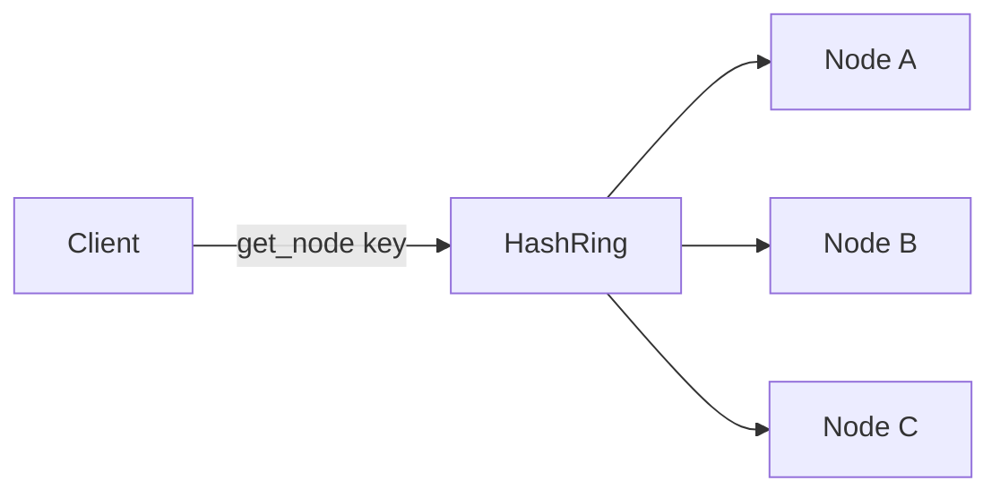

# Lab 001: Consistent Hashing Ring

Implement a **consistent hashing ring** with virtual nodes — the partitioning scheme behind Dynamo, Cassandra, and many distributed caches.

Related chapter: [Distributed Caching](/docs/caching/distributed-caching).

## The problem

**Modulo hashing** (`hash(key) % N`) remaps almost **all keys** when N changes. Consistent hashing maps keys to a ring so only **~1/N keys** move when a node joins or leaves.

## The solution



1. Each physical node places **vnodes** (virtual positions) on a sorted ring
2. `get_node(key)` walks clockwise from `hash(key)` to first ring position
3. **Node add/remove** — only neighboring key ranges remap

## Quick start

```bash
cd labs/lab-001-consistent-hashing
python3 -m venv .venv && source .venv/bin/activate
pip install -r requirements.txt
pytest tests/ -v
python -m src.main --demo
python -m src.main --serve    # http://localhost:8096
```

**Docker:**

```bash
docker compose -p lab001 -f docker/docker-compose.yml up --build -d
curl http://localhost:8096/health
chmod +x scripts/demo_ring.sh && ./scripts/demo_ring.sh
```

## Demo flow

| Step | Endpoint | What happens |
|------|----------|--------------|
| 1 | `GET /v1/lookup/user:42` | Key → owning node (clockwise on ring) |
| 2 | `POST /v1/nodes` | Add node with vnodes |
| 3 | `POST /v1/simulate/balance` | Load distribution CV across nodes |
| 4 | `POST /v1/simulate/churn` | Consistent vs modulo churn on node add |
| 5 | `POST /v1/simulate/node-failure` | ~1/N keys redistributed |

**Swagger:** http://localhost:8096/docs

## Tests

```bash
pytest tests/ -v
```

## Interview discussion

**Expected signals:**

- O(log V) lookup with V vnodes vs O(1) modulo
- Vnodes improve **load balance**; ring minimizes **key churn**
- Does **not** fix hot keys — single key still hits one node

**Red flags:**

- Claims consistent hashing eliminates hot partitions
- Confuses vnode count with replication factor

## References

- Karger et al. (1997); DeCandia et al., Dynamo (2007)
- [Distributed Caching](/docs/caching/distributed-caching)
- [Lab 004 Replicated KV](../lab-004-replicated-kv-store/) — uses hash routing per shard
