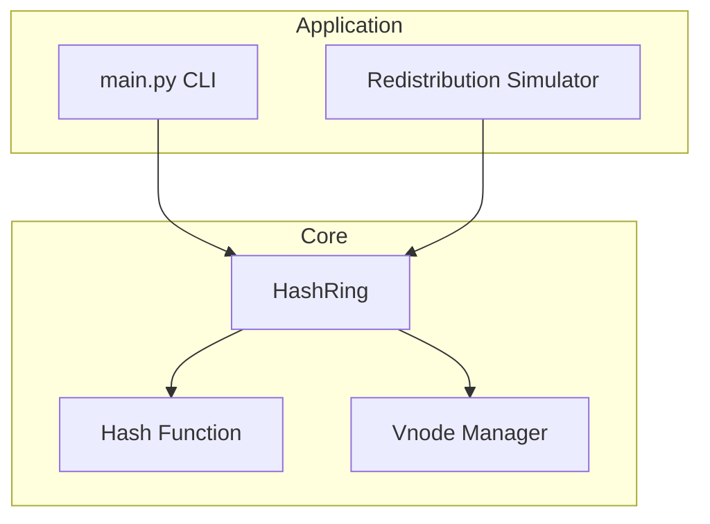
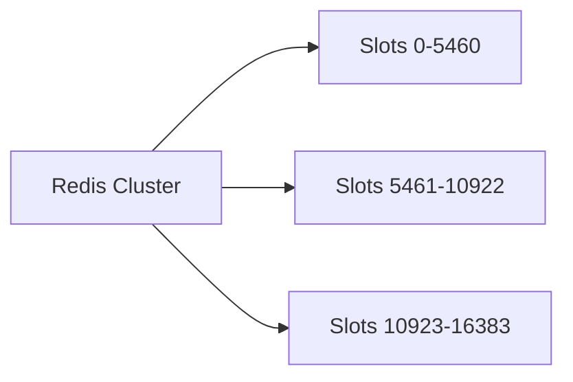

# Lab 001: Architecture

## Overview

This lab implements an in-process **consistent hash ring** suitable for learning production partitioning mechanics. The design mirrors concepts in Dynamo-style systems while remaining deliberately simple — no network RPC, no persistence, no gossip protocol.

## Components

*Figure 1: Core ring logic isolated from CLI and simulation.*

| Component | Responsibility |
|-----------|----------------|
| `HashRing` | Sorted ring positions, membership CRUD, lookup |
| `HashFunction` | Stable, deterministic position on [0, 2^64) |
| `VnodeManager` | Expand physical node → vnode positions |
| `RedistributionSimulator` | Compare churn vs modulo hashing |
| `main.py` | CLI demo and failure injection |

## Hash Ring Mechanics

### Ring representation

The ring is a sorted mapping `position: int → node_id: str`. Positions are 64-bit integers from SHA-256(key) truncated.

### Lookup algorithm

1. `h = hash(key)`
2. Find smallest `position` where `position >= h` (binary search)
3. If none exist, wrap to `min(positions)` — ring is circular

**Safety:** Lookup on empty ring raises `RingEmptyError` — fail fast rather than return arbitrary node.

**Liveness:** Lookup is O(log V) where V = total vnodes.

### Virtual nodes

Physical nodes differ in capacity. Virtual nodes map one physical machine to multiple ring positions, smoothing load distribution.

| Vnodes per node | Typical CV (100k keys, 10 nodes) |
|-----------------|--------------------------------|
| 16 | Higher imbalance |
| 64 | Moderate |
| 128 | Production-common default in teaching examples |
| 256 | Diminishing returns |

*CV = coefficient of variation of keys per node; exact values depend on hash distribution.*

### Membership changes

**Add node:** Insert vnode positions. Only keys whose successor was the new node's neighbors may move — approximately `1/(N+1)` of keyspace in expectation for uniform hashes.

**Remove node:** Delete vnode positions. Keys owned by removed node redistribute to clockwise successor — approximately `1/N` of keyspace.

## Comparison: Modulo vs Consistent Hashing

| Aspect | `hash(key) % N` | Consistent hashing |
|--------|-----------------|-------------------|
| Add node churn | ~100% keys may remap | ~1/N keys |
| Implementation | Trivial | Ring + vnodes |
| Hot spot mitigation | Poor | Vnodes help balance |
| Range queries | Possible with ordered keys | Not natural on ring |

## Optional Docker Topology

`docker/docker-compose.yml` provisions a 3-node Redis Cluster for observing **hash slots** (16384 fixed slots) vs your ring implementation. Redis uses CRC16 mod 16384 — a **slot-based** variant of consistent partitioning, not identical to vnode rings but conceptually related.

## Failure and Consistency Model

This lab is **single-process**. There is no replication or consensus.

| Property | This lab | Production (e.g., Cassandra) |
|----------|----------|------------------------------|
| Ring view consistency | Single thread | Gossip / config service |
| Key durability | In-memory only | SSTables + replication |
| Split brain | N/A | Quorum reads/writes |

When extending to a distributed ring, introduce a **ring version** and require clients to refresh on `RingChanged` errors — analogous to Redis `MOVED` redirects.

## Related Documentation

- [Distributed Caching](/docs/caching/distributed-caching)
- [Leaderless Replication](/docs/07-replication/leaderless-replication)
- [Amazon Dynamo](/docs/distributed-databases/amazon-dynamo)
