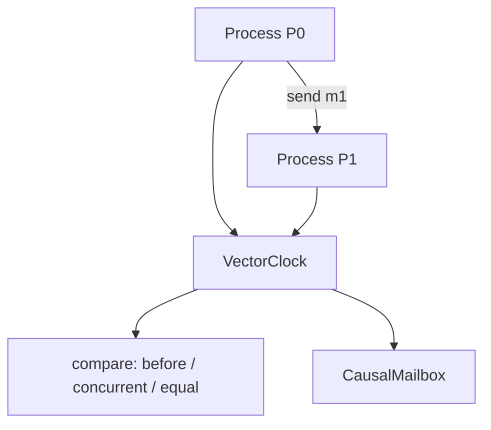

# Lab 002: Vector Clocks and Causal Ordering

Implement **vector clocks** for a simulated multi-process system and use them to track causal relationships, classify event pairs, and enforce **causal delivery** of messages.

Related chapters: [Vector Clocks](/docs/time-ordering-and-coordination/vector-clocks), [Conflict Resolution](/docs/replication/conflict-resolution).

## The problem

Lamport clocks give a total order but **cannot detect concurrency**. Vector clocks track per-process counters so you can tell whether two events are causally ordered or concurrent — essential for sibling detection in Dynamo-style stores and causal message delivery.

## The solution



1. Each process maintains vector `V`; local/send/receive rules update components
2. `compare(a, b)` classifies clocks as before / after / concurrent / equal
3. **CausalMailbox** buffers out-of-order messages until dependencies are satisfied

## Quick start

```bash
cd labs/lab-002-vector-clocks
python3 -m venv .venv && source .venv/bin/activate
pip install -r requirements.txt
pytest tests/ -v
python -m src.main --demo
python -m src.main --serve    # http://localhost:8097
```

**Docker:**

```bash
docker compose -p lab002 -f docker/docker-compose.yml up --build -d
curl http://localhost:8097/health
chmod +x scripts/demo_clocks.sh && ./scripts/demo_clocks.sh
```

## Demo flow

| Step | Endpoint | What happens |
|------|----------|--------------|
| 1 | `GET /v1/processes` | View P0, P1 clocks (seeded on startup) |
| 2 | `POST /v1/events/local` | Local event increments `V[process_id]` |
| 3 | `POST /v1/messages/send` | Send with clock snapshot; causal buffer applies |
| 4 | `GET /v1/mailbox/delivered` | Messages in causal delivery order |
| 5 | `POST /v1/clocks/compare` | Classify two clocks (before / concurrent / equal) |

**Swagger:** http://localhost:8097/docs

## Tests

```bash
pytest tests/ -v
```

| Test | Validates |
|------|-----------|
| `test_increment_local` | Local event rule |
| `test_merge_on_receive` | Max-merge per component + increment |
| `test_compare_before` | Transitive causal order |
| `test_compare_concurrent` | Independent branches |
| `test_causal_delivery` | Out-of-order buffer |
| `test_sibling_detection` | Concurrent writes on same key |
| `test_http_*` | API endpoints via FastAPI TestClient |

## Failure injection

```bash
python -m src.main --inject delayed-message
python -m src.main --inject duplicate-delivery
```

| Scenario | Expected behavior |
|----------|-------------------|
| Delayed message | Causal buffer holds m2 until m1 delivers |
| Duplicate delivery | Idempotent delivery by message ID |

## Interview discussion

**Expected signals:**

- Distinguishes **vector clock** (per process) vs **version vector** (per replica for one object)
- States safety: `e → f` implies `V(e) < V(f)`; converse holds only without concurrency
- Explains why Dynamo uses version vectors for sibling detection
- Names scalability limit (O(n) per message) and mitigation strategies

**Red flags:**

- Claims vector clocks provide total order of all events
- Confuses Lamport timestamps with concurrency detection

## References

- Fidge (1988); Mattern (1989) — vector clock foundations
- DeCandia et al., Dynamo (2007)
- [Vector Clocks](/docs/time-ordering-and-coordination/vector-clocks)
- [Conflict Resolution](/docs/replication/conflict-resolution)

See also [architecture.md](./architecture.md) and [requirements.md](./requirements.md).
