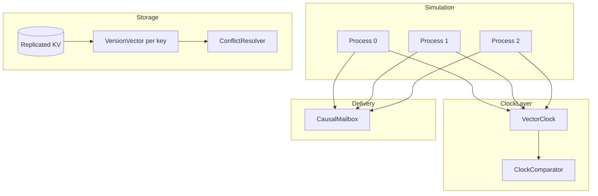
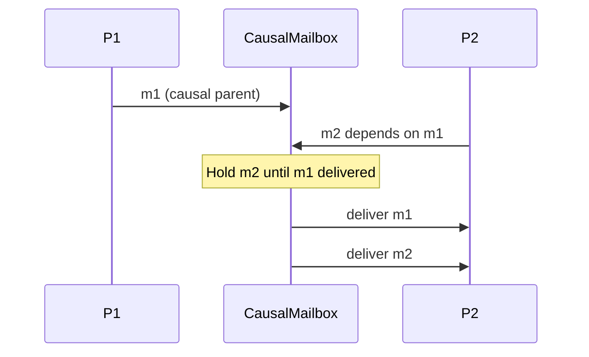

# Lab 002: Architecture

## Overview

Simulated message-passing system where each process maintains a **vector clock**. The lab separates three related structures that interviews conflate:

| Structure | Indexed by | Used for |
|-----------|------------|----------|
| Lamport clock | Single integer | Total order compatible with causality |
| Vector clock | Process ID | Global event causality |
| Version vector | Replica ID | Per-object divergence |

## Component Diagram

## Vector Clock Rules

For process `P_i` with vector `V`:

1. **Local event:** `V[i] += 1`
2. **Send:** attach `V.copy()` to message; then `V[i] += 1`
3. **Receive** message with `V_m` from `P_j`: `V[k] = max(V[k], V_m[k])` for all k; then `V[i] += 1`

## Comparison Algebra

Given vectors `A` and `B`:

- `A ≤ B` iff ∀k: A[k] ≤ B[k] and ∃j: A[j] < B[j] → **A before B**
- `A = B` component-wise → **equal**
- Neither `A ≤ B` nor `B ≤ A` → **concurrent**

**Safety property:** If event e happens-before f, then `V(e) ≤ V(f)` (not strict if same event).

**Limitation:** `V(e) ≤ V(f)` does not imply e → f when vectors are equal or when comparing unrelated system snapshots.

## Causal Delivery

`CausalMailbox` maintains:

- `delivered: Set[message_id]`
- `pending: PriorityQueue` keyed by (cannot deliver yet)

Deliver message `m` only when for every message `m'` where `m'.clock < m.clock` (causally), `m'` is already delivered.

## Replicated KV Conflict Model

Each `Put(key, value, version_vector)`:

1. Load current version vector for `key`
2. Compare incoming vs stored
3. If **before**: apply update (descendant wins)
4. If **concurrent**: invoke `ConflictResolver` (LWW or siblings)
5. If **after**: reject or merge per policy

## Process Model Assumptions

- Static membership: process IDs `0..n-1` fixed
- Crash-stop: no Byzantine clock forgery in base lab
- Reliable channels with arbitrary delay (reordering allowed)

## Related Documentation

- [Vector Clocks](/docs/time-ordering-and-coordination/vector-clocks)
- [Causal Consistency](/docs/consistency/causal-consistency)
- [Leaderless Replication](/docs/replication/leaderless-replication)
