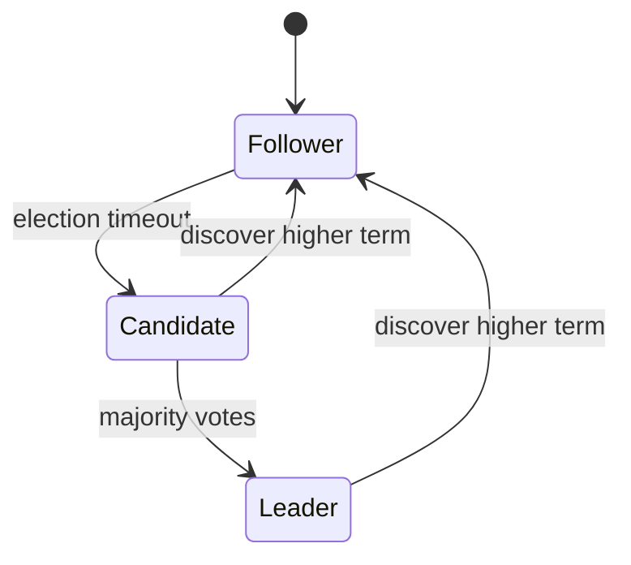

# Lab 003: Raft Consensus Simulation

## Objective

Build a **multi-node Raft simulation** that implements core safety mechanisms from the Raft paper (Ongaro & Ousterhout, 2014):

1. Leader election with randomized timeouts and term monotonicity.
2. Log replication via `AppendEntries` RPC.
3. Commit index advancement when entries are replicated on a majority.
4. Log matching and conflict truncation on divergent followers.

You will run a 3–5 node cluster in Docker, inject leader failures, and verify **election restriction** prevents committed entry loss.

See [architecture.md](./architecture.md) and [requirements.md](./requirements.md).

## Prerequisites

- Read [Raft Consensus](/docs/consensus/raft) — full mechanism and safety argument.
- Read [Leader Election](/docs/consensus/leader-election).
- Read [Safety and Liveness](/docs/distributed-systems-foundations/safety-and-liveness).
- Go 1.22+ and Docker Compose.

## Architecture



*Figure 1: Raft node states.*

Cluster topology in Docker: 3 peers with persistent log directories. Full design: [architecture.md](./architecture.md).

## Setup

```bash
cd labs/lab-003-raft-simulation
go mod tidy
go test ./...
docker compose -f docker/docker-compose.yml up -d --build
```

Verify cluster:

```bash
go run ./src/main.go --client put key1 value1
go run ./src/main.go --client get key1
```

## Implementation Steps

### Step 1: Persistent state

Per server: `currentTerm`, `votedFor`, `log[]` with `(term, command)` entries. Implement `persist()` / `readPersist()` (file or in-memory for tests).

### Step 2: Follower and election

Implement election timeout (150–300ms randomized). On timeout, transition to Candidate, increment term, vote for self, send `RequestVote` RPCs.

**Checkpoint:** At most one leader per term in simulation traces.

### Step 3: RequestVote safety

Grant vote only if candidate's log is **at least as up-to-date** (compare last term, then length).

### Step 4: AppendEntries replication

Leader sends heartbeats and new entries. Follower rejects if `prevLogIndex/Term` mismatch; on success append and update `commitIndex`.

### Step 5: Commit and apply

Leader advances `commitIndex` when entry from **current term** is on majority. Apply committed entries to deterministic state machine (`KVStore`).

### Step 6: Client interaction

Clients send writes to leader; followers redirect with `NOT_LEADER` and leader hint.

## Tests

```bash
go test ./tests/... -v -race
go test ./tests/... -run TestElection -v
go test ./tests/... -run TestCommitSafety -v
```

| Test | Validates |
|------|-----------|
| `TestSingleLeaderPerTerm` | Safety |
| `TestElectionAfterLeaderCrash` | Liveness after failure |
| `TestLogReplication` | Entries replicate to majority |
| `TestCommitSafety` | Committed entries survive election |
| `TestConflictTruncation` | Divergent logs converge |

## Failure Injection

| Scenario | Command | Expected |
|----------|---------|----------|
| Leader kill | `docker kill raft-node-1` | New leader elected < 2s |
| Network partition | `tc netem` or compose network split | Minority partition cannot commit |
| Slow follower | Artificial RPC delay | Leader retries; eventually catches up |
| Duplicate RPC | Replay AppendEntries | Idempotent append |

```bash
go run ./src/main.go --chaos leader-kill
go run ./src/main.go --chaos partition
```

## Observability

Structured logs per RPC:

```json
{"term": 3, "role": "leader", "rpc": "AppendEntries", "peer": 2, "matchIndex": 5}
```

Metrics (Prometheus optional):

- `raft_state{role=}`
- `raft_term_current`
- `raft_commit_index`
- `raft_election_timeout_fired_total`

Trace visualization: export term/role timeline for interview whiteboard replay.

## Security

Raft assumes **crash-stop**, not Byzantine peers. mTLS between peers in production; this lab uses plain HTTP/gRPC on isolated Docker network.

Clients must use **linearizable write** semantics via leader; stale leader must step down on higher term.

## Cost Controls

Local Docker only. In production, Raft clusters (etcd, Consul) cost:

- 3+ nodes for quorum (always-on)
- SSD for WAL latency
- Cross-AZ latency affects election timeout tuning

Rule of thumb: election timeout ≥ 10× RTT p99 between peers.

## Cleanup

```bash
docker compose -f docker/docker-compose.yml down -v
rm -rf data/
```

## Interview Discussion

**Expected signals:**

- Explains **election restriction** and **log matching property**.
- Derives why committed entries cannot be lost.
- Separates Raft safety from application idempotency.
- Discusses read index / lease reads for linearizable reads.

**Follow-ups:**

- How do joint consensus membership changes work?
- What breaks with asymmetric partitions?
- etcd vs Consul operational differences?

**Red flags:**

- Claims Raft solves split-brain without quorum.
- Confuses `commitIndex` with `lastApplied` on followers.

## Extension Exercises

1. Implement **prevote** to reduce disruption.
2. Add **snapshot** and log compaction.
3. Implement **joint consensus** for membership change.
4. Compare with [Paxos](/docs/consensus/paxos) operationally.
5. Wire to [etcd architecture patterns](/docs/consensus/etcd) (read-only study).

## References

- Ongaro & Ousterhout, "In Search of an Understandable Consensus Algorithm (Extended Version)" (2014)
- [Raft Consensus](/docs/consensus/raft)
- Raft user-facing site: https://raft.github.io/
