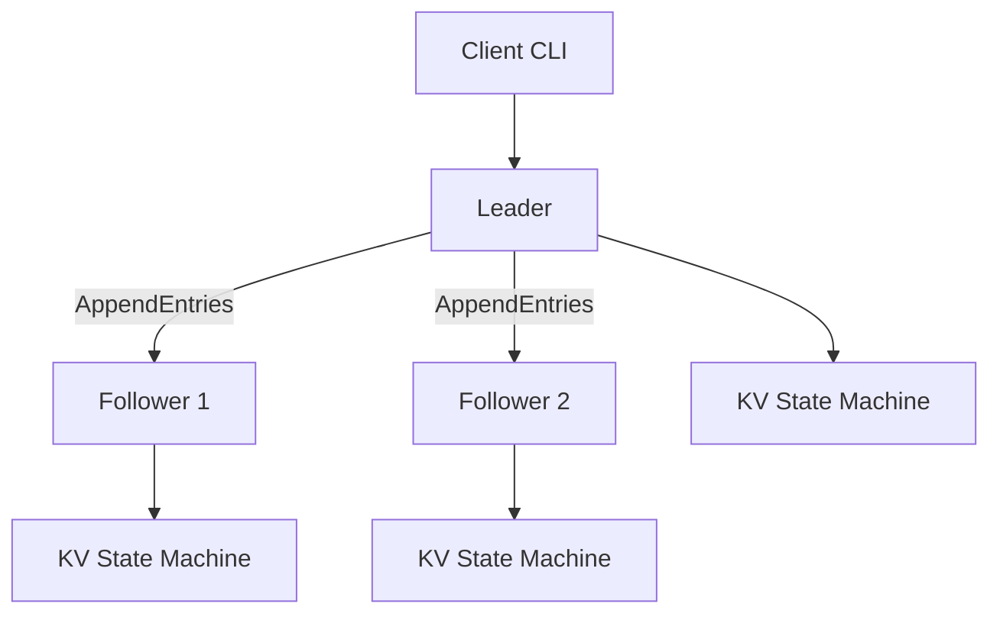
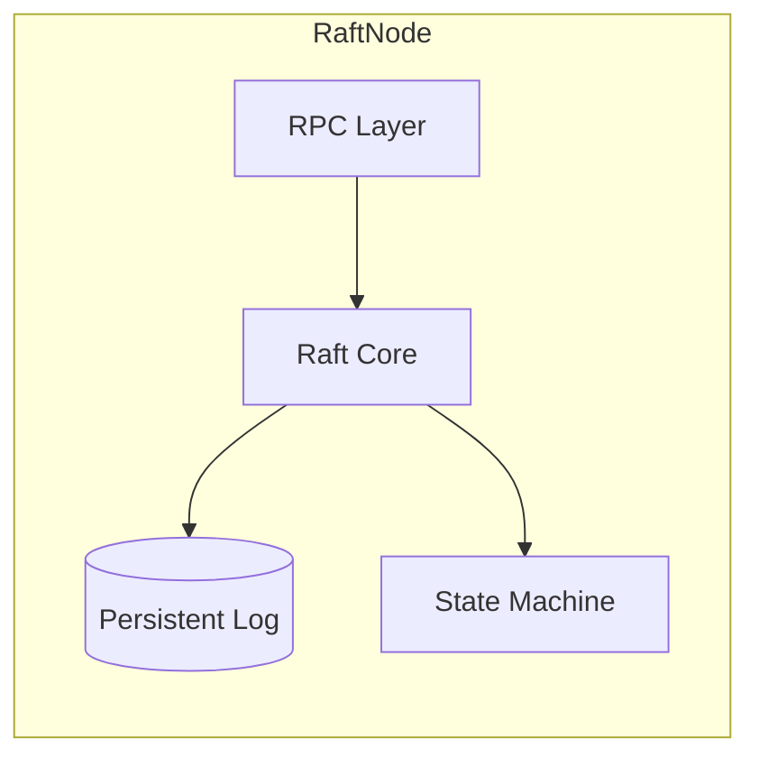
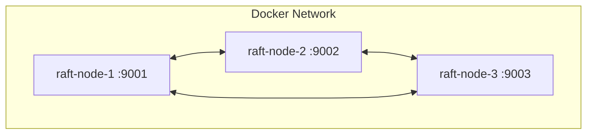
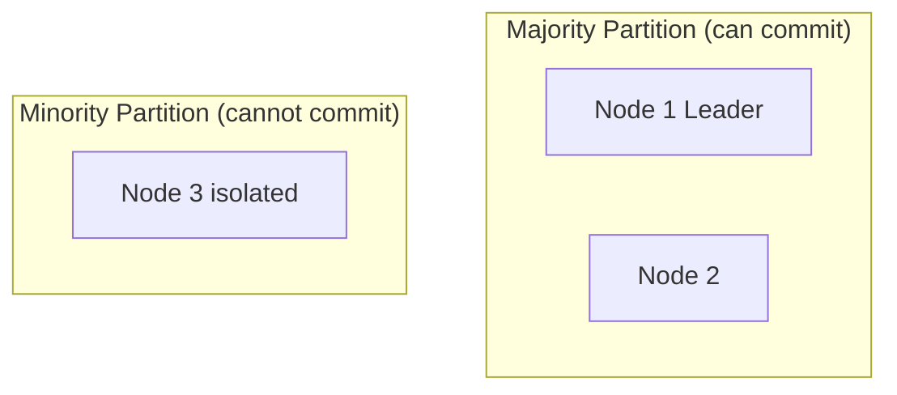

# Lab 003: Architecture

## System Context

A minimal **Replicated State Machine** where client commands (`Put`, `Get`) flow through Raft log replication. Each node runs identical deterministic `KVStore` logic applied in log order.



## Node Internals



| Module | File | Responsibility |
|--------|------|----------------|
| `raft.go` | Core FSM | Terms, votes, replication |
| `rpc.go` | HTTP/gRPC | RequestVote, AppendEntries |
| `log.go` | Entry store | Indexed (term, command) log |
| `kv.go` | Application | Deterministic command apply |
| `main.go` | Entrypoint | CLI, server bootstrap |

## RPC Definitions

### RequestVote

```
RequestVoteArgs:  term, candidateId, lastLogIndex, lastLogTerm
RequestVoteReply: term, voteGranted
```

### AppendEntries

```
AppendEntriesArgs:  term, leaderId, prevLogIndex, prevLogTerm, entries[], leaderCommit
AppendEntriesReply: term, success, matchIndex
```

## Safety Properties

| Property | Mechanism |
|----------|-----------|
| **Election safety** | At most one leader per term |
| **Leader append-only** | Leader never overwrites/deletes own entries |
| **Log matching** | Same index+term → identical prefix |
| **Leader completeness** | Committed entries appear in future leader logs |
| **State machine safety** | Same commands → same state on all nodes |

## Liveness Properties

| Property | Requirement |
|----------|-------------|
| **Leader election** | Eventually a leader if majority reachable |
| **Replication** | Committed entries eventually applied everywhere |

**Partial synchrony:** Election timeouts must exceed network delay for liveness — not guaranteed under arbitrary delays (FLP context).

## Docker Cluster



Each container mounts `./data/node-{id}` for log persistence across restarts.

## Failure Boundaries



Minority leader (if any) cannot commit new entries from prior terms; clients see unavailability or stale reads depending on implementation.

## Related Documentation

- [Raft](/docs/consensus/raft)
- [Membership Changes](/docs/consensus/membership-changes)
- [Linearizability](/docs/consistency/linearizability)
