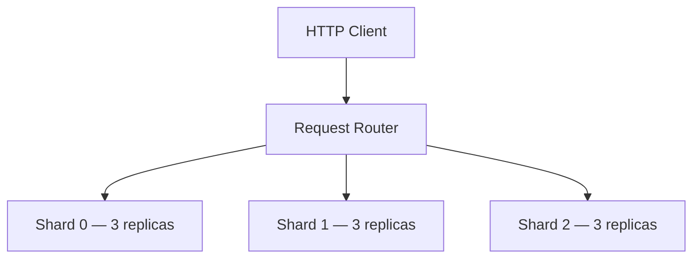

# Lab 004: Replicated Key-Value Store

Build a **production-shaped replicated KV store**: consistent-hash sharding, per-shard quorum replication (N=3, R=2, W=2), quorum reads, and read repair.

Related chapter: [Quorum Systems](/docs/consistency/quorum-systems).

## Architecture



1. **Router** — `hash(key) % 3` picks shard (consistent hashing stand-in)
2. **Write path** — replicate to **W=2** replicas on that shard
3. **Read path** — read **R=2** replicas, return highest **version**
4. **Read repair** — push latest version to lagging replicas on read

## Quick start

```bash
cd labs/lab-004-replicated-kv-store
go test ./... -v
go run ./src/main.go --demo
go run ./src/main.go --serve    # http://localhost:8095
```

**Docker:**

```bash
docker compose -p lab004 -f docker/docker-compose.yml up --build -d
curl http://localhost:8095/health
chmod +x scripts/demo_kv.sh && ./scripts/demo_kv.sh
```

## Demo flow

| Step | Endpoint | What happens |
|------|----------|--------------|
| 1 | `PUT /v1/keys/user:42` | Write to W=2 replicas on routed shard |
| 2 | `GET /v1/keys/user:42` | Quorum read — highest version wins |
| 3 | `GET /v1/keys/user:42/replicas` | Per-replica version inspection |
| 4 | `POST /v1/chaos/replica-down` | Simulate replica failure |
| 5 | `GET /v1/keys/user:42?repair=true` | Read + repair lagging replicas |

**Swagger:** http://localhost:8095/docs

## Quorum config

| N | R | W | Guarantee |
|---|---|---|-----------|
| 3 | 2 | 2 | R+W>N → overlapping quorum (with versions) |

## Tests

```bash
go test ./... -v
```

| Test | Validates |
|------|-----------|
| `TestPutGetSingleShard` | HTTP CRUD |
| `TestQuorumRead` | R-of-N read semantics |
| `TestReadRepair` | Stale replica healed |
| `TestShardFailover` | Writes with 1 replica down |
| `TestCrossShard` | Keys route to different shards |
| `TestReplicaDownBlocksQuorum` | 2 down → write fails |

## Interview discussion

**Expected signals:**

- Explains **per-shard replication** scales vs single global Raft
- States quorum condition **R + W > N** for strong read-your-writes
- Describes **read repair** as anti-entropy on the read path

**Red flags:**

- Claims linearizability across entire keyspace without coordination
- Ignores version conflicts on concurrent writes

## References

- [Quorum Systems](/docs/consistency/quorum-systems)
- [Raft](/docs/consensus/raft)
- [Lab 003 — Raft Simulation](../lab-003-raft-simulation/)
