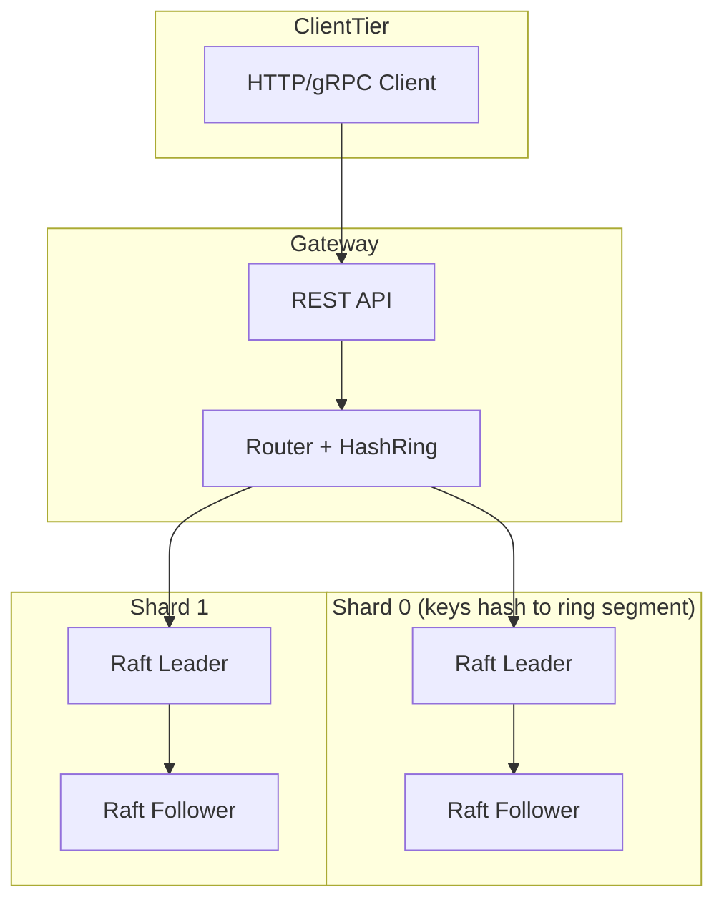
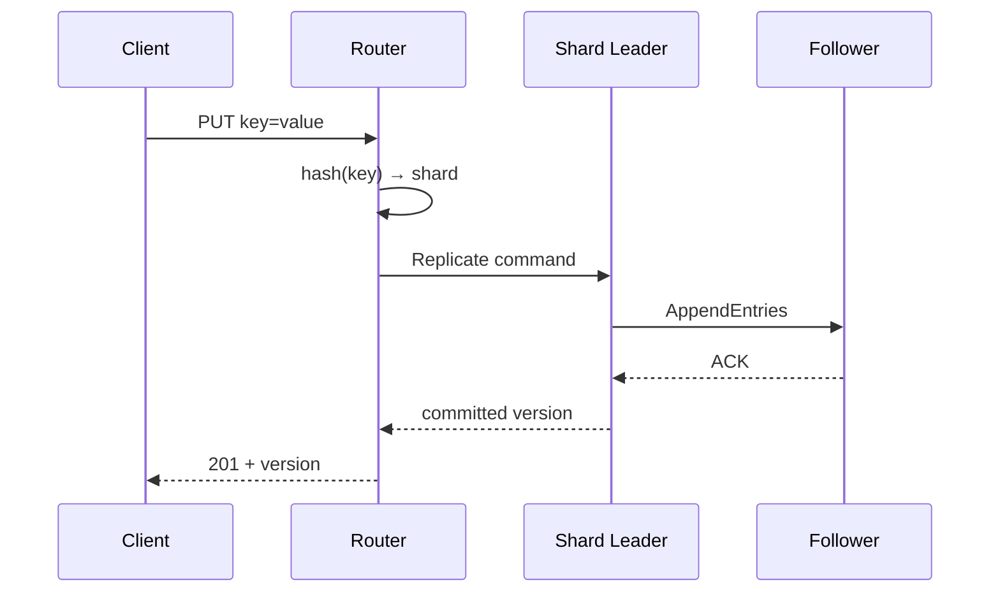
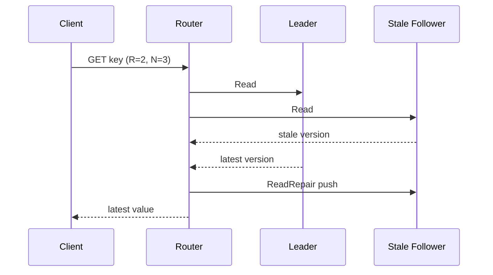

# Lab 004: Architecture

## Overview

Multi-tier architecture separating **routing**, **sharding**, and **replication** — the pattern used by TiKV, CockroachDB (range-based variant), and Dynamo-family systems.



## Write Path



## Read Path with Repair



## Quorum Configuration

| Mode | N | R | W | Guarantee (with versions) |
|------|---|---|---|---------------------------|
| Strong | 3 | 2 | 2 | R+W>N → overlapping quorum |
| Fast write | 3 | 1 | 2 | Eventual read risk |
| Fast read | 3 | 2 | 1 | Stale write risk |

**Safety:** Version comparison prevents returning arbitrarily stale values when `R+W>N` and versions are checked on read (Dynamo model).

**Liveness:** Sloppy quorum + hinted handoff improves write availability during replica failure at cost of complexity.

## Component Responsibilities

| Component | Responsibility |
|-----------|----------------|
| `HashRing` | Key → shard mapping (from Lab 001) |
| `ShardManager` | Shard → peer list, leader hints |
| `RaftGroup` | Per-shard consensus (from Lab 003) |
| `KVStore` | Versioned key-value state machine |
| `ReadRepair` | Anti-entropy on read path |
| `HintedHandoff` | Temporary write buffering |

## Docker Topology

6 containers: `kv-0a`, `kv-0b`, `kv-1a`, `kv-1b`, `kv-2a`, `kv-2b` plus optional `gateway`.

Each node knows `--shard-id`, `--peer-list`, `--node-id`.

## Data Model

```
Key:   string (UTF-8)
Value: bytes (JSON in API)
Version: vector clock OR monotonic hybrid timestamp
Tombstone: for deletes (replication of deletion)
```

## Related Documentation

- [Amazon Dynamo](/docs/distributed-databases/amazon-dynamo)
- [Leaderless Replication](/docs/replication/leaderless-replication)
- [Distributed Cache Design](/docs/system-design/distributed-cache-design)
